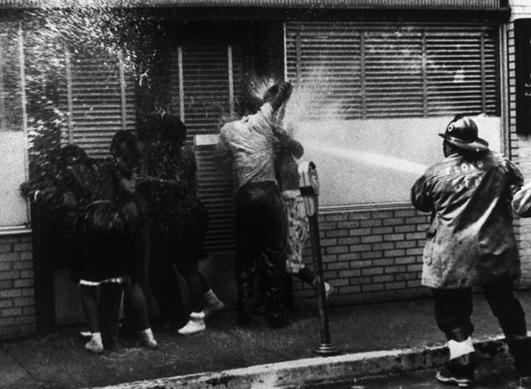
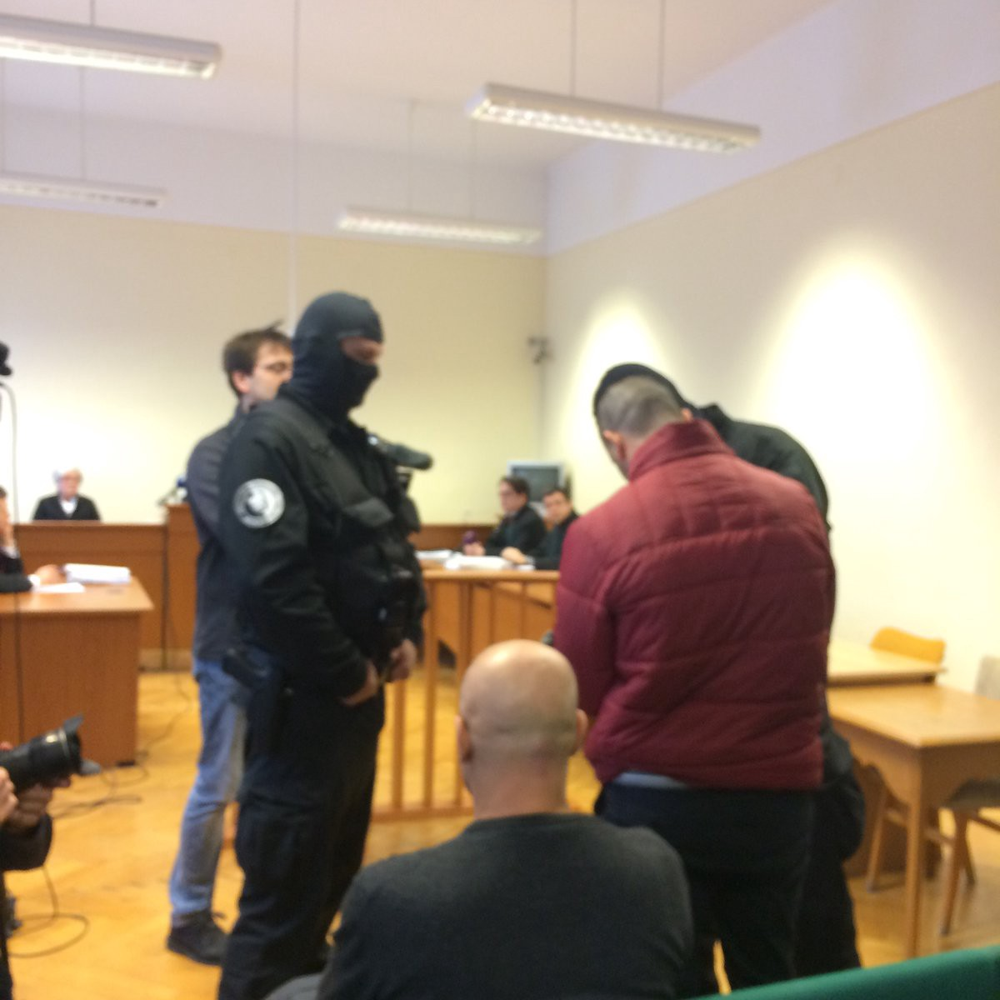
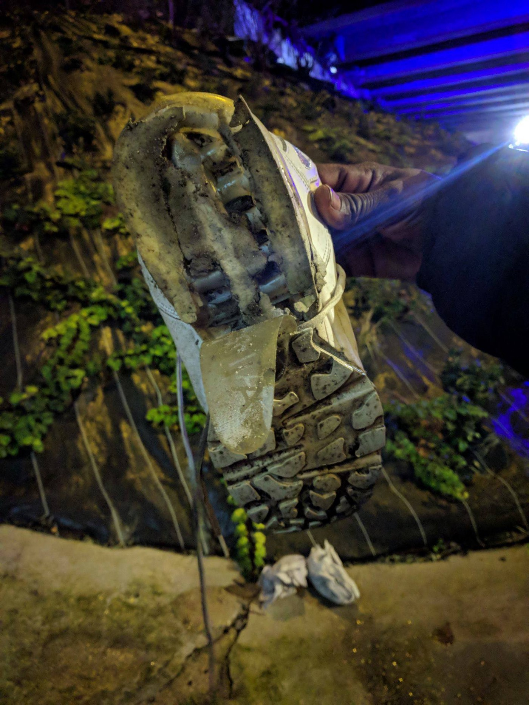

### AYS Daily Digest 10/01/18: Over 200 people have died on the sea so far this year

_Countering false reports about the White Helmets / Italy complicit in Libyan crimes / Baobab defends refugees in Italy / Greece cleans up Moria camp when eyes are watching / No fair trial for Ahmed in Hungary / Donations needed in France / Volunteering in Switzerland / And more news…_

 \)](assets/34e73b41e11/1*qlfm2vzEVi9JWtlQ3cq4SQ.jpeg)

Idriss is a young man from Sierra Leone who left for Europe to make money to pay for his mother’s medical bills\. Upon arrival in Libya, he was kidnapped by a gang of men and held for ransom\. When he tried to escape, one of the guards bit his ear off\. \(Story and photo by [Sea Watch](https://www.facebook.com/seawatchprojekt/) \)
### SEA

According to a spokesperson from the IOM \(International Organisation for Migration\), over 200 people have already lost their lives in the Mediterranean this year\. Today there was another reported shipwreck, and over [100 refugees are still missing](http://www.tgcom24.mediaset.it/mondo/migranti-affonda-gommone-al-largo-della-libia-almeno-50-morti-100-le-persone-disperse_3116423-201802a.shtml) from this incident\. Oscar Camps, the founder of the sea rescue NGO Open Arms [asked today](https://twitter.com/campsoscar/status/951102002309804032) , “How many more summits are needed to end this holocaust?”

■■■■■■■■■■■■■■ 
> **[Flavio Di Giacomo](https://twitter.com/fladig) @ Twitter Says:** 

> > Another dramatic incident off the Libyan coast: up to 100 migrants remain missing in the third deadly shipwreck on the Mediterranean Sea since Saturday. 
More than 200 #migrants lost their life at sea in 2018. [twitter.com/UNmigration/st…](https://twitter.com/UNmigration/status/951051660746424320) 

> **Tweeted at [2018-01-10 11:54:03](https://twitter.com/fladig/status/951059557777838080).** 

■■■■■■■■■■■■■■ 

■■■■■■■■■■■■■■ 
> **[IOM - UN Migration 🇺🇳](https://twitter.com/UNmigration) @ Twitter Says:** 

> > Heartbreaking.

One week into 2018, there already are reports of 200 #migrants and #refugees missing at sea: [bit.ly/2DfmdmY](http://bit.ly/2DfmdmY) https://t.co/zFDoxJH0rP 

> **Tweeted at [2018-01-10 11:22:40](https://twitter.com/unmigration/status/951051660746424320).** 

■■■■■■■■■■■■■■ 

These people are not “migrants,” as IOM spokesperson Di Giacomo puts it\. What does it even mean to call someone willing to risk their life to escape somewhere a migrant?

The situation is heartbreaking\. But what is the IOM going to do about it? The UN and IOM need to stand firmly against the criminal deals between Libya, Turkey, and the EU\. We are tired of hollow statements, what we need is action\.

At least six refugees have been [reported drowned](http://missingmigrants.iom.int/region/mediterranean) between Spain and Morocco this week\. Yet, so far in 2018, the vast majority of deaths have been from un\-seaworthy ships leaving Libya\. Hundreds have already died leaving Libya this year — and the numbers seem to be rising every day\. But these are not numbers, they are human lives\. We cannot forget this\.

While we could find no reports of deaths between the Greek\-Turkish sea border, there has been an increase in new arrivals\. According to UNHCR data from January 8th, there were 730 new arrivals to the Greek islands this year already\. By today, there have been at least 826 new arrivals\.

Many have speculated that the recent spike in boats leaving Turkey and making it past the Turkish Coast Guard is related to Greece’s granting asylum status to a defected Turkish soldier \(although his protection was recently revoked, and the case is currently in limbo\) \. The Turkish government threatened “consequences” for the soldier who got asylum, and their primary power over Greece and the EU is controlling the flow of refugees\. The EU has attempted to outsource the refugee crisis to two oppressive states, one almost entirely lawless, the other brutally authoritarian\. While politicians pretend that there are structures and checks in support and that the money they are paying off is going to NGOs, it is an open secret that the money is in fact going to criminals, kidnappers, and torturers\.

> The EU\-Turkey and Libya deals are money to hide the blood\. 

EU politicians are in a position of weakness in regards to Libya and Turkey\. The EU is caving into the demands of autocrats and thugs, ignoring the killings happening right under their noses\. Greek courts have already reversed the decision granting asylum to the Turkish officer in question\. Likely the Turkish government will torture the officer if he is deported, but does the EU really care about that? More importantly, Turkey has sent its usual threat — “look how many people we let escape in a week\.”

The SMH rescue team saved 61 people in the Mediterranean today and dropped them in the port of Motril, Spain\.

A Spanish naval ship rescued 95 people today and disembarked them at the port of Augusta\.

■■■■■■■■■■■■■■ 
> **[Othman Belbeisi](https://twitter.com/OthmanBelbeisi) @ Twitter Says:** 

> > It’s very distressing that during first 10 days of 2018 we have seen close to 800 migrants rescued or intercepted off Libyan coast with more lives lost at sea More has to be done 2 reduce irregular unsafe movements of people along CentralMediterraneanRoute [bit.ly/2FnDv26](http://bit.ly/2FnDv26) https://t.co/rELTmm2Qbj 

> **Tweeted at [2018-01-10 13:38:54](https://twitter.com/othmanbelbeisi/status/951085945037737984).** 

■■■■■■■■■■■■■■ 

The Libyan Navy [announced on Tuesday](https://www.libyaobserver.ly/inbrief/libyan-navy-releases-official-rescue-statistics-2017) that it had “rescued” \(read: forcibly deported back to awful conditions and possible death\) 15,810 refugees in 2017, according to statistics published by its Media Office\.

■■■■■■■■■■■■■■ 
> **[Michael Räber](https://twitter.com/iwatnew) @ Twitter Says:** 

> > Rubber boat with ~40 #refugeesGr people heading to #Lesvos #Greece sinking off coast #Aliaga #Turkey tonight. #TCG Turkish Coast Guard engaged, speed boat and helicopter involved in operation. #humanrights #Europe #safepassage https://t.co/eSSaUy7YA9 

> **Tweeted at [2018-01-10 22:36:49](https://twitter.com/iwatnew/status/951221315905695749).** 

■■■■■■■■■■■■■■ 

### SYRIA

Syrians living in the Damascus suburb of East Ghouta have faced unimaginable suffering in the past months\. Food convoys have been unable to access the region, and there is widespread starvation\. The area is also facing daily shelling which is taking a massive toll on civilians there\. The UN human rights chief, Zeid Al Hussein, [said today](https://reliefweb.int/report/syrian-arab-republic/syria-zeid-condemns-upsurge-civilian-casualties-eastern-ghouta-and-idlib) , “In Eastern Ghouta, where a crippling siege has caused a humanitarian catastrophe, residential areas are being hit day and night by strikes from the ground and from the air, forcing civilians to hide in basements\. Armed opposition groups also continue to fire rockets into residential areas in Damascus, causing terror among the population\.”

 now in only three words… it’s raining mortars\.”
 — [Firas Abdullah](https://www.facebook.com/Firas.Al.Abdullah) in Eastern Ghouta \(Photo from Abdulmonam Eassa\)](assets/34e73b41e11/1*MGx7nv9NhpN9oG2m05oUTg.jpeg)

“I can explain the scene in [\#Douma\_city](https://www.facebook.com/hashtag/douma_city) now in only three words… it’s raining mortars\.”
 — [Firas Abdullah](https://www.facebook.com/Firas.Al.Abdullah) in Eastern Ghouta \(Photo from Abdulmonam Eassa\)

While UN officials are quick to condemn these attacks, they have been noticeably short on providing solutions and action\. Today we are forwarding an important message from the [Syria Campaign](https://thesyriacampaign.org) , regarding the inaction of the UN on the siege of Ghouta and other atrocities in Syria:

> Mark Lowcock, the head of the UN’s humanitarian aid operation, is on a visit to Syria and tonight he is staying at the Four Seasons Hotel in Damascus\. The hotel is a 20 minute drive from Eastern Ghouta where hundreds of thousands of residents are facing hunger from a crippling siege\. Unimaginable suffering is being made worse by continuous attacks from the air — thousands are sheltering in basements for safety\. If Mark Lowcock opens his double\-glazed windows he will be able to hear the shelling\. 

> Tomorrow Mark will meet the Syrian regime to discuss its “humanitarian response”\. In this meeting Mark must push the regime to allow UN access to break the siege and make the short drive to Eastern Ghouta to witness the situation first hand\. 

> As the head of the UN body negotiating and coordinating access to areas cut off from help, Mark has the power to deliver life\-saving food and medicine to Ghouta’s civilians\. The UN Security Council has given him authorisation and the world has paid for the aid that is sitting in nearby warehouses\. 

> We URGENTLY need to get this message to Mark Lowcock but he’s a hard man to reach\. Please call the Four Seasons Hotel, Damascus on \+963 11 339 1000 and leave a message for Mark: Visit Eastern Ghouta\. Break the siege\. 

 spotted him and came to the rescue\. In a nation so bombarded by hate, the love of all creatures is not lost on the [\#SyrianCivilDefense](https://www.facebook.com/hashtag/syriancivildefense?source=feed_text&story_id=945504282280971) \.†\(Photo from [Free Syria](https://www.facebook.com/Free.SyriaSalam/?hc_ref=ARSJbETtnZ4PSD-uS4riJlKQS2ymQ2SDhCvMLe_somi2VECWwHT3gLdhcbWD3uDUEZ8) \)](assets/34e73b41e11/1*6V-Lr6U_3cFuyQFBylKhiw.jpeg)

“A scared cat found himself in a tricky spot\. Luckily a [\#WhiteHelmet](https://www.facebook.com/hashtag/whitehelmet?source=feed_text&story_id=945504282280971) spotted him and came to the rescue\. In a nation so bombarded by hate, the love of all creatures is not lost on the [\#SyrianCivilDefense](https://www.facebook.com/hashtag/syriancivildefense?source=feed_text&story_id=945504282280971) \.” \(Photo from [Free Syria](https://www.facebook.com/Free.SyriaSalam/?hc_ref=ARSJbETtnZ4PSD-uS4riJlKQS2ymQ2SDhCvMLe_somi2VECWwHT3gLdhcbWD3uDUEZ8) \)

Amidst all the awful news coming out of Syria, the White Helmet civilian rescue group published one uplifiting image today: a scared cat being rescued from a pole by a volunteer\.

It is important to remember the good work being done by the White Helmets these days, as the group is facing a targeted campaign of Russian disinformation\. The Kremlin is funding a campaign to falsely link the rescue team to terrorism and ISIS, posting fake images and information through their media networks\. The Syria Campaign has compiled a [detailed report](https://diary.thesyriacampaign.org/killing-the-truth/) on this campaign of lies\.

Why is this happening? The reason Russia is doing this is because the White Helmets are one of the few groups who are working to document atrocities commited by Russian bombers and the Russia\-funded Assad government\. By discrediting the group, Russia can cast doubt on their own complicity and the crimes of Assad\. If you come into contact with such disinformation, we encourage you to alert others about the issue\.

You can support the life\-saving work of the White Helmets [here](https://www.whitehelmets.org/en) \.

 \)](assets/34e73b41e11/1*W76maomqEvN_DZrW3DDiHQ.jpeg)

Figures showing internally displaced persons within Syria, updated Jan\. 9th \(Photo credit: CCCM Cluster, via [Free Syria](https://www.facebook.com/Free.SyriaSalam/?hc_location=group_dialog) \)
### LIBYA

According to data provided by UNICEF, over [400 children died](https://ninofezzacinereporter.blogspot.it/2017/12/la-strage-degli-innocenti-oltre-400.html?m=1) on the central Mediterranean route — going from Libya to Italy — in 2017\. Given the difficulty of obtaining accurate figures and information on sunken boats, it seems likely that this is a conservative estimate\.

The accusations made by Amnesty International to the European governments for being “aware accomplices of the tortures and the violence against tens of thousands of refugees and migrants, detained in scary conditions in Libya” are still unanswered\. These accusations date back to 12 December 2017\. According to John Dalhuisen, director of Amnesty International for Europe, “hundreds of thousands of refugees and migrants trapped in Libya are subject to the local authorities, of the militias, of the armed groups and of the traffickers, often organized to obtain economic benefits\. Tens of thousands of people are jailed for an open\-ended time in overcrowded detention centres, and subject to violence and systematic abuses\.”

[Amnesty is calling for a response](https://www.cittanuova.it/migranti-la-denuncia-amnesty-attesa-risposta/) from the Italian government in particular, given the country’s long standing support and funding of the Libyan Coast Guard and “government” \(in reality, militias and gangs\) \. Given their funding of Libya, Amnesty is accusing Italy of being complicit in these crimes\.
### ITALY

 \)](assets/34e73b41e11/1*Jquvvfj8yr7XkDRLyWX2VA.jpeg)

Italian authorities attack refugees with fire hoses in Independence Square, Rome\. August 17th, 2017\. \(Photo from [Baobab Experience](https://www.facebook.com/BaobabExperience/) \)

History repeats: a fireman assaults civil rights protestors in Birmingham, AL, 1963\.

The [Baobab Experience](https://www.facebook.com/BaobabExperience/) group in Italy is organizing a press conference tomorrow \(11/01/18\) in Via Dei Mille \(the intersection with Independence Square\) to protest the detention of three young men who were arbitrarily arrested following the violent assault on refugees in the square, five months ago\. From the group’s message:

> It has been less than 5 months since the clearing of Independence Square, when hundreds of refugees, mostly Eritrean, were put in the middle of a road without alternative solutions\. 

> What happened on 24 August is unfortunately known history: the migrants camped for two days in front of the building in which they lived and where they still had their personal effects, the arrival of the forces of order in riot control, the activation of the hydrants\. They shot high\-pressure water on still dormant migrants, the woman with a crutch — Gemma — was thrown on the ground for no reason, 13 were badly injured, the use of batons on women refugees, the hunt for men at the station\. And the order of the police officer to his subordinates to “smash an arm” of someone who threw something\. 

> Three of them \[refugees detained during the assault\], on the other hand, have been in prison all this time, and on 15 January, they will have the first hearing of the trial for the events of that day\.
 

> 
 

> Their conviction is likely to be the only practical action put in place by the democratic institutions of this country to solve the problem of housing emergency, while still — it is always good to remember — more than 50 families sleep under the portico of the basilica of santi apostles, waiting for someone to tell them what death they are waiting for\. 

> Through these three young people, Italy attempts to rid herself of her own responsibility by picking scapegoats\. No one in law enforcement has been convicted \(yet we are still waiting for the identity number on uniforms\) \. 

> That is why it is very important to be tomorrow, 11 January 12, in via dei mille \(intersection with Independence Square\) where a press conference will be held in view of the 15\. Hearing\.
 

> There will be refugees and the lawyers of the three boys who will be judged\. 

The [Info Migrants](http://www.infomigrants.net/en/post/6939/situation-in-ventimiglia-less-critical-after-migrant-slump) outlet is reporting that the situaion for refugees in the Ventimiglia area has become less dire following a drop in numbers of refugees living there\.

[Info Migrants](http://www.infomigrants.net/en/post/6940/lampedusa-migrants-waiting-to-be-transferred) also reported today that there are 93 migrants on the island of Lampedusa who arrived there in October\. They were set to be transferred within 24 hours of their arrival, but they are still waiting on the island\.
### GREECE
#### Greek Islands

There were 35 new arrivals to the island of Lesvos today\.

■■■■■■■■■■■■■■ 
> **[Lighthouse Relief](https://twitter.com/LighthouseRR) @ Twitter Says:** 

> > In the early hours of this morning, our landing team welcomed 35 new arrivals to the North of Lesvos. 15 of these people - who crossed the Aegean Sea in a rubber dinghy to arrive in Greece - were children #WithRefugees 

> **Tweeted at [2018-01-10 08:27:19](https://twitter.com/lighthouserr/status/951007535066157056).** 

■■■■■■■■■■■■■■ 

The “hotspot” refugee camps on the Aegean islands are currently 7,000 people over capacity\. All of the facilities on the islands combined are designed to hold 5,000 people, yet there are currently over 12,000 people trapped in them\. Bad weather has not lessened new arrivals to the islands at all, with over 500 new arrivals in 2018\. Yesterday, a total of 191 people were [reported](http://mindigital.gr/images/prosfygiko/images/NSP_Eastern_Aegean_09.01.pdf) to be transferred to the mainland\. There were 87 from Lesvos, 102 from Chios, and two from Kos, according to Greek authorities\.

Reporter Giorgos Pagoudis of the Greek EFSYN outlet told [another horror story](http://www.efsyn.gr/arthro/zontas-selides-toy-kafka-sti-moria) from the Moria camp on Lesvos today, revealing what he called the “Kafkaesque” machinations of the Greek authorities\. A 32 year old Pakistani refugee, who has been diagnosed with severe depression as well as a severe case of Hepatitis C, has been charged with “insult and resistance to a police officer,” after being assaulted by a police officer\. The man had just faced his third rejection for asylum and was asking to call his lawyer\. In response to this request, a police officer in the detention center pinned him down and began to choke him, leaving visible marks on his neck\. Now he is facing a total loss of medical care, as well as deportation\.

The Project Hope Warehouse on Lesvos is looking for material and financial donations to carry on their work\. They are providing warm clothing and hygiene products for hundreds trapped on the island\.

You can donate [here](https://mydonate.bt.com/fundraisers/thehopeproject) , and see a list of material needs [here](https://www.facebook.com/HopeProjectKempsons/posts/2005488573065598) \.

The Sultanan Center for women and children on Lesvos is also seeking donations to carry on their work\.

They are providing hot meals for refugees on the island\. You can learn more about their project [here](https://www.facebook.com/shafique.azam.9/posts/10155015275771965?hc_location=ufi) and donate [here](http://www.standbymelesvos.org/donating) \.

According to the activist Arash Hampay, the Moria camp has been cleaned up for the visit of German MPs\. Greek authorities cleaned up the trash and filth surrounding the camp, and also removed many pop\-up tents, in order to present a false image of conditions in the camp to the politicians\. Similar instances have been reported at camps on the Aegean islands when politicians or media come to visit\. We condemn this cynical act in the strongest terms — if the Greek authorities can manage to clean the camp when politicians come, then they can do so everyday\.

■■■■■■■■■■■■■■ 
> **[Arash Hampay](https://twitter.com/ahampay) @ Twitter Says:** 

> > Moria looks like a beautiful hotel when European representatives come.  Why?
@[hrw](https://twitter.com/hrw)
@[AmnestyGreece](https://twitter.com/AmnestyGreece)
@[enough14](https://twitter.com/enough14) 
#Greek #Lesvos #moria #RefugeesGR
#refugees 
#opentheislands https://t.co/mRqtlwjyrb https://t.co/AOSbzLoYnx 

> **Tweeted at [2018-01-10 14:55:02](https://twitter.com/ahampay/status/951105103477530625).** 

■■■■■■■■■■■■■■ 

Severe weather and storm alerts have been announced for Greece for the next week\. Those living on the islands, particularly the southern ones such as Samos, should brace themselves for heavy winds and rainfall in the next few days\. There is expected to be a heavy snowfall in the region of Thessaly and in the area around the Macedonian border as well\. Check [here](http://www.keeptalkinggreece.com/2018/01/10/weather-warning-bad-weather-fron-coming-italy-strike-greece/) for more information\.
#### Greek Mainland

Metros, buses, and ferries will all be stopped on Friday this week, as workers stage a strike against new anti\-union legislation\.
### HUNGARY

■■■■■■■■■■■■■■ 
> **[Zselyke Csaky](https://twitter.com/zecsaky) @ Twitter Says:** 

> > With his trial happening today, #Hungary's government on Facebook created an album titled "Ahmed H. is a terrorist." Presumption of innocence? This is disgusting. https://t.co/7oZscyZe8N 

> **Tweeted at [2018-01-08 17:02:09](https://twitter.com/zecsaky/status/950412321150701568).** 

■■■■■■■■■■■■■■ 

The show trial of Ahmed H\. continued in Hungary today\. Ahmed was among a group of 11 refugees who were arrested and charged following a confrontation between refugees and police at the Hungarian border\. However, he is the only one being charged with the absurdly trumped\-up charges of “terrorism\.” The refugees had been blocked from entering the country, and were protesting\. The police began to fire tear gas at the refugees, and they began to throw bottles and other objects in response\.

Video from the trial today seem to indicate that Ahmed did indeed throw some objects at the police\. But in what world is that terrorism? Is not preventing a group of people who are fleeing war from finding safety for themselves and their families a greater act of terror than throwing a bottle?

The proceedings today showed footage, but there was no sound\.

■■■■■■■■■■■■■■ 
> **[freetheroszke11](https://twitter.com/freetheroszke11) @ Twitter Says:** 

> > #AhmedH: I think it's a half truth when we're only watching the images, but we don't hear voices. 

> **Tweeted at [2018-01-10 12:19:40](https://twitter.com/freetheroszke11/status/951066005320630272).** 

■■■■■■■■■■■■■■ 

Police remove the handcuffs from Ahmed before his trial\. Who looks like the “terrorist” in this image?
### FRANCE

As AYS reported earlier this week, there are estimated to be over 1,500 refugees sleeping on the streets in Paris\. They are facing cold temperatures and cold treatment by the authorities who are supposed to be looking out for them\. Today, the volunteer group [Rastplatz](https://www.facebook.com/rastplatz/) posted a [heart\-wrenching video](https://www.facebook.com/rastplatz/videos/568278073519658/?fref=gs&dti=1652972374920129&hc_location=group) featuring interviews with refugees living on the streets of Paris\. The group is currently raising funds to provide winter boots for 500 refugees sleeping in the capital\. 

See the information at the bottom of [this post](https://www.facebook.com/rastplatz/videos/568278073519658/?fref=gs&dti=1652972374920129&hc_location=group) to donate\.

The bottom of a shoe belonging to a refugee in northern France \(Photo from Rastplatz\)

Elsewhere in France, in the city of Grand\-Synthe, volunteers on the ground have documented another instance of police slashing refugees tents and bedding\. This has become an appalling trend in France, where President Macron promised better treatment for refugees and to have all refugees off the streets and accommodated by the end of 2017\. So far he has proven himself to be a liar\.

 \)](assets/34e73b41e11/1*jd1FNSeUxsUUV3mX3-wGZA.jpeg)

“How can this be normal? It’s winter, god dammit\! \(Photo from [Fleur Ali](https://www.facebook.com/fleur.ali.5) \)

[Care4Calais](https://www.facebook.com/care4calais/) has an update on their projects in northern France:

> Our volunteers love helping at the [Secours Catholique](https://www.facebook.com/Secours.Catholique.Caritas.france/) day centre in Calais — we get involved in a wide range of activities from teaching English to making cakes, and music lessons to cricket\. Today we went to the newly opened and bigger centre on Rue de Moscou\. This has a specialist room for fashion design using recycled materials and a loft area dedicated to female refugees\. 

The group is looking for volunteers and also for material donations to carry on their projects\. If you are interested, contact clare@care4calais\.org
### GERMANY

Germany’s [top court ruled today](http://m.dw.com/en/deportations-illegal-if-torture-likely-rules-germanys-top-court/a-42086935) that deportations to a country are illegal if there is reason to believe that the deportee will be tortured upon return\. The decision stemmed from an appealed case of a Turkish Salafist who was scheduled to be deported\. He claimed that he would be tortured if returned to Turkey, and after a lengthy deliberation, the high court ruled in his favor\.
### SWITZERLAND

[AsyLex](https://www.facebook.com/AsyLex.ch/?hc_location=group_dialog) , a Swiss NGO that provides legal aid to asylum seekers in the country, is looking for volunteers\. From their statement:

> We provide any services for asylum seekers free of charge\. All activities are financed by donations and made possible by various volunteers working for free\. In order to respond to the high demand we are facing, we are looking for law students or lawyers to support us\. In this role, you will help asylum seekers in their procedures\. 

Contact them at recruitment@asylex\.com\.

](assets/34e73b41e11/1*mALAS74pVcsV7hsdqvOooA.jpeg)

Photo from [AsyLex](https://www.facebook.com/AsyLex.ch/?hc_location=group_dialog)

**We strive to echo correct news from the ground through collaboration and fairness\.**

**Every effort has been made to credit organizations and individuals with regard to the supply of information, video, and photo material \(in cases where the source wanted to be credited\) \. Please notify us regarding corrections\.**

**If there’s anything you want to share or comment, contact us through Facebook or write to: areyousyrious@gmail\.com**

_Converted [Medium Post](https://areyousyrious.medium.com/ays-daily-digest-10-1-18-over-200-have-already-died-on-the-sea-crossing-this-year-34e73b41e11) by [ZMediumToMarkdown](https://github.com/ZhgChgLi/ZMediumToMarkdown)._
