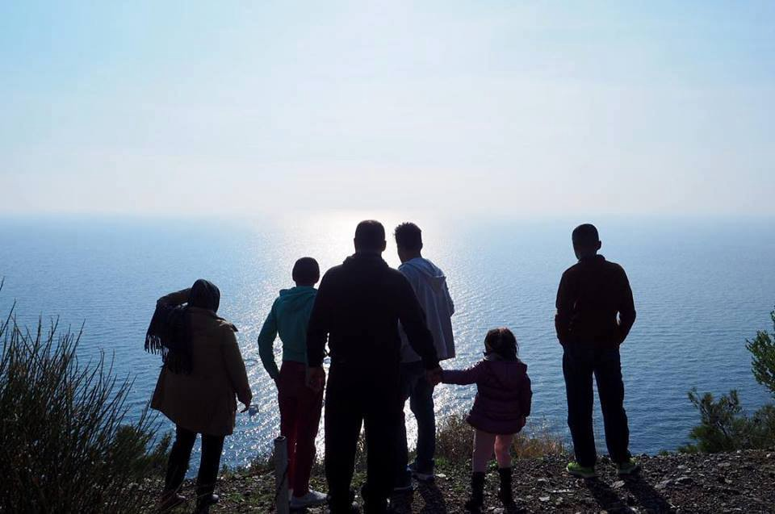
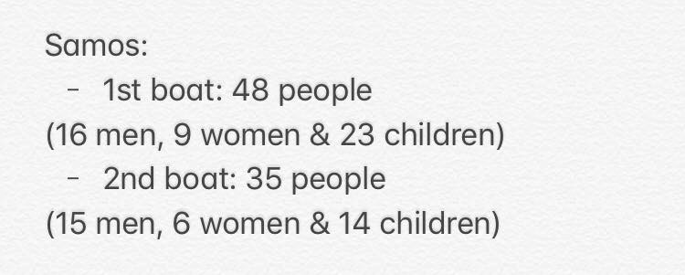
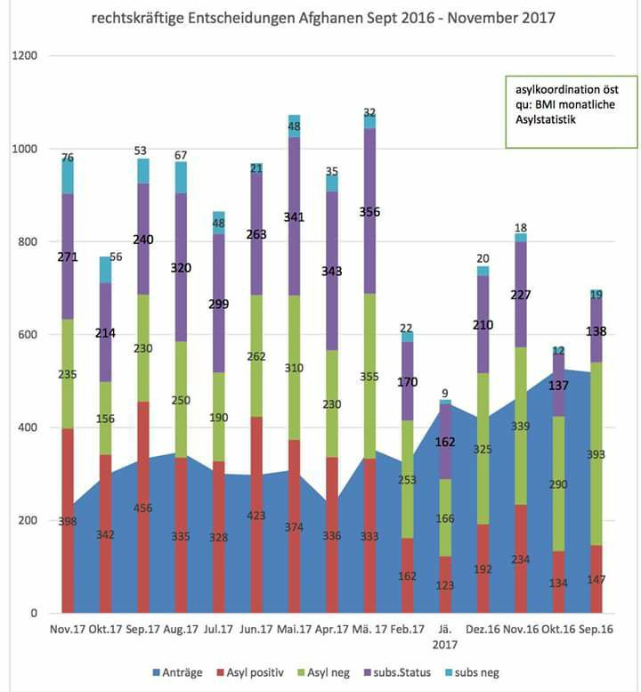

### AYS Daily Digest 12/01/2018: When loving your home means speaking out

_Patriotism and solidarity called into question // Reporter detained in Greece // Updates from Greece // Finger\-pointing in the Hungarian government // Rejection of asylum claims increasing in Austria // Italian town bands together in support of refugees // Belgian immigration minister collaborating with Sudanese government in deporting asylum seekers from Sudan // Refugees again, a bargaining tool in upcoming German coalition talks //_

Photo Credit: Refugee Solidarity Pikpa

FEATURE: Patriotism and Solidarity

As AYS and other civil society organizations continue to speak out and put pressure on the government of the Republic of Croatia, there continues to be backlash\. Recently, the government issued its own statement against AYS and these organizations, implicating them in participation in illegal human smuggling through Croatia, and furthermore accusing Dublin returnees of “abusing the Croatian asylum system\.” AYS issued a public response which is translated below:

_“The government of the Republic of Croatia and the Ministry of the Interior are those who are producing tendentious claims without proof\._

_As an organization that is systematically reporting about illegal expulsions of refugees from the territory of the Republic of Croatia, it is our duty to react to the assertions that the government of the Republic of Croatia has made regarding what was said in its response to Member of Parliament Peda Grbin\._

_The government of the Republic of Croatia states that there is no proof that would confirm the illegal or violent expulsion of refugees on the part of Croatian police officers\. We consider this to be incorrect considering that we have in three reports \(1/2017, 3/2017, 5/2017\) presented evidence \(personal testimonies of victims, photographs, medical documentation\) which the relevant institutions were at least obligated to investigate further\. International organizations such as UNHCR, Human Rights Watch, and Doctors Without Borders also have confirmed many cases of illegal expulsions and violence to which refugees were exposed at the borders of Croatia\. UNHCR Serbia alone has documented around 3000 cases of illegal expulsions on the part of Croatian police during 2017\. Simultaneously, we have not been made familiar with the results of the investigations which the Ministry of the Interior has apparently conducted based on these reports\._

_The government of the Republic of Croatia further states that for “some nongovernmental human rights organizations,” the goal “is to enable the transfer of the largest possible number of illegal migrants to other EU member states\.” By this, the government is tendentiously laying at the feet of these organizations the acts of criminals \(people smugglers\); criminals whose networks are still active in Croatia and whose activities the relevant institutions are as yet unable or unwilling to quell\._

_The government of the Republic of Croatia also states that an ever\-growing number of asylum seekers is recorded as having been returned to Croatia via “the readmission or ‘Dublin procedure’ \(62% of the total number of asylum seekers in 2017\), which only confirms the fact that these were economic migrants and the resulting abuse of the Croatian asylum system\.” According to the Dublin agreement, the country responsible for asylum seekers remains the country that had the greatest role in the seekers’ entry and stay in the territory of the European Union\. In the second half of 2015, Croatia had in its territory via the organized route, directed refugees towards Austria and Germany\._

_The majority of these people were never informed of or offered the possibility of seeking asylum in Croatia\. Now when it comes out that we as a country are actually responsible for the processing of their cases, the refugees are re\-traumatized by being returned to Croatia once again, and it is absurd that these facts are being used against the asylum\-seekers themselves\._

_If the Republic of Croatia considered that these cases are outside of its responsibility, then their return could have been rejected\. Instead of twisting the sense of the Dublin agreement and repurposing it for their political spin, the government of the Republic of Croatia should answer why it has quietly accepted the return of even those refugees who never even crossed through Croatia, and therefore they should not have been responsible for\._

_The government of the Republic of Croatia, last but not least, asserts that the goal of the people in the “wave of migration” is to reach other member states of the European Union\. On this, we cannot judge, but neither can the officers of the Ministry of the Interior because the refugees who enter the Republic of Croatia on a daily basis are denied the possibility of showing their intention of seeking asylum in our country, as provided by law\. If they had been enabled to follow procedure and request asylum, the law states that they would be placed in centers for asylum seekers and not expelled from the country\. If they do not wish asylum in Croatia, the law also provides a legal process for their readmission to Serbia or any other country they are coming from\. The Croatian police, however, are systematically ignoring the legal mechanisms of readmission provided and are enforcing illegal expulsions across the so\-called “green border\.” This fact has been pointed out by the Serbian Ministry of Interior as well, publicly\._

_The aforementioned is all proof that, under the platitude of “protecting the outer borders” \[implied: of the EU\] and the willful misinterpretation of the Dublin Agreement, lies the intent to minimize and conceal the illegal acts of our police officers\. The policy of illegal expulsions and closed borders has, in 2017 alone, directly or indirectly resulted in seven confirmed deaths within the territory of the Croatian borders, including the tragedy of Madina Hussiny, a six\-year\-old Afghani girl for whose death there has been filed a request for investigation with DORH \(the State Attorney of the Republic of Croatia\) \._

_As a civil\-society organization, we view it as our patriotic duty to warn about potential illegal wrongdoings within the territory of the Republic of Croatia, even in cases where the law is broken by those who should be protecting it\. The Croatia we believe in is a land of solidarity which has been embodied by the citizens of eastern Slavonia and other parts of our country who, during, the zenith of the crisis, opened their homes, gardens, and hearts\. We remember that among them have also been many police officers who have, instead of with boot and baton, welcomed refugees with bottles of water and other needed items\. This is the image of Croatian police we are proud of and wish to remember\. The breaking of state and international laws on our borders is a true stain on the reputation of the Croatian state in the world, which is something that the government of the Republic of Croatia must deal with urgently\.”_

The statement condemning NGOs comes as the Croatian and Serbian Ministries of the Interior continue to play a cynical game with the case of Madina Hussiny, whose death in later 2017 revealed the depth of cruelty and neglect on the parts of members of the Croatian and Serbian police\. As stated in AYS’s response, the Serbian Ministry of the Interior asserted that the Croatian government is in violation of its duties by engaging in unlawful pushbacks, resulting in the six\-year\-old Hussiny’s death\. This was not taken kindly\.

However, even though these assertions are correct, the hands of Serbian authorities are no any cleaner as internally, the authorities continue to put pressure on NGOs and other actors supporting refugees, forcing them to comply with absurd and neglectful bureaucratic practices and conveniently blaming NGOs for refugees choosing to abandon reception centers, which are thoroughly inadequate despite relying on copious external funding\. As the narrative of “the little country that chose to support refugees” wore thin, that convenient front was discarded\.

A undertone to all of this back and forth between governments and NGOs is that members of civil\-society organizations \(and simply ordinary citizens who dare to question what they are told\) are neglecting their patriotic duty which is, in the minds of some officials, to simply take what they are told and never question it\. This is the antithesis of patriotism to many others who feel that love unquestioned isn’t love at all\. Holding one’s government to account, especially when it concerns the rights of vulnerable people seeking safe lives, only shows the better side of love\.
### GREECE
#### New Arrival Report

#### Registrations and Transfers on 11 January:

Lesvos 0 / 45
Chios 0 / 36
Samos 0 / 54
Leros 0 / 6
Kos 0 / 8
Total: 0 / 149

There is continual warning of the extreme weather that commenced on the 10 January\. Thunderstorms, snow, rain are expected through the 16th across Greece\. Read a more\-in\-depth forecast [here](http://www.keeptalkinggreece.com/2018/01/10/weather-warning-bad-weather-fron-coming-italy-strike-greece/#.WlfJFKcI9Qc.facebook) \.

The Organization Metadrasi recently published an update in Greek on the success of their program for unaccompanied minors which seeks to place them in Greek homestays\. In keeping with the International Convention on the Right of the Child and other national and international rules and regulations, the organization finds this solution to be beneficial both to the host community and the unaccompanied minors, who need additional support and care in order to work through the ongoing trauma of their situation\. If you read Greek, check it out, [here](http://metadrasi.org/campaigns/%CF%80%CF%81%CE%BF%CF%83%CF%89%CF%81%CE%B9%CE%BD%CE%AE-%CF%86%CE%B9%CE%BB%CE%BF%CE%BE%CE%B5%CE%BD%CE%AF%CE%B1-%CF%83%CE%B5-%CE%BF%CE%B9%CE%BA%CE%BF%CE%B3%CE%AD%CE%BD%CE%B5%CE%B9%CE%B5%CF%82/) \.

Photo Credit: METAdrasi
#### Islands

On 11 January, a Buzzfeed reporter went to cover Moria, in this video, there is a succinct summary of the bureaucratic mishandling and the inhumanity that is Moria camp\. This is the reality of life in a refugee camp in Europe\.

The journalist was detained for sharing the video\. Unfortunately, it seems that revealing the truth about a situation is interpreted as an ‘attack’ on the country of Greece by some\. This is a sad trend we see in many countries across the route to Europe\. The truth, however, must get out, for the benefit of all\.
### Mainland

The Athens Legal Support team published a video detailing the conditions in “limbo land\.”

### HUNGARY

Finger\-pointing in the Hungarian government as the Jobbik far\-right political party is demanding answers from the foreign\-ministry deputy state secretary who stated that Hungary provided asylum to around 1,300 people last year\. This number is conspicuously close to the number to be mandatorily relocated to Hungary under the EU relocation scheme, which the Hungarian government ostensibly rejected with the Stop Brussels campaign\. In response,

> “Foreign Minister Péter Szijjártó, [when asked earlier how Hungary could have “secretly” taken in 1,300 refugees](https://dailynewshungary.com/foreign-minister-romanian-pms-remarks-regarding-hungarian-autonomy-unacceptable/) while it regularly speaks out against Europe’s migrant quota scheme that would allocate 1,294 refugees to the country, said Hungary was fighting the mandatory quota scheme because it would relocate illegal migrants in the European Union and strip member states of their right to decide who they want to take in\. He argued that Hungary’s taking in refugees under the Geneva Convention was a separate matter\.” 

Read the full report [here](https://dailynewshungary.com/jobbik-seeks-explanation-hungarys-admission-1300-refugees/amp/?__twitter_impression=true) \.
### AUSTRIA

The group [Border Crossing Spielfeld](https://www.facebook.com/RefugeesSpielfeld/photos/a.1631294960464320.1073741828.1631251033802046/1976813642579115/?type=3&theater) published a graph showing the monthly facts and figures of asylum applications, positive decisions, negative decisions, applications in process, and deportations for refugees from Afghanistan\. The data in the graph run from September 2016 to November 2017\. One can see a steady decline in positive decisions and a slow increase in negative decisions\. As the political situation in Austria continues to deteriorate, one can only expect this trend to continue\.

Photo credit: Border Crossing Spielfeld

But speaking of the political situation in Austria, on the 13th at 2 pm, there will be a large demonstration against the increasingly fascistic and racist attitudes and policies being enacted\. In information on the protests, they state:

_“We aim to be a loud and diverse group\. This gov’t intends racism and the lifting of the social safety net…\. Those most at risk are immigrants and vulnerable people… Politics are being conducted based on \[discrimination against\] Muslims, refugees and immigrants\. The real danger is being hidden in this way…\. Etc\., etc\.”_

We hope to update you on these protests as they develop\!
### ITALY

The European Commission on Human Rights has accepted the claims made by Sudanese nationals against the Italian government for their collective removal and illegal detention in a hotspot\. Additionally, there was an attempt to forcibly return the group to their country of origin, which was in direct violation of guarantees of the European Convention\. The Italian government must reply by the [end of March](http://www.infomigrants.net/en/post/6989/echr-accepts-anti-italy-appeal-for-forced-removal-of-sudanese) \.

In a positive turn, the residents of a small town, Ripabottoni, in the region of Molise protested against the transfer of the 32 migrants hosted in the village: strong friendship bonds exist between the migrants and the residents \(500 in total\) \. The prefecture had decided to move the 32 asylum seekers, hosted in the Xenia CAS, to other cities\. 200 people also signed a petition in order to cancel the transfer or have it delayed as long as possible\. Well done\! ❤

The organization [**Ex OPG Occupato — Je so’ pazzo**](https://www.facebook.com/exopgjesopazzo/?hc_ref=ARTHsh-bG13ycCTKkSK58YzKwDtSrrMDUk91KNYOpOKIwtW40UsLPMoiEsqtXTrjsv8) has restarted their free legal advice clinic for refugees and migrants — the organization is based in Naples\. The organization enthusiastically supports all efforts to enable refugees to enjoy their full rights, as no human is illegal\.

](assets/dfe0199982f4/1*KhJn4_1KsRmW1JsZqCvcCw.jpeg)

Photo Credit: [**Ex OPG Occupato — Je so’ pazzo**](https://www.facebook.com/exopgjesopazzo/?hc_ref=ARTHsh-bG13ycCTKkSK58YzKwDtSrrMDUk91KNYOpOKIwtW40UsLPMoiEsqtXTrjsv8)
### FRANCE

RastPlatz is issuing a call for boots\! Thanks to their connections, for ten euros you can provide one pair of boots\. Their goal is 500 pairs of winter boots\. Cold and wet conditions in Paris are an ongoing problem, and as police regularly disrupt overnight stopping points, people need good footwear in order to make it\. For more information on how you can help, go [here](https://www.facebook.com/rastplatz/posts/569278360086296?hc_location=ufi) \.
### BELGIUM

The Belgian immigration minister has come under criticism by other members of the government for the deportation of asylum seekers seeking protection from the Sudanese government\. The deportation of these individuals possibly can and has resulted in their ongoing exposure to persecution and torture\.

In a detailed report from DW, the centre\-right government’s coalition partner had invited representatives from the Bashir government in Sudan to Belgium to discuss the deportation, acquiescing to the Sudanese government’s request to “repatriate” 43 individuals to Khartoum\.

“N\-VA’s minister for asylum and migration, [Theo Francken](http://www.dw.com/en/belgian-immigration-head-fined-over-visa-rejections/a-36241533) , is the main target of criticism\. He is apparently only interested in efficient ways of getting rid of refugees\. This comes at the cost of turning a blind eye to human rights violations, says Fernandez\-Fernandez\. According to her, Francken struck a ‘dirty deal’ lacking transparency with Sudan and its president, who is the subject of an international arrest warrant issued in 2009 for crimes against humanity\.”

The priorities of the immigration minister seem to be focused more on keeping people out than the rightful implementation of the laws for access to asylum, which, according to the report, make Belgium’s recent campaign for a seat at the UN Security Council all the more embarrassing\. For the full report, click [here](http://www.infomigrants.net/en/post/6980/belgian-government-embroiled-in-deportation-scandal) \.
### GERMANY

SPD \(The Social Democratic Party of Europe\) and CDU/CSU \(The Christian Democratic Union/Christian Social Union\) have completed their exploratory talks for coalition talks, culminating in a vote on 21 January to move forward with the procedure\.

As refugee and migration issues are one of the most current topics in the German political sphere today, it was a feature of the exploratory talks, resulting in a strong veer away from previous policies which left Germany with the reputation of being refugee\-friendly\. The discussion included a quota \(between 180,000 and 220,000\) which would include “war refugees, subsidiary protection, family reunion, relocation and resettlement, minus repatrations/deportations, voluntary returns and without economic migration\.”

Also discussed were new regulations on family reunification, capping it to 12,000 per year; furthermore, it will be in “exchange” of voluntary intake of 12,000 people per year from Greece and Italy\. Furthermore, until these new regulations \(and others\) are adopted, family reunification will be suspended following the passing of a law later in January\.

Additionally the asylum application process will be conducted in new reception/decision/repatriation centres, called ANKER\-centres, seeking to streamline the process\.

> “In these Anker\-centers, arrivals, decisions, communal distribution and deportations shall take place\. They strive only to distribute those who have a positive chances of acceptance to outside residences\. All others shall, when possible in a timely manner, be send back to their countries of origin\.
 

> To speed up the procedures, Algeria, Morocco, Tunisia and other countries, which have a constant recognition rate of less than 5%, shall be considered safe countries of origin\. The individual right to a single case check will remain\.” 

We can only wait and see what effect these new regulations will have on the status of the hundreds of thousands who still wait in Germany\.
### UK

A useful resource for charity organizations can be found at this link\. The project is called “FREE Property for Charity” and it aims to do…just that, connect charities with property and rental spaces offering discounts to said organizations\. Check it out, [here](http://connectaid.org.uk/free-property-to-rent-for-charity/) , and get inspired\!

> **We strive to echo correct news from the ground through collaboration and fairness\.** 

> **If there’s anything you want to share or comment, contact us through Facebook or write to: areyousyrious@gmail\.com** 

_Converted [Medium Post](https://areyousyrious.medium.com/ays-daily-digest-12-01-2018-when-loving-your-home-means-speaking-out-dfe0199982f4) by [ZMediumToMarkdown](https://github.com/ZhgChgLi/ZMediumToMarkdown)._
