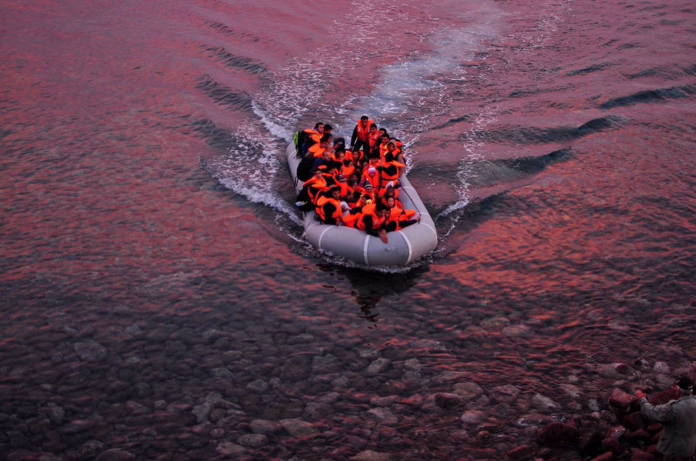
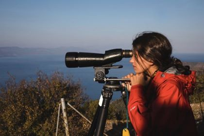
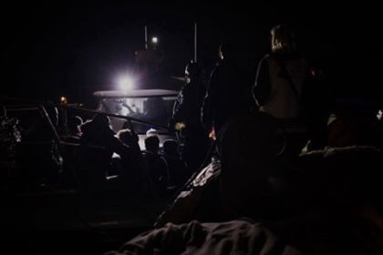
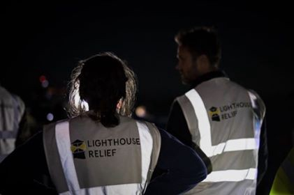

### AYS SPECIAL: Sleepless nights at Lesvos

_What does it mean to be volunteer as a part of the emergency response team at Lesvos, and how to cope with coming back to every day life\. A story from a volunteer\._

Photo by Samuel Nacar\.

A couple of miles away from Mytilini, the capital of the Greek island of Lesbos, a former military camp is filled with containers and tents\. “ [Welcome to Prison](http://www.theguardian.com/world/2017/dec/22/this-isnt-europe-life-greece-worst-refugee-camps) ,” or the “ [Guantanamo Bay of Europe](http://www.aljazeera.com/news/2017/11/greeces-lesbos-guantanamo-bay-europe-refugees-171129134253661.html) ,” Moria is known to be the detention camp in which the people wait for their papers\. The authorities came up with a plan to slow down the process of registration, letting up to 6000 refugees wait in a space that was made to fit not more than 2000, because, how else could they convince refugees that are still in Turkey not to come to Europe?

Two years ago, thousands of people escaping war and violence left their countries and landed on the shores of Lesbos by crossing the Aegean Sea from Turkey\. Many people died attempting to get to Europe\. Today, refugees are still taking that treacherous journey to reach safe ground, and some of them are still dying in the process\.

The influx of refugees crossing that sea may have decreased after the EU\-Turkey 2016 deal, but it is not over\. We tend to think that the war is over in Syria because it’s not represented in the media anymore — or not as represented as it was in 2015\.

The tiny fishing village of Skala Sykamnias, situated approximately 10 km away from the Turkish shore, had been a witness to the arrivals of refugees on its shore for years now\. In this village, a couple of non\-profits organizations, along with their around\-the\-clock team of emergency response volunteers from different countries around the globe, keep a watchful eye across the Aegean Sea, responding to all the north shore landings\.

Photo by Josh Klein

In the summer of 2016, I made a decision to volunteer in several refugee camps in the Northern part of Greece around Thessaloniki\. During that time, I was able to get an insight on the situation in the region\. The living conditions in the camps were not easy, the winters are cold, the refugees, who have been through indescribable trauma and pain were living under non\-isolated tents, the process was confusing for everyone \(refugees and volunteers alike\), and seemed to be very slow and complicated\.

A year and a half later, I was back in Greece, but this time as a volunteer with Lighthouse Relief in Lesbos\. No two experiences are ever alike, these words added weight on my already heavy conscience “Am I doing the right thing?”

Spending the night in the transition camp known as “Stage 2” where approximately 100 people lay waiting to be transferred to Moria\. Some where dreaming of a better future for their children, others for their countries and most, if not all, for a second chance at life\.

Not being able to bring myself to sleep, I decided to go for a walk around camp, where I came across a man\. Getting out from his new shiny hatchback, with a warm coffee in one hand, he walked up to the fence and asked me: “Why isn’t the gate of the camp locked?’

It took me a while to process his question, to identify the official on duty standing right in front of me, and to finally answer him with another question; “Is this a camp or a prison?”

Except that these words never left my lips\.

Later that night, while drifting through my insomnia, an older man approached me\. He asked if he could join me on the bench\. I offered him a cigarette\. He’d quit smoking for some time now\.

“I can’t sleep\. I’ve been sleeping ever since I got here\. There’s nothing much to do\.”

He taught me some words in Farsi, possibly to assert his trust, it didn’t take him long before he shared his story of how he was unjustly imprisoned for years in his home country, and showed me a piece of paper given to him by a non\-profit saying that he was visited by delegates when he was over there, and that they were able to let him out after having spent time locked down without any official judgement\.

Photo by Josh Klein

Having exhausted our time together, the man stood up and wished me a good night, while making his way back to the tent, I noticed an obvious inconsistency in his walk, he was limping\. I asked him if he went to see the medical team, insisted that he should have someone look at it if he had injured it at sea\.

He looked back at me with a half embarrassed smile, waved his hand at me in hope that I would overlook his shame\. “It’s an old injury,” he confessed\. “Back from when I was imprisoned I was beaten on a daily basis\.”

My requirements at Skala Sykamnias were centered around prospect landings \(the possibility of a sudden arrival of refugees by sea\) \.

Being part of an emergency response team meant that you always had to have your phone on you at all the times, keep it loud and be accessible\. We never know when a dinghy might show up, therefore we have to be ready to act\. A couple of nights ago, forgetting to mute my phone, a loud text followed by a rhythmic vibration on my night stand interrupted my sleep and left me in a state of panic, was there another landing?

Around 03:20 am, shortly after giving in to sleep, I received a message: “Landing team to the office\.” Another landing\! Through a disoriented gaze, I take a quick look around the tent\. “Think\! Focus\! Follow the protocol,” my body acted absentmindedly, not waiting for any clear direction from my brain\. “But the tent is crowded, where are the new ones going to fit?” I ask myself as I wake people up, asking them to make space by moving their sleeping bags and mattresses for the newly landed\.

As the rest of the team sets up the tent, it takes me a moment to notice the fear lingering over the space\. These people are also familiar with the process of a landing, they’re no strangers to the disorientation currently happening, they were reminded of their first night they arrived in Lesbos, wet, cold, confused, and scared\.

Some of the older ‘residents’ started to ask me questions and I obviously had no answer\. I never do\. The process is too complex and keeps on changing, no landing is like another landing\. I stick to the protocol, and answer in the best possible way that I know “I don’t know” “Inshallah” “Maybe”\.

There were approximately 140 people in Stage 2 that night\. The tent is obviously at over capacity, but the officials’ seemed to disagree\. “Overcapacity is when we have 160 people in there\.”

It makes sense, doesn’t it?

Some of the refugees look excited at the idea of going to Moria\. “We’re being moved to a new camp, it’s a good sign,” “We’re already at the second stage of our asylum process,” “It’s going fast and in a couple of months we’ll be in Germany/France/Spain or whatever EU country that would greet us with open arms\.”

They don’t know what’s waiting for them in Moria\. They get on the bus, they smile and wave their hands “Good bye,” “Thank you”\. We smile back, politely, and our hearts break at the sight of them leaving\.

We know what’s waiting for them at Moria\. We heard the stories, they haven’t\.

When working in this kind of emergency response — when a landing occurs — protocol is essential; otherwise you risk to be charged with human trafficking and misjudgment\.

Photo by Josh Klein

Leaving the tiny fishing village wasn’t easy, after spending a month in Skala Sykamnias, I still find it hard to adjust to my daily life here\. I went back to my regular job the morning after I landed back home\. It just wasn’t the same anymore\. Maybe because I was haunted by the idea that I still had more work to do there, or was it because I still carried my headlamp that was mandatory to have during landings in my backpack wherever i went?

_1\. Some identifying details have been changed to protect the identity of the man\._

**_\(No photos can be provided to support my reflection as I signed an agreement with the NGO stating that I will not take pictures and put them on social media to protect the identity and privacy of the individuals\. \)_**

**_\(Joelle Assaf , and independent volunteer\)_**

> _\(_ [Lighthouse Relief](https://www.lighthouserelief.org/volunteer/) needs volunteers in February and March\. Since September 2015, Lighthouse Relief has organised emergency response operations on the north shore of Lesvos in the small fishing village of Skala Sikaminias\. At a distance of 8km, Lesvos serves as a regular entry point for refugees crossing the Aegean Sea from Turkey into Europe\. To ensure safe passage for those seeking refuge, Lighthouse Relief has built an around\-the\-clock team of emergency response volunteers who respond to all north shore landings, operate day and night spotting shifts, and work in cooperation with the other organisations to ensure arrivals are supported in overnight transit\. To find out more about volunteer opportunities and apply, visit their FB page\) 

> **We strive to echo correct news from the ground through collaboration and fairness\.** 

> **If there’s anything you want to share or comment, contact us through Facebook or write to: areyousyrious@gmail\.com** 

_Converted [Medium Post](https://medium.com/are-you-syrious/ays-special-sleepless-nights-at-lesvos-4ee3b59effb9) by [ZMediumToMarkdown](https://github.com/ZhgChgLi/ZMediumToMarkdown)._
