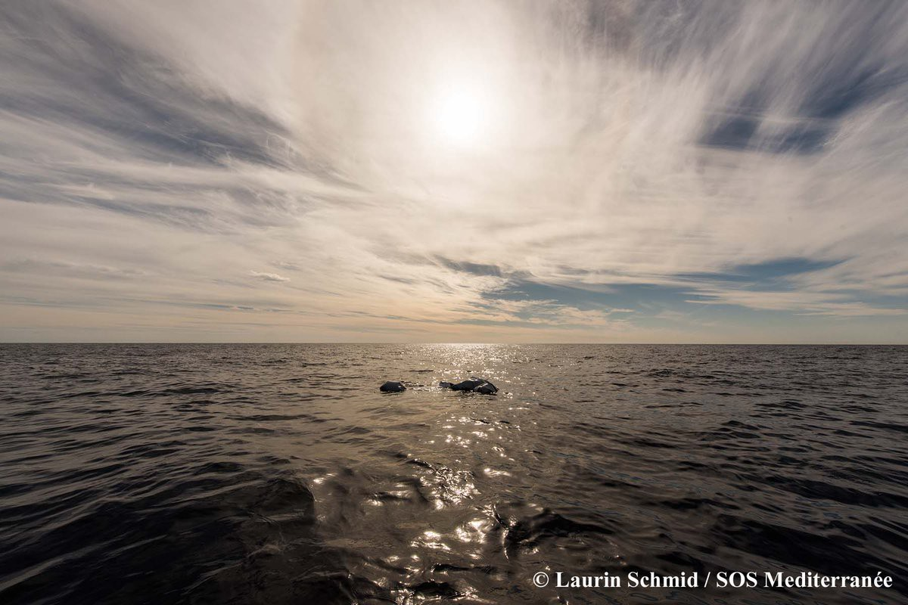
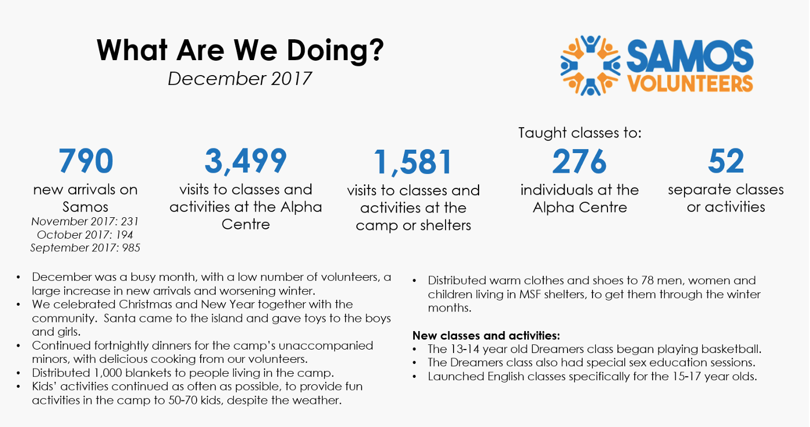
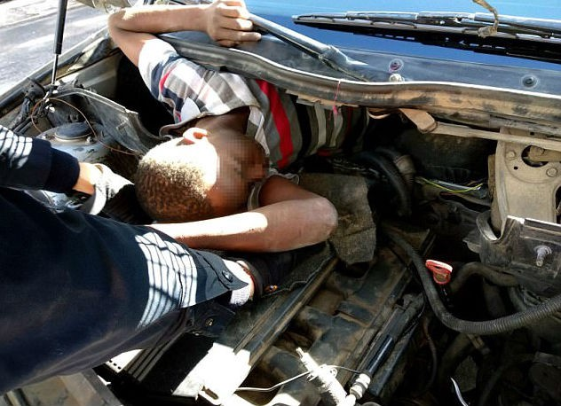
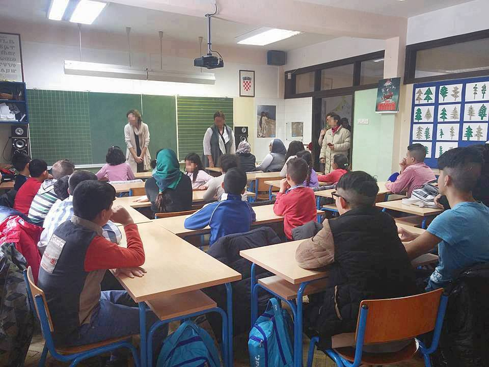

### AYS Daily Digest 15/01/18: Suicide Attacks in Baghdad show Iraq is no “safe third country”

Attacks on civilians in Syria//Boats missing at sea//Samos camp overcrowded and unsafe//Volunteers needed on Mainland//Macron ignores plight of refugees// Croatian government fails to meet education needs for children//Asylum appeals in Germany//and more…

](assets/78c842933eb6/1*KAdrKu0cA8IOffxCeO7f-Q.jpeg)

“Aquarius looking for potential survivors around the wreck of an empty inflatable boat found this monday in international waters 37 nautical miles off Libya\.” Photo Credit: [SOS Mediterranee](https://www.facebook.com/sosmedfrance/)
### Iraq

Two suicide bombers detonated devices in a crowded market in [Central Baghdad](http://www.independent.co.uk/news/world/middle-east/baghdad-suicide-attacks-latest-today-two-explosions-aviation-square-dead-injured-iraq-interior-a8159276.html) today\. The attackers seemed to be operating in concert, as they struck one immediately after the other\. So far, at least 38 people have been reported dead and 108 have been wounded\. While no group has yet claimed responsibility for the attack, many supsect that Daesh \(ISIS\) may be behind it, as they have been behind other attacks in Baghdad in the past year\.

Today we are highlighting this story as an example of the awful violence which is driving so many Iraqi families to seek shelter in Europe\. While far\-right European parties and governments like to claim that the war in Syria is “winding down” and that the battle with Daesh in Iraq has been “won”, those on the ground know the reality is far more complicated\. These talking points about increasing stability in the Middle East serve more as excuses to justify deportations than as reflections of the reality there\. As today’s attack proves, Baghdad can still be an exceptionally dangerous place, far from the “safe third country” EU politicians would like it to be\.
### Syria

A [missile fired yesterday](http://www.aljazeera.com/news/2018/01/exclusive-missile-attack-targets-refugee-camp-syria-180114082354985.html) struck a refugee camp in the Idlib province\. Footage shows men, women, and children fleeing the scene of the disaster\. It is unknown how many have been killed in the attack\. This week’s attack marks perhaps the most obvious violation of the Turkish\-Russian\-Assad Government treaty signed in Kazakhstan recently\. This missile attack came in the middle of a wide spread campaign against anti\-Assad rebel faction in the Idlib region this week\. It is unclear who fired the missile at this point, but given that the targets were likely anti\-Assad rebels, it is speculated that it was fired by Assad government or Russian forces\.

The White Helmet civilian rescue organization put out a [statement today](https://www.facebook.com/Free.SyriaSalam/posts/948130608685005) condemning these violations of cease\-fire agreements, and exposing the lies of the Assad government and their Russian backers\. “The Syrian regime carries out military operations against the people of Eastern Ghouta despite all the agreements signed to keep civilians away from the conflict zones\. The media outlets of the regime report false news saying the civilians were evacuated from the war zone\.”
### Sea

Six refugees were [found dead today](https://www.abola.pt/Mundos/Noticias/Ver/711261) in a boat that landed on the Spanish island of Lanzarote, according to reprots from the Guardia Civil and the SMH rescue organization\. Five refugees were found in the vessel\. While the cause of death has not yet been determined, those on the scene reported that some of the bodies showed symptoms of hypothermia, and others of drowning\. A sixth body was recovered from the water\.

We have a disturbing report from [MSF’s sea rescue team](https://twitter.com/MSF_Sea) tonight\. After coming across an empty dinghy in the Mediterranean, they still have found no bodies or survivors\.

An empty dinghy found in the Mediterranean\. 15/1/18\.

■■■■■■■■■■■■■■ 
> **[SOS Humanity](https://twitter.com/soshumanity_de) @ Twitter Says:** 

> > UPDATE 67 people rescued on Monday in international waters by the Spanish navy ship Santa Maria have been safely transferred tonight on board the #Aquarius 
#TogetherForRescue https://t.co/bhwP6sz92L 

> **Tweeted at [2018-01-15 21:13:19](https://twitter.com/sosmedgermany/status/953012242659737600).** 

■■■■■■■■■■■■■■ 

58 people were rescued off the shores of Spain today by the Alboran, an SMH rescue vessel\. Rescuers are still out looking for a second boat\.

■■■■■■■■■■■■■■ 
> **[Europa Press](https://twitter.com/EPAndalucia) @ Twitter Says:** 

> > Rescatada una patera con 58 personas en el mar de Alborán y se buscan otras dos [europapress.es/andalucia/noti…](http://www.europapress.es/andalucia/noticia-rescatada-patera-58-personas-mar-alboran-buscan-otras-dos-20180115175339.html) 

> **Tweeted at [2018-01-15 16:58:31](https://twitter.com/epandalucia/status/952948120928882690).** 

■■■■■■■■■■■■■■ 

### Greece
#### Islands

According to [statistics](http://mindigital.gr/images/prosfygiko/images/NSP_Eastern_Aegean_14.01.pdf) from Greek authorities, there were 49 transfers from the Aegean camps to the mainland yesterday\. According to data from the Greek government, there have been more transfers than new arrivals in 2018, despite the high number of new arrivals recently\.

Samos is the only island which has seen more new arrivals than transfers, with 316 new arrivals, and 144 transfers\. Today there were 12 new arrivals on Samos\.

Samos continues to be extremely overcrowded, and many newly arrived refugees are forced to sleep in pop\-up tents on the freezing ground\. [Samos Volunteers](https://samosvolunteers.org) continues to be the primary group providing aid and services to refugees on the island, since the Boat Refugee Foundation has pulled services from the island\. This week, Samos volunteers released their monthly reprot, detailing new arrivals and many of the services they provide\. You can support their work [here](https://samosvolunteers.org/donations/) \.

Graphic Credit: Samos Volunteers\.

A [video](https://www.facebook.com/RefugeeBiriyaniAndBananas/videos/972086692949397/) was released from the Vial camp in Chios today, showing a mother struggling to provide for her two young children in an unheated tent\. “‘I feel angry all the time because of the pressure in camp\- the cold, the dirt, the position we live in\. I can’t feed the kids because nothing is enough\.” 
When asked if she needed anything like clothes or aid frustrated she said “we just want to leave and get out of here\.”

Today the [Enough is Enough](https://www.facebook.com/enough14/?hc_ref=ARR1yJ_mpYeqMwy-uleh1EExW-I5OnzeVT7Zlc3-u4AIZ3XETa97uJJwwxKXz-VmPZ4&fref=nf) outlet released a [video](https://www.facebook.com/enough14/videos/1629706310384639/?hc_location=ufi) that was secretely filmed inside the Moria camp on Lesvos\. Filming is prohobited there to keep the appalling conditions out of sight of citizens and journalists\. The clip shows overcrowded containers, filthy conditions, and many people sleeping in tents on the ground\.

 \.](assets/78c842933eb6/1*CY-A84HRhDtgykicvrdq4Q.jpeg)

Moria Camp, 15/1/18\. Photo Credit: [Hibai Arbide Aza](https://twitter.com/Hibai_) \.

The Refugee Rescue organization is looking for land spotters to join their team on Lesvos\. Spotters help to save lives by detecting crossing boats, and making sure they are not lost out of sight once spotted\. For more information click [here](http://www.refugeerescue.co.uk/land-crew/) , or email volunteers@refugeerescue\.co\.uk\.

 \.](assets/78c842933eb6/1*gn5SX5V-VeRANILbDiuHsg.jpeg)

Spotters on Lesvos\. Photo Credit: [Refugee Rescue](https://www.facebook.com/RefugeeRescueUK/?hc_ref=ARRJjS7csiy7g_HeUxAzSZT1jOMzZdWkaA0YHgMlWpYZ5Vg3qKiC-zlKUBkS5kpX_ZA&fref=nf) \.
#### Mainland

We have received reports from the Filippiada camp in mainland Greece that some refugees who have sought accomodation there have been denied entrance\. While the administration claims to be seeking housing for these refugees, they have remained homeless for the past weeks\. Among those denied entrance are two young men who are sleeping below a roofline outside the camp\. One of the young men is from Yemen, and suffers from a serious medical condition\. The other young man is from Iraq and has serious injuries from a bombing\. How much longer will they have to sleep in the cold?

 group\.](assets/78c842933eb6/1*V2F3WSXtnHCGknes9JJjoQ.jpeg)

Two young men seek refuge outside of the Filippiada camp\. 1/13/18\. Photo Credit: Anonymous Volunteer, shared through [Ishtar](https://www.facebook.com/عشتار-للهجرة-واللجوء-687993924641223/?hc_ref=ARS9u82_C4P5eRjrr94-1u3-YnJiPglLZisRs_0QfvROcq7bzbZI_R0E2OebeA8tT84&fref=gs&dti=228469170832717&hc_location=group) group\.

Volunteers are desperately neeeded at the Pampiraiki Warehouse in Athens tomorrow \(16/1\) to unload a van around 11:30\. For more information, click [here](https://www.facebook.com/groups/PAMPIRAIKI/permalink/578525779158197/) \.

InterVolve is looking for volunteers at Larissa\-Koutsochero Camp in Northern Greece\. There are a number fo projects they need help with, including a coordinator for their women’s activities, volunteers with teaching experience and who have worked with children, and male volunteers\. For more information, click [here](https://www.facebook.com/InterVolve/posts/559337954404597) , or email at operations@intervolvegr\.com\.
### Spain

How desperate do you have to be? A young boy climbing out of the dashboard of a car, trying to reach the European border\. Photo Credit: Spanish Interior Ministry

Four refugees were discovered inside a car attempting the crossing from Morocco into Melilla Spain today\. Two men were discovered in the trunk of the car, another was in the hood, and another was discovered hidden in the dashboard\.
### France

We have an update from independent volunteers in Paris today, who report that two years after starting their work, they have sadly seen little change in the capital\. Thousands are still sleeping on the streets, and police abuse is commonplace\. “When we organize collection of blankets, we learn that the police confiscate tents and blankets\. We’re in winter\! How to describe this action of our “ Republican Police,” who are endangering the lives of others? Their inhuman and degrading treatment is tantamount to torture\!” Report volunteers working with the [Wilson Solidarity Initiative](https://www.facebook.com/permalink.php?story_fbid=833414196859354&id=598228360377940&hc_location=ufi) \.

 \.](assets/78c842933eb6/1*ycaFR13rP0vcVRnh59WXHQ.jpeg)

Refugees sleeping on the street, Paris, 15/1/18\. Photo Credit: [Wilson Solidarity](https://www.facebook.com/permalink.php?story_fbid=833414196859354&id=598228360377940&hc_location=ufi) \.

Today we are forwarding a statement from the L’Auberge des Migrants and Utopia 56 organizations which are operating in Northern France\. The groups today provided an explanation for why they refused a meeting with President Macron, which they believed would only be used as cover by his administration\. They view Macron’s administration as seeking to pretend they are engaging in dialogue when in reality they are ignoring the plight of refugees and the demands of aid workers and volunteers\. From the joint statement by the Utopia and L’Auberge groups:

“ We decided to decline the invitation of Emmanuel Macron\. When the government has not listened to the major humanitarian organizations, their criticism or their proposals, why would the president take into account the same criticisms and proposals from local associations?

The meeting with the president of the Republic therefore seems to us unnecessary\. It can only allow the chief executive to declare that there has been dialogue with the associations, while important political decisions have already been taken\.”

Tomorrow Macron is set to visit Calais, although he has declined to meet with refugees there\. On thursday, he is due to meet with UK PM Theresa May, and other authorities to negotiate a deal to allow more refugees from France enter the UK\. Macron has already put forth [policy proposals](http://m.france24.com/en/20180111-france-migrants-macron-asylum-law-reform) which would make it much harder for refugees to find asylum in France unless they are classified as “war refugees” in a very strict sense\. This policy would put many political refugees, LGBTQ refugees, and victims of criminal violence and exploitation at risk of being deported\.

Since Macron is unwilling to meet with refugees, we hope that someone will remind him of the long\-suffering people stuck in Calais\. The Refugee Rights Data prject today reminded us about their findings from Calais, from October 2017\. From their [study](https://www.facebook.com/RefugeeRightsData/posts/1759871700986334) , they found that over 90% of refugees reported experiencing police violence, and that over 70% of respondants said they were regularly attacked with tear gas, often in their sleep\.

A refugee in the city of Grand\-Synthe in Northern France [lost his leg today](http://www.20minutes.fr/faits_divers/2202115-20180115-nord-happe-train-migrant-perd-jambe-grande-synthe) when he was struck by a train\. Information about the incident is still incoming, and it is unclear what the circumstances where when he was struck\. However, many refugees in this area have been injured and killed attempting the crossing to the UK when they have been struck by trains and cars\. The 30 year old man is currently in critical condition in a local hospital\.
### Croatia

“A year on, most of these children are no longer in Croatia, while only one child has been granted international protection after a wait of almost one year\.” Photo Credit: AYS

Today the AYS media team is forwarding a message from our colleagues in Zagreb\. AYS has a team of volunteers who proivide after school activities and support for refugee children in the city\. Some of these children entered Croatia from Serbia, but many others were sent to Croatia from wealthier nations in the EU such as Austria, Germany, and Sweden\. They were sent to Croatia under the “Dublin” agreement, which allows EU countries to deport refugees to the country they first entered the EU in\. Once someone is sent back via the Dublin agreement, they are often denied asylum and can be forcibly deported back to their country of origin\. However, the Croatian government does not currently deport refugees, but does something almost just as inhumane, it sends them to a prison in Ježevo\. Thus many refugees families choose to live outside the system in hiding or leave the country in hopes of reaching a better Europe\.

> Out of a group of 28 children who AYS has been supporting in the last year, only ten remain in school today\. 

Of these ten, only two have been granted asylum, while the rest live under the constant fear that they could be deported\. These are the consequences of Europe and Croatia’s inhumane asylum policies: children left without an education\.

“This system exacerbates and adds to situations of disenfranchisement and suffering, depriving entire generations not only of their chances of getting an education, but of all other kinds on institutional support for a life lived in dignity\. Therefore, instead of a policy of destruction and hypocrisy, we call on the highest government bodies in Croatia to set up without delay political and institutional frameworks guided by the principles of responsibility and care for every child and every schoolchild in our country, those who are already here and those who are yet to arrive\.” You can read the full statement on the AYS facebook page\.
### Germany

It was reported today that [nearly half of all asylum seekers](http://m.dw.com/en/almost-half-of-rejected-asylum-seekers-in-germany-winning-on-appeal/a-42155593) who appealed their first rejection decision are winning their appeals cases\. This story highlights the need for refugees to have access to legal services, and to have full knowledge of their rights so they are able to make an appeal\. If half of all asylum cases are being granted upon appeal, this suggests something may be seriously wrong with the initial process\.

Forwarding an alarming report from Germany: the far right “Identitarian” movement has announced today that they are attempting to get members authorized to become guardians for unaccompanied refugees\. The idea of neo\-fascists holding legal and parental responsibility for refugees should be alarming to all\. From the group’s own statement, they have claimed they are doing this to make refugees aware of their “relocation possibilities”, in other words, to push them towards deportation\. We are going to continue following this story, and we recommend our friends in Germany \(and Hamburg especially, where the plan originated\) to do the same\. This morally corrupt group poses a direct threat to refugee children living in Germany\.

> **We strive to echo correct news from the ground through collaboration and fairness\.** 

> **If there’s anything you want to share or comment, contact us through Facebook or write to: areyousyrious@gmail\.com** 

_Converted [Medium Post](https://areyousyrious.medium.com/ays-daily-digest-15-01-18-suicide-attacks-in-baghdad-show-iraq-is-no-safe-third-country-78c842933eb6) by [ZMediumToMarkdown](https://github.com/ZhgChgLi/ZMediumToMarkdown)._
