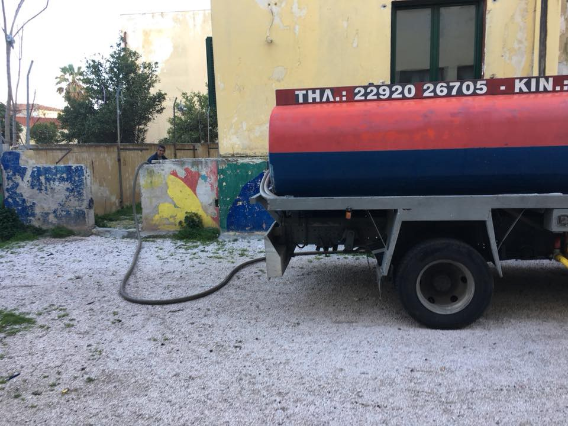
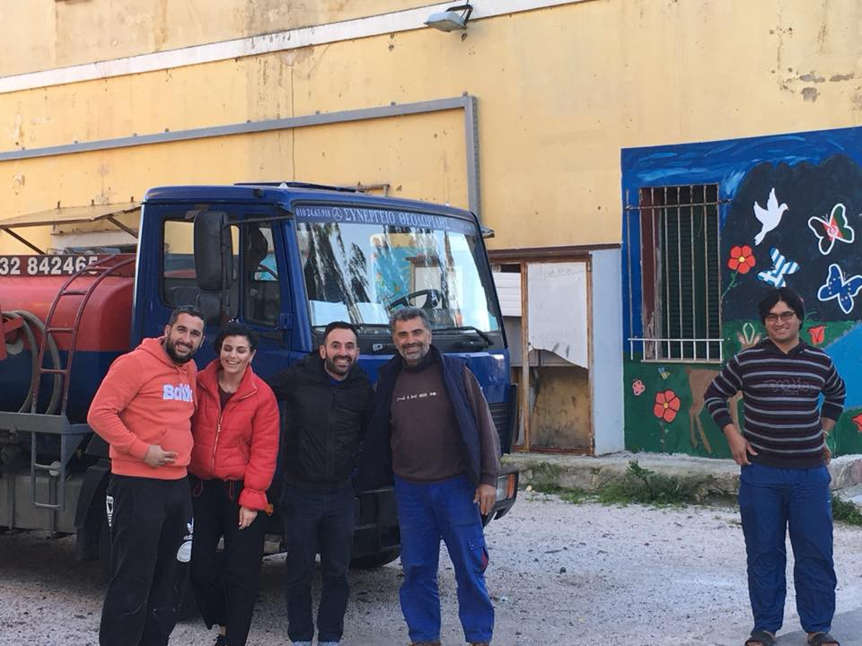
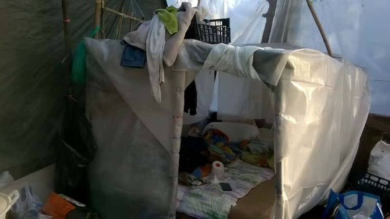
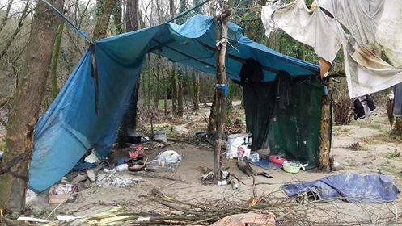
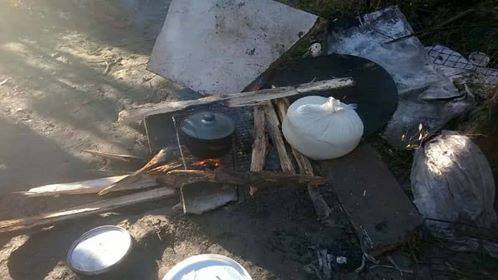
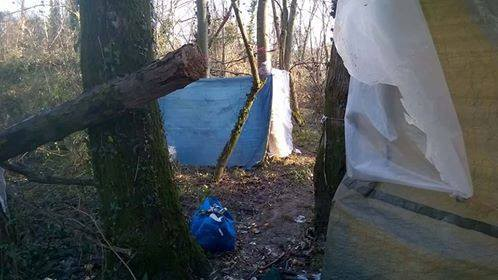
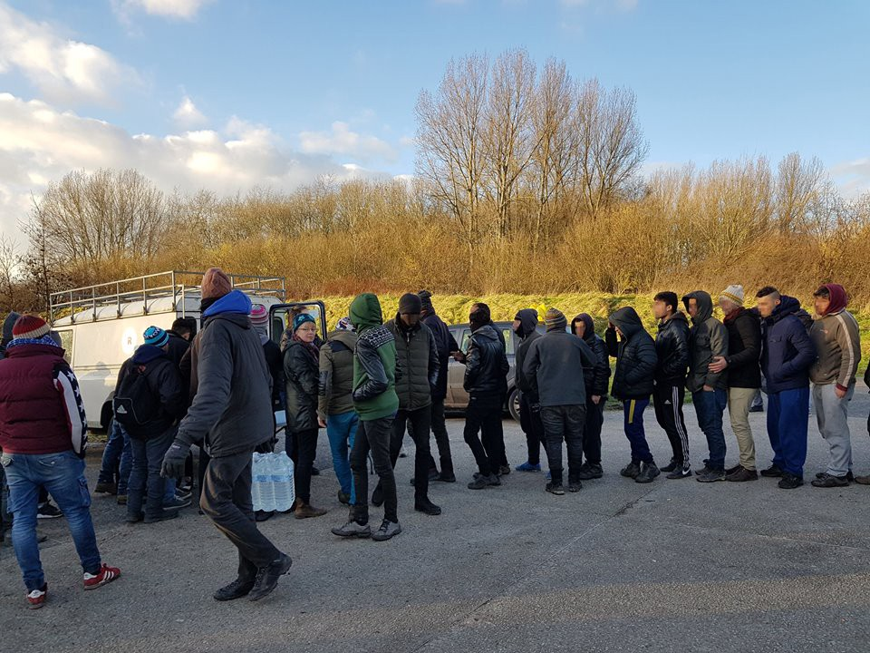

### AYS Daily Digest 18/01/18: What Macron failed to mention

_UK to pay £44\.5m more for extra security measures in Calais / HRW publishes World Report 2018 / Greek Council for Refugees workshop finds / Evacuations in Italy and France / And more news…_

](assets/b062b363009e/1*YzrYOz-nUUuGhZHYWwatKg.jpeg)

[Humans for Rights Network](https://www.facebook.com/humansforrights/?ref=gs&fref=gs&dti=1667894290115570&hc_location=group)
### FEATURE

Britain will pay £44\.5m for extra security measures in France to prevent another refugee camp forming in Calais or any other Channel port, the Guardian [reports](https://www.theguardian.com/politics/2018/jan/18/uk-to-pay-extra-445m-for-calais-security-in-anglo-french-deal) \. What is in May’s plan is more fencing, CCTV, and other detection technology in Calais and other ports, possibly including Dunkirk\. The measures include building a 1km\-long concrete wall designed to prevent migrants and refugees getting close to the roads used by trucks approaching the port, they write\.

Since the demolition of the camp, UK has spent over £160 million on security and policing in Calais\. That money could have as well been spent on providing people with the most basic rights — food, clothing, bedding, shelter, legal and asylum information, child safeguarding, education, aand access to medical care, organizations working on the ground [write](https://www.facebook.com/HelpRefugeesUK/posts/552707761756568) , adding that all these basic rights are currently provided by volunteers and donations, but **should** be provided as a minimum by any state that claims to respect human rights\.

A group of British and French organizations working with refugees wrote an [open letter to May and Macron](https://helprefugees.org/open-letter-president-macron-prime-minister-may/) ahead of the Sandhurst military academy summit that was held today\. They once again highlighted systematic rights violations happening in Calais and elsewhere, especially concerning many vulnerable minors who are in greater risk of risk of sexual violence, exploitation, and trafficking\.

Since December 2017 alone, three individuals have died a preventable death at the border, including a 15\- year old boy who had a legal right to be reunited with family in the UK, they [write](https://helprefugees.org/open-letter-president-macron-prime-minister-may/) \. The group also calls on the French and British Governments to ensure that the following considerations are held central:

> Police violence: In any discussion between the British and French Governments on security and border control, the issue of police violence and detention must be carefully addressed\. Both Governments must work to put an end to police violence and abuse against displaced people, and those officers responsible for abuse must be held to account\. Police must be adequately trained and made aware of the prohibition of disproportionate and indiscriminate
 

> use of force\. 

> Safe legal routes: Both France and Britain must ensure that displaced people in the area are able to access family reunification processes under the Dublin Regulation\. The Dublin Regulation processes should be actioned and completed in a timely fashion to reduce the risk to young people taking unnecessary risks\. Specific attention should be given to ensure that minors are able to access family reunification and safe, legal routes such as the ‘Dubs’ scheme\. To date, there are still over 200 placements available for unaccompanied minors to be transferred to safety in the UK\. The average waiting time observed by organisations on the ground \(such as Safe Passage, an organisation with expertise helping children access family reunion\) currently amounts to 9 months, which is wholly disproportionate and unnecessary\. 

> Reception centres: Adequate reception centres must be open whilst claims are being processed, and as emergency accommodation for the duration of winter\. Displaced people in the area must not be left in the current inadequate conditions and the cold weather\. 

> Child protection: Child protection frameworks and anti\-trafficking efforts must be given high priority to counter the heightened risks of sexual violence, exploitation and trafficking to which children and youth in Calais are exposed\. Unaccompanied children on French soil must be given full access to shelter, mental and physical health services, and other basic services such as access to food, water and sanitation\. A proportion of the £80 million budget under the latest security agreement 4 must be urgently allocated to the aforementioned efforts\. 

### GENERAL

HRW published World Report 2018, their annual review of human rights around the globe\. Full report is available [here](https://www.hrw.org/sites/default/files/world_report_download/201801world_report_web.pdf) and you can watch the press conference [here](https://www.facebook.com/HumanRightsWatch/videos/10155988144239354/) \.

Despite [reports](http://www.dw.com/en/eu-asylum-applications-drop-off-drastically-in-2017/a-41976192) of asylum applications “dropping off drastically” in the European Union throughout 2017, statistics published by national authorities seem to reveal a more complex picture across the continent, aida [writes](http://www.asylumineurope.org/news/18-01-2018/asylum-statistics-2017-shifting-patterns-persisting-disparities) \.

There were 222,683 applications registered last year in Germany compared to 745,545 the year before\. It should be recalled that the [majority of people](http://www.asylumineurope.org/news/23-05-2017/asylum-statistics-2016-sharper-inequalities-and-persisting-asylum-lottery) lodging applications in 2016 had in fact arrived in 2015\.

Significant reduction has also been witnessed in Hungary and Bulgaria, countries known for their politics of exclusion, isolation, and marginalization\. More claims were received in Italy, France, Belgium, Norway, and Slovenia in 2017 compared to 2016\. More numbers in detail can be found [here](http://www.asylumineurope.org/news/18-01-2018/asylum-statistics-2017-shifting-patterns-persisting-disparities) \.
### GREECE

The two day workshop of the Greek Council for Refugees \(GCR\) ended\. It was dealing with administrative detention, asylum, and racist crimes\.

Administrative detention of asylum seekers and migrants is once again the first choice of the Greek administration, despite the fact that the law orders that the administrative detention of a third\-country national should be applied as a last choice and then from being judged \(examined\) as an individual, as almost all of the SPC lawyers have indicated\.

At the moment, there are eight pre\-Privative detention centers \(in Greek called PROKEKA\), as Secretary\-General for Coordination at the Ministry of Interior on issues of foreigners, Tzanetos Filippakos [said](http://www.avgi.gr/article/10836/8654254/kratese-e-nea-tase-ste-diacheirise-tou-prosphygikou) , adding that 2,304 people are detained\. However, about 1,300 still have been detained under the administrative detention regime in police stations \(AT\) throughout the country, according to V\. Papadopoulos, stressing that the total number of administrative prisoners in our country is perhaps the largest in the EU\. currently\.

In addition, regarding the “guarding” of unaccompanied minors, which is nothing more than the detention of unaccompanied children when there is no place in structures, V\. Papadopoulos underlined that the Greek legislation does not include “protective guard” and that it is an illegal practice\.

According to the survey of the GCR lawyer Sia Georgopoulou from the visits of the GCR team to police stations \(AT\) and PROKEKA all over the country, the conditions are “indescribable\.” In police stations, there is a complete lack of pre\-conditioning, poor hygiene conditions, inadequate or dirty beds, inadequate food, problematic provision or total absence of medical services, a lack of interpretation, and detention along with criminal prisoners, as she noted\. There is a prelude to PROKEKA, but all of the above is also met there, and the strong sense of exclusion from the outside world — as in the Corinth detention center — often leads to tensions\. The same center, with a population of more than 780, was smashed in August 2017 as the contract with the cleaning crew had ended and a doctor was seen every 15 days, he said\.

As Georgopoulou pointed out, on the islands and in the mainland they found vulnerable personsn in detention\. It is characteristic that women and families were detained in the PROKEKA of Kos along with men, where women were asking police officers to lock them in containers because they were afraid for their security\. She also said that detention is prolonged after the filing of an asylum application, which is often difficult for an administrative prisoner and may also need a lawyer intervention\.

A “second informal Moria” has recently been set up in the olive grove next to the homonym center, where the refugees, not withstanding the situation in the official camp set up by their own means, are setting up their own spaces and attempting to get access to water\. Of course there are no toilets there, resulting the whole area, and also Moria, to smell of urine and stool, as he pointed out\.
#### Athens

[Here is an updated map](https://drive.google.com/drive/folders/0B5eHzYChsokiVTNmdm5VUEx6c00) of locations where free food, clothes, showers, laundry and other items can be found in Athens\.
#### Free computer courses for ages 15–24

Programming and robotics courses are offered in Kypseli every Saturday and Sunday \(ages 15–17\) \.

Web design, office and 3D printing courses are offered near Omonoia Monday\-Thursday afternoons \(ages 18–24\) \.

Locals and refugees are welcome\. The course runs for 2 months \(February\-March\) and public transport tickets are included\. Sign up [here](https://edu.ellak.gr/2017/12/28/would-you-like-to-learn-how-to-code-develop-apps-and-experiment-with-3d-printing-and-robotics/) \.
#### Lavrion

After two months of trying in vain to provide the 20 residents of Lavrio Afghan Camp with heating oil, today it finally happened thanks to some very helpful locals and thanks to [Ruhi](https://www.facebook.com/ruhi.akhtar.7?fref=gs&dti=982554681802511&hc_location=group) and [Rando](https://www.facebook.com/rando.wagner?fref=gs&hc_ref=ARTPjK0R04VDxukl-PWDzjbAWqOXYrdzonMX9CbNhEco25rv3NkhHRCBvDcCo1cBe_Q&dti=982554681802511&hc_location=group) who covered the €400 bill\. At least this should tie the residents over the next two–three months until spring and warmer temperatures set in, they said\.

Solidarity\!

#### Chios

The villagers of Xalkios have blocked the way so that none of the new huts can be moved to Vial to host new arrivals\. Vial is full and there is no available space for the newcomers\. The winter in Chios is fierce\. It’s raining with hailstones, the wind is cold, and the temperature today was five degrees Celsius, a local writes\.

■■■■■■■■■■■■■■ 
> **[Miss Montag](https://twitter.com/miss_montag) @ Twitter Says:** 

> > It's windy and rainy. Get your tent ready in #Vial, #Chios! https://t.co/GTLySYa39F 

> **Tweeted at [2018-01-18 11:05:29](https://twitter.com/miss_montag/status/953946440799281153).** 

■■■■■■■■■■■■■■ 

#### Official registrations/transfers as of 17/018:

Lesvos 0 / 25
Chios 0 / 64
Samos 101 / 66
Kos 0 / 2
Total 101 / 157
### ITALY
#### Lampedusa

Yesterday in Lampedusa, 50 people arrived from Tunisia and Morocco\. They departed from Tripoli three days ago and had lost direction\. They were saved and brought to the island, Mediterranean Hope [reports](https://twitter.com/medhope_fcei/status/953924234337837056) \.
#### Evacuation in Ventimiglia

People were evicted today from the banks of the river Roja in Ventimiglia\.

EDIT: The evacuation was temporal, things were removed in order to clean up the area\. People are still sleeping rough in Ventimiglia\.

#### Gorizia

A volunteer working on the ground told us about the situation in Gorizia:

> It’s weeks that always someone is sleeping on the streets\. The political party office is just one and sometimes doesn’t open the doors to refugees because they have their meetings\. They \(people of this local NGO\) keep refusing help from other local volunteers\. 

> The food service covers only half of the people present\. There are constantly between 130 and 180 migrants “fuori accoglienza” \(out of the official reception system\) \. 

> According to the Questura and Prefettura, 15 to 20 new arrivals a day, yesterday 30\. During the day, a lot of them go to the Jungle because they don’t have any other place\. 

> Those who arrive during the night, sleep outside\. The other night they slept under the portico of a Capuchin cloister, not inside the church\. 

Left — Gradisca, near Gorizia, right — Gorizia

In Gradisca \(near Gorizia\) the situation is getting even worse and probably in the next few days, authorities will evacuate the makeshift shelters of the Jungle\. Four people sleep in there\. The mayor of Gradisca made another interview where she attacks those volunteers who help migrants\.

Last week in Gradisca

In the Cara of Gradisca, the migrants who are there said that there are around 700 living inside\. No NGO is working in Gradisca, even though people are sleeping in tents \(as we can see from the photos above\) \.
#### Rome

30 people were moved from Bari to Rome in order to be illegally deported back to Nigeria, [Campagna Welcome Taranto](https://www.facebook.com/campagnawelcometaranto/?hc_ref=ARTnvE17An0qj8wNBWxGbR5vE96601HGkSNOVJG8cYVpAL_3gKsMzXOyB9Qb2eDe2jI&fref=nf) writes\. They were transferred this afternoon from the CPR of Bari to be deported from Fiumicino airport directly to Nigeria\.

Collective expulsions are expressly prohibited by all international conventions and, for such practices, Italy has already been condemned by the European Court of Human Rights in the past\. Furthermore, the judgment is pending for other expulsions, those of the 40 Sudanese expelled from Italy last year, bound and gagged, with a direct flight Turin — Khartoum, Campagna reminds us\.
### AUSTRIA

A Chechen family is to be deported after six years of staying in Austria\. The children have been attending school, and cannot read or write Russian, rather being fluent in German, but they were still removed\. They have been taken to a center to be processed for deportation, facing a 15,000 Euro fine if found that they did not comply after their asylum claim was rejected in 2016\.
### GERMANY

There is a parliamentary debate today and tomorrow about extending the suspension of family reunions in Germany\. The far\-right Alternative for Germany party presented a draft for the law aimed at permanently banning refugees from bringing their close relatives over from war\-stricken countries, sparking a debate in the Bundestag, DW [reports](http://www.dw.com/en/germanys-far-right-afd-targets-refugees-in-first-bill-before-parliament/a-42206338) \.

Tomorrow the Christian Democrats will also present their proposal to suspend family reunions, until a new law is passed by the new government\. Proponents hope the new law will be passed by the end of July and will only allow a maximum of 1000 people to come to Germany per month\.
### FRANCE

Alan, a young Kurdish refugee who was cooking in the “Jungle” kitchen \(Grande Synths and Lalinarrie camp\) with a refugee group side by side with Rastplats and German volunteers to feed 3000 refugees has had a terrible train accident\. Alan, now in the hospital in Lille, has lost both of his legs\. He was planning to open a restaurant once he came to the UK\. He has helped many in the camp, his kindness made our nights beside each other, his friends write\. Now, he will [need our](https://www.facebook.com/permalink.php?story_fbid=534828456886537&id=100010781612980) help\.
#### Paris

It’s another dreadful night for refugees in Paris\. Volunteers on the ground hear rumors that the Saint Denis area will be evacuated tonight at 5am, but no one is sure if the 350\+ people in the area will be actually taken to centres or just evicted and his goods confiscated like had happened just a few days ago\. Nothing is certain apart from the terrible conditions these refugees have had to endure on the street\.

#### Dunkirk

The water supply in Dunkirk remains disconnected, leaving many unable to enter the “emergency accommodation” \(Sports Hall\) and without access to any basic facilities whatsoever\. Many of these people opt to remain living in the cover of the woodland, while others spend their nights slumped against the outside of the sports hall, in the hope they may get a space the following day, [Mobile Refugee Support](https://www.facebook.com/MobileRefugeeSupport/) write\. This afternoon they distributed hundreds of bottles of water from a donation made by [Share to Serve](https://www.facebook.com/sharetoserve/?fref=mentions) \.

](assets/b062b363009e/1*2yLmnWCTvO1VSnNvjqJn2g.jpeg)

Photos by [Mobile Refugee Support](https://www.facebook.com/MobileRefugeeSupport/)
### UK
#### Liverpool: Preparing in Case of Detention workshop

A workshop for people at risk of immigration detention and for people helping those at risk will be held on Wednesday, January 24th 2018\. The aim of the workshop is to understand immigration detention, to prepare in case detention happens, and to reduce the damage it causes, and it too will look at practical steps that you can take to help yourself or to help others\. Entrance is free and open for all, find more information [here](http://detention.org.uk/preparing-in-case-of-detention-workshop-liverpool-24-jan-2018/) \.

> **We strive to echo correct news from the ground through collaboration and fairness\.** 

> **If there’s anything you want to share or comment, contact us through Facebook or write to: areyousyrious@gmail\.com** 

_Converted [Medium Post](https://areyousyrious.medium.com/ays-daily-digest-18-01-2018-what-macron-failed-to-mention-b062b363009e) by [ZMediumToMarkdown](https://github.com/ZhgChgLi/ZMediumToMarkdown)._
