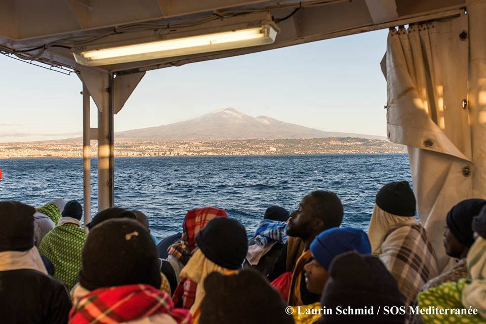
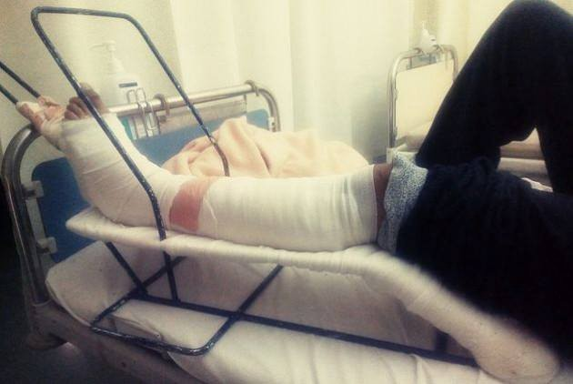

### AYS Daily Digest 19/01/2018 Another eviction in Paris

Updates from Gorizia /// Uk and France signed border agreement /// Demonstration called for the closure of Kærshovedgård deportation camp in Denmark /// More rescues in the Mediterranean sea /// Fascist threats to refugee in Greece /// New footages from Greek camps
#### Feature: Another eviction in St\. Denis, Paris

 \)](assets/48489b66a1bb/1*t6cqi-xQ6drQe1_rAv4-vw.jpeg)

St\. Denis, Paris \(Photo by [Verein FAIR\.](https://www.facebook.com/VereinFAIR/) \)

Confirming the rumors spread in the last week, the informal settlement in the Saint\-Denis area, Paris, was evicted on Friday morning, after a night of severe weather conditions\.

Several groups were on site to provide information and give people some time to pack their belongings, save blankets, tents, sleeping bags and personal effects from being taken away and destroyed\.

The makeshift camp hosted around 350 people\. The latest [information](https://www.facebook.com/permalink.php?story_fbid=835144720019635&id=598228360377940&hc_location=ufi) we received confirmed that 146 people had been taken to emergency centres in Villemonble e Port la Chapelle\. Others ran away or were left with nothing, to sleep rough once again\.

**Lebanon**

Local [media report](http://english.al-akhbar.com/node/23119) that at least three refugees, 5\-year\-old Majd Kheir al\-Badawi, 33\-year\-old Ammar Ahmed Kammal, and Mohammed Ibrahim Abou Daher, were found stuck in the snow having frozen to death on early Wednesday in Ain al\-Joz in the mountains by Shebaa\. According to [Retures](https://www.reuters.com/article/us-mideast-crisis-lebanon-syria/syrians-freeze-to-death-crossing-mountains-into-lebanon-idUSKBN1F81RO) , nine people were found\.

It is believed that the victims were crossing the mountainous border between Syria and Lebanon, having made their way from Beit Jinn, an embattled Damascus suburb\. As [reported by AYS](ays-daily-digest-15-01-18-suicide-attacks-in-baghdad-show-iraq-is-no-safe-third-country-78c842933eb6) earlier this week, civilians are still regularly coming under attack in Syria, yet the Lebanese Government has begun increasing border controls along the Syrian border\.

**Sea**

■■■■■■■■■■■■■■ 
> **[Missing Migrants Project](https://twitter.com/MissingMigrants) @ Twitter Says:** 

> > Unfortunately, the deaths of refugees and migrants often remain undocumented. The record of deaths that we have are underestimates, leaving untold the loss of life of thousands - @[AgnesCallamard](https://twitter.com/AgnesCallamard) [bit.ly/2hlSXoh](http://bit.ly/2hlSXoh)  #MissingMigrants https://t.co/ikgR3MzdzB 

> **Tweeted at [2018-01-19 17:35:15](https://twitter.com/missingmigrants/status/954406914758250496).** 

■■■■■■■■■■■■■■ 

#### Proactiva Open Arms prepare to return to sea

■■■■■■■■■■■■■■ 
> **[Open Arms](https://twitter.com/openarms_fund) @ Twitter Says:** 

> > Porque no hay tregua en el mar, porque #Europa sigue ciega y sorda, 
porque no habrá descanso para nosotros mientras haya vidas a la deriva #Med 
Misión 39 se prepara de nuevo para zarpar. 
#safepassage #WeStayinMed https://t.co/TGkgeSxQ04 

> **Tweeted at [2018-01-19 16:34:15](https://twitter.com/openarms_fund/status/954391566046593024).** 

■■■■■■■■■■■■■■ 

Because there is no truce at sea, because \#Europa is blind and deaf, because there will be no rest for us as long as lives are drifting, \#Med mission 39 prepares again to set sail\. \#safepassage \#WeStayinMed

[Salvamar Hamal](https://twitter.com/salvamentogob/status/954417212089040896) has rescued 12 people from Maghreb\. They are being transferred to Motril\.

[SOS Meditterranee](https://www.facebook.com/sosmedfrance/photos/pcb.2084149225191391/2084147361858244/?type=3&theater) report more than 1600 people have been rescued in the Mediterranean in the last few days\.

> “… rescue ships have reached the limits of their capacity, cargo ships have been diverted to the south to assist\. It is the whole organisation of rescue at sea off the coast of Libya, which is overwhelmed by the influx of boats in distress\. In view of the favourable weather conditions, this extremely dangerous situation is likely to continue in the coming days\. It is again hundreds or thousands of lives that are at stake _\(Klaus Merkle, the SOS Coordinator on board Aquarius\)_ 

The [Libyan coast guard](https://twitter.com/carlottasami/status/954302321210650624) are believed to have intercepted a further 1,431 refugees in the first three weeks of 2017\. Among them were 143 children\.

**We reiterate the urgent appeal to open legal channels\.**
#### [Aegean Boat Report](https://www.facebook.com/AegeanBoatReport/)

As of 19\.01\.18

Total number of refugees on the islands: 13\.334

LESVOS: Arrivals 448, Boats 10, On the Island 7100, Transfers 822

SAMOS: Arrivals 379, Boats 10, On the Island 2779, Transfers 210

CHIOS: Arrivals 119, Boats 3, On the island 1800, Transfers 355

OTHER ISLANDS: Arrivals 26, Boats 1, On the islands 1655, Transfers 99

BOATS STOPPED BY TCG/POLICE JANUARY: Refugees 1576, Boats 40

**Greece**
#### **Arrivals**

One boat arrived on Kagia beach, in the North coast of Lesvos, carrying 32 people \(13 children, 7 women, 12 men\) \.
#### Increased injuries in Patras

 s](assets/48489b66a1bb/1*78SSwZTTM_h5h2BLur3zvw.jpeg)

Photos by [NoBorder](https://m.facebook.com/story.php?story_fbid=1628694340531785&id=657905327610696&hc_location=ufi) s

NoBorders have [translated an article](https://m.facebook.com/story.php?story_fbid=1628694340531785&id=657905327610696&hc_location=ufi) raising the concerns of people working in solidarity about increased injuries to refugees around the port of Patras, where many people try to escape Greece by boarding ferries\. A total of 415 refugees are believed to live in abandoned buildings near the port\. This number has been relatively stable for some time and yet incidences of injuries have increased\. DocMobile stated that 12 people have been taken to hospital already this year with injuries to their heads and legs and that they reported that their injuries had been caused by police and port workers\.
#### Muslim Association of Greece and other groups targeted by right\-wing group

Crypteia, a far\-right group that attacked the home of an Afghan child last year, has made menacing phone calls to various civil society groups in Greece\. Stamou of the Muslim Association of Greece [stated to Al Jazeera](http://www.aljazeera.com/amp/news/2018/01/greek-neo-nazi-group-threatens-muslim-association-180119103914680.html?__twitter_impression=true) that:

> We are not intimidated as groups, Muslims or anti\-fascists\. The whole society is being targeted by these actions — _Stamou added —_ We don’t accept threats\. 

**Conditions on the islands still grim**

Several reports arrive from the islands, only to confirm that no action has been taken by the authorities to improve the living conditions of thousands of people stuck in overcrowded, cold and unhealthy open\-air prisons\.

More videos have been shared, showing new footage filmed inside Moria and Vial\.

From Moria:

And from Vial:

#### Call out from One Human Race for homeless family

Urgent housing needed for Afghan family with two\-year\-old \( currently they are sleeping outside Elionas\) \.

The family is registered with the Greek asylum service but are unable to find any accommodation\.

If you can help contact them through their [facebook page\.](https://www.facebook.com/groups/onehumanraceorg/permalink/1672655292792443/?hc_location=ufi)
#### The Unmentionables Resource Centre Opening Times

Find them at Spiridonos Trikoupi 3–5, Athens

**Spain**

Frontex has [stated](https://twitter.com/frontex/status/954291222893473792) that it has transformed Operation Indalo in Spain into a long\-term operation and that is will continue to assist Spain in “managing the challenging situation at its sea borders\.” This is a response to the belief that arrivals to Spain will continue to increase as 22,900 people are known to have entered Spain via Morocco or Algeria last year, up from 10,231 in 2016\. More on this report [here](http://news.trust.org/item/20180119113434-0cjun/) \.

**Italy**

Regarding the information reported in yesterday’s digest about the situation in Gorizia and Gradisca, we collected a different perspective from other [local volunteers](https://www.facebook.com/cassandra.capochiani.9) and [Umino NGO](https://www.facebook.com/umino.org/posts/1336571563114580?hc_location=ufi) \. We are aware that sometimes opinions on the situation in the field can be very different, so we decided to share both perspectives once again\.

> [_From January 15:_](https://www.facebook.com/areyousyrious/posts/941470856001798) We are waiting for transfers arranged by the central government for around 100 asylum seekers, possibly today or tomorrow\. A steady number of them arrives in Gorizia every day, around 350 are officially hosted in institutional places all year round\. After Christmas we reached the usual bottleneck with the newcomers as I noted already \(see my comment to a post on Jan\. 2\) \. We volunteers together with some Churches, Caritas and political parties found some temporary shelters for the extra people\. On Thursday night, despite our effort to find an emergency shelter, three people maybe slept outside\. We provided blankets and mats, and fortunately the temperature was not very low\. We eagerly await the transfers, otherwise we will put more pressure on the above mentioned helpers, who are the only ones to provide real shelters\. The local government is absent as usual\. On Friday we posted on local FB pages to ask for blankets, as not being sure where the asylum seekers were going to stay we wanted extra blankets for as many people as possible\. Our call received a positive answer from a volunteer association from Udine\. Everybody is safe, fed and warm for tonight\. Of course it’s not proper accomodation and human rights are not met in a due manner, but we volunteers are meeting basic needs\. 

**France**
#### Police brutality in Calais and Dunkerque

[FAST \(First Aid Support Team\)](https://www.facebook.com/groups/www.fast.eu/?ref=group_header) is collecting evidence on police violence in Calais and Dunkerque:

> Do you have any photos/videos of the injuries caused by CRS in Calais/Dunkirk? Lawyers in Paris are working on this at the moment\. If you do please E\-MAIL them to me: nynke@f\-a\-s\-t\.eu
 

> Don’t send them with Facebook please, only e\-mail\! 

**Austria**

The new Ambassador of Afghanistan urged the government not to forcibly return refugees to Afghanistan, according to [local media](https://mobil.derstandard.at/2000072501505/Afghanische-Botschafterin-in-Wien-will-Zwangsabschiebungen-stoppen?ref=article) \. He states that during the war the country lost everything and will need more international help in the rebuild\. Even though there may be ‘safe areas’, attacks can happen anywhere and the Taliban does not only hunt people working for the government, but also their families\.

**Switzerland**

There has been an important new ruling on the right of appeal against Dublin transfers in line with CJEU \(Court of Justice of the European Union\) \. The Federal Administrative Court of Switzerland \(FAC\) has approved the right of asylum seekers to challenge the incorrect application of responsibility criteria under the Dublin Regulation, which means it is possible to challenge the decision to return you to the first EU country you entered into, based on the expiry of the three\-month deadline for submitting a ‘take\-charge’ request to your entry country\.

> Previously, the FAC had dismissed complaints that were technical in nature on the grounds that they did not affect the individual legal positions of asylum seekers\. However, in its judgments in Ghezelbash and Karim, the CJEU concluded that the right to an effective remedy under Article 27\(1\) of the Dublin III Regulation covers an asylum seeker’s right to appeal against a transfer decision by pleading the incorrect application of one of the technical criteria for determining responsibility\. 

You can get more information on the case [here](https://www.bvger.ch/dam/bvger/en/dokumente/2018/01/E-1998-2016%20Dublin-III-Verordnung%20St%C3%A4rkerer%20Rechtsschutz%20f%C3%BCr%20Asylsuchende.pdf.download.pdf/MM_E-1998-2016_En_ohne-Embargo.pdf) \.

**Norway**

A [report](https://www.amnesty.org/en/latest/news/2018/01/norway-parliament-fails-to-protect-afghans-from-horrors-of-war/) published by Amnesty International states that the Norwegian parliament has decided to reject a proposal to place a temporary halt on returning people to Afghanistan\. This is a devastating blow to Afghan asylum\-seekers in Norway, and demonstrates a disturbing disregard for the lives of people fleeing war and persecution\. In 2017 Amnesty [documented](https://www.amnesty.org/en/documents/asa11/6866/2017/en/) the fate of many Afghans returned to Kabul — some have died, others have been injured in bomb attacks, or are living in constant fear of persecution\. The Norwegian Embassy in Kabul is heavily guarded and access is restricted for civilians\. How can they hide behind barbed wire and expect the families and individuals they have returned to survive on the streets?

**Sweden**
#### “The Migration Agency’s shortcomings and failures must be made visible\!”

Local media have published a letter written anonymously by staff at the Migration Agency, warning about serious deficiencies at the agency and describing current case handling as illegal, unpredictable and unsustainable\. The letter has been sent to the Justice Department and Migration Minister Heléne Fritzon and lists point\-by\-point, the failures and problems the staff have witnessed including heavy criticism of the head of the Migration Agency, Mikael Ribbenvik, concerns about the treatment of underage children and the long waiting times for asylum cases to be heard\.

**Denmark**
#### Demonstration to demand closure of Kærshovedgård deportation camp

Refugee activists living in the deportation camp Kærshovedgård published a [call for a demonstration](https://www.facebook.com/CLOSEKGH/posts/2066788116698131) on the 26th of January, with demands to close the camp and reopen their cases\.

> We demand:
 

> We want to live in freedom\!
 

> We want access to proper health care and necessary operations\!
 

> We don’t want to be treated like criminals\!
 

> We want our fingerprints removed from the European system\!
 

> We want our cases to be reopened\!
 

> We want the right to work\! 

Kærshovedgård currently houses 128 rejected asylum seekers, 15 people on tolerated stay and 46 people convicted to deportation\.

It is a former prison building, located in a forest 11 km outside Ikast in Jutland, and was opened as a deportation camp in March 2016\. It is designed as a removal centre, intended to be the last stop before deportation\.

> The camp is based on “motivational measures” — political strategies including the prohibition to go outside in the night, no access to kitchen and complete withdrawal of any economic support — to “motivate” rejected asylum seekers to leave Denmark as soon as possible\. 

Only four people have however been deported since the opening of the camp, and 22 people were granted asylum in Denmark after having been sent to Kærshovedgård\.

The rest are detained without a time limit\.

Read more about the conditions in Kærshovedgård and other Danish deportation centers [here](https://www.opendemocracy.net/can-europe-make-it/susi-meret-annika-lindberg-jose-joaquin-arce-bayona-martin-bak-j-rgensen/reclaimi) \.

**UK**
#### UK and France signed border agreement

As part of the new ‘Sandhurst Treaty’, ECRE [report](http://mailchi.mp/ecre/ecre-weekly-bulletin-19012018) that French President Emmanuel Macron and UK Prime Minister, Theresa May, have agreed that in addition to a payment of 50 million euros to support French border control, the UK has agreed to accelerate the examination and the transfer of unaccompanied minors from France to the UK\.
#### Donations needed for the Dunkirk Women and Children Centre

Bras Not Bombs Thrift Shop are raising money and collecting donations at their shop in the Midlands on Monday\.

Read [here](https://www.facebook.com/groups/1086525351391860/permalink/1744990655545323/) to find out what’s needed and how to help them\.

**Scotland**

The Scottish Parliament, who managed to meet their target to provide homes for 2,000 Syrian refugees as part of the UK’s Syrian Vulnerable Person Resettlement Programme three years ahead of schedule, are now considering a change to their electoral system that could give refugees living in Scotland the right to vote\.

> **We strive to echo correct news from the ground through collaboration and fairness\.** 

> **If there’s anything you want to share or comment, contact us through Facebook or write to: areyousyrious@gmail\.com** 

_Converted [Medium Post](https://areyousyrious.medium.com/ays-daily-digest-19-01-2018-another-eviction-in-paris-48489b66a1bb) by [ZMediumToMarkdown](https://github.com/ZhgChgLi/ZMediumToMarkdown)._
