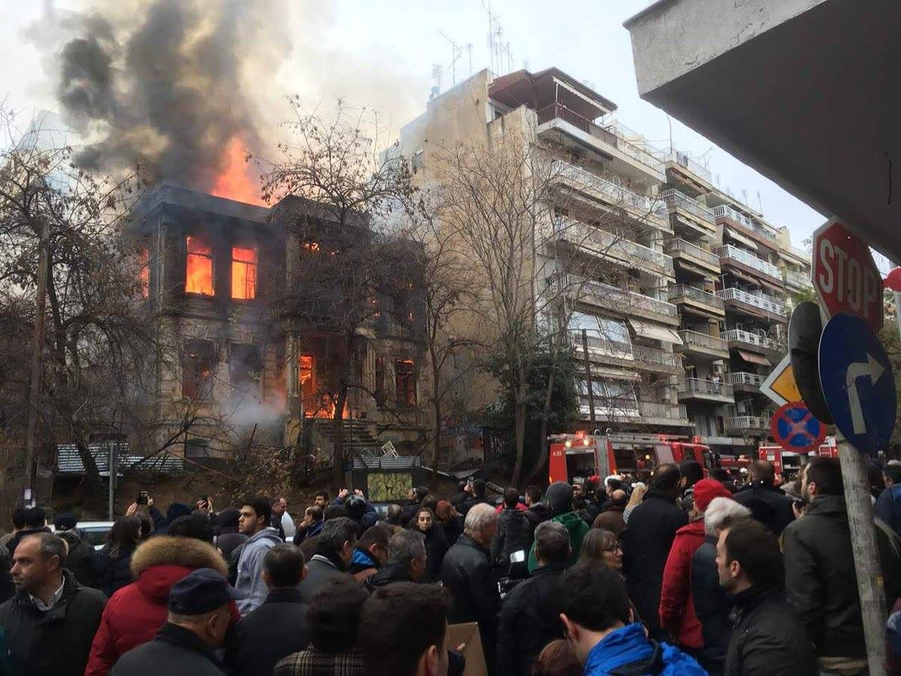
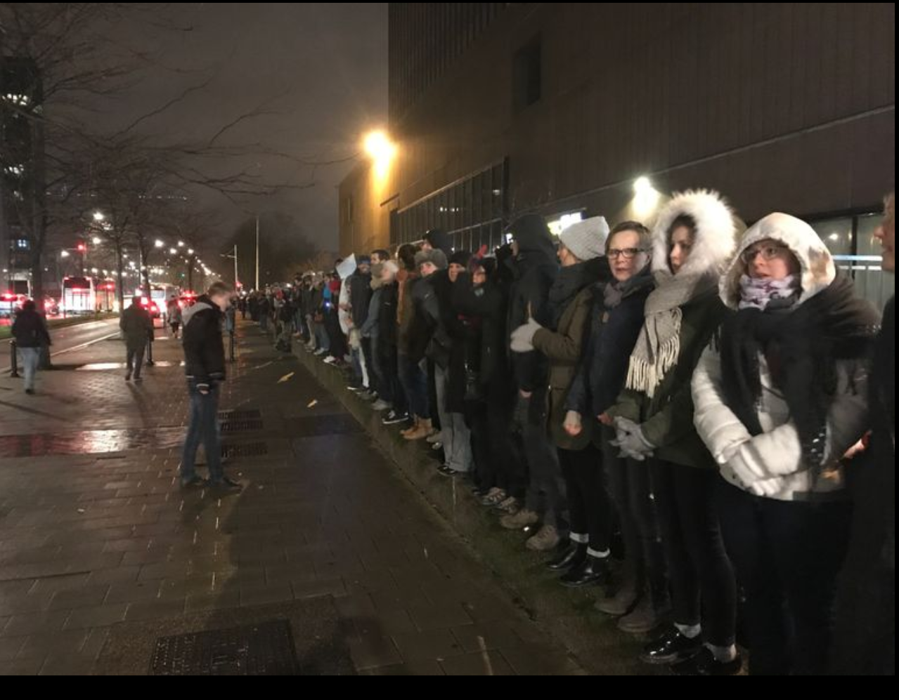
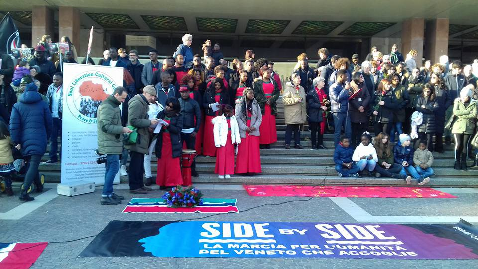

### AYS DAILY DIGEST 21/01/2018: Fascists set fire to squat in Thessaloniki

#### Feature

During the course of a far\-right wing demonstration, fascists torched a squat which had been active since 2008\. Between 30–40 people were in the building at the time of the arson attack\. Some of the participants of the demonstration, in which 100,000 people marched, took a detour to attack the Libertatia Squat\. Unfortunately, this is one of many events that fit the same pattern across Europe\. From Sweden to Germany to Italy, facilities which housed refugees were intentionally burned down by people who cannot tolerate the presence of foreigners in their countries\. Here however there is also the additional political element, a targeting of anarchists\. The Golden Dawn, a far\-right fascist party which has been known to violently assault refugees, took an active part in the nationalist demonstrations, and their presence at the site of the attack seems likely\.

Prior to setting fire to the squat, the group attacked the School Social Center, an attack which was recorded on video\. The attack was dispersed by the police, but those involved were able to go on to commit the heinous act\.

As the years pass, the far\-right feels more and more emboldened to act in the open\. The refugee crisis has presented an opportunity for the far\-right to reemerge on a scale which has not been seen in Europe since the Second World War\. The fascists wish to bring about the destruction of all who do not live up to their ideal, and if left unchallenged they will continue to grow\. It is for this reason that a demonstration will be held on Monday in front of the squat, to show the fascists that they cannot expect to spread their hatred unopposed\.
#### Greece
### Greek authorities fear renewed influx into the islands

Turkey is threatening to stop enforcing its agreement with the EU to prevent refugees from leaving to Greece, leaving Greek authorities worried that increases will continue\. Migration Minister Yiannis Mouzalas said that, “If the daily influx continues at this rate, from March onwards we will have to build a new refugee camp every month to host new arrivals,” in reference to the slowly increasing rate of arrival since the summer\.
### Be sure to check Northern Greece Volunteers’ website for a myriad of opportunities\!

[http://www\.northerngreecevolunteers\.com/](http://www.northerngreecevolunteers.com/)
### Chios Eastern Shore Response Team desperately needs volunteers\!

Volunteers are needed for the months of February and March\. The volunteer must commit to a stay of at least 14 days for this opportunity\. Their current project is the servicing of a children’s center in Vial, as well as the creation of a general House of the People, which may be donated to at the link below\.

#### Hungary
### Migszol responds to libelous accusations against them

Reports in the Hungarian media have smeared Migszol, claiming that the group has a connection to terrorism as well as other untruths\. The organization has responded strongly by [posting an article](http://www.migszol.com/blog/allegations-about-a-connection-between-migszol-bernadett-szel-and-national-security-risks-are-false) in which they rebuke the claims\. At best, such claims are an example of sloppy reporting by inattentive journalists, but it is much more likely that this is a part of Hungary’s continued campaign of delegitimization smearing of all who fight for the rights of refugees in a state which keeps them locked up in camps and largely cut off from the outside world\. It goes without saying that it is disheartening to see such tactics being deployed against the most vulnerable of people and their defenders\.
#### Belgium
### Thousands gather in Brussels to protest anti\-refugee policy, police action

Around 2500 activists formed a human chain in solidarity of migrants in Parc Maximilian and in the vicinity of the train station, to protest against the anti\-migrant politics of the government and planned police operations to control the refugees in the Parc that night\. But no refugee was present in the the Parc — they all found shelter in private accommodations during the weekend\. According to an [article in La Libre](https://l.facebook.com/l.php?u=http%3A%2F%2Fwww.lalibre.be%2Factu%2Fbelgique%2Fparc-maximilien-2500-personnes-forment-une-chaine-humaine-en-soutien-aux-migrants-5a64d31dcd70b09cefc82ae5%23.WmUNwZzGow4.facebook&h=ATO87WeYwKoWgyuvY7tRSmussx1nwXwh0EUwEDbxHSZG6ItwMn0eo5yT4LcAhDx2xiIAqVuQC1YZVmxe2utNycg69VPcfOpK08RgwyUlvXUHH2b4rKKbUfLY_cM1e_RcPPMd6qaQrzcp-xseCs62C4lieyDWdqNkV6sIPWMFTjZAtvMiYJOGyipzYTy7rxYCn4AKyNlaIVAB7np7bRSyEQxeqTliop4wYe1w6lmxvSKGorPWfyd379ZogrmDj4P8JskDAzd-EMyd17TppVUmwPwvKDE) , the police departments of Bruxelles\-Nord and City Center refused to take part at the operation\.

Protesters form a human chain to protest the arrest of refugees\. Photo Credit: Pierre Vandenbulcke
#### France
### CRS officer comes clean about CRS harassment of refugees

A CRS officer who wished to stay anonymous gave an interview to the Ebdo Journal\. The officer had worked in Calais for over 15 years\. “Oh, I have destroyed many encampments, I have emptied canisters of tear gas to contaminate people’s sleeping bags… In Calais I follow orders and I don’t think\. … I \[have\] colleagues who set tents on fire so badly that the fire brigade had to be called,” he told the journal\. Police brutality is a fact of life for refugees in Northern France\. One report by the Refugee Rights Data Project found that 91\.8% of refugees in Calais had experienced violence at the hands of police\. An English translation of the interview with the officer may be found [here](https://helprefugees.org/crs-officer-admits-police-brutality/) \. The officer, although he feels guilty for having been cmplicit in such acts, is adamant that the problem is systemic\. He goes on to say that regardless of the harsh policing measures in place, refugees will continue to flock to the area in the hopes of making it into Britain\.
### 150 refugees arrive in Calais over the last three days, mostly minors

Refugees, particularly minors, have been making the pilgrimage to Calais over the last couple of days\. They are primarily Ethiopians who heard a rumor that the Canadian ambassador will be distributing visas in Calais\.
### Refugees squatting in Saint\-Denis housed in gymnasium

On Friday, 168 refugees have been deported from Saint Denis and are now accommodated in a gymnasium in the city of Villemombole\. The mayor is not happy about the situation, saying that the State should take the responsibility for building longterm accommodation for refugees\. \(All sport activities in the gymnasium had to be stopped\) \. The eviction was quiet and peaceful, said the authorities\. This was corroborated by Zeborah Zeb, a volunteer on the ground, has written [a report](https://www.facebook.com/zeborah.zeboratious/posts/1720653091288906) on the relocation\. According to Zeborah, the relocation was very well\-organized, the people were informed in advance of the actions, and very few things were lost\.

People in Venice hold a bigil for Pateh, a Gambian man who drowned himself in the canals as a protest against Italy’s refugee policy\. Photo Credit: Veneto Accoglie
#### Mediterranean
### 34 people rescued at sea

Guardamar Polyhymnia arrived at midnight to Almeria after having rescued 34 people aboard the patera located by Sasemar 101 aircraft, while the Salvamar Spica transported the rescued to Almeria past 3 o’clock in the morning\.
#### General
### Online course for those interested in humanitarian aid

HarvardX has put together a course teaching the principles of humanitarian responses to crises\. The course will span 5 weeks and will use the situations in Goma, Somalia, the Balkans, Afghanistan, and Pakistan as case studies for humanitarian aid as a whole\. Registration may be found below\.

> **We strive to echo correct news from the ground through collaboration and fairness\.** 

> **If there’s anything you want to share or comment, contact us through Facebook or write to: areyousyrious@gmail\.com** 

_Converted [Medium Post](https://areyousyrious.medium.com/ays-daily-digest-22-01-18-fascists-set-fire-to-squat-in-thessaloniki-cc4061c4e5b7) by [ZMediumToMarkdown](https://github.com/ZhgChgLi/ZMediumToMarkdown)._
