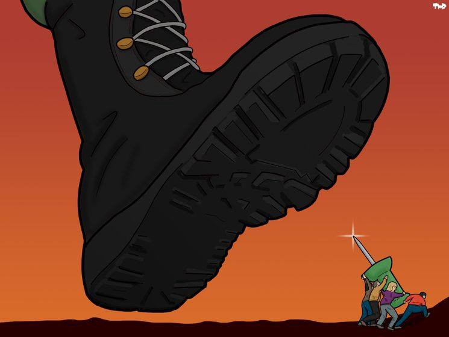
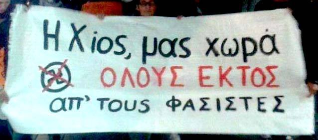
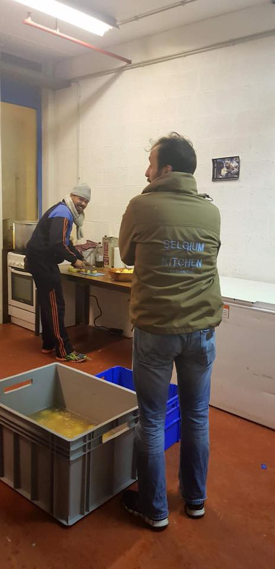

### AYS Daily Digest 25/01/18: Chaotic “winds of change” bring little hope from above

_The erratic rulings of the European Court of Human Rights show a principle of form over substance / Bulgaria looking for European “compromise” on refugee quotas / Chios municipality responds to upcoming Golden Dawn presence / Protests and volunteer opportunities in Italy / Continued police harassment in France / Volunteers speak out against wrongdoing of Belgian minister / Protest against inhumane detention center in Denmark / And more news…_

Photo Credit: Art Against\.
### FEATURE

Bulgaria has taken the lead in pushing for new “migration reform,” having now assumed the presidency of the council of the European Union\. Those who support the fair and equal treatment of refugees and migrants had a bitter taste in their mouth over the praise Bulgaria received from Juncker, who said that Bulgaria was an example to others in policy, including migration\. Considering the large body of evidence showing systematic abuse and unlawful treatment of refugees, this development is disturbing\.

For a video summary, click below\.

As expected, the new presidency’s priority is to “bridge the East\-West split” on refugee quota rules\. This is expected to be “resolved” in June with a “compromise\.” Many countries including Poland, Hungary, and the Czech Republic have bristled at the implementation of EU refugee quotas, which they say violate their right to sovereignty\. We can only expect that the “productive compromise” will come at the cost of those who have the least voice in the matter — the refugees\.

However, not all news is bleak as the European Union Court has officially barred bizarre and disturbing [“sexual orientation tests”](http://m.dw.com/en/eu-court-bars-sexual-orientation-tests-for-asylum-seekers/a-42299045) in determining applications for asylum based on persecution of LGBTQ applicants\. The case in question was that of a Nigerian man who requested asylum in Hungary in 2015\. The Hungarian government sought to “test” the validity of his claims\. The Court affirms that these tests would constitute a gross violation of privacy of the applicant\.

Nevertheless, in another zag after a zig, the European Court of Human Rights declared that detention on Chios is not dire enough to merit a violation of human rights, in spite of months of reports of horrific conditions for refugees stranded there\. The case in question involved a group of three people from Afghanistan, detained on Chios and awaiting deportation\. In addition to [volunteers speaking out](https://www.facebook.com/photo.php?fbid=1978163952200503&set=a.279309615419287.84795.100000207536677&type=3) about the horrific conditions in Chios, particularly in the prison, [other individuals](https://www.facebook.com/electra.koutra/posts/10215250748171487) have expressed concern about the precedent being set by this recent ruling, which could open up the possibility of police interrogating refugees about various confidential information previously under the protection of a client\-lawyer relationship\!

On [January 24th, the Global Detention Project](https://reliefweb.int/report/greece/greece-immigration-detention-profile-january-2018) released a profile on Greece, decrying the poor conditions and lack of suitable support for those there, who for most intents and purposes can be considered “detainees” whether they reside in a “closed” camp or not\.

> “Greece’s immigration detention practices more generally raise several concerns, including: the country’s resistance to using alternatives to detention; its systematic detention of children; the issuing of detention orders that lack individual assessments; inadequate conditions of detention; and the use of police stations for immigration detention purposes\. For these reasons, Greece’s detention system has attracted broad international condemnation — including from four UN Special Procedures and four UN human rights treaty bodies — and have prompted more than 20 rulings by the European Court of Human Rights\.” 

This comes shortly after Human Rights Watch also published a profile of the situation for refugees in Greece\. They too express grave concern over the treatment of, and lack of sufficient support to, refugees, [particularly in locating high\-risk cases on the islands](http://greece.greekreporter.com/2018/01/19/human-rights-watch-annual-report-bleak-for-refugee-treatment-in-greece/) and transporting them to the mainland\.

No Borders recently [published a notable case of this](https://www.facebook.com/nobordersnetwork/photos/a.660787423989153.1073741828.657905327610696/1634766553257897/?type=3&theater) in Moria, where an individual from Pakistan facing serious health complications was taken to a detention camp after complying with the results of his initial asylum application being rejected and applying for a request based on subsequent protection\.

> “The 30\-year\-old refugee of Pakistani KM, received rejection of his request for asylum before Christmas, and voluntarily went to police to file a request for a subsequent application for international protection, as he is entitled by law\. Having the testimonies of doctors confirming the serious health problems he faces, he said he trusts the Greek justice\.” 

He remains in detention and several groups are calling for his release\.

The conclusion of all of this is the fact that “European justice” seems to focus more on form rather than substance\. Rather than seeking to thoroughly engage and have the courage to tenaciously seek and enforce long\-overdue reform and impress upon all world citizens the importance of valuing human lives, no matter their “paperwork status,” easy answers on open and shut preposterous cases are preferred, leaving thousands of lives in the mire of suffering\. This is the cost of “unity” — erasing the rights of those most vulnerable\.
### GREECE

_Updates at a glance…_

**_Deportations as of 25/01 \(third deportation this year\)_**
- Three Algerians and one Pakistani under EU\-Turkey deal
- One Pakistani under the bilateral agreement
- One Turk on the 22nd and two on the 24th by land under the EU\-Turkey readmission agreement

**_Registrations/transfers \(official\) 25/01_**

Lesvos: 0/1
Samos: 0/20
Kos: 0/16
Others: 0/1
Total: 0/38

No new registrations been reported in the last three days\.

The Greek Asylum Service has released a comprehensive set of statistics\. Click below to enlarge:

■■■■■■■■■■■■■■ 
> **[Migration Greece Info](https://twitter.com/MigrationGrInfo) @ Twitter Says:** 

> > Updated Asylum Service statistical data: [bit.ly/2DBzObE](http://bit.ly/2DBzObE) - Complete dashboard: [bit.ly/2DBr7OF](http://bit.ly/2DBr7OF) https://t.co/t4f90RiCNv 

> **Tweeted at [2018-01-25 10:32:14](https://twitter.com/greekasylum/status/956474787144126464).** 

■■■■■■■■■■■■■■ 

Refugee Info Bus is announcing a new series of videos for the coming weeks in order to assist educating people on their rights and procedures to follow\. Here is the introduction\.

In the aftermath of ongoing and increased activity of Golden Dawn, and the anticipated arrival of the group next week, the Municipal Council of Chios took a stand to denounce the group’s actions\.

> “The presence of the neo\-Nazi organization is the greatest challenge to the democratic morals of the island, and the Municipality of Chios can not remain impregnable\. The undercover members of the Nazi organization are unwanted in Chios\. Chios of national resistance and democratic struggles in the strongest and most categorical way deplores the presence of the descendants of Nazism in our country” 

[The source](https://www.facebook.com/lathra.chios/posts/1772497532781113) can be read in full here\.

This stance should set the tone for how local and regional governments—and individual citizens — can act against the pressure to become a member of an ‘agentless state’ — a concept articulated in the work “The Banality of Evil,” which analyzes the way in which individuals generalize and justify their role in tolerating and helping to carry out fundamentally evil actions and violence upon one another\. The purpose of this agentless state is to so thoroughly recruit complicit “agents” from the population, that no formal agents are required\. A common way to do this is for people to blame their system and surroundings rather than taking personal responsibility for their responses\.

“Chios has enough “space” for everybody but fascists”

Rather than taking the easy way out and dismissing the concerns of others over recent demonstrations and attacks as “not our problem as not all Greeks are like this” or assigning blame to “the system,” the Municipal Council of Chios calls wrongdoing what it is and makes it known that there shall be no kindness towards or tolerance of this kind of dangerous, toxic behavior\.

Start and keep starting\.
#### Call for volunteer physicians and translators

The Syrian American Medical Society is in urgent need of volunteer physicians and translators\! They operate on Chios, Leros, and Kos, and especially need Arabic and Sorani translators\. Volunteers must commit to one week\.

Please contact sgrvolunteers@sams\-usa\.net if you are interested\.
### SERBIA
#### UNHCR Update

According to UNHCR, there have been 497 registered intentions to seek asylum in Serbia, 33% of which were minors\. In addition, there have been 28 applications for asylum, zero persons granted refugee status, and one person granted subsidiary protection\. Additionally, UNHCR noticed a small drop in the number of expulsions from Romania, Hungary, and Croatia, totaling 793 \(down from 929 in December\) \. Of these, 384 were from Croatia, 267 from Romania, and 142 from Hungary\. Many stated that in the process of expulsion, they were denied the right to request asylum amongst other forms of maltreatment\.
### ITALY

On Friday, February 3rd, there will be a demonstration held by Side by Side marching for rights and humanity in Chioggia, Italy\. This march came out of a similar one held in Venice last year in reaction to the rising sentiment of racism on both an individual and institutional level\.

> “Social backgrounds promoting the demonstration “ _for humanity_ ” on the next February 3rd, originated even in this case from the necessity of countering a local context that saw many xenophobic events and happenings\. Just to mention few of them: the fascist beach in Sottomarina, the coward aggression against the migrants in Portogruaro, the beating of a young refugee in Sottomarina, the indecorous conditions of the welcoming procedure in the centre “Al Bragosso” in Chioggia\. 

> Nonetheless, the demonstration on February 3rd originates especially from a public engagement in the rights of migrants as well as from welcoming and solidarity practices, born from the supportive realities of the Venetian area, that thus together are building an anti\-racist shelter openly against the inhuman policies directed towards migrants\.” 

If you can be in the neighborhood, follow this link [for more information](http://www.meltingpot.org/On-Saturday-February-3rd-in-Chioggia-Italy-Side-By-Side.html#.WmsIzJM-do4) \!

Please find attached a helpful \.pdf that seeks to answer questions relating to people arriving in Italy\! Check it out and share\. The guide was put together by “Welcome 2 EU\.”

As of 20 hours ago, Tunisian protestors advocating to be moved from Lampedusa were in discussions with police\. Prior to this, around fifty people were protesting on the church steps to be removed within 48–96 hours\.

](assets/5f2678f1650b/1*s0I15N03msAba7N7wnTRFw.jpeg)

Peacefully protesting\. Photo credit: [**Askavusa Lampedusa**](https://www.facebook.com/askavusa/)

The situation in Lampedusa has been decried by many different entities, including the detainee rights ombudsman\.
#### Italian volunteers needed in Rebbio

Volunteers are needed in Rebbio for Italian classes: Monday, Tuesday, Thursday from 20h30 to 22h00\. For more information, go [here](https://www.facebook.com/comosenzafrontiere/posts/839266806235381) \.

SolidariTea posted a long update on their activities in Ventimiglia\. They point out that every day, more and more women and children are arriving, and there is a significant lack of support to seek out the most vulnerable\.

> “Recently there have been two babies under 4 months sleeping under the bridge\. The youngest of which is 2 weeks old\. She was staying with her mother IN A TENT for two nights before she was transferred to more stable accommodation\.” 

Photo Credit: SolidariTea\.

Independent volunteers are again filling the gaps and have decided to make an information board in order to keep people in the area up to date\. As such, SolidariTea is requesting translators of Pashto, Arabic, French, and Tigrinya\.

For the full report, go [here](https://www.facebook.com/refugeesolidaritea/posts/1253201954781558) \.
### FRANCE

The School Bus—Mobile Education for Refugees team has a short, but no less disturbing update on the situation in northern France\. After having to take time to organize outreach and support after several days of technical issues, [they found their attempts to bring support subverted by increased police activity](https://www.facebook.com/TheSchoolBusProject/posts/754928881364943) \.

> “Heavy and provocative police activity, including the clearing of tents and sleeping bags and use of teargas, led to severe disruption at the largest migrant community\. In an already highly tense situation, due to repercussions from last week’s political announcements, this rendered it impossible for us to attend, with the same problem for other organisations, including those distributing essentials” 

This activity comes on the heels of an ongoing campaign by the French government to repress support for refugees and migrants\. The French government had earlier, in typical fashion, blamed migration on volunteers and support organizations, in an ongoing, fruitless endeavor to shift blame and responsibility away from themselves\.

YRS is seeking to expand their operations in northern France and there are, thus, more volunteer opportunities \(around ten needed\! \) \. Their focus is primarily to tend to the many minors trapped in this horrific situation\. Living expense contributions can be made to volunteers with a significant time commitment and desirable skills\.

There is detailed information on what is needed for each position \(two administrators and eight youth assistants are needed\) \. Please follow the [link](https://www.facebook.com/refugeeyouthservice/posts/1964606090525771) for more information\!
### BELGIUM

An in\-depth report was published on the volunteering movement assisting refugees facing great resistance\. The report also details the scandal earlier this month regarding Belgium’s **Secretary of State for Asylum and Migration** who was found to be colluding with the Sudanese government in taking back refugees who were fleeing political persecution, exposing them to torture\. Watch for more testimony\.

Additionally, the Belgium Kitchen is in need of volunteers for evening meal distribution and for kitchen prep\! Click [here](https://www.facebook.com/BelgiumKitchen/photos/a.657057397766358.1073741829.616888531783245/975268079278620/?type=3&theater) for more details, and read below for fast information\.

“If you want to help us, send an SMS to Yassine at \+32 488 88 82 27 stating: your name \+ what you want to help \(cooking or distribution\) \+ your availability \+ if you are motorized or not\.

A big thank you and see you very soon\!”
### DENMARK

On January 26th at 15h00, there is a demonstration against the deportation camp at Kærshovedgård\! In addition to being a deportation camp, it is also considered to have quite inhumane conditions\. There’s still time to get involved; so, if you are in Copenhagen, click the link [here](https://www.facebook.com/events/2024289631188207/) \!

_Converted [Medium Post](https://areyousyrious.medium.com/ays-daily-digest-25-01-18-chaotic-winds-of-change-bring-little-hope-from-above-5f2678f1650b) by [ZMediumToMarkdown](https://github.com/ZhgChgLi/ZMediumToMarkdown)._
