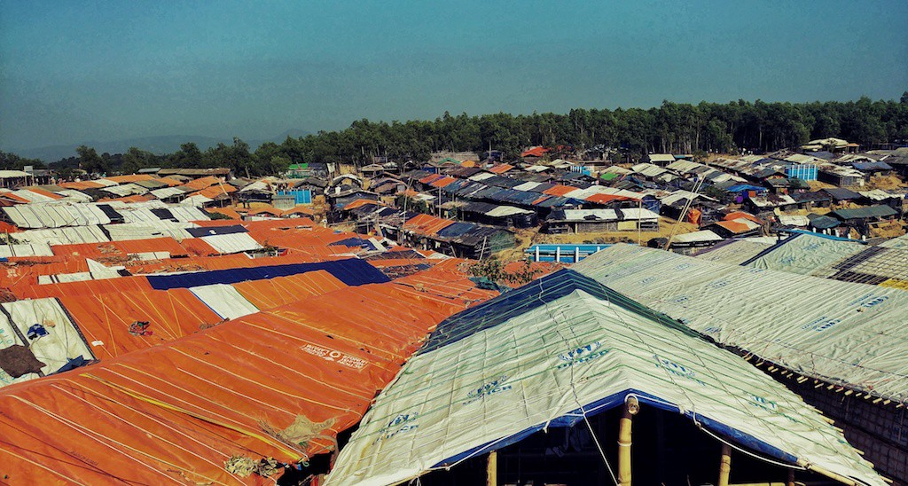
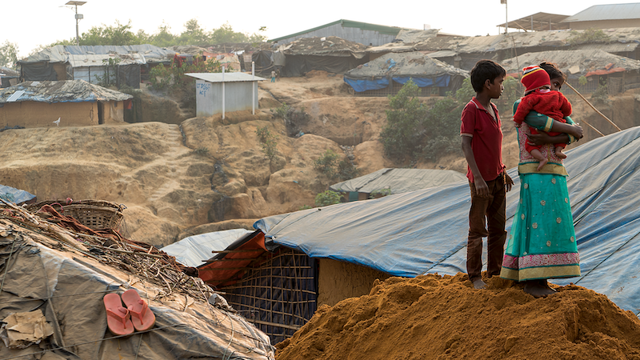
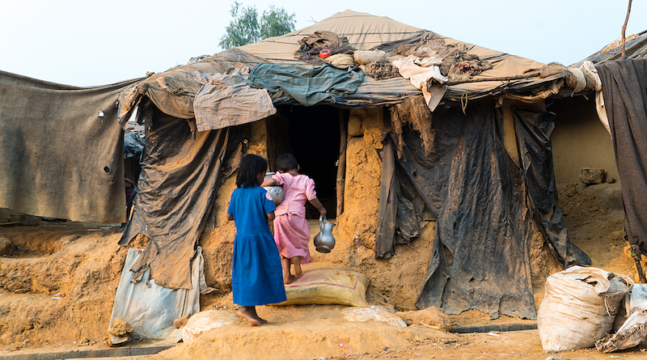
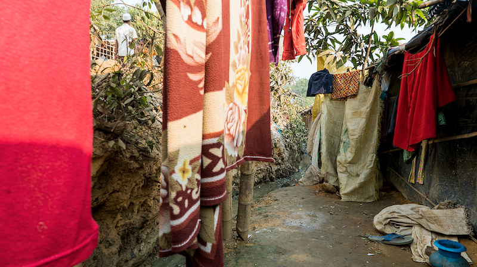
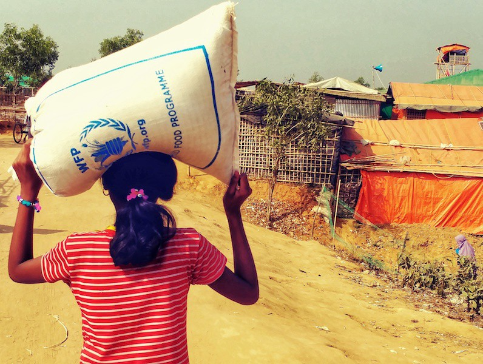

### AYS SPECIAL: Stateless in Myanmar, stateless in Bangladesh

_Bilateral repatriation deal to return 750 000 Rohingya refugees temporarily postponed_

_Just one section of the massive expansion to Kutupalong refugee camp\. Prior to over 660,000 new arrivals since Aug 25th, this camp had 34,000 registered refugees\. This section alone now has 15,000 new arrivals\._

This week the Bangladesh government planned to start a repatriation process of returning Rohingya refugees back to Myanmar\. The controversial bi\-lateral deal, which plans to send 750 000 Rohingya back to Rahkine State, was due to start on January 23rd, but was postponed at the last moment\. The reasons for the delay are are logistical\.

According to the government, not enough hot spots have been prepared along the way to secure and support the passage of refugees\.

**Nobody is ready to return to Myanmar**

Although a protest led by refugees against the repatriation deal happened few days ago, most residents of the camps were completely unaware of the plan to send them back\.

According to the UN over 900,000 Rohingya refugees now live in the Cox’s Bazar region, with new arrivals continuing to force daily camp expansion\. Government actions have been criticized by many international organizations who stress that repatriation can only happen on a voluntary basis, and authorities didn’t consult or even inform the population about their plans\.

Despite multiple public statements honoring a voluntary process by several officials with the Refugee Relief and Repatriation Commissioner \(RRRC\) the Bangladeshi government has already declared the plan will cover everyone who fled Myanmar since October 2016\. This leaves no doubt that many would be forced to move against their will\.

_An entire generation of Rohingya has been born here\. 34,000 Rohingya refugees have been in Kutupalong since the 1990s\._

Still traumatized after unimaginable physical and psychological violence faced by the Myanmar army, almost everyone stressed the necessity of having their basic rights guaranteed before returning\. These rights include freedom of movement, right to formal education, which has been legally denied since 2012, and legal rights to secure jobs within official local and national structures\.

**Generations of Statelessness**

Given the history of relations with Rohingya and the political situation in Myanmar, it seems unlikely any of these demands will be met any time soon\.

_As the camp expands, basic emergency shelters made of flimsy tarps and thin bamboo have taken over the countryside\. This house, which also isn’t prepared for the Monsoon season, represents what a permanent structure looks like in Kutupalong\._

For decades, Rohingya Muslims have been without representation or advocacy within State structures\. The Council on Foreign Relations has reported that the Myanmar government has effectively institutionalized discrimination against the Rohingya through restrictions on marriage, family planning, employment, education, religious choice, and freedom of movement\.

For example, Rohingya couples in the northern towns of Maungdaw and Buthidaung are only allow to have two children\. Rohingya must also seek permission to marry, which may require them to bribe authorities and provide photographs of the bride without a headscarf and the groom with a clean\-shaven face\. To move to a new home or travel outside their townships, Rohingya must gain government approval\.

After major crackdowns on Rohingya civilians by the Army, two major influxes of refugees fled to Bangladesh in the 1970s and 1990s\. Despite receiving official asylum status, most who fled to Bangladesh continue to live in the camps built upon their arrival, with an entire generation having been born in exile\.

_New emergency shelters have been erected absolutely everywhere, including directly next to raw sewage\. The rains are yet to arrive, but these houses already deal with regular flooding\._

The biggest wave of Rohingya refugees to date finds its roots in events of last Autumn\.

On August 25th 2017, Myanmar State media reported that 12 security officers had been killed by an armed raid led by ARSA\- Arakan Rohingya Salvation Army, a small guerrilla group numbering in the hundreds\. In response, the Myanmar Army claimed justification for an ongoing military operation in Rakhine State, which killed roughly 400 in early September\.

While the army claimed all were rebels, Doctors Without Borders reported 6,700 killed by September 24th\. Whole villages have been burned to the ground, unarmed civilians were shot dead and rape has been commonly used as a war tactic by the army\. Those that survived fled out of fear with many dying of wounds and hunger on their journey to Bangladesh\. It is seemingly impossible to find anyone in the refugee camps who has not experienced violence or witnessed family members being killed\.

French President Emmanuel Macron, who flatly called it “a genocide” at the UN General Assembly meeting in September, stated he would work with other members of the UN Security Council\.

_Rohingya are not legally allowed to work or pursue formal education in Bangladesh\. Distributions are far from adequate, so an intense and nonstop market informal economy has evolved\. Each bundle of wood costs 50 Taka \($0\.60\), and an average home needs at least 2 per day for cooking and heat\._

“We must condemn this ethnic purification which is underway and act,” Macron said\.

Lately Bangladesh’s foreign minister agreed with Macron’s statement, however the repatriation plan has only been postponed, not cancelled\.

**Still Stateless**

From an economic point of view, Bangladesh simply can’t handle more than 660 000 new Rohingya to enter the labor market of a country that can’t secure stable employment for its own citizens\. Local NGO leaders, who have been building structures and providing services since September, believe the government has denied refugee status to avoid Rohingya from feeling that Bangladesh will host them for a longer time\.

_On the current outskirts of the main camp area, about a 45minute walk from the center of Kutupalong, some NGOs have banded together in a group called \#uniteforcharity\. They are deep into the process of building 700 family homes that will survive the Monsoons, and they employ Rohingya throughout the process\._

Despite the need for more sustainable building that will withstand the coming monsoon season, current policies do not allow for any permanent structures to be built in the camps or surrounding areas\.

Despite the presence of many international and local organizations, services in the camps are still very basic\.

Many of the shelters built a few months ago are already partly destroyed and most will not endure the approaching monsoon and typhoon season\. About 700 000 Rohingya depend completely on food aid provided by the World Food Program\. Rations are not big enough and consist of only rice, lentils and vegetable oil\.

Currently, some 90,000 people have been enrolled in WFP’s new e\-voucher programme, under which they receive a monthly amount on a pre\-paid debit card for use in allocated shops\. Card holders can buy 19 different foods, including rice, lentils, fresh vegetables, chillies, eggs and dried fish\. Meanwhile, most who manage to secure some savings buy food items at local markets or rent small shops inside the camps to earn as little as 100 Taka \(1,25$\) a day to feed the family\.

Few opportunities are available for Rohingya in the camp\. Sadly, the luckiest are those who have grown up here as registered refugees\.

80% Rohingya are relying on life\-saving assistance\. World Food Program is providing food and vouchers to more than 700,000 refugees in the area of Cox’s Bazar\. Food distributions consist of rice, vegetable oil and lentils\.

Still not allowed in the Bangladeshi school system, they at least have enough education to work as translators and workers for international organizations\. Young men can find temporary employment building clinics, community centers and shelters of other use commissioned by NGOs\. Meanwhile, women and children who make up over 50% of the population, depend completely on humanitarian aid, which means daily waits in gigantic, chaotic lines for pre\-determined support that most say isn’t even close to sufficient\.

As Charmain Mohamed, Amnesty International’s Director for Refugees and Migrant Rights put it, “there can be no safe or dignified returns of Rohingya to Myanmar while a system of apartheid remains in country, and thousands are held there in conditions that amount to concentration camps\.”

**_\(By Sonia Nandzik & Douglas Herman: Cofounders\- @1976km\. Reporting from Cox’s Bazar, Bangladesh\. Photos_** @dfherman\)

> **We strive to echo correct news from the ground through collaboration and fairness\.** 

> **If there’s anything you want to share or comment, contact us through Facebook or write to: areyousyrious@gmail\.com** 

_Converted [Medium Post](https://medium.com/are-you-syrious/ays-special-stateless-in-myanmar-stateless-in-bangladesh-26dacf6586b8) by [ZMediumToMarkdown](https://github.com/ZhgChgLi/ZMediumToMarkdown)._
