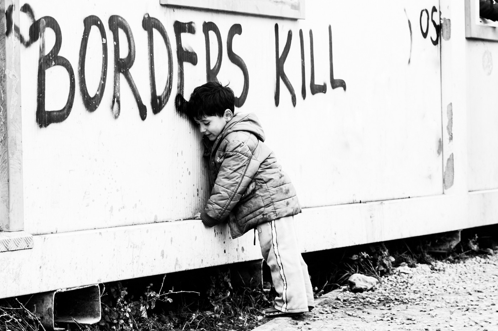
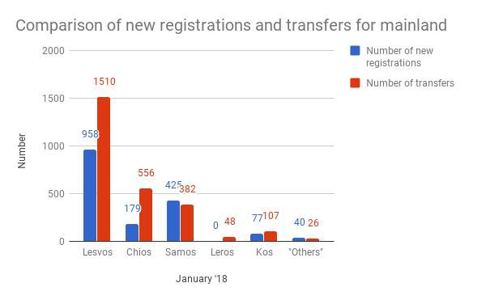
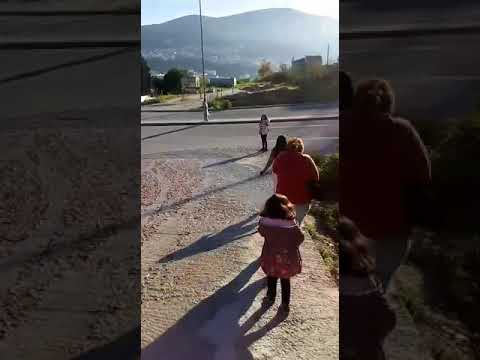
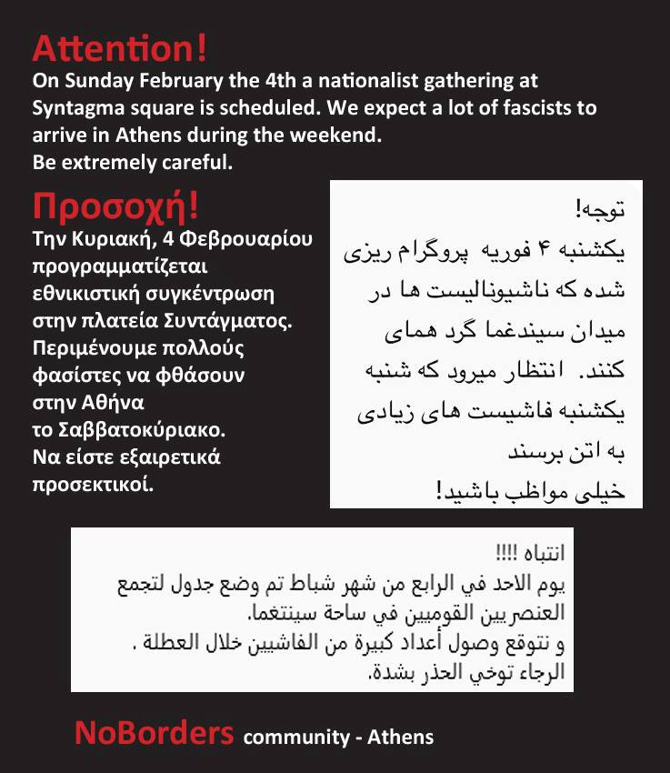
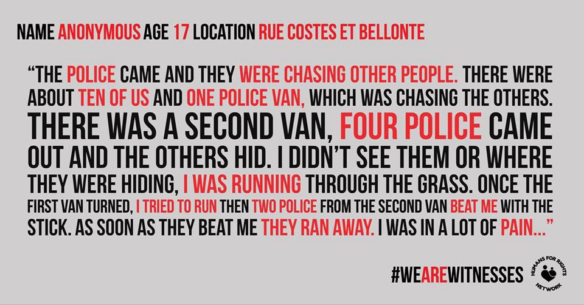
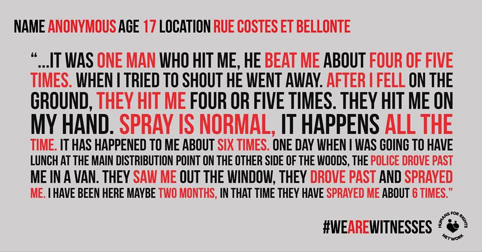
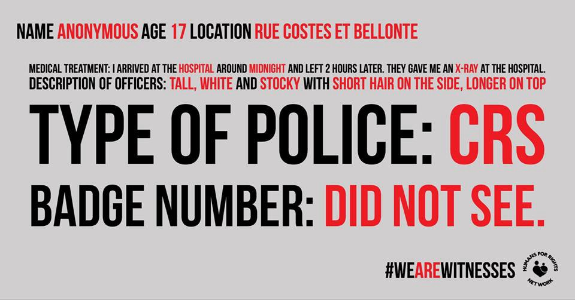
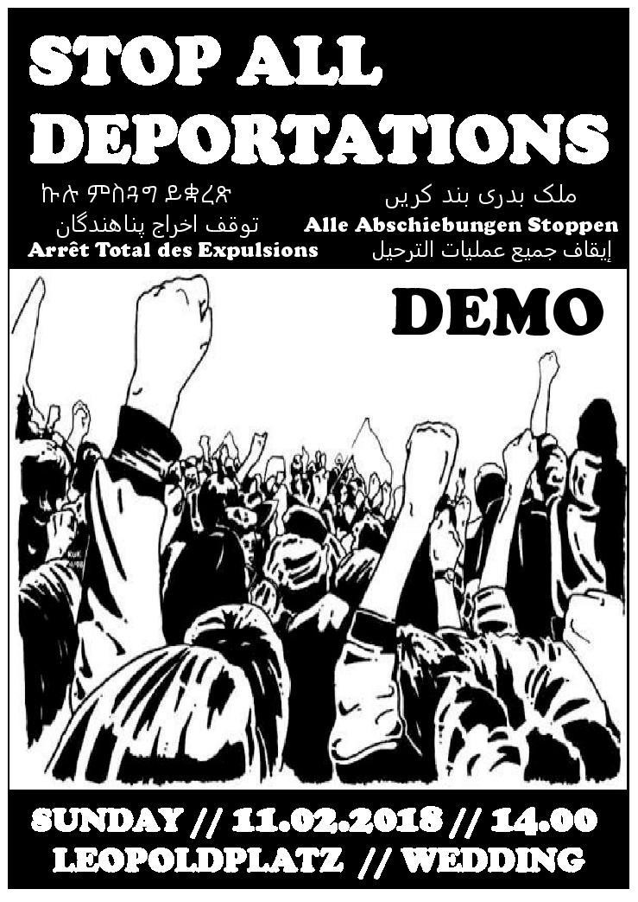

### AYS Daily Digest 01/02/18: One year on, Europe is still supporting slavery in Libya

_WARNING: Fascists on the loose in Athens / New testimonies of Police brutality in Calais / Unfair treatment of minors on the northern border of Italy / New FRONTEX Operation Themis to start today in the Mediterranean / Calls for demonstrations in Berlin and London / And more news…_

Edoardo Premoli \( \#overthefortress a Idomeni, 2016\)
### FEATURE: One year of the Italy\-Libya deal

One year on and the Italian and EU governments are still supporting Libyan violations, violence, and harassment despite increasing pressure from international and humanitarian organisations\. Let us not forget that even though the flurry of interest in the Libyan slave trade after the [CNN documentary](https://edition.cnn.com/videos/world/2017/11/29/libya-slave-trade-cnntalk-lon-orig-mkd.cnn) has died down, people are still stuck, still tortured, and still being ransomed and sold\.

To mark this repulsive anniversary, [NGOs call](http://www.meltingpot.org/In-Libia-violazioni-violenze-e-soprusi-con-il-beneplacito.html?var_mode=calcul#.WnRRuLNG3IU) once again for an end to the Italy\-Libya agreement\.

> An exact year from the Italy\-Libya agreement on migration, Oxfam and Borderline Sicilia ONLUS call on the European Union and the Italian government to withdraw the agreement immediately, which creates suffering and does not respect international law\. They do so with a new report that collects evidence of death and torture suffered by migrants in Libyan detention centres\. 

A report by the Institute for Security Studies on the anti\-human smuggling business and Libya’s political end game clearly states that Europe’s continued support of different Libyan factions is creating further political instability and is putting people at greater danger of abuse and exploitation\.

> The hyper focus on stemming the flow of migrants via Libya by Italy and the European Union \(EU\), is encouraging an anti\-smuggling business to emerge\. Militia leaders, sensing an imminent end to the political status quo, are attempting to launder their reputations by accepting incentives to serve as law enforcement partners of international donors\. This co\-option creates instability, sabotages the state\-building process and further drives the exploitation and abuse of migrants in the country\. A stability\-first approach is needed\. 

See the link below for further reading\.

Yet, according to Amnesty, in 2017, approximately 20,000 people were intercepted at sea by the Libyan coastguard and transferred to the notorious detention centres in the country\. Just today [independent reports](https://twitter.com/mmic78/status/959120331758817281) state that another 40 survivors from a boat said to be carrying 100 more migrants were brought to the port of Zuwara in Libya\. Of the bodies found after the wreck there were Bangladeshis, Moroccans, and Libyans from Ajeelat\.

> **When will the EU stop making deals with countries like Libya and Turkey whose own citizens are fleeing persecution at the hands of the state?** 

### **SEA**

[Sea Watch](https://www.facebook.com/seawatchprojekt/posts/1978713012346770?hc_location=ufi) report that they received a distress call from the Maritime Rescue Coordination Centre in Rome before sunrise this morning\. They found the boat in distress about 14 nautical miles north of Abu Came Mash \(Libya\) \. 157 people were in an unsafe sailing boat, but all safely boarded vessel Sea Watch 3\. In January, crews have rescued almost 1000 people in the Mediterranean — fortunately there was no loss of human life in this particular rescue\.
### **SPAIN**

The president of Melilla has [reportedly](http://www.publico.es/sociedad/presidente-melilla-pide-no-comida-ni-mantas-menores-extranjeros-viven-calle.html) asked that food and blankets not be given to foreign children living on the street as it discourages them from returning to the reception centre where they are supposed to be take care of\. However, local groups have recently shown that the centre is overcrowded and badly maintained, rather than a suitable space for unaccompanied children seeking refuge\.

■■■■■■■■■■■■■■ 
> **[asoc.PRODEIN melilla](https://twitter.com/PRODEINORG) @ Twitter Says:** 

> > Entendemos que los niños prefieran la calle e incluso escapar de Melilla como polizones antes de ir a los centros.
Como puede decir Imbroda que está muy satisfecho de las condiciones del centro? https://t.co/XO13oOUape 

> **Tweeted at [2018-01-24 16:20:43](https://twitter.com/prodeinorg/status/956200099981545473).** 

■■■■■■■■■■■■■■ 

### ITALY

The group [Italy — Refugee Crisis Database](https://www.facebook.com/groups/1834254390190027/?ref=group_header) have published a detailed account of the Italian attempts to reduce the migratory flux\.

The report spans the period from the first deal signed exactly one year ago between Italian and Libyan government to the the launch of the Themis Operation in the central Mediterranean on Febraury 1st, 2018\.

The report is available in Italian, English, Arabic, Spanish, and German\. Read and download it here:

As Infomigrants [report](http://www.infomigrants.net/en/post/7320/scholarships-in-italy-offer-job-training-to-40-migrants) , Terres des Hommes, in partnership with the City of Milan, activated 40 [scholarships](https://terredeshommes.it/borse-studio-migranti-2018/) for the “inclusion of young migrants\.” The project aims to provide young migrants in the Milan area with job training organized by the city’s council for labour policies\.

Participants will receive a maximum of 470 Euro for travel expenses and a scholarship of 400 Euro a month during their trainee\-ship for a maximum of six months\.

The program is open to asylum seekers and migrants aged 17 to 30, residing in Milan’s metropolitan area, and with a B2\-level \(or above\) knowledge of the Italian language; “women migrants and migrants supporting a family are strongly invited to apply\.”

You can download the application [here](https://terredeshommes.it/pdf/Bando-borse-di-studio-lavoro.pdf) \(in Italian only\) and contact them via email: [borsedistudio@tdhitaly\.org](mailto:borsedistudio@tdhitaly.org)

**Note that applications have to be sent via email before February 15th\.**
#### **Minori e Frontiere \(Minors and Borders\) report**

Intersos produced a long [report](https://www.intersos.org/minori-e-frontiere-il-rapporto-intersos-open-society/) on the situation of minor asylum seekers along the northern Italian border\.

> “Our report shows that national and international dispositions supposedly in place for the safeguard of unaccompanied minors, are generally disregarded by authorities on the Northern borders\. As a consequence, local operational practices differ greatly, but are always harmful for the wellness and the rights of the minors involved\.” 

> “French, Swiss and Austrian authorities systematically proceed to push back intercepted minors into Italy, \[…\] failing to fulfil their duty of protection\.” 

There were 62,672 minors registered by Italian authorities in the last six years\. Since 2011, the number of arrivals of unaccompanied minors grew constantly, up until the first 6 months of 2017, which saw a small decrease from that same period in 2016\.

Between January and July 2017, 12,656 minors arrived in Italy, 13% of total arrivals\.

In 2016, 25,846 minors arrived on the Italian coasts\. By the end of the year, 17,373 minors were present within the Italian reception system\. 6,561 are unaccounted for\. Children who left the reception system arrived from: Egypt: 1,468 \(22\.4%\), Eritrea 1,381 \(21%\), Somalia 1,251 \(19\.1%\), Afghanistan 653 \(10%\), and Nigeria 275 \(4\.2%\) \. Most of them have attempted — or are attempting— to reach other European countries, a growing phenomenon since 2015\.

Systematic violations have been recorded on the borders with France, Switzerland, and Austria\.

Children are “ _stripped and searched, left naked in front of adults, shouted at, pushed and kicked \[…\] Treated as damaged goods, to be sent back to the sender\._ ”

The UN convention on the Rights of the Child, signed in 1989 and always hailed on paper, has become one of the most ignored of all international norms\. The well\-being of kids is systematically disregarded, and they are “ _prevented from talking to interpreters or mediators, calling parents with whom they could be reunified, applying for asylum_ ”\.

Read the entire report [here](https://www.intersos.org/wp-content/uploads/2018/01/Rapporto-MSNA.pdf) \(in Italian only\) \.
### **GREEK ISLANDS**
#### **Recent arrivals**

One boat was picked up along Lesvos south, airport area, by Frontex at 00:20, February 1st\. It was carrying 56 people \(20 children, eight women, and 28 men\) \.

A second boat was picked up by HCG outside Chios at 04:00, carrying 30 people \(17 children, six women, seven men\)
#### **Registrations/transfers \(official\): 31/01**
- Lesvos: 120/66
- Chios: 0/2
- Samos: 3/53
- Kos: 50/8
- Others: 31/0
- Total: 204/129 \(2nd highest count of new arrivals since 01/01\)
- Total January: 1679/2629

The [Aegean Boat Report](https://www.facebook.com/AegeanBoatReport) published a breakdown of the first month of the year; it has been more quiet than the previous months, but this is mainly due to weather conditions of winter in the Aegean\. As the Aegean Boat Report says, “many people on the Turkish coast are waiting to cross\.”

In total 35 boats arrived on the Greek islands in January, with a total of 1,543 people\. The numbers for December 2017 were 57 boats \( \-38\.6%\) and 2493 people \( \-38\.1%\) \.

As of January 31st, 12,609 people are on the islands, while 2,629 have been transferred to the mainland in the new year, marking a decrease since December, when 3685 people were taken to mainland Greece \( \-28\.7%\) \.

**Lesvos** :

28 boats in January, carrying 876 people, with a 30% decrease from December 2017, when 1,254 people arrived on the island\.

As of January 31st, 6,787 people are on the island \( \-7\.7% from December, with 7,352 people\); 1,510 people were transferred to the mainland \(down \-23% from 1,955 in December\) \.

**Chios:**

Four boats arrived on Chios in January, with a total of 179 people\. It is a 41% decrease from December, when 305 people arrived\. The official number of people on the island is 1650 people\.

In January, 556 people were transferred to the mainland \( \-42% from December, with 953 transfers\) \.

**Samos:**

10 boats — with 382 people — arrived on Samos in January, showing a 52% decrease from December \(789 people\) \.

There are 2,544 people on the island\. In January, 382 people were transported to the mainland, \( \+10,7% from December, when 345 were transfered\) \.

**Other islands:**

Three boats with 117 people arrived on other islands, with a decrease of 19% from December\.

Official figures report 1,628 people living on other eastern Aegean islands; 181 people were transferred to mainland in January \( \-58% from December, with 432 transfers\) \.

**Turkish Coast Guard:**

41 boats on their way to the Greek islands were stopped in January, with a total of 1,640 people\. In December, the coast guard stopped 34 boats \( \+20\.6%\) with a total of 2,052 people \( \-20\.1%\) \.

People were also stopped on the coast before embarking on their crossing\. Turkish police report to have stopped 10 boats from launching, with a total of 378 people\. In December, they stopped 11 boats on land, with a total of 445 people\.
#### **Lesvos**

#### **Light Without Borders**

[Light Without Borders](https://www.facebook.com/lightwithoutbordersorg) has been working on Lesvos since 2016, offering ophthalmology services for refugees and emotional support for the refugee and volunteer communities\.

They run two essential projects: the Light for your Eyes project, offering free eye check and giving prescribed glasses to refugees, with the cooperation of a Greek ophthalmologist and volunteers involved in transport and coordination; and the Essence of Light project, providing emotional support through flower remedies in order to help people to overcome traumas, fears, and shocks\.

They published this open letter:

> Con Amor y Luz, 

> Dear refugee, if you feel that its difficult to handle trauma, fear, anxiety, stress, uncertainty, anger, depression \[…\] please contact me for an appointment in OHF \( One Happy Family\) or for babies, childs and parents in LHF \( Little Happy family\) \. There is always hope\! 

> And if you need an eye check and glasses contact us directly or through the main health organisations: Doc Mobile, MSF, Israid, BRF, Illaktida, Kelpno\. 

> Light to your Eyes Project
 

> Essence of Light Project
 

> Luz: 0034 616820925
 

> [www\.lightwithoutborders\.ml](http://www.lightwithoutborders.ml/) 

#### **Samos**

AYS received a video showing one more time the inhumane condition in the camp on the island Samos\.

> In the camp in Samos the sewerage system is broken\. All the people coming and going to the camp, have to pass by this\. The camp is overcrowded for months now, and living conditions are precarious\. There are many children inside, elderly people and people with disabilities\. 

> Neither UNHCR, Greek government or the EU officials are doing enough to assist people, or even better to move them to place where they will feel like human beings\. This is EU today 

### **MAINLAND GREECE**
#### ATTENTION: Fascists are on the loose\!

A nationalist demonstration is being organized in Athens on Sunday\. Large numbers of fascists and racists are expected to arrive in the capital starting Friday, February 2nd\.

**Please help sharing this [message from the NoBorders Network](https://www.facebook.com/nobordersnetwork/photos/a.660787423989153.1073741828.657905327610696/1642029459198273/?type=3&theater) :**

> Attention\! 
 

> On Sunday February the 4th a nationalist gathering at Syntagma square is scheduled\. We expect a lot of fascists to arrive in Athens during the weekend\. Be extremely careful\. 

> Προσοχή\!
 

> Την Κυριακή, 4 Φεβρουαρίου, προγραμματίζεται εθνικιστική συγκέντρωση στην πλατεία Συντάγματος\. Περιμένουμε πολλούς φασίστες να φθάσουν στην Αθήνα το Σαββατοκύριακο\. Να είστε εξαιρετικά προσεκτικοί\. 

> انتباه \! \! \! \! يوم الاحد في الرابع من شهر شباط تم وضع جدول لتجمع العنصريين القوميين في ساحة سينتغما\. و نتوقع وصول أعداد كبيرة من الفاشيين خلال العطلة \. الرجاء توخي الحذر بشدة\. 

> توجه\! در روز یکشنبه۴ فبروری تظاهرات بزرگ در آتن 

> برنامه ریزی شده است\. انتظار میرود که فاشیست های بسیار در آخر هفته به آتن برسند\. بسیار مراقب باشید\. 

> Αttention\! 
 

> Le Samedí 4 fevrier est prevue une manifestation nationaliste á la place Syntagma\. On attend beaucoup de fascistes arriver á Athènes pendant le weekend\. Soyez extrêmement prudents 

> اطلاعات موصول ہوئیں ہیں کہ بروز اتوار، 4 فروری کو پلاتیہ سینتاگماتوس ، ایتھنز میں مقدونیہ کیلئے نکالے جانے والی ریلی میں دائیں بازوں کی جماعتیں حصہ لے رہیں ہیں لہٰذا اس دن بنا مقصد شہر کے مرکز میں آمدورفت سے گریز کیا جائے 

> _NoBorders community — Athens_ 

The organisation [We Are Here](https://www.facebook.com/WeAreHereCentre/) published an update from Nea Kevala camp, where they are partnering with Drop in the Ocean to provide recreational activities for children, men, and women, as well as some English conversation classes:

> Now the school\-aged children are attending the local Greek schools Monday\-Friday, and there is a new educational group providing homework help and Greek and English lessons\. So for this age group we have taken a step back, to encourage them to focus on their formal schooling\. We have a full weekend programme for them and look forward to those days all the more\. 

They also highlight what it means to live in a refugee camp in winter:

> Winter in northern Greece can be very harsh, and especially in Nea Kavala, which lies on a former airfield\. The wind over the past few weeks has forced us to remember the fragile situation of living in a refugee camp\. Many people’s homemade extensions blew down or even clean away, causing an extremely dangerous environment outside\. 

> Some Ministry kindergarten containers even blew over and were destroyed — thankfully no one was inside at the time\. 

> Conditions such as these must have a profound impact on the residents’ feeling of security, after already so many troubles from their pasts\. 

> We are here to help restore a sense of normalcy to their lives, but considering their living conditions, there are many challenges to overcome first\. 

You can support them [here](https://www.gofundme.com/weareherecentre) \.
#### Call for donations and volunteers

[ERCI \(Emergency Response Centre International\)](https://www.facebook.com/ercintl/) is in immediate need of doctors and nurses with a minimum three years of experience that can join their medical clinic inside Moria refugee camp on Lesvos island, Greece by next week\. Shared accommodation and operational transportation are provided\.

Please send us your CV and available dates at aid@ercintl\.org, with the title: MEDICAL VOLUNTEER\.

[A Drop in the Ocean](https://www.facebook.com/drapenihavet/) , Athens, needs a Volunteer Logistics Coordinator to join the team in Skaramangas Camp as soon as possible\. If you are above 25 and able to commit for at least 8 weeks, read more [here](https://www.facebook.com/groups/AthensVolunteersInformation/permalink/1297141847084776/?hc_location=ufi) \.

Long and short term volunteers are needed at the Pampiraki warehouse in Elliniko, Athens, to help with the sorting and distribution of donations\. Please email [Pampiraiki@gmail\.com](mailto:Pampiraiki@gmail.com)

[Khora Community Centre](https://www.facebook.com/KhoraAthens/) is looking for female English teachers:

> If you are interested in teaching English in a Women’s Only ABC Class, we would be glad to welcome you on board\!
 

> We take teachers with little or lots of experience, no certificate required\. We provide teachers with teaching resources and educational support\!
 

> We are based in central Athens, close to Exarchia\. 

> Looking forward to hearing from you\! Please send an email to khora\.education@gmail\.com if you are interested or have any further questions\! 

#### CROATIA

Today, the city of Varaždin in the north of Croatia has welcomed its first family from Syria\. Three siblings, two of which are minors, have been transferred from reception centre in Kutina where they have lived for six months\.

AYS has found out that the minors will be enrolled in a local primary school\. Unconfirmed information is that the process to reunite them with their parents will start soon\.

As we have reported earlier on this week, we are concerned on the implementation of Croatian integration strategy\. The Croatian government brought in an integration action plan that included the cities of Rijeka, Zagreb, Split and Osijek\. But now, we are witnessing that other cities are becoming homes to refugees who got international protection and we are questioning if those local communities were prepared for their arrival\.

We are asking the government to take active responsibility for leading the integration process and to inform stakeholders about the changes and reasons why it is not holding up with its integration action plan\.
### **FRANCE**

[Humans for Rights Network](https://www.facebook.com/humansforrights/) published further testimony of the brutality suffered by many refugees at the hands of the French police, as part of their campaign @WeAreWitnesses\.

For most of 2017, HFRN spent time in Calais and Dunkirk gathering testimonies and evidence detailing some of the incidents which took place throughout this time\.

President Macron, during his visit to Calais in January, 2018, stated that no brutality will be tolerated by security forces and at the same time threatened associations with defamation charges, challenging bodies to come forward with evidence to support these allegations against the security forces operating in and around Calais and Dunkirk\.

> In light of the threat made by Mr Macron, we are releasing a series of [extracts](https://www.facebook.com/humansforrights/posts/1902958699737509) from anonymised testimonies\. We ask that you share this information, in the hope that the proof Macron needs might perhaps reach him\. 

> This statement, in particular, shows how difficult it is to really identify and report the perpetrators\. 

> How do you report members of the authority to the authority itself? 

A series of fights broke out on Friday in Calais\. According to media [report](https://www.theguardian.com/world/2018/feb/01/migrants-shot-in-calais-as-french-police-stop-sticks-and-stones-brawl) s, four people have been shot, and at least one of them was transferred to the hospital in Lille and is in life\-threatening condition\.

It seems that between 13 and 18 people were taken to hospital\. Numbers and the exact events are still unconfirmed at the time of publishing\.

[FAST \(First Aid Support Team\)](https://www.facebook.com/groups/www.fast.eu) is starting to work together with the Foot Project in Calais beginning the first week of February\.

> The foot project was set up in late 2015 and jan 2016\. They started visiting the “Calais jungle “\. They are a community project run by podiatrists who deal with foot and lower limb issues\. They ran 7 projects in Calais until it was destroyed\. 

> \[…\] They have dealt with a lot of different conditions from ingrown and infected toe nails to abscesses and ankle sprains\. They will be equipped to deal with trench foot and such like conditions when they come in February\. 
 

> \[…\] We are very happy to have this amazing team back on the ground again\. A lot of the medical issues we see are foot problems, so it is very important to have podiatrists back in Calais and Dunkirk\. 

### GERMANY

The German parliament has passed a [law](http://l.facebook.com/l.php?u=http%3A%2F%2Fdip21.bundestag.de%2Fdip21%2Fbtd%2F19%2F005%2F1900586.pdf&h=ATOaOH-JvQWLY0UR_60sm42OJ3A_-iHki6TzDo9sa68ts7pMPyU9hhjiALKvEhCchKVwB3GvkHWf9ZTEEX9wum0sGVOKrQ_rS4m5B8D8JBoXaMycI0a2k3mFG552IBJcF4BsxqPvJIo) to extend the suspension of family reunions for refugees with subsidiary protection\. 376 deputies voted in favour, 298 against, and four abstained in the election by name \(original article in German [here](https://www.bundestag.de/dokumente/textarchiv/2018/kw05-de-familiennachzug/538674) \) \.

With this law, the suspension will be extended until, at a maximum, 31/07/18\. From August on, a maximum of 1,000 people a month shall be resettled to Germany within the framework of family reunions “for humanitarian reasons\.”

Proposals of the AfD \(exclude family reunions\), FDP \(extend it for two more years\), Die LINKE \(end waiting times immediately\) and Greens \(enable it\) have all been denied\.

More information in English is available [here](https://www.politico.eu/article/german-coalition-talks-clear-refugee-hurdle/) \.
#### [**Demonstration call**](https://enoughisenough14.org/2018/02/01/february-11-stop-all-deportations-demo-in-berlin/) **against all deportations from Berlin: February 11th**

### UK
#### [**Call**](https://www.facebook.com/events/325360604635224/) **for demonstration in Parliament Square, London on February 17th, 1:30pm**

> Come to support migrants in Parliament Square, we will have a mass photo, banner drop and more\.
 

> If you are a campaign or an organisation please bring your banner, or make your own placards\. Let’s raise our voices and say it loud and clear: 
 

> Proud to be a migrant\. Proud to stand with migrants\. 

> Join our nationwide unifying action on social media from Central London, stand with ALL migrants and stand with all past and present NHS migrant workers\. 

Scotland continues to outstrip her neighbour with more progressive refugee policies\. The [New Scots Refugee Integration Strategy](http://www.scottishrefugeecouncil.org.uk/new_scots?utm_medium=email&utm_campaign=Scottish+Refugee+Council+-+Feb+2018+newsletter&utm_content=Scottish+Refugee+Council+-+Feb+2018+newsletter+CID_7bf2faed615dc8251dc1aa77dee0a0c8&utm_source=Enewsletter&utm_term=Learn+more) is one of the few plans published that focuses from the very beginning on inclusion — not on reducing numbers of arrivals while increasing numbers of deportations, as we see in so much of Europe\.
### USA

French media [report](http://m.france24.com/en/20180201-usa-allows-syria-refugees-protected-status-stay-18-more-months-trump) that the US government has granted 7,000 Syrians leave to remain in the United States for at least another 18 months\. Their temporary protected status would have run out in March but will now run until the 30th of September, 2019\. The extension is due to the continued civil war, something that even Trump can’t pretend isn’t happening\. During the 2016 election campaign he was quoted as saying, “ [If I win, they’re going back](http://www.bbc.com/news/world-us-canada-34397272) ,” in reference to Syrians\.
### EU

The Themis Mission, which begins today, does not require those rescued to be taken to Italy\. However, [Frontex has stated](https://uk.reuters.com/article/uk-europe-migrants-italy/in-new-eu-sea-mission-ships-not-obliged-to-bring-migrants-to-italy-idUKKBN1FL62C) that they will only bring people to European countries in line with maritime law which makes it mandatory for people rescued at sea to be taken to the nearest “place of safety\.” Apparently even Frontex doesn’t think of Libya as a safe place\.
### GENERAL

[The Armed Conflict Location & Event Data Project \(ACLED\)](https://reliefweb.int/report/world/armed-conflict-location-event-data-project-acled-guide-dataset-use-humanitarian-and) has published an online, publicly available conflict event dataset\. It contains information on the dates and locations of all reported political violence events and demonstrations in over 70 countries, so it could potentially be useful for research purposes, but also to help corroborate legal cases for asylum\.

The data are drawn from news reports, publications by civil society and human rights organisations, and security updates from local and international organisations\.

EASO has published a report on asylum trends throughout 2017, in which the authors suggested that asylum applications dropped by nearly half\.

](assets/2a60e73ff14b/1*XPBxAb8jlFihUQ5z8uGoZA.png)

Latest Asylum Trends — Screenshot from [EASO website](https://www.easo.europa.eu/latest-asylum-trends UNHCR)

UNHCR has produced a “ [zero draft” of the global compact on refugees](http://www.unhcr.org/news/latest/2018/1/5a71f6914/unhcr-releases-draft-outlining-new-global-refugee-deal.html) ahead of formal talks with UN Member States set to begin on February 13th and continue until July\.

They state that it embodies a “new approach” to the management of the global refugee situation, however, it largely concentrates on supporting initial host countries — which for the EU would mean Tukey, Lebanon, Libya, etc\. — thus sticking very neatly with current EU rhetoric\. The points which are positive, such as supporting refugees into work, will most likely be hindered by the fact that the compact is non\-binding and that it would take decades to shift the economies of initial host countries to a point at which such a plan could be viable\. It is also completely gender binary, and says nothing about protection or special arrangements for LGBTQI\+ refugees\.

But maybe we’re just cynical\.

> **_We strive to echo correct news from the ground through collaboration and fairness, so let us know if something you read here isn’t right\._** 

> **_If there’s anything you want to share, contact us on Facebook or write to: areyousyrious@gmail\.com\._** 

_Converted [Medium Post](https://medium.com/are-you-syrious/ays-daily-digest-01-02-2018-one-year-on-europe-is-keep-supporting-slavery-in-libya-2a60e73ff14b) by [ZMediumToMarkdown](https://github.com/ZhgChgLi/ZMediumToMarkdown)._
