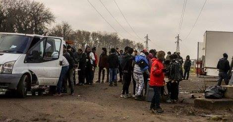
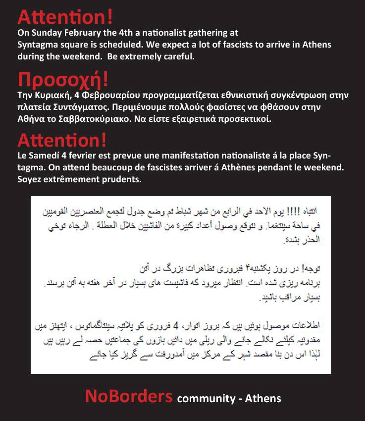

### AYS DAIL DIGEST 2/2/2018: We demand that people in Calais are treated with humanity\!

_Aftermath of latest clashes in Calais // False promises for Syrian in Turkey // Another tragedy at the sea // Two persons died while trying to reach a better life in Europe, one in Greece and one in Croatia // Occupation in Paris…_

](assets/f61a56f633ec/1*rVahlZ6NYe1rZ4ztBINwEw.jpeg)

Winter can be icy in Europe\. Every year, people freeze to death by insufficient protection\. Photo: [Rigardu e\.V\.](https://www.facebook.com/rigardu/?hc_ref=ARReZJHohogfEkHkrVe09hS7VzC4VV4pX39cI8C5LdNoUj0q3tATzCLRCYLWy6vHuMA&fref=nf)
### Feature

On Thursday, February 1st, huge clashes happened in Calais and, according to the available data, at least five people who are forced to stay in the jungle due to EU strict and useless policies, got shot\.

The authorities are blaming criminal gangs, but also the solidarity groups present in the field, who are the only ones trying to offer support in a human way to people who are staying in this area\. As a first measure, the government announced that in the future they would take control of food distribution, currently done by volunteers, in cooperation with groups who will work in association with the authorities\.

Help Refugees issued a [statement after the clashes](https://helprefugees.org/calais-refugees-statement/) reminding everyone of the longtime existence “of the dangerous and violent potential of smuggling criminal gangs in Calais, and the destructive influence they hold over those in the region\.”

According to this statement, a total of 22 people ended up in hospital with injuries, including a 16\-year\-old and an 18\-year\-old, while four people were fighting for their lives\.

> “The destitution, desperation, and fear of the authorities have allowed these tragic events to take place\. They follow three deaths and two nearly fatal accidents in the last two months, showing the sheer hopelessness looming over everyone\. 

> We also strongly denounce the Calais mayor’s accusations that volunteers and NGOs are in any way complicit in the clashes which have left many seriously injured\. This damaging rhetoric taints the humanitarian imperative we follow and only increases the power these criminal gangs have to feed violence and despair\.”

Photo L’Auberge des Migrants

Similarly, [L’Auberge des Migrants group posted](https://www.facebook.com/AubergeMigrants/photos/a.10152514841565339.1073741825.358496450338/10155782702795339/?type=3&theater) that the violence “reveals the extreme tension in Calais, due to the deplorable conditions of survival, police pressure, attacks by smugglers, and hopes that are disappointed after e\-announcements\.”

They are firmly denying that their groups, or any other of the solidarity groups, are trying to attract refugees to Calais\.

“No, we do not want them to go to the guidance centers, no, we do not encourage them to risk their lives under trucks\. And above all, we do not arm them, as claimed,” they stated, adding that they are ready to press charges against the Calais mayor who accused them repeatedly of doing this\.

We join Help Refugees and other groups in their demands that
the displaced population in Calais be treated with humanity\.

Currently, in Calais, there are around 800 people who are hoping to cross to the UK, including women and children\.
### Turkey

[Harekact](http://harekact.bordermonitoring.eu/2018/02/02/on-the-issue-of-turkish-citizenship-for-syrians/) found some more interesting facts from Turkey\. In their latest post, they remind us of the Turkish government’s promise that up to 300\.000 Syrians will get citizenship\.

“In August 2017, already 120\.000 Syrians had applied for citizenship at the Migration Administration of the Ministry of the Interior, of which only 7\.000 applications had been opened back then\. In November 2017, Ahmet Sarıcan, General Director of Population and Citizenship Affairs of the Ministry of the Interior, reported that the number of Syrian citizens who were granted Turkish citizenship in the last 10 years is around 12\.000\.”

This information comes a day after [ICG issued a report](https://www.crisisgroup.org/europe-central-asia/western-europemediterranean/turkey/248-turkeys-syrian-refugees-defusing-metropolitan-tensions) stating that life for Syrians in Turkey is becoming more dangerous every day\.
### Sea

Another tragedy occured on February 1st near the coast of Libya\. Apparently,
90–100 people are reported to have been on board a boat when it capsized off the coast\. According to IOM Libya’s Olivia Headon, 10 bodies are reported to have washed up on Libyan shores\.

[According to the IOM](https://www.iom.int/news/bodies-wash-ashore-following-boat-capsize-libyan-coast) , the UN Migration Agency, 6,624 people had entered Europe by sea through 28 January\.

](assets/f61a56f633ec/1*mo58wZv_LYgGVBnt9JhIiQ.jpeg)

Photo: [Gabriel Tizon](https://www.facebook.com/gabrieltizonfotografo/photos/a.213760148669815.51627.213743695338127/1633798479999301/?type=3&theater)

■■■■■■■■■■■■■■ 
> **[Oscar Camps](https://twitter.com/campsoscar) @ Twitter Says:** 

> > Hoy murieron ahogadas al menos 90 personas más en el Mediterráneo, ya van unas 300 este año, casi 10 al día. Ni la @[EU_Commission](https://twitter.com/EU_Commission), ni @[Frontex](https://twitter.com/Frontex), ni nadie a estas alturas puede alegar desconocimiento, ya es solo maldad.  📸 Laurin Schmid @[SOSMedFrance](https://twitter.com/SOSMedFrance) https://t.co/mR38KmgsX3 

> **Tweeted at [2018-02-02 10:58:29](https://twitter.com/campsoscar/status/959380496768819200).** 

■■■■■■■■■■■■■■ 

Interceptions at sea from Turkish side are still going on:

■■■■■■■■■■■■■■ 
> **[SARwatchMED](https://twitter.com/SARwatchMED) @ Twitter Says:** 

> > #TurkishCoastGuard update: 189 people intercepted in the last 48h in the #AegeanSea (2 boats with 105 ppl headed for the Greek islands of #Samos and #Lesvos) and in the Eastern #Mediterranean (1 boat with engine problems headed for #Cyprus with 84 ppl on board) https://t.co/pZnMQLJlWL 

> **Tweeted at [2018-02-02 19:12:43](https://twitter.com/sarwatchmed/status/959504874827284480).** 

■■■■■■■■■■■■■■ 

### Italy

According to IOM data, in 2017, a total of 3,138 people from Pakistan arrived by sea to Italy from Libya\. Last year, Pakistanis were at the 13th place in the overall list of migrant arrivals \(119,369\) \. This year, though, they are already the third highest nationality on the list so far, with an estimated 240 reaching Italy in January\.
### Spain

A total of 1,465 people were rescued in Andalusian waters during the past month of January while trying to reach the coast aboard 50 boats\. This data represents an increase in people of 78\.44 percent and 47\.05 percent in boats compared to January of last year, 2017, according to the provisional data provided to Europa Press by the Government Delegation in Andalusia\.
The last rescue took place on January 28 when Salvamento Marítimo transferred 30 people to the port of Barbate \(Cádiz\), including a child and a pregnant woman, after being rescued from the boat in which they were traveling\. More details about arrivals in Spain \(in Spanish\) could be found [here](http://www.europapress.es/andalucia/noticia-andalucia-registra-1465-inmigrantes-llegados-patera-solo-enero-78-mas-20180202105937.html) \.
### Greece

More people are arriving on the Greek islands these days\. More specifically, in the last three days, 373 people arrived from Turkey\. Volunteers are reporting that in total, 35 boats have arrived on the Greek islands in January, with a total of 1,543 people\.

 \.](assets/f61a56f633ec/1*4wNNnxiHkdZZ_QvqQIDRWg.jpeg)

By [Aegean Boar Report](https://www.facebook.com/AegeanBoatReport/posts/301815493674895) \.

Even though some people have been moved from the islands to the mainland, camps in Chios, Samos, and Lesvos, but also on other islands, remain overcrowded\. Living conditions are more precarious every day\.

The Vial, Chios, has a capacity of around 900 and is currently hosting 1,380 people\. At the Moria hotspot on Lesvos, 5,000 people are crammed in a camp that has a capacity to shelter no more than 3,000\.

Total official numbers on the Greek islands amount to 12\.609 people\.

In January, a total of 2,629 people were transported to the mainland, while in December this number was 3,685 people\. This means that transfers to the mainland are down 28,7% compared to December\.

Some numbers, from volunteers:
#### Lesvos:

In total 28 boats arrived on Lesvos in January, with a total of 876 people\. In December 25 boats arrived with a total of 1,254 people\. In January 1,510 people were transported to the mainland from Lesvos; in December this number was 1,955 people\. This means that transfers to the mainland are down 23%\.
#### Chios:

In total four boats arrived on Chios in January, with 179 people\. In December six boats arrived with a total of 305 people\. The official numbers on the island are 1,650 people\. In January, 556 people were transported to the mainland from Chios, while in December this number was 953 people, so transfers to the mainland are down 42%\.
#### Samos:

In total 10 boats arrived on Samos in January, with 382 people\. In December 19 boats arrived with a total of 789 people\. Boats arriving are down 47% from December, people arriving are down 52%\. Official numbers on the island are 2,544 people\. In January 382 people were transported to the mainland from Samos, while in December this number was 345 people, so transfers to the mainland are up 10,7%\.
#### Other islands:

Islands such as Kos, Rhodes, Tilos, Leros etc\. In January the other islands had 3 boats, with a total of 117 people\. In December they had 7 boats, with a total of 145 people\. The official numbers on the other islands are 1,628 people\.

In January 181 people were transported to the mainland from other islands, while in December this number was 432 people, so transfers to the mainland are down 58%\.

In January TCG stopped 41 boats at sea, on their way to the Greek islands, with a total of 1,640 people\. In December they stopped 34 boats, with a total of 2,052 people\.

Also, people have been stopped on land before they started their travel towards Greece\. In January, Turkish police stopped 10 boats from starting, with a total of 378 people\. In December they stopped 11 on land, with a total of 445 people\.

A man from Morocco [was found dead](http://www.era-aegean.gr/?p=39274) yesterday morning at the port of Mytilene, Lesvos\. The body of the young man was transferred to the hospital of Mytilene for necropsy, fingerprints were taken and he was found to be an immigrant who had arrived on Lesbos from Turkey on July 11 and submitted a request for asylum, but on the basis of the geographical limitation imposed on refugees and migrants on the islands under the EU\-Turkey agreement, he could not move to the mainland\.

None of the refugees and immigrants arriving on the islands want to stay on Lesvos or in Greece and they try to leave the open prison where they are confined, even at the risk of losing their lives\.

Probably this man attempted to climb the ship as many refugees do, and fell into the sea\.

> **SOLIDARITY IS OUR WEAPON** 
 

> 
 

> **Attention\! On Sunday, February the 4th a nationalist gathering at Syntagma square is scheduled\. We expect a lot of fascists to arrive in Athens during the weekend\. Be extremely careful\.** 

### Croatia

The body of a migrant [was found](http://kaportal.rtl.hr/tijelo-pronadeno-kupi-kod-netretica-pripada-migrantu-utopio-se-pokusavajuci-prijeci-granicu-bit-ce-pokopan-nn-osoba/) in the river Krupa near the town of Ladešići\. It is supposed that he died while trying to cross over the river from Croatia to Slovenia\. The identity of the person has not yet been determined, and there is a possibility that his body will be buried in Croatia with no name on the grave\.
### France

Refugees, including minors, have occupied the University of Paris VIII since 30th January\. Among other requests, they demand the right to stay, long\-term accommodation, and a stop to Dublin deportations\.

[Call for volunteers](https://www.dunkirkrefugeewomenscentre.com) at Dunkirk women’s center\.
### UK

The Sandhurst Treaty, a deal on migration policy and border security signed by France and the United Kingdom, promises to reduce the time it takes to process the cases of unaccompanied minors applying to be reunified with family in the United Kingdom\. However, not all minors in France are eligible\.
InfoMigrants explains the process [step by step](http://www.infomigrants.net/en/post/7274/new-procedure-for-undocumented-minors-in-calais-to-get-to-the-united-kingdom) \.
### General

Despite three devastating attacks in one week and 130 people dead, European countries continue to deport people back to Afghanistan considering this country as safe\.

[Help Refugees demand](https://helprefugees.org/afghanistan-unlawful-deportations/) that, until conditions are stable and sustainable, returns to Afghanistan must be halted and seen for what they are: a violation of international law\.

> “The international principle of non\-refoulement prohibits the return of anyone to a place where he or she fears threat to life or freedom, including persecution, torture or other ill\-treatment\. It is enshrined in international law, conventions, and treaties related to refugees; the United Nations Convention and Protocol Relating to the Status of Refugees states that the principle “is so fundamental that no reservations or derogations may be made to it\.”
 

> What does a safe country look like?
 

> In German Basic Law, it is described as a state “in which, on the basis of their laws, enforcement practices, and general political conditions, it can be safely concluded that neither political persecution nor inhuman or degrading punishment or treatment exists\.”
 

> In a safe country, conditions exist whereby there should be no threat of rights violations, and an understanding that the legal framework in place — or the political situation at large — will likely be one that protects citizens from any such threats arising\.”

> **_We strive to echo correct news from the ground through collaboration and fairness, so let us know if something you read here isn’t right\._** 

> **_If there’s anything you want to share, contact us on Facebook or write to: areyousyrious@gmail\.com\._** 

_Converted [Medium Post](https://medium.com/are-you-syrious/ays-dail-digest-2-2-2018-we-demand-that-people-in-calais-are-treated-with-humanity-f61a56f633ec) by [ZMediumToMarkdown](https://github.com/ZhgChgLi/ZMediumToMarkdown)._
