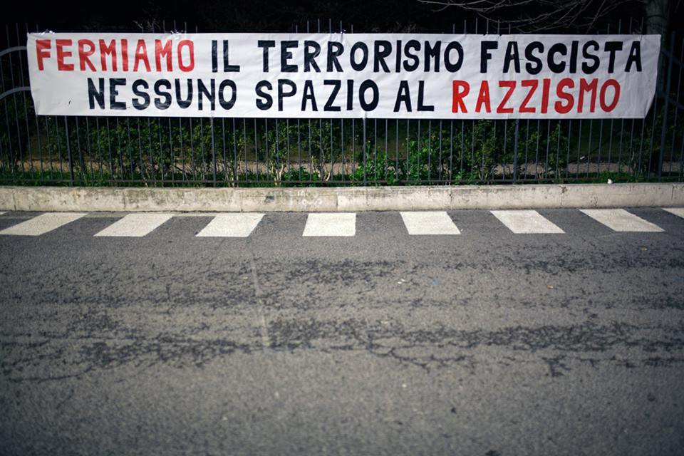
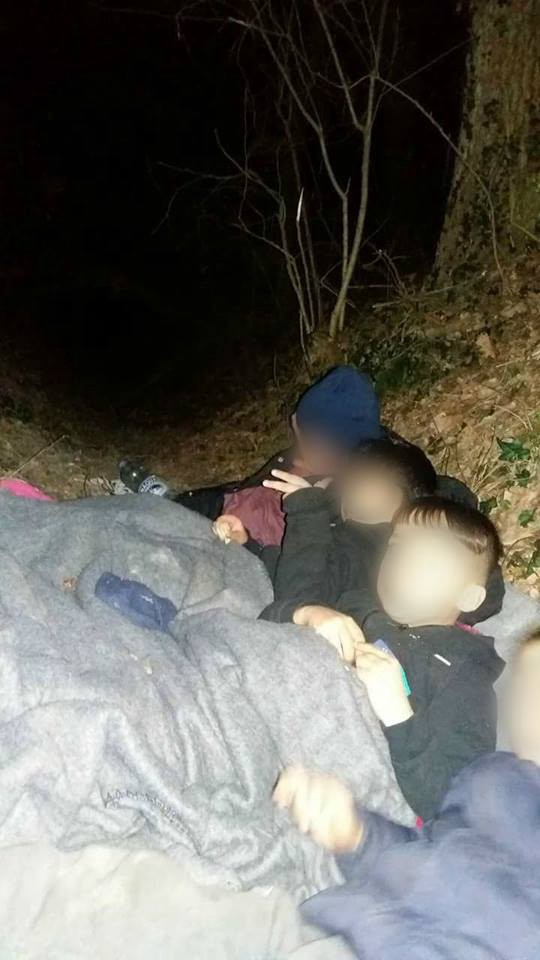
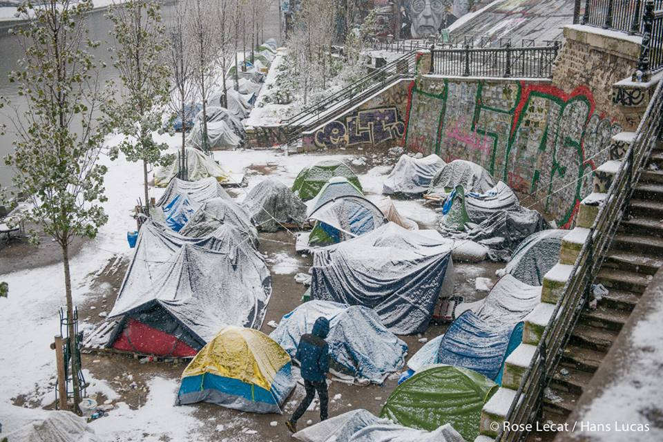
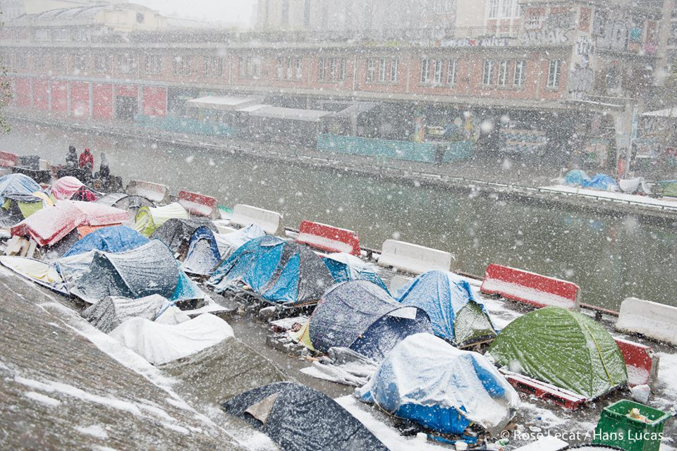

### AYS DAILY DIGEST 05/02/2018: Never again\! — A map of fascist attacks to remind us of the need to resist and take action

_A new map showing fascists attacks in Italy has been published/EASO posted the latests figures regarding asylum applications in Europe in 2017/Updates from Greece on the new Immigration and Citizenship Information System/Volunteers are needed in Serbia/Functional information on the different centres in Serbia/Another push back from Croatia/Winter in France is causing horrible troubles for those who are forced to sleep on the streets in Paris/More news and updates from Denmark, Sweden, Italy…_

Lets stop the fascist terrorism — No space to racism\. Spontaneous demo in Macerata after the attack, on 04/02/2018\. Credit: Csa Sisma\.

**FEATURE**

A map \(available only in Italian\) recently published by LasciateCIEntrare and compiled by [InfoAntifa](http://www.ecn.org//antifa/)) lists clearly the fascist attacks and aggressions that have been taking place in Italy from 2014 to 2018\. The groups responsible for the attacks are also denounced\. So far, there have been 142 aggressions but the map is continuously being updated, following the latest news and warnings — in the description you can also find the relative contacts in case you would like to add verified attacks not mentioned\. The span of the aggressions is large and goes from insults to shootings, fistfights, fascist squads attacks, beatings and firebomb attacks\. The actors involved are always the same: Casa Pound \(a political party born as a movement\), Forza Nuova \(political party\) and many individuals who consider themselves affiliated to neo\-nazi and fascists movements and ideologies\.

This map is important as it shows the need to take action against any form of discrimination and extreme far\-right ideology, especially in the light of the upcoming elections of the 4th March\.

But a major role is also played by the tone of the political debate that allows and excuses these sort of actions against refugees and all of those who are considered “others”\. The single individual feels that it’s legit to carry on these sort of actions and that it is ok to take justice into his own hands, justified and backed by certain political factions, like Lega Nord, which have based their campaigns on hate and discrimination, never openly and firmly condemning these kind of events\.

This is why the Associazione Carta di Roma, Articolo 21, Fnsi, Ordine dei giornalisti and Usigrai are calling all the journalists to respect the [deontological code](https://www.cartadiroma.org/cosa-e-la-carta-di-roma/codice-deontologico/)) created to fight hate speeches and promote a culture of dialogue based on appropriate expressions and respect of cultural differences\.

**EU**

EASO has published the latest [data and statistics](https://www.easo.europa.eu/latest-asylum-trends?utm_source=ECRE+Newsletters&utm_campaign=e4bca97081-EMAIL_CAMPAIGN_2018_02_05&utm_medium=email&utm_term=0_3ec9497afd-e4bca97081-422317173) on asylum application for 2017 in Europe\.

The main figures being:
- 706\.9 _13 asylum applications recorded, \-43% compared to 2016_
- _stable number of applications throughout the year on a regional level, but the number vary much according to different countries_
- _8% of the total number were repeated applications \(which means that the same person had already applied for asylum in another EU country\)_
- _3\.5% were applications by unaccompanied minors_
- _one third of the applications were issued by people from Syria, Iraq, Afghanistan or Nigeria_
- _981\.615 decisions were taken at first instance, mainly for Afghan asylum seekers_
- _of all the positive decisions, 59% granted asylum, 41% subsidiary protection_
- _462\.532 applications were pending at the end of the year, with Afghans representing the majority of these cases_

**MEDITERRANEAN**

Researches to find the 26 missing people, from the shipwreck occurred on Saturday, have been suspended and, up to now, 21 corpses have been found out of the 47 people present on board\. [El faro de Melilla](https://elfarodemelilla.es/2018/02/05/se-suspende-la-busqueda-26-inmigrantes-iban-una-patera-fueron-recuperados-21-cadaveres/) gives an accurate account of the actions taken to find the missing people , underlining the fact that boats departing from Morocco have never been recorded on that route\.

Another operation has been activated to locate and rescue a boat with 10 people, off the shores of Ceuta\.

■■■■■■■■■■■■■■ 
> **[Europa Press](https://twitter.com/EPAndalucia) @ Twitter Says:** 

> > Salvamento busca una patera con diez ocupantes en la zona de Alborán [europapress.es/andalucia/cadi…](http://www.europapress.es/andalucia/cadiz-00351/noticia-salvamento-maritimo-tarifa-busca-patera-diez-ocupantes-zona-alboran-20180205093604.html) 

> **Tweeted at [2018-02-05 08:43:24](https://twitter.com/epandalucia/status/960433666643185666).** 

■■■■■■■■■■■■■■ 

**MALTA**

The new Frontex operation, Themis, is causing [great concerns](https://www.timesofmalta.com/articles/view/20180203/local/new-eu-coast-guard-mission-could-find-malta-unprepared.669618#.Wnfpmi497ZY.twitter) in Malta, as the European Border and Coast Guard Agency will no longer be obliged to move the people rescued to Italy, but the obligation “ _will rest on the country coordinating the rescue mission on a case\-by\-case basis_ ”, which means that they could be disembarked in the safest closest port\.

Local NGOs seem to be uncertain whether the present infrastructures will still be functional to host new arrivals, given the decline in the number of people who have reached the island in the past years\. However, these NGOs need more information before deciding whether to commit themselves\.

The Maltese government has not released statements on the matter so far; but the ambassador of Malta in Rome said that the main concerns regard the fact that the operations would now take place far away from the place most boats find themselves in distress\.

**GREECE**

_Islands_

Aegean Boat Report has published a video that documents the rescue of a boat with 13 people on board \(5 children, 3 women and 5 men\), who were trying to reach Symi\. The rescue operation was carried out by the Turkish Coast Guard\. Weather and sea conditions were absolutely dangerous and the engine of the boat reportedly stopped working, adding despair to the situation\.

_Mainland_

The Ministry of Immigration Policy \(pp\.1361/ 2018\) informs that the [Immigration and Citizenship Information System](http://refugees.gr/el/επείγουσα-ενημέρωση-για-τις-άδειες-δι/) was put into operation on Monday, 05/02/2018, and that the residence permits expired between 18/12/2017 and 17/01/2018, or those whose renewal expires between 18/01/2018 and 28/02/2018, may be renewed until 30/06/2018\.

[Mobile Info Team](https://twitter.com/mobileinfoteam/status/959032546846797824) can help you with your asylum or family reunification procedure, so if you have questions or doubts please contact them via Whatsapp \( \+30 695 538 8283\) from Monday to Friday between 10\.30 and 12\.30\. They can communicate in both English and Arabic\.

Patras port\. Refugees are [magically disappearing](http://www.achaianews.gr/index.php/news/κοινωνία/54457-οι-μετανάστες-παρακολουθούν-το-αναπτυξιακό-από-το-λαδόπουλο) from the port due to, probably, a police order to clear the area; in fact, today and tomorrow a conference hosting Ministers and Government officials is taking place around the area\.

**SERBIA**

Volunteers are still very much needed in Serbia — especially long term\! These is the [latest data](https://docs.google.com/document/d/14hlTlXT2H5Q9oetl7u2pirxBJltZZ97-R0kLILOt9dM/edit) , according to data collected by the volunteer on the ground:

_BELGRADE_

Currently about 200 people are living in Belgrade in various places, moslty informal shelters in and around the city, in parks or abandoned buildings\.

Miksalište is one of the places where people can get food, clothing and hygiene\. Additionally, there is as well organized pediatric medical help, workshop for children, with available toilets, shower points and washing machines, points for charging mobile phones and social life of migrants

Refugee Aid Serbia \(RAS\) has a warehouse for distribution of clothes and hygiene items for camps in Serbia and people who just arrive to Belgrade\. They also have an educational centre\. ‘The Workshop’ where they provide language classes, maths, science, art and recreational activities

Additionally, Info Park does a lot of information dissemination and collection, communication facilitation, protection \(legal, medical, etc\), education\. They also help with registration of those who want to get a legal status and assist with transportation of vulnerable cases to the camps

_SUBOTICA_

Border area with Hungary, there is about 200 people sleep rough in abandoned buildings and tents in and around the city\.

There are couple of volunteer groups working in the area, like [Rigardu](https://www.facebook.com/rigardu/) that provides showers, hygiene products, clothes changing, drinking water and offers a phone charging station\. They also collect [testimonies of police violence](https://www.borderviolence.eu/human-rights-not-negotiable/) at the border\.

Even in Subotica, there is BelgrAID that distributes non food items and drinking water, as well as Escuela con Alma to distribute food and cooking equipment

_SOMBOR_

Also border area, where about 80 people are living rough in abandoned buildings and tents in the fields around the official camp\. Even here, Rigardu team helps in a best possible way\.

_ŠID_

Border area with Croatia, where 80 to 100 people sleep every day in the surrounding woods and fields\. The main group that helps is No Name Kitchen hat provides food, showers, drinking water and clothes\.

_KIKINDA_

There are about 50 people in this area, staying at at least two spots in jungle, in and around the village\. No volunteer group is present in Kikinda\.

In all these places, as well as some other areas in Serbia, MSF is still present\.

Visit the FB group for more info — [here](https://www.facebook.com/groups/1236769899744449/permalink/1593655330722569/) \.

**CROATIA**

Another push back to Serbia, other violence against women and children\!

On Friday, a family of 8 \(including 6 children, of whom the youngest was just 1 year old\) was pushed back to Serbia, even after UNHCR and HPC \(Croatian Legal Center\) were informed about their intention to ask for asylum in Croatia\. One member of the family told AYS that police hit his mother and that they had to walk back for 8 hours\.

What is even worse is that children were forced to spend the night outside, sleeping rough, because UNHCR’s phone line works only from 8:30 AM, so they were “unable” to take care of the case before\.

Credit: AYS

**ITALY**

After the fascist attack reported yesterday in Macerata, local solidarity networks have announced a national demo to take place in the city on Saturday 10th February to state loud and clear that any form of racism and fascism is NOT welcome in the country\.

On the same direction, the [demo](https://www.ilfattoquotidiano.it/2018/02/04/genova-corteo-antifascista-contro-lapertura-delle-sedi-di-estrema-destra-cinquemila-in-strada-la-citta-non-li-vuole/4136052/) held in Genoa on Saturday, when more than 5000 people gathered together to show solidarity to the victims of fascist attacks in the city and to claim their dissent to the concession of public spaces to the extreme right wing movements\.

**FRANCE**

Credit: Rose Lecat

2018\. Paris\. These are the [conditions](https://www.facebook.com/rose.lecat/posts/10156157261471602) in which people on the move are forced to live\. Still no shelters provided and blankets and hot food are needed more than ever\.

From today, an [emergency plan](https://www.paris.fr/actualites/froid-les-mairies-d-arrondissement-ouvrent-aux-sans-abri-5509) to host homeless people and migrants should have been implemented, especially taking into consideration the weather forecast and the actual night temperatures which can go as low as \-7 °C\.

A member of AYS reports:

“ _It has been snowing on and of today in Paris and it’s very cold and according to the forecast the snow will continue until Wednesday with the temperatures lowering even more\. Volunteers are doubling efforts and resources to try to keep people warm enough these days distributing more blankets, tents, sleeping bags, etc\. There are new arrivals every night without nothing, especially after the violence in Calais that pushed many people away to Paris\. There are quite some minors on the street at the moment and they are an extra worry_ ”

[More testimonies](https://www.facebook.com/FacesBeforeNumbers/posts/385715198566475?hc_location=ufi) on the ground stated:

“ _I stayed two hours and felt like crying\. Crying because of the cold, because how heartbreaking seeing people in the freezing cold is, because of how helpless I felt, unable to tell them they would definitely go in tomorrow and that everything would be okay, because the only thing I could stay was ‘stay strong, hopefully you’ll get in tomorrow, I’m sorry you have to be here’\._

_I met a group of Afghans who had been in the line for two days — sleeping in freezing conditions, not knowing how long they would stay like this and with only survival blankets to cover their heads\._

_I met Mohammed, from Somalia, who had just arrived in Paris\. He asked me for a blanket\. I didn’t have any but told him Utopia should be able to give him one at 10pm\. He looked at his phone — it was 7pm\. Three more hours to wait like this — no blanket, no gloves, no hat, no scarf\. I felt terrible\. He told me ‘sister I’m sick already, what can I do? And if I go to take a blanket I will lose my space, I need to get in tomorrow it’s too cold’\._

_Before I could say anything, an Afghan guy who was standing close said ‘I think humanity is dead’\._

_I couldn’t have said anything else myself_ ”\.

Donations are needed in Paris for Le Vestiaire, especially hygiene products for adults \(shampoo, shower gel, soap, toothpaste, toothbrushes, deodorants, razors, shaving cream, body lotions, handkerchiefs\) and for children \(diapers and milk\) \. Shoes size 40 to 45, socks, trousers from 38 to 46, T\-shirts size s, boxers, gloves, hats, scarves, jackets, backpacks and sleeping bags are also much needed\. If you can donate or volunteer, please [get in touch](https://www.facebook.com/groups/177642579245883/permalink/569601713383299/?hc_location=ufi) with them\.

Dunkirk\.

You can find [here](https://www.facebook.com/refugeewomenscentre/posts/387987421626894?hc_location=ufi) the list of donations needed — you can either bring them personally or ship them to the mentioned address\.

“ _Urgent Needs: Sleeping Bags, Conditioner, Nappy Cream, Size 6 Diapers, Adult Diapers for Women, Toilet Paper, Tarpaulin, Baby Wipes, Backpacks and Blankets\._

_Ongoing Needs: Blankets, Adult diapers size M, Diapers size 1 & 2,Deodorant, Women’s new underwear and Bras in good condition, Kid’s underwear \(all ages\), Baby and children’s onesies/ski suits, Pushchairs/strollers, Dummies and Baby’s bottles \(all sizes\), Henna and Nail varnish\!_ ”

**DENMARK**

A Syrian man, who was denied asylum in Denmark, and won the appeal after having stated that he was a minor, had his case recognised in front of the UN Human Rights Committee on 7th November 2017\. He won the case also taking into consideration the information on conditions of reception for minors in Greece \(his first country of entry\) and the inadequate measures taken by Greek authorities to host unaccompanied minors seeking refuge\.

[Here](http://www.asylumlawdatabase.eu/en/content/un-human-rights-committee-oyka-v-denmark-removal-greece-would-violate-articles-7-and-24) you can find more info on the case\.

**SWEDEN**

Last week, DN could confirm that in 2017, a [higher number of asylum applications](https://www.dn.se/nyheter/sverige/domstol-tydlig-forsamring-i-kvalitet-pa-asylutredningar/) are tried in court than before and that a higher number also is changed after they have been up in court\. According to the staff and the authority, it is possible that this is due to shortcomings in the procedure, something the authority’s management denounce\.

Lawyers and staff at the court in Malmö, south Sweden, say that approximately one\-fourth of the cases they are trying will be handled and evaluated by the Migration Agency again\. According to staff working here, the quality has decreased in the last couple of years\.

Reasons for this can vary and are not confirmed, but it could have something to do with the past years’ big influx of people fleeing war and persecution\. Due to this, the agency had to work more efficiently, which could have lead to more mistakes and also that individuals need of protection not always are visible in the evaluation done by the Migration Agency\. It is possible, say representatives from the court in Malmö, that what they should have seen before the decision about rejection, now is first visible when the decision is tried again in court\. The impacts this can have on individuals’ lives are, of course, huge\.

The court is encouraging staff at the Agency to be more transparent and if they know that someone’s procedure went too fast or lacks in quality, they should let the court know\.

> **_We strive to echo correct news from the ground through collaboration and fairness, so let us know if something you read here isn’t right\._** 

> **_If there’s anything you want to share, contact us on Facebook or write to: areyousyrious@gmail\.com\._** 

_Converted [Medium Post](https://medium.com/are-you-syrious/ays-daily-digest-05-02-2018-never-again-fafeed340a67) by [ZMediumToMarkdown](https://github.com/ZhgChgLi/ZMediumToMarkdown)._
