### AYS Special — Lebanon: Dreams bigger than Shatila

_In the Palestinian refugee camp Shatila, everyday life isn’t easy\. Both for those who has been living here for a long time, and for those who came more recently\. About 22 000 people live on a surface not much bigger than a square kilometre\. Since the war in Syria, the number of residents has doubled, the rents increased and the atmosphere changed\. The alleys are narrow and the dangers lurks everywhere\. Despite that, there is a strong unity in what the residents call “little Palestine”\._

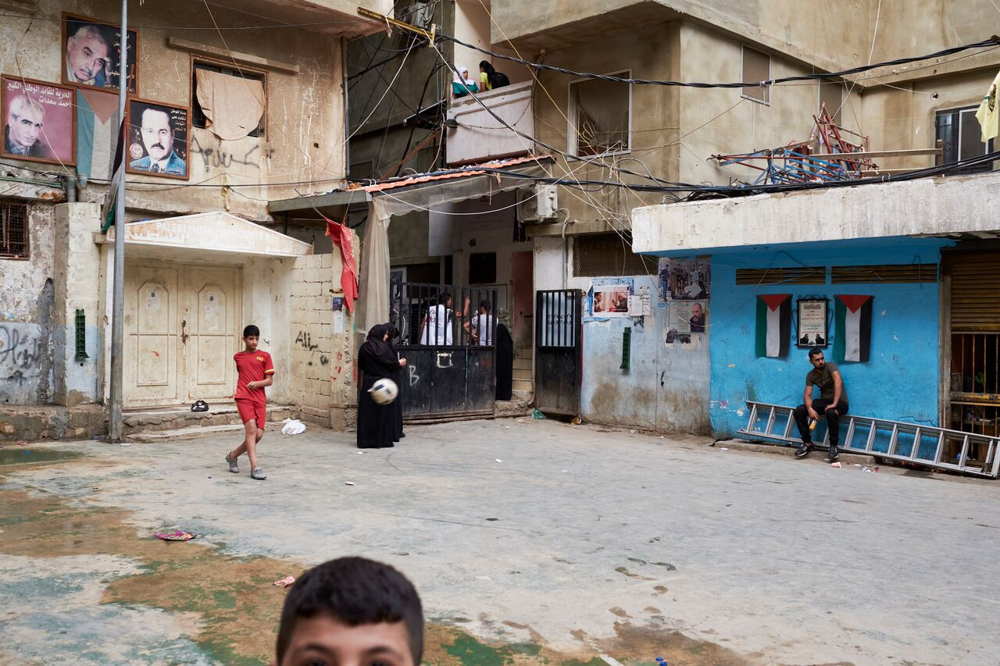

Children and youth’s are hanging out in the camps only youth center\. This is the only playground in Shatila\. Photo: Samuel Bramley

Narrow streets gets a new meaning in the Palestinian refugee camp Shatila, south Beirut\. It’s barely ten minutes from downtown Beirut, where wide and clean empty streets, expensive restaurants and tall buildings in which the most fancy brands has their flagship stores are located\. In Lebanon, and Beirut, the contrasts are hard to grasp\.

But, Shatila isn’t Lebanon\. It’s a small version of Palestine, which Lebanese authorities has little or no control over\. Palestinian political organizations such as Hamas and Fatah runs the camp with iron hand\. Especially Fatah’s green flags are visible in and around Shatila\.

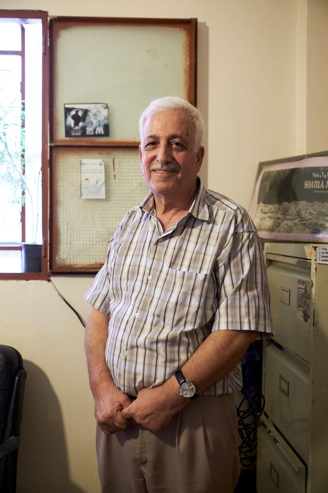

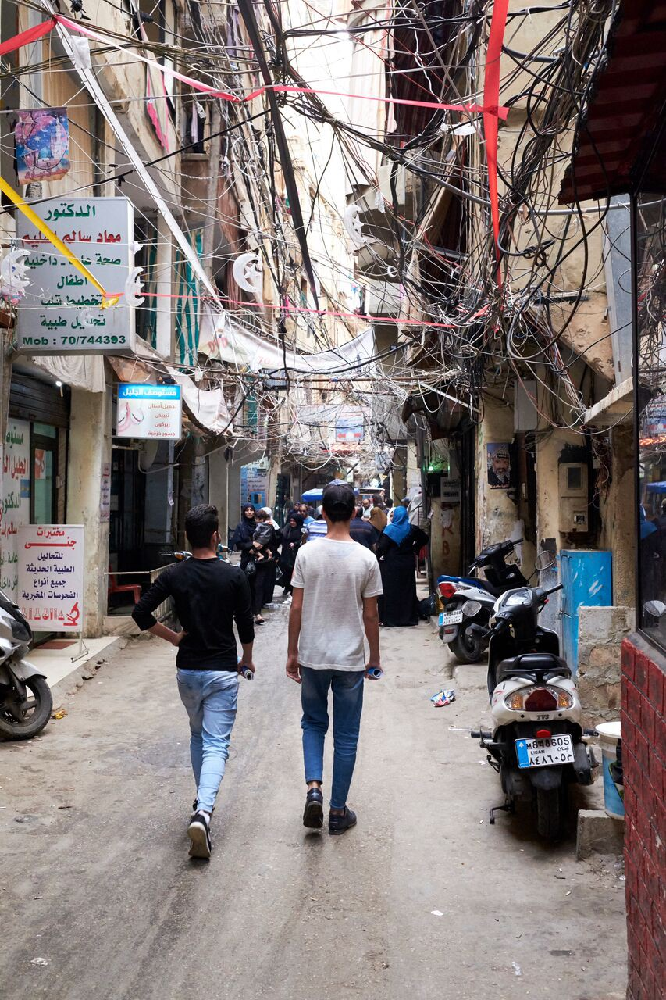

Abu Mouajhed at his office at CYC\. A few metres away, Shatilas busy mainstreet is located\. Photo: Samuel Bramley

It’s not only Palestinians living here anymore\. Since the war in Syria both Syrians and Syrian Palestinians has arrived\. But also Asians, mainly from Sri Lanka, has moved here\.

Abu Mouajhed is running Chatila Youth Center \(CYC\), located in the heart of the tiny camp\. It’s the only place in the camp where children and youths can hang out, get homework support and a break from the everyday life in tiny apartments and in the streets\. According to him, Shatila has changed a lot over the past couple of years\.

“The small streets has become even more narrow, the houses has become higher\. We were talking about 12 000 people, then 16 000 people and now it’s 22 000 people,” says Abu Mouajhed\.

Electricity wires creates what looks like a spider net if looking towards the sky, which it is impossible to catch more than a small glimpse of in most locations\. The incidents related to the poor electricity situation is many\. But just as with so much in Shatila, there is no reliable statistics over the number of accidents\.

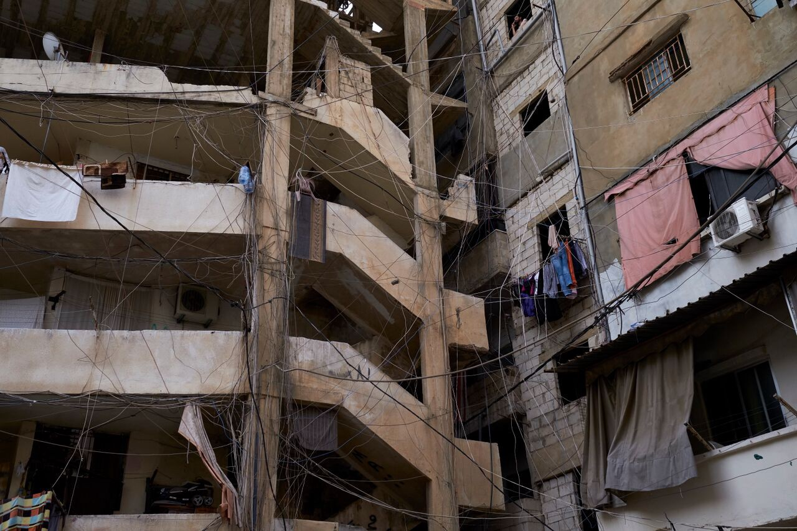

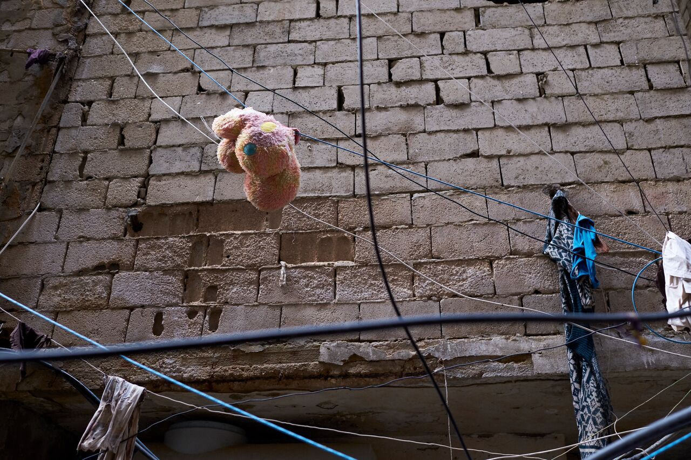

The electricity situation in Shatila is nowhere close safe\. Especially for children, this creates an uncertain environment\. Photo: Samuel Bramley

The same goes for the exact number of refugees in as well Shatila as in Lebanon in total\. Abu Mouajhed claims that the Lebanese authorities want to keep it that way\.

“If we died tomorrow, no one would even raise an eyebrow,” he says in a high voice\.

Meanwhile, people have to survive in any way they can\. The competition for apartments has increased and the rents has become more expensive\. Criminality, sexual exploitation and drugs are some of the social issues that has become more and more usual\. Since the influx of Syrians and Syrian Palestinians it’s not rare that four families share one apartment\.

According to Mouajhed, the biggest apartment in Shatila is 60 square metres, but most aren’t more than 20 square metres\. Nowadays the cost for a room easily can be 200 US dollars\. Before, not even the most expensive flat in the camp had such a high rent\. The Syrian tragedy and the Arabic spring, that turned into winter, did not only change the economic situation here, but also the feeling\.

“Before everyone helped one another\. It’s not like that anymore\. It’s much more competition and suspicion out on the streets now,” he says\.
#### **Children in the risk zone**

According to Abu Mouajhed, there is a huge need to catch Shatila’s young people\. At the same time as the challenges people living here are exposed to, the number of people in need of support is raising\. The number of risks and dangers are high\.

“In Shatila, people have suffered from the bad economic situation and the Lebanese government’s discrimination for decades now\. People came here with tents and just wanted to survive after Al Nakhba \(“the disaster”/Palestinian exodus in 1948\) \. The same for those who came from Syria in recent years,” says Mouajhed\.

In 1969, after nearly 20 years of oppression, PLO \(Palestinian Liberation Organization\) came to Shatila\. Their presence made the everyday life a bit easier\. Before there were neither water faucets nor toilets in the houses\. The residents had to carry all their water from onesource in the middle of the camp\. Even today, the water situation is poor\. Water pipes filled with saltwater, directly from the sea, hang in a big and messy criss\-cross along with the electrical wires only few centimetres over people heads\. According to Mouajhed, it was inhuman before PLO took over\.

“Lebanons government tried to make it look like they did it for our best, by keeping us here\. It was of course nonsense,” says Mouajhed\.
#### **”The sun never shine here”**

Shatila has gone through several periods of change\. During the Lebanese civil war, many organizations left the camp\. The situation became noticeably worse, especially in the eighties following the infamous Shatila\-Sabra massacre\. In 1997 the Swedish Save the Children asked Abu Mouajhed what was most needed in the camp\. He didn’t have to think twice before answering:

“I said that we need a center for youths and children\.”

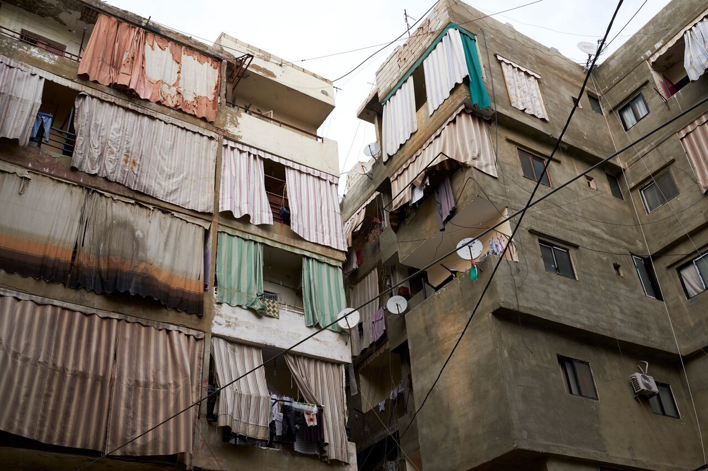

In Shatila, the only playground is surrounded by high buildings\. Even though it is one of the most open spaces here, the sun rarely hits the ground\. Photos: Samuel Bramley

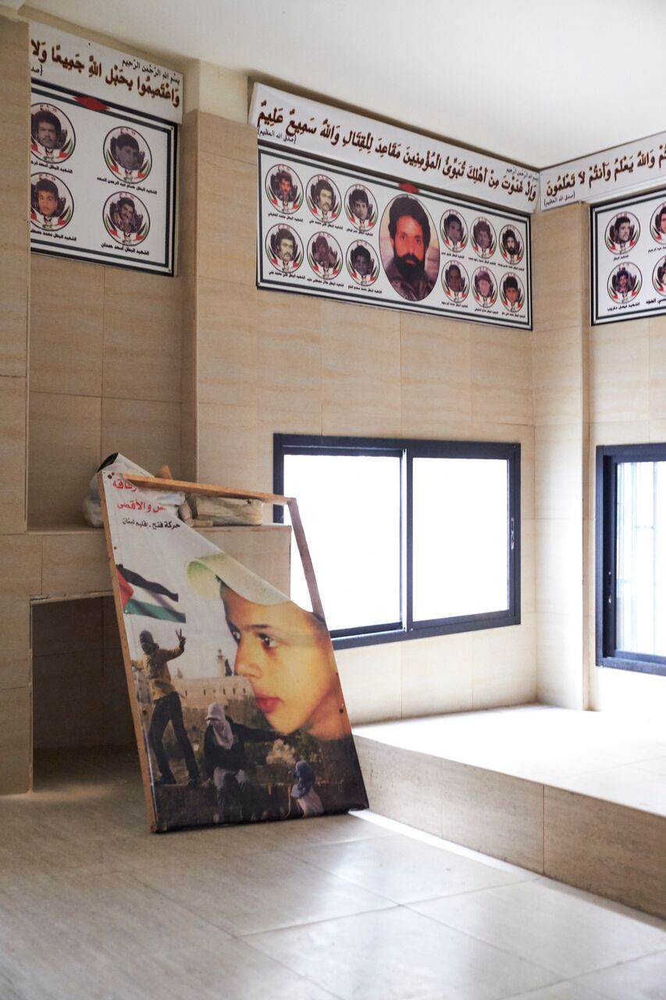

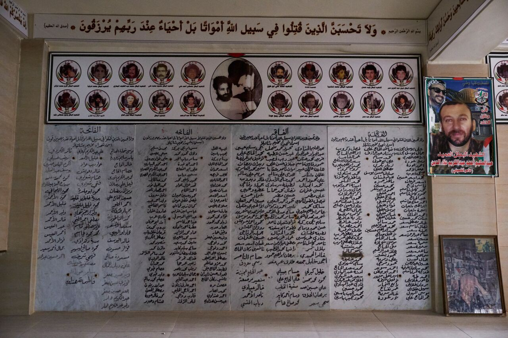

In Shatila’s mosqe, memories from the histrorical and brutal Sabra\-Shatila massacre are clearly visible\. All the victims are honoured and remembered on the walls\. Photo: Samuel Bramley

Since 1997, CYC has been residing in the current premises\. Here is also the only playground in Shatila is located, a narrow asphalt plane where a couple of young teenagers play ball\. Along the sides, the houses are stretching toward to the sky and someone has hanged colorful laundry on a small balcony\. Despite the challenging periods before, Mouajhed believes that the situation in Shatila has never been as difficult as it is right now\.

“It’s unsustainable\. The sun never reaches the ground, there are no air and no light\. People can’t breathe here,” he says\.

Lack of space at home and increasing amount of dejection among the adults and parents puts the children at risk\. Everyday life is difficult and the shortage of everything from electricity, water, space, human rights and future prospects creates an overall downwards spiral\. Children in Shatila have to grow up too fast\. As soon as they start school, many parents let them run free\. Many do not have the energy to take care of their children as they should\.

But, Abu Mouajhed does not only blame the parents, it’s rather the impossible situations fault\. But regardless what the causes are, the negative impacts will be the same\.

“If the children are out on the streets, which they will be if nobody offers them an alternative, they are easy targets for criminality, violence and drugs,” he says\.

Mouajhed has seen several young girls, both Syrians, Palestinian and Syrian Palestinians, be married away young\. He describes it as legal exploitation\.

“We have seen several examples of it\. Often the marriage last only a few months\. We see how the girls were before, and later how they are after marriage,” Mouajhed explains\.
#### **“If we could we would return”**

In a tiny but clean apartment with beige carpets, a narrow bed with patterned bedspread and a small kitchen five people live\. The few square metres, in the end of a a long and narrow alley, are home to Tahani Abowani and her husband, their ten\-year\-old daughter, Sondos Al Omary, and their eleven\-year\-old son, Ali Al Omary\. Also the children’s grandmother live here\. Before the war in Syria they all lived in the Palestinian refugee camp Jarmouk just outside Damascus\.

“If I could, I would go back to Jarmouk instantly\. There, it was more safe\. Here we have nothing\. Nothing is as it should be,” says Tahani Abowani\.

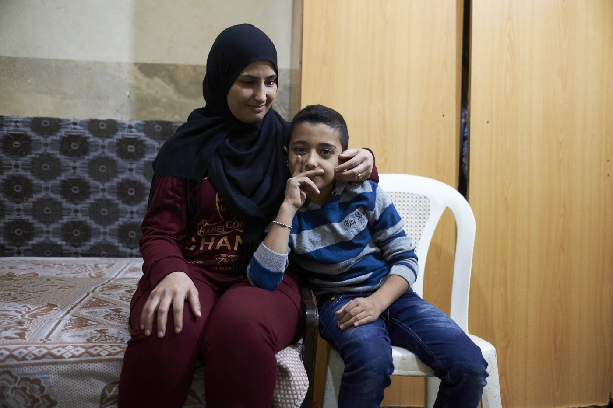

Tahani Abowani is not keen on letting her son Ali Al Omary out of sight\. Photo: Samuel Bramley

Since 2012, Jarmouk has been under ISIS siege\. People have been prevented from as well leaving as returning\. In an article published by Al Jazeera on November 4, 2017, it is described how the dead are buried in Jarmouk and that the only way to get in and out is in a coffin\. Malnutrition and diseases are some of the reasons to the deaths\. Now there is approximately 4500 people living in Jarmouk\.

According to UNRWA, it used to be 150 000 people before the war in Syria\. If Tahani Abowani could, she would return there with her family right away\. But the small apartment with a narrow bed and beige patterned bedspread will probably be her family’s home for a long time ahead\.

“We left Syria and came here to get to a safe place\. But it didn’t turn out to be true\. In Shatila, small things are becoming big since everyone is at ease,” says Tahani Abowani\.

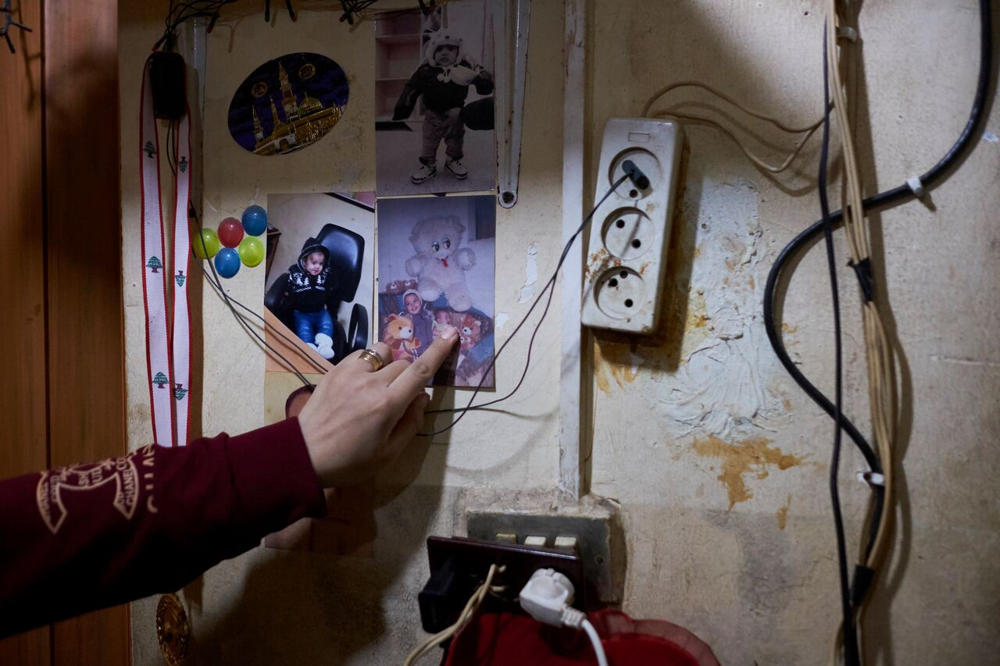

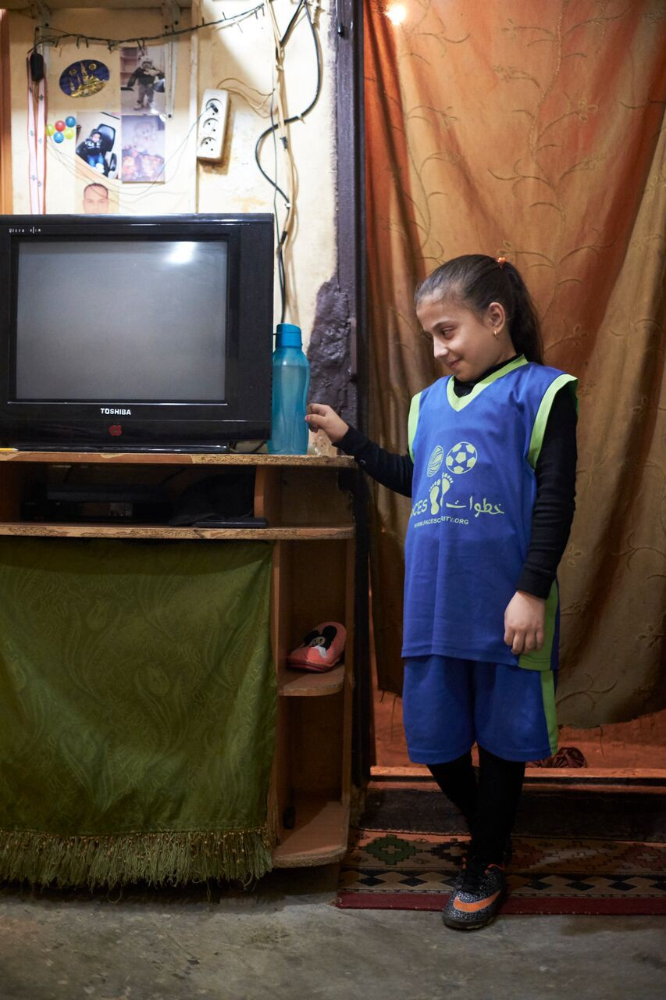

Tahani Abowani shows an old photo from Jarmouk from when her kids Sondos Al Omary \(right\) and Ali Al Omary were younger\. Photo: Samuel Bramley

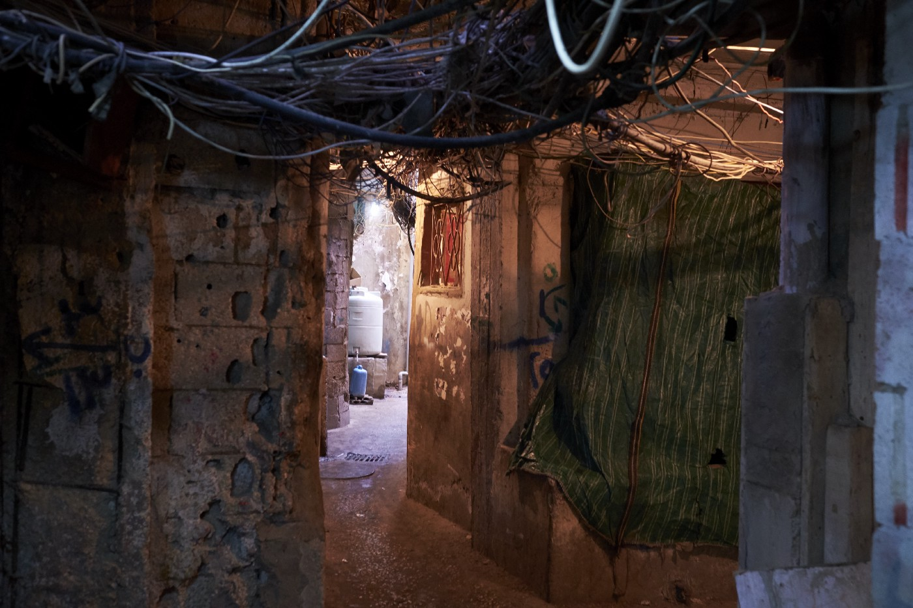

Not far away from her is Tahani Abowani living\. She prefers to stay at home, in the narrow alleys she doesn’t feel safe\. Photo: Samuel Bramley

They have lived here for five years now\. She is sitting on the bedside and ties her hands at the same time as she speaks a fast\-flowing but quiet Arabic\. The security is non\-existent and violence is never far away\. The electrical cables in eye level or even lower is just one of several reasons to why she doesn’t let her kids out of sight\. The family left Jarmouk after a number of bombings five years ago\.

Both Ali and his sister Sondos lost their ability to talk/speech for three hours after a bomb had exploded near their house\. After that it was enough — they could not stay\.

Just as his mother, Ali Al Omary miss Jarmouk\. He has also experienced the tensions in Shatila and how the mood in the narrow alleys can change quickly\. Once when he was happy and jumped around in the street, he accidentally bumped into a man\. In one second, the man went from acting completely normal to being angry and threatening\. And all Ali had done was to show some happiness\.

“There is a lot of people around here that aren’t nice,” he says\.
#### **At least the third generation refugee**

In opposite to Tahani Abowani, Ayda Yassien, her family and their neighbour Liyla Frajee has lived all their lives in Shatila\. No one of them are old enough to have had the chance live in Palestine before the state of Israel was proclaimed in 1948\. Behind a timeworn black door, a staircase not much broader than a ladder leads up to an open space overlooking the narrow street\.

The sound of 22 000 voices is mixed with the sounds from scooters and call for prayers from the mosque with memories from the Sabra\-Shatila massacre on its walls when Ayda Yassien pour strong Arabic coffee in small cups with floral patterns on\. Both she and Liyla Frajee have experienced the changes Abu Mouajhed described in his office\.

“It’s different now\. I can not open my window when I leave home because it smell so badly on the streets\. 25 years ago everything was better here,” says Ayda Yassien\.

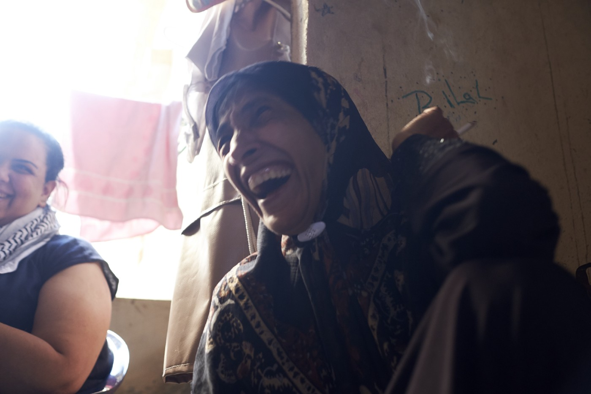

Liyla Frajee has never been to Palestine, but regardless of that she laughs high and sings a song about her country of origin\. Photo: Samuel Bramley

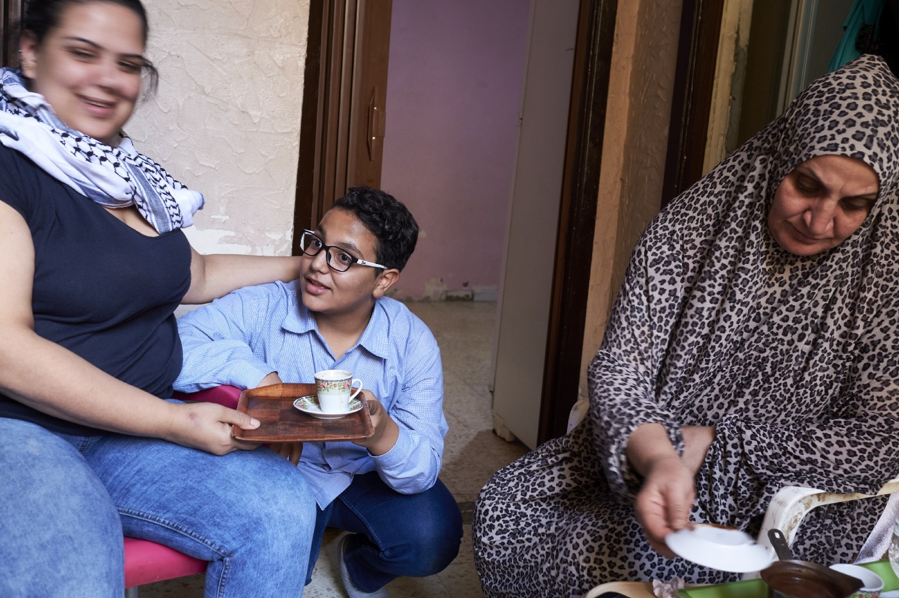

Omar Ayuoti \(middle\) and his mother Ayda Yassien \(right\) is having coffee with their neighbours\. Photo: Samuel Bramley

According to Liyla Frajee the abuse of drugs is another thing that has increased in recent years, since the war in Syria started\. Desperate situations create desperate people and the problems are stacked high nowadays\. With the increased drug abuse, other issues like violence, suspicion and criminality has also become more common\.

“It’s mostly marijuana, but also a lot of tablets and other drugs\. The atmosphere is not as it used to be,” Liyla Frajee explains\.
#### **Normalizes the abnormal**

Reuters reported in January last year about twelve and thirteen\-year\-olds in Shatila who could roll a joint\. But according to Omar Ayuoti, Ayda Yassien’s youngest son, it’s possible to avoid Shatila’s many dangers\. He is aware of the drug abuse, violence and social issues, but it is nothing he wanna have anything to do with\. His description of Shatila is not really as dark as his mom’s\. There is a strong sense of unity here, even if it is created by many years of exclusion\.

“I always have something to do and know everyone here,” he says\.

Maram Salal is fifteen years old and has lived in Shatila all her life\. With a light mint green veil covering her hair and a friendly smile, she gives a kind impression when she opens the door to her family’s apartment\. But, growing up in Shatila has made her much tougher than she looks\. The answers are contradictory but at the same time reasonable\.

“I know that it isn’t safe here, but I’m not afraid\. You can avoid what’s dangerous if you want to\. It’s just not to question and stay away from trouble,” she says\.

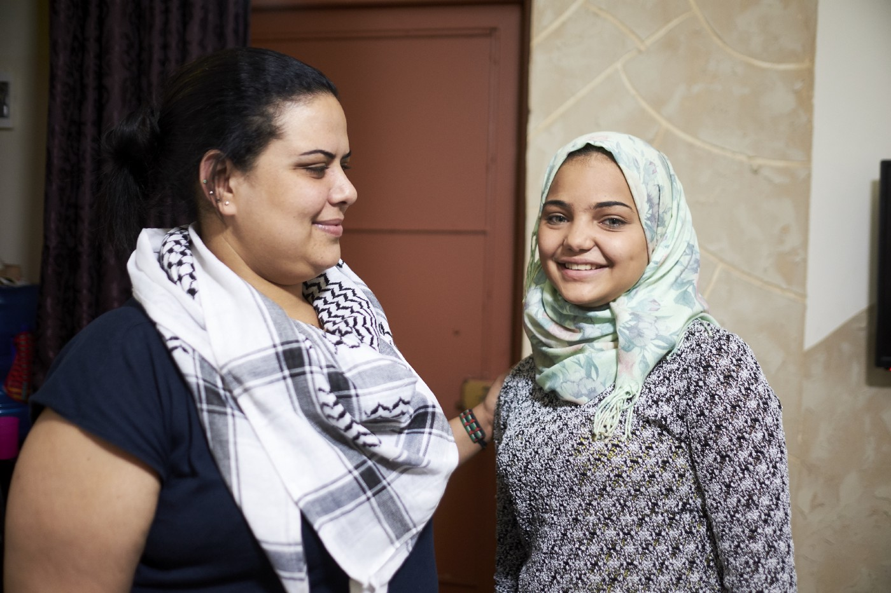

Maram Salal is 15 years old and knows nothing else than living in Shatila\. But, in the future she would like to travel and learn more about life outside of Shatila\. Photo: Samuel Bramley

For Tahani Abowani on the other hand, Shatila is a chock\. She avoids leaving her little home if she can\. She came to the camp with the wave of people who made it grow even more\. Above all, she is worried that something will happen to the children\. That someone will take them or that they will be hurt\.

“There is no security\. Criminal groups and political organizations are everywhere,” she says\.
#### **Dreams bigger than Shatila**

If Tahani Abowani and Ayda Yassien had a chance to choose, their children would have been growing up elsewhere\. The general situation often seem hopeless and they both express a fear that their children will end up in trouble, without a decent future in sight\. The lack of opportunites can lead to bad decisions\. But there are ways to get out of Shatila’s narrow alleyways\.

One can be to get a scholarship for a good university that otherwise costs more than most people, residents of Shatila as well as others, can afford\. For Palestinians, the fees for the Lebanese Universities are higher than for Lebanese citizens\. Besides that, the Lebanese Constitution does not allow Palestinians to have qualified jobs\. They may be teachers, but not physicians or lawyers\. So despite level of education the possibilities for Palestinans who stay in Lebanon are limited\.

“I want to become a doctor\. But if I can’t work as one, I’ll open a shop here in Shatila,” he says\.

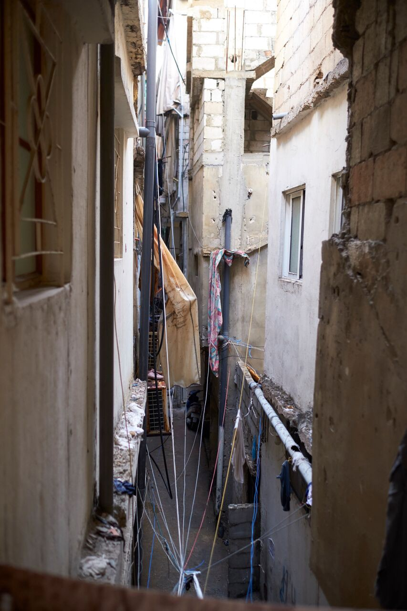

The view downwards the street from Ayda Yassien’s and Omars apartment\. Photo: Samuel Bramley

He is the youngest child in the family, all his older siblings have already left Lebanon\. They have gotten jobs and work permits abroad\. Ayda Yassien hopes that Omar also will be able to do the same\. Running a shop in Shatila is not the future she wishes her youngest son\. Maram Salal wants to continue her studies at the university, although she prefers to not think too much about the future\.

However, she does not want to stay in Shatila\. She shakes her head slowly and looks down on the patterned carpet on the floor\.

“I want to go continue studying, maybe history\. But above all, I want to travel,” she says\.
#### **Education is the way forward**

Abu Mojahed believes that youths in Shatila struggle in head\-wind\. It is hard to keep focus on studies where 22,000 people live on a square kilometer\. And even if Shatila’s residents manage to graduate high school and then finish university, they won’t be able to choose any career they want\. Despite that, education seems to be what most people here values most\. Maram Salal is studying every evening after she is done taking care of her younger siblings\.

“I’m picking them up from school here in the camp since mom works in the afternoons\. When she get back, I’ll go to CYC and studies,” says Maram Salal\.

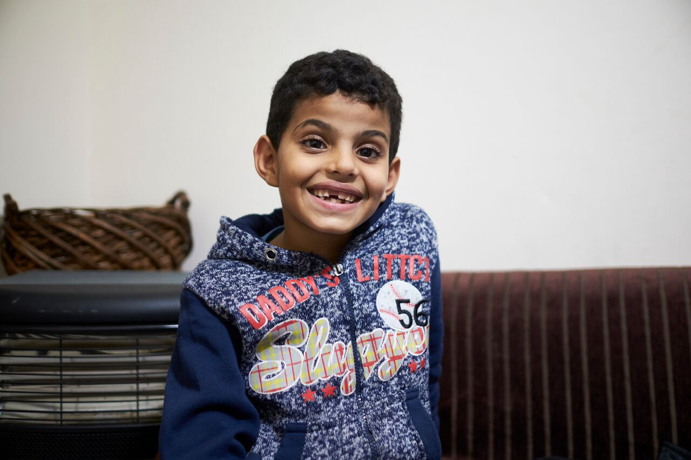

Maram Salal pick up her 11\-year old brother Ibrahim Salal from school every day\. When he grows up, he would like to become a policer officer\. Photo: Samuel Bramley

Tahani Abowani is no older than thirty and only finished sixth grade herself\. She wants her children to have other possibilities than she has had so far\.

“I want my children to have opportunities\. And that they should be able do what they want\. As long as they are satisfied, I’m happy,” she says\.

When Tahani Abowani and her family left Jarmouk, they did it without any documents that could prove their identity\. Her children goes to UNRWA’s school but without valid documents to reinforce their identity, no results will be reported officially\. She has no idea about how to get new papers\. She will go back to her kids school and talk to UNRWA, but is stressed and worried\.

“I don’t know what to do\. Education is the most important thing,” says Tahani Abowani\.
#### **Will never forget**

According to Abu Mouajheds, it can’t continue as it currently is in Shatila\. Political organizations run the camp with iron hand, children end up in the streets when there isn’t enough space at home, violence is a natural part of the daily life and yet another generation is growing up without actually having a future\.

Time after time, Mouajhed points out that what now is thousands of people’s everyday life, has been created by circumstances outside of the camp\. The war in Syria made the already vulnerable even more vulnerable, while it in some places barely are noticeable\.

“The war that causes this suffering must end\. Europe is knocking on the door with flowers in one hand and a knife in the other, “he says loudly\.

As he sees it, there is only one real solution\. And according to him, it is not in Germany, the United States, Sweden or another country\. There, the people will bring with them their anger and sorrow, he says\. In order to find some peace, the Palestinian people must get their country back, or at least their rights\. Fifteen\-year\-old Maram Salal has never been to Palestine, but she is Palestinian\.

“It is inherited from generation to generation\. It’s in the blood\. Our parents will always remind us,” she says\.
#### **Facts about Shatila, Lebanon and Palestine:**
- According to UNRWA, UN’s body for Palestinians, there is 12 official Palestinian camps in Lebanon
- In total, there is 58 official camps for Palestinians in Lebanon, Jordan and Syria \(many Palestinians once living in Syria, are now second time\-refugees\)
- Shatila was implemented in 1948, as a cause of the Palestinian exodus Al Nakhba \(“the disaster”\), when the state of Israel was proclaimed
- Shatila is the biggest camp in Lebanon, where currently up to 22 000 people lives
- In Shatila, Palestinian political organisations such as Fatah and Hamas are in charge\. Lebanese authorities has nothing to do with the Palestinian camps, and normal laws and rules doesn’t really apply here
- Lebanon denies Palestinians equal rights, and they have to pay higher fees for university and healthcare
- Palestinians lacks passports, they what is called ‘stateless’\. They have white cards and travel documents as identity documents, but has a hard time to get visa’s
- A Palestinian in Lebanon can become a teacher, but are prohibited to have more qualified jobs such as lawyers or doctors\. Many are working illegally, for low salaries

First published by Nyhetsmagasinet Syre in Swedish, [here](https://tidningensyre.se/2018/nummer-235/meningen-med-livet-ar-inte-vinstintresse-och-profit/) \.

Author: Hanna Strid

Photo: Samuel Bramley

> **We strive to echo correct news from the ground through collaborationand fairness\.** 

> **Every effort has been made to credit organizations and individuals with regard to the supply of information, video, and photo material \(in cases where the source wanted to be credited\) \. Please notify us regarding corrections\.** 

> **If there’s anything you want to share or comment, contact us through Facebook or write to: areyousyrious@gmail\.com** 

_Converted [Medium Post](https://medium.com/are-you-syrious/ays-special-lebanon-dreams-bigger-than-shatila-281df6272cbe) by [ZMediumToMarkdown](https://github.com/ZhgChgLi/ZMediumToMarkdown)._
