### AYS DAILY DIGEST 9/2/2018: Letter from Paris

_Abdul Saboor \(25\) from Afghanistan lives in Paris with many people on the move who came to Europe dreaming about safe life\. His photo exhibition, showing photos taken in the barracks in Belgrade where he spent last winter, is on display at the_ L’Atelier des artistes en exil _in Paris\. The exhibition is organized with the support of the French Ministry of Culture\. It open at the end of January and will be on display for two months\. Ironically, if you want to speak with the artist, join the volunteers in the street of Paris, bring him a blanket, sleeping bag, hot tea… Or better, host him or anybody, in your home\. This is his letter from Paris\._

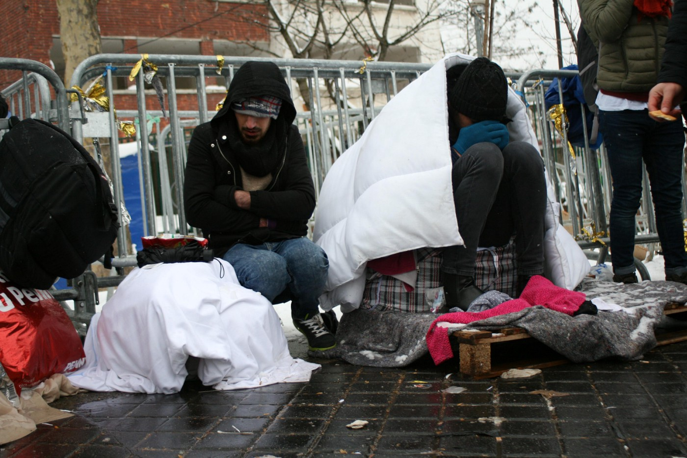

Photo: Abdul Saboor

> “There are over 100 refugees living near the canal in Jaures, where it is snowing and \-6° C\. Most of them have tents and blankets but this is not enough because snow is coming into the tents\. Those who arrive after midnight do not have supplies and must contact the volunteers to get supplies, but it may take up to three days for them to receive blankets, tents and sleeping bags\. 

> The new arrivals depend upon other refugees to give them a place to sleep inside a tent\. The refugees are waiting to give their fingerprints at the asylum office that is close to Jaures\. Some of the refugees have fingerprints in Bulgaria and they are afraid to give their prints to the asylum office in Jaures\. Some of them have tried to enter the Porte de la Chapelle camp, but it’s not easy to get in this camp\. 

> One man arrived in Porte de la Chapelle camp last night and waited outside the entrance of the camp for over 12 hours to be admitted, but the security guard would not let him in\. He had previously undergone surgery and has metal in his left leg and he is not able to walk\. He fell in front of the camp and sat on the icy ground overnight\. The ambulance arrived this afternoon \(9 February\) and took him to the hospital\. 
 

>  
 

> The refugees are arriving in Paris with lots of hope, but upon experiencing the freezing cold conditions and lack of adequate supplies, their hopes are being destroyed\.” 

Last night, hundreds of people were moved to shelters, as well as the day before\. But many are still on the streets\.

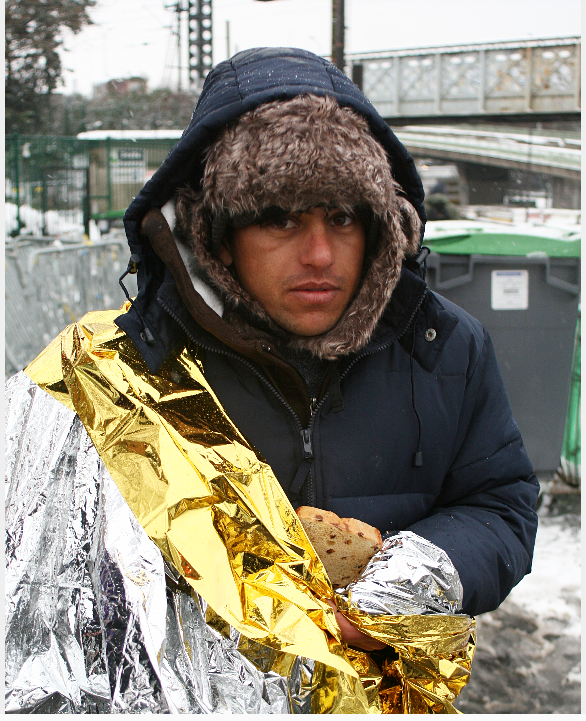

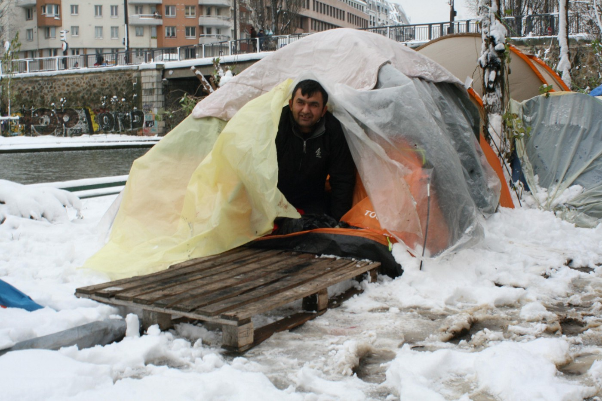

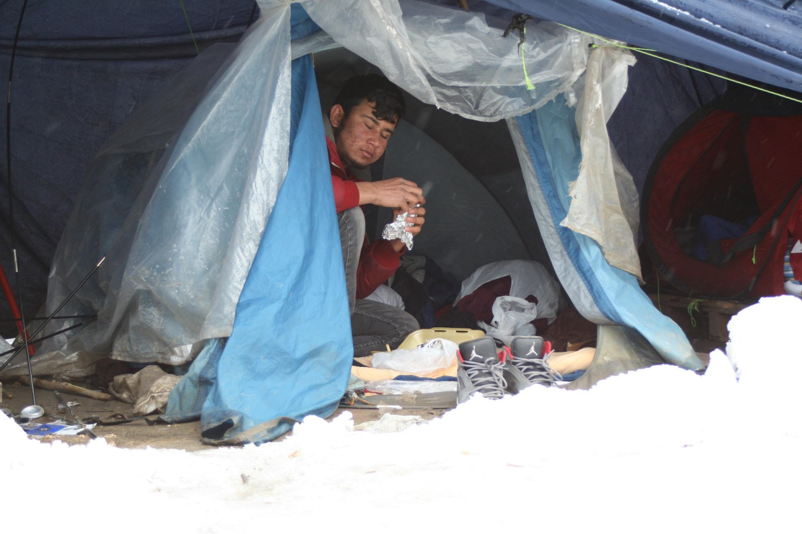

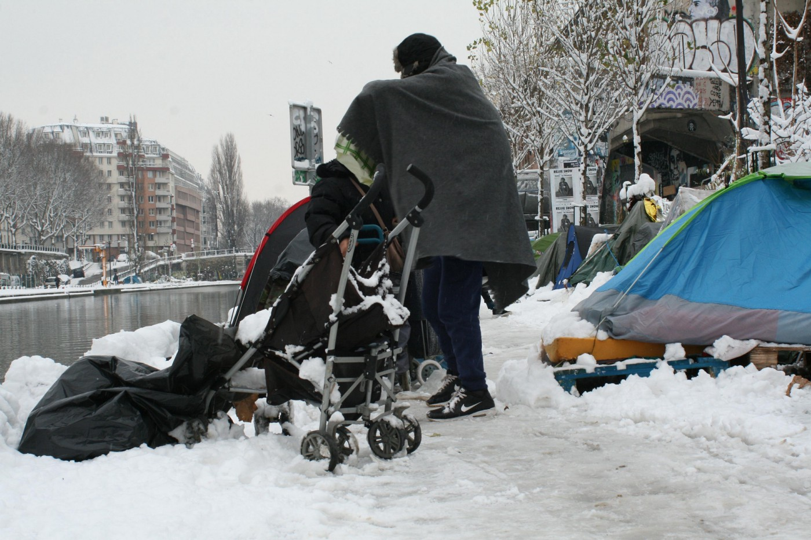

Photo: Abdul Saboor

If you are in Paris, join the volunteers on the streets\. Even better, like people in some other European cities, open your home and give shelter to somebody in need\. If you are not in position to do any of this, maybe you can [donate](https://mydonate.bt.com/events/parisaction/406673) \.

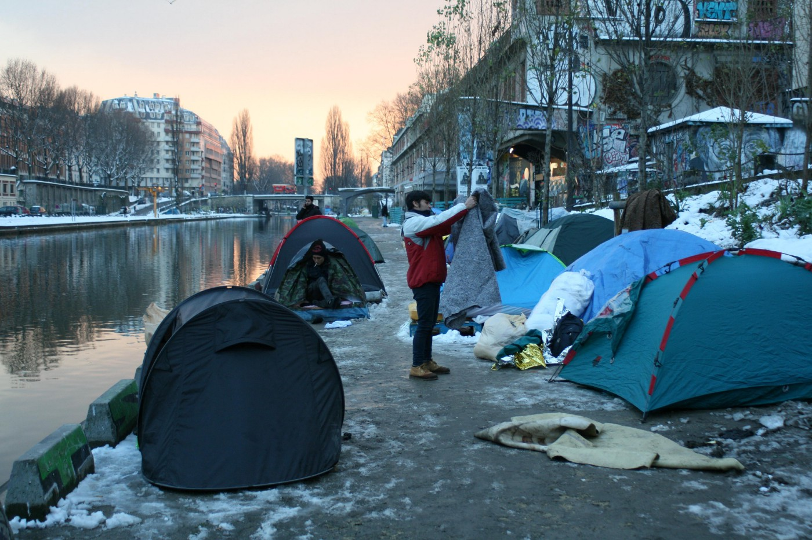

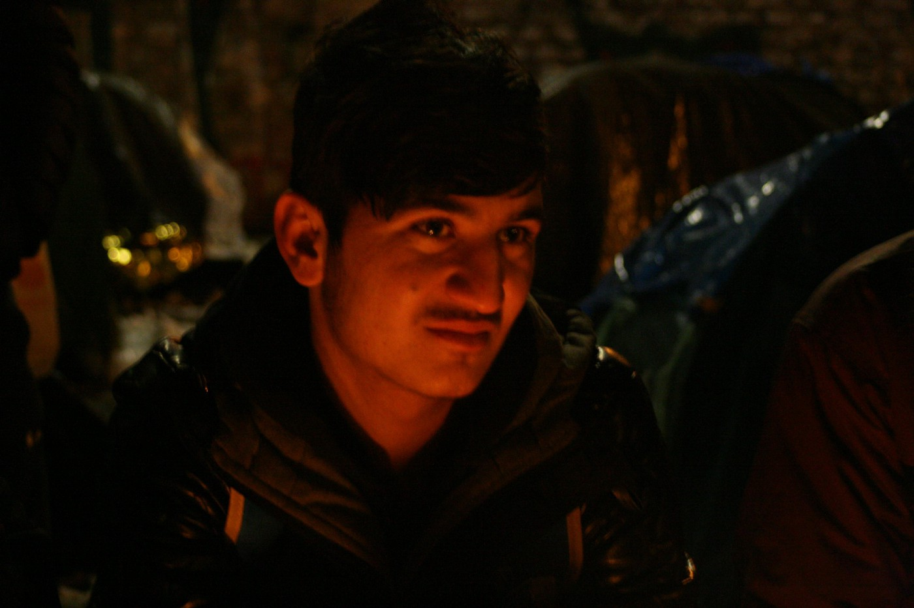

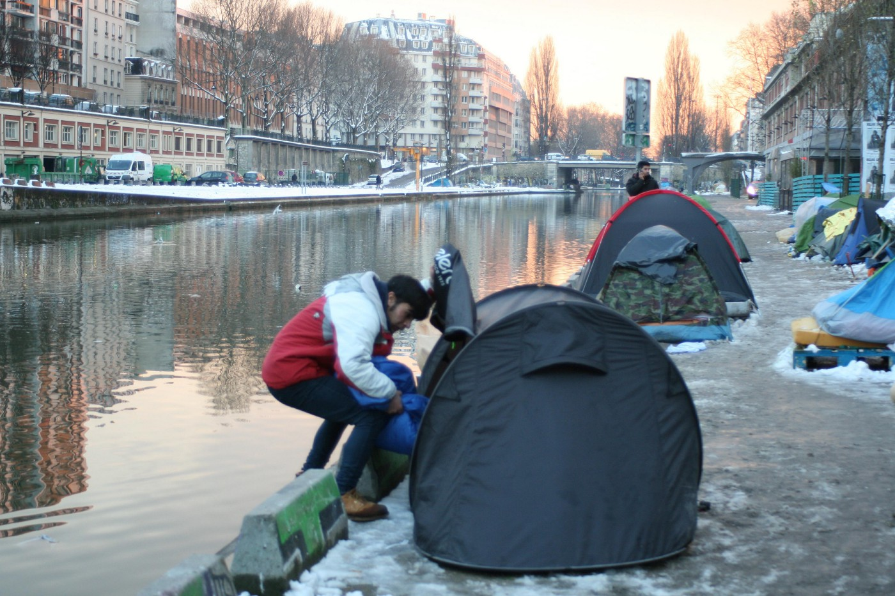

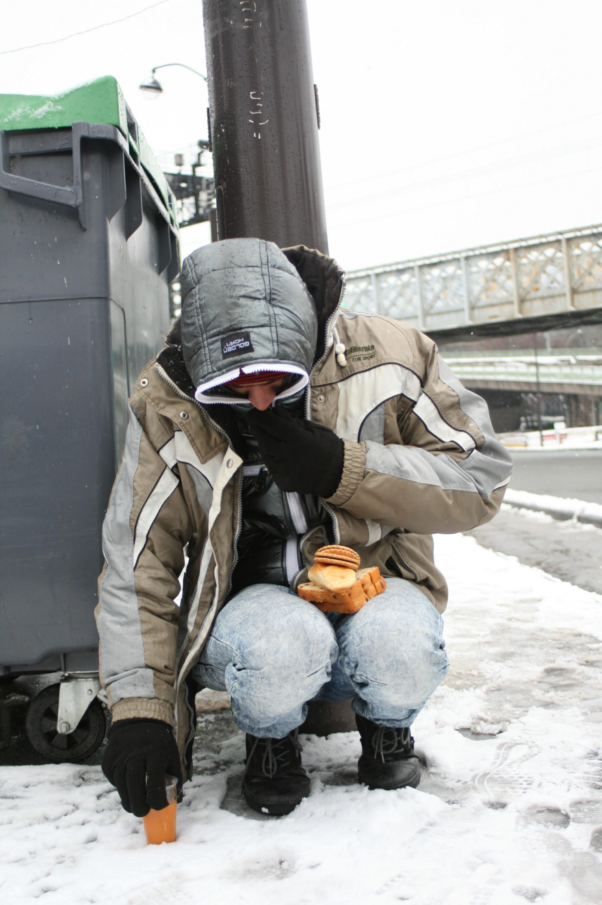

Photos: Abdul Saboor
### Greece

“UNHCR, the UN Refugee Agency, is very concerned by reports from asylum seekers of sexual harassment and violence in sub\-standard reception centres on the Greek islands, despite the welcome measures undertaken by the government to address overcrowding and the dire living conditions,” said UNHCR spokesperson Cécile Pouilly from Geneva\.

The UNHCR and UN refugee agencies, as well as the EU, should have thought about this earlier and done everything to place people in safe accommodation\. Camps are not safe places to live\. Respect is what is often lacking in the UNHCR approach to people in need\.

In 2017 UNHCR registered reports from 622 survivors of sexual and gender\-based violence \(SGBV\) on the Greek Aegean islands, of which at least 28 percent experienced SGBV after arriving in Greece\. This is mostly happening in hot\-spots, but also all through camps where people are stranded and forced to stay\. UNHCR is present in all of these places and doing little\. Collecting reports is not enough\.

While the UN is collecting reports and talking about problems from Geneva, volunteers on the ground are trying to deal with the problems\. Thanks to private donors, some people in Moria will get beds and will not have to sleep on the ground anymore\.

The beds and mattresses were donated by the city of Hamburg, the transport was organized by Hamburger Hilfskonvoi and ResCO international, bedding and blankets donated by Hanseatic Help e\. V\. are on their way to Lesvos\.

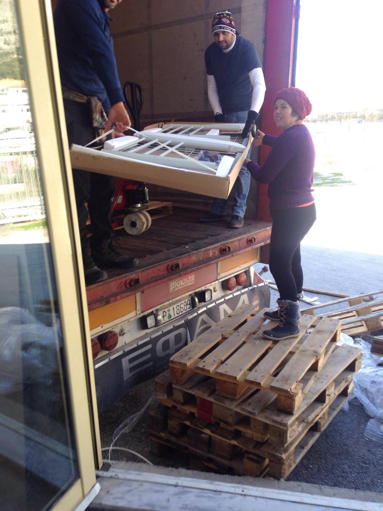

](assets/55aeccc1f21a/1*ZNnzlQ0B1_TlQs_kiwcOgg.jpeg)

Photo by [**Tim Eisenlohr**](https://www.facebook.com/xxtim)

Refugee Law Clinics Abroad on Chios argue that the basic rights which have to be granted under the Geneva Convention for Refugees are still not accessible in the Hotspot on Chios\.

Read more [here](https://www.facebook.com/rlcabroad/posts/1586433671472418) \.
### Italy

Another fascist attack was registered in Italy\. This time it happened at the centre hosting migrants in the province of Latina\. A person, so far unknown, lobbed a Molotov cocktail around midnight at the entrance door of a structure in the Lepino Municipality of Sermoneta, in the locality of Monticchio, where 54 people are housed\.

Meanwhile, Luca Traini \(28\), who was accused of shooting six people from Africa in a racist attack, has received a wave of support from “ordinary people,” [according to his lawyer’s statement](https://www.theglobepost.com/2018/02/07/italy-fascist-shooter/) \.

Traini shot five men and one woman from Ghana, Mali and Nigeria in the central city of Macerata last Saturday\.

Luckily, there is another side to Italy and those people will be part of anti\-racist demonstrations that are being organized all over the country, including in Macerata\.

“The city has become the symbol of a country that tomorrow will be united under the flag of anti\-fascism to say ‘no’ to any form of fascism and racism, the symbol of a country that is dealing with its past and present to build a better future\.”

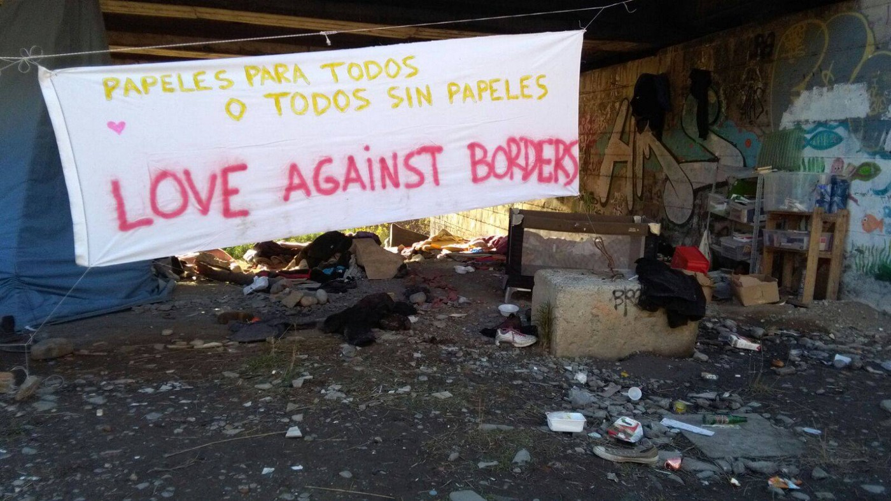

Ventimiglia\. Photo: Proggeto20k
### Serbia

No good news from Serbia today\. As we were informed by Info Park, there is a case of measles at the Krnjača camp\. The information was confirmed by UNHCR and MSF\. One person was diagnosed with measles, a 17\-year\-old boy from Afghanistan, who was put into isolation\.

In the meantime, Serbia and European Commission signed a new financial deal according to which the country will get more money to help the people stranded here\.

With the new funding, worth €16 million, the government is supposed to finance the operating costs of the reception centres and the cost of accommodating unaccompanied minors at social welfare institutions\.

There are fewer than 4,000 people in Serbia right now\. Most of them are staying in camps where the living conditions are humiliating\. People live in crowded rooms, sometimes more than eight to a small space, not all the children are going to school, and there are few or no programs for people who are forced to stay inside the camps\. The food is scarce and lacking in vitamins, while the medical help is only basic\. The only thing the EU cares about, however, is keeping people out of the member countries\.
### France

Three lawyers have sent [a letter to the public](https://www.dalloz-actualite.fr/.../des-avocats-signalent...) prosecutor in Paris alerting him to the situation of unaccompanied minors in the streets of Paris who cannot gain access to the classic shelters which are reserved for adults\. The letter includes a list of 128 minors who are in immediate danger\.

Police violence continues in Calas\. This is testimony from one of the people who is living in Calais area\.

Volunteers from [Faces Before Numbers](https://www.facebook.com/FacesBeforeNumbers/?hc_ref=ARQXOQ-vcGB4atUhHn-4A0TtD4718UJ4Hj64X22mWVp7Dwv8wuNf0nhT4viw0uERWK8&fref=nf) , who recorded this testimony, wrote an open letter to the French president reminding him of words said on 16 January 2018 during his visit to Calais\.

> “M\. President, your statements are wrong and dangerous\. 

> They are wrong because police abuse is not a one\-off incident in Calais\. It is happening daily, repeatedly and deliberately\. 
 

> It is the direct result of a more and more hostile migration policy and greater pressure on the police exercised by your government\. 

> They are dangerous because, Mr President, I can’t believe that you and your government are not aware of the current situation in Calais\. I can’t believe it because, firstly, this situation is the direct result of your orders or of what you tolerate\. I can’t believe it either as all you need is to listen to what organisations, individuals, and refugees have to say about Calais\. 

> Your statements are dangerous because not to recognise, denounce and condemn these acts of violence means accepting them, tolerating them and encouraging them\.
 

> These police abuses are suffered by people who live in inhumane conditions\.
 

> These people have a name\.
 

> They have rights\.
 

> They have voices\.
 

> These people wanted to have their voices heard and describe what they go through daily\.” 

On 7 February, the Court of Cassation reiterated the illegality of the detention of asylum seekers placed in “Dublin” proceedings\.

Among other things, by this decision, “the administrative authority cannot under any circumstances place an asylum seeker who is in Dublin proceedings in detention, since the notion of escape has not been defined by the legislator and this cannot result from ‘established jurisprudence, sanctioning a constant practice of the policing of foreigners’”\.

For more see [here](http://www.editions-legislatives.fr/content/«-dublin-»-toujours-pas-de-rétention-pour-les-demandeurs-dasile) \.
### Belgium

[Police have arrested](https://www.facebook.com/crer.regularisation/posts/786290511570994) a group of men from Morocco \(without papers\) during an event at the _Globe Arome_ art space in Bruxelles\.

One of the arrested is the artist whose art was being shown\. After the arrest, activists gathered in front of the police station to demand the arrested men be released\.

The Belgian [government has discussed](http://www.lalibre.be/actu/politique-belge/affaire-des-soudanais-le-gouvernement-n-a-pas-commis-de-faute-dit-le-cgra-les-rapatriements-peuvent-reprendre-sous-conditions-5a7d83cacd70f924c7ed6762) the issue that Sudanese refugees have reportedly been tortured after they have been deported, concluding that they have seen no faulty behaviour on the part of the Belgian government, and deportations could be taken up again\. They doubt the authenticity of the reports about torture\.
### Germany

Germany continues to deport Afghans\. The next flight is planned for 20 February probably from Frankfurt or Leipzig\.

### Israel

[Activists from Israel are not ready](https://eritreahub.org/tel-aviv-paris-geneva-berlin-london-stockholm-chicago-san-francisco-new-york-jewish-activists-and-eritreans-protest-against-israels-deportations-of-38000-african-asylum-seekers) to let the government deport people who seek refuge in this country\.

Protests are expected outside the Rwandan embassies around the world on Wednesday as Israel moves forward with a plan to deport tens of thousands of asylum seekers, most of whom fled Eritrea and Sudan\.

Activists hope Israel’s deportation plan can be stopped if Rwanda pulls out of its secret deal with Israel\. Israeli officials claim they have a secret agreement with an African country — widely presumed to be Rwanda — according to which that country will accept refugees deported from Israel\. So far there is no confirmation of the deal\.

The government in Israel started issuing deportation notices last Sunday\.

[Activist groups are reporting](https://www.facebook.com/groups/PeopletoPeopleSolidaritySouthernSEEurope/permalink/770452029819132/?hc_location=ufi) that Israel has, for the last 10 years, systematically blocked people from requesting and receiving refugee protection\.

“Of the 35,000 African asylum seekers residing in the country, only 11 have been recognized as refugees\.”

> **We strive to echo correct news from the ground through collaboration and fairness\.** 

> **Every effort has been made to credit organizations and individuals with regard to the supply of information, video, and photo material \(in cases where the source wanted to be accredited\) \. Please notify us regarding corrections\.** 

> **If there’s anything you want to share or comment, contact us through Facebook or write to: areyousyrious@gmail\.com** 

_Converted [Medium Post](https://medium.com/are-you-syrious/ays-daily-digest-9-2-2018-letter-from-paris-55aeccc1f21a) by [ZMediumToMarkdown](https://github.com/ZhgChgLi/ZMediumToMarkdown)._
