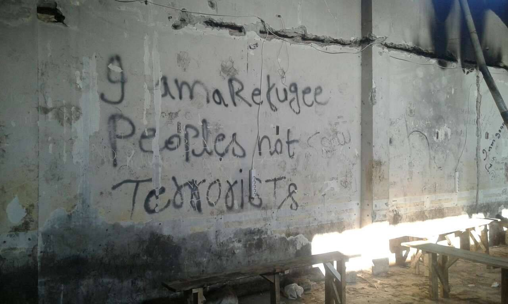
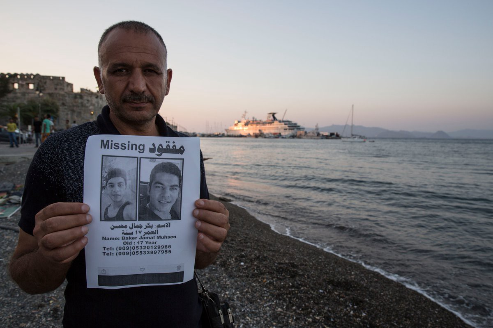
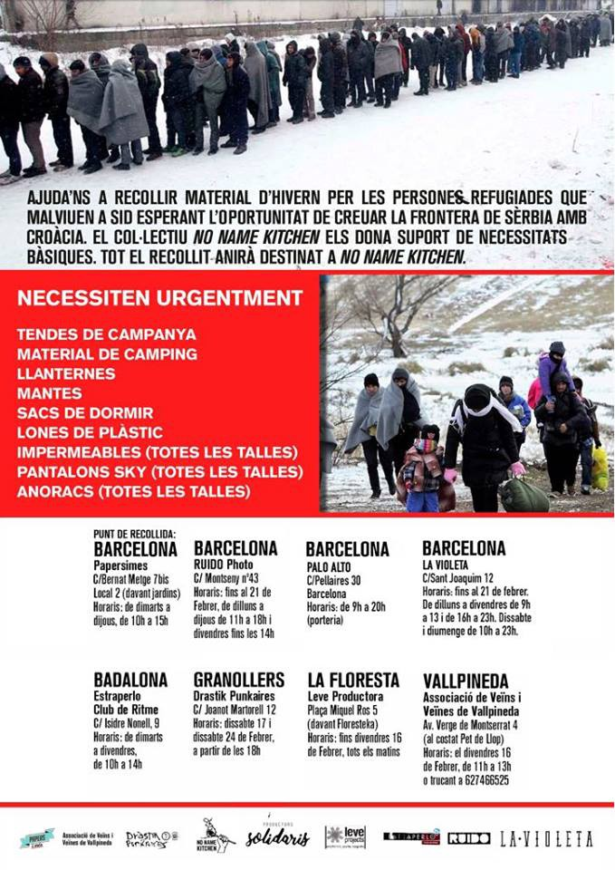

### AYS Daily Digest 15/02/18: Where do the legal procedures and corridors take people?

_Unclear situation on providing support to people in need of international protection in eastern Croatia / Casualties after a big accident in Libya / If planning to volunteer in the Balkans, consider coming to Bosnia and Herzegovina / NGOs in France demand prolongation of winter shelters / Barcelona collecting aid for refugees in Serbia / And more news…_

Photo by AYS
### FEATURE: A border patrol inside the country?

We have in recent days received concerning messages from families with children and people in need of medical aid in the eastern part of Croatia\. They tell us that the police there have been making access to seeking international protection difficult, near\-impossible, in a situation in which people are constantly asking for advice and help in the process of seeking asylum in Croatia\. Croatia is usually the first country of the EU these refugees reach, after passing through Macedonia, Serbia, or Bosnia and Herzegovina\.

We have strong reason to believe that it was the physical presence of AYS volunteers in towns and in the rural areas of the border region in Croatia that made it possible for two families to ask for international protection, in other words, to prevent the push back from Croatia\. Both of these families are now in the reception centre for asylum seekers, Porin, in Zagreb\. These events are yet another example of officials in the area systemically abusing the law, but furthermore point to the ongoing need for an NGO and volunteer presence in that particular area\. More effort needs to be made in order to give the refugees in Croatia adequate support and the real possibility to realize their legal rights on Croatian soil\.

For legal support, refugees/asylum seekers in Croatia can turn to the UNHCR, that is, the Croatian Law Centre \(HPC\) who is their partner in this area\. Note that the centre’s landline is available only during their working hours and by calling \(no WhatsApp or internet calls\)—proving inadequate for a situation in which people need help not only during the day, but also throughout the night and on weekends\.
### JORDAN
#### Jordan appeals to international community, asks for help in supporting Syrian refugees

Three million Syrian refugees are currently displaced inside of Jordan, a country with a population of around 10 million according to recent estimates and with an economy unable to provide decent living conditions for those seeking refuge there\. Of the 657,000 registered refugees in Jordan, more than 80% live below the poverty line\. Work is difficult to come by as the government does not issue many work permits—only 88,000 since 2016\. The situation is truly dire, and it remains up to the world to help the Syrian people until conditions in Syria allow them to return home\.
### LIBYA
#### Big truck accident causes many casualties

While exact numbers reported vary, it seems there were more than 23 deaths and 124 people injured in a big accident on Wednesday near the Libyan town of Bani Walid, [media](http://www.aljazeera.com/news/2018/02/23-killed-truck-carrying-migrants-overturns-libya-180214152726477.html) report\. A truck transporting migrants flipped over in the town, known as a hub for smugglers transporting migrants to Italy, according to [reports](http://www.infomigrants.net/en/post/7578/migrants-killed-in-libyan-truck-accident) \.
#### Refugee evacuations continue

150 highly vulnerable refugees who were evacuated from Tripoli to Rome on Wednesday included children and women who had been held captive for long periods of time\. This was the second evacuation from Libya directly to Italy\. They were accommodated in different reception facilities, according to the [UNHCR](http://www.unhcr.org/news/press/2018/2/5a8451f84/1000-refugees-evacuated-libya-unhcr.html) , whose partners work on the transfers\. These included 770 refugees who have so far been evacuated to Niger\. \(See text under: Italy\)
### GREECE
#### Attika warehouse is in dire need of help\!

The Attika warehouse is a crucial part of the support given to refugees on Lesvos, with most of the NGOs on the island relying on the facility to keep their own projects running\.

Attika is currently involved with:
- asylum seekers on Lesvos
- over 25 NGOs’ located on the island who — without the support of independent warehouse — will face lots of difficulties to operate their own projects
- Chios NGO’s and Vial camp
- local institutions as elderly houses, hospitals…
- poor locals — individuals
- night shifts on Campfire — spotting and landing boats

To land a hand, donate, or inquire about volunteer opportunities, please contact them directly on their Facebook page [here](https://www.facebook.com/AttikaHumanSupport/) \.
### ROMANIA
#### Donations needed to run refugee festival

Last year, Romanian activists launched the Timișoara Refugee Art Festival to “show the humanity in all of us,” as they believe that “refugees and non\-refugees love the same, fear the same, and dream the same\. All need security, understanding, hope, and love\.” With this purpose in mind they have decided to run the festival once more, and in order to cover the costs they have launched an IndieGogo campaign\.

The festival will consist of “film and music, video screenings, concerts, exhibitions and theatre shows of local and international artists, together with educational activities for children and teenagers and an academic conference\.” You can find more information and support the festival by donating to their IndieGogo campaign [here](https://www.indiegogo.com/projects/timisoara-refugee-art-festival-2018-community#/) \.
### BOSNIA AND HERZEGOVINA
#### Help needed in Sarajevo

Refugees are coming to Sarajevo and other cities around the country daily\. Today, a family with a three month old baby arrived in Sarajevo after days of walking over the mountains and through the snow\. Volunteers also found a group of young people, including two very young girls, sleeping on the streets\. According to official sources, in January over 60 asylum applications were filed\. According to one source, there are currently 100 refugees sleeping in the streets of Sarajevo, and this number does not appear to be diminishing\.

People who are coming back from the border with Croatia are reporting violence and push backs\. Some claimed police took their money and valuables, including phones\. Those who made it from Montenegro report about the corruption of police officers and push backs from the Bosnian side\. Some people also reported their experiences being detained in Montenegro and having their past asylum applications rejected\.

Existing facilities are not enough to accommodate all the people who are coming to the area\. Local people are helping, some taking people into their homes, or helping them to find alternative accommodation\.

It is cold and snowy in Bosnia and there are so far no international volunteers in the country\. If you are planning to volunteer in Serbia or another neighbouring country, please consider coming to Bosnia—especially if your services might be more valued there\. For more information, please send a message to [Sonne Jensen](https://www.facebook.com/310797s?hc_ref=ART8yyvGpx_f6o1NNrrpN2FxNfezKpLG9hpUMNtDVmEcmAo-ICA_oM7Uhgwfiw1srdA&fref=nf) on Facebook\.
### HUNGARY

Further arbitrary restrictions will be imposed on the indispensable work of human rights NGOs and defenders in Hungary should a legislative package recently announced by the Hungarian government under the name “Stop Soros” be adopted by the Parliament, the EP Commissioner for Human Rights said\.

> The Hungarian government appears now intent on intensifying stigmatisation and restrictions against NGOs working specifically on migration\-related issues\. 

“I call once more on Hungary to refrain from penalising, stigmatising or putting at any disadvantage whatsoever NGOs, including those working in the field of migration, and to restore an enabling environment conducive to the work of human rights defenders,” the Commissioner stated in his [official statement\.](https://www.coe.int/en/web/commissioner/-/commissioner-concerned-about-proposed-additional-restrictions-to-the-work-of-ngos-in-hungary)
### ITALY
#### Where else do the corridors lead to?

In the past months, we have been hearing more and more about humanitarian corridors and other ways to thought possible to “regularly” enter Europe\. 
UNHCR has recently posted the news that, since November 2017, it has moved more than 1,000 people out of Libya and is now looking to establish similar permanent solutions to allow people to reach safe countries without having to risk their lives\. Note that flights and journeys are not necessarily directed towards Europe, but could be to ANY country deemed a “safe” third country\.

We are all aware of the fact that this work is being carried out in collaboration with Libyan authorities so, even though the result might sound like a victory, the means being used to reach that end are a grey area, involving a very controversial partner to be working with\.
### GERMANY
#### Germany bans protest by Kurdish group

The Democratic Kurdish Society Centre planned to hold a demonstration in Cologne against Turkey’s invasion of Afrin\. Unfortunately, however, they were prevented from doing so by the police, who banned their protest\. Germany has longstanding military ties to Turkey\. The group alleges that this move comes amidst the Turkish Prime Minister’s meeting with Angela Merkel, as a “gift” to the Turkish security apparatus\. The group plans to pursue legal action\.
### FRANCE
#### NGOs push for prolonged winter lodging

After coming to a common agreement, a number of organizations have called upon the official responsible for the Pas\-de\-Calais winter accommodation to keep the program and facilities open until March 31st\. Dismantling and closing places where people could hide from the freezing weather at this point is, after all, far from humane\.

The request comes from: First Aid Support Team, Gynécologie Sans Frontières, Safe Passage, Croix Rouge, Secours Catholique, Auberge des migrants, Salam, Cabane juridique, Care4Calais, Médecins du Monde, Refugee Youth Services, Refugee Community Kitchen, Help Refugees, Women’s Center, School Bus, Infobus, Calais Migrants Solidarity, and Planning Familial\.
#### Help Refugees releases weekly video update on situation in Calais

The group reports that as many as 200 refugees are back on the streets after the closing of short term accommodations\. They are holding another fundraising campaign to provide refugees with tents, gloves, and warm winter clothes\. You may give either a one\-time donation or a recurring monthly donation by going to [this page](https://donate.helprefugees.org/campaigns/northern-france/) \.

■■■■■■■■■■■■■■ 
> **[ECRE](https://twitter.com/ecre) @ Twitter Says:** 

> > #AIDA 2017Update: 🇫🇷France - information on persisting challenges &amp; developments in ➡️ asylum procedure, ➡️reception conditions, ➡️detention; ➡️statistics +++ For an overview: [bit.ly/2o4L7OZ](http://bit.ly/2o4L7OZ)  &amp; Full report: [bit.ly/2srjqFz](http://bit.ly/2srjqFz) https://t.co/J9mB0nZXlh 

> **Tweeted at [2018-02-15 14:33:19](https://twitter.com/ecre/status/964145605005271041).** 

■■■■■■■■■■■■■■ 

### UK
#### Refugee Rights Europe releases report on British hostile attitudes towards refugees

The newly\-released [Refugee Rights Europe report](http://refugeerights.org.uk/wp-content/uploads/2018/02/RRE_A-Hostile-Environment.pdf) highlights the hostile environment that many refugees in Britain encounter\. The report is the result of, among other things, a number of interviews with refugees, the largest contingent of which comes from Sudan, followed by Kuwait, Eritrea, Iraq, and Morocco\.
### MEDITERRANEAN
#### 401 people have died this year attempting to cross the Mediterranean

A family member of a missing relative holds up a sign containing the contact information of the person in question \(Photo by Missing Migrants\)
### SPAIN
#### Clothing collection for refugees to take place in Barcelona

No Name Kitchen has organized a winter clothing collection in Barcelona\. Items brought in will be taken to Serbia and distributed to refugees in the country, where many people are sleeping rough and receive minimal assistance from the government\. If you are in Barcelona and would like to help out, see the poster below for the items needed as well as the collection points\.

### AFGHANISTAN
#### ‘Safe country’ had 10,000 civilian casualties in 2017

The UN Assistance Mission in Afghanistan has released its annual report on Afghanistan\. The report reveals that in 2017 there were a total of 10,453 civilian casualties, with 7,015 resulting in injuries and 3,438 in death\.

A majority of the deaths were caused by anti\-government forces, such as the Taliban \(42%\), Daesh \(10%\), and 13% attributed to other unknown anti\-government forces, bringing the total to 65%\. On the pro\-government side, 16% were the result of the Afghan military, 2% were caused by international military forces, and 2% by pro\-government groups and forces\.

**We strive to echo correct news from the ground through collaboration and fairness\.**

**Every effort has been made to credit organizations and individuals with regard to the supply of information, video, and photo material \(in cases where the source wanted to be accredited\) \. Please notify us regarding corrections\.**

**If there’s anything you want to share or comment, contact us through Facebook or write to: areyousyrious@gmail\.com**

_Converted [Medium Post](https://medium.com/are-you-syrious/ays-daily-digest-15-02-18-where-do-the-legal-procedures-and-corridors-take-people-dd5f8ccdd10c) by [ZMediumToMarkdown](https://github.com/ZhgChgLi/ZMediumToMarkdown)._
