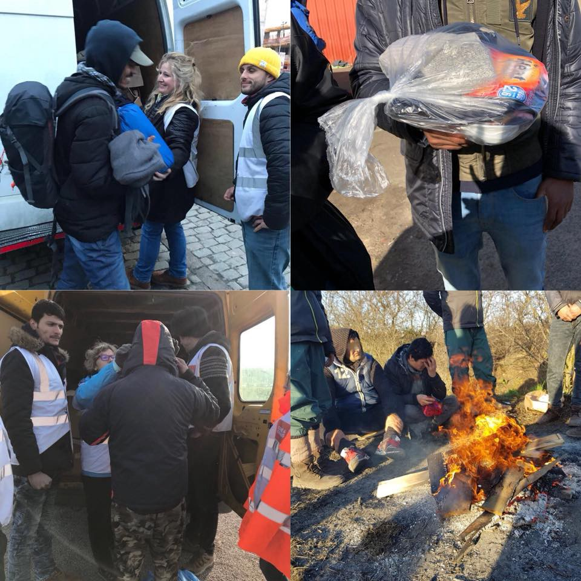

### AYS DAILY DIGEST 23/2/2018: Over 21\.000 people prevented from entering Serbia last year

_People trapped in Serbia as a result of EU countries shutting their borders // Significant increase of people who arrived in Europe this year in comparison to 2017 // People trapped in snow in Bosnia // Balkan weather report and much more // Military style detention in Norway_

](assets/e986e45510af/1*yFvquw2wLC1v9PTZO7IV2g.jpeg)

Photo by [**Médecins du Monde Hauts\-de\-France**](https://web.facebook.com/M%C3%A9decins-du-Monde-Hauts-de-France-850170168369696/?hc_ref=ARSyTcQlSj9UdZSauRZBZdsc-_MGJ_MfunvMIKRDERkk37AY3A0ToGzWOGi15V-53Os)

**Feature**

It is close to impossible to get protection in Serbia, according to an analysis done by the [Belgrade Centre for Human Rights \(BCHR\)](http://www.bgcentar.org.rs/bgcentar/eng-lat/) \. During 2017, 236 people applied for asylum, while only 14 got a positive decision: three persons got refugee status, 11 subsidiary protection, while 11 were rejected on different grounds\. Many of those who were rejected come from Syria\.

Even though it is a fact that many people who applied for asylum in this country did not have the intention to stay, the government was obliged to offer more information and better conditions\. Additionally, BCHR warns about the very disturbing situation of asylum seekers who had been hoping to continue towards the EU, and who **“became ‘trapped’ in Serbia** as a result of neighbouring countries shutting down their borders”\.

_“As they have already spent weeks or even months in Serbia by the time they apply for asylum, they are often treated as simple irregular migrants and face action under the Foreigners Act, such as being issued with an order to leave the country or face forced return proceedings\. If a foreigner applies for asylum but then tries to leave the country, the Ministry of Interior considers it an abuse of the asylum procedure and often denies them the possibility of submitting an application\. Under such circumstances, police officers tasked with issuing certificates of having expressed the intention to seek asylum will often refuse to do so, in spite of the fact that they are not entitled to make such a decision under the Asylum Act\.”_

Additionally, the report notices that **more than 21,000 persons had been prevented from entering** from Bulgaria and Macedonia\.
 
BCHR warns that a number of issues concerning limited access to the asylum procedure were reported during the year, including pushbacks but also arbitrary returns to third countries or countries of origin from Belgrade airport\.

Police at the airport in Belgrade are detaining people in the transit zone until the company they had been travelling with provides them with a seat on the return flight\. People remain detained for periods ranging from a few days to several weeks, deprived of their rights, including the right to have a lawyer, to inform a third person of their whereabouts and to challenge the grounds of their detention\. This is how 498 people were treated during the first six months of last year, including people from Palestine, Syria, Turkey, Libya, Iraq and Afghanistan\. They were returned to the countries they came from, including Greece, Lebanon, United Arab Emirates \(UAE\), and Turkey\.

At the border with Bulgaria, mixed forces of both countries are still patrolling the border and preventing people who are seeking international protection from applying for asylum\.

_“It is hard to assume that 21,000 people were prevented from crossing the border in a manner that was in line with Council of Europe standards i\.e\. that each of these persons was served with a decision that is rendered in a procedure where the individual circumstances of each person were examined; with the assistance of a lawyer and a translator for a language he or she understands; and with the possibility to lodge an appeal with suspensive effect\. This kind of practice has been condemned by the UN Human Rights Committee, as well as the Special Representative of the Secretary\-General on migration and refugees\. Furthermore, the Macedonian Young Lawyers’ Association \(MYLA\) has been publishing monthly reports that contain statistical data on pushbacks from Serbia\. According to these reports, several hundred foreigners are pushed back from Serbia every month,”_ the report reads\.

The organization calls for the establishment of _“a border\-monitoring mechanism which will include representatives of civil society,”_ as recommended previously by the UN Committee against Torture\.

BCHR also points to a number of reports concerning the **unprofessional and abusive behaviour of police** officers in Belgrade’s Savski Venac Police Station, including shouting, threats of deportation, and imprisonment\.

The report noticed another important issue, stating that it is not clear what the official stance of the Serbian authorities is vis\-à\-vis people who returned after being refused asylum in Hungary\. So far, people have been denied the possibility of expressing the intention to seek asylum in Serbia\.
### Sea

In January, over **8,000 people arrived** via the Mediterranean route to Europe, which represents an 11 percent increase compared to the same period in 2017, according to [UNHCR data](https://data2.unhcr.org/en/documents/download/62184) \.

Among those who arrived, **19 percent were children** \.

In the same period of time, an estimated **227 persons died while trying to reach Europe** , including one incident when 100 people were believed to have died and another in which 64 were believed dead\.
### Greece

A 5\-year\-old boy from Syria died on Friday after he was run over by a car on the road linking Mytilene, Lesvos, to the town of Mantamado\.

The accident occurred outside the Kara Tepe camp where the child was staying with his family\.

As reported by locals, traffic at this point close to the camp is particularly high, and it is difficult for pedestrains to cross from one point of the road to another\.

A total of four boats arrived on the Greek islands over the Thursday night and Friday morning\.

One boat landed on Lesvos south, Katia beach, with a total of 65 people\. Four were sent to the hospital due to minor issues\.

Two boats were picked up outside Samos by Frontex, one with 51 people and the other with 42 people\.

](assets/e986e45510af/1*wE0DJEEHW6R9ugpWfyc4sQ.jpeg)

Photo by ERCI — [Emergency Response Centre International\.](https://www.facebook.com/ercintl/posts/769642809902139)

[Aegean Boat Report](https://www.facebook.com/AegeanBoatReport/posts/310982619424849) group reports that two boats were stopped by Turkish Coast Guards on Friday\. One was on its way towards Lesvos south with 36 people and the other one towards Kos with 42 people\.

**Most of the people who are now arriving in Greece are from Syria and Iraq\.**

In general, **arrivals increased by 17 percent** compared to last January\.

The situation is the same at the land border\. From the beginning of this year, **565 people crossed the Evros River from Turkey** , compared to 353 in January last year\. Since November last year, nine people have died on this route\. Recently, Greece’s Council for Refugees has called on the government [to investigate reports](http://www.infomigrants.net/.../greece-s-council-for...) about **“systematic pushbacks”** by police on the northeastern border with Turkey in the Evros region\.

At the moment, there are around **6,000 people at Lesvo** s, almost **2,000 at Chios** , about **1,700 at Samos** , around **800 at Kos** , about **700 at Leros** , over **130 at Rhodes** and some **40 at Tilos** \.

In total, **over 11,000 people live in horrible conditions on Greek islands** \.

UNHCR notices a “slight improvement” in camps on the islands, but hardly any of the people who are forced to live there see any improvement\. Even more, most of them report that conditions are getting worse every day\.

Reports of sexual harassment and violence are numerous, particularly in Moria on Lesvos and Vathy on Samos\. Neither UNHCR nor the Greek government are doing enough to prevent this\. Moreover, [the government has rejected](https://www.ecre.org/greek-government-disregards-unhcr-reports-of-sexual-violence-in-greek-island-camps/) the UNHCR report about sexual violence in camps stating that their findings were not “thorough” or “scientifically substantiated\.”

Among those who are trapped on the islands, there are many unaccompanied minors\.

On Friday, we received another warning about groups who are trying to pressure people to convert to other religions\. Apparently, there is a group of ‘volunteers’ coming to the camps in Athens and continuously trying to pressure people into converting to other religions\.

Unfortunately, similar reports are coming from all over Europe\.

**HELP NEEDED**

[Medical volunteers](https://www.facebook.com/groups/MedicsforGreece/permalink/564702347219715/) sought for Lesvos\.

[Boat Refugee Foundation](https://bootvluchteling.nl/en/volunteer-medical-mission/) is restarting its medical mission in camp Moria on Lesvos and is looking for doctors and nurses from May 1st onwards\.

An amazing group working in Vathy camp on Samos needs more volunteers\. [Samos Volunteers](https://web.facebook.com/samosvolunteers/) are looking for somebody to work with children, but also on sorting and distributing donations, or as a language teacher\.

They need people who can help in March, April, and May, for a minimum of four weeks\.
### Spain

In January, nearly **2,200 people crossed** the land and sea borders from North Africa, which is an increase of 58 percent compared to January 2017\. Again, most people who arrived are from Syria, but also Guinea and Morocco\.

Even though there are many activists and volunteers from Spain all over Europe, it is hard to get info about the conditions in Spain\. If you have more info and are willing to share, please get in touch with AYS\.
### Italy

In Italy during the first month of this year, **4,200 people arrived by sea** \.

Fondazione Migrantes [reports](http://www.infomigrants.net/en/post/7722/over-183-000-refugees-in-italy-in-2017-that-s-3-per-1-000-inhabitants) that the Mediterranean continues to be **“the deadliest border in the world\.”**

According to the same source, at the end of 2017, there were 183,681 asylum seekers and refugees in Italy, or three for every thousand inhabitants\.

According to interior ministry figures, **about 130,000 people asked for asylum** in Italy in 2017\. The majority — just under 60 percent — had their requests rejected\.

Again, unlike the government, people still remember what solidarity is\. In the past three years, over 400 households have taken in at least 500 people\.

**Bosnia**

More and more people are arriving in Bosnia daily\. In order to enter the country, due to the cruel policy of closed borders, they are forced to walk in a mountainous area, in snow up to 1\.5m deep\. Two nights ago, a Syrian family and two boys who lost their parents in Aleppo were found in the mountains in deep snow\. On Thursday evening they arrived in Sarajevo, where locals are now providing help and accommodation for them\.

The conditions in the only asylum centre that exists in the country are often subject to complaints by people who are living inside or who left it\. They claim that they do not receive enough food, clothes or any help, and most turn to volunteers\.

One of the places that offer refuge to people is in Semizovac, where one family is hosting over 60 people on their property\. Food and other kinds of help is provided by local NGOs and volunteers, and recently even international volunteers have started arriving to help\.

In order to support all the people who are living in Semizovac, near Sarajevo, [IHA Austria](https://www.facebook.com/groups/1528861903901562/) is looking for a team of two to four volunteers\. You should be available for at least one week and able to travel independently\. You’d be part of a local initiative supporting refugees in the Sarajevo area\. Accommodation for volunteers is available\.
### Serbia

According to the weekly UNHCR report, Hungarian authorities admitted 23 people from Serbia into “transit zones”, compared to 39 in the preceding two weeks\.

Currently, there are **3,963 registered people on the move in Serbia** \. Some 150 were observed sleeping rough near the borders with Croatia and Hungary\.

Among the people living in the existing centres, two cases of measles were confirmed, including a 17\-year\-old boy in a government centre and a 26\-year\-old man who squatted near Sid\. Both were hospitalized\.

Additionally, 11 men from Algeria and Morocco had to be hospitalized on 14 February after being found in Sid train station with severe symptoms of poisoning after inhaling fumes from pesticides in the train wagons in which they had hidden while trying to enter Croatia\.
### **BALKAN WEATHER REPORT**

**Montenegro** 
Saturday will be partly cloudy with intervals of sun, and in the north it will be mostly cloudy with occasional snow showers\. The wind will be moderate to strong, blowing from the north and northeast\. In the de morning the temperatures will be between \-3 to 11 and during the day between 0 to 17 degrees\.

**Serbia** 
Tomorrow most parts of Serbia will be moderately cloudy to cloudy, with occasional snow in some parts of the country, while in the east and south it will rain, and in the north, it will be mostly dry\. The morning temperature will be between \-2 to 3 and during the day between 2 to 6 degrees\.

**Bosnia** 
Saturday will be mostly cloudy with light snow\. Herzegovina and the southwest of Bosnia will be sunnier\. The wind will be weak to moderate blowing from the north and northeast\. The temperature in the morning will be between \-1 and 4, and during thy day between 3 and 14 degrees\.

**Croatia** 
Inland it will be variably cloudy and in the morning some snow is possible\. Along the coast it will be sunny, and towards the beginning of the night it will become increasingly cloudy\. The winds inland will be moderate, blowing from the northeast, moderate to strong along the coast, while below Mount Velebit stormy winds are expected\. The morning temperature will be between \-5 and 0 inland, while along the coast temperatures from 2 to 10 degrees are expected\. The day temperature will be from \-3 to 2 inland and along the coast from 5 to 15 degrees\.
### France

Severely cold weather is predicted in France, where thousands of people are sleeping rough, mostly in the Calais area and in Paris\. The temperatures predicted for next week are between \-6° and\. \-10°\.

[Care4Calais](https://web.facebook.com/care4calais/) has started preparing for the super cold weather expected next week and they are distributing winter coats, sleeping bags, thermal underwear, tents, socks, hats and gloves at our first location in Calais\.

But more [help is needed](https://goo.gl/jmkx7A) in order to keep people as warm as possible\.

French and British NGOs have [condemned the draft French](https://helprefugees.org/joint-statement-french-immigratio…/) asylum and immigration bill in a joint statement describing it as _“incompatible with internationally recognized human rights standards and provisions for refugee protection”_ \.

The draft bill would cut the deadline for refugees and migrants to apply for asylum from 120 days to 90 days following their arrival\. It would double the maximum period of asylum detention from 45 to 90 days\. The bill would also criminalize illegal border crossing, making it punishable by one year in jail and fines\.
### Norway

The number of [deportations is rising](https://www.globaldetentionproject.org/immigration-detention-in-norway-fewer-asylum-seekers-but-more-deportees) in this country as well as deportations of people who need help\. Between **2012 and 2016, the number of people placed in detention nearly doubled** \. Detention centres are run in a militarized fashion, the new report states\.

_“Scene to several riots and attempted suicides, the facility is run by uniformed police and has a prison\-like regime that includes intrusive body searches and the use of security cells and solitary confinement\. Rights observers have expressed concern that the centre’s excessive control and security measures are detrimental to detainees’ wellbeing\.”_
### Germany

A single case, but shows the absurdity of German politics: Dame Now was arrested in school and brought to detention arrest to wait for his deportation on 2nd February\. His asylum claim had been rejected, but he had been undergoing training to become a geriatric nurse \(start of the apprenticeship for summer 2018\) and the geriatric home where he had been working had already applied for him to allowed to stay in Germany for his apprenticeship\. There is a high demand for geriatric nurses in Germany, and recruiters are desperately looking \(also abroad\) to find nurses\. — Dame was well integrated, playing soccer and volunteering at a local charity\.

A [link to an online petition](http://fluechtlingsrat-bw.de/informationen-ansicht/aus-der-schule-in-die-abschiebehaft.html) is at the end of the \(German\) article\.
### General

EU is sealing its borders further, creating a real fortress and killing even the notion of one of the basic human rights — freedom of movement\. Now, Brussels is helping Balkan countries, where people and governments have so far been very welcoming toward refugees, to change that, giving huge sums of money and sending Frontex to seal the borders\.

A draft status agreement on strengthened operational cooperation between the European Border and Coast Guard Agency \(Frontex\) and Albania has been announced by the European Commission, while Serbia recently signed an agreement worth 28 million Euros with the Commission in support of the country’s border and migration management\.

Introducing a new “Western Balkan Strategy”, paper that is not clear in most of its aspects, the High Representative/Vice\-President Federica Mogherini linked enlargement directly to mutual interests of migrant control: _“we have seen this very clearly a couple of years ago when we called the partners to manage together the refugee flows that were crossing the Balkans\. We realised that we were one\.”_

But, Balkan countries and the EU are not one in any other sense\.

Reinforcing engagement on border security and migration management is one of six so\-called ‘flagship initiatives’ outlined by the Commission ‘to support the transformation of the Western Balkans’ and provide ‘a credible enlargement perspective\.”

According to UNHCR 40–50,000 refugees or migrants from Afro\-Asian countries are staying in the territory between Greece and Croatia trying to reach Western Europe\.

Europe is increasing the suffering of African migrants trying to cross the Sahara, the [Red Cross chief said](https://www.francescorocca.eu/reuters-eu-security-does.../) on Thursday, urging lawmakers not to put security above human rights\. Francesco Rocca — head of the world’s largest humanitarian network, the International Federation of Red Cross and Red Crescent Societies \(IFRC\) — met migrants in Niger who said they were stranded, unable to head north to Europe or return home\. Last year, EU member states arrested 10,200 people smugglers\.

According to EASO, in 2017, as many as 701,997 applications for international protection were lodged in the 28 EU Member States plus Norway and Switzerland \(EU\+ \) \. Of the applicants in 2017, 8% had previously submitted an application in the same EU\+ reporting country \(repeated applicants\) \.

In 2017, a total of 183,548 refusals of entry were reported at the external borders of the EU, a fall of 15% compared with 2016\.

**We strive to echo correct news from the ground through collaboration and fairness\.**

**Every effort has been made to credit organizations and individuals with regard to the supply of information, video, and photo material \(in cases where the source wanted to be accredited\) \. Please notify us regarding corrections\.**

**If there’s anything you want to share or comment, contact us through Facebook or write to: [areyousyrious@gmail\.com](mailto:areyousyrious@gmail.com)**

_Converted [Medium Post](https://medium.com/are-you-syrious/ays-daily-digest-23-2-2018-over-21-000-people-prevented-from-entering-serbia-last-year-e986e45510af) by [ZMediumToMarkdown](https://github.com/ZhgChgLi/ZMediumToMarkdown)._
