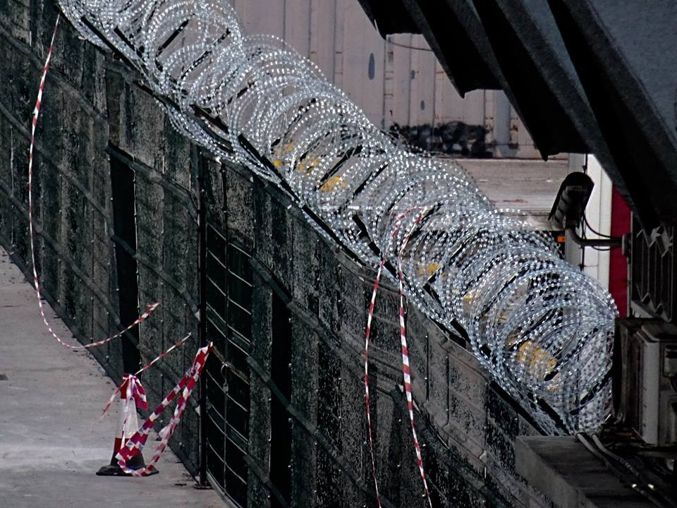

### AYS DAILY DIGEST 25/02/2018: Italy condemned for pushing back migrants to Libya in 2012

_ECHR found Italy guilty of aiding a push\-back to Libya in 2012/MSF demands stop of shelling in Ghouta/ 85% of refugee children in Jordan live in poverty/ 2 smugglers arrested in Greece/Call for volunteers and donations in Greece and France/ Balkan weather report/ Solidarity with attacks suffered from Baobab/ Solutions to be identified for refugees in Pordenone and Gorizia\. \._

Credit: Bienvenidos Refugiados
#### **FEATURE**

The German Bundestag has released a detailed overview related to a [research](https://andrej-hunko.de/start/download/dokumente/1109-bundestag-research-services-maritime-rescue-in-the-mediterranean/file) on rights and obligations of vessels under the 1979 SAR \(Search and Rescue\) Convention and the principle of non\-refoulement at sea, with a close look at the past year in the Mediterranean\.

Under the SAR Convention and according to article 98 of the UNCLOS \(UN Convention on the Law of the Sea, 1982\), every ship has the duty to rescue people in distress at sea and, in case 2 or more ships are in proximity of a distress boat, the competent national MRCC \(Maritime National Coordination Centre\) will assign the responsibility to carry on the operation\.

Considering the situation in Libya at the moment and the absence of any national MRCC, “ _their powers to give instructions and to coordinate operations in maritime rescue missions are confined to coastal waters and a strictly limited adjacent area_ ”, meaning Libyan authorities have no power outside territorial waters \(12 nautical miles\) and “ _no right to prevent the participation of other vessels in a maritime rescue_ ”\.

What happens in reality is that LCG and private vessels are confronting each other when carrying on SAR operations, instead of collaborating as designed by the SAR Convention, as it happens many times during 2017\. The vessels of NGOs have the right not to abandon the spot if they think that the LCG’s designation is “ _in conflict with the aim of an effective maritime rescue_ ” and in no way Libyan CG is authorised to use force to prevent assistance\.

The study case is the one of an Italian warship that, in 2012, “ _reportedly blocked the passage of a boat carrying migrants and refugees for several hours without taking its passengers on board_ ” because it was waiting for a Libyan vessel to bring back the refugees to Libya, de facto violating the principle of non\-refoulement \(duty to not push\-back or return people at the border\) and endangering these people’s lives\.

By doing so, Italy violated not only the art\. 33 of the Refugee Convention \(1951\) and other international conventions, but also the art\. 3 of the European Convention on Human Rights \(1950\), sending migrants back to a country where, as we all know, there is a high risk for them to undergo inhuman treatment, torture or be killed\.

In 2012, during the _Hirsi Jamaa and Others v\. Italy_ case, the ECHR ruled that “ _the Member States of the ECHR are bound by the principle of non\-refoulement, regardless of where sovereignty is exercised_ ”, which means that it is valid at sea, as well as on board of vessels showing European flags\.

A different perspective is to be considered in case of omission of help of people at sea or in case of active obstruction of the boat carrying migrants\. In these cases, only if the boat is in distress then the omission of help could be considered violation of the principle of non\-refoulement, but in every case, the obstruction constitute a breach of the principle\.

The research also references other court cases of EU states violating international human rights law\.
#### **SYRIA**

In 5 days, 2\.500 people were wounded and 520 killed during bombings in East Ghouta\. MSF facilities were targeted as well

[")](https://www.facebook.com/msf.english/posts/10155154716987385)

#### **JORDAN**

According to Unicef, 85% of Syrian refugee children live in poverty, while 94% are deprived of a minimum of 2 out of the following needs: education, health, water and sanitation, child protection and child safety\.

#### **GREECE**

_Arrivals_

56 people were rescued this morning and brought to Samos

_Lesvos_

“Home for all” is looking for [volunteers](https://www.facebook.com/permalink.php?story_fbid=761763647344011&id=100005311481518&hc_location=ufi) for their new project, a space where people will get free wifi, coffe, tea and open hearts and minds :\)

_Mainland_

[Ekathimerini](http://www.ekathimerini.com/226148/article/ekathimerini/news/greek-police-arrest-2-migrant-traffickers-14-syrians) reports that 2 smugglers \(one Syrian and one Iraqi\) have been arrested while transporting 14 undocumented people from Syria, 8 of them children\.

Local authorities [announced](https://www.facebook.com/groups/PAMPIRAIKI/permalink/599251130418995/?hc_location=ufi) that they intend to demolish on of the buildings of the disused ABEX factory building, where refugees are hosted in Patras\.

Big tents are needed asap\!

Donations of nappies are needed on a regular basis\. If you can help, please contact [Refugee Biriyani & Bananas](https://www.facebook.com/RefugeeBiriyaniAndBananas/posts/994458144045585?hc_location=ufi)
#### **BALKAN WEATHER REPORT February 25**

**Montenegro**

The week will start predominantly cloudy and very cold, with occasional snow in most parts of the country and snow storms in some places\. The wind will be moderate to strong, occasionally stormy and will be blowing from the north and northeast\. The morning temperature will between \-16 and 0 degrees and during the day between \-12 and 5 degrees\.

**Serbia \(not specific for Monday but for the upcoming days\)**

The coming days till March very cold weather is predicted, most parts of the day it will be below freezing point\. It will continue to snow throughout the day increasing the height of the snow cover, 5 to 10 cm in the north,10 to 20 in other parts of the country and locally more\. In the morning temperature is expected to be between \-12 and \-5 while during the day it will be between \-6 and \-2 °degrees\.

**BiH**

On Monday it will be cloudy with snow in Bosnia and Herzegovina\. The new snow will increase the snow cover with 10 to 20 centimetres\. The wind will be moderately strong blowing from the northeast\. In Krajina, the northern and western parts of very strong winds reaching speeds of 40 to 50 km / h are possible\. The air temperature is generally between \-9 and \-5 , in the south of the country between \-3 and \-1 degrees\.

**Croatia**

Monday will be preliminarily cloudy with light snow ion the mainland and in the north of the coast\. Throughout the country it will continue to be uncomfortably windy and cold\. Land inwards the wind will be weak to moderate, in the mountains strong strong north eastern winds and alongside the coast strong and stormy winds\. In the morning it will be from \-11 to \-6 land inwards and \-5 to 3 ° degrees alongside the coast\. During the day temperatures will be ranging from \-8 to \-2 land inwards and \-1 to 8 °degrees alongside the coast\.
#### ITALY

Pordenone and Gorizia struggling to find shelters for asylum seekers, who are forced to sleep rough even with freezing cold temperatures\.

In Gorizia specifically, the big tent of Caritas will close on Wednesday, leaving people with nowhere to go\.

In Rome, Baobab has been [under attack](https://www.facebook.com/BaobabExperience/posts/1593330284077051) in the past days, when they found swastikas sprayed at the entrance of Piazzale Maslax and when a group of fascists directly threatened volunteers and people hosted\. They were shouting horrible things like “ _We will set fire to you and your negros_ ”, filming the scene with phones\.

150 people find shelter thanks to Baobab at Piazzale Maslax, hundreds of volunteers and people in solidarity donate their goods and time, showing how the real face of solidarity looks like\. Piazzale Maslax is also a place where you can go and simply have a chat with the people hosted, so if you feel like it, go and join them\. To Baobab all our support ❤
#### FRANCE

_Paris_

People in Paris who are interested in fashion, sewing, altering and recycling clothes can take part to this workshop at Porte de la Chapelle from tomorrow for 2 weeks\!

The [workshop](https://www.facebook.com/groups/177642579245883/permalink/578744275802376/?hc_location=ufi) will run every day from 11 to 17 and will be held at the Good Chance Theatre\.

_Calais_

Temperatures drop and extreme cold will hit France in the coming week, considered the coldest of the year\. Temperatures are reaching \-4 °C in these nights\.

L’Auberge is calling for help as they need volunteers to identify potential cases of hypothermia, every morning, and transport to accommodations to the places of distributions

[. 2 actions pour l'Auberge : - Transport jusqu'aux hébergements #PlanGrandFroid depuis les lieux de distribution (ici, le centre ville) - Run dans Calais le matin pour identifier et aider les gens en hypothermie")](https://www.facebook.com/AubergeMigrants/posts/10155844965990339:0)

_Dunkirk_

Dunkirk Refugee Women’s Centre is looking for female volunteers to join their team at different times\. If you can commit from March on, contact them [here](https://www.facebook.com/refugeewomenscentre/posts/395463320879304?hc_location=ufi)
#### UK

Bikes needed in Birmingham

> **We strive to echo correct news from the ground through collaboration and fairness\.** 

> **Every effort has been made to credit organizations and individuals with regard to the supply of information, video, and photo material \(in cases where the source wanted to be accredited\) \. Please notify us regarding corrections\.** 

> **If there’s anything you want to share or comment, contact us through Facebook or write to: [areyousyrious@gmail\.com](mailto:areyousyrious@gmail.com)** 

_Converted [Medium Post](https://medium.com/are-you-syrious/ays-daily-digest-25-02-italy-condemned-for-pushing-back-migrants-to-libya-in-2012-63254866a02) by [ZMediumToMarkdown](https://github.com/ZhgChgLi/ZMediumToMarkdown)._
