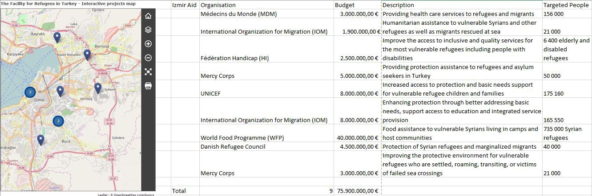
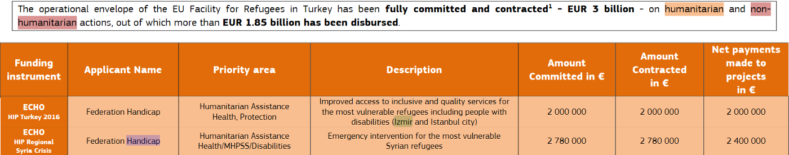
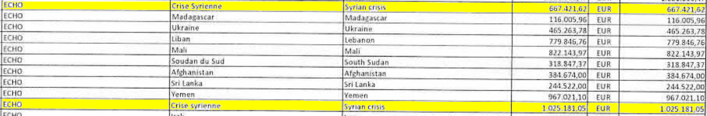
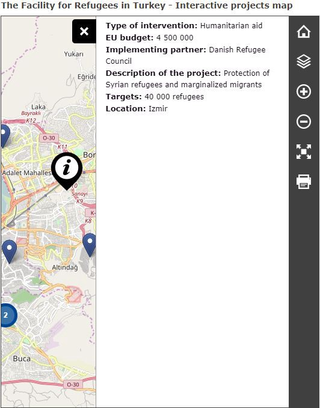

### AYS Special about Turkey: Between caution and intransparency

_Struggles and activities of EU funded NGOs working in the province of Izmir\._

](assets/f8bb8cb0dd/1*VILMsnzbZ4_0f75C9dbIog.jpeg)

As of end December 2017, 72 projects have been contracted worth 3 billion Euros by DG Echo\. Credits: [DG Echo/Twitter](https://twitter.com/search?l=&q=Turkey%20from%3AEU_ECHO&src=typd)

Previously, [AYS reported](ays-special-turkey-the-only-hope-is-to-return-one-day-1df83003a89b) on the situation of many Syrians in the province of Izmir\. Based on their field experiences, we contacted the EU and several NGOs, who should be/are operating in the region\. We have now conducted some further research to find out more on the commitment to support displaced people in the area\.

In a written statement, a spokesperson for the European Commission’s Directorate General for Neighbourhood and Enlargement Negotiations \(DG ECHO\) said: “As one of the ten most affected provinces by the refugee crisis, Izmir is a priority for the EU and therefore receives an important part of the Facility support through various humanitarian and non\-humanitarian projects\.”

With more than [130,000 Syrians](http://www.goc.gov.tr/icerik6/temporary-protection_915_1024_4748_icerik) under temporary protection in February 2018, Izmir belongs to one of the provinces which is hosting the largest total number\. Compared to the province’s population of more than four million citizens, this is around three percent\. One year before, [104,000](https://drc.ngo/media/3266318/mixed-migration-turkey-updates-february-2017.pdf) were registered\. This means there was an increase of almost 30,000 people only in this single province, which is a clear indicator that the war in Syria is far from calming down\.

According to their own account in the [interactive projects maps](https://ec.europa.eu/neighbourhood-enlargement/news_corner/migration_en) , nine projects of seven organizations were contracted and funded by DG Echo to the tune of almost 76 million Euros for the years 2016 and 2017\. The directorate has [determine](http://ec.europa.eu/echo/where/europe/turkey_en) d that “registered refugees have access to public services, including education and healthcare\. However, for many refugees, access to these basic facilities is often difficult for various reasons, including problems in registering with local authorities and the language barrier\.”

Interactive map of DG Echo and the funded projects \(Screenshot and data taken on 19/02/2018\) \.

AYS has contacted all the named organizations, asking them about their activities and their collabroation with the EU\. So far, have we received answers from two of them:

> Unfortunately I can’t help you there\. In principle we don’t communicate about Turkey\. 

> —Spokesperson of Federation Handicap 

In its [2016 annual financial statement](https://hi.org/sn_uploads/content/7.2-2016_Statutory_Annual_Report.pdf) \(page 47\), Federation Handicap/Handicap International published that they had received two fundings from DG Echo\. One is worth a million, and the other 2\.5 million Euros for the “Syrian crisis”\. Unlike for other fundings, they entered this phrase in the country column and not the country itself\. At least two million Euros were contracted and disbursed to provide services in Izmir and Istanbul city in particular, according to the [EU facility table](https://ec.europa.eu/neighbourhood-enlargement/sites/near/files/facility_table.pdf) \.

In its [2016 annual report](https://hi.org/sn_uploads/content/7.3-2016-Annual-Report_Federation-Handicap-International.pdf) and in the [list of countries](https://humanity-inclusion.org.uk/en/countries-we-work-in) HI works in, Turkey is not mentioned\. At this point AYS cannot say if this is part of HI’s strategy of non\-communication\. One source in Izmir confirmed activities of the Organization\. “They have but not in this big, big size,” that would require such a budget, our source said\.

Extract of the EU facility table \(Screenshot taken on 20/02/2018\) \.

Exctract of HI’s 2016 annual financial statement\. \(Screenshot taken on 20/02/2018\) \.

HI has not yet answered our second request\. In its statement, DG Echo declares, _“Each project is carefully monitored by the staff in the EU Delegation to Turkey/ECHO local office as well as by staff in European Commission Headquarters, through regular implementation meetings with the contractor and on\-the spot monitoring\. Projects with NGOs are grants given to implement specific actions\. Payments under grants are made based on reported incurred costs in accordance with the general conditions of the individual grant contract\. These costs are verified before further pre\-financing or final payment takes place\. Should any irregularities be detected or costs declared ineligible, the European Commission can recover funds or impose penalties\.”_

The Danish Refugee Council reacted to AYS’ request in a more transparent manner than HI\. Shahzad Jamil, the DRC Country Director for Turkey, when asked if DRC is looking for people in need or if they have to get in touch with them, said that _“due to current restrictions in Turkey, outreach is very difficult however we reach communities through our centers and those of our implementing partners, local CBOs \(editors note: “_ Community Based Organization”\) _and NGOs\.”_

But indeed, DRC activities are open to all refugees\. Their services focus on protection and livelihood programming\. The DRC has been operating in Turkey since 2013, targeting the non\-camp population\.

For example, they established four Community Centres in South/South\-east Turkey and provide cash\-assistance\. Even though DRC says it prefers to _“not discuss funding and spending externally”_ , they provide more information about their activities on their homepage and in reports\. But, other than stated by DG Echo, _“we do not work in Izmir at this time”,_ Mr\. Jamil said\. Still, he confirmed that DRC maintained regular contact with EU officers, including visits to project sites\.

Excerpt of the interactive map \(Screenshot taken on 19/02/2018\) \.

None of the other organizations have reacted to AYS’ request yet\.

Our source in Izmir is aware of IOM services in the province of Izmir\. It added that in the case of Mercy Corps, the organization has already stopped its actitvites\.

\(AYS volunteer\)

> **We strive to echo correct news from the ground through collaboration and fairness\.** 

> **Every effort has been made to credit organizations and individuals with regard to the supply of information, video, and photo material \(in cases where the source wanted to be accredited\) \. Please notify us regarding corrections\.** 

> **If there’s anything you want to share or comment, contact us through Facebook or write to: areyousyrious@gmail\.com** 

_Converted [Medium Post](https://medium.com/are-you-syrious/ays-special-about-turkey-between-caution-and-intransparency-f8bb8cb0dd) by [ZMediumToMarkdown](https://github.com/ZhgChgLi/ZMediumToMarkdown)._
