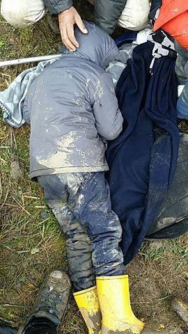

### AYS Daily Digest 27/2/18: People pushed back even in severe conditions
#### Women have systematically been abused by aid workers across Syrian areas in desperate need of help — report / New reports of push backs along the remaining ‘Balkan Route’ / Details on the situation in Turkey / Lawyers oppose detainment on Greek islands / Many calls for help for across Europe / and more news and updates

 \)](assets/a85f021b6c1/1*ZzgQbJDlRuTmpWj_iqqF_w.jpeg)

In the area of the provisional refugee camp in Rome \(Photo: [Baobab Experience](https://www.facebook.com/BaobabExperience/?fref=mentions) \)
#### FEATURE — Violent push backs in the Balkans

“The law has changed\!“ This is what a police officer told to H\. J\. 
As hundreds of migrants in transit who try to reach Western Europe through the Balkans, he was pushed\-back from Croatian territory\. But indeed, something changed — he was dropped on the Bosnian border, not on the Serbian side\.

During this last two years, since the ”Balkan Route“ was closed, all this push\-backs were perpetuated in Serbia, especially around Sid\. Since about one month ago the methods are changing though\. Currently, people caught in Croatia are forced to come back to either Bosnia or Serbia\.

Moreover, we traced many cases of violation of the international protection law as well as the European Law since a safe procedure for asylum seekers is automatically denied\. The arbitrary became the norm, since there are cases of people with asylum card in Bosnia who are pushed back to Serbia, and people who come from Serbia who are pushed back to Bosnia as well\.

Regarding the second example, police drops them usually near Velika Kladuša, the west northest city of Bosnia\. As far as we know thanks to the testimonies of the migrants, there are two points where Croatian police leave them\. One of them is near the border post, and the other one is 20 km North from the city of Velika Kladuš\. Thus, once they are left there, they still have to walk in difficult weather condition to arrive to the first safe place\. In many cases, they did not have the opportunity to sleep, have any kind of appropriate rest or eat for days, mostly because of what they call ”game“, which is the journey through Croatian territory\. 
After being caught, many experienced police violence from physical to verbal, psychological or the combination of all\.

The common examples being ridiculoused “not asylum here, go to Italy“; threatened “If I see you a second time, I’ll kill you“ and all sorts of humiliation strategies\. All this proves that once more EU is outsourcing the borders\.

Velika Kladuša is becoming a new hotspot of the rout\. We estimate that there are around 60/70 people in this city, and the number is increasing\. Nonetheless, more and more people choose this route instead of the Serbian one, where they are stuck for months living in very difficult conditions\. The situation being there is a high probability that if Croatian police keeps on pushing back people as it is now, we might expect that the city of Velika Kladusa will face many new challenges\. So far, local people have been helping migrants providing food, clothes and other necessities: ”They are Muslims, you know? Helping people in need is a pillar of Islam”\.

However, police is trying to jeopardize the established chains of solidarity\. Although many of the migrants are reporting that Bosnian police is not violent, mid February a direction was imposed on mosques from the Islamic Community, which is very closed to local government, forbidding the imams to accommodate the migrants and to provide them with temporary place to rest\. One might think that a higher instance is imposing restrictive measures instead of finding appropriate solutions\.

Actually, the atmosphere differs very much from the one in Serbia, where they are mistreated and even physically aggressed by xenophobic groups from the local community\. On the opposite, inhabitants of Velika Kladuša have hosted many newly arrived migrants empathizing with the given situation\. Some public places, mainly privately\-owned cafeterias, were adapted, despite the obvious unprofitability of such a choice, not to leave the migrants sleeping outdoor\. 
While picturing the situation, do not forget to visualize the extreme weather conditions here\.

> ‘We need help, please, please\. Our legs are really frozen, they can not be too cold\. We need urgent help because She has a child and hurts her, not good\! Thanks for your help\.’ — _this is a start of just one of the calls AYS volunteers keep getting during the nights recently\._ 

Are You Syrious, Center for Peace Studies and Welcome Initiative together with No Name Kitchen are presenting the 4th report on illegal push\-backs from Croatia\. 
**Read more on the cases, reactions of the officials and the report in tomorrow’s AYS Special\.**

#### SYRIA
### Systematic abuse of Syrian women in war zones

An alarming reports and accounts of continuing additional violence towards women in Syrian areas receiving aid are proving that the previous concerns over such pratices did nothing to alarm, worry and push responsibles to react and prevent such things, nor did the molesting stop\.

Although the UN agencies and charities said they had zero tolerance of exploitation and were not aware of any cases of abuse by partner organisations in the region, even the mainstream media is at this point writing about the exploitation that has become so widespread that some Syrian women are refusing to go to distribution centres because people would assume they had offered their bodies for the aid they brought home\.

United Nations Population Fund \(UNFPA\) has published a report on gender based violence in the region last year and concluded that humanitarian assistance was being exchanged for sex in various governorates in Syria\.

> This report provides important insights into the lives of women and girls caught up in the crossfire, providing a valuable guide to help aid agencies in delivering an informed response to gender\-based violence \(GBV\) nationwide\. 
 

> Compared with last year’s report, it is clear that **none of the existing forms of GBV have lessened in their impact** \. Moreover, the higher quality data this year reveal **worrying extensions of negative coping mechanisms such as movement restrictions, marriage, polygamy, survival sex, as women and girls adapt as best they can to the exhaustion of protracted conflict in a society with ingrained patriarchal attitudes** \. By examining each of the different directorates, we can see the vast range in complexities across the country\. 

Take time to read their report [**here**](https://www.humanitarianresponse.info/system/files/documents/files/2017-12_voices_from_syria_2nd_edition.pdf) \.
### No truce in the tortured land

Quickly after the announced cease fire proposed by Russia, bombardment swiftly resumed in several towns in the eastern Ghouta, resulting in 4 deaths in matter of hours, according to the SOHR\.

According to some estimates by the NGOs, approximately 40% of children in the area are suffering from some level of malnutrition and some are suffering from starvation\.

As we wrote previously, the UN Security council voted unanimously in favour of a 30\-day ceasefire across Syria, as rescuers in Ghouta said a week of perpetual bombing had not let up long enough for them to count bodies during one of the bloodiest air assaults of the seven\-year war\. Shortly after the vote, warplanes struck another town in the province\. 
The ceasefire has obviously not been observed in practice\.

Political leaders in France, the US and the UK said they would back targeted military action against Damascus if there were proof chemical weapons had been used by forces under Bashar al\-Assad, so the Organisation for the Prohibition of Chemical Weapons, opened an investigation into attacks in eastern Ghouta to determine whether banned munitions were used, the media [report](https://www.reuters.com/article/us-mideast-crisis-syria-ghouta/russian-truce-plan-fails-to-halt-bombing-of-syrias-ghouta-idUSKCN1GB0LM) \.

> “Clearly the situation on the ground is not such that convoys can go in or medical evacuations can go out” 

— U\.N\. humanitarian spokesman stated this in the morning at the official press conference in Geneva

ICRC Middle East proposed they access eastern Ghouta to deliver help, but they also said humanitarian corridors would have to last longer than just 4 hours and that they have to to be well\-planned and agreed to by all warring sides, while people should be allowed to leave of their own free will\.

> The United Nations says it has run out of words on Syria, but we, the undersigned, still have some for the governments, parliamentarians, electorates, and opinion leaders of the powers upon whom the international legal order has hitherto depended\. — _read more [**here\.**](https://www.nybooks.com/daily/2018/02/27/the-world-must-act-now-on-syria/)_ 

#### TURKEY
### Millions left vulnerable — what is the current situation?

Turkey’s state of emergency and changes to its asylum law have left millions of refugees more vulnerable that ever, [says](https://www.newsdeeply.com/refugees/community/2018/02/27/turkey-between-hospitality-and-hostility) European migration expert Margarite Helena Zoeteweij\-Turhan\.

Previously, [AYS reported](ays-special-turkey-the-only-hope-is-to-return-one-day-1df83003a89b) on the situation of many Syrians in the province of Izmir\. Based on their field experiences, we contacted the EU and several NGOs, who should be/are operating in the region\. We have now conducted some further research to find out more on the commitment to support displaced people in the area\.

“ _Unfortunately I can’t help you there\. In principle we don’t communicate about Turkey”_ was one of the responses we got from a responsible at one of the seven organizations contracted by AYS volunteer, who are funded by DG Echo to the tune of almost 76 million Euros for the years 2016 and 2017\.

Read more in our newest [Special on Turkey\.](ays-special-about-turkey-between-caution-and-intransparency-f8bb8cb0dd)
#### GREECE

Official statistical [data](https://l.facebook.com/l.php?u=http%3A%2F%2Fmindigital.gr%2Fimages%2FNSP_Eastern_Aegean_26.02.pdf&h=ATO4FNxdrJ2b-OwlnFZP2rUb-9q3_SEh56-w9RuWoDBqx81aGCPuq1Q4x8lw_ztIyD8UZqU7vYMrr1XNTdGekjdgt5eLxAJjvCHVJYglBvcFEggp) on registrations/transfers from the Aegean islands as of February 26 documents the following:

Lesvos 0/15
Chios 0/10
Samos 33/89
Kos 32/0
Total 65/114
### Lawyers oppose compulsory detention

> “We refuse to allow our islands to be transformed into prisons with the aim of stopping the flow of migrants to Europe” 

Addressing a joint [pres](http://www.ekathimerini.com/226238/article/ekathimerini/news/island-lawyers-oppose-compulsory-detention-of-migrants) s conference in Athens, lawyers from Chios, Lesvos, Kos, Samos and Rhodes indicated that the detention of migrants on the islands was a violation of both Greek and international law\.
Apart from undermining their dignity, detaining people on the islands has also prevented them from attending the hearings of their asylum claims in Athens\.

 was injured after GD fascist attack against Favela free social center at Piraeus on Sunday](assets/a85f021b6c1/1*CcXT583FIcUGm1lmSEIH1g.jpeg)

lawyer of [\#KillahP](https://www.facebook.com/hashtag/killahp) was injured after GD fascist attack against Favela free social center at Piraeus on Sunday

Around 10 fascists entered the social center unexpectedly and they attacked with sticks, torches and fire the 6 people that were inside at that moment\. 5 comrades went to hospital, between them the most injured was the lawyer of the family of Pavlos Fyssas to whom they opened her head \(all these while there is still going on the trial of Golden Dawn\) \. The fascists shouted: “We will burn you, tonight you will be dead” and while they were leaving they shouted slogans of Golden Dawn\.

There is a big solidarity with “Favela” right now, the attack became quickly a big new all around the mass media and newspapers\. Some predict that the attack was a huge mistake of Golden Dawn that can cost to them a lot, as their trial still goes on and as the party closed recently a lot of their offices around Greece\. This is at least the 3rd time that “Favela” has been targeted and attacked by fascists, in its almost 1 year of existence \(even with explosives in the past, but first time while the place is open\) \. The collective seems to become stronger and stronger each time from the support of the movement and specially of the local groups and the neighborhood, [**Beyond Europe**](https://www.facebook.com/beyondeurope/?hc_ref=ARTUJVBO2TaRpG41f7ERA4XhM9xMMDRzbQP_3SBsNLyRytUqbdVUwfNiq339BMsHxW0&fref=nf) reports\.
### Wrongly accused and imprisoned refugees released

As it turns out, the 3 Erithrean refugees had nothing to do with animal theft\.

A series of evidence suggests that the boys were just found near the cattle, and they fled because they saw the individual follow them, initially waving a wooden pole, and then a gun, with which he shot in the air\.

The three young refugees, staying in Mytilene, aged 21, 23 and 24, are accused of trying to steal animals from the 55\-year\-old man in the area of ​​Moria’s camp on the evening of Wednesday 21 February\. The 55\-year\-old shot at them, resulting also in charges of illegal weapons possesion — for which he was referred to trial on April 2, 2019\. 
In the car of the man in question illegal guns have been found: four hunters guns, a pistol, 156 cartridges of various types, 10 cartridges of 9mm diameter and two improvised wooden bats\. 
Read a thorough report on the situation [**here\.**](http://www.lesvosnews.net/articles/news-categories/astynomiko-reportaz/esteilan-sti-fylaki-apo-lathos-treis-metanastes-nea)
### Hit and run on a refugee minor on Chios

The police of Chios are looking for the driver of the car that hit a small boy in the area of ​​Chalkiouous and ran away, driving off without checking on the boy or behaving in a manner prescribed by the law\. Investigation is under way, Greek media [report](https://astraparis.gr/paresure-traumatise-kai-egkateleipse-aniliko-allodapo/) \.
### Family reunification transfers schedule

[Mobile Info Team](https://www.facebook.com/mobileinfoteam/?hc_ref=ARRFgxFwIyCEB7yBsaev7Y0AE0W2HIGBKiS3TO-CNS92LimpUX8G7O4PTzhmffLn6lM&fref=nf) published:

Recently, the Asylum Services Office published lists of cases they have informed or tried to inform of their scheduled transfers to Germany and other countries in Europe\. The lists will be updated every 15 days and indicates that the transfers department of the Asylum Services Office has tried to contact you\. The list as of now only includes some March and April approvals for family reunification\. If your case number is not on the list, do not panic\! You can check the next list after 15 days\. You can access the updated lists on this page: [http://asylo\.gov\.gr/en/?page\_id=3410](http://asylo.gov.gr/en/?page_id=3410)

Find or forward to your friends information in other languages that you can find on their FB site\.
### Balkan weather report

**The weather forecast for Wednesday 28/02: very to extremely cold**
#### Montenegro

It will be be very cold but predominantly sunny or slightly to moderately cloudy, early in the morning and before noon in the north and east parts of the country it will be more cloudy with locally some snow\. The wind will be generally weak to moderate blowing from variable directions\. The morning temperature will be from \-18 to \-2 while during the day it will be from \-10 to 7 degrees\.
#### Serbia

So far it was very cold in Serbia and it will continue to be so for the rest of the week with the temperatures going down to \-20 degrees and not exceeding the freezing point\. As far as tomorrow is concerned it will be cloudy and very cold, in the morning locally there will be light snow, with a slight increase of the snow cover\. In the afternoon the snowfall will gradually decrease and the clouds will partially clear\. The wind will be weak from variable directions becoming moderate in the afternoon\. In the morning it will be form \-13 to \-8 and during the day — 8 to \-3 degrees\.
#### BiH

Wednesday will be very cold, even extremely cold in some places and mostly sunny in Hercegovina and in the south\-west, in the rest the country it will be cloudy\. Locally some light snow could occasionally fall\. The wind will be weak to moderate blowing from the north and northwest in Bosnia, and in Herzegovina as well\. In the morning the temperature will be from 17 to \-10, in the mountains around \-20, in the south from \-7 to \-2, and during the day from \-8 to 4 degrees\.
#### Croatia

It will be partly sunny and very cold\. In the eastern it will be more cloudy with possibly light snow during the night and in the morning\. The wind will be weak and alongside the coast weak to moderate blowing from the Northwest\. In the morning it will be from \-17 to \-11 degrees, alongside the coast from \-7 to \-1, and touring the day from \-10 to \-5, alongside the coast between \-3 and 3 degrees\.
#### SERBIA

[Refugee Aid Miksalište](https://www.facebook.com/RefugeeAidMiksaliste/?hc_ref=ART5Ie9zZ8AUKcQy6wrZ12kDR2yIQZfoAfRNOimyYjtYlYA2FkM1x7Fdvdbi0rLcgnw&fref=nf&hc_location=group) is calling for new volunteers to work with them:

> We are calling for our old and new volunteers, so we can develop and shape Miksaliste together, as a humanitarian center, where people can feel as pleasantly as possible, and where they can get different kind of help\. Application, with a reason: why you see your self as a volunteer send in inbox\!
 

> We are awaiting you with joy\! 

#### BOSNIA AND HERZEGOVINA
### Officials supposed to be in charge of welcoming warn the \(engaged\) public of the refugees

In spite of the welcoming attitude of the Bosnians who have taken in some of the families into their homes or have made available some of the vacant houses in the area, it seems those who are supposed to be professionals in refugee reception and asylum seekers’ support are the ones in need of help\. 
The officials have warned the citizens to be rather careful when thinking about welcoming the refugees because, as [he put it](https://www.radiosarajevo.ba/vijesti/bosna-i-hercegovina/migranti-baotic-i-mektic/291649) , “we can clearly recognize some of them have an issue with drugs and/or alcohol”\.

According to this official, in the only government run asylum reception centre, they have reduced the number of people by 35 because they needed to renovate the rooms where some of the fights between the residents happened\.

In spite of the fact they themselves have stated — that people from 29 different countries have so far asked for asylum in Bosnia and Herzegovina — it is almost as if the officials seemed to think the people come as a homogenous group who understand each other and are simply heading the same way together, with no problems or burdens that come along and no threats from those who try to use their vulnerable situation on the route to safety\.

The response of the official state has in general been barely present during the current refugee arrivals in Bosnia and Herzegovina, it is still the locals who provide shelter and food for the people\. Apart from a few, not many NGOs are currently involved in systematic aid providing to the people, things are still in the hands of the volunteers\.

Volunteers in Sarajevo now provide help for more than 200 people at the moment, and in the asylum centre that is run by the state,there are currently 89 people\. No new volunteers are currently needed, local Sarajevo volunteers have told us, knowing the city, situation and what can be done\. We will post urgent calls for volunteers if there will be need and ways to contribute in a more permanent way\.

The people are complaining about the lack of food, there is no internet at the asylum seekers’ centre that is on the mountain above the city and it is getting very cold there at the moment \(comparing to the “Siberian \-7 degrees in the western countries, it is getting up to about — 22 there\) \. Those staying in the centre say the conditions are rather good, but the lack of food is what worries them\.
#### ITALY
### Ventimiglia needs help

### A call for help by the solidarity networks [Eufemia — Info&Legal Point](https://www.facebook.com/EufemiaVentimiglia/?fref=mentions) [Progetto20k](https://www.facebook.com/progetto20k/?fref=mentions) [Baobab Experience](https://www.facebook.com/BaobabExperience/?fref=mentions) : we need everyone’s help\!

Not many institutions have thought about preparing emergency plan for the announced weather conditions in the country that would make current reception practices and expecially lives of those on the street extremely difficult\. Therefore, the volunteers ask for help\. Read more [**here**](http://bit.ly/2otVi0t) \.
### Honorary citizens as an initial impulse to better policies

50 children who were born in Italy by non\-Italian parents were given honorary Italian citizenship based on the fact that they were born in Italy to parents holding non\-European citizenship\.
According to the local sources, the mayor of the town of Acquaviva delle Fonti in the southern Italian region of Puglia hopes that a law will be passed to give citizenship to all such children, so that this kind of initiative will not be needed\.

In light of the upcoming italian elections, the Italian Coalition for Freedom and Civil Rights published an overview of each party’s stance on a new law that would seek to reform Italy’s policy on citizenship\.
As [InfoMigrants report](http://www.infomigrants.net/en/post/7779/italian-political-parties-views-on-citizenship-reform) , the reform would transform the current regulations, which pass citizenship on “through blood” to a ‘Ius Soli’ law that recognizes “the right to citizenship for the simple fact of having been born in Italian territory\.” This is also known as “Ius Culturae, through which even those who arrive in Italy before age 12 could get citizenship when they turn 18, if they have attended Italian schools or undertaken professional training in Italy\.” — Read more in their text about the political overview\.
#### FRANCE
### Paris

[Utopia 56](https://www.facebook.com/asso.utopia56/?hc_ref=ARSe0wQ7pp_GY9alAS6tbK935AuYYojTy5H0lhgyxgCJgjX5MyqRoC3vVzZl9pWdT7k&fref=nf) organizes “Grande Braderie Solidaire” at La Cantine du 18\.
For this they will need help with organization, logistics and sales\. 
To help, register \(Name / Surname, E\-Mail address\) on the Doodle:
[https://doodle\.com/poll/vt8kn56s3freb4ks](https://doodle.com/poll/vt8kn56s3freb4ks)
### Calais

The Refugee Women’s Centre are currently supporting around 60 families in Northern France with material items and hygiene products\. There are around 120 children, toddlers and babies in need of a continued supply of nappies and baby products\.

Children with families are currently sleeping in sheltered accommodation centres in the Northern France region, and are dependent on weekly visits to provide vital items for raising a child\.

We are in desperate need of nappies of all sizes, so that we can continue to support those displaced and facing the insurmountable challenge of raising a family in such a destitute situation\.

Please email refugeewomenscentre@gmail\.com if you can bring us nappies to Calais\!

As the weather conditions worsen, more aid and help is needed\.

Calais Action have a variety of projects and collaborations you can support\.
Please see their list of projects and needs [**here**](https://www.facebook.com/calaisaction/posts/1837507722968391?hc_location=ufi) \.

[Care4Calais](https://www.facebook.com/care4calais/?hc_ref=ARRvG9Nb3_F_t4RSWtMz1KrWbqNKUrvEMcIB_1ga5C4GY9gv1jkZS16pR1r1YsCL4Is&fref=nf&hc_location=group) asks for everyone to give a hand or donate:

> We urgently need to get more people as warm as possible\. We are appealing for the following: 

> \* Volunteers to do additional distributions including trips to Paris and Caen 
 

> \* Thermals — especially long johns
 

> \* Joggers \(can be worn under jeans\) 
 

> \* Ski gear \(coats and trousers\)
 

> \* Waterproof trousers 
 

> \* Bivvy bags to help sleeping bags retain heat 
 

> \* Gloves, socks, hats and scarves 
 

> \* Small tents and warm sleeping bags 
 

> \* Coffee, sugar and hot chocolate to take out every day 
 

> \* Funds to buy emergency supplies of all the above 

They also write that the community in Ouistreham have come together to help refugees sleeping outside in this terrible cold\. The Mayor of Colleville has opened a local gym at night to host 140 people, a dozen are staying in the parish hall of Ouistreham and others are staying at the homes of local residents\. Local volunteers and residents have come together to provide food and people are visiting the gym in a show of solidarity\.
### Poorly drafter law

The draft law unveiled in the French cabinet meeting last week is still [under fire](https://www.euractiv.com/section/global-europe/news/serious-shortcomings-in-the-french-draft-law-on-asylum/?utm_term=Autofeed&utm_campaign=Echobox&utm_medium=Social&utm_source=Facebook#link_time=1519756935) , associations view it as an “unbalanced” text which does not address the main issues of the migration problem, such as the European asylum system and, more particularly, the Dublin Regulation\.
#### GERMANY

The Essener Tafel stopped accepting new customers for a limited time now\. They said, that recently some 75% were foreigners/refugees and they don’t have enough food to distribute to everyone in need\. Additionally, the mass of people queuing there, caused tensions\. Volunteers as well as customers complained, that some men were pushing at the entrance and behaving impolite to volunteers\. This caused elderly people and women to stay away from distributons\.

The Tafel now wants to stop accepting new foreigners, until the quota drops to 50%\. Already registered foreigners can still go there\.

Still, Chancellor Angela Merkel criticized the current situation, reportedly saying: “One shouldn’t run services on the basis of such categorizations\. That’s not good\. But it also shows the amount of pressure there is, and how many people are needy\. That’s why I hope they can find good solutions that do not exclude groups\.”
#### UK
### Detained women at a detention centre on hunger strike

As the hunger strike continues at the Yarl’s Wood Immigration Centre, a testimony from a woman who was detained at there some years ago has been published in the [media](http://www.huffingtonpost.co.uk/entry/yarls-wood-detainee-recovery_uk_5a9417abe4b03b55731e3056) \. She describes being forced to work for £1 an hour to raise enough money to get phone credit to ring a solicitor, seeing other women in distress, crying and sometimes screaming at night, self\-harming and failed suicide attempts day and night\. 
Contrary to what the officials keep saying, the women at the centre claim there is no pattern in the circumstances of detainees, only the reasons given by the Home Office\.

> They refused to state that rape is torture and said “no comment” on that matter\. It can be summed up as talking to a brick wall like every other occasion I’ve had to speak with an immigration officer, _one of the detainees [says](https://detainedvoices.com/tag/yarls-wood/) \._ 

T [he hunger strike is happening](https://news.sky.com/story/120-women-on-hunger-strike-in-immigration-centre-11265270) because as fearful as the 120 women are, they are tired of being silenced with a plate of food\.

> Most women in Yarl’s Wood have been through the worst things possible including torture and rape, so the women are already traumatised before they get there\. 

You can sign the petition [here](https://you.38degrees.org.uk/petitions/grant-demands-of-hungerforfreedom-yarl-s-wood-strikers?just_launched=true) to call on the Home Office to grant the protesters demands\. Also, send a letter to you MP outlining what the strikers are calling for\.
### Help reunite refugee families

TheRefugee council is calling on UK residents to urge their MPs to [support a family reunification bill for refugees](https://action.refugeecouncil.org.uk/savethedate/) :

On Friday 16 March 2018 MPs will have the opportunity to support a Refugee Family Reunion Bill that would make vital changes needed to allow more refugee families, torn apart by war and persecution, to be reunited in safety in the UK\. We need to make sure as many MPs as possible take this opportunity by turning up to parliament that day and supporting this Bill\.

**Please write to your MP and ask them to attend the debate and help bring refugee families together\.**

> **We strive to echo correct news from the ground through collaboration and fairness\.** 

> **Every effort has been made to credit organizations and individuals with regard to the supply of information, video, and photo material \(in cases where the source wanted to be accredited\) \. Please notify us regarding corrections\.** 

> **If there’s anything you want to share or comment, contact us through Facebook or write to: [areyousyrious@gmail\.com](mailto:areyousyrious@gmail.com)** 

_Converted [Medium Post](https://medium.com/are-you-syrious/ays-daily-digest-27-2-18-people-pushed-back-even-in-severe-conditions-a85f021b6c1) by [ZMediumToMarkdown](https://github.com/ZhgChgLi/ZMediumToMarkdown)._
