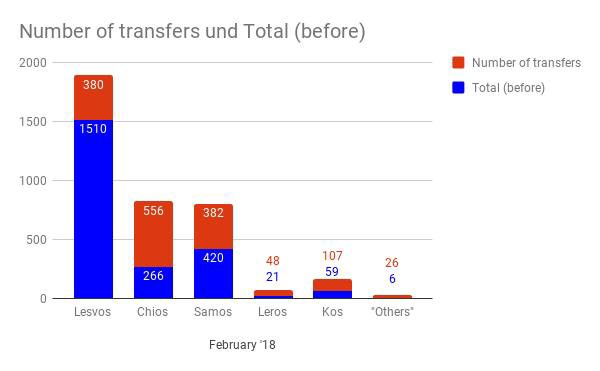
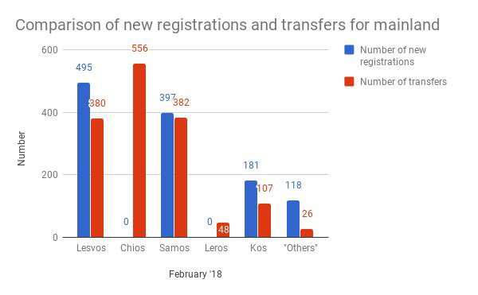
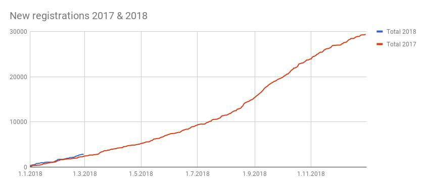
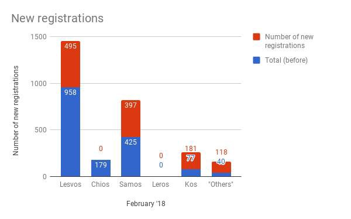
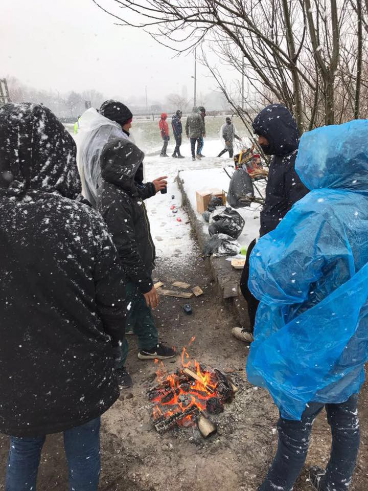
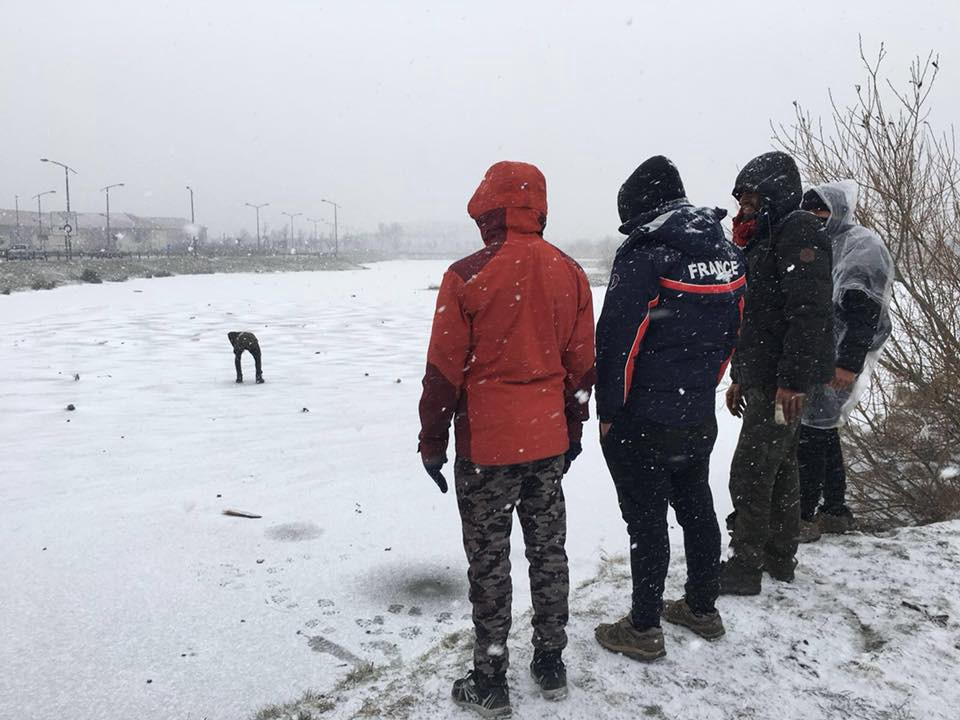

### AYS DAILY DIGEST 2/3/2018: EU — the elite club

Military drones and walls of European Union vs dreams // Bosnia, Montenegro and Albania — new hot spots? // Over 100 new arrivals on Greek islands // Possible restrictions for volunteers in Belgium // And more from France, Germay, Malta, Bulgaria…

And we choose life\. By Ammar Bwidany in \#EasternGhouta, \#SaveGhouta
### Feature

The EU continues to use more money on strengthening borders than on helping people, integration or just meeting the basic needs of those in need\. But, why buy food when you can buy guns and drones and build walls?

While the UN Human Rights Council issued [a statement](http://www.ohchr.org/EN/NewsEvents/Pages/DisplayNews.aspx...) saying that **“increasingly obstructive laws, policies and practices have pushed migrants towards irregular pathways and methods marked by an escalating prevalence of torture and ill\-treatment,”** the EU decided [to equip Frontex](http://stopwapenhandel.org/node/2124) , the EU border guard agency, with two military UAVs \(drones\) for maritime border surveillance in the Mediterranean Sea\.

And while EU leaders are spending money on arming borders, their citizens are on the streets trying to do what states should do — feed people and give them basic shelter\.

Moreover, countries that are ‘not good enough’ — according to EU officials \- to become members of this elite club — such as Serbia, Bosnia, Albania or Montenegro — are obliged to follow the rules given by Brussels and not help people on the move\. What is happening in Albania or Montenegro at the moment is not known, except that hundreds, if not thousands, of people are on the move\. Big organizations such as UNHCR or IOM are present in these ecountries, but even they are giving very limited to no information, in accordance with the EU policy of ignorance\.

All these countries are among not only the poorest in Europe, but among the poorest in the world\. However, the EU idea of help is to send Frontex there and force local authorities to seal borders, while carelessly leaving people on the streets and trapped in the mountains\.

In Bosnia, an EU border country, more people are arriving every day\. The local authorities are among the most corrupt in the world and so far they have shown no interest in helping the people who are coming\. The EU has the biggest office after Brussels in Sarajevo, and the bureaucrats who are present there are ignoring the very visible people sleeping on the streets while it is \-17 degrees C outside\.

On Friday night, a nine\-month pregnant young woman came over the mountains from Montenegro to Bosnia and was placed in the only existing asylum centre\. Food inside the centre is so scarce that those who are living there are sending SOS calls almost every night to local volunteers\. The same happened with this pregnant lady\. Local volunteers brought her food\. They have to bring it in the front of the centre since they are forbidden to enter\. Volunteers will have to do that even in the next period\. The lady is due to give birth on March 4th, and after that, most probably, local volunteers and citizens of Sarajevo will have to take care of this small family\.

The craziest part is that, like the people who are arriving now in Bosnia, the local population also dreams of going to the EU or becoming part of it\. According to some estimates, over the last 10 years more than 150,000 people have left Bosnia to find a job in some of the EU member countries\.
### BALKAN WEATHER REPORT

**Montenegro**

Saturday will be moderately cloudy to cloudy with local rain and possibly thunderstorms along the coast\. During the day it will be mostly dry; rain is expected at the end of the day and during the night\. The wind will be moderate to strong, blowing from the south\. In the morning the temperature will be between 0 and 10 and during the day between 3 and 15 degrees\.

**Serbia** 
The red weather warning that was issued, predicting very dangerous weather, is still in place\. On Saturday morning snow and icy rain are expected\. In the afternoon it will be dry and towards the evening and night, clouds with snow and icy rain will return\. The wind will be weak to moderate from the west and northwest, changing direction to the south\-east at the end of the day and in the evening\. The minimum temperature will be \-3 and the maximum 0 degrees\.

**Bosnia**

Saturday will be mostly cloudy\. In the morning mild snow and sleet are expected\. During the day there will be rain in some parts of the country but also sleet and snow, while more snow will fall in the mountains\. In the morning the wind will be mostly weak, blowing from the south\. In the second half of the day, the southern wind will become moderately strong\. In Krajina, the north and north\-eastern parts of the country, the wind will be from the east and north\-east\. The temperature in the morning will be between \-4 and 8 while during the day it will be between 0 and 13 degrees\.

**Croatia** 
Saturday will be mostly cloudy with occasional precipitation, more frequent in the night of Friday to Saturday and again at the end of the day\. Along the coast there will be rain, while inland it will locally snow followed by rain that may freeze on the ground\. The wind inland will be mostly weak, along the coast moderate from the northwest, and will turn south in the afternoon\. In the morning temperatures will be between \-5 and \-1 inland, and along the coast from 2 to 8 degrees\. During the day it will be between \-2 and 2 inland, and along the coast from 7 to 13 degrees\.
### Greece

Today one boat was picked up by the Greek coast guard north east of Lesvos with 65 people on board\. Another two boats were picked up near Samos, one with 38 people on board and the other one with 43 people\. One boat arrived at Farmakonisi/Leros with 44 people\.

The Turkish Coast Guard stopped five boats with a total of 211 people\.

The total number of new registrations/transfers:

Lesvos 1453/1890 Chios 179/822 Samos 822/802 Leros 0/69 Kos 258/166 Others 158/32 Total 2870/3781 
Total February 1191/1152

AYS
### Italy

On Sunday, March 4th, protests will be held to remember the death of Diakate Youssou, a young man who died on 27th February last year, and another one who was badly injured in the same incident while trying to cross from Italy into Switzerland on the roof of a train\.

“People who die on borders do not die from random accidents: the deaths are a consequence of decisions, laws, ways of making the states that govern us, public representatives\. Would you ever think of entering another country on the roof of a train? To go from one country to another in a plastic raft with your family? Sleep hid in winter on the street? Of course not\. Neither do they and if they do, it is because they are being forced to because of the inhuman and racist attitude of this system, of this West\.”

More info [here](https://www.facebook.com/osservatoriomigranticomo/posts/1159070750894293) \.
### Malta

In 2017, Malta received 1,619 asylum seekers, mostly from Syria, Libya and Somalia, the yearly [AIDA Country Report](http://www.asylumineurope.org/news/14-02-2018/aida-2017-update-malta) states\. Out of this number, 43 people ended up in detention where they stayed 2 or 3 months\. According to the authorities, the average period of detention was 56 days in 2017\.

Additionally, people who were arriving were held in the closed type Initial Reception Centre\. This policy was finally changed in September and now it is an open centre\.
### Bulgaria

In Bulgaria, hardly any positive change in the treatment of asylum seekers has been noticed over the past year\. [AIDA Country Report](http://www.asylumineurope.org/news/13-02-2018/aida-2017-update-bulgaria) documents “persisting obstacles to refugees’ access to a fair asylum procedure and dignified reception conditions”\.

Last year, the government recorded 2,985 apprehensions of people who crossed the borders and registered 3,700 asylum seekers\. At the same time, large\-scale pushbacks at the border continue to be reported\.

Discrimination exists against asylum seekers from Algeria, Bangladesh, Pakistan, Sri Lanka, Turkey and Ukraine with 0 percent recognition rates\. The same goes for people from Afghanistan who were subject to a 1\.5 percent recognition rate even though they are the top nationality among the applicants\.

A number of other issues persist, including lack of interpretation and appropriate communication in the language preferred by the applicant at registration, or poor living conditions in the reception centres, as well as continued and prolonged detention\.
### Hungary

Prime Minister Viktor Orbán continues being racist\. This time, while visiting the city of Miskolc [he said](https://budapestbeacon.com/orban-says-migrants-like-gypsies-migrants-worse-come-outside-hungary/) : “Hungary has two paths that it can choose from: whether it will have a national government, in which case Hungary will not become an immigrant country, or whether George Soros’ people will form the government, in which case Hungary will become an immigrant country\.”
### France

Little improvement on the ground in France\. More people are on the streets, while the weather continues to be very bad, with snow and low temperatures\.

Care4Calais

Volunteers are in the field distributing meals and warm food\. Nevertheless, in Calais, the government announced that they will take care of the distribution of meals starting on March 6\.

As [announced](https://www.la-croix.com/.../A-Calais-lEtat-nourrir...) , the association “Vie active” will be paid to do the work on the ground with about 20 employees\. There will be 2 meals per day, 7 days a week, one in the morning, and one in the afternoon with double portions\. Additionally, there will be a mobile shelter so people are safe from the weather while eating\.

The number of distribution points will be reduced from currently 5 to 2, all outside the city\. Volunteers are warning that this will mean that the 30–80 persons getting their daily meals in the city at the moment, will have to walk about 4 kilometres\.

“The Prefect of Pas\-de\-Calais said they want to avoid the formation of new camps around the distribution sites and the distribution points will be secured by “forces of order”\.

The drinking water stations and mobile toilets currently installed \(and also managed by Vie active\) will remain in place\.

Volunteers will still be present providing other services, and they will maintain the distribution point in Grande\-Synthe where there are about 300 migrants\.

Meanwhile, the snow came to Calais where there are mainly Afghan refugees\.

“Having taken tents, sleeping bags and snug packs on our last visit, we took thermal packs along with warm hoodies and t\-shirts so the refugees could layer up properly against the cold\. We also had a large amount of firewood, and made hot tea and coffee which we served with freshly made flapjacks,” a Care4Calais activist repors\.

There are currently [40 minors living](https://actu.fr/.../quarantaine-mineurs-isoles-rue-rouen...) in the streets of Rouen in France, according to Médecins du Monde in Rouen, who runs a day centre for teenagers\. They are between 15 and 16 years old, and none of them has been taken care of by the child protection service \(ASE in France\) \. They said they were rejected because ASE didn’t believe they were minors, although one of them even presented an official document with his birthdate\.
### Belgium

Citizens in Belgium have provided shelter to a large number of refugees, in many cases taking them into their homes\. However, the government has announced the possibility of changing the law that allows its citizens to take in refugees\.

Legislators are debating measures that would allow police to search the private homes of families suspected of sheltering migrants\. The Federal Government argues that the proposed amendment is necessary in order to enforce existing laws\.

Citizens have been protesting the whole week against this proposal, calling on the authorities to adopt a more ‘humane’ approach in their migration policy\. So far the only response they have received is the introduction of stricter measures and policing to limit the influx of refugees as well as to halt their progress into the UK\. Read an interesting analysis on this issue from [InfoMigrants](http://www.infomigrants.net/en/post/7843/belgium-in-a-bind-on-refugees) \.
### Germany

Parliament has voted to [suspend family reunions](https://de.reuters.com/.../deutschland-fl-chtlinge...) for subsidiary protection status until the middle of the year\.

[Pro Asyl](https://www.proasyl.de/.../der-dublin-irrsinn.../) has published an analysis of the Dublin procedure in Germany according to which 18\.7 percent of asylum requests were not decided in Germany, but treated as “Dublin procedure”, which means the country where the refugee set foot first \(and left his fingerprints\), was asked to take over the case\. In numbers, this happened 64,267 times in Germany last year\.

In almost 47,000 cases, the other country agreed to take back the refugees, but only 7,102 persons were really transferred back, mostly to Italy\.

For the humans behind these “cases”, this means years of living in uncertainty and fear\. Some are saved by church asylum or court decisions, others are deported in the end\. Often to countries which have no fair asylum procedures, where they have been arrested, detained and mistreated, such as in Eastern Europe, or where they have to live on the streets like in Italy\.

Greece has refused to take back refugees from Germany, which has made 2,312 resettlement requests\. According to the German Agency for Migration and Refugees, a total of 2,735 refugees and migrants currently living in Germany should return to Greece, based on the Dublin Treaty\.

> **We strive to echo correct news from the ground through collaboration and fairness\.** 

> **If there’s anything you want to share or comment, contact us through Facebook or write to: areyousyrious@gmail\.com** 

_Converted [Medium Post](https://medium.com/are-you-syrious/ays-daily-digest-2-3-2018-eu-the-elite-club-1ed197ef5504) by [ZMediumToMarkdown](https://github.com/ZhgChgLi/ZMediumToMarkdown)._
