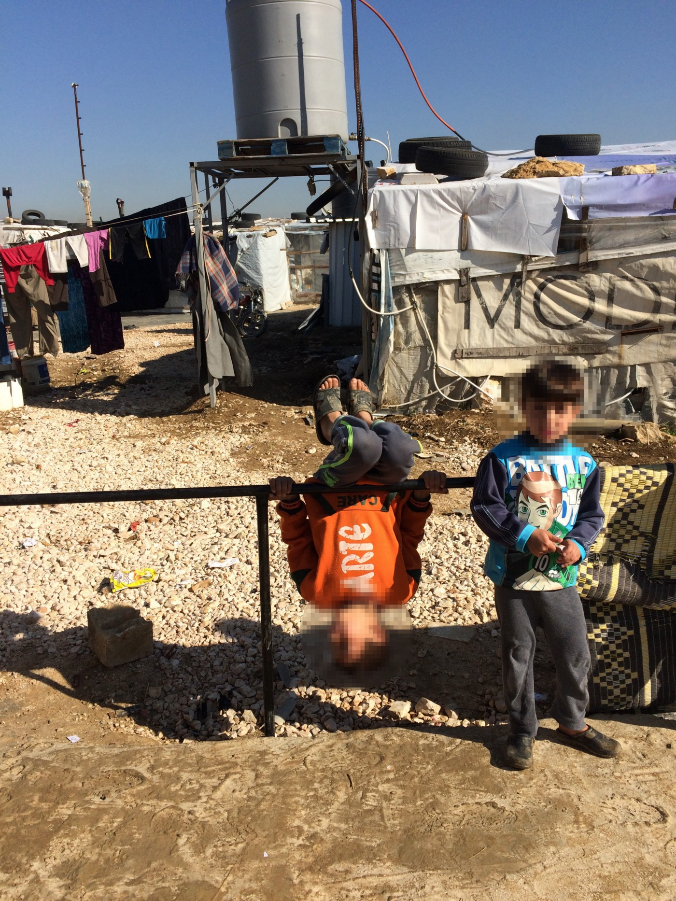
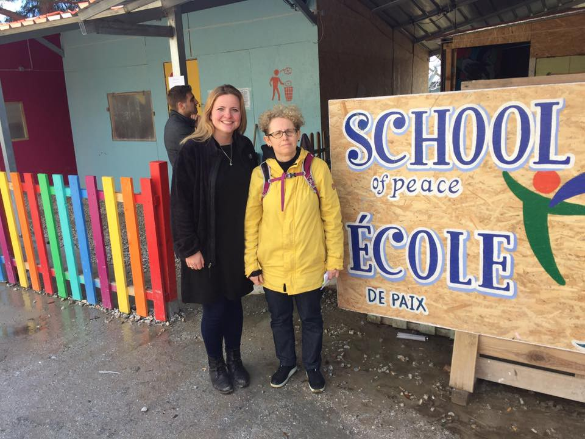
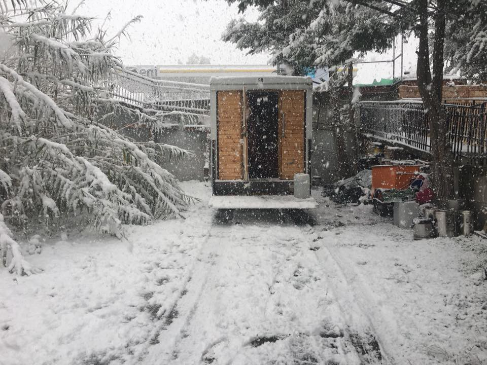
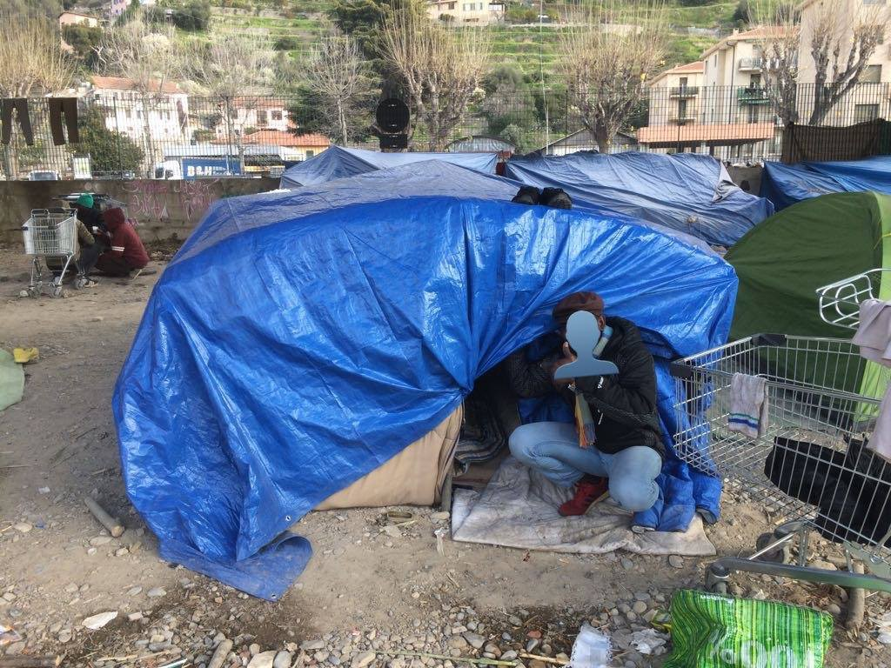
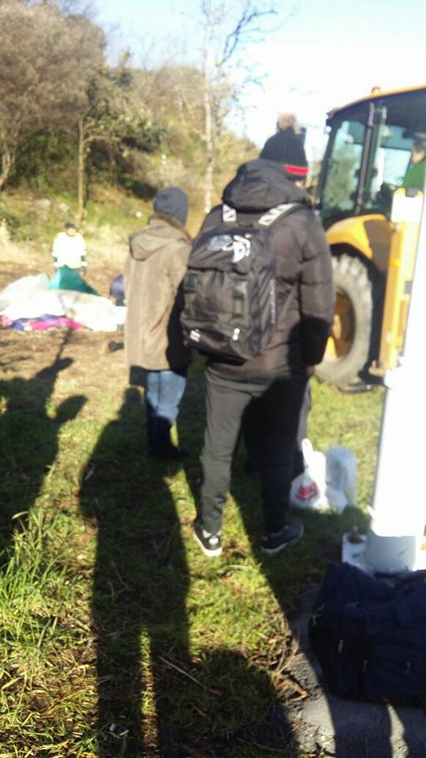

### AYS Daily Digest 04/03/18: Don’t forget the most innocent victims of the war

_Will or will not the UN deliver aid in Ghouta? / Yemenis suffer in silence / Information about procedures in Turkey / Free the Moria 35\! / Update from SolidariTea in Ventimiglia / Hunger strike in Yarl’s Wood continues / And more news from Austria, Sweden, and Spain…_

Syrian children are playing in a settlement in Lebanon’s Beqaa Valley, January 2018 \(Photo by AYS\)
### FEATURE

Children without proper shoes and jackets far too thin\. Children with untreated diseases who have missed out on a year of their education\. Children standing in front of you in Greece, Lebanon, Serbia, Germany, Austria, and many other countries… with big eyes and smiling faces\. Sometimes though, there is also something sad or even aggressive in their behaviour, a product of unprocessed traumas or the ongoing trauma of being stuck in a refugee camp somewhere that is not a home—especially not a home for kids\.

A horrible thought crosses your mind time after time: “Dear little friend, what kind of future do you have?”

Children are at risk everywhere along the refugee route\. It is no news, but still heartbreaking\. In 2017 alone, 29,000 children came to Europe as refugees\. 14,800 of them came by themselves—without their parents or guardians\. Children are arriving to Spain, Italy, Bulgaria, and Greece, the largest entry points for all those arriving in Europe\.

But, not all children will reach Europe\. In Lebanon, Jordan, Iraq, and Turkey, there remain millions of children, many of whom have missed out of significant chunks of their schooling\. Many others are forced to work\. In Lebanon alone, there are over half a million children\. Geert Cappelaere, UNICEF Regional Director for the Middle East and North Africa, recently said that Syria is one of the most dangerous places in the world for children\. But he also stressed something else: the big burden the neighbouring countries have taken\. Over 2\.6 million children live as refugees in Turkey, Lebanon, Jordan, Iraq, and Egypt\.

Voting for restrictions in the asylum processes across Europe is tantamount to telling the children—those without proper shoes, the ones stuck on the other side of everything—that the future isn’t for them\. As long as eastern Ghouta, Yemen, Iraq, and Afghanistan stand as stark examples of hell on earth, future generations depend on us\. What we do here and now will have long gone consequences for millions of vulnerable children across Europe and beyond\.

Don’t forget those who can’t speak that loudly for themselves, yet\.
### GENERAL
#### Undergraduate scholarship program for displaced Syrians\!

Under the program, students will receive full tuition, housing, travel costs, and living assistance while they are pursuing an undergraduate exam at Columbia University\. For more information about the procedure and application, follow [this link\.](https://www.facebook.com/george.batah/posts/10156269673542235?hc_location=ufi)

To participate in the program recently launched by Columbia University, the applicant must be displaced from Syria and currently living in Lebanon, Jordan, or Turkey\. The program is also open for people who live in the United States and has a status as “Temporary Protected\.”
### SYRIA
#### **UN will \(or will not?\)** deliver aid

As we reported in yesterday’s feature, the UN is planning on delivering aid in eastern Ghouta tomorrow\. [The delivery](https://reliefweb.int/report/syrian-arab-republic/un-and-partners-plan-deliver-humanitarian-assistance-eastern-ghouta-enar) will consist of 46 truckloads of aid, including healthcare, food, and other nutrition supplies\. Hopefully, if everything goes as it’s planned, 27,500 people will benefit from the delivery\. The convoy will, if successful, be followed by more aid deliveries\. The UN and its partners have up until now received approval to provide assistance for 70,000 people living in the province of Douma\.

The next delivery \(that is, after the one tomorrow on the 5th of March\), is planned three days later, on the 8th of March\. [So far in 2018,](https://reliefweb.int/report/syrian-arab-republic/un-and-partners-plan-deliver-humanitarian-assistance-eastern-ghouta-enar) the only aid that has reached eastern Ghouta was when 7,200 people received a shipment in Nashabiyah as long ago as February 14th\.

Contradictory information: [Middle East Monitor](https://www.middleeastmonitor.com/20180304-un-says-aid-convoy-not-going-to-syrias-ghouta-as-planned/) reports that the UN convoy is delayed due to the situation in Ghouta\. They will, according to an article published today, Sunday, have to postpone the much needed aid due to bombings and ongoing atrocities\. 400,000 people are waiting in the besieged Damascus enclave\.
#### Eastern Ghouta on fire

A fire broke out in eastern Ghouta after massive bombardments in Hamouriya\. The White Helmets managed to get it under control, as far as that is possible in this region at this point\.

■■■■■■■■■■■■■■ 
> **[The White Helmets](https://twitter.com/SyriaCivilDef) @ Twitter Says:** 

> > Firefighter teams in @[SyriaCivilDefe](https://twitter.com/SyriaCivilDefe) managed to extinguish a fire that broke out after massive bombing on #Hamouriya city in #EastGhouta.
#SaveGhouta #Syria 4 Mar https://t.co/RMt6eEEPvR 

> **Tweeted at [2018-03-04 10:17:54](https://twitter.com/syriacivildef/status/970241918675443712).** 

■■■■■■■■■■■■■■ 

### YEMEN

[The ongoing war](https://www.humanitarianresponse.info/system/files/documents/files/yemen_nutrition_cluster_gam_rate_classification_as_february_2018.pdf) in Yemen has left a lot of people without necessities such as food, water, and healthcare\. This map shows the situation in the different regions\. In the red areas—the lion’s share of the map—the situation is classified as critical\. The situation in Yemen is not as widely discussed as in Syria, but also amounts to an egregious humanitarian disaster\. It remains especially hard to get information from Yemen due to the ongoing security situation\.

](assets/d84f5d6f194d/1*VYxsm-XSrSpkqipdvLQjrw.jpeg)

Infographic by [Humanitarian Response](https://www.humanitarianresponse.info/system/files/documents/files/yemen_nutrition_cluster_gam_rate_classification_as_february_2018.pdf)
### TURKEY

[RefuComm](https://www.facebook.com/refucomm/?hc_ref=ARToETr5oMWQVASSUeVUoSerT4R43_S42JC-sqrzh9ja8XP55kHRJcdAvLMARtZFINM&fref=nf&hc_location=group) released information about the procedures for people stuck in Turkey\. The knowledge about practices there is low, and have led to some questions\. If this could be relevant for you or a friend, [read more here\.](https://www.facebook.com/notes/refucomm/information-resources-for-turkey/574481409570332/) Information is available in both English and Arabic\.
### SEA

Last night, 72 people were transferred to MSF’s rescue ship _Aquarius_ \. [Onboard the ship](https://twitter.com/msf_sea/status/970307549168848896?s=21) , stories of lost relatives and friends were told by the rescued people, who all had fled through the violent and dangerous route in Libya\.

[SOS MEDITERRANEE GER‏](https://twitter.com/SOSMedGermany) writes [that 30 of the rescued](https://twitter.com/sosmedgermany/status/970314176475336704?s=21) 72 persons had been on a sinking wooden boat, and 42 of them were found on a rubber boat intercepted in international waters by the Libyan Coast Guard before being safely taken onboard _Aquarius_ \.

■■■■■■■■■■■■■■ 
> **[MSF Sea](https://twitter.com/MSF_Sea) @ Twitter Says:** 

> > Last night the #Aquarius took a transfer of 72 people on board who were rescued by a merchant vessel from two separate boats. https://t.co/J0VbI8jiEX 

> **Tweeted at [2018-03-04 14:31:23](https://twitter.com/msf_sea/status/970305709068910593).** 

■■■■■■■■■■■■■■ 

[Proactiva Open Arms](https://www.facebook.com/proactivaservice/?hc_ref=ARQ-AGnE4KtNgBfdImpgl0BkATJUJicy66Lt68G_DCVf8FNoXLwguxArqREmBAzfBX4) was also at sea, as the photos shows\.

](assets/d84f5d6f194d/1*RwGtm6SWuagzLy8TtS7y3g.jpeg)

Photo by [Proactiva Open Arms](https://www.facebook.com/proactivaservice/?hc_ref=ARQ-AGnE4KtNgBfdImpgl0BkATJUJicy66Lt68G_DCVf8FNoXLwguxArqREmBAzfBX4)
### GREECE
#### **Lesbos: Free the Moria 35\!**

On the 18th of July 2017, prisoners in Moria held a peaceful protest outside of European Asylum Support Office\. Their demand was simple: freedom of movement for everyone who has been trapped on the island for more than six months, and humane living conditions\. All of the 35 people arrested and accused of crimes, seem to be chosen out of coincidence\. They are also accused for exactly the same crimes\. During the arrest, the police used more violence than needed including teargas\. One of the accused refugees was taken to hospital where he had to stay for a week\.

To give everyone a chance, Legal Center Lesbos is crowdfunding in order to be able to provide the legal support needed for the trials\. They are running out of time, so [HELP THEM HERE, NOW\.](https://www.justgiving.com/fundraising/justice-for-the-moria-35)
#### **Poor food**

[Refugee Relief](https://www.facebook.com/refugeereliefsweden/?hc_ref=ARSWpDwBEVsLM-SSKnHE9cUfDc2ENL3HljAqUJDDwun-nN0l0xkaOSYPQHP4pbl2TBM) recently released a report about poor food\. [One of their board members](https://www.facebook.com/refugeereliefsweden/photos/pcb.538623306524946/538623269858283/?type=3&theater) visited the island and heard complaint after complaint about the bad food that those there are forced to eat day after day, month after month\.

If you have the application Swish, you can Swish money straight to [Refugee Relief](https://www.facebook.com/refugeereliefsweden/?hc_ref=ARSWpDwBEVsLM-SSKnHE9cUfDc2ENL3HljAqUJDDwun-nN0l0xkaOSYPQHP4pbl2TBM) on the number: 1235 444 625

](assets/d84f5d6f194d/1*yT_iKmR3FWDABHU5DJKVDw.jpeg)

Photo by [Refugee Relief](https://www.facebook.com/refugeereliefsweden/?hc_ref=ARSWpDwBEVsLM-SSKnHE9cUfDc2ENL3HljAqUJDDwun-nN0l0xkaOSYPQHP4pbl2TBM)
#### **Translators needed\!**

[ERCI — Emergency Response Centre International](https://www.facebook.com/ercintl/?hc_ref=ARRKItxG0O0uxeLtiAMHcITJzMwkgzUOnQmc2RGCOojXKP3HGkYSe5X6BLMyuUvwTvw&fref=nf) are currently searching for translators\. If you can commit for a while during the spring, more information is [available here\.](https://www.facebook.com/ercintl/photos/a.417332345133189.1073741828.415073442025746/774219592777794/?type=3&theater)

](assets/d84f5d6f194d/1*RW1gN_BRKPmZLZI0RXYZvQ.png)

Photo: [**ERCI — Emergency Response Centre International**](https://www.facebook.com/ercintl/?hc_ref=ARRKItxG0O0uxeLtiAMHcITJzMwkgzUOnQmc2RGCOojXKP3HGkYSe5X6BLMyuUvwTvw&fref=nf)
#### **Samos**

The Vial camp on Samos is in terrible shape\. This is Europe 2018: despite all the \(empty\) promises about “no tents” and human rights for everyone in Europe 2016, 2017, and 2018\.

### Balkan weather report

**Montenegro**

Monday will moderately cloudy to cloudy, in the morning it will be mostly sunny, with in the afternoon and especially during the night light to moderate rain\. The wind will be moderate to to strong blowing from the east\. In the morning the temperature will be from 0 to 11 add during the day from 7 to 17 degrees\.

**Serbia**

In the morning there will be light to moderate frost and dry during the most part of the day especially during the sunny periods\. Towards the end of the day there will be cloud formations and rain in the southwest of the country\. In the mountains it will be windy\. The temperatures will be ranging from a minimum of 3 to a maximum of 15 degrees\.

**Bosnia**

On Monday new cloud formations from the south carrying rain are expected, while in Krajina and in the mountains snow is possible\. During the morning there will be light and in the afternoon more heavy precipitation\. The wind will be weak blowing from the east and north\-east, changing directions to south towards the end of the day\. In the morning the temperatures will be from \-2 and 8 and during the day from 0 to 14 degrees\.

**Croatia**

It will be predominantly cloudy with locally precipitation mostly in the coastal regions\. There will be rain alongside the coast, in the mountains there will be snow and especially in Lika rain that will freeze on the cold ground is possible\. From the afternoon snow and icy rain will spread out over the most part of the country leaving only the far east dry\. Land inwards there will be fog\. The wind will be weak to moderate from the east and from the south, depending on which part of the country you’re in\. In the morning the temperature will be generally from \-5 to 9 and and during the day from 0 to 15 degrees\.
### ITALY

After five months in Ventimiglia, the team behind SolidariTea will take a break\. When the winter ebbs out, as they describe it, it will be time for them to leave Ventimiglia\. After a rough winter, there has lately been a lot of successful border crossings\. But, this is not the end for SolidariTea, it is just a break\. They are looking for someone who can take over and dedicate at least three months to making tea for those in need\. [A more detailed post can be read here\.](https://www.facebook.com/refugeesolidaritea/posts/1286173014817785)

Photos by SolidariTea in Ventiiglia
### FRANCE

Calais was cold and rainy today, according to [Care4Calais](https://www.facebook.com/care4calais/?hc_ref=ARQ0HweWvEoU6za7xMOoDMl49VyQu-G_BRO48plevJ8YjRdBebbYfGwogT-vof6-ezo&fref=nf) \. It was pouring all day, they write in an update on Facebook\. Follow [this link](https://www.facebook.com/care4calais/photos/a.1047087828657507.1073741832.1046117708754519/1842496055783343/?type=3&theater) for more information\.

](assets/d84f5d6f194d/1*BTFNAnJZuE9nVyXzcWguJQ.jpeg)

Photo by [Care4Calais](https://www.facebook.com/care4calais/?hc_ref=ARQ0HweWvEoU6za7xMOoDMl49VyQu-G_BRO48plevJ8YjRdBebbYfGwogT-vof6-ezo&fref=nf)
### SPAIN

In Bilbao there is a camp next to the sea where refugees try to get on board of ships to the UK\. [Bienvenidos Refugiados — España](https://www.facebook.com/BienvenidosRefugiados/?ref=gs&hc_ref=ARQmaBbaNMgznWnk3GlpTTvPGwO-z8TAgIkOeiDIv0sYhZAUZnYFHAYHcnhq56Wa0Ho&fref=gs&dti=1652972374920129&hc_location=group) is there lending a hand\.

](assets/d84f5d6f194d/1*dG-B7SmW4yfIrknOd-wjkg.jpeg)

Photos by [Bienvenidos Refugiados — España](https://www.facebook.com/BienvenidosRefugiados/?ref=gs&hc_ref=ARQmaBbaNMgznWnk3GlpTTvPGwO-z8TAgIkOeiDIv0sYhZAUZnYFHAYHcnhq56Wa0Ho&fref=gs&dti=1652972374920129&hc_location=group)
### AUSTRIA

[A Syrian family in Austria](http://m.bvz.at/oberwart/mohammads-zwangsabschiebungder-oberwarter-fluechtlingsfamilie-familie-mohammads-zwangabschiebung-oberwart/80.865.211#4462983,80865955) was taken into detention to be deported to Bulgaria on Tuesday, where the children have been maltreated\.

The family are stateless Kurds who used to live in Syria\. The father earlier was in Sweden, where his parents have had citizenship for 10 years\. He was denied the right to family reunion and to stay in the northern country, and was deported to Bulgaria\. This is the second time he is deported to Bulgaria, this time accompanied by his family, including children\.

[Sign this petition](https://l.facebook.com/l.php?u=https%3A%2F%2Fwww.change.org%2Fp%2Fkinderrechte-wie-unantastbar-sind-unsere%2Fu%2F22028301&h=ATOxW-1jRFAU9D4_w5WdVp1auhw2MFs1qVKDdMBvbtFfL6oHw2fP7KYZcdIlTSYwFfPyNDJoyicYnQtknr1bJvVK3NjzQVB2mX5nBDWm24whi47rZxc12vgw) to try and stop the deportation\.
### UK

The hungerstrike in Yarl’s Wood, as we wrote about in the digest the 27th of February, [is still ongoing](https://helprefugees.org/yarls-wood-hunger-strike/) \. The 120 women who are striking are determined—they will not eat until there is a change\. They have had enough of ill\-treatment and inhumanity\. Many of the women are survivors of various kinds of gender\-based violence, not excluding rape\. [The facility in Yarl’s Wood](https://helprefugees.org/yarls-wood-hunger-strike/) usually hosts around 400 people, mainly women, due to “logistical reasons” during their asylum procedure\.

[One of the detainees is 27 years old Opelo Kgari](http://www.independent.co.uk/news/uk/home-news/opelo-kgari-deported-home-office-botswana-yarls-wood-immigration-florence-heathrow-a8238401.html) , who came to the UK from Botswana when she was 13\. Despite the fact that she has been living more than half of her life in UK, she and her 55 year old mother got the information that they should be deported and transferred to Heathrow only days after Kgari spoke out about the ill\-treatment in Yarl’s Wood\. With only minutes left, their lawyer and MPs managed to stop the deportation\.

](assets/d84f5d6f194d/1*CQnKx9EKx4C73UXxikG5NQ.jpeg)

Photo: [**Detained Voices**](https://www.facebook.com/detainedvoices/?hc_ref=ARQPCZzYPieVEB6W4pJhd0AumOLVeu8uqA6RprorpS42TDxSvPIELNp1xJE8kaGQpNU&fref=nf)
### SWEDEN

One of the safest countries when it comes to legal systems and fair procedures? In that case, it doesn’t look good worldwide\.
#### Unsafe asylum procedures

[The Migration Agency acknowledges](https://www.hd.se/2018-03-04/migrationsverket-medger-tusentals-asylbeslut-bygger-pa-daligt-underlag) that many asylum decisions are based on insufficient evidence\. They admit that there could be THOUSANDS of cases, or as we call them, people, affected\.

Every fifth asylum inquiry at the Swedish Migration Board is inadequate\. Every sixth decision is so badly written that it is incomprehensible\. Thousands of life\-determining decisions are thus taken on bad grounds\.

“We see serious quality deficiencies,” says Ulrika Geijer, the chief executive officer at the Migration Court in Malmö\.
#### Widely discussed and unsafe age exams

[Two professors](https://www.svd.se/professorer-om-siffror-bakom-alderstester-de-har-raknat-fel) in statistics judge calculations that were central to the choice of method for medical age assessments of asylum seekers\. They have found “amazing mistakes and mistakes\.”

“They have been wrong and they are thinking wrong,” says professor Johan Bring\.

New criticism is aimed towards the already oft\-debated medical age exams\. According to the two authors, the basis of the method isn’t correct\. They claim that the method is based on material with serious shortcomings\. The topic of age exams has been widely discussed in Swedish media, and both those who are for and against the exams are arguing loudly for their sake\.

Earlier, the paper [Expressen](https://www.expressen.se/nyheter/larmet-17-av-20-alders-bedomningar-stammer-inte/) wrote that 17 out of 20 exams are wrong\.

[According to a staff member from the Migration Agency](https://www.svd.se/aldersbedomningar-gor-att-fler-anses-vara-barn) quoted in the paper Svenska Dagbladet, 430 children, who claimed they were over 18, got their age written down to under 18\. “You can only win on this,” he told the paper\.

But, [according to SVT it is the opposite,](https://www.svt.se/nyheter/inrikes/forsta-medicinska-aldersbedomningar-klara-majoriteten-bedoms-aldre-an-18-ar) the majority of those who had been tested as of the 30th of May 2017 \(which was the first statistics after the implementation\) were over 18\.

The exams were implemented in 2017, and consists of x\-rays of teeth and the knee\-joint\. If the x\-rays shows different results, the result showing the older age is used since it, according to doctors and staff with “knowledge” about the method, is more likely to be correct\.

Most important though, is that young people feel the need to lie about their age, not that they are doing it as a last, desperate way to remain safe\.

**Every effort has been made to credit organizations and individuals with regard to the supply of information, video, and photo material \(in cases where the source wanted to be accredited\) \. Please notify us regarding corrections\.**

**If there’s anything you want to share or comment, contact us through Facebook or write to: areyousyrious@gmail\.com**

_Converted [Medium Post](https://medium.com/are-you-syrious/ays-daily-digest-4-3-18-dont-forget-the-most-innocent-victims-of-the-war-d84f5d6f194d) by [ZMediumToMarkdown](https://github.com/ZhgChgLi/ZMediumToMarkdown)._
