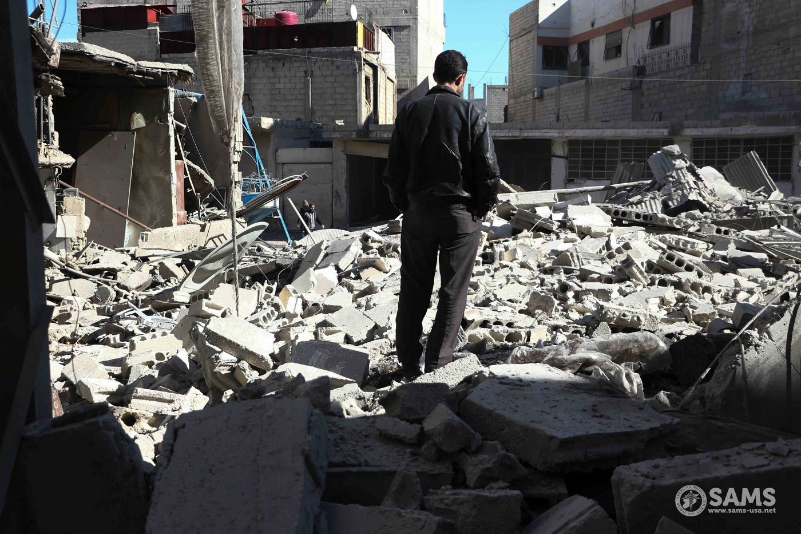
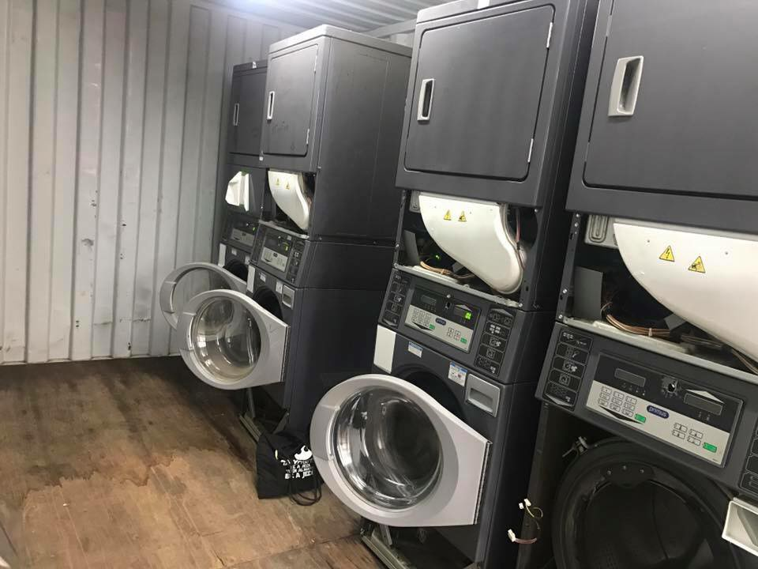
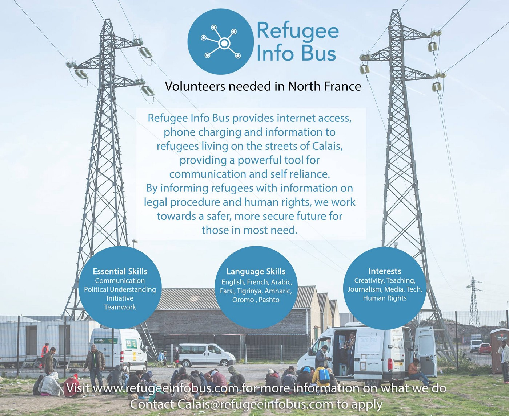
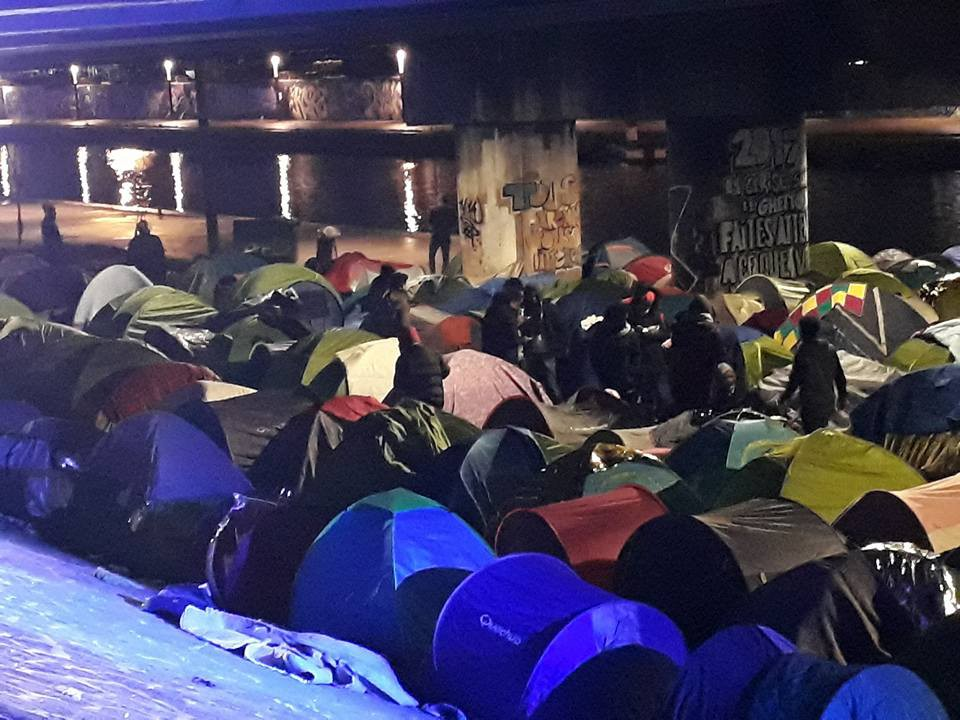

### AYS Daily Digest 5/3/18: Are we still allowed to ever pronounce “human rights”?
#### An attempt of humanitarian convoy leaves Eastern Ghouta in misery as before / Amnesty calls out the Greek Government for Samos / Translators, dentists, councilors and other volunteers needed in Greece, help needed in Bosnia and Herzegovina/ A man killed in the centre of Florence, Italy / Violent push backs by the officials in Spain / More info and news from across Europe

“In this photo from Abdulmonam Eassa/SAMS, a resident of East Ghouta stands in the detritus of destroyed homes\.”
#### SYRIA

> The government authorities had removed most medical material from UN vehicles, preventing surgical kits, insulin, dialysis equipment and other supplies from reaching the enclave of 400,000 people\. 

As many as 770 civilians were killed during the Syrian regime attacks on the rebel\-held Eastern Ghouta between 19 February and 3 March\. A small convoy that had previously gotten approval to arrive in Eastern Ghouta to assist the helpless people who are stranded there, being perhaps the only help for many at this moment, will not be providing the much needed help\. 
“All trauma \(kits\), surgical, dialysis sessions and insulin were rejected by security,” a WHO official said by email, adding that some 70 percent of the supplies loaded on its trucks leaving its warehouses had been removed during the inspection, it is [reported](https://www.reuters.com/article/us-ethiopia-politics/ethiopia-ruling-coalition-to-nominate-new-prime-minister-idUSKBN1GH2B5) \.

■■■■■■■■■■■■■■ 
> **[Sajjad Malik](https://twitter.com/malik_sajjad) @ Twitter Says:** 

> > HAPPENING NOW @[UN](https://twitter.com/UN) @[ICRC_sy](https://twitter.com/ICRC_sy) @[SYRedCrescent](https://twitter.com/SYRedCrescent) aid convoy to #EasternGhouta exiting #Duma after nearly 9 hours. We delivered as much as we could amidst shelling. Civilians are caught in a tragic situation. https://t.co/P4Djg75XRX 

> **Tweeted at [2018-03-05 18:51:33](https://twitter.com/malik_sajjad/status/970733573035757569).** 

■■■■■■■■■■■■■■ 

French President Emmanuel Macron [called](http://en.rfi.fr/middle-east/20180304-macron-urges-tehran-pressure-syria-halt-eastern-ghouta-offensive) on the Iranian president on Sunday to put the “necessary pressure” on the Syrian government to halt “indiscriminate” attacks on civilians in the rebel\-held enclave of Eastern Ghouta\. So far, no concrete news has reached wider public regarding a result of it\.
The government has been pressing on with a deadly offensive on its people , despite Western calls for it to abide by a 30\-day, countrywide ceasefire demanded by the UN Security Council\. The United Nations has called for a 30\-day ceasefire in Eastern Ghouta, but so far regime\-backer Russia has declared only a five\-hour daily “humanitarian pause” \(sic\) \.

> The circumstances around this aid delivery bring into sharp focus the outrageous disregard for civilian life in East Ghouta\. 

> Throughout the aid delivery, shelling continued relentlessly\. 89 people have been killed in airstrikes and shelling today, including Dr\. Ahmad Wahbah, a dentist who was married with children\. This is the highest death toll in a day since the UN Resolution was passed on February 24th\. 

> On the same day, we received reports from a doctor in Hamourieh describing the use of a chemical gas in the area\. The doctor’s medical facility reportedly treated 12 patients for symptoms consistent with chlorine exposure\. This would be the 198th use of a chemical weapon in Syria since 2012, and the 8th in 2018\. — [_SAMS_](https://www.facebook.com/SyrianAmericanMedicalSociety/?hc_ref=ARTsx87c_UQ0x6IG1ISL_4eaclzEyzlLo7lBC6MJoCeT7cFvbgIQlZVCy54-gaRCLME&fref=nf) 

Some have also formed concrete questions, following the reports after an \(unsuccessful\) aid convoy by the UN, inviting everyone to press the responsible officials with these demands:

> _\- How many of the population will they be able to support in this “one time” aid convoy?_ 

> _\- If their presence inside Ghouta ensure less bombardment on civilians, then why don’t they stay in?_ 

> _\- Why there is no medicine and medical equipment? And what they are going to do about it?_ 

> _\- When is their next convoy will be? Before or after someone dies from hunger or lack of medication?_ 

> _\- There are more than 1000 urgent medical cases that needs evacuation, are they going to take them out to be treated safely?_ 

#### TURKEY

[Aegean Boat Report](https://www.facebook.com/AegeanBoatReport/?hc_ref=ARRUlKdADfX1cyA2UdPHZnGStaTQVj8GUIUmU_910NRqUzaaZ0vnyudvSkPgD2lk5bE&hc_location=group) reported this weekend a total of 9 boats have been stopped by TCG on its way towards Greece, with a total of 398 people\.

Lesvos north 1 Boat, 34 people\. 
Lesvos south 3 boats, 149 people\.
Samos 2 boats, 103 people\.
Kos 2 boats, 86 people\.
Farmakonisi 1 boat, 26 people\.
### Volunteer in Turkey

Imece undertakes a mobile education project right in the unofficial camps\.
They also distribute baby and hygiene supplies to refugees in camps\. They plan to build up a recreation and education village for refugee women and children staying in the area and you can take part in it\.

They are seeking preferably for long term volunteers, but any time frame down to 2 weeks is accepted\. 
Accommodation and catering are supplied for 5 € per night\.

> For short term from now till March \( any time frame down to 1 week is accepted \)
 

> We are searching volunteers for
 

> \- building, carpenting, technicians
 

> \- \(ecological\) agriculture
 

> \- kindergarten teaching/ child care 

> For long term \( minimum 2 weeks \)
 

> We are searching volunteers for
 

> \- kindergarten teaching/ child care 
 

> \- \(ecological\) agriculture
 

> \-building, carpenting, technicians 

Read [here](http://shouldibringmyrope.com/…/volunteering-with-refugees…/ https://aspeechlessstoryteller.wordpress.com/…/my-experien…/) more about the experiences from our former volunteers\. 
If you are interested in volunteering, please leave a pm to [the page](https://www.facebook.com/imeceinisiyatifi/) and you will receive further information of the team\.
#### GREECE
### Samos

Amnesty International called on the government and the new migration minister on Monday to upgrade basic services and improve safety for single women and unaccompanied children at Vathy, it was [reported](http://www.ekathimerini.com/226425/article/ekathimerini/news/amnesty-says-samos-lesvos-facilities-unsafe) \.
“This recent visit to Samos proves once again the serious repercussions the EU\-Turkey agreement has on human rights,” its director Gavriil Sakellaridis noted\.
### Lesvos

> Sadly we had to close our happy place today due to very serious fights in Moria camp last night\. We want One Happy Family to be a safe place for everyone — unfortunately we are not able to provide complete safety for our visitors, especially if the situation in Moria is getting out of control\.
 

> We’re using this day now to clean OHF very nicely with the whole team for our visitors tomorrow\. — _Monday statement of [the team](https://www.facebook.com/OHFLesvos/)_ 

Due to volunteer cancellations [**Health\-Point Foundation Dental/Medical Relief**](https://www.facebook.com/healthpointfoundation/) are in URGENT need of dentists from 12th March to 14th April

Please get in touch or share with your contacts if you can cover any of these dates\. Residents in the camps urgently need your care\.

Email them at: dental@healthpointfoundation\.org

](assets/77f39650e6f7/1*SaQ64tafYwXhE-kY8UFyog.jpeg)

[**Health\-Point Foundation Dental/Medical Relief**](https://www.facebook.com/healthpointfoundation/)

Pikpa art club will be running on Tuesdays at 4:30 for all residents, volunteers and team members\.

](assets/77f39650e6f7/1*erl6P0snbjtvJM69EQQAvw.jpeg)

Photo: [Lesvos Solidarity — Pikpa](https://www.facebook.com/pikpalesvos/)
### Volunteering
- In order for medical assistance, legal advice and protected spaces for women to be equally accessible and available to all refugees staying on **Chios** , SMH, Refugee Law Clinics Abroad and Action from Switzerland on Chios are looking for a female \(fluent or native\) Farsi speaker who also speaks English\.
Read [details and more information](https://refugeelawclinicabroad.files.wordpress.com/2018/03/here.pdf) \.
- [**Mobile Info Team**](https://www.facebook.com/mobileinfoteam/?hc_ref=ARQfMPnTcEFHwMZEYShLBq5EqZ9antUh1YvCOXVdOushLx9LYFhyBdi6Z5K_0okRCA8&fref=nf) is looking for 2 volunteers starting end of March or beginning of April with law or asylum councelling experience/knowledge\. Applications can be send to contact@mobileinfoteam\.org

They also inform that some employees of the Greek Asylum Service will go on strike starting March 5, to protest for not having been paid\. 
The employees on short\-term contracts have not been paid for the past three months\. It is difficult to say how it might affect refugees with appointments at the Asylum Service\.
“According to the Central Asylum Service in Athens, the Skype line is still working normally\. However, some interviews or full registration appointments might have to be rescheduled\. If you have an appointment today or in the next few days, please still attend it, even if you might receive info about the interview being rescheduled for another date\.
#### Family reunification update from Mobile Info Team:

“The Greek Dublin Unit and the travel agency confirmed today that tickets for family reunification are being issued again\. There was a temporary delay in issuing tickets in February\. If you already got a call from the Asylum Service telling you that you can get your tickets, then you can now get in contact with the travel agency and arrange to pick up your ticket\. If you didn’t get a call so far, please wait to be called from the Asylum Service\. At the moment, people who were approved in April 2017 to Germany are the ones being issued tickets\. For family reunification cases to other European countries, those approved in September 2017 are the ones getting their tickets issued currently\. People who were approved later will have to wait until they receive a call from the Asylum Service for the opportunity to get their tickets\.”
#### UNHCR’s website Living In Greece is available [online in 5 languages\.](http://help.unhcr.org/greece/living-in-greece-2/)

The newly\-available information describes and explains how refugees and asylum seekers may access public services and facilities in Greece\. The section offers detailed guidance including and direct links to understand how to obtain access to the national social welfare system, how to understand regulations and requirements for entering the workforce and accessing unemployment benefits, where and how to access healthcare and education, and how to register births and deaths in Greece\. The information is available in Arabic, English, Farsi, French and Greek\.
#### SERBIA

Latest statistical data updates \(UNHCR\):

Total \(observed\) arrivals in February: 254 / January: 300
Total arrivals of unaccompanied/separated children in February were documented in 27 cases, while in January 10 children more were registered\.
Total occupancy of government centres by the end of February was estimated at 3,800 people, while in January there were 3,900 people\.
A total of 4,100 people documented as refugees/migrants/asylum\-seekers was registered, same as the month before\.
#### BOSNIA AND HERZEGOVINA

More people are arriving every day to Bosnia, Sarajevo in particular\. So far state and large NGOs’ response has been minimal, and volunteers are doing everything by themselves\. The biggest support comes from local NGO pomozi\.ba\. They ask us to spread their call for help\. Here are the info if you can support them:

Name of the bank: Intesa Sanpaolo Banka BiH
SWIFT CODE:UPBKBA22
IBAN: BA39 1541802008533048
Reciving: Udruženje “Pomozi\.ba”, dr\. Fetaha Bećirbegovića br\. 8, 71000 Sarajevo
Purpose: help for refuees

If you want to send financial support from Austria:
ERSTE BANK
IBAN: AT64 2011182266475400
BIC: GIBAATWWXXX
Wien, Oestereich
Name: hilfhelfen\-pomozi\.ba

If you want to volunteer in Bosnia, please get in touch through AYS inbox\.
#### BALKAN WEATHER REPORT

**for March 6**
### Montenegro

Tuesday will be moderately cloudy to cloudy, in the morning mostly dry, in the afternoon and especially during the night there will be occasionally rain, rain showers and possibly thunderstorms alongside the coast\. The wind will be moderate to local strong blowing form the east\. The temperatures will be ranging between 7 and 17 degrees\.
### Serbia

In Serbia it will be cloudy and warmer, locally with rain\. In the east part of the country light rain will fall which could locally freeze in contact with the soil\. Following the cold wave the temperatures will be a bit above average for the time of the year\. This warmer temperatures will be leading to a sudden melting of the snow in the mountains and therefor a yellow weather alarm has been issued\. Another yellow weather warning regarding strong winds has also been issued as strong southern winds are expected\. The weather alert will stay in force till the 10th of March\. The temperatures on Tuesday will be from 0 to 5 in the morning, and during the day from 8 to 15 degrees\.
### BiH

Tuesday will be cloudy, with rain in Herzegovina and southwest Bosnia while in most parts of Bosnia there will be occasionally rain\. The wind will be mostly moderate blowing from the south\. In Herzegovina however and in the central and eastern parts of the country strong southern winds are possible\. The temperature will be between \-1 and 10 and during the day 6 and 12 ° degrees\.
#### Croatia

Tuesday in Croatia will be variably cloudy with occasional rain, during the morning snow could fall land inwards, also rain on the verge of snow is expected that could freeze upon contact with the ground\. Alongside the coast and especially in Dalmatia strong rain showers and thunderstorms are possible, but land inwards the precipitation will mostly stop in the afternoon\. In the morning there will some fog land in wards\. The wind on the mainland will be weak, alongside the coast moderate to strong winds form the sooth and southwest that will decline towards the end of the day are expected\. In the morning the temperature will be from \-3 to 11 and during the day from 2 to 14 degrees\.
#### ITALY
### Court confirmed the push backs violate children’s rights

The Tribunal in Nice ruled that the push back of 19 unaccompanied minors to Italy from France was unlawful\. There is a [list of associations](http://www.meltingpot.org/Frontiera-franco-italiana-associazioni-e-avvocati-fanno.html#.Wp3Vb_nwaCg) both from Italy and France that collaborated for a while in order to build the case and ultimately to reach this decision\. Solidarity wins\!
### Another life taken in the midst of a growing atmosphere of intolerance

A man from Senegal, holding a regular permit in Italy, was shot dead by a 65 year old Italian in the centre of Florence earlier on Monday, [reportedly](https://www.reuters.com/article/us-italy-shooting/african-street-vendor-shot-dead-in-florence-italian-suspect-arrested-idUSKBN1GH2AQ) with six pistol shots, as the man was selling leather bags, umbrellas and trinkets\.
A group of about 20 Senegalese people walked the streets in protest to the killing and to demand justice\. It is likely that tomorrow they will demonstrate again\. The number of people demonstrating during the day grew and the group protesting along the city was [accompanied by the official police](http://www.ansa.it/sito/notizie/topnews/2018/03/05/ucciso-a-firenze-protesta-senegalesi_3cdf8a21-d121-4776-9879-f69a412a9541.html) forces\.
The mayor has expressed “solidarity and compassion with the Senegalese community”, while the city imam expressed the certainty that answering violence with violence is not the answer, but [reportedly](http://corrierefiorentino.corriere.it/firenze/notizie/cronaca/18_marzo_05/firenze-spari-ponte-vespucci-ferito-uomo-colore-67e87d22-2065-11e8-b9db-31561b61aa5f.shtml?refresh_ce-cp) also stating that “the intolerance climate of the electoral campaign does not help in the current moment\.
### “Humanitarians” charged for embezzlement

The Italian finance police has charged 10 aid workers in southern Italy with stealing public money that was to pay for services for asylum seekers\. They are said to have bought a property and paid for personal life insurance policies with the funds, thus being charged for conspiring to launder money, InfoMigrants [reports](http://www.infomigrants.net/en/post/7872/italian-migrant-aid-workers-charged-with-stealing-public-money) \.
### Naples

A new initiative in Naples is giving migrants a way to voice their ideas on important issues related to reception, integration and multiculturalism\. By setting up an immigration town council, local authorities are giving migrants a way to speak\.
#### FRANCE
### Calais

The state has closed emergency accommodation and up to 700 vulnerable people are sleeping rough again \| State\-run food distributions begin tomorrow \| Information on France’s draft asylum and immigration bill\.
Read more [here](https://medium.com/thedigitalwarehouse/calais-update-french-government-to-begin-food-distribution-for-refugees-f73fd4742c08) \.

> We absolutely love it when people step up to solve some of the biggest challenges facing Calais and other refugee settlements\.
 

> The new Calais Laundry is almost up and running\! They will enable dirty clothes and blankets to be washed instead of being discarded\.
 

> They are looking for individuals, families or groups to sponsor a month‘s running cost\. It’s €1000, which covers electricity, water, spares\. Could your group take this on for one month? 
 

> Please message them on [their page](http://www.facebook.com/permalink.php?story_fbid=166795067307604&id=155985555055222) if you’re up for the challenge\. — [**Calais Action**](https://www.facebook.com/calaisaction/?hc_ref=ARRSyDz7j7Uxh8eP7xy2zD6Ql5R6j8ocjKb78_u8VTO-pYldRfRmVyO2ZO8JZvWtSjU&fref=nf) 

### Paris

Tonight in the Paris canal camps the numbers of people living here are swelling\. A head count done by the police today found over 900 souls living here\. — PRGS

](assets/77f39650e6f7/1*XrVl04VKORNo9l8zFDrOSg.jpeg)

Photos: [**Paris Refugee Ground Support**](https://www.facebook.com/PRGS.team/)
#### Paris VIII

“I have a lot of friends who ended up committing a suicide\. After everything, I can’t live normally\. I am currently under a medical treatment”, one of the young men squatting the Paris 8 University for over a month now, who has been in France for 2 year, waiting for his asylum papers “so people start treating me like a person”, [he says](http://www.leparisien.fr/seine-saint-denis-93/saint-denis-les-sans-papiers-de-l-universite-dans-l-impasse-05-03-2018-7592235.php) \. 
Although the action at Paris8 is going well, the funds and food have been reaching those in need and they no longer sleep on the street, the director of the University warned there’s not much the University can do for them in order to speed up the process of obtaining a residency permit\.

A number of smaller gatherings and support protests across the country have taken place in support of the “sans papiers”, people registered as stateless or waiting to get an answer to their demand of international protection, mostly coming from African countries with political regime that prevents them from going back\.
#### GERMANY
### Criminalizing Humanitarian Aid in Europe — Talk and Discussion on Solidarity with volunteers

Salam Aldeen came to Lesbos to save lives as a volunteer lifeguard\. Now he needs help himself\. Because he saved refugees from drowning, he faces ten years of imprisonment\. On May 7, his trial will take place on Lesbos\. Salam will share with us how the criminalization of rescuing refugees from distress at the sea has affected his life\.

The example of Salam Aldeen’s case will be discussed with himself and other guests\. What impact do European politics, the media and the general social climate have on possible convictions? How can we defend basic humanitarian values? How can those affected be helped?

These and other important questions will be discussed at a [talk&panel discussion in Berlin](https://www.facebook.com/events/590241421325418/) , on April 10\.
#### SPAIN
### Push backs and pressure from the Spanish officials

_Foreigners who are detected at the border of the territorial demarcation of Ceuta or Melilla while trying to overcome the elements of border contention to cross the border irregularly may be rejected in order to prevent their illegal entry into Spain_ , the newly changed Spanish policy says, making it difficult to charge those officials responsible for firing bullets at refugees in the water and similar things that, organizations warn, occur constantly in the Spanish south\.

Esteban Velazquez, the former head of the migration delegation of the archbishopric of Tangier in Nador, Morocco, says that he saw “around 20 or 40 people aged between 15 and 23 bleeding, with their feet and shoulders broken, their brains cracked open\. Some had lost their eyes because the Spanish police \(Guardia Civil\) used rubber bullets until the Tarajal tragedy happened,” InfoMigrants [reports](http://www.infomigrants.net/en/post/7866/pushbacks-on-spain-s-southern-border) \.

■■■■■■■■■■■■■■ 
> **[Global Voices](https://twitter.com/globalvoices) @ Twitter Says:** 

> > Spanish Activist Helena Maleno's Trial in Morocco Is ‘a Way to Intimidate’ Human Rights Defenders, Her Supporters Say [buff.ly/2DTnbsQ](https://buff.ly/2DTnbsQ) "We cannot establish a precedent in which people doing humanitarian work can be harassed" https://t.co/ffGgwYwQJ2 

> **Tweeted at [2018-02-01 10:42:04](https://twitter.com/globalvoices/status/959013979480887296).** 

■■■■■■■■■■■■■■ 

**We strive to echo correct news from the ground through collaboration and fairness\.**

**Every effort has been made to credit organizations and individuals with regard to the supply of information, video, and photo material \(in cases where the source wanted to be accredited\) \. Please notify us regarding corrections\.**

**If there’s anything you want to share or comment, contact us through Facebook or write to: areyousyrious@gmail\.com**

_Converted [Medium Post](https://medium.com/are-you-syrious/ays-daily-digest-5-3-18-are-we-still-allowed-to-ever-pronounce-human-rights-77f39650e6f7) by [ZMediumToMarkdown](https://github.com/ZhgChgLi/ZMediumToMarkdown)._
