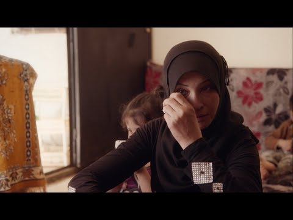

### AYS Daily Digest 09/03/18: Tense situation at the Evros river

_Journalists arrested while a group was stranded on an island in the middle of the river / Aid convoy arrives in East Ghouta / German district charges 400 Euro per month for a bed / Volunteering opportunities in France_

](assets/38312b9cd2a5/1*GXi9ccl9DCjn0SBHk5r-4g.jpeg)

The island, where the group stranded\. Credits: [Bih Ter](https://www.facebook.com/photo.php?fbid=10156212676984486&set=pcb.10156212677489486&type=3&theater)
### Feature: Tense situation at the Evros river

Since Turkish police forces arrested Greek police officers who lost their way in bad weather conditions last week, the situation in the region of the Evros river on the border between the two countries gets more tense\. Volunteers today reported that in the night five Syrians were stranded on a small island in the middle of the river\. For hours they were without water or any support from either the Greek and Turkish side\. One of them is said to have collapsed\.

Apparently, two German journalists witnessed this incident and tried to get help\. Both [were](http://www.tagesschau.de/ausland/journalisten-festgenommen-101.html) arrested, because it is a restricted zone\. We advise refugees as well as volunteers and journalists to be careful when operating in this land border area between Turkey and Greece\. While in the past journalists have been released quickly, we have no information yet on what happened to the stranded group\.

### Syria

After the Syrian Red Crescent and the Syrian Red Cross could not enter the besieged area of East Ghouta on Thursday, they tried again today\. Reportedly, it was the first time that no airstrikes were witnessed\. But as the convoy of 13 trucks with aid for some 12,000 people entered, the airstrikes continued again, Aljazeera [reports](https://www.aljazeera.com/news/2018/03/air-raids-hit-syria-eastern-ghouta-aid-convoy-enters-area-180309092028527.html) \. But still it was possible to get the aid into the area and distribute it\.

■■■■■■■■■■■■■■ 
> **[Robert Mardini](https://twitter.com/RMardiniICRC) @ Twitter Says:** 

> > Relieved that @[ICRC_sy](https://twitter.com/ICRC_sy) @[SYRedCrescent](https://twitter.com/SYRedCrescent) &amp; @[UN](https://twitter.com/UN) teams were able to fulfill their mission today in #Douma #EasternGhouta. As more aid is needed in the coming days, it is absolutely critical that assurances given by warring parties be renewed and respected in the future. 

> **Tweeted at [2018-03-09 16:06:00](https://twitter.com/rmardiniicrc/status/972141460911992832).** 

■■■■■■■■■■■■■■ 

But also in Afrin, where Turkish forces are fighting Kurdish militias, the fights continue\. The [Syrian Observatory for Human Rights](http://www.syriahr.com/en/?p=86414) quotes sources, “that thousands of civilians are now sleeping in the open in Afrin city and the surrounding villages and farms nearby, in addition to the displacement of more than 12 thousand civilians from the area towards the towns of Nubl and al\-Zahraa in the northern countryside of Aleppo”\.

■■■■■■■■■■■■■■ 
> **[UNHCR Syria](https://twitter.com/UNHCRinSYRIA) @ Twitter Says:** 

> > #UNHCR &amp; other humanitarian actors remain ready &amp; anxious to deliver critical aid to hundreds of thousands of people trapped in desperate need inside #EasternGhouta and other besieged parts of the  country.

[unhcr.org/uk/news/press/…](http://www.unhcr.org/uk/news/press/2018/3/5aa1ad2e4/syria-conflict-7-years-colossal-human-tragedy.html)

Photo: March 5 IA convoy to #Duma https://t.co/FKAmfOOYYB 

> **Tweeted at [2018-03-09 10:34:32](https://twitter.com/unhcrinsyria/status/972058046565412865).** 

■■■■■■■■■■■■■■ 

### Lebanon

Recently, a settlement of 30 tents for Syrians in the Beqaa Valley in Lebanon was hit by a large fire\. One 18 month old child was killed in the fire [reportedly](https://www.facebook.com/mohammad.hamoud/posts/10215472108574669) \. It is said that due to concrete obstacles on the side of the highway, the civil defence and other emergency teams arrived late to assist the wounded people\.

](assets/38312b9cd2a5/1*INWfp42tdIkulyX8Btt_6g.jpeg)

The fire swept thorugh the whole camp\. Credits: [Mohammed Hamoud](https://www.facebook.com/photo.php?fbid=10215472107534643&set=pcb.10215472108574669&type=3&theater&ifg=1)
### Greece

The residents of the Vial camp on Chios refused to eat the meals of the catering service again, because they feared the food could be noxious\.

On Lesvos, a group of 15 people vandalized the premises of the pre\-departure center at the reception center after they received a rejection of their asylum application, Ekathimerini [reports](http://www.ekathimerini.com/226589/article/ekathimerini/news/anger-at-asylum-rejections-causes-upheaval-at-lesvos-camp) \. It means that they are now in danger of being deported to Turkey\. The police went inside to calm the situation\.

Also, the Attika warehouse is [in need](https://www.facebook.com/HelpRefugeesUK/posts/578016089225735) of funding to continue their current operations\. According to Help Refugees, it is the biggest warehouse for donations on Lesvos and offers a WhatsApp order and delivery service\. You can support them with this [fundraiser](https://donate.helprefugees.org/campaigns/donate/) \. A [kindergarden project](https://www.gofundme.com/spaces-of-hope) is also asking for support\.

](assets/38312b9cd2a5/1*KWuygTik-VeV_6bmd5vwPA.jpeg)

A vital partner on Lesvos: The Attika Warehouse\. Credits: [Help Refugees](https://www.facebook.com/HelpRefugeesUK/posts/578016089225735)

The Greek Digital Ministry states that no new people were registered as new arrivals on the Greek Islands yesterday\. A total of 61 people were transferred to the mainland\. Five were deported to Turkey, three Pakistani, one Iraqi and one Algerian\.

The police arrested three key suspects of a neo\-Nazi group calling itself Combat 18 Hellas\. The group is said to have admitted several attacks, including one on a squat in Athens, Ekathimerini [writes](http://www.ekathimerini.com/226553/article/ekathimerini/news/neo-nazi-suspects-spill-the-beans-about-attacks) \. AYS information is that the police and a newspaper revealed phonecalls about attacks on the Notara and Kaniggos squat, hate speech and the intent to commit more attacks\.
### BALKAN WEATHER REPORT for Saturday 10\.03
#### Montenegro

In Montenegro on Saturday it will be moderately cloudy with sunny intervals\. In the morning there will be fog in the valleys in the north of the country\. The wind will be weak to moderate blowing from the south and in the afternoon it will be locally strong in the northern part of the country\. In the morning the temperatures will be from \-5 to 7 and during the day 8 to 18 degrees\.
#### Serbia

In Serbia there will be above average temperatures for the time of the year\. Saturday will be predominantly sunny\. In the morning in the valleys and in some places along the rivers there will be short periods of fog\. During the night it is expected to become cloudy with locally short intervals of rain in the north\. The wind will be weak to moderate blowing from the south and southwest\. The morning temperatures will be from 0 to 7 and during the day from 14 to 19 degrees\.
#### BiH

Saturday in Bosnia and Herzegovina will be sunny before noon, and in the afternoon it will become gradually cloudy from the west\. In the afternoon and in the evening there may be some local light rain\. The wind will be weak to moderate from the south\. In the morning the temperatures will be from \-2 to 6 and during the day from 12 to 17 degrees\.
#### Croatia

In Croatia it will be partly sunny and gradually more cloudy in the second part of the day\. On the north part of the coast and in the mountains it will be overcast with rain, mainly in the afternoon and in the evening\. The wind will be moderate and locally strong blowing from the south\-west\. In the morning the temperatures will be from 1 to 11 and through the day from 11 to 16 degrees\.
#### Help needed in Sarajevo

More people are arriving every day to Bosnia — Sarajevo in particular\. Last night, a group of over 40 people managed to enter from Serbia\. They will be accommodated in a hostel paid by locals since there is not enough accommodation in Bosnia\. So far, the state and large NGOs’ response has been minimal, and volunteers are doing everything by themselves\. The biggest support comes from local NGO pomozi\.ba\. They have asked us to spread their desperate call for help\. Here is the information, if you can support them:

Name of the bank: Intesa Sanpaolo Banka BiH
SWIFT CODE:UPBKBA22
IBAN: BA39 1541802008533048
Receiving: Udruženje “Pomozi\.ba”, dr\. Fetaha Bećirbegovića br\. 8, 71000 Sarajevo
Purpose: help for refugees

If you want to send financial support from Austria:
ERSTE BANK
IBAN: AT64 2011182266475400
BIC: GIBAATWWXXX
Wien, Oestereich
Name: hilfhelfen\-pomozi\.ba

If you want to volunteer in Bosnia, please get in touch through the AYS inbox on Facebook\.
### Czech Republic

Although the Czech Republic is not famous for being a transit country, some smugglers and people try this route\. The Czech police have found 22 people from Syria, Iraq and Turkey in a delivery van on the outskirts of Prague, InfoMigrants [reports](http://www.infomigrants.net/en/post/7990/czech-police-bust-migrant-trafficking-ring) \. Among them were four children and one pregnant women, who is now in medical care\. Three suspects were arrested\. They are being accused of having smuggled up to 100 people to Germany, charging between 2000 and 8000 Euros per person\. The crackdown of the transfer was done by Czech forces together with investigators from Germany and Slovakia\.
### Germany

A German court has sentenced a group of seven men and one woman aged between 20 and 40 to up to ten years in jail for attacks against asylum shelters and other crimes in Freital in 2015\. [According](https://www.hrw.org/news/2018/03/08/german-judge-takes-stand-against-xenophobic-violence) to Human Rights Watch, this case was “one of only a few federal trials dealing with homegrown terrorism in modern German history”\. The federal prosecutor stated that the crimes were based on xenophobic, extremist, and Nazi ideology\.

The members of the Main\-Taunus district council voted for a fee increase for self\-payers in community shelters by almost 100 percent, the Frankfurter Rundschau [reports](http://www.fr.de/rhein-main/fluechtlinge-in-hessen-teures-bett-im-asylheim-a-1461820) \. A bed in a multi\-bed room will cost 398 Euro a month instead of 194 Euro\. 4500 refugees live in the district at the moment, but it is not known how many will be affected by this decision\. Volunteers and refugees criticize that it is unclear who will pay the almost doubled rent fees now\. If somebody finds work, they must pay for their accomodation themselves\. A family with three children would have to pay almost 2000 Euro for a 30 square meter room\. This would force even fully employed people to get financial help making it almost impossible to get a permanent residence permit because you have to be mainly independent from social benefits\. For unemployed people, the federal government pays the rent to the districts\. The Commissioner for Social Affairs said they calculated the real costs, but did not account for differing facilities and locations of the different shelters\. The Commissioner said that to do so would cause dissatisfaction and upheaval\. However he would be willing to check every case to avoid social hardship\-cases\.

■■■■■■■■■■■■■■ 
> **[Sol(((i))) MTK](https://twitter.com/grenzenlos_MTK) @ Twitter Says:** 

> > Demo am 5.3. um 15 Uhr, am Kreishaus, Hofheim. Denn der Main-Taunus-Kreis will 400 Euro für ein Bett in einem Zimmer mit 6 Leute. von Geflüchteten kassieren. https://t.co/lMDkqF4RXv 

> **Tweeted at [2018-03-01 16:06:45](https://twitter.com/grenzenlos_mtk/status/969242547150344192).** 

■■■■■■■■■■■■■■ 

While the German Interior Ministry claims to have deported nine Egyptians to Cairo, Egyptian officials have spoken about 100 people\. The nine reported were held in custody and deported without passports\. 50 German police officers accompanied the flight, AP [reports](https://www.apnews.com/d7acf009c44543338047e506b2d272b9) , while German officials only spoke of about 38 officials, including police, doctors and interpreters\. Apparently, it was the first deportation carried out from Germany to Egypt\.
### Switzerland

Swiss aid organizations are asking the government to increase the refugee quota to 10,000 per year and create legal ways to enter the country\. They further demand laws to better support civil\-society and church initiatives in terms of accommodating, accompanying and educating those people as well as Cantons, NGOs and the economy with integration programmes\. By now, more than 5000 people have signed the petition\. It is available in [German](https://www.zuflucht.jetzt/) and [French](https://www.protegeons-les-refugies.ch/) \.

### Libya

Speaking to France24, UNHCR chief of mission in Libya, Roberto Mignone, said: “Libya is not a safe country for refugees\.” They face torture and slavery there\. In the interview Mignone further explains how the UN body evacuates people to third countries and provides assistance to those internally displaced\.

### Italy

A man tried to commit suicide in the morning, Borderline Sicilia [reports](https://www.borderlinesicilia.org/testimonianza-dallhotspot-di-lampedusa/) \. During the day there were abuses from a member of the police, who also beat some people with a baton\. The residents talked with UNHCR staff, but they could not talk with the director and this escalated to a fire in the camp\. In the riot that followed the fire an 8 year old girl was seriously injured and taken to hospital\.

■■■■■■■■■■■■■■ 
> **[InfoMigrants](https://twitter.com/InfoMigrants) @ Twitter Says:** 

> > Over 10,000 #migrants in Italy live on the streets #Refugees https://t.co/7hYmAOqP0e 

> **Tweeted at [2018-03-09 14:20:25](https://twitter.com/infomigrants/status/972114891451588609).** 

■■■■■■■■■■■■■■ 

### France

Several volunteer groups on the ground say that a Sudanese man died sleeping rough on the streets of Paris yesterday\. There are rumors and reports about the cause, but as of now, AYS cannot confirm it\.

L’Auberge and Help Refugees are looking for different volunteer roles to keep thei operations in Calais and Northern France going\. If you are interested, please check their [homepage](https://helprefugees.org/calais-vacancies-apply-now-feb-2018/) for more details\. Also Care4Calais is welcoming more volunteers\.

An alarming message from the Paris ground support team:

“So tonight’s head count found 1,818 souls out there\.

We filled and emptied the van three times\.

We’re only doing sleep distribution, no clothes\.

We simply are going to run out of the essentials imminently\.

We are going to have to make another Calais run today\. We don't have a choice\.

We\. Need\. Help\.
We need another team\.
We need at least 3 full vans worth of aid a night\. 
We need some volunteers who know what they are doing\.

We need all of the thiiiings\! \! \! \! \! \! \! \! \!”

### UK

In solidarity with the people sleeping rough in Northern France, Care4Calais are hosting a protest in London on 17th March\. More details can be found on their Facebook event\.

### EU

The EU interior ministers plan to start a pilot project to intensify the cooperation between Europol and Frontex, EU Observer [reports](https://euobserver.com/migration/141258) \. Data collected by the navy should be directly forwarded to the police\. Due to legal restrictions in the mandate of Operation Sophia, no data will be given to terrorist related agencies\. EU migration commissioner Dimitris Avramopoulos explained: “The pilot project crime information cell will be a hub within operation Sophia to optimise the use of information collected by Sophia for crime prevention, investigation, and prosecution\.” It aims to tackle human smuggling, trafficking firearms and oil smuggling\.

The topics of immigration and borders will also be the focus of Austria’s upcoming EU presidency, Chancellor Sebastian Kurz stated at a press conference\. “Our aim is very clear — that in Europe there should not only be a dispute over redistribution \(of refugees\) but also, at last, a shift of focus towards securing external borders,” EuroActiv [quotes](https://www.euractiv.com/section/justice-home-affairs/news/austria-plans-to-put-immigration-and-borders-at-heart-of-eu-presidency/) him\.

> **We strive to echo correct news from the ground through collaboration and fairness\.** 

> **Every effort has been made to credit organizations and individuals with regard to the supply of information, video, and photo material \(in cases where the source wanted to be accredited\) \. Please notify us regarding corrections\.** 

> **If there’s anything you want to share or comment, contact us through Facebook or write to: areyousyrious@gmail\.com** 

_Converted [Medium Post](https://medium.com/are-you-syrious/ays-daily-digest-09-03-18-tense-situation-at-the-evros-river-38312b9cd2a5) by [ZMediumToMarkdown](https://github.com/ZhgChgLi/ZMediumToMarkdown)._
