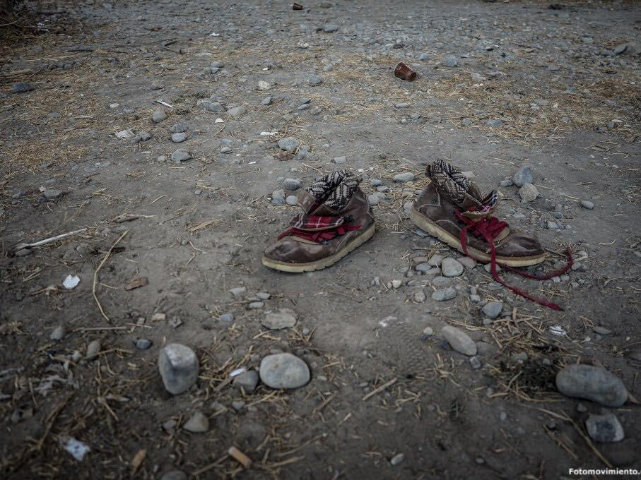
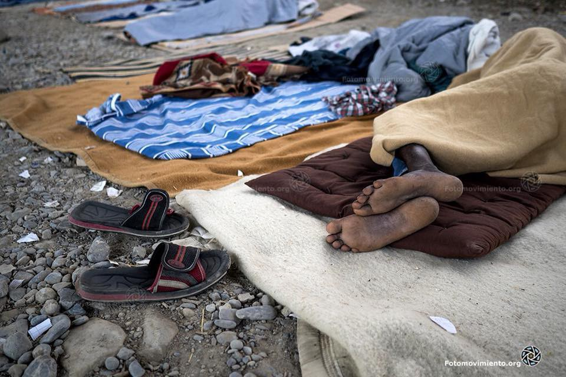
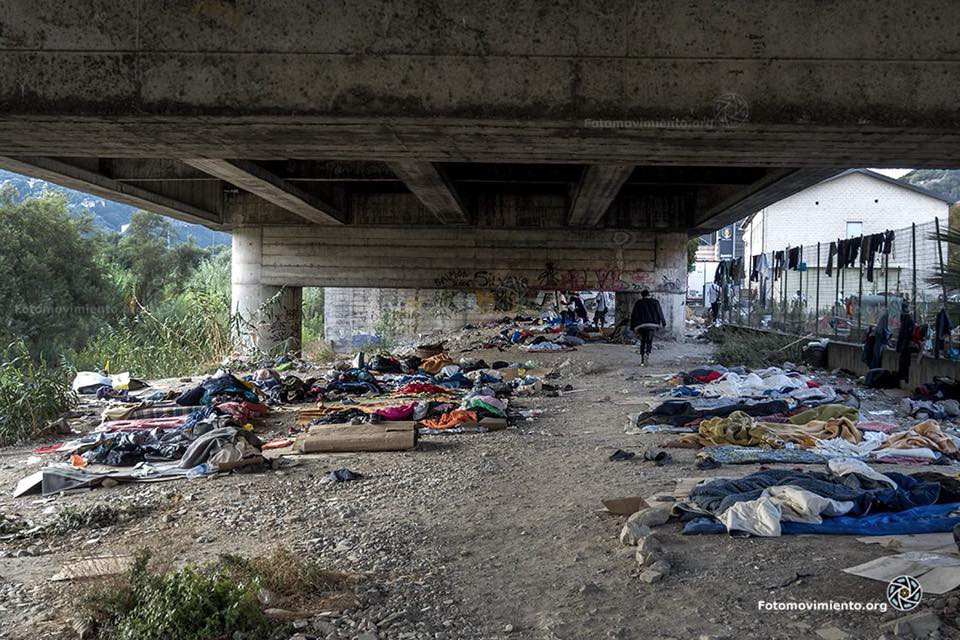
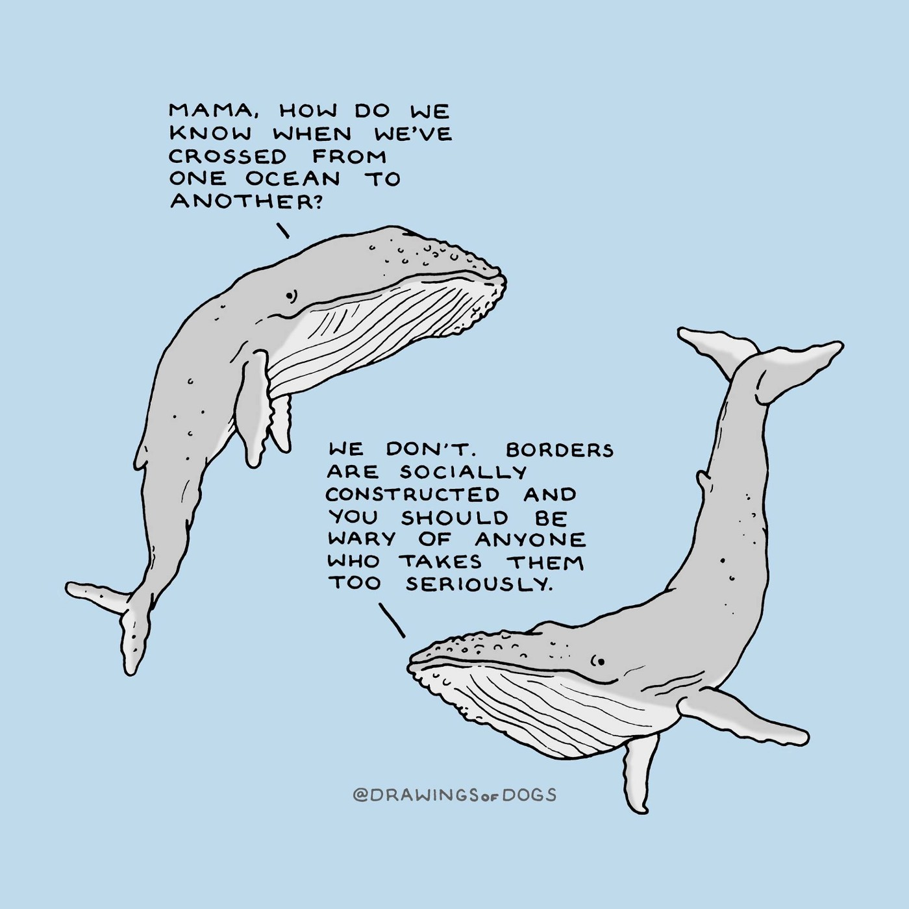

### DAILY DIGEST 10/3/2018: 1,476 people applied for asylum in Slovenia in 2017

_Report from Slovenia where the government is looking for ways to send people back to other EU countries // Help desperately needed in Bosnia // People in Calais refusing food offered by the government // Busy day at sea // More arrivals to Greek islands…_

The Aquarius rescued 110 people this Saturday morning, including 18 women, aboard a pneumatic boat in distress in international waters west of Tripoli\. 
Photos HARA KAMINARA / Sos méditerranée
### Feature

We seldom have information from Slovenia\. People on the move are still passing through this country on their way to northern Europe, while the number of those seeking protection in this country during the last year increased significantly\.

The Asylum Information Database issued [the Country Report on Slovenia](http://www.asylumineurope.org/sites/default/files/report-download/aida_si.pdf) which was written by the Legal\-Informational Centre for NGOs \(PIC\) \. According to their findings, **1,476 people applied for asylum in Slovenia in 2017** \. At the end of the year, there were 274 cases pending, **139 people were granted refugee status** , **13 subsidiary protection,** and **89 were rejected** \. Most of the people who applied for status were from Afghanistan, Algeria, Pakistan, Turkey, Syria, Iran, Kosovo, Morocco, Eritrea, and Libya\.

Despite the increase in number \( **1,308 applicants in 2016** \), the Slovenian authorities are still managing to process all the cases without big delays, even though the procedure is much slower than it was in 2014 and 2015\. Nevertheless, according to the available data, asylum applicants might wait for up to 18 months for a first\-instance decision\.

Slovenia issued **742 outgoing Dublin requests and transfered a total of 50 people** , while it received 657 requests and 51 transfers in the course of 2017\. The majority of outgoing Dublin procedures concerned Bulgaria and Croatia\.

Slovenia remains a country where have been no reports of systemic issues regarding access to territory and asylum procedure, even though there were several individual cases of police refusing access to the asylum procedure\.

The situation could change soon if proposed amendments to the Aliens Act are adopted\. The Parliament voted amendments that could suspend the right to asylum in case migration poses “a threat to public order and internal safety in the Republic of Slovenia”\. If adopted, the police will be instructed by law to reject all applications for international protection as inadmissible as long as the persons is applying to enter Slovenia from a neighboring EU Member State in which there are no systemic deficiencies of asylum procedure and reception conditions that could lead to torture, inhumane or degrading treatment\. The police then deport the person back to this neighbouring country\.

The adopted amendments are currently under review by the Constitutional Court at the initiative of the Slovenian Human Rights Ombudsman\.
### Syria

The bloody fighting in Ghouta continues and so far there are no real efforts by anybody to stop it and help the civilians\. According to the latest reports, 200 people were wounded on Saturday, 49 were killed, among them many women and children\.

[Al Jazeera English reports](https://www.aljazeera.com/news/2018/03/syria-army-splits-rebel-held-eastern-ghouta-180310114947325.html) that Syrian forces have captured the largest town in Eastern Ghouta, effectively splitting the rebel\-held enclave in three\.

Delivery of aid to the besieged enclave is still problematic\.

Eastern Ghouta, where about 400,000 people are living, has been under siege since 2013\.
### Turkey

**311,000 stateless Syrian babies have been born in Turkey since 2011** , according to official statistics\.

_“The fact that these children are stateless is a humanitarian crisis,”_ [commented Atay Uslu](https://www.middleeastmonitor.com/20180310-more-than-300000-stateless-syrian-babies-born-in-turkey-since-2011/) , the head of the Turkish Parliament’s Refugee Subcommittee\. _“I think they should be granted citizenship immediately\.”_

The same problem is happening all over Europe, but there are little or no data on the number of stateless babies being born\.

The Refugees Foundation will deploy a team of volunteers to the province of Izmir from 24 to 31 March\. With a doctor, they will support people living and working in the fields of local farmers and distribute food\. [For that, they need help](https://www.betterplace.org/de/projects/37631-kinder-auf-der-flucht-versorgung-am-strand-und-auf-der-fluchtroute) \. One AYS volunteer will be with them, too\.

AYS already [reported](https://medium.com/.../ays-special-turkey-the-only-hope...) on the situation in January\.
### Sea

Saturday was another busy and difficult day at sea\. **The Aquarius crew rescued 110 people, including 18 women and 1 child,** in the international waters off the Libyan coast\.

■■■■■■■■■■■■■■ 
> **[MSF Sea](https://twitter.com/MSF_Sea) @ Twitter Says:** 

> > The #Aquarius will remain on standby in international waters, ready to rescue other boats in distress. #MSF's Doctor Dan explains. https://t.co/hUzM87ChOq 

> **Tweeted at [2018-03-10 13:23:48](https://twitter.com/msf_sea/status/972463030175969294).** 

■■■■■■■■■■■■■■ 

**Another 106 were rescued by Open Arms, 62 by the Asso commercial ship** \. On the boat rescued by Open Arms, there were three brothers who were carrying their little 14\-year\-old brother who has leukaemia and they are in search of treatment in the EU\.

At the same time, the Libyan coast guard intercepted a boat with about 220 people on it\.

Photo by: Fotomovimento 15M
### Greece

More people arrived on the Greek islands on Saturday\. Samos alone received 32 people who arrived in the morning, most of them Kurdish\. Additionally, two boats landed on the north side of Lesvos: in total, 72 people from Iran and Afghanistan\.

After the incident in northeastern Greece when volunteers and journalists were arrested, a warning went out on the social networks warning all the volunteers in that area\.

“Dear volunteer friends, please take serious precautions before entering the Thracian regions in the far northeastern part of Greece next to the land borders to Turkey\. Due to tensions in the border regions, volunteering and other activities, especially for foreigners in the area, are restricted by Greek laws\.
Please observe extra caution in this regard\. If you are intending to help people in Thrace, please always contact the Greek authorities in advance and inform them of your intentions and travel times, ask them for permission to visit people in detention centres\. Otherwise, your activities might be seen to be illegal and you and your travel companions could be taken into police custody as with the incident that happened recently and was reported by Greek journalists,” states the warning\.

In the meantime, the German journalists who were arrested at the Turkish border have been set free\. The journalists had been reporting to the German public broadcaster, NDR, part of the national ARD network\.

According to the German Embassy in Athens, such instances are common in the area, which is not completely surrounded by a fence or heavily signed\. Even locals have been known unwittingly to wander into the zone\.

On 18 March, two years will have passed since the European Union’s shameful agreement with Turkey came into force, an agreement that trapped and imprisoned thousands of refugees in Greece and along the Balkan route\. To mark that day, marches will be organized all around Europe on 17 March\.

In Athens, the march will be held at [3 pm, starting from Omonia Square](https://www.facebook.com/17m18actionday/posts/182372452488515) \.

“Two years of an agreement that turned the Eastern Aegean islands into open prisons and a place of torture and abuse for refugees\. On 17 March, we demand the immediate abolition of this heinous agreement, the liberation of the trapped refugees and their transfer to the mainland, not contained in camps but brought to the cities, our neighbourhoods, the empty buildings and apartments\.”

Two groups strongly connected to the Golden Dawn neo\-Nazi political party were arrested under suspicion that they are responsible for earlier or more recent attacks against squats, anarchists or leftists centers, as well as immigrants, refugees, and Roma people\.

[Urgently needed — Farsi translators](https://www.facebook.com/ercintl/posts/777358655797221) \.

> If you had an easy online way to purchase a pair of sneakers or a kilo of chickpeas for refugees living in a Greek refugee camp and know that your purchase will be delivered directly to them, would you do it? Essentially an Amazon wishlist equivalent that bypasses shipping costs and is run by a trusted US\-based company, but uniquely for refugees in Chios, Greece\. 

> A volunteer, a member of the AYS Info Team, has put together [a wish list](https://needslist.co/buoy-fund-inc) through just such a company\. Please consider purchasing a pair of sneakers, or a $10 gift card from the wholesaler through which the Chios People’s Kitchen buys food to distribute to refugees on the island\. This is the most direct way to help and to choose exactly what it is that you are donating\. 

In an effort to improve teaching practices at Khora and, more broadly, in Athens, Khora is hosting bi\-weekly workshops where teachers can come together to reflect on and improve their teaching practices\.

The s [ixth teachers’ workshop](https://www.facebook.com/events/2139826226246709/?acontext=%7B%22ref%22%3A%223%22%2C%22ref_newsfeed_story_type%22%3A%22regular%22%2C%22feed_story_type%22%3A%22279%22%2C%22action_history%22%3A%22null%22%7D) will take place next Thursday \(15/03\) at 7 PM in Khora\. This week we will be focusing on how to have FUN in the classroom, even when teaching topics that are not so entertaining\. \(English phrasal verbs\)

As always it will be free and everyone teaching in grassroots organizations and other projects is welcome to join\!

**BALKAN WEATHER REPORT**

**Montenegro**

Variably cloudy with sunny intervals, and in the southwest and west parts of the country it will be predominantly cloudy but mainly dry during the day\. Overnight most parts of the country will be overcast with low to moderate rain\. The wind will be moderate to strong from the south\. Morning temperatures will range from \-1 to 10°C and during the day from 9 to 18°C \.

**Serbia**

Sunday before noon will be mostly sunny, while in the afternoon or in the evening increasingly overcast followed by rain\.The wind will be moderate to strong blowing from the west and southwest\. Morning temperatures will range from 3 to 12°C and during the day from 13 to 19°C\.

**Bosnia**

On Sunday in Herzegovina and south\-west Bosnia it will be moderately to predominantly cloudy\. The rest of the country will be predominantly sunny and with increasing clouds in the afternoon or evening\. Rain is also expected, in the evening in several parts of the country\. The wind will be moderate from the south and southwest, strong in the evening, gusting locally\. Morning temperatures will range from 3 to 11°C and during the day from 14 to 20°C\.

**Croatia** 
Variably cloudy with sunny intervals, intermittent rain on the coast and in the mountains, especially in the second half of the day\. In the rest of the country rain mainly in the evening; some places in the east might stay dry\. The wind will be moderate to strong from the south and southwest, on the coast gusting locally\. Temperature in the morning will range from 3 to 12°C and during the day from 14 to 19°C\.

Ventimiglia\. Photo by: Fotomovimento 15M
### Bosnia

On Friday evening, over 40 people entered Bosnia from Serbia, mostly families with children\. For now, all of them have been placed in a local hostel paid for by the local volunteers in Sarajevo, but soon they will be moved to Delijas, the only existing asylum center\. They will be forced to stay at this center in the mountains, where they are not given adequate food or any kind of help, far from the city\. It is a twelve\-kilometer walk to the closest gas station where they have a phone and an internet signal\. No volunteers are allowed into this center\.

Nevertheless, groups of local and international volunteers are trying to help all the people who are arriving daily in Sarajevo\. Several hundreds are now on the streets since no shelter has been provided by the government, UNHCR or any organization that exists in the country\. The only available help is coming from the small, local groups of international volunteers\.

Two groups that are working in Sarajevo need your help\.

One is Pomozi\.ba, a local charity that supports volunteers in the field\. The volunteers are working to provide accommodation for all, giving priority to the mostly vulnerable people\. So far they are taking care of about 300 people, but many are still on the streets\.

Locals are also providing food, medical help, clothing and everything else\. But they desperately need help to continue working, while the number of people who are arriving is increasing every day\.

You can help by donating to Pomozi\.ba

Name of the bank: Intesa Sanpaolo Banka BiH
SWIFT CODE:UPBKBA22
IBAN: BA39 1541802008533048
Receiving: Udruženje “Pomozi\.ba”, dr\. Fetaha Bećirbegovića br\. 8, 71000 Sarajevo
Purpose: help for refugees

If you want to send financial support from Austria:
ERSTE BANK
IBAN: AT64 2011182266475400
BIC: GIBAATWWXXX
Wien, Oestereich
Name: hilfhelfen\-pomozi\.ba

If you want to volunteer in Bosnia, please get in touch through the AYS inbox on Facebook\. Experienced volunteers only\.

[The other group](https://www.facebook.com/donate/548076322237341/10155313264252023/) are international volunteers who are working at a private property with a local family who has offered shelter for about 80 single men\. But every day new people are arriving and they are struggling with financing food, blankets, and other essential items\.

Ventimiglia\. Photo by: Fotomovimento 15M
### France

Police in Paris continue to be brutal with people who are forced to sleep rough in the city\.

Help is needed in Calais where about 2000 people are sleeping rough\. On Friday, the government started distributing food, but so far most of the people refuse the meal\. The explanation, according to [Le Mond](http://www.lemonde.fr/societe/article/2018/03/10/a-calais-les-migrants-refusent-les-repas-de-l-etat_5268735_3224.html#LZvHpB2WFiUoFAST.99) e, the daily newspaper, is that they don’t trust anything that comes from the state\.

“How can we trust the people offering us food but destroying our tents at the same time?” they asked\. Le Monde reports that while some people went off to get food, their tents were destroyed by the police\. So, volunteers will continue food distribution\.

The government announced they will take over food distribution starting on 6 March\. Around 700 meals were supposed to be served daily \(350 in the morning, 350 in the evening\) \. The number can be “adjusted according to need,” they said\.

In the past, most meals and food distributions were provided by NGOs such as l’Auberge des migrants, Utopia 56, RCK \(Refugee Community Kitchen\) and Salam\. These associations say they are standing by to see how food distribution goes\.

Care4Calais is asking for [donations for boots/shoes](https://www.facebook.com/care4calais/videos/1842357659130516/) \.

“Refugees often walk 12–18 hours a day, every day, and under all weather conditions\. The need for good quality footwear is huge\. Fungus and and foot infections are rife because people having permanently wet feet\.”

[Paris Refugee Ground Support](https://www.facebook.com/PRGS.team/) is in urgent need of a second team for night distributions\. If you are experienced, hard working, and independent and you have a van, get in touch with the team\.

> **We strive to echo correct news from the ground through collaboration and fairness\.** 

> **Every effort has been made to credit organizations and individuals with regard to the supply of information, video, and photo material \(in cases where the source wanted to be accredited\) \. Please notify us regarding corrections\.** 

> **If there’s anything you want to share or comment, contact us through Facebook or write to: areyousyrious@gmail\.com** 

_Converted [Medium Post](https://medium.com/are-you-syrious/daily-digest-10-3-2018-1-476-people-applied-for-asylum-in-slovenia-in-2017-cf5efc9130f2) by [ZMediumToMarkdown](https://github.com/ZhgChgLi/ZMediumToMarkdown)._
