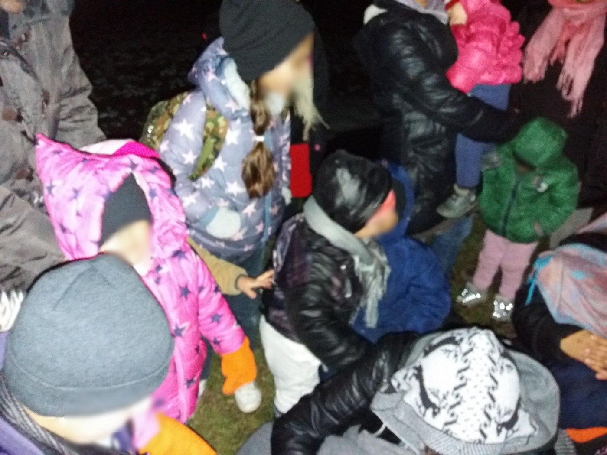
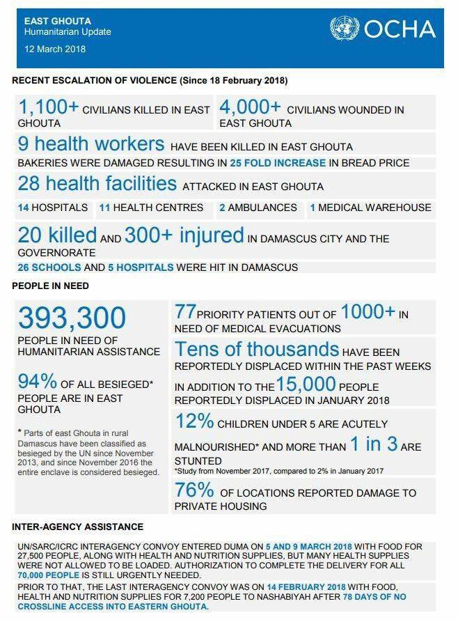
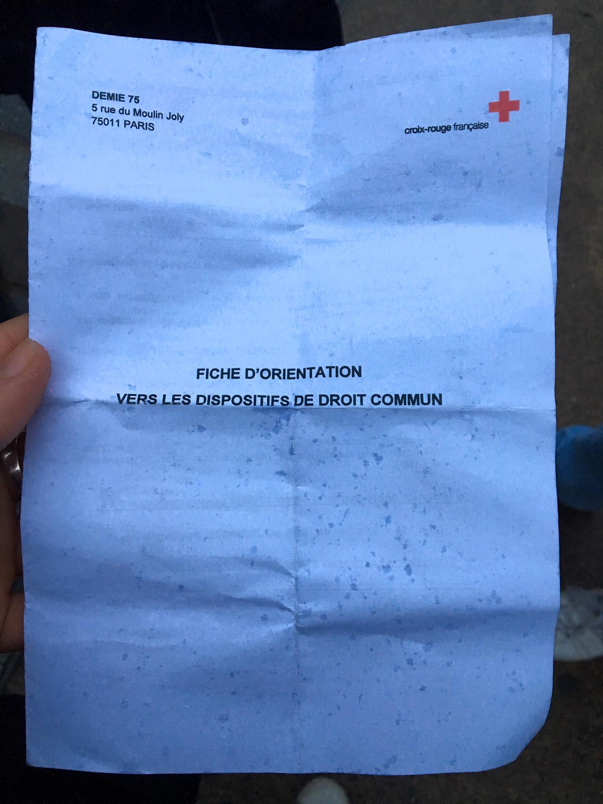
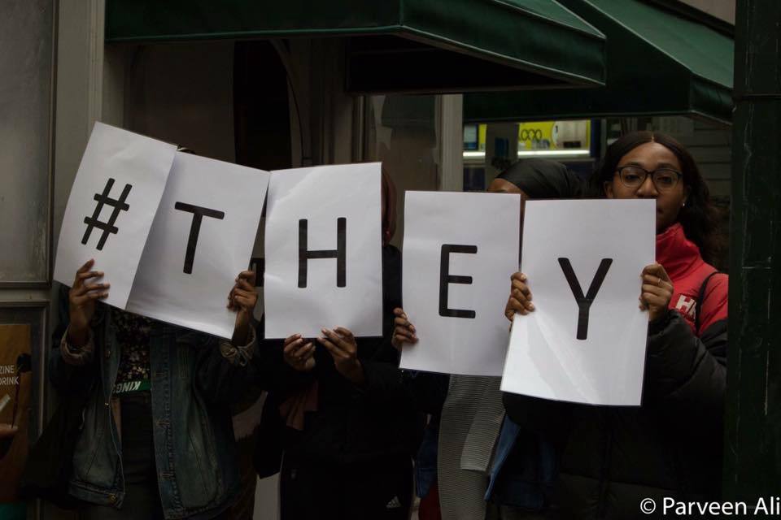
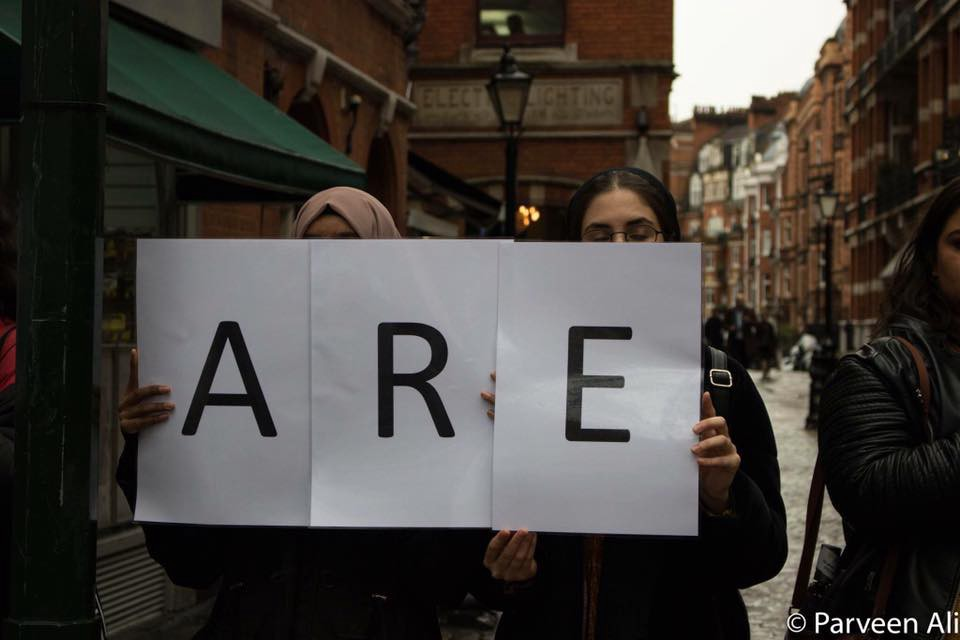
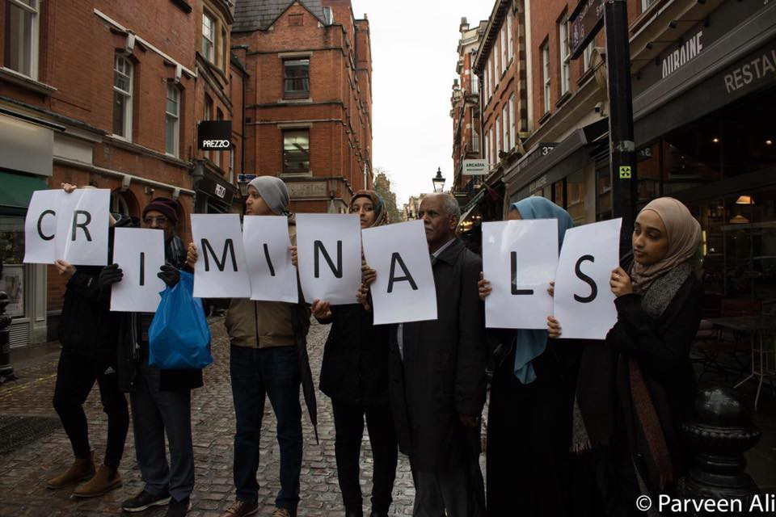

### AYS Daily Digest 13/3/18: Croatia continues with push backs of children, while tacitly accepting expired deportation cases
#### In 2017 50% more children have died in Syria than in 2016 / A man dies of hunger in Sicily / Lampedusa temporarily closing / Croatia tacitly accepted and Austria deported the family whose deadline for Dublin deportation expired on October 25 last year / Volunteers and aid needed in Greece and Bosnia and Herzegovina / more news and updates

#### FEATURE

Only 3 months after the horrible death of a pushed back 6\-year old girl Madina, for whose death nobody has still been held accountable, her family has again been exposed to illegal and cruel treatment of the Croatian state\.

In the night of March 8, a 17\-year old girl sent us a disturbing call for help\. She notified AYS that, along with another family, her family is in the Croatian territory, in the village Strošinci\. She also said they are very cold and that they wish to ask for international protection in Croatia\. They group had 11 children along, among them 2 babies\. They asked us to contact the police on their behalf and notify them about the intention to seek asylum in Croatia\. After we asked about their names, it was evident that they were Madina’s family, confirmed later by them\. We have informed the police \(local police station by phone and the official email contact\), the UNHCR, Croatian Law Centre and the Ombudswoman\. Although Madina’s family feared meeting with the police again due to fear of being pushed back again, realizing it was the only way to ask for asylum in Croatia, they approached the officers in the area and said they wanted to ask for asylum\. According to the family’s statements, instead of answering their demands for medical assistance for the children and providing the option of asking for international protection, the officers reportedly laughed when they saw who was informed about this, they searched through their belongings and went through their messages in the phone in detail, later on letting them go back to Serbia\. What strikes us particularly is that the push back happened in a very similar way as it did in the night when their 6\-year old daughter died on the train tracks: both families were forced to return to Serbia with their small children\.

We can’t help but wonder — what would have happened if another tragedy happened to these families this time? If the Croatian police is doing everything according to the law, as they claim at the Ministry of Interior, how is it possible that we have once again deported the family of little Madina, who has already suffered unbearable pain caused by the illegal practices of our state? Why have Croatian border officers been put in the position to have to force crying children and their mothers to walk in the dark, cold and rain out of our country? 
In the very place where we ourselves were running away when the war was raging in our country\.

We demand urgent response from the Ministry and the director of the border police, answering the question: what happened to the families who have been trying to ask for international protection in the night of March 8, and we invite the journalists to explore this case, that unfortunately illustrastes well the daily practice on the Croatian borders\.
#### Submission by Human Rights Watch to the UN Committee on the Rights of the Child

> During 2017, Croatia forced back asylum seekers and migrants who entered the country from Serbia without examining their asylum claims\. In July, the Court of Justice of the European Union ruled that Croatia breached EU law by allowing asylum seekers and migrants to cross into Slovenia and Austria without first examining their asylum claims\. [\[1\]](https://www.hrw.org/news/2018/03/12/submission-human-rights-watch-united-nations-committee-rights-child-concerning#_ftn1) 

> Asylum seeking and refugee children continued to face social isolation and difficulties in accessing language classes and education\. Unaccompanied migrant and asylum children continued to be placed in residential institutions for children without adequate arrangements for their protection and care\. Out of 30 registered unaccompanied children, only one had been enrolled in school for the academic year of 2017/2018\. 

Please read the entire text including the questions, demands and recommendations for investigations by the HRW — [**here**](https://www.hrw.org/news/2018/03/12/submission-human-rights-watch-united-nations-committee-rights-child-concerning#_ftn2) \.
#### SYRIA
### Violence continues in eastern Ghouta, Afrin, parts of Idlib, Damascus and its suburbs

“No sieges have been lifted … To our knowledge, not one critically sick or wounded person has yet been evacuated,” UN Secretary\-General Antonio Guterres said on Monday\. He [also said](http://aje.io/vyfdv) that the suffering must end and that he was disappointed on the parties involved in the continuing violence in Ghouta\.

![According to news reports, the regime has succeeded in taking over parts of the towns of Shifoniya, Beit Sawa, Al\-Reihan, Misraba, and Madira \(these are mostly agricultural areas which provided most of the inadequate food supply of the besieged area\) \. This is a grave threat to the food security of the areas\. The regime has also succeeded in dividing Ghouta into three areas — the Douma area, the Harasta area and the central area\. Harasta is the smallest of these areas geographically but it is now densely populated\. There are approximately 5500 families, most of them living either in homes or underground cellars\. These areas are in danger of being overrun by the regime\. — by [Ghouta](https://www.facebook.com/ActForGhouta/)](assets/5937bf8b26f9/1*qRP2jEIlirPOw7oIN0WklQ.jpeg)

According to news reports, the regime has succeeded in taking over parts of the towns of Shifoniya, Beit Sawa, Al\-Reihan, Misraba, and Madira \(these are mostly agricultural areas which provided most of the inadequate food supply of the besieged area\) \. This is a grave threat to the food security of the areas\. The regime has also succeeded in dividing Ghouta into three areas — the Douma area, the Harasta area and the central area\. Harasta is the smallest of these areas geographically but it is now densely populated\. There are approximately 5500 families, most of them living either in homes or underground cellars\. These areas are in danger of being overrun by the regime\. — by [Ghouta](https://www.facebook.com/ActForGhouta/)

> Children have paid the heaviest price in this six\-year war and their suffering hit rock bottom last year in a drastic escalation of violence\. 

In their [recent report](http://unicef.org.tr/files/bilgimerkezi/doc/Hitting%20Rock%20Bottom%20How%202016%20Became%20the%20Worst%20Year%20for%20Syrias%20Children.pdf) , UNICEF says that 900 children were killed in 2017 as a result of the war in Syria\. This is the highest number since the war started in 2011, and marks a 50 percent increase from 2016\. Children with disabilities have been facing a very real risk of exclusion, neglect and stigmatization in the midst of bombing, bullets, expulsion, famine, and deaths of relatives and friends, threatening all children daily with becoming left alone\.

](assets/5937bf8b26f9/1*wDpf97VbMPBVKwvuCjWvUw.jpeg)

Photo: [**Live Updates From Syria**](https://www.facebook.com/liveupdatesfromsyria/?hc_location=group_dialog)
#### GREECE
### Suicide attempt in Moria

A man who reportedly tried to take his life by climbing onto an electricity pole has suffered a head injury and both first and second degree burns on his upper body\. He was later transported to the Mitilini hospital and was [reportedly](https://www.lesvosnews.gr/30198/symveni-tora-metanastis-anevike-se-kolona-dei-ke-epese-sto-keno-exo-apo-to-kyt-morias/) in critical condition\.
Edit: The local and national [media](https://l.facebook.com/l.php?u=http%3A%2F%2Fwww.lesvosnews.net%2Farticles%2Fnews-categories%2Fkoinonia%2Fapognosi-apopeira-aytoktonias-prosfyga-sti-moria-anevike-se-kolona&h=ATMOznzKqQreYR8pW1WaMVCxYJnuGMYYHys3BlnFnj8Hy8SCcyNs00e03ai3RstApBLDUHkzU0DoJi4solqOm-WKD0wYpF_nuLqzz8quqk3SpSgA&s=1) reported later that the 19 year old man is alive, at the hospital, with burns on his face and hands, but there is no life\-threatening situation\.
### Statement by 5 of the Persecuted Migrants of the Moria 35

> It is the violent attack by the police against African migrants which must be investigated\. It is the police who must be brought to justice\. We and our 30 brothers in prison must be freed\. We do not trust that the authorities who have treated us as less than human will treat us fairly in this case and we know that we will only achieve justice in this case through solidarity from Greeks, Europeans and other people who see us as their equals\. — _read the whole letter [**here**](http://musaferat.espivblogs.net/en/2018/03/13/statement_of_5/) \._ 

### Gradual increase of crossings in Patras

Authorities arrested 760 people hiding in trucks or carrying forged travel documents at Patras in January and February, close to a third of the total of 2,627 arrests in 2017, according to official data\. In 2016, 1,040 people were arrested\.

“You have to go through all the suffering to get into a better place\. So this is why everybody is trying,”said an Afghan refugee to the Greek [media](http://www.ekathimerini.com/226691/article/ekathimerini/news/greek-port-on-edge-as-more-migrants-try-to-stow-away-to-italy) \. A growing number of refugees in Greece are trying daily to smuggle themselves onto ferries at Patras to get to Italy and in the meantime they live in squalid conditions of the Patras warehouses and buildings\.
### Issuing tickets for Dublin family reunification has stopped again

[Mobile Info Team](https://www.facebook.com/mobileinfoteam/?hc_ref=ARRxSGuD2RY6JxDNPDQWJy6VNmb8VYeA_r0Gum6BWH5W_A3aFFc-30_0VGS4pVGXZP4&fref=nf) informs that Zorpidis, the travel agency responsible for facilitating transfers for family reunification from Greece has unfortunately again stopped issuing tickets\. The travel agency and the Greek Asylum Service have both confirmed this information this morning\. Already in February there was a problem between the travel agency and the Asylum Service\. It is unclear if Zorpidis will stay the contractor for family reunification flights or if a new travel agency will step in\. Nevertheless the Greek Asylum Service ensured to the Mobile Info Team, that everybody is working really hard to solve this problem and that it will hopefully be resolved in a few days\. The Mobile Info Team will keep you updated about any new development\. We hope very much that soon all the people waiting already so long to be reunited, can be together with their families again\.
### March 17 march

On 17 March, people will come together all over the world to show solidarity with refugees and migrants who are imprisoned, who are mistreated and tortured, and who lost their lives as a result of EU’s dirty anti\-migration deals\.

### Volunteering

[Open Cultural Center — OCC](https://www.facebook.com/OpenCulturalCenter/) are looking for volunteers who want to collaborate with them in Open Cultural Center Polikastro, Northern Greece\.
Write them to: hhrr@openculturalcenter\.org

[Lifting Hands International](https://www.facebook.com/liftinghandsinternational/?hc_ref=ARRDi_qGS6dppxF5jKhBSUBWfrBy5F1TN405oVoOsCXZKMSnj98vxGxQ1Yxv5_2l2eo&fref=nf) is looking for volunteers to join their team in Northern Greece\. Their community center includes a women’s safe space, a child friendly zone, and an educational center with a library\. They are looking for:

> \-YOGA teachers \(urgent need ASAP\)
 

> \-Volunteers to facilitate women’s and children’s activities
 

> \-English teachers 
 

> \-German speakers \(needed ASAP\)
 

> \-Fitness instructors \(no experience necessary\)
 

> \-Dance practitioners 
 

> \-Music teachers
 

> \-Warehouse helpers 
 

> \-Children’s Space Facilitator \(supported with housing, requires a 90 day commitment\) \(needed ASAP\) 

> Learn more here: [https://www\.liftinghandsinternational\.org/serres](https://www.liftinghandsinternational.org/serres) 

#### BOSNIA AND HERZEGOVINA

Locals and groups of international volunteers are working to help the refugees in Bosnia and Herzegovina\. The volunteers from Sarajevo are informing us that every typo of donation is welcome: medicine, food, clothes, shoes etc\.
Volunteers are needed too, including doctors or nurses\. If you can come to Bosnia, please get in touch with AYS\.

Volunteers in Semizovci, a village near Sarajevo, say that at the moment they don’t have the capacity to receive new volunteers, but they lack underwear and shoes, especially size 42\.

If sending aid or volunteering is not an option for you, consider donating to local group [Pomozi\.ba](https://www.indiegogo.com/projects/pomozi-ba-is-helping-syrian-refugees--2) who are supporting volunteers in the field and those who need help\.
#### BALKAN WEATHER REPORT

**for Wednesday 14\.03**
#### Montenegro

Variably cloudy with locally weak rain, and in some places rain showers followed by thunder are possible\. In the higher mountains in the north short periods of weak snow or sleet can fall\. The wind will be weak to moderate from variable directions, in the afternoon hours in the north part of the country occasionally moderate to amplified browned from the south\. In the morning the temperatures will be from \-1 to 9 and during the day from 4 to 15\.
#### Serbia

Variably cloudy with short periods of rain in some places and locally rain showers with thunder mainly in the south part of the country\. In the high regions snow is expected\. The wind will be weak to moderate blowing from the west and northwest\. In the morning the temperature will be form 4 to 8 and in during the day from 13 to 17 degrees\.
#### BiH

Wednesday in Bosnia will be overcast and rainy with showers, bur the precipitation wont be to very intense\. During the night the clouds will decrease\. The wind will be weak to moderate blowing from the west and southwest\. In the morning the temperatures will be from 3 to 7 and during the day from 9 to 14\.
#### Croatia

In Croatia it will be overcast with rain in the morning, form the second part of the day the clouds will start breaking up from the west\. The wind will be mostly weak\. In the morning the temperatures will be form 3 to 10 and during the day from 9 to 14 degrees\.
#### AUSTRIA / CROATIA
### Croatia tacitly accepted and Austria deported the family whose deadline for Dublin deportation expired on October 25 last year

\(source: Border Crossing Spielfeld\) 
Today, another Austrian deportation flight arrived in Zagreb\. Three families were on board\. Among them the two Afghan single mothers whose case in front of the ECJ \(judgement C646/16\) was the test case for the many refugees who had travelled through open border by organized “convoy” and asked for asylum in Austria\. The final decision was taken in contradiction to the Advocate General’s findings and sealed the fate for many others who had maintained that the Dublin Regulation rules should not be applied to the specific situation along the West Balkan route at the time\. The two young women were now taken together with their children aged 3, 8 and 10 who had settled well into kindergarden and primary school and were feeling at home in Austria after more than two years\.
Another family has been fighting the court for about the same period of time\. Their legal council maintains that the deadline for deportation to Croatia actually expired in October of 2017\. When they applied \(again\) to have their asylum case admitted in Austria, the Austrian authorities suddenly started Dublin procedures with Italy \(after having established that Croatia should be in charge\), but yesterday, police surprised them with a deportation notice to Croatia\.
A third family seems to be from Iran, father and daughter arrived on their own as the mother is in hospital and could not be deported together with her family\. We do not have any more details at this time\.
What we are experiencing is a cruel pushing back of vulnerable people who have settled in well in Austria, young families with children, all cases where a decision could have been taken long ago whose friends and families who came to Europe at the same time are mostly living as regularized refugees and have long started getting back to a normal life\. For some reason, a number of people were picked out from this Balkan Route group despite the fact that they did not leave finger prints, despite the fact that many of them were told on arrival in Greece that they only had choice between Austria, and despite the fact that Croatia never actively accepted them but only took charge “by default”\. The Dublin rules are based on comparable asylum conditions in a European Union of solidary nations\. These people are a symbol and the unseen victims of a failed system that EU countries are responsible for, not those people who are supposed to be protected\.
According to ECRE report ‘Balkan Route reversed’, Croatian MOI has tacitly accepted 1925 requests for Dublin deportations during 2016 only, most of them submitted by Austria and Germany\. We do not know why, when on the other end of the country Croatian MOI is putting a lot of efforts to expel the people from the country\.
#### AUSTRIA

The welfare access is restricted for people who have lived in Austria for less than five out of the past six years\. This is what has so far been in place as an official decision in the province of Lower Austria, which surrounds Vienna, and was intended to be installed also in the rest of the country, but
Austria’s Constitutional Court has ruled that it is unconstitutional for the government to cut welfare payments to asylum seekers\.
Read the story on [InfoMigrants page](http://www.infomigrants.net/en/post/8042/austria-to-continue-benefits-for-asylum-seekers) \.
#### ITALY
### A young man dies of hunger

A 22\-year old Eritrean has died of malnutrition following the arrival to Pozzallo on a rescue vessel\. His body was in such poor shape that nothing was left to be done to help him bring back the strength upon arrival to Italy when, along with several other people, he was taken to hospital\.

■■■■■■■■■■■■■■ 
> **[Oscar Camps](https://twitter.com/campsoscar) @ Twitter Says:** 

> > Era una Persona.En el barco, dijo que tenía de 22 años, se llamaba Segen,Eritreo y estuvo preso en Libia durante 19 meses.Le rescatamos del Mediterráneo el domingo junto 93 personas y trasladado a un hospital justo al llegar a puerto en Sicilia¿Hoy muere por desnutrición severa? https://t.co/DbcjHQKgB3 

> **Tweeted at [2018-03-13 13:43:14](https://twitter.com/campsoscar/status/973555085530845184).** 

■■■■■■■■■■■■■■ 

> From the collected statements it is evident that the people from Eritrea were first held in a large shed, where more than a thousand people who were forced to live in inhumane conditions and suffer unspeakable torture and then, in numbers going over two hundred, they were transferred to a place of departure to a perilous sea journey\. 
 

> Witnesses say they spent more than a month and a half in a semi\-open place where, as a woman of about 23 years of age tells us, “ we had to dig our holes in the earth to shelter… people died there, between us\. And then we climb into a precarious vessel\. An uncertain journey was paid about $ 1500\. 

> Even two of the seven migrants from sub\-Saharan Africa said they were held in formal and informal prisons in Libya\. One of them, 26 years old from Gambia, said he was detained for more than a month in prison: “when the people of the UN came the Libyans threw the sticks and all the instruments of torture away… for a few days it went well\.” 

> Many people were in a state of malnutrition, in some extremely serious cases, due to inhumane detention conditions in Libya\. — [_MEDU — Medici per i Diritti Umani_](https://www.facebook.com/MEDUonlus/?hc_ref=ARSRIJppFIsVc-_uynkEcIiYjxgG0rzu3e9qlRJJrcI-n7nWBbTJ-iU6lRegybCQ94U) 

The people who arrived on board of the Proactiva Open Arms had cases of scabies and went under treatment straight away, but “what really left everyone shocked was their physical condition: skeletons, men, women and children without a thread of fat, just a bunch of bones”, the mayor [reportedly](http://palermo.repubblica.it/cronaca/2018/03/13/news/ragusa_migrante_muore_di_fame_subito_dopo_lo_sbarco-191160194/?ref=RHPPLF-BH-I0-C8-P7-S1.8-T1&refresh_ce) said\.
### Lampedusa temporarily closing

Italy’s Interior Ministry [announced](http://www.ansa.it/sito/notizie/topnews/2018/03/13/chiusura-temporanea-hotspot-lampedusa_7a0a8ded-b194-4363-90a7-b63e251f8850.html) temporary shutting down of the Lampedusa ‘hot spot’\.
In the light of recent protests, arsons and previous similar events, they decided to proceed with the gradual and rapid depletion of the structure with temporary closure to allow the execution of the renovation work, starting from those already planned, concerning the fence, the accommodation and the video surveillance\.
#### FRANCE

](assets/5937bf8b26f9/1*-a6aFMHqdKCXwYgYHfJG1A.jpeg)

This is what is given to unaccompanied minors in Paris, before being thrown in the streets, with no support whatsoever and completely vulnerable\. — [Faces Before Numbers](https://www.facebook.com/FacesBeforeNumbers/?hc_ref=ARQT9iiQwfqYx5WBuqsB5QA53x78VkDaVoUrpLXJHscbDDscTYtQoq6MqM-9vME-gE8)
### Calais area — call for action

> With school holidays coming up and with the closure of the winter centres at the end of the month, there will probably be an influx of volunteers and a disappearance of refugees around Dunkirk as they are moved to and from CAOs\.
 

> Would any of you be up for some hands\-on spring cleaning in the Grande\-Synthe location? The groups on the ground are struggling to keep up with the amount of litter, so any help would be much appreciated\. Send me a message or comment if you’re interested \(or know anyone who is\) \! _— a post from [one of the volunteers](https://www.facebook.com/thomas.gilbert.169?hc_ref=ARQMIZM1iF6krSeY6Zi_cUzZBIMlKLIoNjls3UteHbhj6is5s4dYtUet3-Z9FMSgXmA&fref=nf)_ 

 action](assets/5937bf8b26f9/1*rzZ3W9TOm6oQFmwKXAl9wQ.jpeg)

Protests all around Europe are announced for March 17, see more about [French](https://autonomiedeclasse.wordpress.com/2018/03/13/partout-en-europe-toutes-dans-la-rue-le-17-mars/) action
#### GERMANY

Chances of being granted asylum may depend on the state that the application is filed in\. Figures provided by the German Office for Migration and Refugees reveal significant differences in protection rates in individual states\. According to German media, for example — the state of Saarland had the highest protection rate of 72\.8 percent whereas Brandenburg had the lowest rate of 24\.5 percent\. North\-Rhine Westphalia ranked in the middle with 45\.3 percent\. Read more in InfoMigrants [report](http://www.infomigrants.net/en/post/8022/regional-differences-in-protection-rates-for-asylum-seekers) \.
#### SWEDEN
### Age test changes

The medical age exams of girls will be resumed, said Rättsmedicinverket \(who works on the mission from The Migration Agency with this\) \. 
In a [press release](https://tidningensyre.se/goteborg/2018/nummer-80/lo-fack-efterlyser-sjukreformer/) , the agency wrote that the methods for examining girls will be changed since they were paused due to uncertain outcomes due to that girls don’t age the same way as boys\.

Medical age exams are performed on persons seeking asylum and if there are question marks about the applicant’s age\. The test consists of two different examinations: X\-ray of wisdom and magnetic camera examination of the knee joint\.

Analysis have shown that knee pains in girls mature earlier than it previously was known\. This makes it impossible to assess the age of knees and teeth in some cases and the authority will continue to use the following statement: “The result does not allow an assessment of the age of the examiner relative to the 18\-year limit\.”

If both the wisdom and the knee joint are mature, the probability assessment becomes stronger\. The change in the procedure now, when they will be resumed, is that a “may” in the statement is removed\. Before the official statement after the exam was: “may speak for that the person examined is under 18 years old”, now it will be: speak for that the person examined is under 18 years old “speak for that the person examined is under 18 years old”\. This is, as it is understood in the article based on the press release, in all cases when there are different results of knee and teeth on girls since it seems like the knee can look more mature than the person it belongs to\.
#### DENMARK
### Bureaucratic harassment of detainees

Danish media is reporting that people who are forced to live in Kærshovedgård deportation camp have ”violated” their duty to report 10\.000 times\. The Danish state imposes a duty to report to the office in Kærshovedgård 3 times a week for people living in the camp, and “violation” of this duty is punished with fines\.

> This is our response: 

> The duty to report is one of the mechanisms with which the Danish states attempts to make life intolerable for people living in Kærshovedgård\. 

> The problem is not that the people living there violate the duty to report — the problem is that the Danish state attempts to limit the free movement of people and the right to live where they wish\. Punishing the people who are forced to live in the deportation camp makes no sense\. Most of them will not be able to pay the fines, as they are not given the right to work\. 

> We see the court cases about ”violation of duty to report” as a bureaucratic harassment, but also as one of many ways in which the state generally expands and reasserts its surveilling and punitive function through the racist criminalisation of refugees, migrants and poor people\. The struggle against Kærshovedgård is connected to the struggle against double punishment in the areas which the goverment calls ”ghettoes”\. —
 

> _follow [Close Kærshovedgård Deportation Camp](https://www.facebook.com/CLOSEKGH/?hc_ref=ARR8ZERM0ZoBrUDEZwPlpX35Y2mWaL8BsVwDxRDmGFfmANDEfLo81tp7lBh6vovAG3o&fref=nf)_ 

#### UK
### London

Protest outside the Israeli embassy in London 12th March 2018\. Protesters demand an immediate end to the unfair policy depriving African migrants of the rights and dignity they deserve\. Stop the deportation of refugees and migrants in Israel\.

](assets/5937bf8b26f9/1*4EaLx0IZQEjc8CjUZ53Egw.jpeg)

Photos — source: [Help Refugees Worldwide](https://www.facebook.com/HelpRefugeesWorldwide/?hc_ref=ARTaitHRkfMDmFwtIGqrZzwmXJiNqXAgQo-I6_N3Kdaw-hwDbK7ZGZxwJ8HowXDkSgQ&hc_location=group)

### Worrying findings at Harmondsworth

Harmondsworth immigration removal centre \(IRC\) at Heathrow, holding large numbers of men with mental health problems in prison\-like conditions, continued to show “considerable failings” in safety and respect for detainees, [according to](https://www.justiceinspectorates.gov.uk/hmiprisons/media/press-releases/2018/03/harmondsworth-immigration-removal-centre-persistent-failings-in-safety-and-respect/) prison inspectors\.

Many areas were dirty and bedrooms, showers and toilets were poorly ventilated\. Inspectors in 2015 raised serious concerns about bedbugs but they remained endemic in 2017\. There were infestations of mice in some areas\. Inspectors were also concerned that only 29% of detainees said they could fill their time while in the centre and many described “a sense of purposelessness and boredom\.”

> Inspectors found: 

> Worryingly, in nearly all of a sample of cases, the Home Office accepted evidence that detainees had been tortured, but maintained detention regardless\. “Insufficient attention was given to post\-traumatic stress and other mental health problems\.” 

> While violence was not high, a high number of detainees felt unsafe\. Detainees told inspectors this was because of the uncertainty associated with their cases, but also because a large number of their fellow detainees seemed mentally unwell, frustrated or angry\. 

> Drug use was an increasing problem\. 

■■■■■■■■■■■■■■ 
> **[ECRE](https://twitter.com/ecre) @ Twitter Says:** 

> > 🇬🇧: Official inspection report into Harmondsworth immigration removal centre, found #detention of victims of torture, squalid conditions, extensive periods of detention +++ One man had been held for more than 4 &amp; a half yrs via @[guardian](https://twitter.com/guardian) [bit.ly/2pbbtzj](http://bit.ly/2pbbtzj) https://t.co/Ta0sFie6oH 

> **Tweeted at [2018-03-13 09:37:21](https://twitter.com/ecre/status/973493204854214658).** 

■■■■■■■■■■■■■■ 

**We strive to echo correct news from the ground through collaboration and fairness\.**

**Every effort has been made to credit organizations and individuals with regard to the supply of information, video, and photo material \(in cases where the source wanted to be accredited\) \. Please notify us regarding corrections\.**

**If there’s anything you want to share or comment, contact us through Facebook or write to: areyousyrious@gmail\.com**

_Converted [Medium Post](https://medium.com/are-you-syrious/ays-daily-digest-13-3-18-croatia-continues-with-push-backs-of-children-while-tacitly-accepting-5937bf8b26f9) by [ZMediumToMarkdown](https://github.com/ZhgChgLi/ZMediumToMarkdown)._
