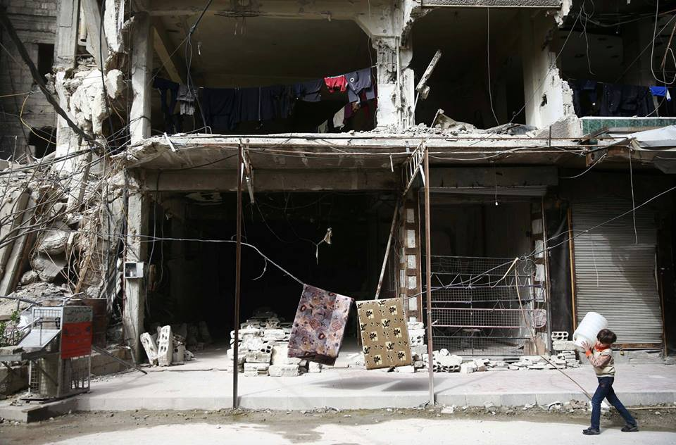
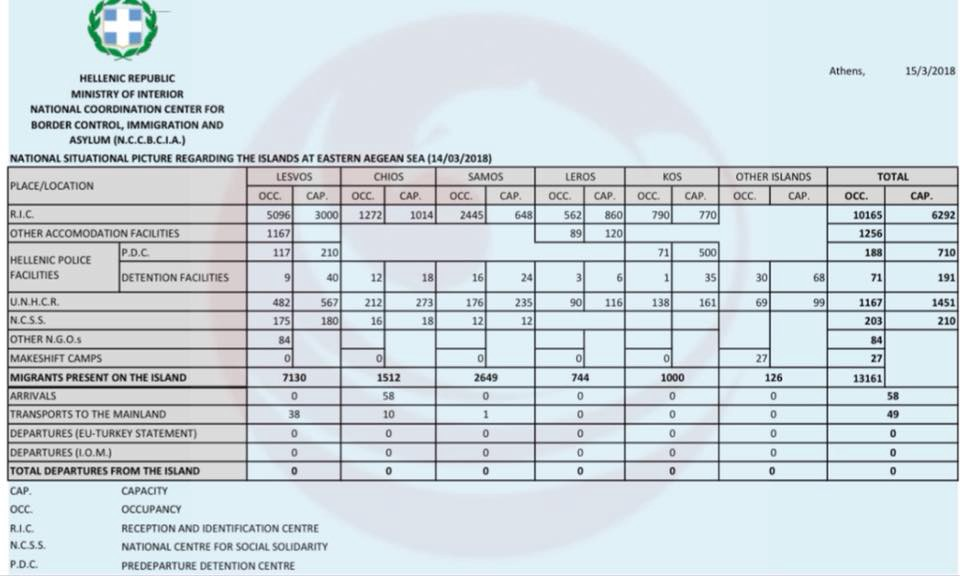

### AYS Daily Digest 15/03/18: On the eighth anniversary of the war, Syrian medical patients are driven underground

_Medical patients and staff driven underground in Eastern Ghouta / War in Syria creeps into eighth year / Calls for volunteers and donations in Greece / Report on Serbia published / Deportation slated from France / And more news…_

A boy walks through his neighborhood in Douma \(Photo by Bassam Khabieh\)
### FEATURE

Today marks the eighth anniversary of a war which is reportedly responsible for 400,000 deaths, even more casualties, and millions of refugees streaming across borders\. Today the focal point of the war is Eastern Ghouta, where the Syrian government’s incessant bombing has caused global outrage\. Any semblance of normalcy has been destroyed over the last couple of weeks as the Syrian government intensified its offensive against the rebel\-controlled suburb of Damascus\.

The regular bombing means that many are in need of medical care\. As humanitarian facilities are regularly targeted, however, [MSF reports](http://www.msf.org/en/article/syria-voice-hospital-basement-east-ghouta) that many doctors—following general patterns in the area—are now forced to operate underground\. The staff are facing a barrage of injured patients, 30 having been brought into the hospital in the previous day\. During the first two weeks of the regime’s offensive, MSF facilities have seen 300 wounded and 70 dead brought to them every day\.

Medical supplies are in low supply, with blood being the biggest issue\. Patients are regularly in need of blood transfusions, but the nearest blood bank is located seven kilometers away, a distance difficult to cross when one has to fear for one’s life\.

Although the Syrian regime has opened up a crossing point for civilians to escape the war\-zone, many are afraid to use the opportunity as they fear reprisals and a general lack of knowledge of what will happen to them once they leave their homes\. The crosspoint is located near Al\-Ahlam factory on the outskirts of Hamouria, and seemingly is not under the oversight of international organizations, which adds to the unease and mistrust of the besieged populace\.
### BALKAN WEATHER REPORT: Friday 16/03

**Montenegro**

Friday will be moderately cloudy to completely cloudy with rain\. In the south and central parts of the country, rain showers and thunder are possible and moderate to heavy rainfall\. In the far north and and northeast less rain is expected\. The wind will be amplified to strong blowing from the south\. The temperatures in the morning will be from 2 to 13 and during the day between 6 and 16 degrees\.

**Serbia**

In Serbia, it will be variably cloudy and for the most part dry\. In some places in the south and in the mountains short periods of rain are expected\. The wind will be weak to moderate blowing from the west and south\-west\. In the morning the temperature will be from 3 to 7 and during the day from 13 to 17 degrees\.

**Bosnia**

On Friday it will be cloudy with rain in most parts of the country, with the gradual cessation of the rainfall and decrease in the cloud cover later in the day\. In the evening and in the night from Friday to Saturday there will be rain throughout the country\. The wind will be weak to moderate blowing from the south and southwest, but in Herzegovina with strong gusts\. In the morning the temperatures will be from 4 to 12 and during the day from 12 to 18 degrees\.

**Croatia**

In Croatia it will be mostly cloudy with occasionally rain, more often during the night and in the morning\. Alongside the coast there may be rain showers accompanied by thunder\. Around noon and in the afternoon longer periods of sun are expected land inwards as well as alongside the north part of the coast\. Land inwards the wind will be weak to moderate blowing from the southwest, locally with strong gusts\. Alongside the coast a southern wind will be blowing which will decrease in strength towards the end of the morning and locally turn to the a southwestern wind\. In the morning the temperatures will be from 4 to 13 and during the day from 12 to 18\.
### GREECE
#### Upcoming demonstration against renewal of EU\-Turkey deal

On March 17th at 12pm, a protest will be taking place against the EU\-Turkey deal\. The date marks the two year anniversary of the deal which pays Turkey to keep refugees within its borders even as conditions are unbearable\. Nearly 100 people are currently confined in Moria and prevented from leaving their camp since their arrival, for the purpose of deporting them to Turkey promptly\. For more information, please send an email to info@legalcentrelesbos\.org or call Lorraine Leete on \+30 695 507 4724
#### Football for All event to take place in Thessaloniki

Football for All: Aniko is uniting refugees and displaced people, aid workers, and Greek nationals, in their fifth community football event\!

From 5pm\-8pm \(EET\), UK non\-profit organisation Aniko, which empowers displaced people through football, is hosting its fifth Football for All \(FfA\) community event in Thessaloniki, Greece, this Sunday, March 18th\.

Previously held at XANTH, Thessaloniki, this month’s FfA will take place at the Top Fitness All\-Star Pitch, part of the Iraklis 1908 complex on Aghiou Dimitriou, Thessaloniki\.

The change of venue is due to the extraordinary success of the initiative, which last month \(February 18th\) saw more than 300 people attend\. It is also combined with a newly increased duration \(three hours\) to enable more time, as well as more space, to play\.

Football for All is an opportunity for all within the community, regardless of age, race, nationality, religion, gender, or football ability, to come together to meet one another, and play together\.

Aniko, which has dedicated itself to using football to promote social inclusion and community\-building through football, has already seen its FfA sessions grow to include refugees, displaced people, aid workers, and Greek nationals, and is inviting anyone interested in playing football to join the event this Sunday\.

For more information about the event, including transcripts in Arabic, English, Farsi, Greek and Urdu, visit the Football for All — March Facebook event page\.
#### Doctors and nurses needed on Lesvos

Medical professionals are in short supply on Lesvos, and all who can commit for at least two weeks of work are encouraged to apply\. The opportunity will include airport transfers, accommodation, and transportation to and from your place of work\.

To apply please email jo@dinit\.ie
#### We Are Here seeks volunteers in Nea Kavala

Nea Kavala is looking for volunteers who have experience teaching English, sports, music, early childhood development, and computers\.

To apply, please go to [this link](http://goo.gl/forms/bJ6MhKEqopwDw9QA3) \.
#### Pampiraiki desperately needs goods, donations for its Athens central warehouse at Ellinikon

Monetary contributions may be sent through Paypal or through a bank transfer\. The information is as follows:

> [paypal\.me/Pampiraiki](http://paypal.me/Pampiraiki) 
 

> or
 

> via bank transfers or deposits to our account at the National Bank of Greece:
 

>  ACCOUNT NAME : Pampiraiki Suport Initiative for Refugees & Migrants
 

>  IBAN: GR7001101980000019800232050
 

>  SWIFT \(BIC\) : ETHNGRAA
 

>  ADDRESS : 1, Tsamadou Str\., Piraeus 18531, Greece
 

>  Please notify Negia Milian via messenger or whatsapp & mob:\+306944358460 of your cash donations\. 

Food is also in short supply, and a full list of the products needed may be found in the [Pampiraiki Facebook group](https://www.facebook.com/groups/PAMPIRAIKI/permalink/608337382843703/) \. The warehouse is open Tuesday — Friday from 11am to 5pm and donations are to be brought there\.
#### Official updates on arrival and capacities

The latest Greek government figures

**South Lesvos:** 
\- 1st boat: 62 people
\- 2nd boat: 53 people
\- 3rd boat: 65 people

**Kos:** 
\- 1st boat: 37 people
### BULGARIA
#### Bulgaria accepts 60 refugees from EU quota of 160 people

Bulgaria has accepted 50 refugees from Greece as well as 10 from Italy as part of the long\-delayed plan of relocating refugees to decongest conditions in the countries through which refugees enter Europe most often\. Bulgaria had pledged to accept 160 refugees in 2015, and although it lags severely behind its promise, this is in no way remarkable in an EU where the majority of the countries have not accepted the quota\.
### SERBIA
#### Refugee Aid Serbia issues report for the second half of February

[RAS reports](https://refugeeaidserbia.org/wp-content/uploads/2018/03/RAS_Field_Report_05032018-1.pdf) that it has been in contact with 177 new arrivals, mostly from Pakistan \(28%\), Iran \(22%\), Iraq \(22%\), and Afghanistan \(17%\) \. They have conducted 241 interviews and provided information to 286 people\. A rapid temperature drop precipitated a severe drop in the number of refugees in the area around the Afghan park\. They also report that on February 24, the police carried out a raid in the area\.
#### Refugee aid organizations are collecting donations

Volunteers’ Center of Vojvodina and CK13 are collecting donations for Riguardu, BelgrAid, and Escuela con Alma, groups which are active in helping refugees currently in Serbia\. They are most active in border areas such as Subotica, Sombor, and Sid\. Currently they are most in need of male underwear \(sizes from XS to L\), shoes \(sizes: 40–45\), shampoo and shower gel, razors, tracksuit pants for men \(sizes from XS to L\), and ingredients such as oil, rice, milk, cereals, and flour\. Donations are being collected until April 4th, and may be brought to CK13’s Infoshop on business days from 10am to 2pm, and to the CK13 Club from 5pm until the closing time\. On April 4th, a vegan dinner dedicated to the action will be served\.

### HUNGARY
#### Amnesty International launches petition for the release of Ahmed H

The case of Ahmed H is now infamous\. Ahmed has been detained in Hungary on frivolous charges and now faces 10 years in prison for taking part in a demonstration against police brutality\. He is being charged as a terrorist for his act\. This abuse of the law has sparked outrage among many people, and one hopes that the charges against him be dropped\. If nothing else, please help the struggle by signing the petition below\.

### GERMANY
#### Police raid refugee camp in Bavaria, deportations prevented

Yesterday afternoon, police raided a large camp in Donauwörth, Bavaria\. About 200 policemen in combat gear and dogs were part of the raid\. The 300 inhabitants, refugees from Gambia, were locked up in their rooms\. Then police went with their dogs from room to room, and about 30 people were arrested\.

The night before, police tried to enforce a deportation, which was abandoned after loud protests and resistance\. Most of the refugees from Gambia are facing deportation to Italy\. Cash assistance was reduced, which was judged to be illegal by court\.

Activists say that the police raid was an act of intimidation against people living in the camps\. “They would like them to wait quietly in their camps for the police to come at night and take them for deportation\. This is not realistic, of course the refugees protest and resist\. It’s a consequence of Bavaria politics of large camps\.”
#### Kurds across Germany demonstrate against Turkish invasion of Afrin

400 Kurds gathered to hold an unregistered demonstration in downtown Hamburg around 10pm local time yesterday, protesting Turkish military intervention in Afrin\. The event remained peaceful despite some firecrackers being set off\. Similar protests took place also in Berlin, Cologne, Stuttgart, and Saarbrücken\.
### DENMARK
#### Family of six at risk of deportation to Afghanistan

According to a [Facebook post](https://www.facebook.com/photo.php?fbid=10156237975557973&set=a.10151623520887973.1073741824.636337972&type=3&ifg=1) created by Abdul Ghafoor, a family of six has been denied their claims for asylum\. Because her elder siblings are being held in a detention centre, a 16 year old girl is forced to provide for her ill parents\. Although an appeal has been filed to the European Court to halt the deportation, the fact that a family can be put in such a position in the first place speaks volumes about the current atmosphere in Denmark\. Many refugees and people of immigrant backgrounds in Denmark are very worried by the political climate in the country where the prime minister has [proposed a law](https://www.ft.com/content/e5064e70-1d44-11e8-aaca-4574d7dabfb6) which would double penalties for crimes committed in “ghettos\.”
### SPAIN
#### Riots in Madrid after death of refugee in police chase

Mmame Mbaye died while being pursued by police\. He had been in Spain for 14 years and was self\-employed as a street vendor at a time when police are increasingly cracking down against them\. Around 5pm, the chase erupted\. The outcry against the heinous killings has forced the police to announce that they will be carrying out an investigation of the events\.
### ITALY
#### 108 implicated in extortion of refugees in Catanzaro reception centre to be put on trial

The accused are believed to be part of a mafia conspiracy to extract money from refugees by the ‘Ndrangheta crime syndicate\. They face various charges including mafia association, extortion, illegal possession and carrying of a weapon, fictitious property registration, embezzlement against the state, aggravated fraud, public sector procurement fraud and alleged tax crimes\.
### FRANCE
#### Three detained, slated for deportation to Sudan

Three people are currently detained in the Coquelles Detention Center and are expected to be deported to Sudan\. Yesterday, two of them were presented to the Sudanese embassy, and it is expected that the third will be delivered soon as well\. You may help by contacting the Prefecture of Pas\-de\-Calais and demanding that the deportation be cancelled\.

[fabien\.sudry@pas\-de\-calais\.fr](mailto:fabien.sudry@pas-de-calais.fr) 
By telephone : \( \+33\) \(0\) 3\.21\.21\.20\.00
By fax : \( \+33\) \(0\)3\.21\.55\.30\.30
The prefecture contact form : [http://www\.pas\-de\-calais\.gouv\.fr/Contactez\-nous](http://www.pas-de-calais.gouv.fr/Contactez-nous)

Other useful contacts :
Minister of Interior Mr\. Gerard Collomb
– [g\.collomb@senat\.fr](mailto:g.collomb@senat.fr) 
– [g\.collomb@interieur\.gouv\.fr](mailto:g.collomb@interieur.gouv.fr)

Director of the Cabinet of Mr\. Collomb
[stephane\.fratacci@interieur\.gouv\.fr](mailto:stephane.fratacci@interieur.gouv.fr)

Secretaire after of Prime Minister for Gender equality
[sec\.marlene\.schiappa@pm\.gouv\.fr](mailto:sec.marlene.schiappa@pm.gouv.fr)
#### NGOs denounce inadequate care of mentally ill refugee boy

A 17 year old boy from Pakistan died by suicide on February 14th\. His body was found in the River Seine\. He had been placed in a hotel on his own five months prior\. He already had tried to commit suicide once, and was in psychiatric hospital 3 times altogether\.

ASE \(Authority for Social Aid for Children\) was in charge, and he had subsidiary protection\. After he was discharged from psychiatric care the last time, he was placed alone in the hotel once again\. Friends and social workers had pointed out that he is in danger and needs professional help more than once\. Friends asked ASE about his whereabouts five days after he was released, but ASE said they had no news\. He was reported missing only after 12 days — five days after his death\. GISTI accuses ASE to have failed to protect him, and that it was irresponsible to place him in a hotel alone without help, since his psychiatric problems were known\.

GISTI as well as other organizations specializing in helping refugee minors have [signed a statement](https://www.gisti.org/spip.php?article5880) condemning this gross neglect of the ASE\.
#### Refugee Community Kitchen needs volunteers

Volunteers are needed in Calais to be part of a team which serves over 1,000 meals every day\. No experience is necessary\. For more information, please email them at refugeecommunitykitchen@gmail\.com
#### Cuisine de Migrants in urgent need of volunteers

Yesterday, Cuisine de Migrants \(in Paris\) was unable to be active because they did not have anyone to prepare and distribute meals\. To learn how you may help, please visit their website at www\.lepotcommun\.fr
#### Porte de la Chapelle centre to be replaced by fivesites throughout Paris

The “bubble” at Porte de la Chapelle is going to close \(450 places\), to be replaced by five different centres in the Paris region \(together 750 places, in Paris at the same site, in Ris\-Orangis at Essonne, in Cergy at Val d’Oise, and one in the county in Hauts\-de\-Seine and another in the county Seine\-et\-Marnes \[names not known yet\] \) \. In the meantime, refugees should be directed to day\-reception centres, of which at least four are supposed to be installed\. There will be buses coming and taking the refugees to one of the five new reception centres \(depending on the individual situation\) \. “That will allow us to increase the reception capacity and also to regulate the immigrant flux,” explains the prefecture\.
### MEDITERRANEAN
#### 12 reported dead by Morocco

Morocco has confirmed 12 deaths in a boat of 34 people who wanted to cross the ocean\. The 20 survivors are being detained\.
#### 15 rescued in the vicinity of Ceuta by Guardamar Concepción Arenal

The Guardmar Concepión Arenal saved 15 people at sea near Ceuta\.
#### Lampedusa hotspot to be closed for renovations following fire, outcry

On March 8th, a fire broke out in the Lampedusa hotspot\. For a long time, people had been complaining about the unsuitable conditions in the centre, with one refugee committing suicide in January after a month in detention\. But this fire was the last straw\. People promptly organized to protest, forcing the Italian government to agree to close the facility temporarily to facilitate renovations\. The refugees currently on the island are to be relocated to the mainland while work continues\.
#### ProActiva rescue operation threatened by Libyan coastguard

According to [Oscar Camps](https://twitter.com/campsoscar/status/974349999826927618) , a rescue operation taking place 73 miles away from the Libyan coast \(far outside of the coastguard’s jurisdiction\! \) was compromised when Libyan coastguard ships threatened to shoot the boat unless they handed over the rescued refugees\.
### EU
#### European Commission agrees to additional three billion Euros in funding for refugees in Turkey

Three billion Euros in funding are to be extended through 2019, extending with it the much\-critiqued EU\-Turkey deal which serves to impede the movement of refugees into Europe\. The funding is to be used for such services as education for children and social programs\.
#### Frontex reports drop in refugee crossings in February

3,400 refugees crossed the border into the EU in the month of February, with a marked decrease seen especially on the Italian border\. The number of crossings this year has been halved compared to the same time last year\. Fewer than 800 refugees arrived to Italy, a tenth of the February 2017 figure\. It should be noted that while the total number has decreased markedly, the number of casualties has fallen at a smaller rate, suggesting that the casualty rate is higher this year than it was in previous years\.
#### EU proposes visa restrictions for countries who do not take back extradited nationals

Countries refusing to take back migrants living illegally in the EU could face problems in the future when their citizens apply for visas, [reports](http://www.dw.com/en/eu-proposes-visa-restrictions-on-countries-refusing-to-take-back-illegal-migrants/a-42972901) claim\. New rules proposed by the EC would set stricter conditions and it is mainly directed at African countries, since several African countries have refused to take their nationals back, impeding deportations and prompting EU leaders last year to agree to use visa policy as leverage\.
### LIBYA
#### Libya issues arrest warrants for 205 accused of being involved in a smuggling network

Those targeted are charged with human trafficking, torture, murder, and rape of refugees, and the network purportedly includes members of the security services, migrant detention camp leaders, and officials from African embassies in Libya\. The attorney general’s office also [claims](http://www.bbc.com/news/world-africa-43409878?ocid=socialflow_twitter) that the smugglers had direct links to ISIS\.
### MALI
#### Refugees deported from Algeria to Mali robbed by armed groups

Algerian authorities [have unlawfully deported](https://reliefweb.int/report/algeria/algeria-deported-migrants-robbed-mali-enar) more than 100 refugees of various nationalities to Mali in the last month\. Those deported were never given an opportunity to challenge their deportation, and were not afforded an opportunity to gather their savings and belongings\. The refugees were marched at gunpoint to the Algerian border and forced to walk six hours to the nearest town in Mali\. Along the way, many report having been robbed at checkpoints manned by Al\-Qaeda\-linked armed groups\. By the time that they reached Gao, many were severely malnourished and dehydrated, requiring hospitalization\.
### ETHIOPIA
#### 8,000 Ethiopians cross the border to Kenya after government assault

An assault on the border town of Moyale by military personnel killed at least nine civilians and injured 12, resulting in a stream of 8,000 people fleeing across the border to Kenya\. The local hospital in Moyole is overwhelmed by patients seeking treatment for gunshot wounds\. According to the Ethiopian government, five of the officers involved were disarmed and are slated to face an investigation and military court\.

**We strive to echo correct news from the ground through collaboration and fairness\.**

**Every effort has been made to credit organizations and individuals with regard to the supply of information, video, and photo material \(in cases where the source wanted to be accredited\) \. Please notify us regarding corrections\.**

**If there’s anything you want to share or comment, contact us through Facebook or write to: areyousyrious@gmail\.com**

_Converted [Medium Post](https://medium.com/are-you-syrious/ays-daily-digest-15-03-18-e51569eec7c4) by [ZMediumToMarkdown](https://github.com/ZhgChgLi/ZMediumToMarkdown)._
