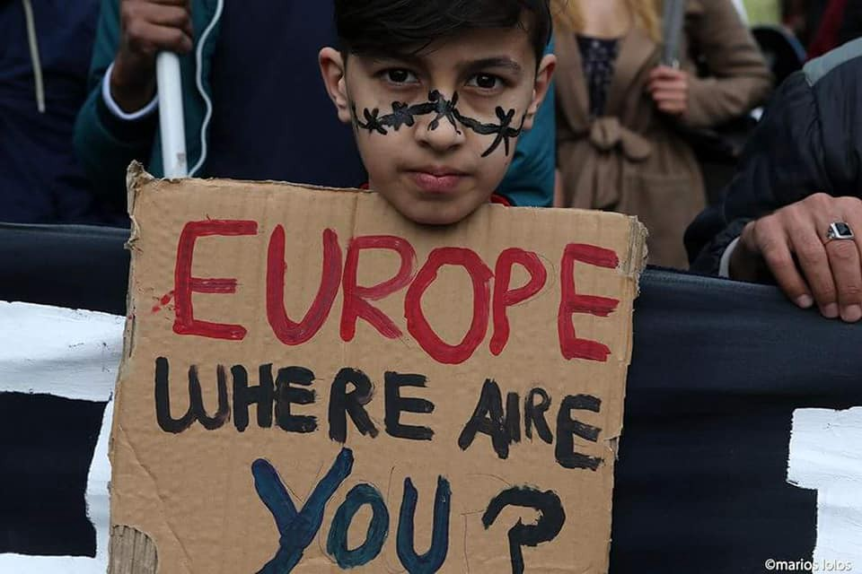

### AYS DAILY DIGEST 17/03/2018: Two years after the bloody deal that killed solidarity in Europe

_Deportations from Austria to Croatia continue with no respect to humanity/Civilian block in East Ghouta created/Criminalisation of solidarity: HoM and Founder of POA held for hours by Italian authorities/Testimonies from the survivors of the rescue operation in the Med/New members to be recruited for LCG/Demos all over Europe against racism, closed borders and dehumanisation of refugees/16 people confirmed dead after yesterday’s shipwreck/Balkan weather report/Dreadful conditions and heavy snow in Paris and Calais_

Credit: Marios Lolos

**FEATURE**

Two sisters from Afghanistan and their 3 children [have been deported](https://www.tolonews.com/afghanistan/austria-deports-afghan-sisters-children-based-eu-ruling) from Austria back to Croatia at the beginning of the week\.

They arrived in Austria in 2016 and, since then, have done everything they could to integrate in the Austrian culture, by learning German and enrolling the children in local schools\.

The reason for the deportation is obviously the Dublin regulation, as Austrian authorities claimed that the family should have applied for asylum in the first country of entrance\.

Even the European Court of Justice ruled in the case in July, stating that the Dublin regulation permitted countries to “ _unilaterally or bilaterally in a spirit of solidarity… examine applications for international protection lodged with them, even if they are not required to_ ”\.

Also lawyers supported the family, saying that the 2 women and the 3 children had integrated so well that they should have been allowed to stay in the country, which is continuously using this heartless policy against people in need\.

“ _We were sleeping in our room and then the police came_ ,” Jafari recalled, wiping tears from her face\. “ _I fled to my neighbor, and the police came to me with a dog and found us, and then they sent us here_ ”\.

Another [deportation](https://www.facebook.com/permalink.php?story_fbid=1832082373489098&id=100000620594847) from Austria to Croatia of a Syrian family is planned for today, but further investigation is needed to have a complete picture of the situation\. This is the information we have so far:

A Syrian family with 3 children is going to be deported to Croatia today\. The youngest child was born in Austria\. — As it seems, the Croatian authorities have not replied about whether the family has been registered in Croatia, and they are scheduled to be deported\. They have been in Austria for 2 years, and one of the children is receiving psychological treatment because of his trauma\.

**SYRIA**

The civilian block in Eastern Ghouta, formed by representatives of institutions, activists, humanitarian workers and local council’s members, has issued a [statement](https://www.facebook.com/ActForGhouta/posts/1888179467881223?hc_location=ufi) explaining the creation of the block\. The block aims to represent the voices of the civilians who have been silenced by the events in the besieged area\.

Meanwhile, according to the Portuguese [Expresso](http://expresso.sapo.pt/internacional/2018-03-17-Siria-Mais-de-150.000-pessoas-fugiram-de-Afrine-desde-quarta-feira#gs.IwoKXYU) , over 150\.000 people have left Afrin since Wednesday to escape the fury of the Turkish offensive\.

**SEA**

After landing in Pozzallo \(Sicily\) and during the disembarkment operations of the 216 people rescued in the past days, the Founder and the Head of the Mission of Proactiva Open Arms left the port escorted by the police\. Last updates say that the HoM was held for 6 hours at the police station, questioned by 9 agents, members of police and coast guard bodies, and the shipmaster was heard right afterwards and questioned for 5 hours\. They managed to get back to the ship late in the evening\.

■■■■■■■■■■■■■■ 
> **[Sergio Scandura](https://twitter.com/scandura) @ Twitter Says:** 

> > #migranti UPDATE/2 @[RadioRadicale](https://twitter.com/RadioRadicale) 🔴Dopo 6 ore al posto di Polizia c/o hot spot #Pozzallo, è appena uscita la Capo Missione ed è da poco entrato il Comandante della nave Ong @OpenArms_fund. Questa mattina sono portati via su una auto della Polizia durante le operazioni di sbarco. 

> **Tweeted at [2018-03-17 15:55:22](https://twitter.com/scandura/status/975037887849943041).** 

■■■■■■■■■■■■■■ 

■■■■■■■■■■■■■■ 
> **[Sergio Scandura](https://twitter.com/scandura) @ Twitter Says:** 

> > #migranti UPDATE/3 @[RadioRadicale](https://twitter.com/RadioRadicale) 🔴Ritornati sulla nave @OpenArms_fund: 6 ore per la capo missione e 5 per il comandante, al posto di Polizia presso l'hotspot #Pozzallo.

Questa mattina sono stati portati via su una auto della Polizia durante lo sbarco per essere 'interrogati'. 

> **Tweeted at [2018-03-17 20:33:35](https://twitter.com/scandura/status/975107902200602624).** 

■■■■■■■■■■■■■■ 

MEDU \(Medici per i diritti umani\) has published some [testimonies](https://www.facebook.com/MEDUonlus/posts/10156184035979817?hc_location=ufi) from the people disembarked in Pozzallo and of what they had to go through in Libya\.

7 people were taken to hospital; among them, a 16\-year\-old girl, unaccompanied, suffering physically and psychically and a woman with a dislocated hip, caused by a violent beating in Libya\.

The 216 people rescued affirmed to have been imprisoned in a building in the Zuwarah area, on the coast, for the last weeks and been beaten up by smugglers with sticks and other objects while getting up the boat\.

The [cooperation](https://www.libyaobserver.ly/inbrief/commander-operation-sofia-says-500-new-libyan-recruits-receive-training) between European authorities and the Libyan ones is stronger than ever, with the commander of the EUNAVFOR Med’s Operation Sophia, Enrico Credendino, stating that Europe has the will to increase the expansion of the training of the LCG, recruiting between 300 and 500 members in 2018\. He also added that more than 130 people suspected of being smugglers have been arrested and handed to Italian authorities\.

**EUROPE**

On the anniversary of the EU\-Turkey deal, Refugee Support Aegean and PRO ASYL have published an interesting study concerning the manipulation of the concept of “ _Safe Third Country_ ” as a way to stop and prevent refugee flows to Europe\. Legislative changes to national asylum procedures were implemented in order to comply with the deal and recognise Turkey as a safe third country, “ _paving the way for forced returns of refugees to Turkey_ ”\.

The full study can be found [here](http://rsaegean.org/stopthetoxicdeal-turkey-as-a-safe-third-country/)

Today, marches all over Europe have been held to demonstrate against any form of racism and fascism and for a more human and equal treatment of migrants:

Greece — Athens

Greece — Lesvos

Spain — Barcelona

France — Paris

UK — Cardiff

UK — London

**GREECE**

_Islands_

As previously reported, on the second anniversary of the EU\-Turkey deal, we received the news that a boat capsized off the Agathonissi island, counting 16 dead people, 5 of them the children, and 3 missing\. Just 3 of the 22 people on the boat managed to survive\.

AYS team members in Greece report that “ _The three survivors of today’s shipwreck are currently in hospital on Samos, where they are expected to stay for a few days\. They are supposed to be sheltered somewhere after this, either in Samos or Athens_ ”\.

[Samos Volunteers](https://samosvolunteers.org) also issued a statement regrading the tragedy, noting that it coincided with the two year anniversary of the EU\-Turkey deal:

> Today, at least 16 people drowned off the shore of Samos in their attempt to find safety in Europe\. At least six of the lives lost were children under the age of 5\. They won’t live to blow out five candles on their birthday cake, to learn how to read and write, or to live a life in peace and safety, away from war\. These people are not “irregular migrants”, they are women, children, young people, men, and families, trying to escape oppression and war\. 

> Two years after the commencement of the EU\-Turkey deal, a ‘most noble endeavor’ of Europe, it once again becomes clear that trapping people is in no way ‘an alternative’\. The stated goal of stopping refugees from risking their lives is a cynical lie\. The EU\-Turkey deal has only made the border more dangerous by making it more militarized and by criminalizing people who need protection\. Refugees need safe passage, and the opportunity to apply for asylum under a fair system, not more fences, guns, and patrol boats\. 

> We dedicate today to the people who lost their lives near the island of Samos, and to all those who have needlessly died on this journey\. In their memory, we stand against the EU\-Turkey deal, and re\-commit ourselves to the cause of solidarity and humanity\. 

_Mainland_

According to [this source](https://www.facebook.com/groups/eidomeni.refugee.support/permalink/1786977031609902/?hc_location=ufi) \(Greek only\), at least 2 people died when trying to avoid police checks in the Xanthi area, not far from Kavala \(northern Greece\), on Saturday morning\.

The driver, probably a smuggler, in the attempt to avoid a police blockade, speed up and lost control of the vehicle, ending the race in a nearby filed\. Two people are reported as victims and another 7 injured\.

Protest in solidarity with Afrin\.

■■■■■■■■■■■■■■ 
> **[Marianna Karakoulaki](https://twitter.com/Faloulah) @ Twitter Says:** 

> > Kurdish #refugeesGR lie on the street in front of the US consulate in #Thessaloniki in order to protest international indifference of the Turkish military operation 'Olive Branch' in #Afrin https://t.co/5UXxL91Sur 

> **Tweeted at [2018-03-17 17:33:47](https://twitter.com/faloulah/status/975062654300704769).** 

■■■■■■■■■■■■■■ 

[French translators](https://www.facebook.com/groups/informationpointforlesvosvolunteers/permalink/840208009519981/?hc_location=ufi) needed for medical program\.

Donations are needed for the “Brothers Campaign”, a new project by Refugee Biriyani & Bananas, aimed at collecting clothes for the men in camp\. If you can help, please see [here](https://www.facebook.com/RefugeeBiriyaniAndBananas/posts/1006647589493307?hc_location=ufi)

**BALKAN WEATHER REPORT for Sunday 18\.03**

**Montenegro**

Sunday will be variably cloudy with locally rain or rain showers with thunder from time to time, and during the night it will be overcast and rainy\. Towards the end of the day and during the night there will be rain changing into sleet and snow\. The wind will be moderate to amplified form time to time, blowing form the south\. In the morning the temperature will be form 1 to 12 and during the day from 5 to 17\.

**Serbia**

In Serbia it will be cloudy and noticeably colder with locally rain and in the mountains snow\. Towards the end of the day and during the night snow is expected in the north and south\. The wind will be moderate to strong blowing from the northeast\. The lowest temperatures will be \-1 in the north and 9 degrees in the south, the highest daily will be from 2 in the north and 12 in the south\.

**BiH**

In Bosnia an Herzegovina for the most part it will be cloudy with occasional rain in some places\. Precipitation is expected in the morning hours and before noon as well as towards the end of the day and during the night from Sunday to Monday\. In Herzegovina there will be rain and in Bosnia rain gradually turning into sleet and snow\. The wind will be weak to moderate, in Bosnia from the southeast and in Herzegovina from the south and southwest\. Morning temperatures will be ranging from 1 to 11 and during the day it be from 7 to 15 degrees\.

**Croatia**

Land inwards it will be cloudy with locally some snow, mainly in the mountains\. Alongside the coast it will be variably clouds with periods of sun, locally there will be occasionally rain and rain showers\. The wind for the most part will be moderate blowing from the northeast, alongside the coast increasingly strong northwestern and in Dalmatia strong southern in alteration\. In the morning the temperatures will be from \-3 to 12 and during the day from 0 to 14 degrees\.

**BOSNIA**

[Cars of Hope](https://cars-of-hope.org/2018/03/17/cars-of-hope-in-sarajevo-bosnien/) \(German charity\) has been supporting refugees since 15th March\. They have arranged a place to stay in a house for 45 refugees in cooperation with local initiatives and international supportes\.

They will start building a kitchen on Monday for these refugees as well as people living on the street\.

From April on, CoH will continue their work in Lesvos\.

They are asking for donations for both projects\.

**FRANCE**

_Paris_

When will Europe held responsible for this violence? Increasing tensions among people on the move held in miserable conditions and deprived of basic human rights are evident and about to develop further\.

Moreover, weather is not indulging on these people\. Plastic covers are needed\! \!

_Calais_

“ _Yesterday we encountered a group of teenage refugees in Calais wearing flip\-flops instead of shoes\. This week we have seen refugees with no tents, and no sleeping bags\. Out in the open\._

_It is now snowing in Calais, tonight it will be \-5 degrees celsius — with a bitterly cold wind blowing from the East_ ”\.

More than 500 people are sleeping rough in these conditions\.

**GENERAL**

> **We strive to echo correct news from the ground through collaboration and fairness\.** 

> **Every effort has been made to credit organizations and individuals with regard to the supply of information, video, and photo material \(in cases where the source wanted to be accredited\) \. Please notify us regarding corrections\.** 

> **If there’s anything you want to share or comment, contact us through Facebook or write to: areyousyrious@gmail\.com** 

_Converted [Medium Post](https://medium.com/are-you-syrious/ays-daily-digest-17-03-2018-two-years-after-the-bloody-deal-that-killed-solidarity-in-europe-d82aa96290ad) by [ZMediumToMarkdown](https://github.com/ZhgChgLi/ZMediumToMarkdown)._
