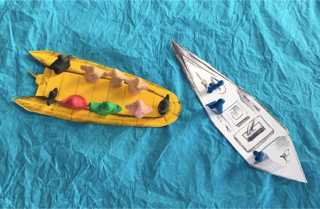
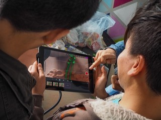

### AYS SPECIAL on two years of EU\-Turkey Deal: Refugees Stopped in Motion

_Two years since the EU\-Turkey deal was implemented, and the world continues to warm, wars continue to hurt, and people are continuing to be forced onto the move\. Perhaps it is time to acknowledge that fortification and exclusion are not working\. Hannah Wallace Bowman from Lighthouse Relief Hellas writes for AYS on the deal and its consequences\._

_“In this video, the refugees want to come into a European country\. The police of Turkey want to attack the refugees — they come in front of the refugee boat and crash into them\. Most of the refugees fell into the water\. Maybe five people or ten people died\. I was in the water too, but I had a life jacket” —_ Satar, 16 years old, Afghanistan\.

Satar arrived in Greece by way of Pakistan and Iran, crossing the Aegean Sea in a rubber boat\. He eventually made it to Lesvos on his second attempt, just over four months ago\. I met him during a workshop at [Gekko Kids in Mytilene](http://www.euronews.com/2017/11/20/school-for-refugee-minors-on-greek-island) , an education centre for unaccompanied young refugees on the island\. He was participating in a session learning how to use stop\-motion film for storytelling\.

His animation entitled “refugee” is, he explains, autobiographical — and tells of the first time he tried to reach Europe from Turkey\. Before the dinghy he was travelling in could reach Greek waters, it was violently intercepted by the Turkish Coast Guard: “I saw that\. That was a very bad disaster I see in my life\. And I will never forget that\.”

During my time working in Emergency Response on the North Shore of the island, I had heard similar accounts from the new arrivals regarding their crossings from Turkey\. I was also aware, from figures published by the UN and Turkish authorities, that the situation Satar was depicting through his film was not unusual\. In January 2018 alone, for example, the UNHCR reported 38 boats — carrying 1369 people in total — were prevented from reaching the Greek border\.

Yet statistics do little to communicate how somebody may experience an interception\. So when Satar showed me his 30 second clip and I was faced with the violent reality of the agreement, visually and unequivocally articulated somebody who had experienced it, I found myself speechless\.

It is now two years since the EU\-Turkey statement was implemented: Two years since Europe outsourced its responsibility for migration to border forces beyond its perimeters; two years since Turkish authorities were sanctioned to use “any necessary measures” to prevent migrants and refugees from reaching Europe; two years since thousands of people were condemned to a state of waiting in Greece\.

Yet, for most people, the “EU\-Turkey statement” remains little more than an abstract phrase\. Which is probably not hugely surprising considering this is not a story that makes the headlines too often, and when the media seemingly totally unwilling to make the harsh reality of the agreement understandable and accessible\. For example, whenever I try to pitch a story relating to the real\-world implications of the deal, a common refrain amongst journalists and news outlets is that the “refugees in Greece thing” is not really news anymore\.

Somewhat ironically, however, those same journalists continue to misrepresent or ignore the voices of refugees themselves within their overarching narrative regarding migration, preferring to categorise refugees and displaced people according to one of two identities: victims or a danger to society\.

Which is, of course, inaccurate\.

Promoting the voices and creativity of these children and young refugees is therefore one of the driving initiatives behind the stop\-motion project, led by Lighthouse Relief and supported by Storytelling Without Borders \(StWB\) \.

“Refugee” was just one of the films created during the five\-day workshop\. Some, like Satar’s, were anecdotal\. Others were funny\. Others were sad\. Or magical\. Or downright whimsical\.

They did all have one thing in common, however: they were all proudly and unambiguously, their own\.

By leveraging animation and storytelling through a similar series of workshops on mainland Greece and Lesvos, [Lighthouse Relief](https://www.lighthouserelief.org/) hopes to further support young people in telling their own stories in their own way\.

“As youth facilitators, our goal is to provide tools to the young people we work with to empower and support them in telling their own stories\. This project is an amazing model of how we can work with youth regardless of cultural or language differences, through the use of basic technology and extraordinary imagination,” says Daphne Morgan, StWB Manager\.

Lighthouse Relief’s involvement in this project builds on the success of the Youth Engagement Space \(YES\) in Ritsona camp, and the creation of the [Ritsona Kingdom Journal](https://www.lighthouserelief.org/ritsona-kingdom-journal/) , a magazine that allows young refugees to tell their stories in their own voice, and in their own way\.

The magazine features a selection of thought\-provoking artworks, articles, poems and photographs that bear witness to diversity and talent\. Young people in the camp enthusiastically drove every stage of the publication’s development, from content creation to graphic design\.

One of the driving forces of creative energy behind this initiative is 16\-year old Hamza from Syria\. Although he hasn’t had access to formal education over the last few years, in the future he plans to study Human Rights\.

Like Satar, he has recently produced a thought provoking piece simply called “Refugee,” an article calling for the relinquishing of prejudice, in favour of solidarity and understanding of a shared humanity:

_“Refugees are normal people\. In my opinion, there is no difference between colours and religions — we are all humans\. Refugees are not killers: they invent, they build, they think\. And if you think negatively about refugees, come and meet us\. Know us and what we do\. You will discover that we are normal people”\._

Not that I am entirely sure what defines somebody as “normal” — and although the political and economic interest underpinning of attitudes toward migration cannot be ignored — Hamza makes a solid point: aren’t we are all humans, in the end?

Two years since the EU\-Turkey deal was implemented, and the world continues to warm, wars continue to hurt, and people are continuing to be forced onto the move\.

Perhaps it is time to acknowledge that fortification and exclusion are not working\. People like Hamza and Satar are not a “crisis” to be managed\. Instead, their stories need to be seen, and to be heard\.

This is not really about differences between ‘us and them’: Europe’s refugee crisis is existential\.

**_Hannah Wallace Bowman is currently Head of Communications and Partnerships for Lighthouse Relief Hellas\. Over the past year, she has spent time based on both mainland Greece as well as Lesvos, leveraging her international experience in development, journalism and campaigns to reframe the debate around refugees and displaced people\._**

**About Lighthouse Relief**

Lighthouse Relief was founded in 2015, at a time when thousands of refugees were arriving on the Greek island of Lesvos every day\. Two and a half years later, our team of skilled volunteers continue to provide immediate humanitarian relief for those landing on the north shore of the island, as well as longer\-term programming for young people and children in Ritsona refugee camp in mainland Greece\. Alongside our field operations, we see media as a powerful way of amplifying the voices of our beneficiaries, drawing attention to the forgotten reality of Europe’s borderlands with an increased focus on storytelling and advocacy\.

**Storytelling without borders**

Storytelling without borders is a creative and intersectoral partnership between six creative arts and humanitarian organizations in Sweden, Greece and Denmark\. The Swedish organisation Historieberättarna is the founder of the project and Filmcentrum is the coordinating partner\. Filmmaking with the help of animation makes it possible to communicate despite language barriers\. The workshops will be held in refugee housing/camps and therefore provide a safe environment where the participants can discover their own voices and express their stories\.

> **We strive to echo correct news from the ground through collaboration and fairness\.** 

> **Every effort has been made to credit organizations and individuals with regard to the supply of information, video, and photo material \(in cases where the source wanted to be accredited\) \. Please notify us regarding corrections\.** 

> **If there’s anything you want to share or comment, contact us through Facebook or write to: areyousyrious@gmail\.com** 

_Converted [Medium Post](https://medium.com/are-you-syrious/ays-special-on-two-years-of-eu-turkey-deal-refugees-stopped-in-motion-527b15d4b1e) by [ZMediumToMarkdown](https://github.com/ZhgChgLi/ZMediumToMarkdown)._
