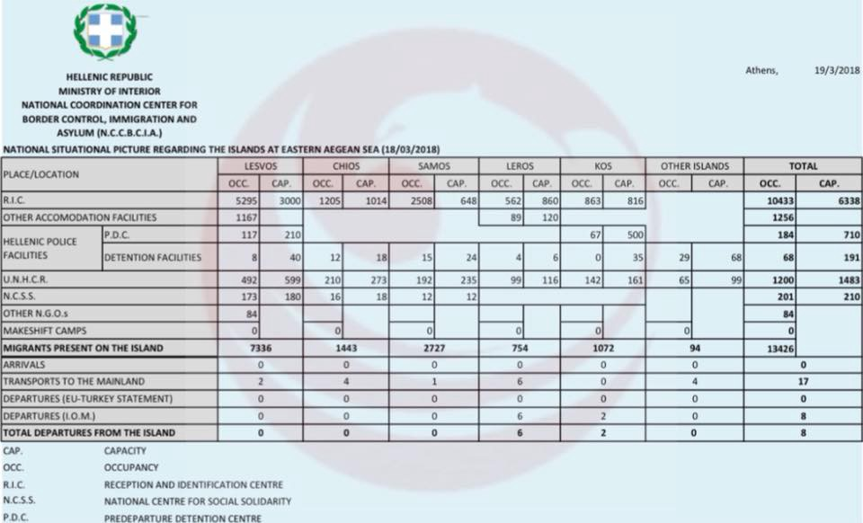
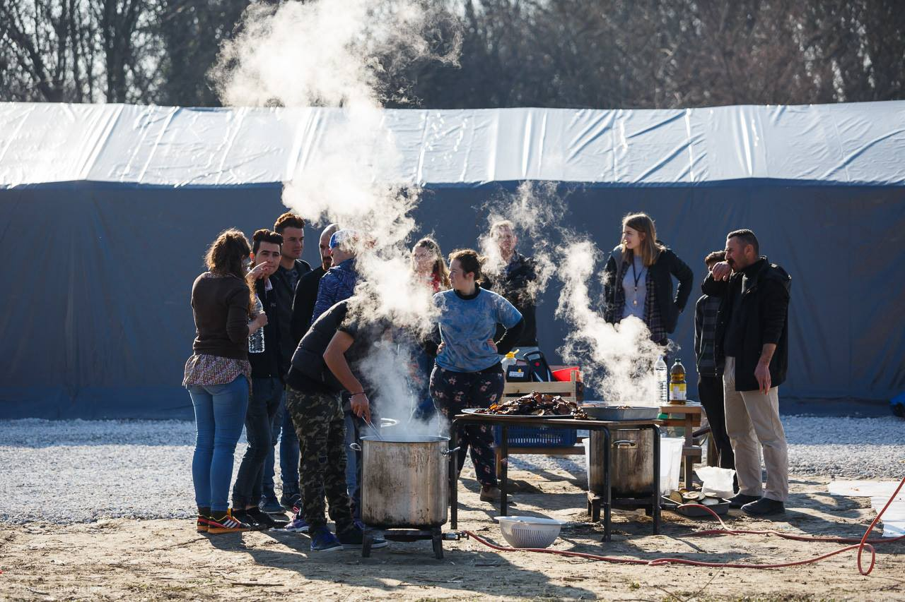

### AYS Daily Digest 19/03/18 — Free Open Arms

_Rescue ship seized in Italy//Civilians massacred in East Ghouta//Overcrowding on the Islands//Update from Samos//Rights Groups Investigate Asylum Process in Greece//Donations needed on Lesvos and in Paris//Rescue on the Evros River//Abuse of Refugees in Paris//and more…_

](assets/acab2a1a7fa8/1*rxbrccBogs5ZQkbpm4HHxQ.jpeg)

Graphic Credit: [FOTOMOVIMIENTO 15M](https://www.facebook.com/Fotomovimiento.org/)
#### Feature — Sea Rescue is Not a Crime

Yesterday Italian authorities seized the vessel of the sea\-rescue organization [Proactiva Open Arms](https://www.facebook.com/proactivaservice/) \. Following on the heels of elections in Italy which brought more far\-right parties to power, this attack on a humanitarian group sends an alarming signal\. “Finally, an Italian prosecutor who blocks human trafficking,” said Matteo Salvini, the leader of Italy’s anti\-refugee League party\.

Does “blocking human trafficking” mean sending people back to prison camps where they will be ransomed, enslaved, and raped? In the eyes of Italy and the EU, the answer increasingly seems to be yes\.

A Sicilian court impounded the ship on charges that the group had “helped illegal immigration” by refusing to turn over refugees to a Libyan Coast Guard vessel \(LCG\) after rescuing them\. As AYS and many other outlets have reported, the LCG has routinely engaged in violent and criminal behavior, such as attacking and even shooting at drowning refugees\.

Proactiva reported that during the rescue operation the LCG [threatened to shoot at the dinghies](https://www.telegraph.co.uk/news/2018/03/19/italy-impounds-rescue-vessel-crew-refuses-hand-migrants-libya/) if they did not hand the refugees over to them\. After a tense three hour negotiation with the LCG, Proactiva defied their orders and headed to the port of Pozzallo in Sicily\.

 crew after a mission, 14\.03\.18\. “Nothing has been easy for this team who, after a difficult break, have rescued more than 200 people in the Mediterranean, with bearing the terrifying scars of extreme suffering in Libya\. Thank you for being light in the most inhuman darkness\.”](assets/acab2a1a7fa8/1*O98nsyUj7cZjmCVM-rvrJw.jpeg)

The [Proactiva Open Arms](https://www.facebook.com/proactivaservice/photos/a.232810050083187.63417.111995985497928/1827202577310585/?type=3&theater) crew after a mission, 14\.03\.18\. “Nothing has been easy for this team who, after a difficult break, have rescued more than 200 people in the Mediterranean, with bearing the terrifying scars of extreme suffering in Libya\. Thank you for being light in the most inhuman darkness\.”

As the sea rescue group [MoChara wrote today](https://www.facebook.com/RefugeeRescueUK/photos/a.1209475672453214.1073741828.1206400986094016/1656976687703108/?type=3&theater) , “After resisting the Libyan Coast Guard and refusing to hand over women and children on board, they are being criminalized for protecting human lives at sea — a task that according to maritime law should be the highest priority of any civil or military organization\.

> Sea rescue is not a crime\! Sea rescue is a human right\!” 

](assets/acab2a1a7fa8/1*1bAH-EMNxDE2r0dspcYoEg.jpeg)

A Proactiva rescue operation in the Mediterranean, 20\.03\.18\. Photo Credit: [Proactiva Open Arms](https://www.facebook.com/proactivaservice/?hc_location=group_dialog)

Amnesty International blasted the Italian authorities today for their actions, saying that the seizure showed “reckless disregard for human decency”\. From Amnesty’s [statement](https://www.amnesty.org/en/latest/news/2018/03/italy-targeting-of-ngo-rescue-ship-displays-reckless-disregard-for-common-decency/) :

> The Italian authorities are once more revealing where their true priorities lie: namely shutting off the central Mediterranean route, with scant regard to the suffering caused\. This appears to mark yet another step towards the outsourcing to the Libyan Coast Guard of the patrolling of the central Mediterranean\. 

For their part, Proactiva Open Arms vowed to fight these outrageous charges, and to continue their life\-saving work in the Mediterranean\.

> We are guilty of saving 59,000 lives\. Even if the world has gone mad, with your support we will fight to the end\. For them, for all the people who have no voice in the sea\. And for their rights, which are also ours\. 

### Sea

Aegean Boat Report released the [latest statistics](https://www.facebook.com/AegeanBoatReport/photos/a.285312485325196.1073741828.285298881993223/321471235042654/?type=3&theater) from the Turkish Coast Guard \(TCG\) today\. The TCG intercepted and forcibly retunred 203 people trying to flee the country from 16 to 18 March\.
### Syria

Thousands of people are dying in Eastern Ghouta\. In the last month alone, a reported [1,699 people have been killed](https://www.facebook.com/middleeastmonitor/posts/10156293557036926) \. The atrocities in Ghouta have not been receiving nearly as much attention as the attacks on Raqqa and Aleppo\. Let us not forget about the immense suffering of the Syrian people, especially at a time when many are claiming that the war is “winding down”\.
### Greece
#### Islands

This week marks the two year anniversary of the bloody EU\-Turkey deal\. A number of organizations have been putting out statements marking this anniversary, and publishing some of their recent findings on the awful long term effects of this deal\. As the group [Samos Volunteers](https://www.facebook.com/samosvolunteers/) wrote today, “We want to dedicate this week to the consequences of the EU\-Turkey Deal and highlight the atrocities and violations of human rights that came with it\.”

■■■■■■■■■■■■■■ 
> **[MSF Sea](https://twitter.com/MSF_Sea) @ Twitter Says:** 

> > At the 2nd anniversary of the #EU #Turkey deal people continue to die in #Aegean sea. Those who survive the crossing continue to be trapped in overcrowded centers on #Greek islands, fearing deportation. 

#EU leaders have really nothing to celebrate. https://t.co/1WAzeDAMjD 

> **Tweeted at [2018-03-19 08:47:33](https://twitter.com/msf_sea/status/975655000591433728).** 

■■■■■■■■■■■■■■ 

The inhuman conditions refugees are being forced to live in on the Aegean islands are a direct result of this deal\. Greek and EU authorities have created a policy of trapping refugees on the islands to make the process of deporting them back to Turkey easier\. Except in extreme cases, no one is allowed to leave these hellish island camps until they been granted asylum\. For many, this process can take up to a year or more\.

As Human Rights Watch wrote in a [report](https://www.hrw.org/news/2018/03/19/why-greece-should-opentheislands) today, “By the latest count, \[there are\] more than 13,000 people are on the Greek islands, many of them in vastly overcrowded centers…\. Members of vulnerable groups — including pregnant women, older people, unaccompanied children, single parents with children, victims of torture or sexual or gender\-based violence, and people with disabilities — and people eligible to be reunited with family members already in the EU are supposed to be exempt\.”

But as HRW found in their report, many people who are part of these vulnerable groups are not receiving any protections and remain trapped in the island camps\. Furthermore, many women are being exposed to sexual violence as a result of Greece’s policy\. As HRW wrote, “Women and girls say they experience sexual harassment and threat of violence daily, deterring them from leaving their shelters or even going to the bathroom alone\. They express little confidence that Greek authorities would help or protect them if they report incidents\.”

These are just some of the consequences of this bloody deal\. Thousands and thousands of lives have been stalled by this deal, and traumatized persons have only become further damaged by the awful conditions in the island camps\. The deal has also made the Mediterranean crossing even deadlier trhough increased militarization of the border\. While the EU claims to fund Turkey to support refugees in the country, the reality is that many refugees there are overlooked and oppressed\. There is almost no oversight of the EU funds going to Turkey\.

It is time to end this brutal agreement and open the islands\.

Photo Credit: Aegean Boat Report

Aegean Boat report released the latest figures from the Greek Interior Ministry on the number of people who are trapped on the Aegean islands\. The numbers themselves show some of the cruel effects of the EU\-Turkey deal\. According to the data from the ministry, all of the island camps, with the exception of Leros, are over capacity\. Samos is currently the most over\-crowded, with a reported 2,508 people crammed into a hill\-side camp intended for 648\.

However, there is something strange about these numbers\. They are vastly different from the weekly UNHCR snapshots of the number of people living in the camps\. For example, the latest UNHCR snapshot for Samos stated that there are around 1,500 people living in the camps, not 2,500\. Some sources on the ground have suggested that the UNHCR numbers may be more accurate, as they checked with more sources\. The large discrepancy between these numbers is certainly puzzling and something we would like to know more about, and indicates a level of confusion and miscommunication on the ground between UNHCR and Greek officials\.

The AYS team has received further updates on the shipwreck that occured near the island of Samos this week\. Every one of the three survivors lost members of their immediate family\. One man from Iraq lost his wife and two children in the shipwreck\. One woman lost her husband and two children, and the other survivor lost her sister and her sister’s family\.

Our hearts break for this tragic incident, but we refuse to call it an “accident”\. This shipwreck was the result of the brutal policies of Greece and the EU\. These deaths are the result of a deal that forced millions of people trapped in Turkey to pursue ever\-more dangerous routes to safety\.

The EU\-Turkey deal did not stop the smuggling of refugees, as its authors claimed\. It empowered smugglers by closing off safe and legal routes to Europe\. And this is the result\.

■■■■■■■■■■■■■■ 
> **[InfoMigrants](https://twitter.com/InfoMigrants) @ Twitter Says:** 

> > The Greek migration minister has called on authorities to open safe routes for migrants after 16 people drowned in the Aegean Sea on Saturday. 
#aegean islands #migrants #Drowning
[bit.ly/2pmJE88](http://bit.ly/2pmJE88) https://t.co/89uufI1VCz 

> **Tweeted at [2018-03-19 11:00:00](https://twitter.com/infomigrants/status/975688331848658944).** 

■■■■■■■■■■■■■■ 

The European Ombudsman will open an investigation into the practices of the European Asylum Office \(EASO\) in response to a complaint filed by rights groups\. EASO is the EU agency which conducts asylum interviews on the Aegean islands, and then makes a recommendation to the Greek authorities on whether to grant asylum\. Activist and legal groups on the ground have long been reporting on the arbitrary and unjust asylum process on the islands\. Among many issues with the procedures, asylum applicants are rarely informed of their rights prior to the first interview, which is the most important of the process\.

Based on an analysis of the asylum process on the islands, the [European Center for Constitutional and Human Rights](https://www.ecchr.eu/en/home.html) \(ECCHR\) has concluded that “EASO officers fail to respect core standards of fairness\.”

In their [report](https://www.ecchr.eu/en/international-crimes-and-accountability/migration/greek-hotspots.html) , ECCHR writes: “The interviews do not permit a fair assessment of individual cases, they do not give room for a thorough investigation of vulnerability and they lack a critical evaluation as to whether Turkey qualifies as a safe third country for the person concerned\.
 
Thereby EASO not only violates its own guidelines for conducting interviews, but its involvement in the procedure goes beyond the scope of its powers under EU law\. Consequently, applicants for international protection are deprived of a fair hearing and denied the chance to present and substantiate their asylum case\.”

Over 35 minors were protesting in Sappho Square on Lesvos today against the arbitrary detentions taking place on the island\.

The Project Hope Warehouse on Lesvos has put out a call for donations\. There have been over 600 newly arrived people on the island in the past six weeks, and the group is running low on funds as they are struggling to support refugees on the island —

> In the last three years we have helped hundreds of thousands of refugees, we have clothed, given medical supplies, we have built a gymnasium and a medical centre, we have supported many other projects and small NGO’s\. However, we are not an NGO \(non governmental organisation\) and receive no financial support from governments and are only supported by people with big hearts\. 

You can donate online [here](https://mydonate.bt.com/fundraisers/thehopeproject) , or find their banking information [here](https://www.facebook.com/HopeProjectKempsons/videos/2039771339637321/?permPage=1) \.

The group also released a video showing the awful conditions in the Moria camp on Lesvos, which you can watch [here](https://www.facebook.com/HopeProjectKempsons/videos/2040146159599839/) \. Based on reports from refugees and aid workers in the camp, it is perhaps the worst on the Aegean islands\.
#### Mainland

We are forwarding a message from the [Khora](https://www.facebook.com/KhoraAthens/posts/857125591126717?hc_location=ufi) Social Center in Athens about an exciting new initiative that is housing refugees living in the city:

> Every day at Khora we see thousands of displaced people facing homelessness\. 

> Athens is filled with people who have a right to shelter and have waited too long in a system that continues to ignore their basic human\-rights\. Too often this tends to be young men alone in Greece, people who do not fall under simplistic “vulnerability” criteria\. The Greek government, and iNGOs such as the UNHCR, who are obligated by EU law to house all asylum seekers, are not only breaking international law, but also exposing these men to crime, violence, drug abuse and sexual exploitation whilst they live on the streets\. 

> For this reason we are really happy to hear about Mazí, a project that will give a home to five young and homeless displaced men in Athens\. We need more grassroots projects, collectives and movements like [Mazí Housing Project](https://www.facebook.com/mazihousingproject/?fref=mentions) that challenge harmful narratives and instead offer positive and practical solutions\! Find out more about the project and donate what you can [here](https://chuffed.org/project/mazi-housing-project-help-us-provide-a-home-tosupport-young-men-displaced-in-athens) \. 

According to the [City Plaza](https://www.facebook.com/cityplazaathens/photos/a.1558667751094726.1073741830.1546516778976490/1782378518723647/?type=3&theater) group, a group of Kurdish political refugees have announced that they will begin a hunger strike today in solidarity with Afrin\. The strike will take place opposite the Greek parliament\. From the statement of the strikers:

](assets/acab2a1a7fa8/1*1ShwsItoRamWpifikgiryA.jpeg)

Photo Credit: [City Plaza](https://www.facebook.com/cityplazaathens/photos/a.1558667751094726.1073741830.1546516778976490/1782378518723647/?type=3&theater)

> \[Following the Turkish inavion of Afrin\], there was looting, torture, and decapitations of Kurdish fighters, and the expulsion of 200,000 civilians, the majority of whom are now in the surrounding mountains deprived of food and water, physically and mentally injured by the orgy of violence and brutality\. 

> We, as Kurdish political refugees living in Greece, declare that our soul and our mind are with our brothers and sisters in Afrin\. 

> We ask for the solidarity of the Greek people and we start today 19/3 a hunger strike in front of the Greek Parliament, demanding from the Greek government to finally take a position; the Greek government, which unfortunately, like its allies in the EU and NATO, has remained neutral and unmoved in front of these developments\. 

The [NoBorders](https://www.facebook.com/nobordersnetwork/) network reported today that 18 refugees were rescued from the Evros river on the Greek\-Turkish land border due to the intervention of some fireman\. The vehicle they were crossing in had become stuck in the water\.

](assets/acab2a1a7fa8/1*SpjJc4STaChanmW2ngRKHg.jpeg)

Photo Credit: [No Borders](https://www.facebook.com/nobordersnetwork/)

Today Mobile Info Team Greece published a guide to purchasing family reunification tickets, and outlining problems with the process currently\. The report is available in Farsi, Arabic, and English\. Click here to [read](https://www.facebook.com/mobileinfoteam/photos/a.1800063030222418.1073741830.1796286800600041/2140986252796759/?type=3&theater) \.

The Zaatar Social Center just released their new schedule of classes \(including guitar lessons and Greek language classes\) \. Click [here](https://www.facebook.com/zaatarngo/posts/1735311793155823) \.

Photo Credit: Lifting Hands International

> WAREHOUSE AND DISTRIBUTION VOLUNTEERS NEEDED: [Lifting Hands International](https://www.facebook.com/liftinghandsinternational/?fref=mentions) needs people to join our warehouse team in Serres, Northern Greece\. 

> You will be part of a great team that coordinates food, hygiene and clothing aid for Yazidi refugees of all ages\.
 

> We ask for a minimum time commitment of 30 days and can offer housing in the centre of Serres for 5 euros per night\. 

> For more info, please email greecevolunteer@liftinghandsinternational\.org 

### Balkan Weather Report \(for 21\.03\.18\)

Montenegro

It will be moderately to entirely cloudy in Montenegro, from time to time there will be rain or rain showers with thunder\. In the north and in the higher mountains there will be snow and sleet, and in the lower parts rain and snow\. Late in the night there will be strong rains throughout the country\. The wind will be moderate to strong blowing from the south and during the night locally from the north\. The morning temperature will be from \-3 to 10 and during the day from 2 to 14 degrees\.

Serbia

Mostly cloudy and cold in Serbia with light rainfall and snow\. In the east and southeast it will clear up during and it will be mostly dry\. The wind will be weak to moderate blowing from the southwest\. During the night in the east and southeast there will be cloud formations with mainly intense snow\. The lowest temperature will be from \-3 to 1 and the highest daily from 2 in the north to 8 degrees in the southeast\.

Bosnia

Tuesday will be cloudy with mainly rain or sleet in Bosnia and in Herzegovina\. The wind will be weak, in Bosnia blowing from the north and in Herzegovina for the most part of the day from the southeast turning to the north towards the end of the day\. The lowest morning temperature will be form \-3 to 0 and in the south from 4 to 8 degrees\. The highest daily temperature will be around 8 to 12 degrees in the south\.

Croatia

In Croatia it will be predominantly cloudy\. In Dalmatia there will be passing clouds with occasionally rain or some rain showers, during the night and in the morning there will be locally snow in the mountains\. In the evening there will be increased cloud formations with more precipitation towards the end of the day\. Land inwards the wind will be weak to moderate blowing from the north and northeast\. Alongside the coast locally moderate and towards the evening strong wind and at the foot of Mount Velebit with stormy gusts\. In Dalmatia first a moderate to strong northwestern and western wind will be blowing locally turning to a strong southern wind in the evening\. The lowest morning temperature will be from \-6 to \-1 and alongside the coast from 2 to 7 degrees\. The highest daily temperature will be form \-1 to 4 land inwards and form 7 to 12 degrees alongside the coast\.
### Italy

Refugees from the Pordenone region are reporting unbearable conditions on the ground\. Many refugees are still living on the street, and facing freezing rains with only a thin plastic sheet to cover their tents\.

A refugee living in the Pordenone area shows his breaking shoes\. Photo Credit: 
Lorena Fornasir\.
### France

The group Sciences Po Refugee Help has put out a call for volunteer translators for their work on a guide to Paris for refugees\. They are looking for people who can translate Farsi, Urdu, Tigrinya, Amharic and Somali\. You can contact them on their page [here](https://www.facebook.com/sciencesporefugeehelp/?hc_ref=ARSTcWRRYJF02IKTSVds0J93W0dt3WmJ_v-xPlXad5hLdKbbweQcKtWqpcX4qk9gqgw&fref=nf&hc_location=group) \.

There were sub\-zero temperatures in Paris tonight, making life for the more than 1,500\+ refugees sleeping rough in the city even harder\. It is expected to be similarly cold throughout this week\.

[Lola Siran](https://www.facebook.com/FacesBeforeNumbers/) , an independent volunteer currently in the capital described the situation of a young Eritrian man who recently arrived there:

> Semere comes from Eritrea & arrived in Paris four days ago after crossing Sudan, Libya and the Mediterranean Sea to seek safety\. 

> He sleeps in a tent amongst hundreds of other men & women under a bridge\. 

> It’s snowing & freezing and his feet are wet\. He has to dry his socks, shoes, and blanket over a fire\. 

> It’s 4pm & Semere as well as the hundreds of other persons haven’t eaten anything all day\. 

The UK\-based human rights organisation [Refugee Rights Europe](http://refugeerights.org.uk) released a shocking report, “ [Still on the Streets](http://refugeerights.org.uk/wp-content/uploads/2018/03/RRDP_StillOnTheStreets.pdf) ”, describing the abuse refugees in Paris face\. Among their findings:

](assets/acab2a1a7fa8/1*CAP2M8VAi1LMhzctPkwvOg.png)

Graphic Credit: [Safe Passage](https://www.facebook.com/SafePassageInt/)

**— 75% of respondents had experienced verbal abuse by French citizens**

**— 5% of the people polled reported being sexually abused by French citizens**

**— More than 10% of the people said they knew at least one refugee who died while in Paris**

**— More than one third respondents had experienced police violence**

**— 86% said they had been tear gassed by the police at least once**

](assets/acab2a1a7fa8/1*sBZuJhqjsUYd-kuYLqFBtQ.jpeg)

Paris, 20\.03\.18\. Photo Credit: [Paris Refugee Ground Support](https://www.facebook.com/PRGS.team/)

The [Paris Refugee Ground Support](https://www.facebook.com/PRGS.team/?hc_ref=ARTF1uMrrc2kE_taafKX2bE-pUSShHl8d33ffmEDqhcclJxL56Wxdudyfzb-jXVpua0) volunteer team has put out an urgent call for donations\. They are in need of tents, sleeping bags, duvets, blankets, tarpaulins, winter jackets, and other winter clothing items\. Contact them via their [page](https://www.facebook.com/PRGS.team/?hc_ref=ARTF1uMrrc2kE_taafKX2bE-pUSShHl8d33ffmEDqhcclJxL56Wxdudyfzb-jXVpua0) for more information or donate [here](https://www.gofundme.com/4dwnptc) \.

The Norwegian based volunteer group [Drop in the Ocean](https://www.facebook.com/drapenihavet/posts/2015461981804574) put out a call for donations for their work in Paris\. They urgently need funds for tents and blankets as well\. You can find more details [here](https://www.facebook.com/drapenihavet/posts/2015461981804574) \.
### Netherlands

![“Watch The Med Alarm Phone Netherlands transfers the EU’s external borders to the ‘government pond’ in The Hague\. Around 30 people installed thousands of life\-vests in the pond next to the Dutch parliament\. The vests come from the Greek island Lesvos and were used by those on their way to Europe\. With this action we demand freedom of movement for all, two years after the EU\-Turkey deal\. We call on the European Commission, the EU Parliament and member states to end the drowning of migrants in the Mediterranean\.” Photo Credit: [Watch the Med — Alarmphone](https://www.facebook.com/watchthemed.alarmphone/)](assets/acab2a1a7fa8/1*TFizlnxNKpMWuxbasZT0zw.jpeg)

“Watch The Med Alarm Phone Netherlands transfers the EU’s external borders to the ‘government pond’ in The Hague\. Around 30 people installed thousands of life\-vests in the pond next to the Dutch parliament\. The vests come from the Greek island Lesvos and were used by those on their way to Europe\. With this action we demand freedom of movement for all, two years after the EU\-Turkey deal\. We call on the European Commission, the EU Parliament and member states to end the drowning of migrants in the Mediterranean\.” Photo Credit: [Watch the Med — Alarmphone](https://www.facebook.com/watchthemed.alarmphone/)
### UK

A Bristol women is facing terrorism charges and the threat of life in prison for stopping a deportation flight taking off from a private runway in England\. Ruth Potts was among a group of 15 activists who laid in front of a charter flight which was deporting people to African countries\. Currently, hundreds of people are being deported from the UK who migrated there as children\.

The Migrants’ Rights Network recently published a guide to your rights in the UK for refugees and migrants\. You can read it on their website [here](http://www.f-a-s-t.eu/wp-content/uploads/2017/10/Hostile-Environment-WEB-1.pdf) \.

> **We strive to echo correct news from the ground through collaboration and fairness\.** 

> **Every effort has been made to credit organizations and individuals with regard to the supply of information, video, and photo material \(in cases where the source wanted to be accredited\) \. Please notify us regarding corrections\.** 

> **If there’s anything you want to share or comment, contact us through Facebook or write to: areyousyrious@gmail\.com** 

_Converted [Medium Post](https://medium.com/are-you-syrious/ays-daily-digest-19-03-18-free-open-arms-acab2a1a7fa8) by [ZMediumToMarkdown](https://github.com/ZhgChgLi/ZMediumToMarkdown)._
