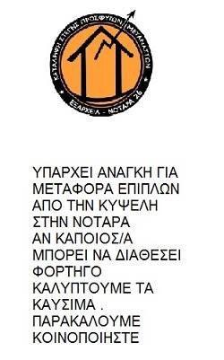
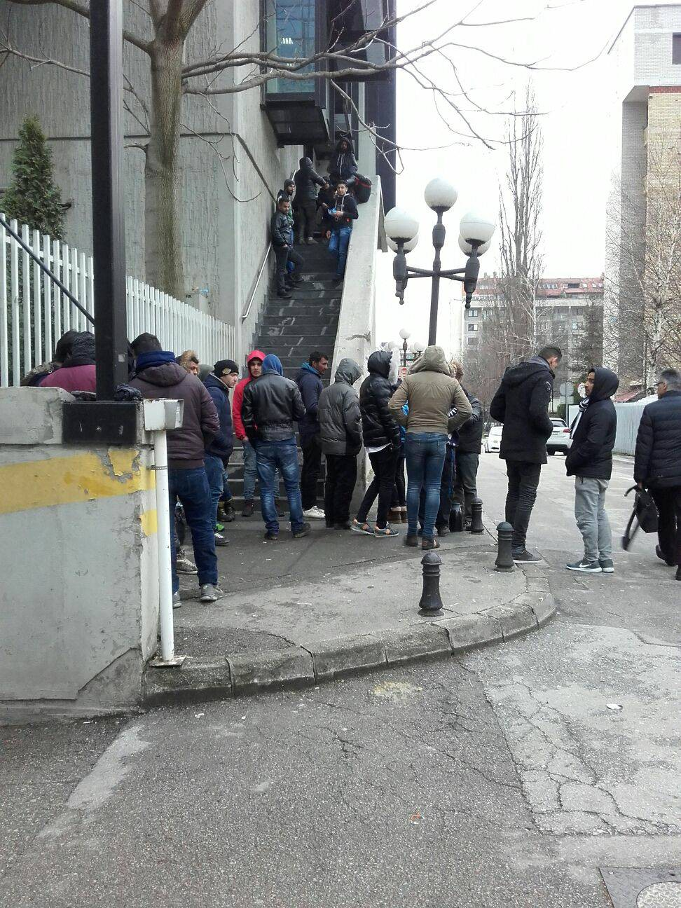
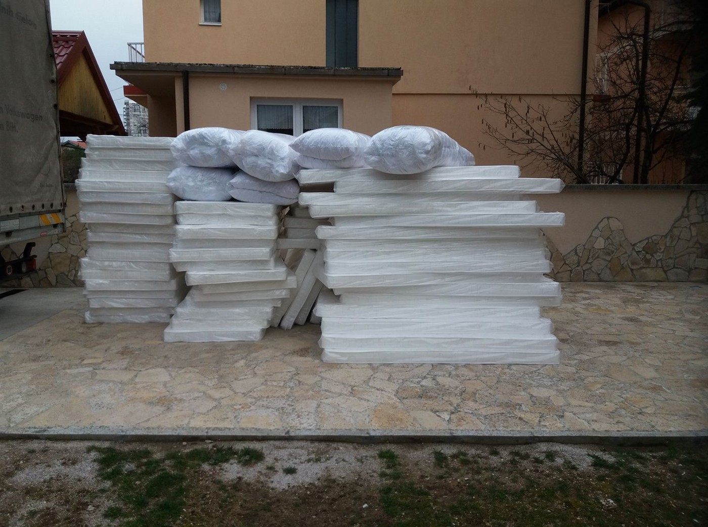
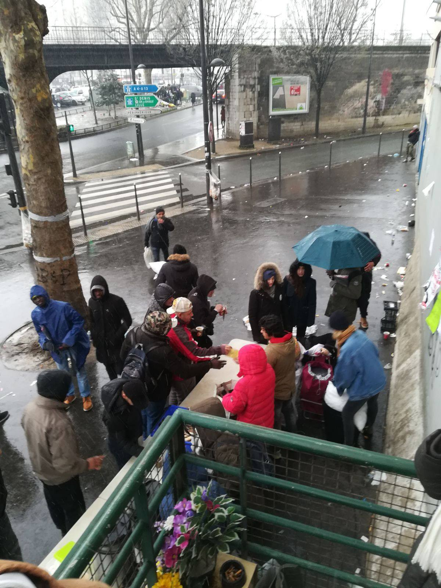
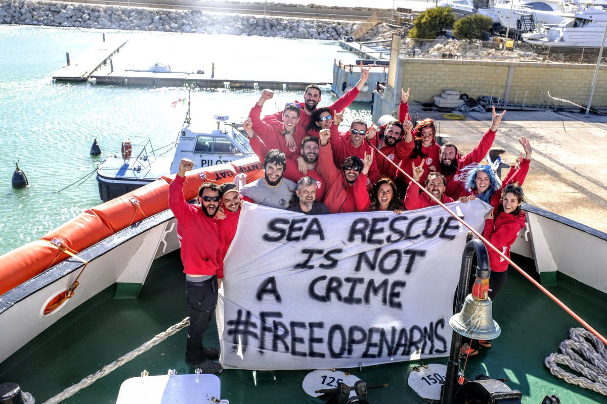

### AYS Daily Digest 20/3/18: Two years of a failed deal
#### EU\-Turkey deal: Deportees from the Greek islands face problems before and after their deportation / French volunteer teams need donations and help / An analysis of Nordic country responses to asylum\-seeking children finds breaches in children’s rights protection in Finland and Sweden / Austria\-Croatia: unlawful tacit deportations and the practice of separating families through deportation / and more news

 \.
 Our statement regarding the conditions in the Hotspot Vial: [here](https://refugeelawclinicabroad.files.wordpress.com/2018/03/statement-vial_general_jan-18_english.pdf) \. “— [**Refugee Law Clinics Abroad in Chios**](https://www.facebook.com/rlcabroad/)](assets/988160f8a0df/1*ulKz2oGWDQVv9MK-xJorjA.png)

“Two years ago the “EU\-Turkey Deal” took effect\!
 Since then, refugees are stuck on the islands, there is no improvement of the humanitarian situation on the islands, people are still facing inhumane and degrading conditions in the Hot spots\. Proceedings are still too long in the Hot spots and in breach of EU Migration Law\. The idea of a solidarity system is not implemented and has failed at the external borders of the EU\. 
 Our letter to the EU Commssion: [here](https://refugeelawclinicabroad.files.wordpress.com/2018/02/response_letter_to_eu_com_answer_chios_2018_01_24.pdf) \.
 Our statement regarding the conditions in the Hotspot Vial: [here](https://refugeelawclinicabroad.files.wordpress.com/2018/03/statement-vial_general_jan-18_english.pdf) \. “— [**Refugee Law Clinics Abroad in Chios**](https://www.facebook.com/rlcabroad/)
#### FEATURE

The core part of the 2016 EU\-Turkey deal was the fast deportation of asylum seekers on the Greek islands, for whom Turkey can be considered a safe third country\. In return for every deported Syrian, the EU promised Turkey to resettle one Syrian from Turkey to an EU member state\.

Since 21st March 2016, a total of 1,571 people have been deported from the Greek islands back to Turkey under the agreement, out of them 273 Syrians\. The asylum seekers in the so\-called hot spots face legal struggles as well as the dire living conditions\.

After being deported from Greece to Turkey, the further treatment of the deportee also depends on their nationality\. Non\-Syrian returnees are kept under administrative detention in a government\-run detention centres \(…\)

> The EU does not monitor returns out of Turkey to third countries\. 

**Read our newest [AYS SPECIAL about the EU\-Turkey deal](ays-special-about-the-eu-turkey-deal-an-error-in-the-system-2415621d4973) and, if you still haven’t, previous text — [On Two Years of EU\-Turkey Deal: Refugees Stopped In Motion](ays-special-on-two-years-of-eu-turkey-deal-refugees-stopped-in-motion-527b15d4b1e) \.**
#### EU

The ‘Eurodac’ law collects and gathers the biometrics of asylum seekers and refugees\. It includes, among other things, allowing police to use physical or psychological force against anyone at least 14 years old who refuses to give up their prints\. Based on an [EU commission proposal](http://eur-lex.europa.eu/legal-content/EN/TXT/HTML/?uri=CELEX:52016PC0272&from=EN) that included a restricted use of coercion “as last resort”, but a new draft deal on Eurodac soon expected among the EU negotiating institutions has sparked outrage from some political sides regarding that issue\. Read more [here](https://euobserver.com/migration/141372) \.
### Migrant and refugee rights have systematically been denied or flouted

Access to EU Member States’ territory has become more difficult in almost half of the EU Member States covered in the recent [report](http://fra.europa.eu/en/publication/2018/five-persistent-migration-challenges?_cldee=Y2xhaXJlLmd1eW90QGV1cmFjdGl2LmZy&recipientid=contact-efa1120dd922e81180d400155d140b3a-8301e88b3bcd48a1bcb6d6e3bc1ae7bc&esid=0aaadc9b-4628-e811-80d4-00155d140b3a&urlid=0) by the EU Agency for Fundamental Rights [\(FRA\)](http://fra.europa.eu/en/publication/2018/five-persistent-migration-challenges?_cldee=Y2xhaXJlLmd1eW90QGV1cmFjdGl2LmZy&recipientid=contact-efa1120dd922e81180d400155d140b3a-8301e88b3bcd48a1bcb6d6e3bc1ae7bc&esid=0aaadc9b-4628-e811-80d4-00155d140b3a&urlid=0) \. They have detected access to territory, reception conditions, asylum procedures, unaccompanied children and immigration detention as the five main problematic areas\.
Some of their main findings document that “the police and border guards reportedly ill\-treated migrants, particularly on the Western Balkan route, and in Spain in certain locations;
Some persons wishing to apply for asylum were denied entry to the EU and/or returned without an opportunity to apply for protection; others were collectively pushed back at land or sea borders;
 Sexual and gender\-based violence in reception centres remains an issue in some EU Member States;
In many EU Member States reception standards for children remained critical;
The use of immigration detention increased in certain EU Member States
#### GREECE

There were 47 transfers from Samos to the Kavala camp \(north of thessaloniki\) in the night from Monday to Tuesday\.
### Kilkis

There will be no pediatrician available in Polikastro for about two months, local sources say\.
In case of the need for free health care for children, from now on for about two months, they should be referred to Hospital Kilkis and Hospital Goumenissa\.
### Athens

Notara squat needs offer of vehicle to transfer furnitures from Kipseli area to the squat/they cover expenses of gasoline

#### BALKAN WEATHER REPORT

**Montenegro**

Wednesday will be moderately cloudy to entirely cloudy, with occasionally rain, rain showers and thunder\. In the north there will be mostly snow and sleet which will spread out to the to the mountainous areas in the centre and south part of the country in the afternoon or during the end of the day\. During the morning and before noon more intense precipitation is expected, locally more severe\. During the morning the wind will be moderate to strong blowing from the south, during the day an amplified a northern and northeastern wind will be blowing and **during the night with stormy gusts\. The morning temperature will be form \-5 to 9 and during the day from \-3 to 14 degrees\.**

**Serbia**

In Serbia it will be cloudy and cold, during the most part of of the day there will be snow increasing the height of the existing snow covers and creating new ones, specifically in the mountainous parts of the country\. In the southeast there will be a variation of rain and snow\. The wind will be weak to moderate blowing from the north\. **The lowest temperature will be from \-4 to 0** and the highest daily from 0 to 4 degrees\.

**BiH**

Wednesday will be cloudy in Bosnia and Bosnia and Herzegovina with in Bosnia snow and in Herzegovina rain and sleet\. In the afternoon there will be rain in Posavina\. In most parts of the country the precipitation will gradually weaken and cease\. **The expected height of the new snow cover will be 2 to 10, locally up to 15 and in the mountains 15 to 25 centimetres\.** The wind will be weak to moderate blowing from the south, in Herzegovina there will be a moderate wind from variable directions\. **The morning temperatures will be form \-7 to \-1 and in the south from 3 to 8 degrees\.** The daily temperatures will be from \-2 to 3 and in the souths from 3 to 10 degrees\.

**Croatia**

In Croatia it will be predominately cloudy wight precipitation, in most areas land inwards it will snow, especially in the east and in the mountains and mostly in Lika\. Alongside the coast it will occasionally rain in the south more intense and with thunder, while snow and sleet are expected in the north and middle part of the coast and in the interior of Dalmatia\. Towards the end of the day the precipitation will mostly cease and it will partly clear up\. The wind will be weak to moderate blowing from the northeast, in the east sometimes a moderate wind from the north, alongside the coast strong to stormy wind from variable directions, and in the far south a southern wind\. **The lowest temperature will be form \-6 to \-1** and alongside the coast from 1 to 6 degrees\. The highest daily temperature will be from \-2 to 3 and alongside the coast from 4 to 9 degrees\. In the south it will be somewhat warmer\.
#### SERBIA

**_The situation in Šid is a very difficult one, the reasons for it are many and it is hard to describe them all\._**

> In addition to a number of open camps in the surrounding area, in Šid exists a bigger squat around which many people who do not want to go to a camp, live\. The number varies\. Nowadays, when temperatures are extremely low, there are around 100 people living there, as soon as the weather gets better, we can expect at least twice as much\. It’s a permanent “come and go”, some go voluntary into the open camps, others are forced by the police, many others try to cross the border through Croatia to Europe\. During the whole time, new people arrive\. 

A volunteer on the groud [shared](https://www.facebook.com/groups/refugeefoundationBENELUX/?ref=group_header) that at the moment, only morning and evening ‘Foodpack’ are distributed, no tea and no warm meals, and not much more\.

 ‎](assets/988160f8a0df/1*ZM2EMawxb6MiSVNQh9CqYg.jpeg)

Photo: **‎** [Yolande Koster\-Kaiser](https://www.facebook.com/yolande.kosterkaiser?hc_ref=ARSJ1nhcROt1i1zDU-iHNgPrwmPVJ1AjjH1C-pKHIPP8FwbSM55972aNXbVXK43jhWU&fref=nf) ‎

She continues saying the police made clear that they want to allocate them into the camps\.

> In the last weeks, outbreaks of violence have occurred between people in the squat, so that the situation needs to change\. In the last weeks, more or less violent outbreaks and disputes have taken place\. Many of them have been here in Serbia for such a long time that their hope for a better life is shrinking increasingly and their desperation is growing\. 

#### BOSNIA AND HERZEGOVINA

People keep coming to and through Bosnia and Herzegovina\. 
Volunteers say that every day up to 100 persons are seen waiting in the front of the UNHCR office for registration or accommodation\. Currently there is not enough accommodation available for everyone\. Like it’s been happening elsewhere, it is the self\-organised volunteer groups who are mostly taking care that meals, clothes and basic care is provided to the people, while some of them, mostly single men, usually end up with not enough support due to the circumstances\. 
“The UNHCR lets them wait every day in the front of their office and then they take them to the hostel to sleep,” we are told by the local volunteers\.

Waiting in front of the UNHCR offices

The hostel where they stay is, as we were told by some of the people who are waiting in the line, dirty and sometimes there is no water\. Almost everyone got scabies in this hostel, we are told\. In the morning they have to leave the hostel and they are left to wander around the city, with no food\. 
Volunteers are bringing them food, blankets, hot tea and trying to take care of as many people as it is possible, but they need support\.

Consider donating to [Pomozi\.ba](https://www.indiegogo.com/projects/pomozi-ba-is-helping-syrian-refugees--2) , an charity from Bosnia and Herzegovina who has for a long time been helping those in need and has extensively supported the local teams now working and helping the refugees\. \(If you donate, please stress that is it for refugees\) \.

Recent help from Pomozi\.ba crew includes donation of 90 mattresses for refugees taken care of by the local volunteer team \(All photos were taken by the volunteers currently in Sarajevo area\)
#### AUSTRIA / CROATIA
### Violation of human rights through family separation during deportations

As we wrote earlier in [previous digest](ays-daily-digest-13-3-18-croatia-continues-with-push-backs-of-children-while-tacitly-accepting-5937bf8b26f9) s, while the Croatian MOI is putting a lot of efforts to expel the people from the country, with a strange continuum of enforcement that lacks basic procedural protections, at the same time the country has been tacitly accepting requests for Dublin deportations \(1925 during 2016 only\), mostly by Austria\. 
The cases we described in the mentioned Daily Digest violate a series of laws and rights, starting from children’s and human rights, all the way to the very agreement they tend to refer to\.

Among them is an Iranian father from Waidhofen / Taya who was deported to Zagreb after 2 years in Austria and now finds himself with his daughter Malika and baby Ervin \(15 months old\) alone in Croatia since the children’s mother Sana, who attempted suicide in the course of deportation, remains alone in Vienna\. This practice of separating families through detention and deportation is at odds with obligations under the International Covenant on Civil and Political Rights, which recognizes “family as the natural and fundamental group unit of society,” and assures protections of family rights and family unity, and its failure to consider the interests of the children of those facing deportation violates the right of the child to special protection, as guaranteed by the Convention on the Rights of the Child\.

On Tuesday, March 20, a Syrian family with 4 children, after two years in Austria, has also been deported to Croatia despite urgent appeals\. The children have been severely traumatized and had just begun psychotherapy in lower Austria\.
The question once again arises — why suddenly all these deportations, among which are those whose ‘Dublin deadline’ has expired, and why does Croatia keep tacitly accepting deported people, even when they are not implicitly or directly legally obliged to do so\.
#### ITALY

Six Nigerians in Italy have been placed under arrest for human trafficking and forced prostitution, InfoMigrants [report](http://www.infomigrants.net/en/post/8160/arrests-made-over-nigerian-prostitution-ring-in-italy) \. ‘The four women and two men had allegedly been involved with organizations which convinced young Nigerian girls that they would be given a job in Italy\. Instead, these women were violently forced to sell their bodies, and coerced into having abortions if they fell pregnant\.’
Important to add is that it’s a phenomenon common also in Rosarno — San Ferdinando or Foggia — Borgo Mezzanone, where people are exploited by the mafia on the fields and women are victims of the prostitution racket, most of the women have a regular permit most of the times but are not offered a valid alternative\. Also, in Ventimiglia volunteers are patrolling the station at night in order to give information to men and women arriving late at night so that they don’t get caught in the illegal businesses of prostitution or drug dealing\.
#### FRANCE
### Paris

With the large quantity of new arrivals recently, the [Paris Refugee Ground Support](https://www.facebook.com/PRGS.team/?fref=mentions&hc_location=group) storage space is for the first time empty\. 
There is just under 2000 people on the streets here with anywhere between 60 to 100 new arrivals a night, they report\. 
Please, consider donating or providing sleeping bags, duvets, blankets etc\.

> We have just released our latest report, ‘Still on the Streets’, on the human rights situation facing refugees and displaced people on the streets of Paris\. 

> Despite promises from President Macron that refugees would no longer be sleeping on the streets by the end of 2017, and the continued eviction of makeshift settlements in Paris, our research shows that the situation remains critical for refugees and displaced people in the area\. 

> We found that:
 

> \- 85% of respondents were sleeping on the street
 

> \- 42% told researchers they ‘don’t feel safe’ or ‘don’t feel safe at all’
 

> \- 34 % had experienced police violence, of which 86% had been subject to tear gas
 

> \- 44% had experienced a health problem since arriving in Paris, with the majority saying this started because of the unhealthy living environment
 

> \- 66% did not have access to information about their rights and opportunities to change their situation
 

> \- 78% of minors were sleeping on the streets of Paris, of which 67% said they had family in the UK 

Read the full report [here](http://refugeerights.org.uk/wp-content/uploads/2018/03/RRDP_StillOnTheStreets.pdf) \.

 we distributed blankets, socks, and foot and hand warmers to give a concrete support to refugees living in the street of Paris\. We cannot accept that such a situation is slowly becoming “normal”\. It is not acceptable to have people living in this conditions\.> Photos: [Solidarithé](https://www.facebook.com/solidarithe/)](assets/988160f8a0df/1*0WBCnJNw32S9oBzxFod8Ig.jpeg)

<Temperatures are dropping again in Paris\. Since the last week, heavy rains, snow, and low temperatures are making the day of people sleeping rough not easy\. As well as Tea and Coffee and information, together with [Sciences Po Refugee Help](https://www.facebook.com/sciencesporefugeehelp/?fref=mentions) we distributed blankets, socks, and foot and hand warmers to give a concrete support to refugees living in the street of Paris\. We cannot accept that such a situation is slowly becoming “normal”\. It is not acceptable to have people living in this conditions\.> Photos: [Solidarithé](https://www.facebook.com/solidarithe/)

If you wish to support the Solidarithe team, donate or bring cups, sugar, printing paper, coffee, socks, underwear, toiletries, hats and scarfs\.
Contact the group via Facebook page\.
#### Volunteers needed

[La cuisine des migrants](https://www.facebook.com/lacuisinedesmigrant/?hc_ref=ARTgoWgWTWW5XRqeYrIfnlRBWgYPs6spgG-BnLDN8ziNMIHGferB5-EyyctNGF7_KhM&fref=nf) is looking for volunteers ready to invest themselves in helping for a day or more during a week, starting from 10h onwards\. If you’re interested and willing to help, don’t hesitate to contact them via Facebook or by phone: 06 46 24 61 54
#### Gathering in solidarity

Wednesday, March 21, at 18h in front of Hôtel de Ville in Paris
In memory of Nur, died on February 14
### Calais

#### GERMANY

Next deportation flight is [reportedly](https://www.facebook.com/groups/441355579370337/permalink/842783352560889/) scheduled on Wednesday, March 21 at 10h, from Baden\-Württemberg to Serbia and Macedonia\.
### Germany — the discrepancy in interpretation of Dublin

Germany processed five times as many applications as Italy and Greece — [two of the EU’s border states](http://www.infomigrants.net/en/post/8169/asylum-germany-processes-more-applications-than-other-eu-states-combined) — combined, therefore remains the most popular destination for people seeking asylum in Europe\.
Although they are putting into practice the Dublin deportations and deportations to Afghanistan \(the “safe country” issue that remains political elephant in the EU room\),the country allows migrants to enter from other EU countries and they, in return, go into hiding in many cases if it is decided they should leave the country after all\.

■■■■■■■■■■■■■■ 
> **[ECRE](https://twitter.com/ecre) @ Twitter Says:** 

> > 🇩🇪: Refugee children from the transit centre in Manching have won the right to regular school attendance in court, with support from @[ProAsyl](https://twitter.com/ProAsyl). Previously had only "replacement lessons" [bit.ly/2DGDi7K](http://bit.ly/2DGDi7K) https://t.co/rJee5iboZA 

> **Tweeted at [2018-03-20 12:31:37](https://twitter.com/ecre/status/976073776134868992).** 

■■■■■■■■■■■■■■ 

#### FINLAND
### Finland violated the rights of asylum seeker children

Due to Finland’s treatment of underage asylum seekers first and foremost as asylum seekers, not children, [deporting them to countries that are unsafe](https://yle.fi/uutiset/osasto/news/asylum_seeker_killed_in_iraq_weeks_after_repatriation_from_finland/10071096) , the UNICEF claims those children have lost the rights that belong to them under the UN’s Convention on the Rights of the Child\.
In their [new report](https://www.unicef-irc.org/publications/940-protected-on-paper-an-analysis-of-nordic-country-responses-to-asylum-seeking-children.html) , the organization has strongly criticized the country’s detaining and deporting of minors to countries that are unsafe, but they have also criticized Finland for the new regulations that make it difficult for asylum\-seeking children to receive free legal aid\.

The report provides country\-specific detailed, practical recommendations on how to ensure protection and welfare for asylum\-seeking children, and it also makes country\-specific recommendations on how legal, policy and practice frameworks can be strengthened to ensure full protection of children’s rights and entitlements\. 
Read the entire [UNICEF Report](https://reliefweb.int/sites/reliefweb.int/files/resources/NORDIC%2028%20LOWRES.pdf) : An analysis of Nordic country responses to asylum\-seeking children
#### SWEDEN
### Announced extension of the “high school law” possibly makes stay possible for minors

According to the latest [reports](https://tidningensyre.se/2018/nummer-248/regeringen-lattar-pa-id-krav-ensamkommande/) , the Swedish government wants to lower the identification requirement for unaccompanied minors\. If this decision is accepted and implemented it will give them a new chance to stay\. 
The change is made to make it possible for approximately 9,000 young persons to remain in the country during their high school studies\. This is an extension of the previous “high school law”, which make it possible for people who can verify their identity and age to get a residence permit for high school studies\. As it is today, the person has to verify their identity and age\. It has to be “likely” that the person is a minor\. With the changes, another 9000 people who have failed to prove their identity or verify that they are young enough, will be included in the law\.
#### SEA

■■■■■■■■■■■■■■ 
> **[InfoMigrants](https://twitter.com/InfoMigrants) @ Twitter Says:** 

> > The numbers might be down compared to previous years, but the Mediterranean route is still the deadliest migrant route in the world. So far this year, 463 people have died. #MediterraneanRoute #migrantdeaths #refugees
[bit.ly/2GM14T0](http://bit.ly/2GM14T0) https://t.co/QfmzWLW93C 

> **Tweeted at [2018-03-20 16:00:03](https://twitter.com/infomigrants/status/976126230499135488).** 

■■■■■■■■■■■■■■ 

### Sign the petition in support of the Proactiva team

Facing the potential punishment of up to 15 years in prison and 15 000 Euro for each saved migrant \(sic\! \), the Proactiva Open Arms team needs as much support as possible, from each of us reading this\. 
Those who have dared to do something for fellow human beings in distress are now being threatened and punished by the very officials whose job the NG sector has been doing for years now\.

■■■■■■■■■■■■■■ 
> **[El Intermedio](https://twitter.com/El_Intermedio) @ Twitter Says:** 

> > "Parece que la solidaridad se ha convertido en un delito". Esta noche hablamos de ello en #elintermedio @[openarms_fund](https://twitter.com/openarms_fund) [atres.red/k1p5t450](http://atres.red/k1p5t450) https://t.co/sYAR15WQ95 

> **Tweeted at [2018-03-19 19:27:11](https://twitter.com/el_intermedio/status/975815967837179904).** 

■■■■■■■■■■■■■■ 

It is time to show how many people stand with solidarity and saving human lives no matter what\. 
Consider helping the team in ways available to you\.

In the meantime, the Spanish Minister of Foreign Affairs stated: “We are working to clarify the situation of the [@openarms\_fund](https://twitter.com/openarms_fund) ship in Italy\. The Consulate of Spain in Naples and the Honorary Consul in Catania are in contact with the Captain of the Ship and the leadership of the NGO\.”

**We strive to echo correct news from the ground through collaboration and fairness\.**

**Every effort has been made to credit organizations and individuals with regard to the supply of information, video, and photo material \(in cases where the source wanted to be accredited\) \. Please notify us regarding corrections\.**

**If there’s anything you want to share or comment, contact us through Facebook or write to: areyousyrious@gmail\.com**

_Converted [Medium Post](https://medium.com/are-you-syrious/ays-daily-digest-20-3-18-two-years-of-a-failed-deal-988160f8a0df) by [ZMediumToMarkdown](https://github.com/ZhgChgLi/ZMediumToMarkdown)._
