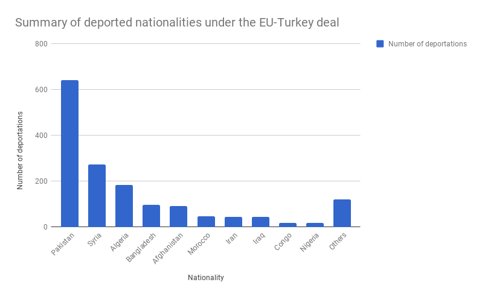
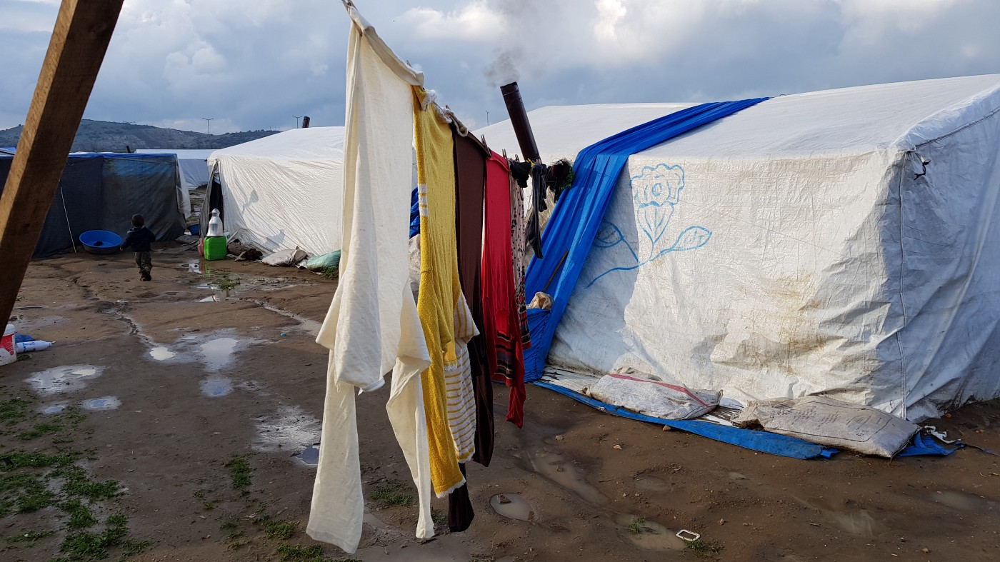

### AYS SPECIAL about the EU\-Turkey deal: An error in the system
#### _Deportees from the Greek islands face problems before and after their deportation / Most of them are sent back by Turkey to their home countries_

](assets/2415621d4973/1*_KbvwvGAzJbTJYhjEfg4ag.jpeg)

A deportation bus on Lesvos\. Credits: [Enough is Enough\!](https://twitter.com/enough14/status/942747697324445697)

A core part of the 2016 EU\-Turkey deal was the fast deportation of asylum seekers on the Greek islands, for whom Turkey can be considered a safe third country\. In return for every deported Syrian, the EU promised Turkey to resettle one Syrian from Turkey to an EU member state\.

Since 21st March 2016, a total of 1,571 people have been deported from the Greek islands back to Turkey under the agreement, out of them 273 Syrians\. More than 60,000 newly arrived, some 4,100 of them in 2018\. At the same time, EU countries resetteled 12,715 people \(as of 19/3/2018\) \. Bulgaria, Cyprus, the Czech Republic, Denmark, Greece, Hungary, Ireland, Poland, Romania, Slovakia, Slovenia, the United Kingdom and Norway did not take any\.

However, asylum seekers in the so\-called hotspots face legal struggles as well as the dire living conditions\. “Free legal aid is provided only to appeal the first rejection/negative decision,” a spokesperson of Emergency Legal Aid \(ELA\) — Chios explained, speaking to AYS\. There were only a handful of lawyers, contracted by NGOs, following cases in the third instance, for example appeals against rejections rendered in the second instance\. But in these cases, the Panel of Coordinates “are not looking at the asylum case itself, only for errors in the legal process\. Only if new strong evidence is brought to bear which was not available at the time of the interviews will they also take that into consideration\. It is an expensive process with private lawyers\.”

But even when lawyers try to appeal these second instance rejections, they face problems: authorities try to deport the people before the appeal can be made\. “They can be arrested as soon as notified of a second rejection\. Only if a lawyer can proceed to appeal and demonstrate that the appeal will go forward can there be a stay of deportation,” ELA explained\. But the legal procedure requires the authorities to officially notify the persons about their rejections in order to detain them\. Until this point, they can move freely — although there is no way for them to leave the islands\. Anyway, this legal obligation leads to a questionable practice, as the ELA states:

> “Several recent deportees were unaware when they went to have their IDs renewed that the decision was ready\. Their names did not appear on the notification list posted each week at the camp info point\. They were invited into the office, notified and arrested immediately\.” 

After being deported from Greece to Turkey, the further treatment of the deportee also depends on their nationality\. In a statement, the department for humanitarian aid and civil protection \( _DG ECHO_ \), which is responsible for the EU Commission’s policies on aid and protection, told AYS: “If the returnees under the EU\-Turkey Statement are Syrians, upon their registration under temporary protection they are free to choose whether to stay in temporary accommodation centres run by the Turkish government or a province of their choice\. Syrians can also decide to return to their homeland\. Non\-Syrian returnees, on the other hand, are kept under administrative detention in a government\-run detention center\(s\) \(currently in Kayseri Removal Centre situated in the middle of the country\) \.”
#### DG Echo: “In line with European standards”

As of February 2018, 16 of the 258 Syrians had decided to return from Turkey to Syria, while the others stayed\. But: out of the — until then — around 1,300 other people deported from Greece, Turkey deported almost 1,000 to their country of origin\. “A total of 80 non\-Syrian returnees have submitted applications for international protection, two of them have been granted the status, 39 are waiting for the decision to be issued, 32 applications have been rejected and 7 non\-Syrians decided to withdrawn their application”, DG Echo stated earlier this year\.

The EU Delegation had observed that “that the basic material conditions in the centre are in line with European standards\. Migrants have access to leaflets in a number of languages informing them about their rights and obligations, including the possibility to apply for asylum\. They can communicate with the outside world using public pay phones and ask for permission to use their cell phones in order to obtain phone numbers, which they are allowed to call on the pay phones available”\. This, however, has not been confirmed by other sources\.

■■■■■■■■■■■■■■ 
> **[Refugees Deeply](https://twitter.com/refugeesdeeply) @ Twitter Says:** 

> > Expert Views: The E.U.-Turkey Deal After Two Years [newsdp.ly/2DLcB28](http://newsdp.ly/2DLcB28)

We asked experts from Turkey, Greece and Germany weigh in on its impact on refugees and on Europe. @[MWalterFranke](https://twitter.com/MWalterFranke) @[FU_Berlin](https://twitter.com/FU_Berlin) @Delorsinstitut @[TunaboyluSevda](https://twitter.com/TunaboyluSevda) @[UPFBarcelona](https://twitter.com/UPFBarcelona) @[dichristopoulos](https://twitter.com/dichristopoulos) @[fidh_en](https://twitter.com/fidh_en) https://t.co/W5blkoiTrB 

> **Tweeted at [2018-03-20 19:08:05](https://twitter.com/refugeesdeeply/status/976173551999967232).** 

■■■■■■■■■■■■■■ 

In November 2017, a study by the University of Utrecht had already disproved the DG’s statement\. “International organisations, NGOs and researchers have had very limited access to people who have been readmitted from Greece to Turkey,” the authors concluded\. The authors criticized the EU for failing to implent a mechanism to monitor the situation of individuals\. Observing different cases, they found that the current protection regime for non\-Syrians does not offer a perspective of long\-term settlement: “Readmitted non\-Syrians are detained afer returns to Turkey and only in exceptional circumstances are they able to apply for asylum from within Turkish detention centres\.” In a sample of 33 non\-Syrians, 25 stated they had been intimidated into signing voluntary return papers in Turkish detention centres, while 16 said they had not even had the chance to apply for asylum\. On AYS’ request, Jill Alps, one of the authors of the study, said that she had no updates on the situation in Turkish detention centers\.

ELA confirmed this practice based on conversations with their contacts\. “Deportees have told me that they are told if they apply for international protection that they will spend at least a year in prison\.” But the lawyers are also aware of people, who \(were\) returned to their home countries and were not shamed by their families or the threat against them was resolved in the meantime\. But the spokesperson added: “ The reality is — those who are unaware of the assistance that is available — may not seek or receive assistance…\. As is indeed the case for asylum seekers — those who know and can get assistance — are the ‘privileged’ few?” The DG Echo said in its statement: “ The EU does not monitor returns out of Turkey to third countries\.”

**>Read also: [Two years of EU\-Turkey Deal: Refugees Stopped in Motion](ays-special-on-two-years-of-eu-turkey-deal-refugees-stopped-in-motion-527b15d4b1e)**

Contrary to DG Echo’s statements, the study further found interviewees who stated they had not been granted access to payphones and reported beatings after they complained\. “Access to legal aid and protection also depends on the financial resources of asylum seekers, as Turkish bar associations do not provide systematic free legal aid to detainees\.” Even unaccompanied minors could stay in the same cells as adults, and sometimes women and men were held in mixed cells\. For babies, Turkish authorities reportedly would not provide milk or diapers\.

Outside the camps and detention centers conditions are also dire, as [AYS reported from the field previously this year](ays-special-turkey-the-only-hope-is-to-return-one-day-1df83003a89b) \. This is also confirmed by the study: “Outside of camps, Turkey does not provide Syrians with accommodation or assistance with accommodation costs, nor has it put into place systematic welfare provision for conditional refugees and asylum seekers\.” Even though there is a legal access to free health care in public facilities, in fact it is not given or is hampered by language barriers\.

One of the makeshift camps in Turkey\.

These coniditions leave some of the deported left on their own\. Some made their way to Europe again by paying smugglers, as they did not see any future for them in the country\. Hence, the authors of the study sum up:

> The EU\-Turkey Statement runs a real risk of preventing refugee’s access to asylum and their right to protection against refoulement\. 

**Written by: AYS volunteer**

Next week, he will be in Turkey to volunteer with the Refugees Foundation\. You can donate to support the people living in the fields on this [fundraiser](https://www.betterplace.org/de/projects/37631-kinder-auf-der-flucht-versorgung-am-strand-und-auf-der-fluchtroute) or via [Paypal](https://www.paypal.me/RefugeesFoundation) \.

> **We strive to echo correct news from the ground through collaboration and fairness\.** 

> **Every effort has been made to credit organizations and individuals with regard to the supply of information, video, and photo material \(in cases where the source wanted to be accredited\) \. Please notify us regarding corrections\.** 

> **If there’s anything you want to share or comment, contact us through Facebook or write to: areyousyrious@gmail\.com** 

_Converted [Medium Post](https://medium.com/are-you-syrious/ays-special-about-the-eu-turkey-deal-an-error-in-the-system-2415621d4973) by [ZMediumToMarkdown](https://github.com/ZhgChgLi/ZMediumToMarkdown)._
