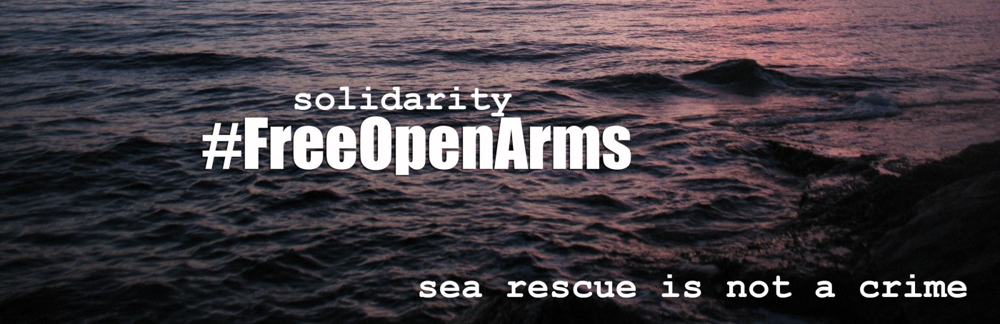
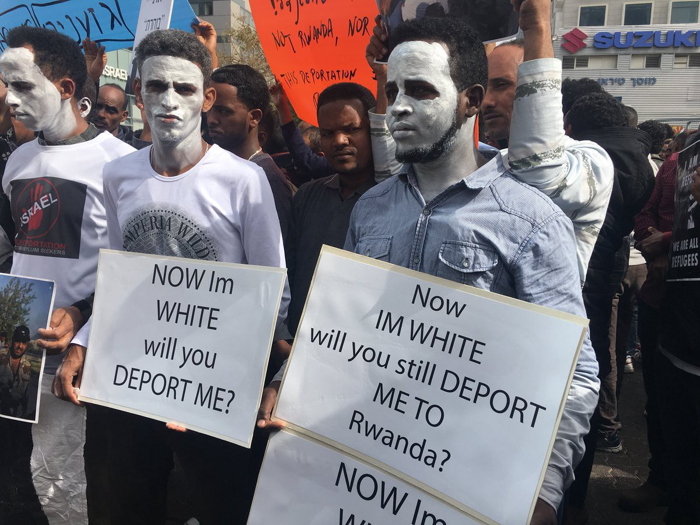
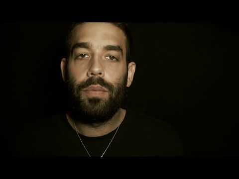

### AYS DAILY DIGEST 24/3/2018: Building a world where racism does not exist

_Protest against racism all over the world // Thousands marched in Tel Aviv against deportations of refugees // Pressure on volunteers in Greece // Help needed in France // Education and job opportunities in Norway_

No Borders Network
### Feature

We have to fight racism and xenophobia all over the world\. In Europe, this was a week marked by protests under the slogan _“Diversity — never enough”_ \. Unfortunately, this is a slogan that many politicians and citizens have chosen to ignore\.

In Tel Aviv, Israel, some 25\.000 people marched on Saturday against the deportation of African asylum seekers\. They carried the slogan **_“There is no difference between our blood and their blood because we are all human beings\.”_**

This is just another stage in protest against deportations to Rwanda and Uganda that were scheduled to begin on April 1\. However, under the public pressure, the High Court of Justice has suspended this decision until it rules on a petition against deportations\. The government is scheduled to file its response to the petition on Monday\.

The big rally was organized by Sudanese and Eritrean asylum seekers and supported by a large number of locals, youth movements, as well as groups of holocaust survivors\.

One of the speakers at the rally, Sudanese immigrant Monim Haron, described himself as genocide survivor\.

_“For 14 years the government has deliberately attacked its citizens with chemical weapons,” he said\. “Just this week the region where I was born and raised was attacked again, and again dozens of people were killed, mostly women and children\. And I’m not a refugee? So who is a refugee? There are many like me in Israel,” he said\. “They go on the bus with you, they wash the dishes in your restaurants, they clean the streets you walk\. And they are in daily fear for the people they love\. But the government of Israel doesn’t want us here\.”_

His words should be heard all over Europe\.

As the support to refugees in his country, Israeli artist Ehud Banai rewrote his song from 1987 titled “Black Work” \(Avoda Shehora\) and rerecorded it to protest Israel’s plan to deport African asylum seekers\.

The first stanza of the song says:

_“Our dark\-skinned brothers who came from Ethiopia brought with them a wonderful and ancient tradition\. The lost sons, after the hardships of the road, slowly discover the faraway land they dreamed of for years, and now it’s the reality when they tell them to immerse, to wash away their innocence\. And I saw a light in their eyes, and who knows if \[the patriarch\] Abraham wasn’t black?”_

There are approximately 38,000 African asylum seekers in Israel, according to the Interior Ministry\. Among them, about 72 percent are Eritrean and 20 percent Sudanese\. The vast majority arrived between 2006 and 2012, via Egypt\.

Israel politicians, but also big part of the public, considers them to be job seekers — economic migrants whose lives were not in danger in their countries of origin\. However, this view does not account for the reality of violence and war in many african nations\. While rarely publicly expressed, a prime reason these refugees are being targeted is the color of their skin\. In Israel, some politicians call refugees “infiltrators\.”

■■■■■■■■■■■■■■ 
> **[Free Open Arms](https://twitter.com/freeopenarms) @ Twitter Says:** 

> > Madrid, Barcelona, Alicante, Valencia, Tarragona, Palma, Ibiza, Gijón, Bilbao, Santiago, Salamanca, Avila, Roma, Pozzallo, Cagliari, Dublin y muchas otras ciudades se han unido está mañana para reivindicar que SALVAR VIDAS NO ES DELITO! Gracias a todos! seguiremos luchando! https://t.co/5RBGsDcR8C 

> **Tweeted at [2018-03-24 12:37:13](https://twitter.com/freeopenarms/status/977524738615517184).** 

■■■■■■■■■■■■■■ 

### Greece

The Greek government continues to pressure international volunteers, especially on the Aegean islands\. Recently we have received many reports about the seizure of vehicles\. The [Hope Project](https://www.facebook.com/HopeProjectKempsons/posts/2042791389335316) issued a warning saying that everybody should be aware of these restrictions, especially at Lesvos\.

_“When bringing aid to Lesvos please be aware of the restrictions of the authorities\. No foreign registered vehicles are allowed to move items inside Greece even if they are within the 6 months allotted time\!”_

The fine could be up to 5,000 Euro and seizure of the vehicle\.

_“Foreign registered vehicles can only be driven by the registered keeper, and may only remain in the country for six months in a year\!_ 
_Also be aware if you are driving here ensure that… if you are from outside the EU you will need an international driving license\._ 
_Do not overload the vehicle with more passengers than it is licensed for\._ 
_The incidents over the last weeks are too many to list, vans impounded, license taken, plates taken, please be extra careful\! \!”_

Additionally, they warn that everybody should be aware that if arriving with aid in a suitcase, it is possible that if you admit you are helping refugees, you may be questioned by the authorities\.

Due to new restrictions, Hope Project will not be able to accept parcels from outside the EU\. If you want to help from outside the EU, visit their FB page to learn the procedure\.

RefuComm issued series of very informative films that explain the procedures on the Greek Islands\. Videos are available in different languages\.

**BALKAN WEATHER REPORT for Saturday 25\.03**
#### Montenegro

Sunday will be variably cloudy with sunny intervals, during the day it will be mainly dry with rain towards the end of the day and during the night, in the mountains in the north possibly snow and sleet\. The wind will be mostly weak to moderate, towards the end of the day locally amplified to strong in the south, blowing from the west\. The morning temperatures will be from \-7 to 6 and the highest daily from 3 to 16 degrees\.
#### Serbia

In the morning it will still lightly freeze and during the day it will be warmer with a gradual melting of the snow in the lower parts of Serbia\. In most parts of the country, it will be predominantly sunny with exception of the west where it will be predominantly cloudy with at times snow\. Later in the afternoon in the south and in the evening in the rest of the country, there will be new cloud formations with light rain, in the mountains with light snow\. The wind will be weak, in some parts moderate to strong blowing from the southeast, in the south with stormy gusts in the afternoon and evening\. The lowest temperatures will be from \-4 to 1 and the highest daily from 6 to 9 degrees\.
#### Bosnia

It will be predominantly cloudy in Herzegovina and in the southwest of Bosnia while in the rest of the country it will be sunny with gradual cloud formations in the afternoon or in the evening\. During the daylight, rain is possible in some places in Herzegovina\. In the evening there will be rain in Herzegovina and in the centre, south and east of Bosnia\. In Bosnia snow is expected in places above 800 meters\. In Bosnia, the wind will be weak to moderate blowing from the northeast while in Herzegovina weak to moderate wind that can change directions will be blowing\. In the morning the temperatures will be for \-6 to 0 and in the south form 2 to 6 degrees\. The highest daily will be from 3 to 10 and in the south from 11 to 15 degrees\.
#### Croatia

In Croatia, it will be partly sunny and variably cloudy\. In Dalmatia, it will be more cloudy wily locally rain, mainly at sea and on the islands\. The wind will be mostly weak, alongside the coast a weak to moderate southern and eastern winds will be blowing and in the morning and evening locally a wind which can change directions\. The lowest temperatures will be from \-5 to 0 and alongside the coast from 3 to 8 degrees\. The highest daily temperatures will be from 4 to 9 and alongside the coast from 9 to 14 degrees\.
### Belgium

A demonstration against racism, discrimination and inequality took place on Saturday afternoon in Brussels\.

More than 120 organizations participated in [the march](https://www.demorgen.be/binnenland/manifestatie-tegen-racisme-brengt-duizenden-mensen-op-de-been-in-brussel-b909c20b/) which started at 2 pm and ended around 5 pm\. According to first estimations of the police, there were 3000 participants while the organizers esrimated 8000\.
### France

Help is needed in Calais where there are between 600 and 800 people sleeping rough, and many among them are minors\.

“What I wouldn’t give to bring a van load of small skinny jeans or short joggers to Calais\. I know what a huge difference it would make to the refugees here,” said one [Care4Calais](https://www.facebook.com/care4calais/photos/a.1047087828657507.1073741832.1046117708754519/1865373220162293/?type=3) volunteer\.

“There is minimal access to sanitation meaning people do not get to wash or change their clothes, leading to skin infections, scabies and worse\. In every area Care4Calais distribute, across Calais, Dunkirk, Caen and Brussels we see this every day\. Imagine spending weeks in one dirty pair of jeans or joggers… walking for hours on end, constantly being on the move in rain, cold and bleak conditions\.

We can fully clothe a refugee for just £13 — new t\-shirt, hoodie, joggers, boxers, and socks\. Please help us deliver this basic standard of decency by donating £13 now [https://goo\.gl/jmkx7A](https://goo.gl/jmkx7A) "

Help Refugees also shared an urgent call for sleeping bags in Calais\.

Please contact [calaisdonations@gmail\.com](mailto:calaisdonations@gmail.com) if you have a spare sleeping bag\. If not, donate so we can buy locally: [http://bit\.ly/HelpRefugeesFrance](http://bit.ly/HelpRefugeesFrance)
### Germany

[Protest LEJ](https://www.facebook.com/protestlej/) announces protest actions against planned deportation from Leipzig/Halle to Afghanistan on Monday\.

“Deportations are all inhumane and practised in concealed of societies eyes, where no one witnesses\. We, the Initiativkreis Abschiebebeobachtung and protest LEJ, call for a protest at the airport, to be present there, observe the practice, and prevent it from happening in silence by writing about it on Twitter and creating an Info\-storm about the deportations\.

Join us on Monday, at the airport at 4 pm, and on Twitter at 2 pm to create public awareness about deportations\.”
### Norway

[OsloMet — Oslo Metropolitan University](https://khrono.no/sykepleie-kompletterende-nybo/oslomet-vil-ferdigutdanne-flere-innvandrere-med-sykepleieutdanning-men-nybo-sier-nei/215984) has a program focused primarily on refugees with a nursing degree from home\. They study for one year and become qualified to work in Norway\.

**We strive to echo correct news from the ground through collaboration and fairness\.**

**Every effort has been made to credit organizations and individuals with regard to the supply of information, video, and photo material \(in cases where the source wanted to be accredited\) \. Please notify us regarding any corrections\.**

**If there’s anything you want to share or comment, contact us through Facebook or write to: areyousyrious@gmail\.com**

_Converted [Medium Post](https://medium.com/are-you-syrious/ays-daily-digest-24-3-2018-building-a-world-where-racism-does-not-exist-ae2801340fa9) by [ZMediumToMarkdown](https://github.com/ZhgChgLi/ZMediumToMarkdown)._
