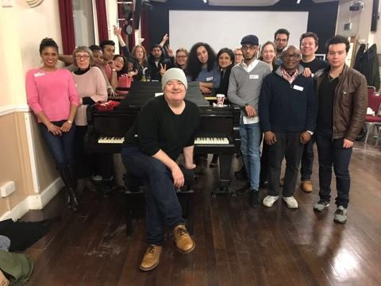

### AYS DAILY DIGEST 31\.03\.2018: Killing with “Kindness”

Case Study Serbia: how refugees are targeted through “benevolent” actions // Rescuers made to hold back, observing boat in distress for hours // More arrive to Greece, exacerbating tense, horrific living conditions // Austrian play designed to indoctrinate public on “good” versus “bad” migration // Snippets of hope from France // Netherlands restricting help for refugees\.

](assets/3504b6126da8/1*viZG2yxY7uFNM7uLU5jjow.jpeg)

Children Look In at Protest Camp on Border of Israel\. Photo Credit: Mohammed Abed, [Art Against](https://www.facebook.com/artagainstproject/photos/a.639651369417634.1073741828.639605726088865/1663968266985934/?type=3&theater&ifg=1)
### FEATURE

A Change\.org petition on behalf of [Italian photojournalist Mauro Donato](https://www.change.org/p/appello-per-la-scarcerazione-di-mauro-donato-italymfa?recruiter=864831766&utm_source=share_petition&utm_medium=copylink&utm_campaign=share_petition) to be released from his detainment in Serbia is underway\. Although the efficacy of such crowdfunded petitions is still up in the air, it is a good initiative to keep people informed about the peculiar and suspicious circumstances under which Mr\. Donato was put into jail\. As a reminder, the photojournalist had been near Šid, documenting and learning about the situation of people waiting there\. Several weeks ago, he was arrested on the basis of robbing several refugees of the equivalent of 2\.50 euro\.

The story doesn’t end there as his supposed victims completely denied any wrongdoing on his behalf\. These bizarre circumstances, and the fact that Donato was active near to the border with Croatia , would point to another purpose in Donato’s detention\. According to Serbian law, he can only be detained for up to 30 days without a trial, and it is anticipated that \(without reliable victims, even\) the charges will be dropped\. However, this approach sets a precedent for governments to attempt to intimidate journalists or other individuals engaging with refugees\.

A major strategy in criminalizing help towards refugees is, as we have seen, to not directly attack the action\. Instead, the actor must first be delegitimized, preferably under the guise of concern for the refugee themselves\. When authorities wish to clear out an area that is popular for food distribution, health officials are called in order to “ensure the quality and safety of food” so as to prevent sickness of refugees\. This “kill them with kindness” approach not only allows for governments to remain in good standing with their citizens, but also serves a more nefarious purpose — to create and reinforce the stereotype of ‘the ungrateful refugee\.’

By delegitimizing help systems outside of government control, demonizing volunteers, journalists, activists and others, the state can not only break solidarity between the local community to the community in need of support, but also maintain control of the narrative\. All other stories are “hearsay” and “biased” whereas the benevolent state narrative is objective\.

By maintaining control of the narrative, the state actors can obtain consent of their population in spite of the reality that surrounds them\. We can only expect an increase of this in the coming months and years\. Following the fall of Afrin, the Turkish government has expressed interest in relocating a large portion of its 3\.4 million Syrian refugee population to the area\. Although the official report advocates doing so through voluntary returns, it is unlikely that the community will be apt to opt in, giving rise to the more insidious truth\.

In spite of this escalating situation, we cannot give in to fatalism\. “Well it will happen; they will do what they want anyway\.” This is exactly another kind of victory\. We must, instead, understand the greater threat in context, and find hope and strength in one another\.
### SEA

Embedded reporter Filip Warwick documented a disturbing situation on the Sea yesterday wherein the MSF rescue ship Aquarius, after previously receiving authorization from Rome to engage in a rescue mission 24 miles from the Libyan coast \(in international waters\), was ordered to stand down in order to give priority to the Libyan Coast Guard\. The ship was forced to wait and monitor people in severe distress for 2 hours, while waiting for the Libyan Coast Guard\. 39 people were rescued, many of them children\. The Aquarius was later given permission to intervene in certain cases\. For the full description, go [here](https://twitter.com/filipwarwick/status/980174459180142592?s=21) \.

These 39 were fortunate enough \(along with those onboard\) to be taken to a port of safety\. However, in a perverse turn of events, the exact same rubber boat was later found carrying nearly 100 people, who were intercepted and taken back to Libya\.

■■■■■■■■■■■■■■ 
> **[MSF Sea](https://twitter.com/MSF_Sea) @ Twitter Says:** 

> > They in addition to the 253 rescued people on board will be taken to a port of safety. However, over 100 people on the same rubber boat were later intercepted by the Libyan coast guard &amp; will be returned to unsafe #Libya. Photos: Yann Levy https://t.co/EyN2utPO0O 

> **Tweeted at [2018-03-31 16:54:53](https://twitter.com/msf_sea/status/980126297815961600).** 

■■■■■■■■■■■■■■ 

### GREECE

According to the [Aegean Boat Report](https://www.facebook.com/AegeanBoatReport/photos/a.285312485325196.1073741828.285298881993223/327142267808884/?type=3&ifg=1) ,

“One boat picked up outside Mytilíni, Lesvos south, 07\.00 by British Frontex Valiant\.
 64 people\.
 26 children 
 17 women
 21 men

Two boats arrived on Samos this morning at first light, picked up by HCG outside Samos, carrying approximately 100 people\.”

Samos Volunteers report on the shameful state greeting the new arrivals:

> On their first day on Samos, refugees are being treated worse than criminals\. 

> This morning approximately 100 refugees landed in two boats on Samos\. With the arrivals of yesterday, over two hundred people have reached the island in the past two days\. The already overcrowded camp will become even more difficult to live in, in the coming days\. The last 50 people to arrive today have been forced to stay in derelict jail cells next to the port, in appalling conditions\. The cell floors are covered in rubbish, the toilets unusable and little to no light coming in through barred windows\. 

[Samos Volunteers](https://www.facebook.com/samosvolunteers/?hc_ref=ARRPg8eQIP3kAAjZd4Rq5ebh5Stkfi6etf9vZVFrbbVqZc4PbJlv-ZdKW8MnRLVfMwc&fref=nf)

Again, with the increasing turn of the Turkish government towards possibly returning people to Syria, and with more reports of individuals who have left Syria previously being subjected to horrendous treatment \(let alone the dangers faced by those leaving Afghanistan, Iraq, or other places\), we can only expect numbers to increase\. In the last several days alone, more than 300 people have arrived\.

One Happy Family Community Center on Lesvos reports that with recent arrivals, the number of people in Moria is around 6,000\. 2,100 tents alone are currently in the olive grove adjacent to the camp\. Numbers are trickling out of Moria, but it is not enough, nor is it fast enough to get people to safe living conditions\. For the full report, go [here](https://www.facebook.com/OHFLesvos/photos/a.302477103529519.1073741829.286923231751573/424528887991006/?type=3) \.

Ariel Ricker of Advocates Abroad posted this anonymously shared video documenting the level of tension in Moria from a few days ago\.

### AUSTRIA

A controversial propaganda play, designed to distinguish between “real refugees” and “economic migrants” saw its first public performance cancelled, after critics called it out for relying on crude racist stereotypes, and promoting dangerous attitudes\. The play, called “World in Flux” revolved around comparing and contrasting the lives of a Syria refugee and who is an economic migrant “from Africa\.”

The play was commissioned by the then\-conservative\-led Ministry of the Interior of Austria and was to serve to educate children on refugee and migration policy\.

> The play is about two asylum\-seekers: Nadim, [a Syrian fleeing war](http://www.dw.com/en/syria-thousands-flee-as-battles-in-eastern-ghouta-and-afrin-escalate/a-43017580) , and Mojo, “from Africa,” an economic migrant\. The polite, educated Nadim has proof he is fleeing war and, after efforts to integrate into Austrian society and learn German, he is granted asylum\. 

> Mojo, in contrast, leaves an unnamed home country after seeing human smugglers’ YouTube video promising a life of easy money, cars and houses in Europe\. After having being captured by the “Islamic State” terror organization, he is picked up by police and [deported back to Africa](http://www.dw.com/en/austria-plans-tougher-measures-against-refused-asylum-seekers/a-37750857) — where he finds a happy end after starting a business and a family\. 

The play has already been viewed by many schoolchildren \(between 7–11 thousand\) \.

For more information on this, go [here](http://www.dw.com/en/vienna-museum-cancels-migrant-propaganda-play/a-43200647) \.

This play is yet another example of the tooth and claws of asylum and immigration practice and procedure being put into play, in an attempt to mould the public sentiment\.
### FRANCE

On Friday, March 30th, there was a celebration of the two months of occupying Building A of University of Paris 8\. The movement started out as not only an attempt to move hundreds of refugees from the bitter Paris cold, but also continues as a protest against the racist and stringent refugee and migration policies of France and Europe as a whole\. We hope others will be inspired by this initiative the prioritizes people over prejudice\.

Read more \(in French\) [here](https://paris-luttes.info/anniversaire-des-deux-mois-du-9857?lang=fr) \.

A squat in Nantes, which has been occupied since 3 weeks by 160 migrants, will be officially turned into an emergency shelter with 100 places for the summer\. The shelter will be financed via the state by means of an association\. The shelter will be unconditional, which means there will be no evaluation of the legal status of refugees\. — After the summer, the city already has another location in preparation with the same number of places\. 
In addition, 2 further locations will be opened in Tante, once with 20 and one with 25 places, which will be run by the NGS\.

Translated from [here](https://www.ouest-france.fr/pays-de-la-loire/nantes-44000/migrants-l-ex-ehpad-squatte-devient-un-centre-d-hebergement-nantes-5657560) \.

[Citizens of the World Choir](https://www.facebook.com/CitizensoftheWorldChoir/?hc_ref=ARRgn3yHWOSVEATB6ob8B_NO7RfCBNtLO6flmez8nIp_F7UlHxA7hB_70knh_gYVFjg&fref=nf) posted an update with a report on a program run by a member this week\. More importantly, rehearsals are open from April 7th\-April 18th to any refugee or asylum\-seeker who wishes to join their international choir\! There are only seven spots available, but no previous musical experience is necessary\. Go to their Facebook page for more info\.

### THE NETHERLANDS

The Netherlands is taking steps to enforce the Dublin agreement, forcing refugees back to Germany or Belgium, if there is proof \(accepted by the country of “transit”\) that the refugee first entered their territory\. Additionally, new rules mean that residency permits for refugees \(if they are granted at all\) will only be for three years instead of the previously\-established five\. Furthermore, refugees “will no longer be able to claim welfare benefits or extra help in paying rent and health insurance for the first two years\.”

Read more, [here](http://www.dutchnews.nl/news/archives/2018/03/ministers-want-to-send-refugees-back-to-germany-and-belgium-to-discourage-travel/) \.

_Converted [Medium Post](https://medium.com/are-you-syrious/ays-daily-digest-31-03-2018-killing-with-kindness-3504b6126da8) by [ZMediumToMarkdown](https://github.com/ZhgChgLi/ZMediumToMarkdown)._
