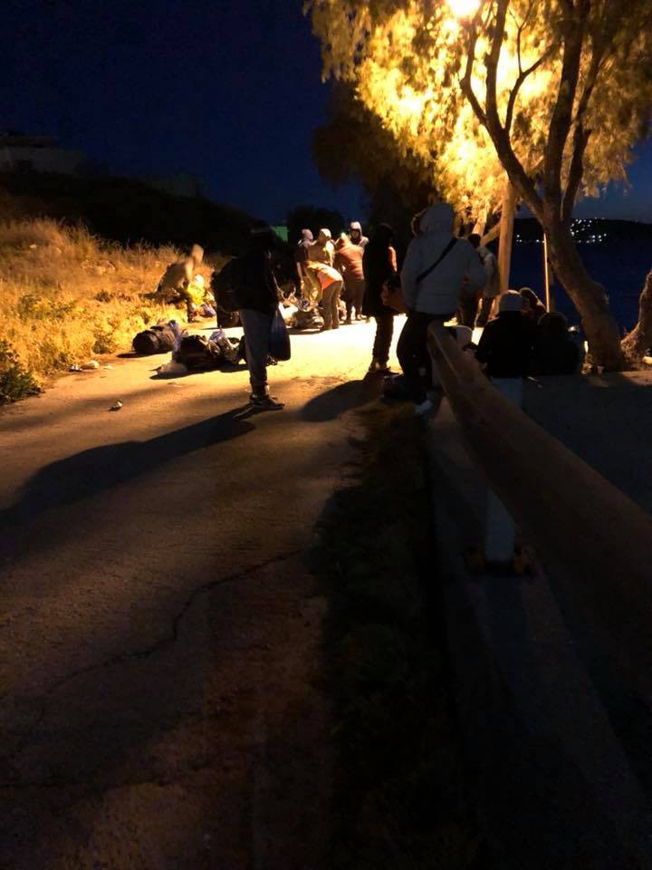

### AYS Daily Digest 3/4/18: Resilience in the face of more police expulsions
#### Croatian police using all ways for tightening the border knot / More people arriving to Greek islands, while some await for the results of their case for over 2 years / more deportations are planned from Austria to Croatia / volunteers and aid needed in different places / more news

![“Last week, a Sudanese man said some words as he was controlled by the police that have been stuck in my head\.
 I was in the camp when I noticed a group of policemen gathering around and talking to a man who was sitting next to his tent, isolated from the others\. 
 I couldn’t hear anything but it was very clear that the man didn’t understand what was happening to him — and that the policemen weren’t trying to make themselves understood\. 
 I made my way to them to see if I could help a little, or at least to try & understand the situation & explain it to the man in question — which seems like the very basic & minimum thing to do\. 
 More than once, I have seen the police — in Calais & in Paris — controlling/searching people without even explaining to the people concerned why & on what grounds these controls or searches were made\. 
 On all these occasions it has struck me how humiliating, terrifying and frustrating this is for the people to whom this is done, and how, very often, the police takes advantage of the language barrier to treat these people with no respect or dignity whatsoever\. 
 As the police may sometimes be hostile to a volunteer presence, I asked if they needed help with translating\. They then asked me to ask the man to show his papers allowing him to be on the French territory\.
 Panic attack\.
 I translated this to the man, in English, just before being told off by the police who said that they could have translated themselves if I could only speak English — funny that they hadn’t done so before then\. 
 Luckily, this guy had claimed asylum already and was able to present them the paper proving it\. 
 Not as luckily, this meant that this guy had claimed asylum, had the right to be on the French territory, but yet hadn’t been offered an accommodation by the government and had to live in a tent by the canal — like thousands of others\. 
 Turned out the man was speaking really good English\. 
 He asked the police why they were controlling him specifically and only got ‘because we’re doing controls’ for an answer \(in French, which I translated\) \. 
 After 10 minutes, the man asked if there was anything wrong & whether they needed anything else \(ten minutes for a single piece of paper does seem quite long\) \. He only got ‘you wait’ as an answer \(in English, this time\) \. 
 Throughout the wait, this man stayed stoic and patient, when the whole camp was looking at him\. 
 After 15 minutes, the police asked if they could take his phone number and told me that he had to move his tent \(when, two minutes before, another police officer said his tent was fine\) \. 
 That’s when this man couldn’t hold it anymore\. 
 He said “You want my number? No problem\. Do you want to call me? Are you going to give me a house? 
 Look at me\. I have done nothing wrong\. I have claimed asylum\. I showed you the paper\. 
 I live in a tent\. 
 This is not how human beings live\. 
 If you want me to show my paper, I will show you my paper\. If you want me to move my house, I will move my house\. 
 But this is not living conditions”\. His words were powerful\. 
 He said them calmly and remained humble & full of dignity despite the police’ chuckles\.
 More than that, his words were representative of these wen & women’s attitude despite being trapped in the most difficult conditions\. Through the worse times, I have only met beautiful, humble, and resilient people\. “— [**Faces Before Numbers**](https://www.facebook.com/FacesBeforeNumbers/)](assets/58c77f6ad40/1*HJQ7NG7H6ln6ctBRUZUMmg.jpeg)

“Last week, a Sudanese man said some words as he was controlled by the police that have been stuck in my head\.
 I was in the camp when I noticed a group of policemen gathering around and talking to a man who was sitting next to his tent, isolated from the others\. 
 I couldn’t hear anything but it was very clear that the man didn’t understand what was happening to him — and that the policemen weren’t trying to make themselves understood\. 
 I made my way to them to see if I could help a little, or at least to try & understand the situation & explain it to the man in question — which seems like the very basic & minimum thing to do\. 
 More than once, I have seen the police — in Calais & in Paris — controlling/searching people without even explaining to the people concerned why & on what grounds these controls or searches were made\. 
 On all these occasions it has struck me how humiliating, terrifying and frustrating this is for the people to whom this is done, and how, very often, the police takes advantage of the language barrier to treat these people with no respect or dignity whatsoever\. 
 As the police may sometimes be hostile to a volunteer presence, I asked if they needed help with translating\. They then asked me to ask the man to show his papers allowing him to be on the French territory\.
 Panic attack\.
 I translated this to the man, in English, just before being told off by the police who said that they could have translated themselves if I could only speak English — funny that they hadn’t done so before then\. 
 Luckily, this guy had claimed asylum already and was able to present them the paper proving it\. 
 Not as luckily, this meant that this guy had claimed asylum, had the right to be on the French territory, but yet hadn’t been offered an accommodation by the government and had to live in a tent by the canal — like thousands of others\. 
 Turned out the man was speaking really good English\. 
 He asked the police why they were controlling him specifically and only got ‘because we’re doing controls’ for an answer \(in French, which I translated\) \. 
 After 10 minutes, the man asked if there was anything wrong & whether they needed anything else \(ten minutes for a single piece of paper does seem quite long\) \. He only got ‘you wait’ as an answer \(in English, this time\) \. 
 Throughout the wait, this man stayed stoic and patient, when the whole camp was looking at him\. 
 After 15 minutes, the police asked if they could take his phone number and told me that he had to move his tent \(when, two minutes before, another police officer said his tent was fine\) \. 
 That’s when this man couldn’t hold it anymore\. 
 He said “You want my number? No problem\. Do you want to call me? Are you going to give me a house? 
 Look at me\. I have done nothing wrong\. I have claimed asylum\. I showed you the paper\. 
 I live in a tent\. 
 This is not how human beings live\. 
 If you want me to show my paper, I will show you my paper\. If you want me to move my house, I will move my house\. 
 But this is not living conditions”\. His words were powerful\. 
 He said them calmly and remained humble & full of dignity despite the police’ chuckles\.
 More than that, his words were representative of these wen & women’s attitude despite being trapped in the most difficult conditions\. Through the worse times, I have only met beautiful, humble, and resilient people\. “— [**Faces Before Numbers**](https://www.facebook.com/FacesBeforeNumbers/)
#### FEATURE

We’ve been receiving information that the Croatian police has been returning people to the bordering area with Bosnia and Herzegovina from Karlovac, but even from more distant cities like Zagreb, Split and Rijeka, where some had tried to approach the officers in order to ask for international protection\. However, a more worrying trend that we keep hearing about is that some families and individuals have been forcefully and violently treated in certain areas of the south of Croatia by the police officials\. There are mentions of shots fired next to a woman’s head, used as as means of scaring people on the move, in this case a family in the Imotski area\.

Several statements go to speak of such practice by the local police who have on March 29 stopped a family with 4 children at the local bus station and detained them for 8 hours, reportedly having given only a package of milk for the children during that time, and questioned them at the precinct\. After the questioning, in spite of the people having asked for international protection from the police, they were driven to the woods in the border area in order to head back to Bosnia and Herzegovina\. Their stance to not move from a spot made the officers pull a gun and fire shots in the air, just next to one of their heads, as they said in a statement given with the help of a translator\.

The border police in Croatia has been checking the buses and trains at the stations in cities \(seen in cities along the highway A3 leading up to Zagreb from the east of the country and in some places in Dalmatia\), even though these towns are not directly in the border\.
#### SYRIA

At least 46,000 people have been evacuated from Eastern Ghouta since the evacuation process began on 22 March\.

Evacuees are being accommodated at temporary refugee centers, and at local schools and mosques, in Syria’s north\-western Idlib and Aleppo provinces\.
Media [report](https://www.middleeastmonitor.com/20180402-13th-convoy-departs-e-ghouta-as-part-of-evacuation-deal/) that since mid February, more than 1,400 people have been killed in attacks by the regime and its allies in Eastern Ghouta, according to local civil\-defense sources\.

 ussia and the Assad regime to stop the invasion of Eastern Ghouta and break the siege\. 
 Let us pretend that we do believe that the UN failed to find any solution beside the forced displacement of civilians\.
 But how can we believe that the international community will not respond to the humanitarian situation in Idlib?
 More than 47,000 people were forcibly displaced to Idlib from Eastern Ghouta\. These families arrived to find only local organizations and community members trying their best to support them\. 
 While the generosity of locals is amazing, it’s not enough to support 47,000 new people\. Families are already facing a lack of resources in an area that continues to be bombed itself\.
 The international community failed to protect these families in their homes in Ghouta, and is now failing again to respond to this new crisis\.
 We feel how civilians in Idlib are committed to humanity by offering their support to us\. We feel grateful and relieved for the love they are showing us after what we went through in Ghouta\.
 But we need to put pressure on governments, UN agencies, and INGOs to act immediately to help the internally displaced people in Idlib\. — [**Ghouta**](https://www.facebook.com/ActForGhouta/?hc_ref=ARTzXePADFFju1T0heRSZ0ATt3PXAnFcSTf3GpbTh60pEurX4HbpeGQQQhh8lu_UoAs&fref=nf)](assets/58c77f6ad40/1*Z8lzmwphtR97R1g_MbN-_w.jpeg)

Let us pretend that we do believe that the international community couldn’t find the tools to pressure [R](https://www.facebook.com/hashtag/russia) ussia and the Assad regime to stop the invasion of Eastern Ghouta and break the siege\. 
 Let us pretend that we do believe that the UN failed to find any solution beside the forced displacement of civilians\.
 But how can we believe that the international community will not respond to the humanitarian situation in Idlib?
 More than 47,000 people were forcibly displaced to Idlib from Eastern Ghouta\. These families arrived to find only local organizations and community members trying their best to support them\. 
 While the generosity of locals is amazing, it’s not enough to support 47,000 new people\. Families are already facing a lack of resources in an area that continues to be bombed itself\.
 The international community failed to protect these families in their homes in Ghouta, and is now failing again to respond to this new crisis\.
 We feel how civilians in Idlib are committed to humanity by offering their support to us\. We feel grateful and relieved for the love they are showing us after what we went through in Ghouta\.
 But we need to put pressure on governments, UN agencies, and INGOs to act immediately to help the internally displaced people in Idlib\. — [**Ghouta**](https://www.facebook.com/ActForGhouta/?hc_ref=ARTzXePADFFju1T0heRSZ0ATt3PXAnFcSTf3GpbTh60pEurX4HbpeGQQQhh8lu_UoAs&fref=nf)
#### SEA

14,651 people have arrived in Europe in 2018, according to the estimates from IOM, national authorities and media sources\. Their Missing Migrants Project tracks incidents involving migrants, including refugees and asylum\-seekers, who have died or gone missing in the process of migration towards an international destination\. According to those data, up until now in 2018, 498 people have gone missing or have died while on the move\. 
See infographic and detailed data [here](http://missingmigrants.iom.int/) \.
#### GREECE

[Aegean Boat Report](https://www.facebook.com/AegeanBoatReport/?hc_ref=ARQHM6qalNn1GdhezDf2iaIQmT1Mroxg78hvjqMZaux4E4XmCcNaNQzStkMQ7UMQrnY&hc_location=group) has reported that five boats arrived on the Greek islands, carrying 204 people: four boats Lesvos, 169 people, one boat Chios, 35 people\.

 ‎ — CESRT\)](assets/58c77f6ad40/1*pkALkdCFTzXJG61xZZJ__g.jpeg)

Chios landing \(Photos: [Leonardo Sandrinelli](https://www.facebook.com/Leooo11) ‎ — CESRT\)

In the night from Tuesday to Wednesday 11 boats with a total of 475 people, were on the move towards the Greek islands\.
Only 5 boats made it, 204 people, the rest, 6 boats with a total of 271 people were apprehended by TCG/Police\.

8 boats had destination Lesvos, 4 boats arrived, 169 people, 4 boats were stopped by TCG, 179 people\.

2 boat had destination Chios, 1 boat arrived, 35 people, 1 boat was stopped by TCG, 43 people\.

1 boat had destination Kos, but was stopped by TCG, 49 people, Aegean Boat Report team reports\.

[**United Rescue Aid**](https://www.facebook.com/unitedrescueaid/?hc_ref=ARSXRJNSHQqAYV8GWHExzo18N9sxvkiwmEfmcj_WgFNhRXbC3A297wy9LjdXjssk1i0&fref=nf) are closing their emergency response service\.
For people still having to make the journey and who need assistance, they encourage them in case of need to contact the organization taking over their activities — Watch the Med directly on their **alarmphone; \+334 86 51 71 61\.** 
[https://alarmphone\.org/en/](https://alarmphone.org/en/) 
[https://alarmphone\.org/ar/](https://l.facebook.com/l.php?u=https%3A%2F%2Falarmphone.org%2Far%2F&h=ATOLZAmZuvAijn5MyOOXnvDZpwPR_gX86A9CGYMHex82mpsp612HnsW6I_CpVHEJq62bJ18ynDnMYtCPfAAFmGGhpVh3JzX3KyZjevOgV_P8gd-Q2USQL1GT-MjGF__LbseQ-A) 
[https://www\.facebook\.com/watchthemed\.alarmphone](https://www.facebook.com/watchthemed.alarmphone)
### Volunteers needed

**ECHO Refugee Library** is in urgent need of coordinators to continue the running of the mobile library project\. You can find a job description [**here**](https://bit.ly/2Jgal6S) \.

**Khora Community Center** in Athens is urgently looking for volunteer English, French, and German teachers\.

> We offer all levels of language from ABC´s to C1 fluency\. We take teachers with little or lots of experience, no certificate required\. We provide teachers with teaching resources and educational support\. We need teachers to teach at Khora for at least 4 weeks, the longer the better\! \! We are based in central Athens, close to Exarcheia\.
 

> Looking forward to hearing from you\! Send an email to khora\.education@gmail\.com for more information 

#### Office hours during Easter

Greek Asylum Service regional offices and all Greek public services will be closed on Friday April 6 and on Monday April 9 for Easter holidays

On Thursday April 5 GAS will be operating until 2 pm

GAS confirmed to Refugee\.Info that all appointments made for Thursday April 5 will take place\.

 \)](assets/58c77f6ad40/1*6DbZ0GW8ScElvzsajzg34w.jpeg)

If anyone can help in cases like this one, please put some pressure on those handling it \(Photovby: [Majida Ali](https://www.facebook.com/majida.ali.3367?hc_location=group_dialog) \)
#### HUNGARY
### Asking the officials

Even if a party rejects the quota system, or approves of the border fence, violence on our borders is something that is not acceptable\. 
Therefore, MigSzol decided to gather the different stances of political parties on it and in early March, they asked the following question from several political parties:
- **What is your stance on the violence towards migrants at the Southern border of Hungary? In the Hungarian parliament, what actions would you take with regards to the violence?**

Among other things, they concluded the border violence matters only to the four political parties\. Read more about the answers they received and did not receive following [this link\.](http://www.migszol.com/blog/border-violence-matters-only-for-four-political-parties)
#### AUSTRIA/CROATIA

We were told more deportations are planned from Austria to Croatia, some of them — again — of people whose possibility of Dublin deportation has expired\. We know of 2 people from a group of about 30 who were allowed to return to Austria in order to wait for the result of their legal case there which, according and following the ECHR decision on the Balkan Route, was negative\.The police has reportedly detained them in preparation for a deportation\. Several of those deportation would be unlawful is Croatia continues tacitly accepting supposedly Dublin returnees, while at the same time illegally pushing people out of Croatia when they contact the authorities wanting to ask for asylum\.
#### SPAIN

After 12 hours of distress and denial of help from the ship BAO RESOURCE \(Hong Kong\), the 34 people from a vessel in the south of Spain have been rescued on Tuesday, it is [reported](https://l.facebook.com/l.php?u=https%3A%2F%2Ftwitter.com%2FHelenaMaleno%2Fstatus%2F981139144167567360&h=ATPhoUtCGY1kWQ4BrIBTr-smBVE0qiVAEEM36t_OGiKnP1eILscvym8Uye_9Z2MqBI4o8YJZNhiyOYMEo2C2V9qIfm2LEIyDwt8nWUTJFLCs3cx_) \.

Spain last year received record number of asylum requests and arrivals by the sea\. Spain had 31 120 asylum requuests in 2017\. However, the money they had last year was not enough for all the needs and in this year the funds are [reportedly](https://www.eldiario.es/desalambre/partida-destinada_0_756974480.html) remaining the same, with a slight increase of only 1,7%\.
The aimed sum is [318 million euros for 2018\.](http://www.europapress.es/epsocial/migracion/noticia-gobierno-destinara-318-millones-euros-migrantes-refugiados-2018-millones-mas-2017-20180403173352.html) Such system has left persons sleeping and living outside, because there were no capacities for everyone in state reception institutions\.
#### FRANCE
### Paris

Drop in the Ocean has been with a small team in Paris for some weeks now, looking for ways to help refugees living under terrible conditions in the streets\.

> If you are interested and have the capacity to help with project planning and research, please let us know as soon as possible\. We need volunteers able to join our Coordinator 3–4 days a week during day time\. For questions and to show your interest, you may _write an email to paris@drapenihavet\.no\._ 

#### UK

#### SCOTLAND

Scotland Welcomes Refugees Gathering 2018 is a completely free event for connecting welcome groups, grassroot movements, like minded individuals and refugees with one another\. It will also provide a place for sharing ideas, listening to and discussing with refugees and refugee\-led organisations, along with a host interactive workshops and activities\. Find more information [**here**](https://www.facebook.com/events/199162584148251/) \.

**We strive to echo correct news from the ground through collaboration and fairness\.**

**Every effort has been made to credit organizations and individuals with regard to the supply of information, video, and photo material \(in cases where the source wanted to be accredited\) \. Please notify us regarding corrections\.**

**If there’s anything you want to share or comment, contact us through Facebook or write to: areyousyrious@gmail\.com**

_Converted [Medium Post](https://medium.com/are-you-syrious/ays-daily-digest-3-4-18-resilience-in-the-face-of-more-police-expulsions-58c77f6ad40) by [ZMediumToMarkdown](https://github.com/ZhgChgLi/ZMediumToMarkdown)._
