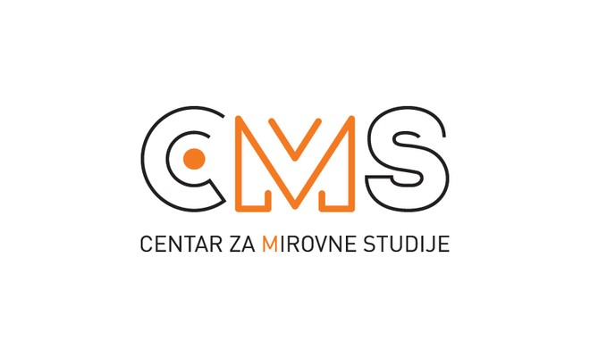
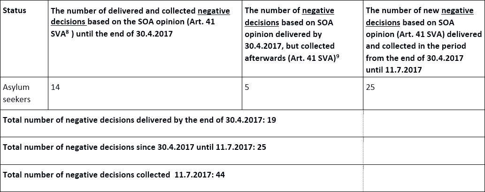
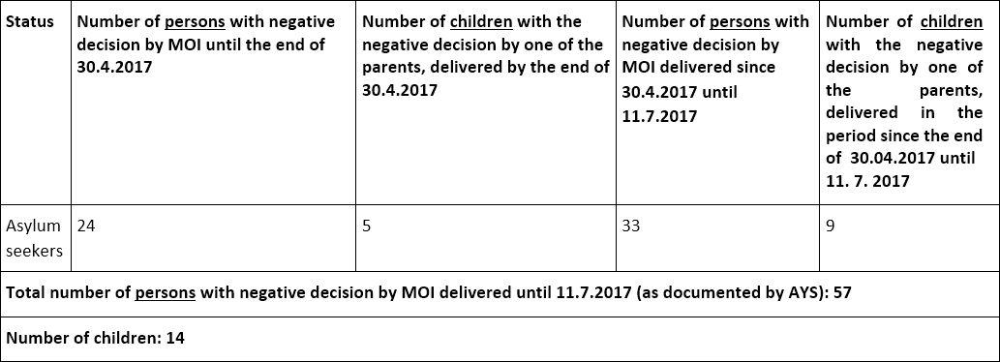

### AYS Special — **Second report on arbitrary and unlawful practices by the Croatian Ministry of Interior \(MOI\) and Security Intelligence Agency \(SOA\)**

**This article was originally published on 26\. July 2017\.** 
**Izvještaj na [hrvatskom](ays-special-drugi-izvje%C5%A1taj-o-arbitrarnim-i-nezakonitim-praksama-ministarstva-unutarnjih-poslova-c77a3e9e3c29) možete pronaći ovdje\.** 
**Lesen Sie den Bericht auch auf [Deutsch](ays-special-zweiter-bericht-%C3%BCber-willk%C3%BCrliche-und-rechtswidrige-praktiken-des-kroatischen-52c332fddc40) \.**

**BACKGROUND:**

At the end of April 2017, the Croatian civil society organizations \(CSO\) Are You Syrious? \(AYS\) and Center for Peace Studies \(CPS\) sent the **report on arbitrary and unlawful practices by the Croatian Ministry of Interior \(MOI\) and Security Intelligence Agency \(SOA\)¹** towards asylum seekers to the relevant institutions and the media\.

The CSOs reported on the **sudden increase** in the number of **rejections** of applications for international protection made by applicants from **Syria and Iraq,** as well as rejections of requests to regulate foreigner status in Croatia \(citizenship, temporary or permanent stay\) \. What is common among all above\-mentioned rejections is the MOI invocation of the Article 41² of the Security Vetting Act, i\.e\. the **rejection of the request due to a so\-called \(security\) obstacle** based on the assessment of the SOA\.

In accordance with Article 42 of the Security Intelligence Act³ and Article 5 of the Aliens Act⁴, SOA conducts a security vetting of persons applying for Croatian citizenship and foreigners in the Republic of Croatia whose residence is relevant to the security of the state, i\.e\. carries out vetting aimed at identifying potential threats to national security\. In accordance with Article 41 of the Security Vetting Act, SOA presents the applicant with only the opinion on the existence or non\-existence of a security obstacle for foreigners to be residing or residing in the Republic of Croatia and for persons who are being admitted to Croatian citizenship\. The MOI decides regarding the foreigner s status based on SOA s opinion, which may or may not have to be taken into consideration\.

In practice, the MOI, upon receiving applications for international protection or status regulation, almost regularly submits a request to SOA\. The agency then carries out the so\-called security vetting \. After the alleged security vetting was carried out, the SOA has submitted in most cases covered by this report an opinion stating only the following:

> _Based on the classified information marked with a RESTRICTED confidentiality degree, \[SOA\] establishes that there are obstacles in reaching a positi e decision ith regards to the application \[…\] \._ 

**SOA does not provide explanations of the reason for the safety obstacles to MOI\. Further the applicants, as well as their attorneys, are not being informed of the reasons either\.** Based on the SOA opinion, the MOI dismisses the applicant s application and instructs them to submit an administrative complaint to the Administrative Court of Croatia within 30 days\. However, **because of the lack of access to the relevant SOA files,** the plaintiffs’ \(asylum seekers’\) **attorneys cannot represent them effectively** , which consequently leads to **inactive participation in a legal dispute** and the **violation of the right to fair trial\.**

The first report by AYS and CPS also states that **SOA does not follow the decision of the High Administrative Court of the Republic of Croatia,** that has annulled the MOI decision based on the undisclosed SOA opinion in a similar case⁵, i\.e\. on the alleged secret information classified with the lowest level of classification \(‘RESTRICTED’\) \.

This practice leads to a **series of irregularities and arbitrariness** resulting in violations of the human rights of refugees and foreigners in the Republic of Croatia\.

In this follow\-up document, we report on the developments of the situation until July 26th 2017 that AYS and CPS have closely monitored since the beginning of April 2017\.
### **Situation at the end of July 2017:**
#### **1\. No answer from the state and public bodies within the legal deadline of 30 days⁶**

At the end of April 2017, AYS and CPS sent the report with the request for immediate reaction to all relevant institutions and bodies, namely: President of the Republic of Croatia; President of the Government of the Republic of Croatia; Speaker of the Croatian Parliament; Parliamentary Committee on the Interior Affairs and National Safety; Parliamentary Committee on Human and National Minority Rights; Ombudsperson; Ombudsperson for Children; Ombudsperson for Disabled Persons; Ministry of Foreign Affairs; The Security and Intelligence Agency; Committee on Citizens Monitoring of Security and Intelligence Agencies; The State Attorney s Office\.

No answer, nor explanation for the delay was provided by any of the bodies\. There was only the reply \(to our rush note\) by the Parliamentary Committee on the Interior Affairs and National Safety, sent on July 15th 2017, in which the Committee informed us that:

> “\(…\) the committee will hold a meeting in SOA during the autumn session, where the relevant persons from the Agency will provide answers to all questions related to internal policy and national security, as well as to the questions related to this topic \(…\)”\. 

Additionally, the Ombudsperson of Croatia has met the representatives of CPS and announced the investigation within her powers\. However, we do not possess any further information on the investigation\.

Furthermore, the agreement on the meeting with the representatives of the MOI Department for Foreigners and Asylum was not achieved, since the MOI representatives did not respond with a date suggestion\.

Some of the international organizations, such as Jesuit Refugee Service \(JRS\) have reacted to the described situation⁷, although we are still waiting for the reaction by the UN agencies in Croatia \(UNHCR, UNICEF, and IOM\) \.

Therefore, it is visible that the institutions are not responding to the findings of the presented report and that low attention is given to the violations of the human rights of refugees in Croatia\.
#### **2\. A more than 100% increase of the number of documented negative decisions based on the undisclosed SOA opinion, within a significantly shorter period of time \(April 30 — July 11 2017\)**

Although that the MOI information always refers to the **_cases_** — i\.e\. to the **number of the issued decisions** , the number of **real persons** — asylum seekers is far **higher\.** The reason is that **minor children are listed on the asylum application of one of their parents** \(usually mother\) \. For this reason, we have decided to show the information **both on the number of cases, as well as on the number of real persons** — asylum seekers whose lives are affected by these decisions\. This is especially important since it affects the rights of the most vulnerable group among the asylum seekers: **children and minors\.**

**Table 1** — Collected information on the number of the negative decisions by the MOI **based on undisclosed SOA opinion \(Art\. 41 SVA\)**

**Table 2** — Collected information on the number of **persons — asylum seekers with negative MOI decision based on undisclosed SOA opinion \(Art\. 41 SVA\) — including children asylum seekers listed in the application/decision of one of their parents**

In the time of the first report, AYS and CPS gathered 14 cases/decisions \(19 persons, since the decisions included 5 children, as well\) in which international protection was supposed to be granted according to the merits of the case\. yet it was rejected based on the SOA undisclosed opinion\. We have collected 5 more decisions afterwards \(6 persons altogether, since one of the decisions included a baby\), which were delivered to the asylum seekers by the end of April 2017\.

Since the end of April until the end of July, the number of such cases increased to 44 \(there were minimum 25 decisions delivered\) \. This means an **increase of more than 100% \(132%\) \.** If we count the **persons \(** and not the decisions\), then the increase is even greater: In the first period we documented 24 persons, including 5 children, while in the next period \(spanning a little more than 2 months\) we documented 33 persons, including 9 children with this variety of negative decision, which means the increase is **138%\.**

If we take into account that within this 3\-month period our organizations documented **only 8 positive decisions¹⁰,** the number of negative decisions based on undisclosed SOA opinion is 7 **times higher** than the number of the positive ones\.

The new cases include families with minor and **very young children \(i\.e\. 2\-year olds\) from Iraq \(Iraqi Sunnis, 25 cases or 42%\) and Syria \(21 case or 37%\) \.**

The last negative decision based on undisclosed SOA opinion is dated **June 26th 2017\.**

In the meantime, AYS and CPS have managed to collect the negative decisions with older date¹¹, that were previously inaccessible to us\. Thereby we have learned that the same type of negative decisions was given to the citizens of Palestine and Iran\.

**Increase of the number of rejections based on SOA opinion for almost 100%**

**3\. Clear statistics by MOI on granted and denied international protection within the period April\-July 2017 is lacking**

The statistics at the official website of the MOI is **available only until the end of March 2017** \(https://mup\.hr/ministarstvo/dokumenti/statistika\) \. The statistics on **positive decisions** of subsidiary protection or asylum are the only ones available \(altogether 23 during the first three months of 2017\), and there is nothing on the number of negative decisions\. Similarly, the last data by UNHCR Croatia is available only for 2016 \(www\.unhcr\.hr\) \. On July 25th 2017 we received the following information from MOI:

In 2017, 33 administrative disputes were initiated against the decisions rejecting a request for international protection under exclusion clause2\. In 24 cases the administrative dispute is pending, in 5 cases the appeals were rejected and in 4 cases the MOI decision was annulled\.

We must emphasize here that in our request for information, we insisted on the period April 1st — July 11th 2017, because most of the negative decisions based on undisclosed SOA opinion were observed within this period\.

Also, the **mentioned 5 cases** , in which the appeal was rejected by the Administrative Court in Zagreb, refer to those plaintiffs who **departed or fled before the Court** hearing\. Furthermore, **33 cases** refer **only** to those asylum seekers that have **started their court process \(many fled before even starting the process\) — AYS/CPS statistics until July 11th 2017 document 61 cases\.**

We sent another request for information on July 26th 2017\. This time we asked for the numbers of both negative and positive decisions within the period between the beginning of April and July 11th 2017\. With this information, we intend to establish the ratio of positive and negative decisions\.
#### **4\. In the case of annulation of the MOI/SOA negative decision, Administrative Court in Zagreb returns the case to the MOI/SOA**

According to the official reply by the MOI from July 25th 2017, there were **9 court hearings** in the cases of negative decisions based on undisclosed opinion by SOA\. In 5 cases, the plaintiffs left to other EU countries and, therefore, the Administrative Court in Zagreb rejected their appeal\.

**In 2 cases \(Court hearings\) the official translator did not show up at the hearing and the hearing was postponed\.**

In 4 cases, the plaintiffs showed up at the Court hearing and in these cases the Administrative court annulled the decision by MOI\.

Administrative Court has a legal mandate to independently determine the facts, to independently present the evidence and to grant asylum based on the merits of the case¹²\. Yet, in the 4 mentioned cases, the **Administrative Court did not grant international protection to the plaintiff\. This happened** despite the fact that the conditions for international protection were fulfilled\. But the court has **returned the case to the MOI and SOA for another round of assessment\.**

This behaviour clearly indicates that neither asylum process nor judiciary practice ensure the lawful and transparent treatment of the asylum seekers in respect to their human and refugee rights\.

Furthermore, this practice represents an unnecessary delay in the procedure and is contrary to the principle of court efficiency\.

At the time of finishing of this report, AYS and CPS came into possession of the latest verdict by the Administrative Court in Zagreb \(13\) \(number USL\-3410/16–15, date of the verdict 21 July 2017\) in one of the ͚41͛ cases, in which the Court also annulled the MOI decision based on the undisclosed opinion by SOA, pointing to the many omissions by the MOI during the first instance proceedings, such as the inadequate checks and erroneous interpretations of available evidence\. The text of the verdict shows three important elements:

**A\) The Court reviewed the SOA file, based on which it could have not establish the reasons for exclusion based on the articles 3014 and 3115 of the Act on International and temporary Protection**

During the dispute the Court has reviewed the report by SOA, in which, however, **the clear** **reasons** for the conclusion that the obstacles for granting positive decision in his application do exist and that the Subject fulfils the conditions from the provision of the article 30 and article 31 of the Act \(on international and temporary protection — AITP, Official Gazette 70/15\) are lacking\.

Given that the applicable law, by which the defendant acts in the cited provisions of **Articles 30 and 31, expressly cites the reasons** for the exclusion of international protection, asylum or subsidiary protection in the specific case, the **Court should be able to determine** with **certainty** , **from the submitted file** , the **existence of a statutory reason for exclusion,** which **in the particular case it can not\. 16**

**C\) The Court assesses that by denying the plaintiff the opportunity to be informed on the reasons for the exclusion of international protection under Articles 30 and 31 of the AITP constitutes a violation of the law\.**

However, **the plaintiff has not been given the opportunity to be informed of the reasons** for which it has been established that he meets the **requirements of Article 30 and Article 31** of the Act, **not stating the grounds for the statutory provision for the exclusion** of the requested protection, which, according to the Court’s assessment, **violated the provision of Article 30 paragraph 1 of the General Administrative Procedure Act** \(Official Gazette 47/09\) that stipulates that in the course of proceedings, parties must be given the opportunity to make a statement on all circumstances, facts and legal issues which are important for resolving the administrative matter\. Pursuant to paragraph 2 of the same Article of this Act, **proceedings may be conducted without** giving the party the opportunity to make a statement when the **application made by the party is accepted** or when a decision in the proceedings **has no negative effect on the legal interests** of the party, or when this is **prescribed by law, which is not so in the particular case** \. 17

**D\) The Court concludes that the MOI decision, which did not provide clear reasons for exclusion and gave no opportunity to the plaintiff to be informed on the reasons for exclusion, violated the law to the detriment of the plaintiff\.**

Therefore, as the explanation of the disputed decision does not contain clear reasons, which would indicate the grounds for conclusion of the defendant that the plaintiff fulfils the conditions of Articles 30 and 31 of the Act, because the exclusion grounds prescribed by these provisions are not specified, the Court finds that the disputed decision with its explanation, violated the law to the detriment of the plaintiff\.”¹³

**However, we should add that neither in this decision did the Administrative Court in Zagreb, regardless of its own explanation and regardless of its legal mandate, grant the protection to the asylum seeker, but it returned the case to MOI and SOA\.**

**5\.** **No information about any kind of the investigation on the people assessed to be a security threat**

So far, AYS and CPS do not possess information about any kind of investigation in the cases where the MOI gave a negative decision based on the SOA opinion\. On the contrary, **more than half of the people from the list fled** to Western EU countries\.

Also some of the persons, who received a similar decision in response to their citizenship request \(not international protection\) with such classification, continue to perform part\-time jobs for the MOI\.

**6\.** **Asylum seekers, often with very young children, abandon their applications and leave to Western EU countries, due to the fear of negative decisions**

Although the number of asylum seekers in Croatia during the last 3 months \(April — July 2017\) is rather steady — between 700 and 800 people, **the structure of people is not** — asylum seekers who applied for international protection in Croatia often abandon their applications and leave to other European Union countries\. This is a result of the negative decisions in which they are assessed to be a security threat \. The number remains steady because of the new arrivals from Serbia, Montenegro and Bosnia and Herzegovina, as well as due to **Dublin deportations, which in light of the recent EU Court of Justice ruling, can only be expected to increase\.**

The CSOs notice that, **when a negative decision** , which is perceived as unjust for objective reasons, **is delivered to one person or family, many other persons and families abandon their applications and leave the country in fear that they will be next\.** It is completely understandable that, for the arbitrary and unlawful practices described above, asylum seekers do not believe in justice of the system\.

According to AYS’s estimation for Porin, the largest reception centre in Croatia counting around 500 asylum seekers, **at least 70 people have left the centre, including a minimum of 20 minors and young children since July 6th 2017 \(the last 20 days\)** — 50 of them disappeared in a single night\. Within the same timeframe, 10 negative decisions were delivered to Iraqi and Syrian asylum seekers\. According to the second\-hand information that we possess, those that left, went to the countries of Western Europe\.

**7\.** **Suicide attempts and voluntary returns to war\-torn and unsafe countries due to the fear from negative decisions and long waiting periods**

The long periods waiting is nothing new for the asylum seekers in Croatia \(e\.g\. 2 families from Afghanistan were waiting for the decision for 1 year and 3 months, which in the end turned out to be negative\) \. But **long waitings accompanied by the recent negative decisions based on undisclosed SOA opinions spread fear, uncertainty and extreme frustration in the reception centres in Croatia:**

• On July 14th 2017, an asylum seeker in the Zagreb reception centre Porin attempted suicide due to a long waiting period and a recent wave of negative decisions based on SOA opinion;

• For the same reason, one Iraqi family with four children, one of them only one year old, decided to go back to Iraq, while one Syrian family from Aleppo with their four children \(including one small baby\) decided to go back to Turkey, at their own expense\.

• In the night of July 26th 2017, one asylum seeker from Zagreb attempted suicide by throwing himself from the window of the reception centre Porin\.

**8\.** **Request for the preliminary ruling to be sent to the Court of Justice of the European Union**

One of the attorneys representing the plaintiffs in cases of negative decisions by MOI based on undisclosed opinions by the SOA, Mr\. Zoran Bauer, is preparing a **request for the preliminary ruling to be sent to the Court of Justice of the European Union** \. In his request, he will ask the European Court to give a clear interpretation of the EU law regarding the treatment of the above\-mentioned cases and the right to participate in the proceedings, the right to equality of arms, as well as the right to a fair trial\.
### **Conclusion and request:**

Based on the presented facts, AYS and CPS consider that there is a visible and planned **_discouragement policy towards asylum seekers_** implemented by the State of the Republic of Croatia and manifested in the unlawful practices by MOI and SOA described in our reports\.

These unlawful and arbitrary practices clearly represent a violation of the human and refugee rights of asylum seekers\. They further indicate the necessity of urgent reactions by national and international bodies\. The good news is that the Administrative Court has identified the unlawful practices in several cases and has, thusly, overturned them\. But at the same time it is worrying that in these cases, the Administrative Court has returned the plaintiffs to the same institutions that carry out these unlawful practices, despite its mandate to grant international protection and regardless of the fact that all conditions for international protection were met\.

Furthermore, **this situation should be viewed in the light of the decision by the Court of Justice of the EU from 26 July 2017 in the case C\-490/16 and C\-646/16¹⁴\. In their ruling, the judges determined the responsibility of Croatia for the examining of applications for international protection by persons who crossed its border en masse during the 2015–2016 migration crisis\. This means that Croatia can only expect an influx of refugees from countries such as Slovenia and Austria\. Furthermore, the situation should be viewed in the light of the organized and reported violent push\-backs of refugees at the Croatian\-Serbian border and other parts of Croatia by the Croatian police¹⁵** \.

**We urge the national and international institutions and organizations to provide immediate reaction to the presented AYS/CPS report and its follow\-up\.**
### References

**Amnesty International Report 2017/2018 \(page 139\):**

[https://www\.amnesty\.org/download/Documents/POL1067002018ENGLISH\.PDF](https://www.amnesty.org/download/Documents/POL1067002018ENGLISH.PDF)

### Footnotes

[\[1\]](#_ftnref1) [https://cms\.hr/system/article\_document/doc/403/CPS\_and\_AYS\_ \- \_Report\_on\_arbitrary\_and\_unlawful\_practices\_by\_the\_Ministry\_of\_Interior\_and\_the\_Security\_and\_Intelligence\_Agency\_ \_related\_to\_ \_non\_approval\_of\_international\_protection\_or\_status\_of\_foreigners\_in\_Croatia\.pdf](https://cms.hr/system/article_document/doc/403/CPS_and_AYS_-_Report_on_arbitrary_and_unlawful_practices_by_the_Ministry_of_Interior_and_the_Security_and_Intelligence_Agency__related_to__non_approval_of_international_protection_or_status_of_foreigners_in_Croatia.pdf)

[\[2\]](#_ftnref2) [https://cms\.hr/system/article\_document/doc/403/CPS\_and\_AYS\_ \- \_Report\_on\_arbitrary\_and\_unlawful\_practices\_by\_the\_Ministry\_of\_Interior\_and\_the\_Security\_and\_Intelligence\_Agency\_ \_related\_to\_ \_non\_approval\_of\_international\_protection\_or\_status\_of\_foreigners\_in\_Croatia\.pdf](https://cms.hr/system/article_document/doc/403/CPS_and_AYS_-_Report_on_arbitrary_and_unlawful_practices_by_the_Ministry_of_Interior_and_the_Security_and_Intelligence_Agency__related_to__non_approval_of_international_protection_or_status_of_foreigners_in_Croatia.pdf)

[\[3\]](#_ftnref3) [http://www\.uvns\.hr/UserDocsImages/en/dokumenti/info\-security/Security\-Vetting\-Act\-ispravak\.pdf](http://www.uvns.hr/UserDocsImages/en/dokumenti/info-security/Security-Vetting-Act-ispravak.pdf) \(Page 10\)

[\[4\]](#_ftnref4) [http://www\.uvns\.hr/UserDocsImages/en/dokumenti/info\-security/Security\-Vetting\-Act\-ispravak\.pdf](http://www.uvns.hr/UserDocsImages/en/dokumenti/info-security/Security-Vetting-Act-ispravak.pdf) \(Page 11\)

[\[5\]](#_ftnref5) The decision by the High Administrative Court of the Republic of Croatia \(No\. Us10359/2011–7, from June 12th 2014\) in which the Court annulled the negative decision by MOI on granting Croatian citizenship to a foreigner, based on undisclosed SOA opinion\. In this case, SOA claimed that the person does not respect legal order of the state, based on the alleged information that was classified as RESTRICTED\.

[\[6\]](#_ftnref6) As regulated by the National Act on the Right to Access to Information \(Official Gazette 25/13 and 85/15\)

[\[7\]](#_ftnref7) [http://www\.jrs\.hr/2017/04/26/reagiranje\-isusovacke\-sluzbe\-za\-izbjeglice\-povodom\-brojnih\-prituzbi\-izbjeglica\-na\-proceduru\-odlucivanja\-o\-zahjevima\-za\-medunarodnom\-zastitom\-u\-rh/](http://www.jrs.hr/2017/04/26/reagiranje-isusovacke-sluzbe-za-izbjeglice-povodom-brojnih-prituzbi-izbjeglica-na-proceduru-odlucivanja-o-zahjevima-za-medunarodnom-zastitom-u-rh/)

[\[8\]](#_ftnref8) SVA — National security vetting Act

[\[9\]](#_ftnref9) The cases that were inaccessible to AYS by the end of April 2017\.

[\[10\]](#_ftnref10) Official and complete statistics of the MOI during this period are not available\. See point 3 of this document\.

[\[11\]](#_ftnref11) These negative decisions date from September 2016\.

[\[12\]](#_ftnref12) Act on Administrative Disputes \(Official Gazzette 20/10, 143/12, 152/14, 94/16, 29/17, Articles 3\., 33\., 58\. \)

\[13\] The hearing was held on July 10th 2017 and thereby it is not counted in 4 cases/decisions in which the Court annulled the MOI decision, which were mentioned in the MOI letter with the information on the number of cases\. AYS possesses, with the permission of the plaintiff, the entire text of the verdict\.

\[14\] The mentioned article of the Act on international and temporary protection \(AITP\), as warned by many lawyers and organizations, does not include threat to national security as a reason for exclusion: E lusio of as lu — Article 30

\(1\) Asylum shall not be granted to an applicant who meets the conditions under Article 20 of this Act if:
1. he/she enjoys the protection of or is receiving assistance from an organ or agency of the United Nations, other than the UNHCR;
2. he/she already has approval of stay in a state in which on the basis of that approval he/she has the same rights and obligations as the nationals of that state;
3. there are serious reasons for considering that he/she committed, incited or in some other way participated in committing: — 1\. a crime against peace, a war crime or a crime against humanity as defined by the provisions of international instruments; — 2\. a serious non\-political crime outside the Republic of Croatia, before his/her arrival in the Republic of Croatia, also including particularly cruel acts, even if committed with an allegedly political objective;
4. acts contrary to the purposes and principles of the United Nations as set out in the Preamble and in Articles 1 and 2 of the Charter of the United Nations\.

\(2\) If the protection or assistance referred to in paragraph 1, point 1 of this Article has ceased for any reason over which the applicant has no control and his/her status has not been finally resolved pursuant to the relevant resolutions adopted by the General Assembly of the United Natio s, he/she shall e g a ted as lu \.

\[15\] This article of the AITP, different from the preceding one, includes the threat to national security or public order of the state as an obstacle for granting international protection: Exlusion of subsidiary protection — Article 31

\(1\) Subsidiary protection shall not be granted to an applicant who meets the conditions under Article 21 of this Act if:
1. there are serious reasons for considering that he/she has committed, incited or in some other way participated in committing:

- a crime against peace, a war crime, or a crime against humanity as defined by the provisions of international instruments;
- a serious crime;
- acts contrary to the purposes and principles of the United Nations as set out in the Preamble and in Articles 1 and 2 of the Charter of the United Nations; or

**2\. if he/she constitutes a danger to the national security or public order of the Republic of Croatia\.**

\(2\) A serious crime referred to in paragraph 1, point 1, sub\-paragraph 2 of this Article is deemed to be a crime which, pursuant to legislation of the Republic of Croatia, is punishable a term of imprisonment of five years or more\.

\[16\] Original text of the mentioned verdict\.

\[17\] Ibid\.

[\[18\]](#_ftnref13) Ibid\.

[\[19\]](#_ftnref14) [https://curia\.europa\.eu/jcms/upload/docs/application/pdf/2017\-07/cp170086en\.pdf](https://curia.europa.eu/jcms/upload/docs/application/pdf/2017-07/cp170086en.pdf)

[\[20\]](#_ftnref15) For more information see the report by AYS and CPS \(January 2017\) — [https://medium\.com/@AreYouSyrious/report\-on\-illegal\-and\-forced\-push\-backs\-of\-refugees\-fromthe\-republic\-of\-croatia\-3f8c50ca10c1,](https://medium.com/@AreYouSyrious/report-on-illegal-and-forced-push-backs-of-refugees-fromthe-republic-of-croatia-3f8c50ca10c1,) and UNHCR Serbia \(July 2017\) \.

_Converted [Medium Post](https://medium.com/are-you-syrious/ays-special-second-report-on-arbitrary-and-unlawful-practices-by-the-croatian-ministry-of-6bd82c8a0baf) by [ZMediumToMarkdown](https://github.com/ZhgChgLi/ZMediumToMarkdown)._
