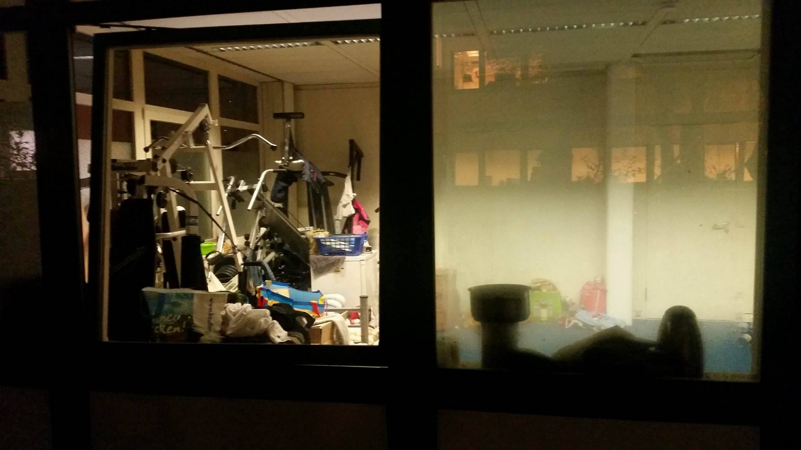
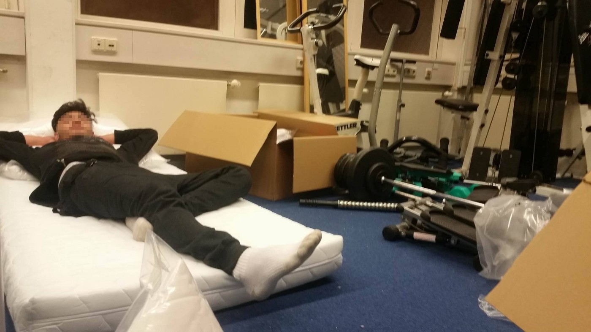
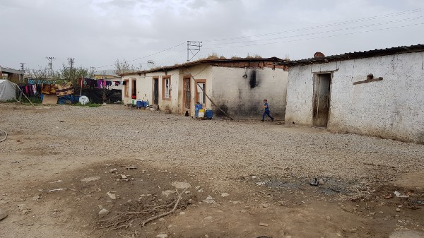
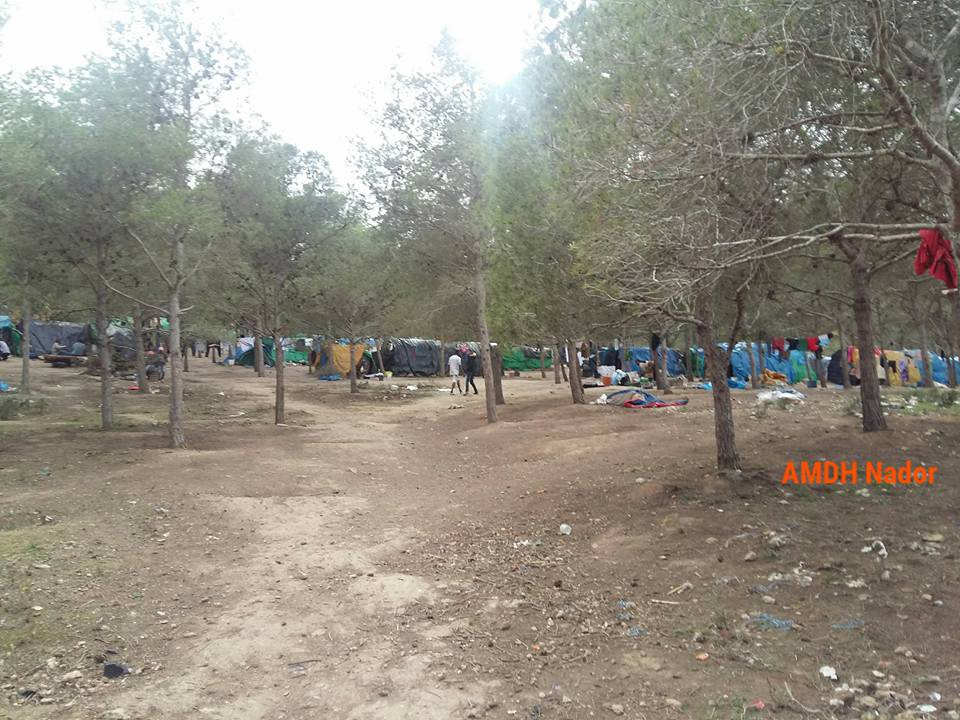
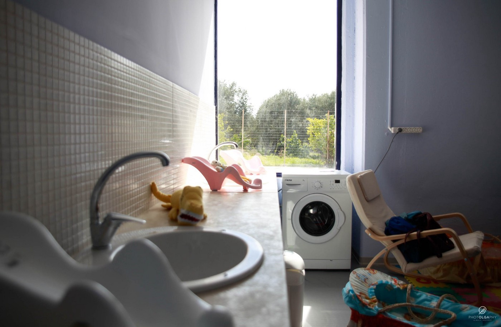
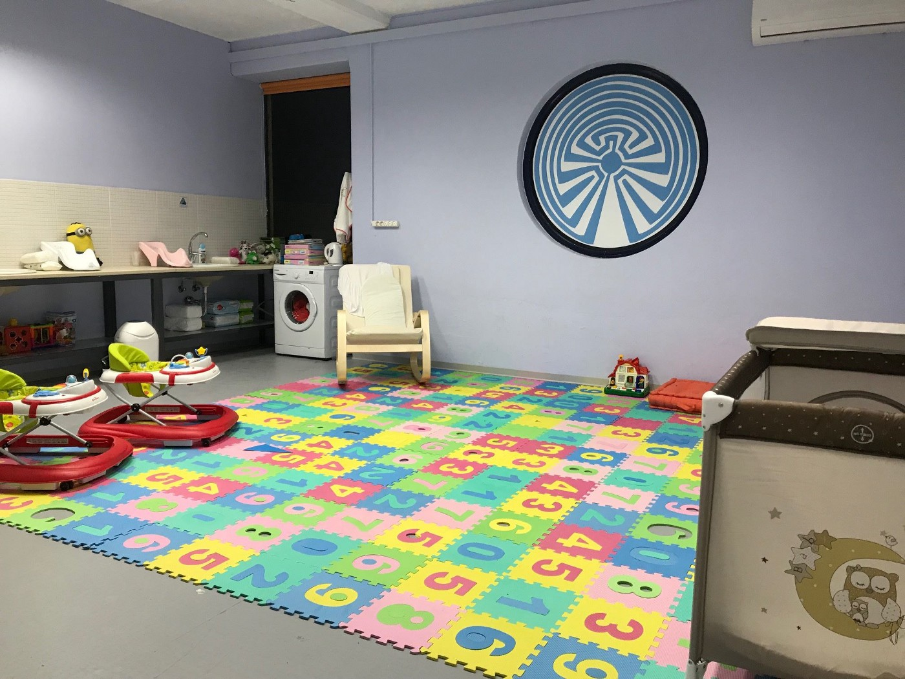
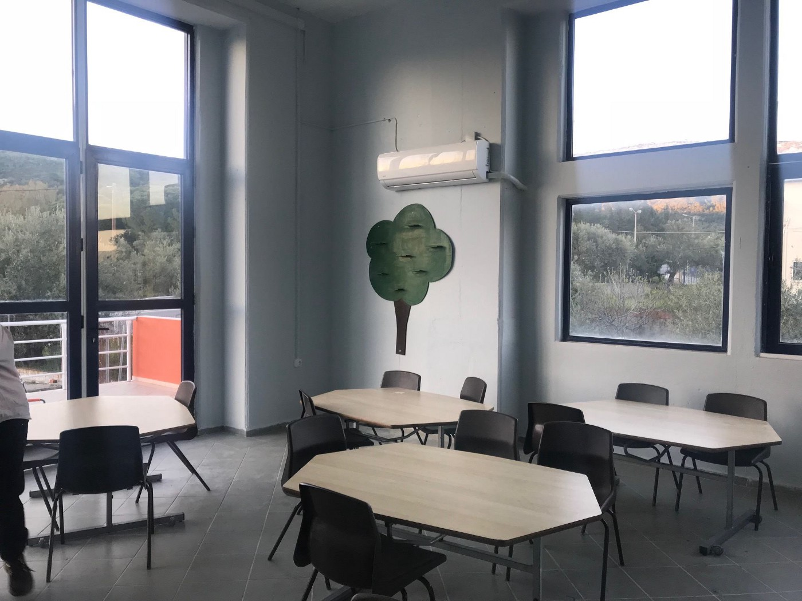
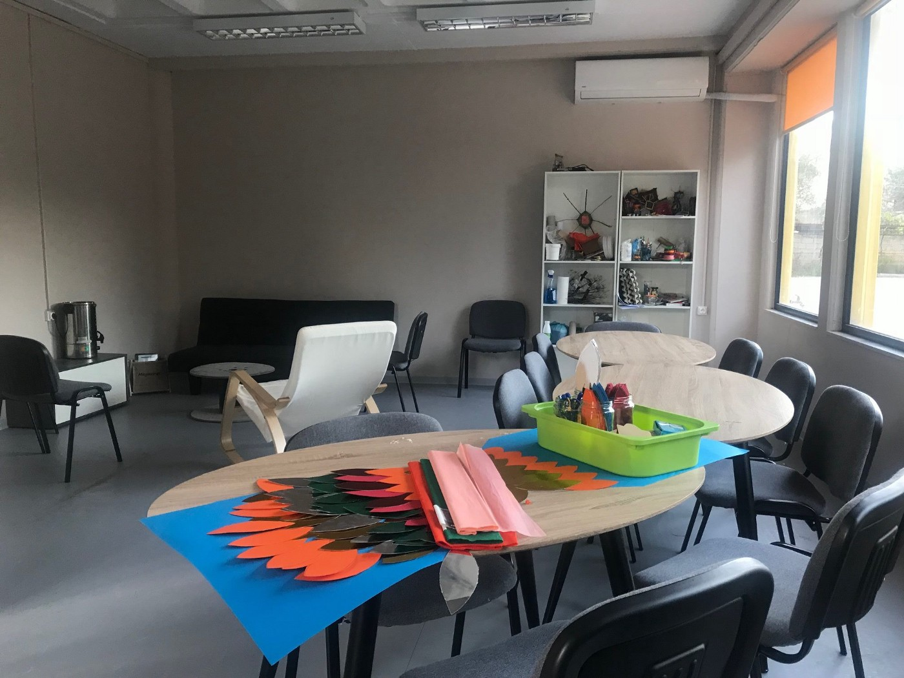

### AYS Daily Digest 9/4/18: Individuals and communities abandoned and deceived by the system
#### Unraveling stories of people left behind by the system across the continent / Silenced hardships of Syrian refugees in Turkey / attacks at refugees in Morocco / Italy — volunteers and refugees occupied train station of Briançon / Bosnia and Herzegovina with growing number of people arriving / Germany — Lower Saxony Court accepts Dublin / more news

 \)](assets/2c9ad7af1f2b/1*FcHf1PHYRxQcubwtFIfkuw.jpeg)

Traces of the big NGOs in the province of Izmir\. \(Photo: AYS, from the [Turkey Special](ays-special-from-turkey-abandoned-in-the-fields-654d3f925141) \)
#### FEATURE

F\., his younger brother and his mother are sleeping in a fitness room in a camp in Hochheim \(Taunus\) since two weeks now\. Even though they were promised a room for themselves immediately, they are still in this room between on a matress between fitness equipment\. “There is no privacy in it\. Everybody can see inside from the room outside”, he explained speaking to AYS\.

Photos: AYS

Two weeks ago, they were transferred from a camp in Kassel, that was closed, some 200 kilometers south\-western to Hochheim, altough there is not enough space to accomodate them\.

In the old camp they were served meals, while the new one is ‘self\-sufficent’\. This means, that the families receive more money to afford the food by their own means\. Still, the family did not get the higher social income support and was dependent on lending money from friends to deal with the new situation\.

Additionally, they now face far more struggles than in Kassel\. 
Other than his family, the Federal Office for Migration and Refugees wants to send the 21\-year\-old man alone back to Hungary due to an asylum status there — although since July 2017 no one was sent back to Hungary because of the inhumane conditions\. F\. filed a complaint to prevent the Dublin\-deportation, his lawyer and the court are still in Kassel\. 
In his old residence, he and his family found also psychological support\.

Because they were transferred to another district \(in the same federal state of Hessen\), they now have to travel every time 200 kilometers to use the structures they created during the last months and fulfill their legal duties\. Further they are without needed medication since then\. Hence, the family demands to be transferred back to their former, now familiar environment — or at least in the area\. Yet, unsuccesfully\. Volunteers, including AYS, are trying to assist them remotely at the moment\.

This is only the current status of an incredible, now almost two\-years\-lasting Odyssee\. AYS will report more on this\.
#### TURKEY

> With nothing to live on, many Syrians live on their own in the province of Izmir and have arranged a silent deal with Turkey 

If you are living in the fields in Turkey, you are left to yourself — or the camp community around you\. It can happen that no one comes to see you for months and you rarely have the chance to go into more socialized areas away from the olive trees and fields that surround your tents\.

With a population of more than 135,000 displaced Syrians, the Izmir province with its four million citizens further belongs to the top ten provinces to host Syrians in the country\.
Many people, including some of the poorest and most vulnerable groups, are living in these field refugee camps\. The camps are neither official nor completely makeshift, as the landowners take rent, while the officials quietly ignore them, no wanting to draw attention to the camps and conditions people live in\.

](assets/2c9ad7af1f2b/1*Azp1eRIufIQrRV3c9ZSd5Q.jpeg)

Photos: Photo: AYS volunteer authoring the [Turkey Special](ays-special-from-turkey-abandoned-in-the-fields-654d3f925141)

> Not all the camps visited had running water, and the lucky ones were provided with one water pipe\. To have drier floors, people have dug channels\. This also enables them to clean their tents and to take care of personal hygiene\. But at the same time, this creates another problem which will cause further problems, especially when the temperatures rise in the summer: the channels with dirty water are open, children jump into them, bugs will gather there\. Infections are easy to get there\. Most of these makeshift camps are already struggling with lice, some with scabies\.
 

> In these permanently dire conditions, even normal virus infections can cause serious problems\. People do not have a safe, stable and clean environment where they can be cured\. 

**Read our newest [AYS Special from Turkey — Abandoned in the fields](ays-special-from-turkey-abandoned-in-the-fields-654d3f925141) \.** 
**Find our previous story from Turkey here: [AYS SPECIAL — Turkey: The only hope is to return one day](ays-special-turkey-the-only-hope-is-to-return-one-day-1df83003a89b)**
#### MOROCCO

Since Sunday 37 migrants, including a couple of women, who were heading to Melilla, were abandoned in an inaccessible area of the Moroccan coast close to Beni Chiker\. According to the Moroccan Association for Human Rights, the responsible officials of the gendarmerie have promised to do everything in their power to assist and help the people in the vessel\.

Second report was made around 16h\.

> Migrants stranded at sea Beni Chiker have not been rescued yet\. AMDH contacted the Gendarmerie of Nador at 11\.30 am\. Although they have confirmed that they will do what is necessary to rescue them, nothing is done yet\.Hoping that they take their responsibility to intervene before night to save lives\. 

We have not yet received any feedback regarding the SAR action\.
### Attacks at the camps

[Association Marocaine des Droits Humains — Section Nador](https://www.facebook.com/AmdhNador/?hc_ref=ARSwVVoxJgPCIPd3MqGulIrkpdEFsUBSGNnH5Dky9_6D1WCS__jYnxyg9dG4RZcR29Y&fref=nf&hc_location=group) has reported about new attacks on refugee settlements in Nador\. Once again women are targeted, they report\. Nearly 9 women were arrested\. An injured woman was brought back to Hassani hospital\. AMDH called the firefighters from Nador who brought her back to the hospital\. 
Another worrying and important information they have communicated is that the official phone number is not available / they do not answer in situations of bringing back injured people to the hospital\.

Photos: AMDH
#### GREECE
#### Sea arrivals

One boat landed on north coast of Lesvos early Monday morning with
31 people on board:12 children, 6 women and 13 men, according to the local sources\.
This weekend 15 boats, carrying a total of 607 people, tried to cross from Turkey to the Greek islands\.
Only 5 boats made it, 203 people, the rest, 10 boats, carrying 404 people was apprehended by TCG/Police, the [Aegean Boat Report](https://www.facebook.com/AegeanBoatReport/?hc_ref=ARRpA6-U61sv8-UK7IM4yVPRvNSjCG20FyhO8p9tynz8Hg9u_040rr5TgqILI0n0a3Q) reports\.

](assets/2c9ad7af1f2b/1*rSB_xyU7Jr0anGpCzOM4KQ.jpeg)

“ Each washing machine has 300 kilos of blankets being washed,rather than tossed, while another load of blankets and one of clothes wait their turn … literally their turn\.” — [**Dirty Girls Of Lesvos Island**](https://www.facebook.com/dirtygirlslesvos/)
### Open discussion

From the Moria Hotspot until the Petrou Ralli detention centre, the struggle for freedom and dignity is a right, not a crime\.
Refugees Accommodation and Solidarity Space City Plaza organises an open discussion about the persecuted and imprisoned refugees of Moria and Petrou Ralli\.

[Together for Better Days](https://www.facebook.com/betterdays.ngo/) has announced opening of a new centre that is intended to serve as a child and family support hub catering specifically to people living in Moria camp\. We hope the place really serves the people in need with no restrictions or discrimination and hope to hear updates from the place\.

](assets/2c9ad7af1f2b/1*MbchwuZ0Lt-yJ0PQaOwJwQ.jpeg)

Photos: [Together for Better Days](https://www.facebook.com/betterdays.ngo/)

The Greek [media](http://www.lifo.gr/now/greece/187990/stin-kyllini-filoksenoyntai-oi-66-prosfyges-poy-entopistikan-se-istioforo-sti-glyfa) report that 66 refugees \(among them 24 children\), Kurds from Iraq and Afghans, were detected at a vessel in the sea, in the Elis district, and are now in Kyllini\. These refugees were already registered elsewhere in Greece\. Three suspected smugglers of Ukrainian nationality were arrested\.
#### BOSNIA AND HERZEGOVINA

](assets/2c9ad7af1f2b/1*FeW5rracX11pX9XpiUcWnQ.jpeg)

Photo: [Dylan Longman](https://www.facebook.com/dylan.longman?hc_ref=ARRAPuPZ32gXy347z1JTIE66bUPy8m0u5_191f9OUMa61BdLR_l9vM5lerQRLil8168)

The local office of the UNHCR in Sarajevo took some days off on the occasion of Easter, according to both Julian and Gregorian calendar — in practice this means that in the past two weeks, they have not been working for 8 days\. Since they are the only official address the people can turn to for registration and help upon arrival, eight days is a long time for the people reaching Sarajevo, whose number is growing\. Naturally, the volunteers were even more disappointed by the organization, seeing this happening \(again\) this weekend\. 
Volunteers and aid are still needed there, let us know if you wish to help and have no direct contact to any of the teams on site\.
#### AUSTRIA
### Sloppy courts or political pressure?

A negative decision in the first instance does not have to be negative, the practice shows and some officials confirmed to an [Austrian newspaper](https://kurier.at/politik/inland/asyl-42-prozent-der-negativ-bescheide-revidiert/400017991) \. Around 42 percent of all negative decisions were lifted off by the Federal Administrative Court during last year\. This was evident in a response by the Ministry of Justice to a question in the Parliament\.

As it seems, in 11,550 cases regarding the decisions made in 2017 on applications for international protection, granting of humanitarian residence permits and termination of residence, it was mainly Afghans who were turning to the Complaints Board\. The decision of the Federal Asylum Office was repealed or amended in 4,900 proceedings\. 
In another 900 cases, the assessment of the first instance was changed as regards the competence of Austria in so\-called “Dublin cases”\.
#### ITALY
### Desperate need for good integration

In their [annual report](http://centroastalli.it/wp-content/uploads/2018/03/astalli_RAPP_2018-def.pdf) , the Centro Astalli denounces that 40% of people who have arrived to Italy suffer from psychological traumas, especially young women\. Most of those people have gone through different traumas, violence and torture\. Worries are high for unaccompanied minors as well, as “they are often unable to confront the distance, the lack and the burden of responsibility to which they family of origin has been forced to send them to”\.

They are also the major critics to the insufficient service offered by the Sprar centres that we previously reported about in our daily digests\. Many are excluded from the programs and quite some — even if they stay until the end of the planned 6 months — in the end go back to the streets\. 
The only solution is a strong integration, the Centro Astalli team [warns](http://www.repubblica.it/cronaca/2018/04/09/news/report_migranti_centro_astalli-193385028/amp/?__twitter_impression=true) \.
### Tensions at the Alpine border between Val di Susa and Hautes\-Alpes

On Sunday evening a group of migrants, together with the volunteers who manage the solidarity center a few meters from the station, gathered around the train station of Briançon\. The local solidarity shelter has now exceeded the reception limits, the volunteers [said](http://torino.repubblica.it/cronaca/2018/04/09/news/migranti_frontiera_italia-francia_sempre_piu_calda_occupata_la_stazione_di_brianc_on-193378866/) , appealing for help and aid to be brought in order to be able to handle such influx of the recent days\. There are currently around 150 people in the station and since Sunday evening a “Gare occupée” banner appeared in front of the station that is now being named Chez Guillaume, as in the case of occupied church space the volunteers had named Chez Jesus\.
#### FRANCE

[L’Auberge des Migrants](https://www.facebook.com/AubergeMigrants/?fref=mentions) ​, in partnership with la Roya Citoyenne is organising a [long march](http://www.laubergedesmigrants.fr/) from the Franco\-Italian border all the way to Calais and hopefully Dover\.

> The march has 3 aims: to protest this criminalization of solidarity but also to voice our personal welcome of refugees and our demands that the authorities allow them to claim asylum in France and treat them according to international laws of Human Rights\. 

> This Solidarity March will start on April 30 in Ventimiglia, will stop for the night in both large cities, such as Marseille, Lyon and Paris, and smaller towns, 60 of them all together\. The march will arrive in Grande\-Synthe on July 5\. Please plan to come and walk with them for one day or several weeks, at any time during that period \. If you are not free, they especially are hoping you, British folks, will come to walk the last two legs of the journey, from Grande\-Synthe to Calais, on July 6 and 7\. 

> We ask all of you who have experienced the jungle to come back, walk, protest, celebrate, share a meal together and visit with the refugees still present in Grande\-Synthe and Calais, and who survive in conditions way more difficult than at the time of the big jungle\. 

For more info and registration for the march, go to: [www\.laubergedesmigrants\.fr](https://l.facebook.com/l.php?u=http%3A%2F%2Fwww.laubergedesmigrants.fr%2F&h=ATMPNSdF6MwfUTTTOEQPgARwLDnrkdm64rr_bcDepREFRG4qiGTYudjNmez9qfE7_AY6fqmuMvFa0lMN7JYm-gRtuwOqQtNf2GkvaB9Wo7hkySYuN1AwYp70gfWeXmYZ_hFFAQ)
#### [**Dunkirk / Dunkerque Refugee Women’s Centre**](https://www.facebook.com/refugeewomenscentre/) **needs support**

“Each evening we continue to distribute blankets, tents and water to those in need; yet with the temporary shelter saturated at its capacity of 150, and with people arriving daily, we are in need of 1–4 person tents and tarpuline to cover the increasing demand\.

If you can help us with donations please send us a message, or alternatively donate through the following link: [https://www\.gofundme\.com/womenscentre](https://l.facebook.com/l.php?u=https%3A%2F%2Fwww.gofundme.com%2Fwomenscentre&h=ATN6Ge8oJm8vHMXXbZOApXupBd_UQA9E3kwRauZv5pwBxi7wzkAB_qITtf1W-2-DeQ086flvJdlU2_9EX8Hn1JacTHGi_0IjFC_GpCev-A2Yf5-rabSmvOxEz6xP4yvWYtyAEQ) — any amount is gratefully received\!”

](assets/2c9ad7af1f2b/1*E0aTHAdeklH2Tdpw9Tuh5g.jpeg)

Photos: [**Dunkirk / Dunkerque Refugee Women’s Centre**](https://www.facebook.com/refugeewomenscentre/)
#### GERMANY

The federal constitutional [court of Germany has refused the urgent appeal](http://www.bundesverfassungsgericht.de/SharedDocs/Entscheidungen/DE/2018/03/rk20180320_2bvr126617.html) of a 13 year\-old Syrian minor with subsidiary protection to reunite with his mother, who is currently in Turkey\. If the mother would now be allowed to enter Germany, the decision could not be made undone, in case later it turns out, that she has not the right for it\.

The boy came to Germany together with his brother and uncle in 2015\. In summer 2016 they got their status\. People with subsidiary protection only have the right of reunions in hardship cases \(Dublin reunions excluded\) \. The mother is working in Turkey and meanwhile got the Turkish citizenship\.

But the court also referred, that the mother may have a right to get a visa for the reunion for “urgent humanitarian reasons”\. The judges said, that a positive decision would have had high impact on all other cases of minors with subsidiary protection waiting for a reunion with their parents\. it would have meant, that this practice would have to be applied to all of them\. This would have gone along with the suspension of the current laws\. 
Decisions of the federal constitutional court are landmark decisions\.

### ‘Dublin’ is valid at the Court

The Higher Administrative Court Lüneburg \(Lower Saxony\) today ruled, that asylum who have entered Italy as first EU country, have to go back there and do the procedure\. Complaints and lower courts argues before, that the asylum system in Italy has systematic defects\. The HAC said, Italy is working to improve for example the conditions of accomodations\. Also, the lower social care in Italy would be no legal reason, to come to Germany\. The 10th senate made this decision in overall ten cases and changed the rulings of the Administrative Courts in Braunschweig and Hannover and rejected the trials against the Federal Office for Migration and Refugees\. Appeals have [reportedly](https://www.kreiszeitung.de/lokales/niedersachsen/lueneburg-rueckfuehrung-fluechtlingen-nach-italien-rechtmaessig-9764640.html) not been allowed\.

#### SWEDEN

6 Afghan asylum seekers out of 27 planned to be deported will be sent back to Afghanistan\. The 6 from Sweden includes 5 retuning voluntarily and 1 forcibly deported\.

> The plane carrying 6 from Sweden will have a stop in Austria and take Afghan asylum seekers facing deportation and then head to Kabul\. We don’t have any exact number of people being deported from Austria yet\. 

](assets/2c9ad7af1f2b/1*7h8tD0hhwNqvWgjsl5MvDw.jpeg)

Photo/text: [Abdul Ghafoor](https://www.facebook.com/abdul.ghafoor.378?hc_ref=ARSryWBTAylq64cnp7QhObsS6aoXXhs8VTnlgWalp8B0YpufgO9CSaxaLj_Y3FSo6V8&fref=nf&hc_location=group)
#### SEA

■■■■■■■■■■■■■■ 
> **[MSF Sea](https://twitter.com/MSF_Sea) @ Twitter Says:** 

> > The #Aquarius has left the port of Catania tonight &amp; is now heading towards international waters. https://t.co/ZGWCh9HSaS 

> **Tweeted at [2018-04-09 20:19:25](https://twitter.com/msf_sea/status/983439260782071810).** 

■■■■■■■■■■■■■■ 

> **_We strive to echo correct news from the ground through collaboration and fairness\._** 

> **_Every effort has been made to credit organizations and individuals with regard to the supply of information, video, and photo material \(in cases where the source wanted to be accredited\) \. Please notify us regarding corrections\._** 

> **_If there’s anything you want to share or comment, contact us through Facebook or write to: areyousyrious@gmail\.com_** 

_Converted [Medium Post](https://medium.com/are-you-syrious/ays-daily-digest-9-4-18-individuals-and-communities-abandoned-and-deceived-by-the-system-2c9ad7af1f2b) by [ZMediumToMarkdown](https://github.com/ZhgChgLi/ZMediumToMarkdown)._
