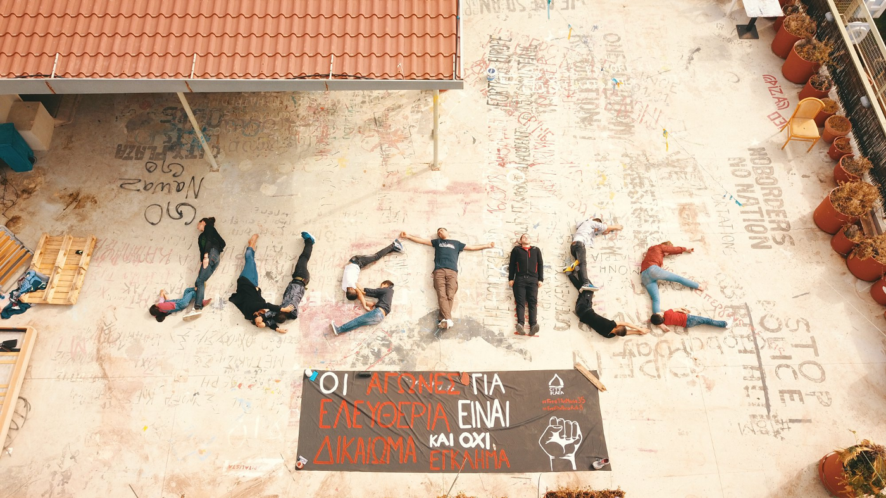
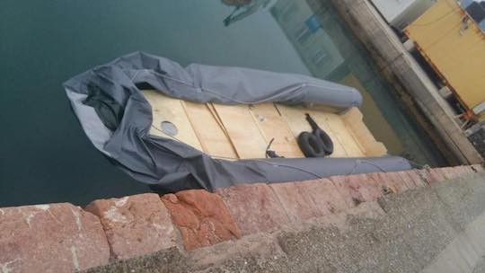
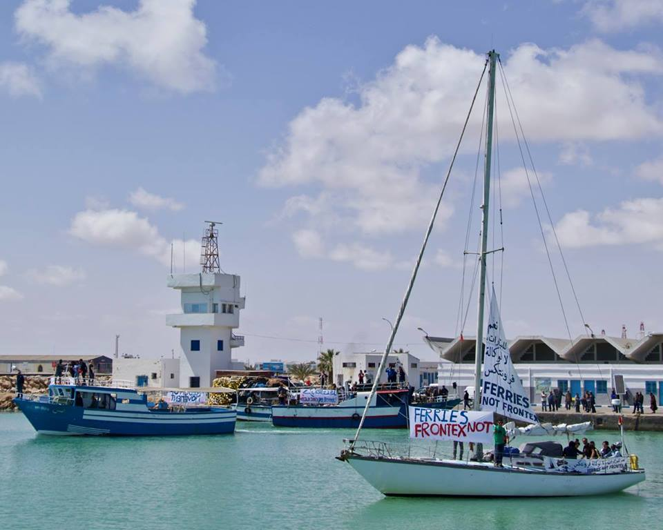
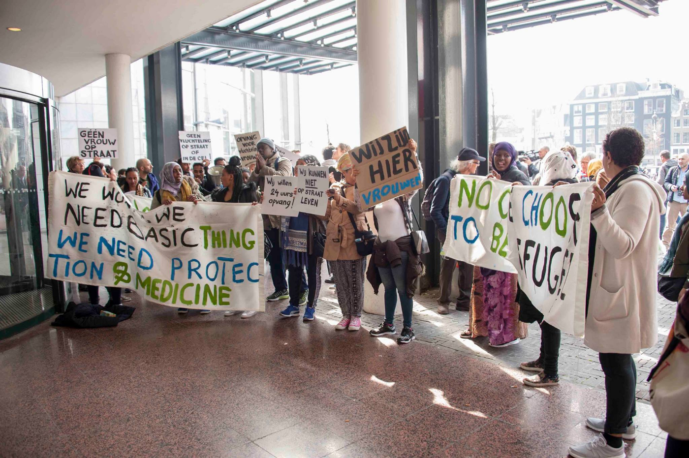
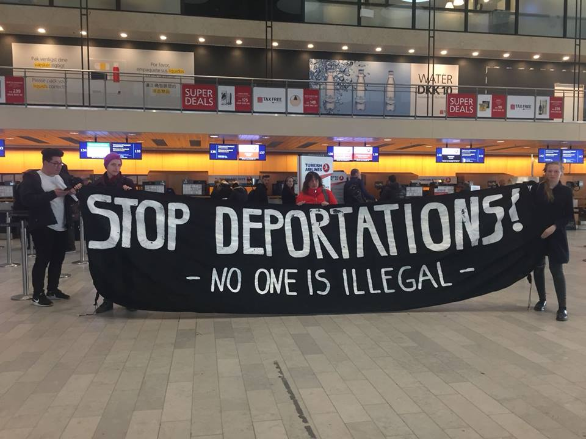

### AYS Daily Digest 11/04/18/: _Protests in solidarity with the Moria 35_

_Protests in solidarity with Moria 35 in Greece//Protest against EU migration policy in Tunisia//Family of six deported to Afghanistan from Denmark//Report on ‘hostile environment’ policies in UK//_

Photo by Refugee Accommodation and Solidarity Space City Plaza
### Feature
### Protests in Solidarity with the Moria 35

On Saturday, several events will take place in solidarity with the Moria 35 and the eight from Petrou Rali\. The Moria 35 refugees were arrested after a protest in the Moria camp\. Solidarity Now notes that brutal police violence was used and that the refugees are facing excessive criminal charges despite no individual evidence existing against them\.The Legal Centre Lesbos says many of the 35 arrested were not present at the morning’s peaceful protest, leading observers to conclude the arrests were arbitrary and that people were targeted because of race, nationality, and location within the camp at the time of police raids\. A total of 30 defendants have been detained since 18th July 2017, despite petitions by the Lesvos Legal Centre and Solidarity Now attorneys to release individuals with severe mental and physical health conditions\. Seven other refugees have been restricted to the island of Lesvos while awaiting their trial and have limited access to health care and humanitarian aid\. The trial will take place on Friday 20th April\.

Meanwhile, the eight asylum seekers from the Petrou Ralli detention centre are awaiting trial after being subjected to police violence on 31st May 2017, when attempting to speak to the centre’s director about their detention conditions, according to City Plaza\. Their trial will take place on on 27th April 2018 in Athens, on charges including resistance to the authorities, attempted assault and carrying dangerous objects\.

On Saturday, a [march](https://www.facebook.com/events/548435702203462/) will start from Monastiraki, Athens, at 12PM, demanding the acquittal of all of the refugees charged, the cancellation of the EU\-Turkey deal and the transfer of all refugees from the Aegean islands to the mainland\. At 6PM, an [open discussion](https://www.facebook.com/events/214604605799717/) will start at City Plaza on the situation of the imprisoned refugees of Moria and Petrou Ralli\. At 9PM, a [solidarity part](https://www.facebook.com/events/172100483601249/) y will take place at Tsamadou 15\. Another [solidarity party](https://www.facebook.com/events/1627584914021808/) will take place in Thessaloníki at 10PM\.
#### Greece
### Arrivals by sea to Greece

One boat landed on the south coast of Lesvos on Wednesday just after midnight, carrying 24 people\. A second refugee boat arrived on Lesvos carrying 35 people\. One boat arrived on Chios in the morning carrying 34 people\. Yesterday night 30 people arrived in Kastelorizo and reached Rhodes this morning\.

Photo by Salvamento Marítimo Humanitario

The UNHCR’s report “Desperate Journeys” says 29,718 people arrived by sea in Greece in 2017 while 5,318 arrived between January and the end of March this year\. However, facing closed borders, refugees have increasingly been looking for alternative routes\. More people have started crossing the sea from Turkey to Italy, Cyprus or Romania, and more people have sought alternative routes onwards from Greece, including via Albania, Montenegro and Bosnia and Herzegovina\.
#### Sea
### Protest against EU migration policy in Tunisia

Photo by Watch The Med — Alarmphone

On Monday in Zarzis, Tunisia, 100 people, including fishermen and human rights activists, demonstrated against the ongoing deaths and disappearances at sea caused by the EU’s migration policy and the criminalisation of rescue operations in the Mediterranean\. Watch the Med says Zarzis is a daily witness to the violence of the EU border regime, as it hosts the “cemetery of the unknown” with the bodies of those who are found but never identified on the shores around town:

> “The fishermen are at the forefront of the migration tragedy\. They suffer from the distress of being confronted with the many bodies which get caught in their nets out at sea” 

Jugend Rettet notes that with the criminalisation of rescue ships, fewer rescues can take place\. In January 2017, 254 people died in the central Mediterranean compared to 243 in January 2018, despite far fewer boats trying to cross the sea\.
#### Netherlands
### Protest against eviction in Amsterdam

Photo by Manette Ingenegeren

On Wednesday, the women of We Are Here, a group of refugees in Amsterdam, demonstrated in front of the City Hall, as they had to leave their building\. They need a place to stay and are asking the municipality to do something about their situation\. We Are Here describes itself as a group of people that does not get any housing provided by the government but also is not allowed to work — the group decided to make their inhumane situation visible instead of continuing to hide\.
#### Denmark
### Family of six deported to Afghanistan

Photo by No Deportations Without Resistance — Ingen Udvisninger Uden Modstand

An Afghan family of six was deported from Denmark to Afghanistan yesterday night\. The father is 89 years old and nearly deaf\. The mother has high blood pressure and a badly functioning heart\. The Danish Police broke the wrist of the 63\-year\-old mother when she resisted\. The 16\-year\-old daughter of the family has written a letter to the association Dansk Flygtningeven\. In it, she says she was born in Iran and has never been to Afghanistan\. Her parents left the country more than 35 years ago\. She writes:

> “We can’t go back to Afghanistan, because we would be killed, tortured, kidnapped, all horrible stuff could happen” 

The family is now in Afghanistan and will stay in a hotel for two weeks\. After that, they will have to take care of themselves, despite having no support network or family left in the country\.
#### France
### First anniversary of La Linière Camp destruction

One year ago, fires destroyed the La Linière Camp in Dunkirk\. Help Refugees says conditions have worsened in the year since the fire, with roughly 400 people left in limbo, many still sleeping rough, including families with small children\. Three long\-term volunteers have reflected on the fires and what has changed or rather what has not changed since then \( [here](https://medium.com/thedigitalwarehouse/one-year-on-b1a07589a2c8) , [here](https://medium.com/thedigitalwarehouse/why-are-not-talking-about-dunkirk-e4e1cd8999f8) and [here](https://medium.com/thedigitalwarehouse/they-were-praying-in-the-direction-of-mecca-yet-i-could-only-see-the-misery-2e2bd80fa6be) \) \.
#### UK
### Report on ‘Hostile Environment’ policies

The human rights group Liberty has released a report called “ [A Guide to the Hostile Environment](https://www.libertyhumanrights.org.uk/sites/default/files/HE%20web.pdf) ”, detailing policies meant to prevent undocumented people from accessing housing, healthcare, education, work, bank accounts, benefits and even drivers’ licences\. Crucially, the report also includes groups working to defend migrants’ rights in all of these sectors as well as a “What you can do” section\.

Help Refugees also notes the unfairness of the asylum system: people have to wait for years before their asylum claim is accepted or rejected and meanwhile have to live on £37\.75 a week\. If refugee status is granted, all government support then stops and refugees must move out of state\-supplied accommodation within 28 days\. Help Refugees calls on the government to increase the weekly allowance for asylum seekers and extend the ‘move on’ period for newly recognised refugees\.

**We strive to echo correct news from the ground through collaboration and fairness\.**

**Every effort has been made to credit organizations and individuals with regard to the supply of information, video, and photo material \(in cases where the source wanted to be accredited\) \. Please notify us regarding corrections\.**

**If there’s anything you want to share or comment, contact us through Facebook or write to: areyousyrious@gmail\.com**

_Converted [Medium Post](https://medium.com/are-you-syrious/ays-daily-digest-11-04-18-protests-in-solidarity-with-the-moria-35-6fd59cefc44a) by [ZMediumToMarkdown](https://github.com/ZhgChgLi/ZMediumToMarkdown)._
