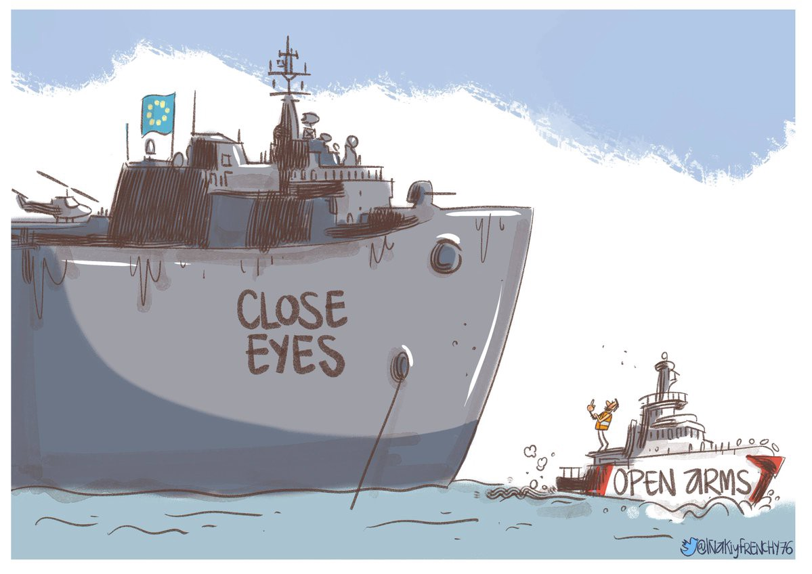
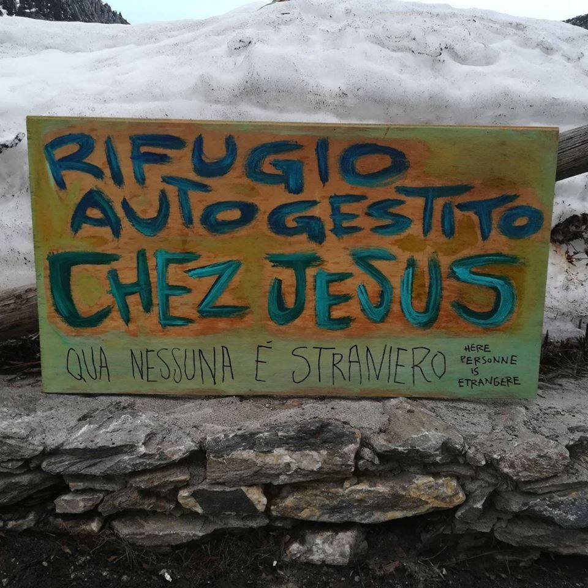

### AYS DAILY DIGEST 16/04/2018: Free at last\!

_Proactiva Open Arms has been released//Arrivals in Greece//Demo in Mytilini on Tuesday in solidarity with the Moria35//Donations and volunteers needed in Rhodes and Lesvos//Solidarity with the firefighters accused of saving lives at sea//2 years birthday party of City Plaza//Travel agency been accused of delays in buying tickets for family reunification has now been removed from offering the service//Refugees who can and received documents for family reunification, need to buy tickets on their own before the 6 months deadline//Demo in Paris against the new immigration bill//New self\-managed shelter opened on the French\-Italian border_

Credit: Inaki y Frenchy

**FEATURE**

The preliminary investigation judge of Ragusa \(Sicily\), Giovanni Giampiccolo, ordered early this morning [the release](http://www.ansa.it/english/news/general_news/2018/04/16/judge-orders-release-of-open-arms-ship-3_4132bc55-7909-4fac-a744-e7341e10644d.html) of the vessel of the Spanish NGO, Proactiva Open Arms\. The ship has been anchored in the port of Pozzallo since the 18th March, when it rescued and brought to Italy 218 migrants, refusing to hand them to the Libyan Coast Guard\.

The vessel has been seized following the order of the prosecutor of Catania, Carmelo Zuccaro, who accused the NGO of aiding illegal immigration and not respecting international treaties\.

On the 27th March, a judge, Nunzio Sarpietro, in Catania extended the seizure but transferred the case to the authorities in Ragusa, rejecting allegations of criminal association\.

The release would be immediate and should have been carried out during the day\.

Now, we demand the release of the Juventa as well, Jugend Rettet’s vessel, which has been under seizure since last August, with similar charges and accused by the same prosecutor\!

**\#freeJuventa**

According to the [latest figures](https://missingmigrants.iom.int/region/mediterranean) published by IOM \(Missing Migrants Project\), 559 deaths were reported while trying to cross the Mediterranean from January till 16 April 2018, the deadliest route being the Central Mediterranean \(359, in the same period of time\) \. The total number of arrivals is 17\.448 in 2018\.

**GREECE**

_Arrivals_

55 people [were rescued](https://www.facebook.com/AegeanBoatReport/posts/333537697169341?hc_location=ufi) off Varia, south of Lesvos, early this morning\.

The TCG Command released some [data](https://www.facebook.com/AegeanBoatReport/posts/333848773804900?hc_location=ufi) regarding the number of boats that were stopped in the Aegean during the weekend\. Of the 25 boats heading towards Greece, only 9 managed to reach the islands \(399 people, according to their data\), while the other 16 boats \(carrying 766 people\) were halted by the Turkish authorities\.

_Islands_

**Rhodes**

Donations are needed to assist refugees in detention facilities on the island\. Specifically, they need: cereal bars, baby food, men’s underwear L\-XL\. If you can help, please get in touch with [OASIS — Rhodes Island Solidarity Group](https://www.facebook.com/nobordersnetwork/photos/a.660787423989153.1073741828.657905327610696/1719317331469485/?type=3&theater) \.

**Lesvos**

[Volunteers](https://www.facebook.com/philippa.kempson.1/posts/10155771230599355?hc_location=ufi) , self\-funded and over 21 years, are needed for short and long term\. Tasks vary from warehouse distribution in Mytilini to coast watch/response in the North of the island\.

Tomorrow \(17/04\) at 6 PM, [a demo in solidarity](https://www.facebook.com/NBKLesvos/posts/1120094398130348) with the Moria35 will be held in Sapfous Square \(flyers of the demo are available in different languages\) \. On the 18th July 2017, [35 migrants were arrested](https://www.opendemocracy.net/can-europe-make-it/carmen-ayllon-alysia-urrutia/struggling-for-dignified-life-is-right-not-crime-moria-35-punitive-tria) after various protests from inside the detention centre; they denounced the horrible living conditions inside Moria and the “unlawful delays in their asylum applications”\. 35 people \(34 are black men\) were arrested despite the fact that there’s no clear evidence of their individual participation and, since then, have been detained in different facilities in Lesvos, Chios, Athens, Attica and Central Greece\. Since July they’re waiting for a decision on their unlawful trial, that will take place this Friday 20th in Chios\.

“ _This particular case should not be taken as an isolated event but as existing within the larger repressive framework of the Greek state and the EU’s anti\-migration policies_ \.”

Here you can find a link to an interesting documentary that has been released on the case of the Moria35, including testimonies of migrants and volunteers\.

Meanwhile, other 3 firefighters from Proemaid and Team Humanity are under trial in Lesvos for, again, saving lives at sea\. The trial will start on 7th May and the charge is human trafficking\. **\#savinglivesisnotacrime**

_Mainland_

In some exceptional cases, people who received approval for family reunification should now pay for their own tickets if they want to leave Greece as soon as possible\. “ _\[…\] applicants who have received an approval for Germany in April or May 2017 and applicants who have received an approval for any other country than Germany in October and November 2017 can go to any travel agency they want and try to book their ticket_ ”\. The travel agency will then need to get in touch with the Greek Dublin Unit to finalise the booking\. Mobile Info Team also wrote a letter that refugees can bring with them when going to the travel agency\. For more information on what documents are needed and further guidelines, please see [here](https://www.facebook.com/mobileinfoteam/posts/2156297627932288:0) \.

The Ministry of Immigration [published a statement](https://l.facebook.com/l.php?u=https%3A%2F%2Fdiavgeia.gov.gr%2Fdecision%2Fview%2F6%25CE%259F%25CE%25A1%25CE%25A4465%25CE%25A7%25CE%2598%25CE%2595-9%25CE%259B%25CE%25A6&h=ATMS6OCGTZOoLAGQ7Fi23cvQ_GD1NksEtThAFsT7_vAG-L-knuk76J0qD0Zbcx_LwEV7rmDiespUgBCt8K1NJMhQwOjYkFd4eo8JQpU8cSeuZk5JNSEbNtpjrw) \(Greek only\) on the decision to suspend the economic operator ZORPIDIS SA\. from the role of official transport service for family reunifications, because of “ _the fact that there is an urgent need to move people to the Member States, according to the \(Migration\) Office’s instructions, otherwise \(the delays in the bookings would represent\) a serious possibility of loss of the right of recipients to family reunification_ ”\. In fact, after 6 months from the notification of acceptance of the family reunification request, migrants lose their right to join their families in other EU countries\.

Zorpidis Sa, “ _in spite of the special formal notice and written instructions of the Office, has frequently been found not to have complied with it_ ”\.

The agency “ _1\. has not issued the total of the air tickets for which it had already been informed officially by our \(Asylum\) Service within the time limit \(28/02/2018\); 2\. has not made the reservation within the deadline provided \[…\]_ ”\.

The Ministry of Immigration, therefore, “ _declines the contractor — financial operator named ZORPIDIS TOURISTIC ORGANIZATION SA, as it was absorbed and merged by ZORPIDIS SA and invites the contractor to provide explanations on Wednesday 18/04/2018 to the Asylum Service_ ”\.

This weekend there will be an event to celebrate the incredible work carried out by City Plaza in the past 2 years\. Join them for great folk music, good food from around the world, solidarity and joy\. “ _All the income will go to ex\-workers of City Plaza who are struggling for their compensation since 2010_ \.”

**FRANCE**

**Paris**

Demo on Tuesday \(17th\) at 1 PM in front of the Immigration Museum to protest against the new asylum law\. For more info on the [content of the Bill](ays-daily-digest-15-04-2018-protests-in-paris-against-new-immigration-bill-ff87c77c4485) and demos held on Saturday, see [here](https://www.facebook.com/baam.asso/posts/803500593175141) \.

**Dunkirk**

Dreadful living conditions for the around 50 unaccompanied minors in the Grande Synthe area\.

Please, sustain the incredible work done by Refugee Women’s Centre to support these vulnerable people, by signalling them to social services, finding appropriate accommodation for those in need and guaranteeing psychological support\.

**French\-Italian border**

Credit: Briser les Frontières

The self\-managed shelter “Chez Jesus” has opened since almost a month in Claviere \(Montgenèvre — Briançon area\) and has seen, since then, more than 100 people coming and going to reach France or other part of Europe, “ _each and every one with their own valid reason to leave, each and every one with their own rightful desire to arrive_ \.” This place, under the church of Claviere, offers restore to those on a journey, a place to rest, share a meal and a laugh and get to know each other\.

“ _During these hours spent together we have come to understand better the situation in the government’s Reception Centres, from which most people arriving here have fled\. We have come to understand the logic of blackmail and of infantilisation that takes place within them, and from that comes the need to open a self\-managed space\._

_A place where, if even for a few hours, there is no need to possess documents or fill in their damned questionnaires\. A place where no one is catalogued, and no one is excluded\. A place where every one is fully responsible for themselves and for taking care of the space around them_ \.”

To keep going, people in solidarity and on the move need food, boots, gloves, jackets, ideas, time and practical contributions, so if you can and feel you want to contribute, please contact them [here](https://www.facebook.com/permalink.php?story_fbid=362855034199899&id=362786637540072&hc_location=ufi) \.

> **We strive to echo correct news from the ground through collaboration and fairness\.** 

> **Every effort has been made to credit organisations and individuals with regard to the supply of information, video, and photo material \(in cases where the source wanted to be accredited\) \. Please notify us regarding corrections\.** 

> **If there’s anything you want to share or comment, contact us through Facebook or write to: areyousyrious@gmail\.com** 

_Converted [Medium Post](https://medium.com/are-you-syrious/ays-daily-digest-16-04-2018-free-at-last-c46b2e189cef) by [ZMediumToMarkdown](https://github.com/ZhgChgLi/ZMediumToMarkdown)._
