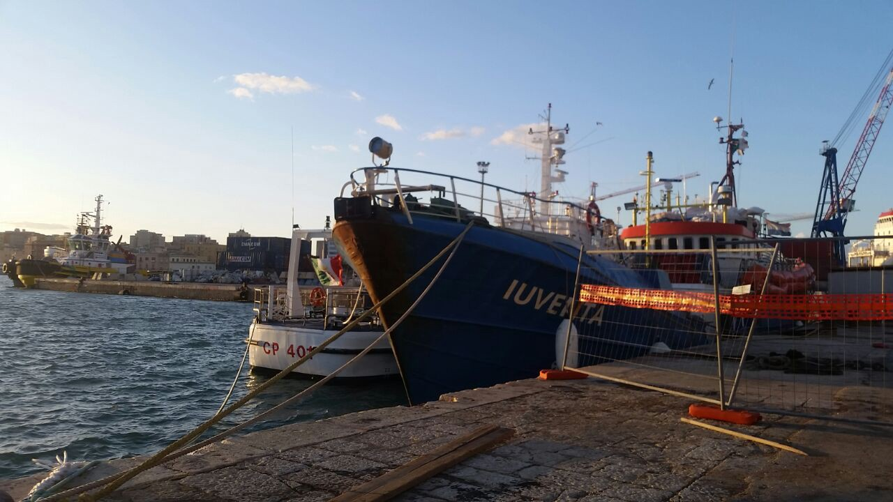

### AYS Interview with Jugend Rettet: “The accusations are just empty claims\.”
#### On Monday, the Supreme Court of Cassation in Rome will decide about the seizure of the Iuventa\. AYS talked to Jugend Rettets Philipp Külker about the trial, the situation in the Mediterranean and in Italy\.

Since almost eight months the Iuventa is seized\. Credits: Jugend Rettet

> [Das Interview ist auch auf Deutsch abrufbar\.](ays-interview-mit-jugend-rettet-die-anschuldigungen-sind-nur-leere-behauptungen-80850d927a3c)

**Mr\. Külker, Jugend Rettet recently published a video with an analysis of the seizure of your ship, Iuventa\. What is your conclusion?**

Philipp Külker, spokesperson of Jugend Rettet\. Credits: Jugend Rettet

The Forensic Oceanographists conducted the [analysis](http://www.forensic-architecture.org/case/iuventa/) \. They are part of the London\-based research collective _Forensic Architecture_ and confirmed what we have been repeating continuously since the seizure: That the accusations leading to the seizure were fabricated\. Even ‘aiding illegal migration’ and ‘weapons ownership’ were among the accusations\. Italy is processing the case through the Anti\-Mafia Investigation Directorate to carry out this preventive measure\. This enabled them the seize the Iuventa without concrete evidence\.

The analysis showed in a very clear way that the accusations are unfounded\. Based on a picture, taken out of context, the German and Italian media claimed, “here they are towing the boat into Libyan territorial waters”\. However, there are no human traffickers on the water in this situation\. They would be foolish to go into this risky area\. The people on the picture are poor people who were, perhaps, allowed to make the trip for a little less money or were threatened by force of arms to guide the vessel\. Every now and then, “Engine Fisher”also appears on these pictures\. They dismantle the engines in a moment, the people leave the boat — sometimes even during the rescue\.

We always told our crew: Your own safety comes first\. Keep a distance from these people\. We do not know if they are armed or who they are\. The situation in Libya is still very unclear; we do not know, who controls which region at sea, who the real agitators are, and how they keep in contact with each other\. This means that everything we do should firstly be directed at deescalating and paying attention to everyone’s safety\.

The video is processed using several examples, and it shows from technical aspects alone, such as the position of the sun, the sea level, or the compass, that the accusations are fabricated\. This is gratifying confirmation for us, having someone external say this\. At the same time, it has a signal effect outwards, that experts evaluate the situation as we do\. These are just empty claims\.

You must see: This preventive measure is the only thing that has happened for almost eight months\. There have been no charges against our organization or single members\. It could happen, of course, that something similarly fabricated could come\. But where is the proof? It is also a hideous method, because we have nothing we can take legal action against\. We cannot bring in our own materials or the internal as well as external reconditioning\. There is no basis for a trial, because there are no charges\. This is a preventive measure and the Italian authorities can — as we see — keep it going for months\.

We are able to appeal this measure\. But the legal construct would be a different one\. There have to be charges first so that we can get a final court decision\. But this has not happened until today\. We are interpreting this as good sign and feel confirmed in our presumption of innocence\.

**The easiest way for Jugend Rettet would be to continue like before…**

We would have to adjust various things for sure\. The situation on the water has changed massively since the seizure of the Iuventa\. The interim seizure of the Open Arms was an additional step toward the criminalization of NGOs\. But also, the views of the public and of the people who are active have changed\. We are young people who do not want to sit by and watch what is happening there, and we are trying to participate at different levels to bring about change: In terms of the operational part, we pull people out of the water before they drown\.

But part of our work is also to bring the topic into the public discourse and this is becoming more and more difficult\. 2015 was “wir schaffen das” \(Chancellor Merkel’s claim, that Germany would manage the arrival of refugees\) \. Since then a lot has happened\. Among politicians there has been linguistic usage has established which was born on the right\-conservative spectrum\. In Germany as well as in other countries such as Italy\. This is really worrisome, because there was once a glimpse that we understand the whole: The European project, it could be opened and tasks led together\. Then, suddenly one country after another jumped off and began doing its own thing again\. We must highlight the painful issues and say: These are not the values we would like to see as young Europeans\.

**Let us go back to the seizure of the Iuventa: Was is going to happen at the trial on April 23?**

It is a legal action raised by us; we are represented by our lawyers against the preventive measure\. The measure was initiated by the investigating prosecutor and we already submitted a complaint at the court in Trapani in September last year\. Our complaint was not granted because we’d submitted it to the same court that allowed the seizure\. Thereafter, we checked the procedure carefully and considered: what is the subject by which the preventive measure remains in force? We raised an objection against the court’s decision to reject our appeal\.

The Supreme Court of Cassation in Rome will decide on this on April 23\. The court reviews decisions of the lower courts\. The case is about whether the court in Trapani proceeded correctly on the basis of the facts\. If it should be decided now that the court erred and not everything went as it should have, this preventive measure — the seizure — will be annulled immediately\.

**On Monday, the seizure of the Open Arms was annulled within less than one month\. How do you assess the case, considering that the Iuventa has been seized now for almost eight months?**

We see this as quite a positive signal\. However, the charges against the captain, the head of mission, and head of operations remain\. We will have to wait and see how the case develops\.

**In case the sentence is overturned, would you start to prepare the next mission immediately?**

We would have to check on the condition of the ship and see if there have been any damages caused by this measure\. A ship is not made to lie at anchor in a harbour for almost eight months\. Then we will have conduct a close evaluation to see if and in which way we can bring it to operational function\. A lot has changed over these eight months\. The situation on the water has become even more complex, responsibilities are not finally clarified\. There is Libya’s twelve\-mile\-zone of territorial waters, which has been extended without authorization to 74 miles\. Meanwhile this was revoked, but somehow these responsibilities seem to be still in action\. This is a grey area\.

The seizure of the Open Arms has shown that you face a trial if there are doubts and the so\-called Libyan coast guard confronts an NGO\. The captain on\-site had decided that the people were already on board and he would not hand over the people, because otherwise he would be participating in a pullback procedure\. This is very critical\. We do not want to see people being taken back in front of our eyes\. We and other NGOs check carefully now, to see how we can guard against this grey area and intend to adapt our action plan accordingly\.

But we will not stand by impassively and watch as this happens\. We will see that we find our place again in this field\. There are a lot of aspects to be evaluated\. As an organisation, we also have responsibility for our crew members\. Naturally, we will not bury the project if we win the case\.

**Is Jugend Rettet considering to go to the Spanish or Greek coast, where the number of new arrivals is increasing again?**

We have been keeping an eye on many directions over the last months\. The rising numbers of new arrivals are a relatively young development, we are watching it\. When we had these thoughts a few months ago, we talked to organisations on the ground, among others\. At the moment, these areas are not our main focus\. But if it is urgent, we will see what we can do\. We have not excluded the possibility of stepping further with another direction\. But for now we are completely focused on April 23 and we will see what sign is being sent by the Italians\. Even if we do not get the ship back, we will continue be active\. Considerations are moving in different directions, but there is no final decision yet\.

View from the Iuventa on board\. Credits: Jugend Rettet

**What have the members been doing while the organisation has had to remain inactive?**

Some of the seafarers joined other organisations, it is a small community\. Many have also used the time to see to their jobs and education\. As organisations, our focus was to roll away the legalistic things which have been thrown at us like a rock\. We sorted and structured ourselves\. We have had many topics, that we never thought could become so relevant and dominant for our organisation\. On the 2 August 2017, the day of the seizure, there was a lot of trouble in the German and Italian media\. We needed weeks to sweep up the pieces and evaluate the next steps to get the ship back\.

This also involved restructurings, because for the moment there was nothing operational anymore\. The focus was more on legal matters and public outreach\. On one side we had to raise awareness for the case of the Iuventa, at the same time we needed to communicate about the current situation in a monitoring function through our networks\.

[**According to IOM**](http://missingmigrants.iom.int/region/mediterranean) **the number of departing boats from Libya dropped, while at the same time more people are dying, proportionally, in the Mediterranean as compared to last year\. What do you think the reason for this is?**

That less people are coming can be traced back to the actions of the Libyan coast guard and the situation on the mainland\. Also, Europe is involved in keeping people from even reaching the water and there are isolation mechanisms in place\. They already start in the more southerly located countries of Africa, for example through — so\-called — educational work, that life in Europe is not so nice and great\. Nevertheless, many people are still stuck in Libya\.

■■■■■■■■■■■■■■ 
> **[Jugend RETTET - IUVENTA](https://twitter.com/jugendrettet) @ Twitter Says:** 

> > In January 2017, 254 people died on the central Med. By January 2018, there are 243 people who lost their lives. But instead of sending rescue ships, NGOs like us or @[openarms_fund](https://twitter.com/openarms_fund) are put on the chain! #FreeOpenArms #freeiuventa [missingmigrants.iom.int/region/mediter…](https://missingmigrants.iom.int/region/mediterranean) https://t.co/ge1n2xcdDt 

> **Tweeted at [2018-04-11 12:58:00](https://twitter.com/jugendrettet/status/984052948568330241).** 

■■■■■■■■■■■■■■ 

At the moment, Sea\-Watch, SOS Mediterranee and now also Sea Eye and Proactiva are out on the sea\. This is a civil fleet and the area is vast\. There has been no reasonable European reaction for some time which would be appropriate for the situation\. This can also be seen in the number of deaths across the whole Mediterranean\. According to IOM, as of April 17, 359 people died this year, they drowned right before our eyes or are missing\. There is also a dark figure, the area is not fully covered\.

■■■■■■■■■■■■■■ 
> **[Missing Migrants Project](https://twitter.com/MissingMigrants) @ Twitter Says:** 

> > This year’s 500+ deaths recorded in the Mediterranean have occurred despite a steep drop in total arrivals. Already this year nearly 140 irregular migrants have died trying to reach Spain, or about 2/3 the 2017 total – yet with 3/4 of the year remaining.
[bit.ly/2GHPjjH](http://bit.ly/2GHPjjH) https://t.co/FmPJDUfSqD 

> **Tweeted at [2018-04-09 09:44:01](https://twitter.com/missingmigrants/status/983279354443649024).** 

■■■■■■■■■■■■■■ 

**Elections were held recently in Italy, presumably a right\-wing government will be constituted\. How do you assess the political situation there?**

We are concerned about the developments in Italy, but also those in Germany\. Populistic, right\-wing voices are very loud at the moment and our voice is not always heard on the scale it deserves\. For sure it is not the working environment we wish us\. At the same time, maybe this is exactly why it matters that people are engaging in sea rescue\. Not only non\-Italian volunteers, but Italians as well\. I was on Sicily two years ago and was very impressed by how the islanders dealt with the situation\. Back then, ships arrived daily\. The Sicilians said: We are an immigration island, this has always been so\.

■■■■■■■■■■■■■■ 
> **[UNHCR, the UN Refugee Agency](https://twitter.com/Refugees) @ Twitter Says:** 

> > Warm #welcome in Palermo, #Sicily on Friday as survivors of the latest #Mediterranean shipwreck disembarked. #Italy http://t.co/rbv8QYOQwX 

> **Tweeted at [2015-08-09 11:33:56](https://twitter.com/refugees/status/630341234154975232).** 

■■■■■■■■■■■■■■ 

But based on the election results I assume that the people there are also not being welcomed anymore with open arms\. We have to look at ourselves in Germany on this topic\. Since “wir machen das” a lot has happened\. When I hear right\-wing populistic speeches, my stomach aches\. This view is so contradictory to the humanistic motivations on which our actions are based\. This makes it all the more important, that these actions are being taken\.

**Without doubt, the social debate has changed over the last months\. The sea rescue organisations have also been impacted by it\. They were accused of providing taxi\-service on the Mediterranean and encouraging migration\. How has this impacted the work of Jugend Rettet?**

Ever since Jugend Rettet was founded, we have constantly had to deal with right\-wing hatred at different levels\. We have good filters for it and good handling\. Every organisation has its own strategy for dealing with this, some react, others do not\. In our everyday work it does not affect us\. If an e\-mail passes our filters, we are amused to see how people project their hatred onto us with their cranky world views\. But, we do not underestimate it for sure, we have to take it seriously\. In these terms I see vast work at a political level for the next few years to shift the mood in another direction again and not to let the protectionist and the “good old values protecting us from foreigners” emerge\. The idea of humanism is an important one, I would like to see more of it at this point\.

**Did you have the feeling that the political situation that led to the seizure of the Iuventa changed because the debate was dominated by right\-wing influences?**

I do not know how the public debate really impacted the political decisions\. I think one thing is affecting another, someone is electing these people\. These are opinions that exist in society\. I can see how the reactions to the Jugend Rettet project were two or one and half years ago, and they are different now, for sure\. On the one hand, the attention that is given to sea rescue\. On the other, the view of the organisations in public\. The accusation of human trafficking is made quickly and loudly\. To counter it, you have to resist really long and with hard facts\. Arguments based on rationality or legal facts are mostly too quiet in the conversation\.

Jugend Rettet was one of the NGOs being accused of accelerating illegal migration\.

**Did these changes of the debate also affect your search for new volunteers and supporters?**

Donations have not been steady, there has been no real regularity\. Aside from the summer months, when the topic was really present in the media due to the high number of crossings\.

We have always had a highly professional crew\. For example, we had doctors, who had just finished their education or were still at medical school\. They could definitely handle their tasks\. Also, the captains were trained\. We have always taken care that all certificates are available as required\. We have never had problems finding a good crew at a professional and good interpersonal level\. Luckily, there are also enough people who are interested in the topic\. Many volunteers went out with us more than once and gained expertise over the years\. By their second time, they already have much more experience \. The balance has always been very good\.

**You had the problem that you could not be active operationally and, I assume, the legal procedure has been costly\. How have you been able to ensure that you can operate, long\-term?**

We did not have big expenses during the months of the seizure\. A two\-week\-mission costs us 20,000 EUR, we were not spending the amount of money we had been spending anymore\.

Like other sea rescue organisations, we experienced that the willingness to donate has dropped\. Not dramatically, but the numbers are not rising anymore\. Every organisation involved in sea rescue has had to deal with this\. But we have a good basis of permanent donors\. It will be thrilling to see how this develops next year\. That is why we must raise public awareness\. The public doesn’t care about things it doesn’t know\. But if the topic of the Mediterranean is not present in the media anymore, that doesn’t mean it has ended\. This is what we work on\. We also talk with politicians about the topic, as an organisation but also in cooperation with other organisations\. So the the topic remains on the roster of topics we must solve as Europe\.

**What steps are planned next?**

At the moment, everything is focused on April 23\. Because of the facts and the reception of the external experts we are sure that the court must decide to release the Iuventa\. Hence, this is what our thoughts and efforts are about, and how we can return to the operational, which aspects must be clarified\. The court’s decision is our focal point\. We do not want to do nothing\. We do not have the capacity for this\. We are a volunteer organisation\.

We are preparing to pursue different options\. Depending on the court’s decision, we will initiate the next steps\.

**What are your wishes from the EU?**

We have many things we do not wish, things that need to change\. Personally, I would like the topic of migration is being addressed with more honesty and sincerity among the European states\. In which it is not individual countries who have to deal with vast numbers of people who are fleeing and are being abandoned, while others refuse to take responsibility\. I hope, that this tendency, which I think I have seen, comes to an end, and that we see an end to the pushing of the problem away from the eyes of the European Union into the countries of the north and central countries of Africa\. Already there safety barriers are being set up, to protect “fortress Europe”\.

I want a more realistic examination, conducted in accordance with human rights\. They are explicit and cannot be changed by local laws\. Despite this, we see this happening again and again\.

**\(Interview and translation by Niklas Golitschek, AYS volunteer\)**

> **We strive to echo correct news from the ground through collaboration and fairness\.** 

> **Every effort has been made to credit organisations and individuals with regard to the supply of information, video, and photo material \(in cases where the source wanted to be accredited\) \. Please notify us regarding corrections\.** 

> **If there’s anything you want to share or comment, contact us through Facebook or write to: areyousyrious@gmail\.com** 

_Converted [Medium Post](https://medium.com/are-you-syrious/ays-interview-with-jugend-rettet-the-accusations-are-just-empty-claims-ba873e0f53f4) by [ZMediumToMarkdown](https://github.com/ZhgChgLi/ZMediumToMarkdown)._
