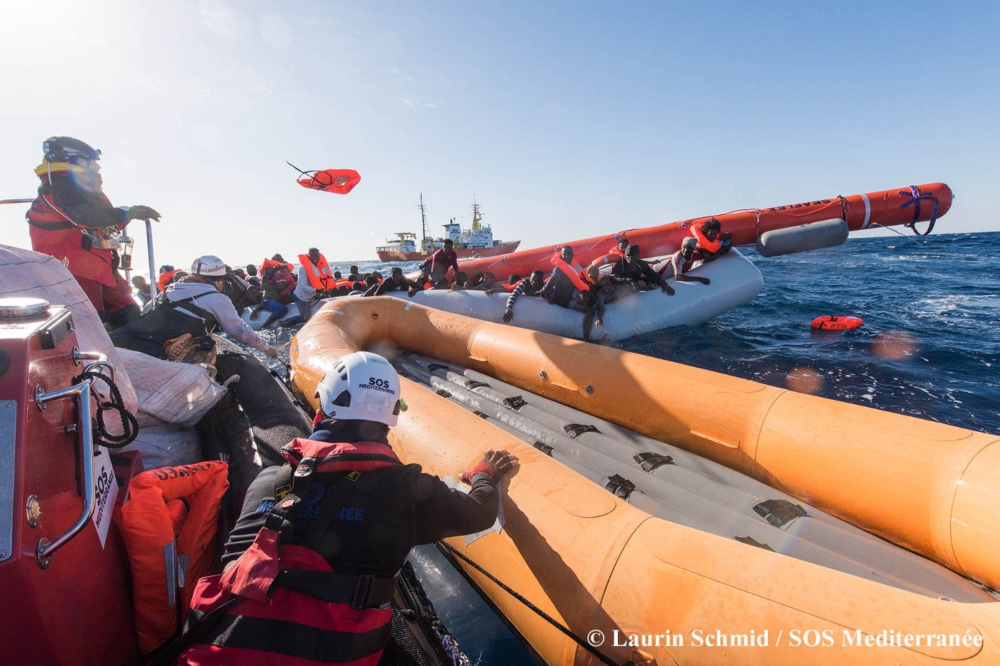
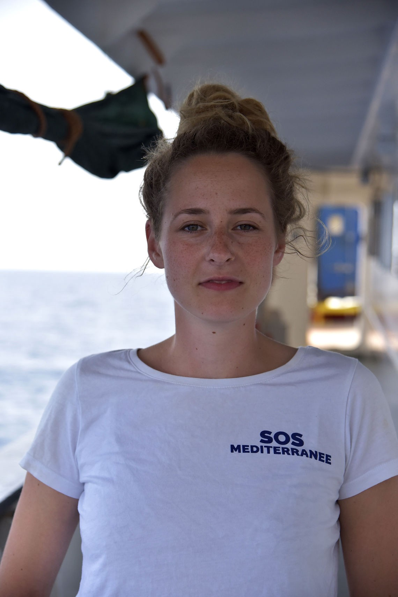
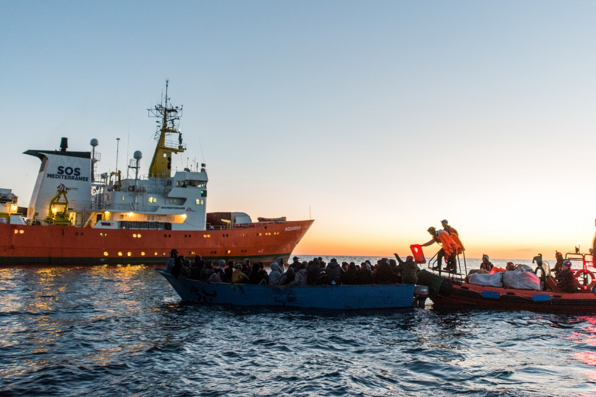
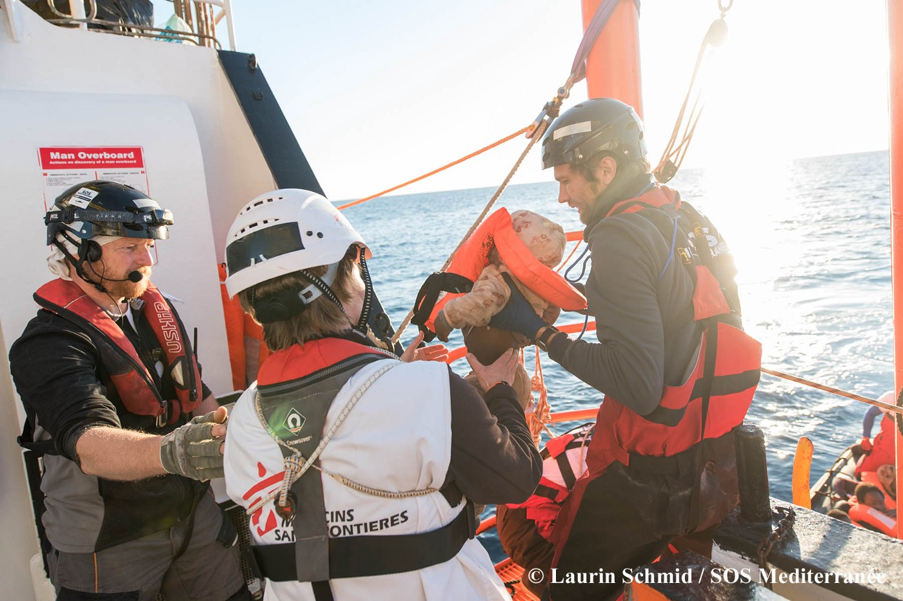
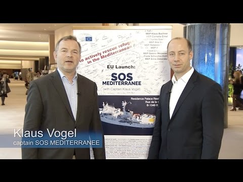
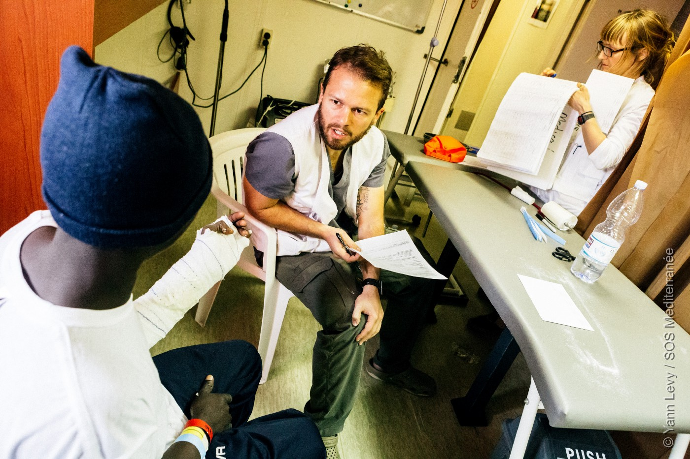
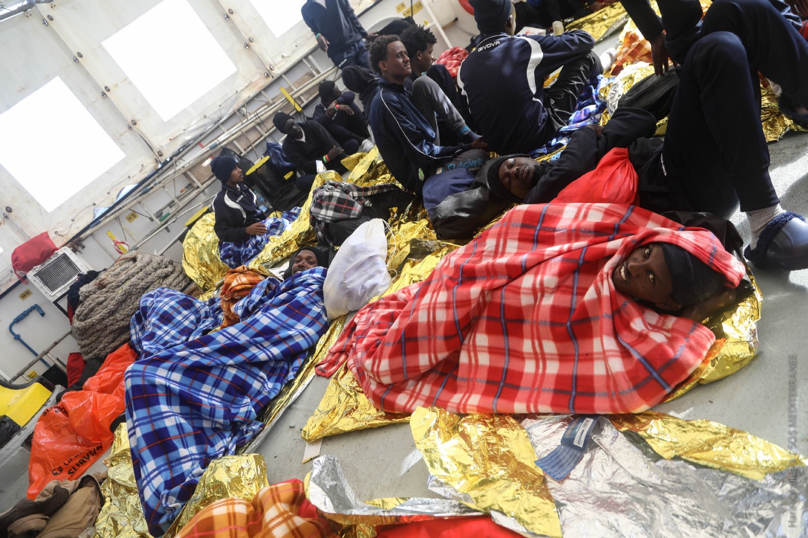
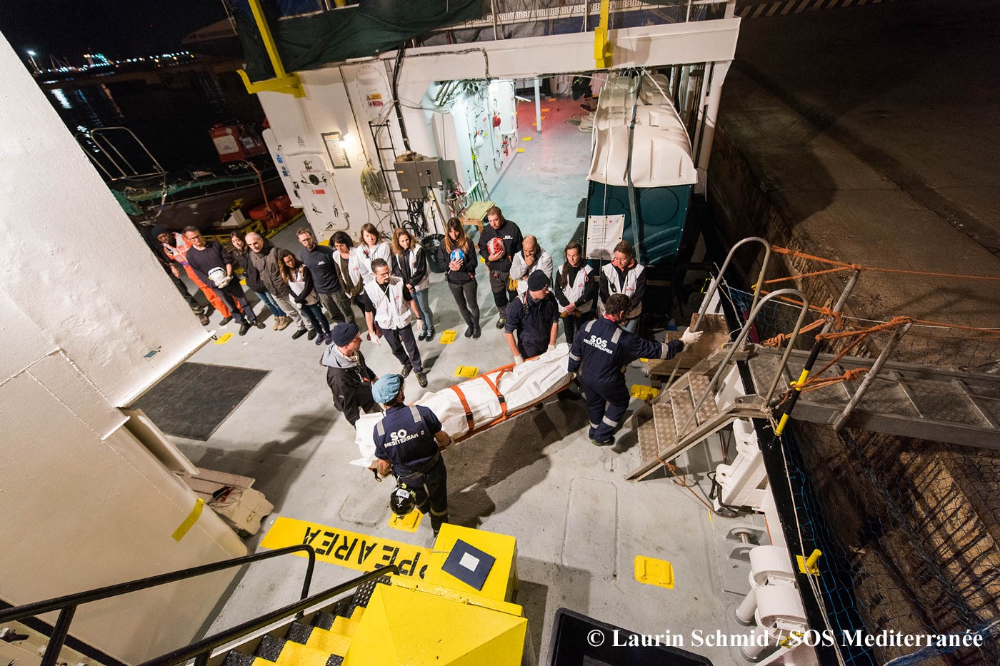
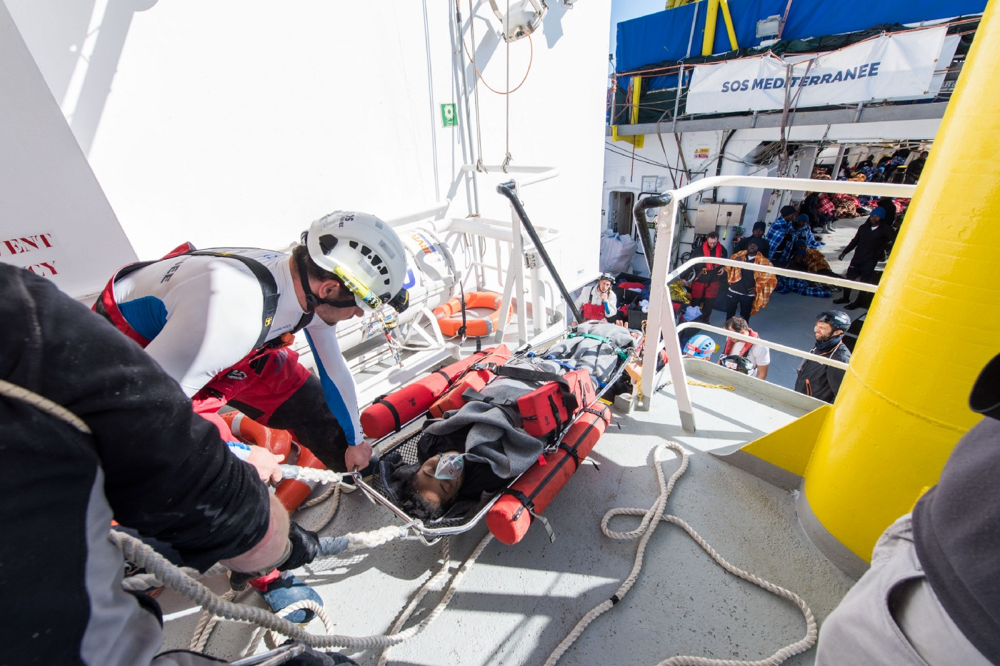

### AYS Interview mit SOS Mediterranee: “Die humanitäre Krise im Mittelmeer geht weiter\.”
#### Vor fast genau drei Jahren wurde SOS Mediterranee gegründet, um Menschen im zentralen Mittelmeer zu retten\. Jana Ciernioch, Sprecherin der Organisation, sprach mit AYS über die Entwicklungen in dieser Zeit und erklärte die aktuelle Situation im zentralen Mittelmeer\.

Bei einem Rettungseinsatz verteilen Helfer Rettungswesten\. Credits: Laurin Schmid/SOS Mediterranee

> [Read the interview in English](ays-special-the-humanitarian-crisis-in-the-mediterranean-continues-b77f28e81d6e)

**Frau Ciernioch, SOS Mediterranee** **hat sich am 9\. Mai 2015 gegründet\. Bald feiert die Organisation ihren dritten Geburtstag\. Wie ist das Gefühl, dass die Situation auf dem Mittelmeer so lange anhält?**

Jana Ciernioch, Sprecherin von SOS Mediterranee\. Credits: Susanne Friedel/SOS Mediterranee

Wir haben uns gegründet, als das italienische Seenotrettungsprogramm „Mare Nostrum“ geendet hat; nachdem Europa nicht willens war, Italien bei der Seenotrettung zu unterstützen\. Dem Nichthandeln Europas wollten wir etwas entgegensetzen\. Seitdem haben wir wahnsinnig viel geschafft: Wir haben vier Vereine in vier Ländern, ein europäisches Netzwerk aufgebaut, Tausende von Unterstützern gewonnen und große Crowdfunding\-Kampagnen gestartet\. Wir haben die Unterstützung der europäischen Zivilgesellschaft bekommen und es dadurch geschafft, mittlerweile fast 28\.000 Menschen vor dem Ertrinken zu retten\. Das ist die positive Bilanz\.

Gleichzeitig hat sich fast nichts verändert, was Seenotrettungs\-Kapazitäten im Mittelmeer angeht\. Von einem staatlichen Seenotrettungsprogramm sind wir gefühlt weiter entfernt denn je\. Das ist ein zweischneidiges Fazit\.

**Als Nachfolge von „Mare Nostrum“ hat die EU EUNAVFOR MED initiiert und das Frontex\-Mandat erweitert\. Wie sieht die Zusammenarbeit aus und wie bewerten Sie das Folgeprogramm?**

„Mare Nostrum“ hatte ein viel größeres Einsatzgebiet, es war ein ganz klares Seenotrettungsprogramm\. Das waren alle Folgeprogramme der EU nicht mehr — sondern es waren in erster Linie Militäroperationen, die auf die Bekämpfung der sogenannten Schlepper und die Zerstörung der Boote abzielten\. Natürlich retten sie auch die Menschen, weil es eine rechtliche Verpflichtung gibt, das zu tun\. Unsere Kritik daran ist, dass das Retten von Menschenleben nicht an erster Stelle dieser Programme steht\. Wir beobachten in letzter Zeit den Rückzug der europäischen Boote aus diesem Gebiet vor der libyschen Küste\.

**Die Zahl der zivilen Seenotrettungsschiffe ist auch wegen der Beschlagnahmung zweier Schiffe, der Iuventa und der Open Arms, gesunken\. Die Open Arms ist mittlerweile wieder frei\. Dennoch gibt es vermehrt Berichte über Zusammenstöße von NGOs mit der libyschen Küstenwache, auch von SOS Mediterranee\. Wie erlebt die Crew das vor Ort?**

Wir sind seit zwei Jahren ohne Pause im Einsatz\. Deswegen können wir ganz klar sagen, dass wir in den letzten Monaten zum einen eine Zunahme der Aktivitäten der libyschen Küstenwache in internationalen Gewässern beobachtet haben, auch bevor die die libysche Küstenwache eine eigene Search\-and\-Rescue\-Zone ausgerufen hat, die es offiziell nicht gibt\. De facto besteht sie in dem Sinne, dass die libysche Küstenwache in diesem erklärten Gebiet inzwischen sehr aktiv ist\. Wir hatten 2017 den ersten Zwischenfall mit bewaffneten Einheiten der libyschen Küstenwache — zumindest haben sie sich als solche zu erkennen gegeben: Geflüchtete wurden auf den Schlauchbooten massiv bedroht, woraufhin es Panik gab\. Die Menschen sind ins Wasser gesprungen\.

In den letzten Monaten beobachten wir zum anderen, dass die libysche Küstenwache gehäuft Menschen in internationalen Gewässern — außerhalb ihrer Territorialgewässer — abfängt und diese Menschen zurück nach Libyen bringt\.

Crew\-Mitglieder halten Ausschau nach Booten in Seenot\. Credits: Hara Kaminara/SOS Mediterranee

**Die Situation hat auch dazu geführt, dass SOS Mediterranee zwischen der Beschlagnahmung der Open Arms bis Anfang April, als die Sea Watch 3 ausgelaufen ist, die einzige zivile Seenotrettungsorganisation im zentralen Mittelmeer war\. Wie hat Ihre Organisation darauf reagiert?**

Wir waren im Winter 2016/2017 schon einmal das einzige zivile Seenotrettungsschiff, das ohne Pause durchgefahren ist\. Jetzt waren wir das zeitweise wieder\. Für uns ist das eine riesige Herausforderung\. Wir fahren unter der Koordination der italienischen Seenot\-Leitstelle MRCC Rom\. Auf einmal sind wir dann damit konfrontiert, dass wir Seenotrufe erhalten, die vom Westen bis Osten von Tripolis reichen\. Dann bekommen wir eine Anweisung zu retten und müssen dann teilweise 250 Seemeilen fahren, um zum nächsten Einsatz zu kommen\. Wir wissen: Wir sind das einzige Schiff; wenn wir jetzt zu spät kommen, dann war es das\. Dann sterben Menschen\. Das ist ein wahnsinniger Druck für unsere Teams\. Weniger Rettungsschiffe auf See bedeuten mehr Tote\.

**Das konnte man seit Beginn des Jahres beobachten: Weniger Menschen wagen die Überfahrt über das Mittelmeer im Vergleich zum Vorjahr, aber proportional sterben mehr Menschen\. Sehen Sie eine Ursache darin, dass weniger Rettungsschiffe aktiv sind?**

Für uns ist der Zusammenhang ganz klar\. Der Rückgang der Zahlen hat sicher auch mit der politischen Situation in Libyen zu tun\. Es hat auch damit zu tun, dass die Europäische Union und vor allem Italien ein Outsourcing der Migrationskontrolle durchführt\. Das sind alles Faktoren\. Wir können auf See immer schlecht sagen, woran das genau liegt\. Wir sind damit konfrontiert, dass Menschen kommen oder eben auch nicht und dass wir retten müssen\.

Bereits zum zweiten Mal war die Aquarius das einzige zivile Seenotrettungs\-Schiff im Mittelmeer\. Credits: Laurin Schmid/SOS Mediterranee

**Freiwillige Ihrer Organisation haben in der Vergangenheit auch angesprochen, dass Schmuggler die Menschen mit Lügen und Gerüchten über das Meer schicken\. Wie ist da im Moment die Situation?**

Die Menschen, die wir retten, erzählen uns an Bord, mit welcher Message sie auf das Meer geschickt wurden\. Teilweise sind sie auch nicht freiwillig in die Boote gestiegen\.

Vor der libyschen Küste, vor Tripolis, gibt es eine Ölplattform\. Früher haben uns die Leute immer erzählt, dass ihnen bei Abfahrt in der Nacht gesagt wurde, zu diesen Lichtern da vorne müssten sie fahren — das wäre Italien\. Das ist noch nicht einmal die Hälfte der Strecke nach Italien\. Wenn die Leute bei uns an Bord sind und sie verstehen, dass wir mit dem großen Schiff, der Aquarius, zwei Tage brauchen, bis wir in Italien sind, wird ihnen natürlich klar, dass sie das niemals geschafft hätten und gestorben wären, wäre dort kein Schiff gewesen\. Für viele ist das eine ganz schreckliche Einsicht\.

Die Schlepper erzählen den Leuten irgendeine Geschichte, warum es jetzt eine gute Idee wäre, auf ein Schlauchboot mit über 100 Menschen zu steigen\.

**Kommen wir auf die Situation in Italien zu sprechen: Die Wahl ist beendet, wahrscheinlich wird sich eine Mitte\-Rechts\-Regierung bilden\. Wie sehen Sie die Entwicklung in Italien auf politischer Ebene?**

Wir haben als Organisation mit europäischem Netzwerk auch einen Verein in Italien\. Mit diesem sind wir auf Sizilien ansässig\. Dort kriegen wir die innenpolitische Stimmung in Italien und die öffentlichen Debatten schon immer hautnah mit\. Vor allem seit letztem Sommer haben wir festgestellt, dass sich die Stimmung total gedreht hat: Gegen Organisationen, die Geflüchtete unterstützen\. Wir kritisieren seit Beginn der humanitären Krise im Mittelmeer, dass Italien von den europäischen Mitgliedsstaaten komplett allein gelassen wird\. Das ist ein Mangel an Solidarität, der auch dazu führt, dass die innenpolitische Stimmung total kippt\. Uns ist wichtig, zu betonen, dass es nicht darum geht, Italien zu unterstellen, anti\-migrantisch zu sein\. Es ist eine Frage der fehlenden europäischen Solidarität, die sich an diesem Beispiel abzeichnet\. Nichtsdestotrotz: Wir haben diese Polemiken im Sommer gesehen, die sich auch speziell gegen SOS Mediterranee gerichtet haben\. Wir hatten die rechtsextremen Gruppen in Deutschland und Österreich, aber auch ganz stark in Italien\. Die Debatten haben sich anfangs in einem rechtsextremen Spektrum abgespielt und haben sich dann weitergezogen bis hin zu italienischen Staatsanwälten und Frontex, die die gleichen Vorwürfe gemacht haben\. Das hat dazu geführt, dass bei uns wie bei allen anderen Seenotrettungs\-Organisationen die Privatspenden zurückgegangen sind\.

Ich bin seit knapp zwei Jahren bei SOS Mediterranee, als wir gerade die Aquarius gechartert hatten\. Damals stand Leben retten außer Frage\. Es gab Leute, die kritisiert haben: Warum bringt ihr die Leute nach Europa? Warum bringt ihr sie nicht zurück in ihre Herkunftsländer oder nach Nordafrika? Leben retten stand trotzdem außer Frage\. Das hat sich in den letzten zwei Jahren verändert: Dass selbst diese humanitäre Aufgabe, Leute vor dem Ertrinken zu retten, auf einmal infrage gestellt wird\. Das sehe ich als den größten Rückschritt\.

Leben retten stand einst außer Frage — heute nicht mehr\. Credits: Laurin Schmid/SOS Mediterranee

**Die von Ihnen beschriebene Entwicklung hat auch dazu geführt, dass Italien von den Seenotrettungs\-Organisationen verlangt hat, einen Verhaltens\-Kodex zu unterzeichnen\. Wir hat sich das auf die Arbeit Ihrer Organisation ausgewirkt?**

Die ganze öffentliche Debatte hat sich übersetzt in konkrete innenpolitische Handlungen der italienischen Regierung wie den Verhaltens\-Kodex für NGOs\. Wir waren an den Verhandlungen beteiligt und haben den Kodex in der Original\-Version nicht unterschrieben, weil viele Punkte für uns inakzeptabel waren\. Damit konnten wir nicht arbeiten\. Sie hätten nicht dazu geführt, dass unsere Einsätze effektiver geworden wären, dass mehr Leben gerettet worden wären\. Im Gegenteil hätten sie unsere Einsätze behindert\. Wir haben dann noch einmal mit dem italienischen Innenminister nachverhandelt und eine modifizierte Version des Verhaltens\-Kodex unterschrieben\. In einem Addendum wurde etwa noch einmal ganz klar aufgeführt, dass es kein rechtlich bindendes Dokument ist\. Wir haben auch festgehalten, dass, wenn es der Einsatz notwendig macht, wir Gerettete von anderen Schiffen übernehmen oder sie an andere Schiffe übergeben können und sie dann ans sichere Festland gebracht werden\.

**Befürchten Sie weitere politische Restriktionen?**

Der Verhaltens\-Kodex ist kein rechtlich bindendes Dokument sondern eine Absprache zwischen einzelnen Rettungsorganisationen und der italienischen Regierung\. Internationales und Seefahrtsrecht stehen darüber\. Wir sind von Anfang an unter den gängigen Maritime Conventions gefahren, haben Seevölkerrecht genauso wie internationales Recht beachtet\. Das machen wir auch weiterhin\. Zumal sich unser Modus Operandi seit dem Verhaltens\-Kodex nicht verändert hat\. Bisher hatte er keinen Effekt auf unseren Einsatz\.

Eigentlich ist es eine ständige Wiederholung der Anschuldigungen\. Dabei wurden sie nie bewiesen, sondern eigentlich immer entkräftet\. Auch durch wissenschaftliche Studien verschiedenster Universitäten\. Aber es hat sich festgesetzt, was behauptet wurde\. Dabei blieb es bislang\. Das hat man jetzt auch bei Jugend Rettet gesehen, die Iuventa ist fast ein Jahr festgesetzt\.

Wir spüren einen ganz deutlichen gesellschaftlichen Gegenwind\. Vor allem in Italien, aber auch hier in Deutschland ganz stark\. Eine ganze Reihe von Politikern und Politikerinnen haben Seenotrettungsorganisationen beschuldigt, mit ihrer Präsenz vor Ort die Leute erst zur Überfahrt zu ermutigen\. De Maizière \[Thomas de Maizière, ehemaliger Bundesinnenminister, Anm\. d\. Red\] hat das auch wiederholt, ohne Basis jeglicher Fakten oder Beweise\.

Andererseits haben wir von unseren bisherigen Unterstützern und Unterstützerinnen wahnsinnige Solidarität erfahren und auch von anderen Leuten, die gesagt haben: jetzt erst recht\. Gleichzeitig haben wir auch gemerkt, dass viele Leute nicht mehr spenden — woran das jetzt auch immer liegt\. Aber für unsere Einsätze ist das ein Riesenproblem, wir sind spendenfinanziert\.

Das Thema ist einfach gerade nicht mehr auf der Agenda\. Seenotrettung, darüber spricht man nicht mehr\. Es hat eine gewisse Akzeptanz eingesetzt, dass im Mittelmeer eben Menschen ertrinken\. Anscheinend ist es inzwischen auch akzeptiert, dass spendenfinanzierte, zivile Seenotrettungs\-Organisationen vor Ort **sein** und retten müssen\. Da gibt es auch keinen Aufschrei mehr\. Das heißt: Einerseits ist die Aufmerksamkeit gerade weg\. In der Folge sind auch die Anschuldigungen nicht mehr so akut\.

**In der Vergangenheit gab es bereits Drohungen, dass den Rettungsschiffen verboten werden könnte, in italienische Häfen einzufahren…**

Wir wissen nicht, was bleibt Rhetorik, etwa die Androhung der Hafenschließung, und was übersetzt sich in konkrete Handlungen einzelner Staaten\. Im Vorfeld der Wahlen gab es viele Debatten, die auch mit Blick auf den Wahlkampf zu betrachten sind\. Jetzt sind die Wahlen vorbei, es wird vermutlich eine Form von rechter bis rechtsextremer Regierung geben\. Wir haben die Befürchtung, dass Seenotrettungsorganisationen weiterhin kriminalisiert werden\. Das ist bei uns bisher nicht der Fall gewesen\. Mit den Beschlagnahmungen der Iuventa und jüngst der Open Arms ist jedoch nicht damit zu rechnen, dass das aufhören wird\.

**Ihnen wäre es also an sich auch lieber, wenn es staatlichen Ersatz für ihre Aktivitäten gäbe?**

Das war von Anfang unsere Forderung: Es muss ein europäisches Seenotrettungs\-Programm geben\. Was wir machen, ist nur ein Lückenfüller\. Es ist keine nachhaltige Antwort auf die humanitäre Krise im Mittelmeer\. Es kann auch keine sein\. Bei dem europäischen Seenotrettungs\-Programm sind wir aber noch keinen Schritt weiter\.

Das Paradox bei uns ist, dass wir immer gesagt haben: Wir sind nur so lange da, wie wir gebraucht werden\. Sobald es ein europäisches Seenotrettungs\-Programm gibt, braucht es uns auch nicht mehr\. Jetzt werden die einzelnen Organisationen kriminalisiert, die Boote werden festgesetzt, einzelne Mitglieder werden angeklagt\. Die Idee war nicht, dass es uns nicht mehr gibt, weil wir kriminalisiert werden\.

**Finden Sie denn auf europäischer Ebene noch Gehör?**

Im Parlament, ja\. Dort hatten wir Anfang des Jahres ein Treffen, bei dem es um die Kriminalisierung von Seenotrettungs\-Organisationen ging\. Da haben wir auch relativ viel Zuspruch von einzelnen Europa\-Abgeordneten\. Außerdem hatten wir ein Panel und haben uns mit einzelnen Abgeordneten getroffen\. Ganz klar ist aber auch, dass der Gegenspieler in diesem Fall die europäische Kommission ist, die da eine ganz andere Position vertritt\.

**Wie bewerten Sie die beiden Beschlagnahmungen? Die Open Arms ist mittlerweile von den Anschuldigungen freigesprochen, die Anklagen gegen die Crew\-Mitglieder bestehen allerdings weiterhin\.**

Sie bedeuten zwei Rettungsschiffe weniger auf dem Mittelmeer\. Für die Seenotrettung ist das wahnsinnig besorgniserregend\. Weniger Rettungsschiffe bedeuten mehr Tote, das ist die ganz harte Realität, die wir vor Ort täglich beobachten\. Daher sind wir außerordentlich froh darüber, dass die Open Arms inzwischen wieder freigegeben wurde und ihren Einsatz wird fortsetzen können\.

Die Kriminalisierung humanitärer Hilfe im Mittelmeer geht indes weiter\. Die Ermittlungen gegen zwei Crewmitglieder von Proactiva Open Arms laufen noch\.

**Haben sich die Drohungen, die Sie auch über die Sozialen Netzwerke erhalten haben, in den vergangenen Monaten noch einmal intensiviert?**

Die direkten Anschuldigungen in den Sozialen Medien sind wieder ein bisschen zurückgegangen\. Das spüren wir schon\. Aber es ist auch nur eine Frage der Zeit, je nach dem wie sich die Situation in Italien mit der Regierungsbildung entwickelt, bis das wiederaufkommen kann\.

**Wie hat sich das mit Blick auf ihre Freiwilligen ausgewirkt? Hatten Sie Probleme, eine Crew zu finden?**

Das eigentlich gar nicht\. Die Leute, die bei uns Bord sind, stehen hinter dem, was sie machen\. Wir hatten bisher über 120 Freiwillige, die bei uns an Bord gearbeitet haben\. Davon kommen viele immer wieder zurück und unterstützen uns auch an Land\. Die gesellschaftliche Gegenreaktion hat es gegeben, ja\. Aber viele Menschen sagen auch: jetzt erst recht\. Wir müssen euch unterstützen\. Es ist unsere Rolle, jetzt als europäische Zivilgesellschaft zu zeigen, dass wir hinter diesen Organisationen stehen\. Dass wir im Mittelmeer nicht „nur“ Leben retten, sondern auch so etwas wie europäische Identität und Werte verhandeln\.

**Können Sie kurz ausführen, wie ein Einsatz typischerweise abläuft?**

Wir sind immer drei Wochen auf See\. Die meisten Leute bei uns an Bord haben in erster Linie einen professionellen Hintergrund etwa in Schifffahrt oder in der Rettungshilfe\. Dafür arbeiten wir auch mit Ärzte ohne Grenzen zusammen\. Sie stellen das medizinische Team und stellen die medizinisch\-humanitäre Versorgung an Bord sicher\.

Ärzte ohne Grenzen stellt die medizinische\-huminatäre Versorgung sicher\. Credits: Yann Levy/SOS Mediterranee

Die Aquarius haben wir gechartert, wir haben also noch eine sogenannte Marine\-Crew\. Sie sorgt dafür, dass unser Schiff 24/7 fährt\. Es ist ein sehr großes Schiff mit 77 Metern Länge\. Wir haben eine Aufnahmekapazität von über 500 Menschen\. Das ist ein Riesenteil, das auf See gehalten werden muss, und da steckt viel Arbeit hinter\. Wir kommen auch immer wieder zurück nach Italien, wenn wir unter Koordination der italienischen Seenotleitstelle retten und die Anweisung erhalten, die Geretteten in einen sicheren Hafen zu bringen\. Das ist unsere Routine\.

■■■■■■■■■■■■■■ 
> **[MSF Sea](https://twitter.com/MSF_Sea) @ Twitter Says:** 

> > Over the past few days the #Aquarius #MSF medical team did over 100 medical consultations. They typically see violence related injuries from people’s journey into #Libya, injuries &amp; conditions from their time in captivity &amp; chronic diseases worsened due to lack of medical care. https://t.co/xL9tmUSRIi 

> **Tweeted at [2018-04-23 15:08:12](https://twitter.com/msf_sea/status/988434370766700544).** 

■■■■■■■■■■■■■■ 

**Wissen Sie, was passiert, wenn die geretteten Menschen die Aquarius verlassen?**

Theoretisch ja\. Unser Einsatz im Mittelmeer beginnt in dem Moment, in dem wir den Notruf erhalten, bis zu dem Zeitpunkt, an dem wir die Geretteten nach Italien in einen sicheren Hafen bringen\. Da hört unser Mandat dann auch auf\. Wir übergeben sie dann an Organisationen und die italienischen Behörden vor Ort\. Manchmal schaffen wir es noch, mit Einzelnen Kontakt zu halten\.

An Bord „registrieren“ wir Verletzte, schwangere und allein reisende Frauen sowie unbegleitete Minderjährige\. Dabei registrieren wir nicht die Identität, sondern nur die Vulnerabilität\. Die Daten übergeben wir an die italienischen Behörden, damit die Menschen später an Land eine entsprechende Versorgung erhalten\. Inwiefern das geschieht, können wir nicht stringent nachverfolgen\. Die Teams von Ärzte ohne Grenzen in Italien versuchen das, aber das ist nur in Einzelfällen möglich\.

**Freiwillige haben in der Vergangenheit geschildert, dass sie sich bewusst sind, dass es für die Männer häufig in Zwangsarbeit, für die Frauen in Zwangsprostitution geht, auch Kinder werden Berichten zufolge missbraucht oder verschwinden\. Hinzu kommen die Abschiebungen\.**

Das ist ein sehr schwieriges Thema\. Die akute Lebensgefahr beheben wir\. Wir wissen aber, dass die Leute, die in Italien ankommen, schlechte Chancen haben, einen regulären Aufenthaltstitel zu bekommen\. Manche werden wieder abgeschoben, manche Frauen landen in Prostitutions\- oder Menschenhändlerringen\. Das wissen wir\. Für unsere Teams ist es schwierig, damit auf emotionaler Ebene umzugehen\. Zu wissen, die akute Lebensgefahr ist vorbei — aber, was danach auf die Leute zukommen wird, ist auch nicht viel besser\.

■■■■■■■■■■■■■■ 
> **[Filip Warwick](https://twitter.com/filipwarwick) @ Twitter Says:** 

> > What happens when you finally arrive to a port of safety?
Indescribable joy among rescued women on the #Aquarius
#SOS #[MSF](https://twitter.com/MSF) disembarked all 292 men, women &amp; children in Italy
@[SOSMedFrance](https://twitter.com/SOSMedFrance) @[SOSMedGermany](https://twitter.com/SOSMedGermany) @[[MSF](https://twitter.com/MSF)_Sea](https://twitter.com/[MSF](https://twitter.com/MSF)_Sea) @[MSF](https://twitter.com/MSF) #LifesavingRescues #Europe #EU #FortressEurope #[MSF](https://twitter.com/MSF) #[MSF](https://twitter.com/MSF)Sea https://t.co/m4oaOoSXSN 

> **Tweeted at [2018-04-03 15:21:11](https://twitter.com/filipwarwick/status/981189879609679872).** 

■■■■■■■■■■■■■■ 

Die Ankunft in Italien ist auch ein harter Kontrast für die Menschen, die wir an Bord nehmen\. Sie sind meistens bis zu 48 Stunden bei uns auf der Aquarius, können sich dort ausruhen, schlafen, mit uns sprechen, wenn sie das Bedürfnis haben\. Sie haben oft das erste Mal seit Monaten oder Jahren in ihrem Leben das Gefühl: Okay, hier kann ich jetzt einmal durchatmen, hier bin ich gerade in Sicherheit\. Dann fahren wir in Italien in den Hafen ein und dort warten schon die italienischen Behörden, die teilweise weiße Schutzanzüge tragen, weil sie Angst haben, sich mit Infektionskrankheiten anzustecken\. Da wird den Geretteten oft bewusst, dass sie jetzt eine ganz andere Stimmung erwarten wird als an Bord, wo wir den Menschen auf Augenhöge begegnen\.

An Bord der Aquarius fühlen sich viele Gerettete zum ersten Mal seit Monaten sicher\. Credits: Hara Kaminara/SOS Mediterranee

**Im Jahr 2016 hat es aus Italien etwa 4500 Abschiebungen gegeben, 1000 Menschen sind freiwillig in ihre Heimatländer zurückgekehrt\. 2017 dürften die Zahlen höher gewesen sein\. Haben Sie bei ihren Einsätzen schon einmal mitbekommen, dass Menschen eine zweite Überfahrt nach Europa wagen?**

Von Leuten, die aus Italien abgeschoben wurden, nicht\. Als ich letztes Jahr selbst an Bord war, habe ich viele Leute getroffen, die das zweite oder dritte Mal versucht haben, aus Libyen zu fliehen\. Sie wurden jeweils immer von der libyschen Küstenwache oder anderen Einheiten, die sich als solche ausgeben, auf dem Meer abgefangen und nach Libyen zurückgebracht\. Seit Anfang des Jahres haben wir mehrere Fälle von Leuten gehabt, die es vier oder fünf Mal versucht haben\. Das hatten wir die Jahre davor noch nicht\. Sie sagen: Lieber auf dem Mittelmeer sterben als in Libyen zu bleiben\.

**Die Freiwilligen erleben in den Einsätzen schwer zu verarbeitende Momente\. Wie werden sie darauf vorbereitet, drei Wochen an Bord zu verbringen?**

Die meisten, die bei uns an Bord arbeiten, kommen entweder aus dem Schifffahrtsbereich oder aus der Notfallversorgung\. Einige sind mit extrem emotional belastenden oder Ausnahmesituationen schon vertraut auf eine Art und Weise\. Aber der Kontext, in dem wir da arbeiten, ist wahnsinnig speziell\.

Wir haben für alle Leute, die bei uns an Bord arbeiten, ein Pre\-Mission\-Training: Sie werden darauf vorbereitet, wie die Einsätze praktisch ablaufen\. Dabei gehen wir unterschiedliche Szenarien durch\. Von der Rettung, die „gut“ und relativ ruhig abläuft, bei der alle Menschen gerettet werden können\. Wir üben aber auch, wie wir bei schlechtem Wetter agieren, wenn Panik an Bord ausbricht oder das Boot schon am Sinken ist, wenn wir eintreffen, und viele Menschen leblos im Wasser sind\. Die Fälle spielen wir anhand von Bild\- und Videomaterial durch\.

Es geht auch immer um den Sicherheitskontext, der sich seit letztem Sommer mit der erhöhten Aktivität der libyschen Küstenwache verändert hat\. Darüber sprechen wir mit unserer Crew ganz offen und versuchen zu erklären, wie die Situation vor Ort ist\. Wir schätzen die Lage momentan als sicher ein\. Sobald wir das nicht mehr sicherstellen können, werden wir auch nicht mehr weiter auf See rausfahren\.

An Bord gibt es außerdem eine 24\-Stunden\-Hotline mit psychologischer Betreuung\. Die Teams auf der Aquarius haben nach jedem einzelnen Rettungseinsatz eine Nachbesprechung\. So banal das klingt, ich glaube, es ist mit das Wichtigste, das wir in den akuten Momenten liefern können: Ein offener Austausch im Team untereinander\. Einzelne Leute bei uns im Rettungsteam haben zudem schon in Griechenland in der Ägäis mit Geflüchteten gearbeitet\. Die Leute kommen aus unterschiedlichen Kontexten, bringen ihre Erfahrungen mit\. Sich darüber auszutauschen, zu unterschützen und Ratschläge zu geben, wie man mit solchen Situationen umgehen kann, ist einfach wichtig\.

Wenn die Leute wieder an Land sind, bieten wir darüber hinaus eine psychologische Nachbetreuung an\.

Freiwillige sehen sich mit schwierigen Erlebnnisen konfrontiert\. Im zentralen Mittelmeer sind in diesem Jahr 370 Todesfälle dokumentiert\. Credits: Laurin Schmid/SOS Mediterranee

**Unter erfahreneren Freiwilligen heißt es oft, dass sich neue Freiwillige darauf vorbereiten, „ins Feld“ zu gehen, aber nicht darauf, wieder in das alte Leben zurückzukehren\. Wie ist das bei SOS Mediterranee?**

Für viele ist das wahnsinnig schwierig, auf jeden Fall\. Dieser krasse Kontrast, Menschen zu sehen, die dem Tode nahe sind oder zumindest in Todesangst, ist eine existenzielle Erfahrung\. Danach wieder in das normale Leben in Deutschland zurückzugehen, etwa nach Berlin, ist für viele schwierig\. Aber es ist auch die Realität\. Es ist schwierig, damit umzugehen\. Aber es ist die Welt, in der wir leben\. In dieser gibt es sehr viele unterschiedliche Dinge, die nebeneinander existieren\. Das eine sind Leute, die ums Überleben kämpfen, und das sind Leute, die in Berlin Party machen\. Das ist schwer auszuhalten\.

Aber es ist auch wichtig, einen Dialog darüber zu führen, mit Freunden und Familie darüber zu sprechen, die das nicht so nachvollziehen können\. Die Gefahr ist aber immer, dass man sich rauszieht und man nicht mehr darüber spricht, was man sieht und erlebt\. Deswegen versuchen wir unsere Crew\-Mitglieder immer dazu zu ermutigen, darüber zu sprechen, wenn sie an Land sind\. Auch in Vorträgen erzählen sie, was sie sehen und tragen das Thema ein Stück weit hier in Europa in Debatten hinein\. Wir retten nicht nur auf See\. Eines unserer Ziele ist auch zu bezeugen und über die Situation im Mittelmeer aufzuklären, was „dort draußen“ passiert\. Für die meisten in Deutschland ist das gefühlt total weit weg\. Das wollen wir hier herholen und zeigen: Das passiert vor unserer Haustüre\. Und es geht uns alle etwas an\.

**Viele spendenfinanzierten Organisationen haben mittlerweile Schwierigkeiten damit, ihre Aktivitäten langfristig zu finanzieren\. Ihre Missionen sind mit 11\.000 Euro pro Tag kostenintensiv\. Bei einem Vortrag wurde gesagt, SOS Mediterranee habe mittlerweile drei Monate Planungssicherheit\. Wie sichert die Organisation ihren Einsatz im Mittelmeer langfristig?**

Wir fahren schon immer auf Sicht\. Von Monat zu Monat müssen wir die Spenden auftreiben\. Das können wir nur, weil wir so große Unterstützung aus der europäischen Zivilgesellschaft erfahren\. Da hilft es uns, dass wir ein europäisches Netzwerk sind, dass es uns nicht nur in Deutschland gibt, sondern auch Italien, Frankreich und der Schweiz\. Aber es funktioniert nur dadurch, dass wir weiterhin möglichst viele Leute mobilisieren, auch Organisationen oder Unternehmen, die Willens sind, unsere lebensrettende Arbeit zu unterstützen, und das auch bewusst tun\. Inzwischen ist es im aktuellen politischen Klima für viele Organisationen und Unternehmen zunehmend schwierig und sie halten sich da ein bisschen zurück\. Aber genau das brauchen wir\. Wir brauchen Leute, die sich hinter uns stellen — auch weiterhin\. 11\.000 Euro am Tag hat man nicht so einfach zusammen, das ist eine wahnsinnige Summe\.

**Während die absolute Zahl der Bootsüberfahrten im zentralen Mittelmeer im Vergleich zum Vorjahr gesunken ist, steigt sie in Spanien, in Griechenland trotz des Türkei\-Deals sogar fast um 40 Prozent\. Wie entscheiden Sie, wo Sie operieren?**

Wir evaluieren immer wieder, wo der Bedarf da ist\. Wir haben im zentralen Mittelmeer angefangen und sehen nach wie vor, dass es den Bedarf gibt\. Gerade an großen Schiffen wie der Aquarius, die viele Leute aufnehmen können\. Es gab immer wieder Prognosen, dass immer weniger Leute kommen, unser Einsatz gar nicht mehr notwendig sei und warum wir überhaupt noch da sind\. Dann gibt es wieder ein, zwei Tage, an denen Tausende von Menschen kommen\. Es hat sich gezeigt, es ist sehr unberechenbar, vor allem die Situation in Libyen\. Die hat aber großen Einfluss darauf, ob Leute über das Mittelmeer fliehen können — oder auch nicht\.

Für die Freiwilligen ist der Kontrast zwischen Rettungs\-Mission und Alltagsleben groß\. Credits: Laurin Schmid/SOS Mediterranee

Der Bedarf ist weiterhin da, die humanitäre Krise im Mittelmeer geht weiter\. Es kommen weniger Leute, aber proportional sterben mehr\. Über die Mittelmeer\-Route kommen momentan immer noch die meisten Menschen — und sie ist die tödlichste\. Es ist notwendig, dass wir vor Ort sind und Leben retten\. Es ist aber auch notwendig, dass wir als Zivilgesellschaft vor Ort sind, um zu bezeugen, auch den Bruch von Seerecht oder Menschenrechten\.

**Was sollte die EU Ihrer Meinung nach tun, würde es etwa reichen, „Mare Nostrum“ wieder zu initiieren?**

Von Anfang an war unsere Forderung ein ziviles Seenotrettungs\-Programm\. Es braucht ausreichende Rettungskapazitäten vor Ort, damit Menschen auf der Flucht nicht sterben müssen\.

Wir bestehen jetzt seit drei Jahren, sind seit zwei durchgehend im Einsatz\. Es hat sich nichts entwickelt, das darauf schließen lassen würde, dass wir dem Seenotrettungsprogramm nähergekommen wären\. Angesichts der Entwicklung, die wir gerade vor Ort sehen, mit der libyschen Küstenwache und der unklaren Koordination von Rettungen, fordern wir von den europäischen Mitgliedsstaaten die Klärung der jetzigen Situation: Wer rettet wie im Mittelmeer? Wir fordern ein Protokoll auf Grundlage von internationalem Seerecht und Menschenrechten, das klärt, wer für Rettungen wie zuständig ist\. Damit wir nicht den Fall wie vor Kurzem haben, dass wir mit der libyschen Küstenwache verhandeln müssen, ob wir Menschen retten können\.

**\(Interview von Niklas Golitschek, AYS volunteer\)**

Hinweis: Das Interview wurde vor dem Gerichtsurteil über den Fall der Iuventa geführt\.

_Converted [Medium Post](https://medium.com/are-you-syrious/ays-interview-mit-sos-mediterranee-die-humanit%C3%A4re-krise-im-mittelmeer-geht-weiter-6656a039a5b5) by [ZMediumToMarkdown](https://github.com/ZhgChgLi/ZMediumToMarkdown)._
