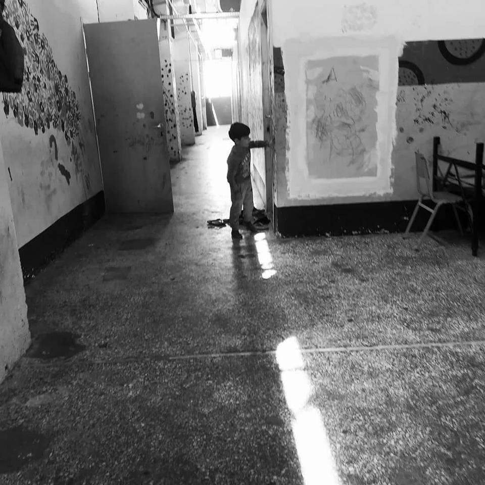
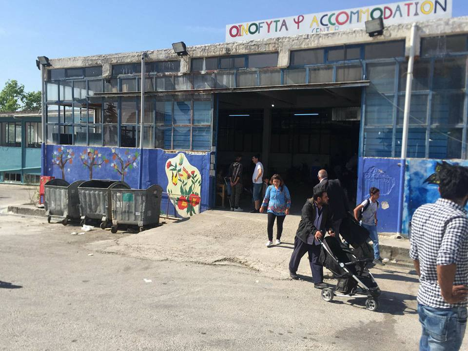
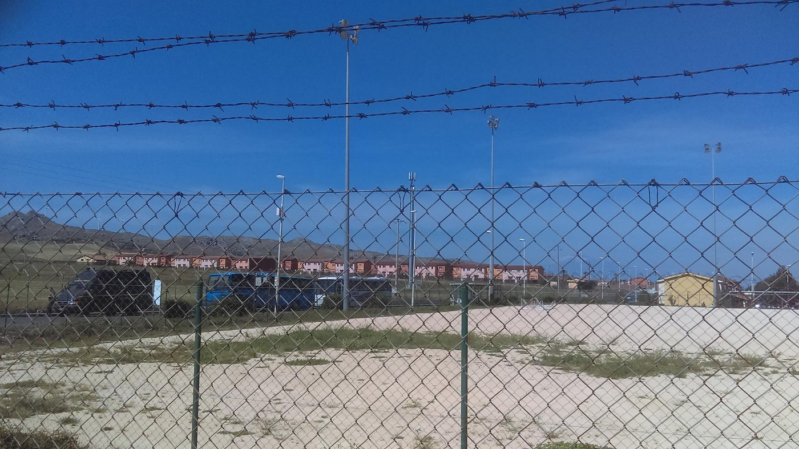
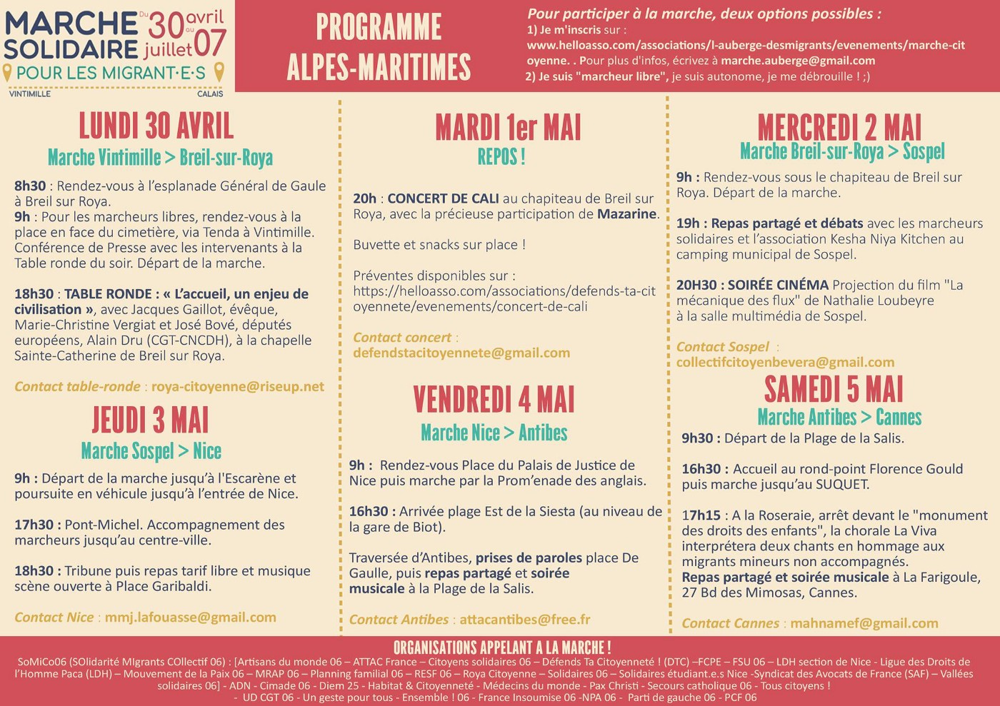

### DAILY DIGEST 27/4/2018: Close to 3000 people crossed Evros in April

_No adequate accommodation for people in Greece, again // Help is needed n Athens and Thessaloniki // Situation in Italy for people on the move, but also volunteers, more difficult // Maybe Bosnian government have a plan to assist growing number of people who are arriving // Solidarity March on April 30th_

Another ugly camp reopens — Oinofyta, Greece\. Photo by Arash Humpray\.
### FEATURE

Last Thursday, **340 people arrived in Greece from Turkey** by crossing the Evros river\. Last week not even one day went by without at least 100 people at this border\. So far this month, some **2,900 people have crossed Greece’s northern land border** with Turkey\.

Since the start of the year, **at least eight people have died while trying to cross** the Evros river\.

A number of organizations are already calling this **an emergency situation** , demanding action\. Different grassroots groups, including AYS, have also been trying to warn about this for months, but so far, little has been done to help people who are travelling\. The result is that all over Greece the number of people sleeping rough is increasing, and so are their needs\. In Athens, the numbers in the squats are increasing again with the influx from the islands and overland\. They [need](https://www.facebook.com/groups/PAMPIRAIKI/permalink/617758948568213/) food, hygiene and cleaning products, summer clothes and shoes\.

Hundreds are sleeping on the streets of Thessaloniki and Athens, hoping to get to some camp or any type of accommodation soon\. Among them are many families with small children and people coming from war\-torn countries\.

On Saturday, April 28th, local and national migration authorities are meeting in Thessaloniki to try to find a solution\. Apparently, some kind of plan exists, but it is still being kept from the public\.

The [UNHCR has called on the Greek](http://www.unhcr.org/news/briefing/2018/4/5ae2dd764/unhcr-appeals-Greece-situation-evros.html) authorities to “identify open transit sites to which new arrivals, many of them Syrian and Iraqi families, can be directed for registration”\. At the same time, they have noticed that some families with children are being held in police detention in “dismal conditions”\.

_“Refugees are crammed into local police stations, often in poor conditions, while the only reception centre in the area is already filled beyond its capacity of 240 people,”_ the UNHCR says, adding that some people have been held in detention for more than three months\.

The only reception centre in this area of Greece to date is located at Fylakio with a capacity of 240 places, including 120 unaccompanied and separated children\. [AYS wrote previously](ays-special-reception-center-in-fylakio-e7068196d369) about this centre, pointing out the poor living conditions\.

More people are arriving on the islands, too\. Yesterday, the [Aegean Boat Report](https://www.facebook.com/openeuborders/posts/1951599041835820) recorded one boat outside Tarti, Lesvos with 43 people on board and one outside Agrilia Kratigou, Lesvos with 53 people\.

It does not look like anybody has any kind of plan that will respond to this situation, even though it could have been predicted due to the increase in hostilities especially in Syria, but also with the Yemen, Libya and Afghanistan conflicts still going on\.
### Greece

The European Council for refugees and exiles — ECRE — issued [a statement](ays-daily-digest-23-04-18-fascists-attack-refugees-on-lesvos-1e65534a5726) saying that the situation for refugees in Greece has been increasingly tense after the incident on Lesvos on Sunday\.

The incident occurred after a group of fascists attacked the asylum seekers who had been occupying the central square in Mytilene to protest reception conditions and long asylum processing times\.

_“The Mayor of Lesvos, Spyros Galinos, has written to Minister Vitsas and the Citizen’s Protection Minister Nikos Toskas, saying, “Lack of action and poor management has resulted in nearly 10,000 asylum seekers being trapped in miserable conditions around a town of 27,000 residents and has created intense fear in the local community; a community that has lost its sense of security and after last night’s events its cohesion too\.”_

Once again we have to report about camps for refugees where living conditions are at a bare minimum\. Last year, a number of camps were closed for different reasons, but now they are reopening\. One of the camps that are open again is Oinofyta, near Athens, which even before was not a very good place for living, but was run by an NGO that aimed at creating livable conditions\.

However, the NGO left that camp after the government decided in Novemebr to close it, and now it is run by the ministry for migration while only IOM is present\. People who are being placed in the camp have mostly been transferred from the islands\.

Among them is Noor Alattar who posted about life in Oinofyta:

_“They gave me a small room with almost 10 people in an old factory and it is very dirty and very far\. Also, it is not really a camp\. This is a village only for factories\. When I was in Lesbos in Care Tepe it was better than here\. The UNHCR told me they would bring me to a good place, a safe place, because I am sick, and that I would have surgery soon\. They lied to me\. Also, here it is very dangerous\. Most of the young guys take drugs\. And there is no shop, no market, nothing here\. If someone has pains or something at night, there is no doctor\. Can someone help me? \! \! If I had known they would bring me here I wouldn’t have come\.”_

nPhoto by Noor Alattar

The jury in the case of **\#Moria35** has issued a judgment sentencing the 32 convicted people to 26 months, while only three persons were found not guilty of the incidents which occurred in Moria camp, Lesvos, in July 2017\. The 32 were found guilty of arson, destruction of public property and resisting arrest, and attempted bodily harm against the police\.

All of the indictees reported and denounced the exercise of police violence, both during their arrest and later on, even within the police department\.

Defence lawyers will appeal due to lack of evidence that any of the 32 injured or attacked the police\. Conviction on this ground sets an extremely dangerous precedent for arrests following riots and protests, as no defendant was identified as partaking\.

Previously, Solidarity Now issued a statement saying that brutal police violence was used and that the refugees are facing excessive criminal charges despite no individual evidence existing against them\.

The Legal Centre Lesbos claims that many of the 35 arrested were not present at the morning’s peaceful protest, leading observers to conclude the arrests were arbitrary and that people were targeted because of race, nationality, and location within the camp at the time of the police raids\.

The new Municipal Immigrants Integration Center is open to the public for information and appointments Monday to Thursday 09:00–14:00 on the ground floor of Piraeus Tower \(the only tall building in Piraeus\) near the metro station [by the port](https://goo.gl/maps/to2xEHmDVgv) \.

Orange House, Athens, [needs list](https://www.facebook.com/zaatarngo/posts/1776151412405194) \.

Khora community center is [fundraising for nappies](https://www.chuffed.org/project/support-displaced-families-in-athens-with-reusable-nappies) \!

_“There are many organisations in Athens that support displaced families, but surprisingly few offer nappies, and if they do they are nowhere near able to meet the demand\. We are two volunteers from Khora Community Centre who have been working to provide disposable nappies from the centre\. The demand, however, is far too high, with us only being to provide for 200 children, a small fraction of those who need nappies; and even then we can only offer each child about 1/4 of what they need\.”_

[Call for volunteers](https://www.facebook.com/teamphiloxenia/posts/2078959582351756) with Philoxenia team\.
### Italy

According to different independent sources, six Tunisians tried to flee from the Centro Permanenza per il Rimpatrio, basically pre\-deportation centre, Palazzo San Gervasio, province of Potenza, Basilicata\. Four of them were prevented with the use of teargas and batons, while two managed to escape\.

The centre was [opened in January](https://hurriya.noblogs.org/.../aperto-durgenza-cpr.../) , but at present has a very bad reputation\. Apparently, people held inside do not have medical assistance, even if they have serious health issues\.

Bad living conditions are reported in the reception centre in Mineo, Italy\. [Some are describing](https://www.facebook.com/carovanemigranti/posts/1261907113952949) it as a kind of concentration camp for migrants\.

PHOTO by Guadalupe Pérez Rodríguez
### Bosnia

Hundreds of people are sleeping rough in several cities across Bosnia and Herzegovina, while the authorities are doing very little to find a solution\. Apparently, at the end of the last week, the state government adopted a crisis plan according to which they should find a way to help people who are arriving in Bosnia\.

The authorities are claiming that nearly 1,200 people, mostly from Syria, Pakistan, Libya and Afghanistan, have entered Bosnia since the start of 2018 and almost as many were intercepted at the border\. Local solidarity groups claim the number could be much higher, especially in the area of Velika Kladusa and Bihac, close to the Croatian border, and Sarajevo, the capital city\. In all three cities, mostly the local population is helping those in need\.
### France

[L’Auberge des Migrants](https://www.laubergedesmigrants.fr/fr/la-marche-citoyenne/) , in connection with Roya citoyenne, have organised a solidarity walk from Ventimiglia to Calais\.

The march leaves Ventimiglia on April 30, 2018, and ends in Calais on July 7, and possibly Dover on July 8\. It has 60 stages, including Nice, Marseille, Lyon, Dijon, Paris and Lille\.

If you would like to get involved at any stage of the walk, support a participant, or just find out more about this ambitious and exciting event, check out the details below:

The [Maritime Alps](https://www.helloasso.com/associations/defends-ta-citoyennete/evenements/concert-de-cali) are ready to welcome the solidarity March of L’Auberge des Migrants\! This is the programme\-Sur\-Roya program to Cannes\.

[Délinquants solitaires group reports](https://blogs.mediapart.fr/association-gisti/blog/270418/jusqu-ou-iront-gouvernement-police-et-justice-pour-decourager-la-solidarite) on police violence against volunteers and people on the move following the crossing of the French\-Italian border\.

The report they issued claims that one volunteer was taken to hospital after being beaten and dragged downstairs by police\. Three others are in detention and could be charged with helping the “illegal entry” of migrants\.

> **We strive to echo correct news from the ground through collaboration and fairness\.** 

> **Every effort has been made to credit organizations and individuals with regard to the supply of information, video, and photo material \(in cases where the source wanted to be accredited\) \. Please notify us regarding corrections\.** 

> **If there’s anything you want to share or comment, contact us through Facebook or write to: areyousyrious@gmail\.com** 

_Converted [Medium Post](https://medium.com/are-you-syrious/daily-digest-27-4-2018-close-to-3000-people-crossed-evros-in-april-c5b428ebc9e4) by [ZMediumToMarkdown](https://github.com/ZhgChgLi/ZMediumToMarkdown)._
