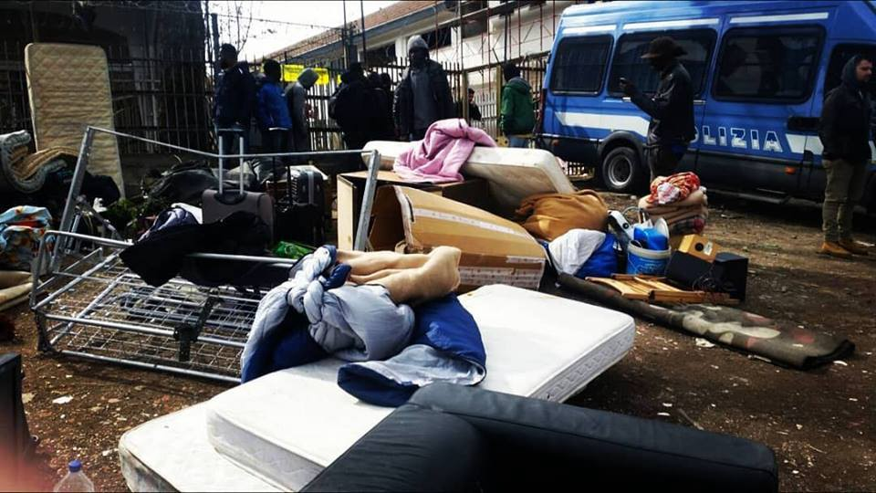
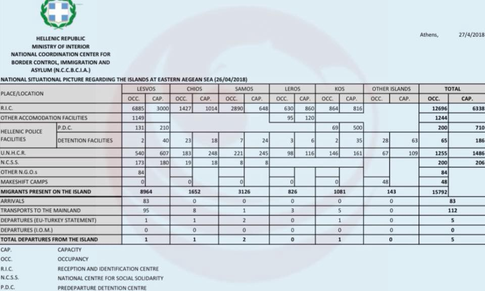
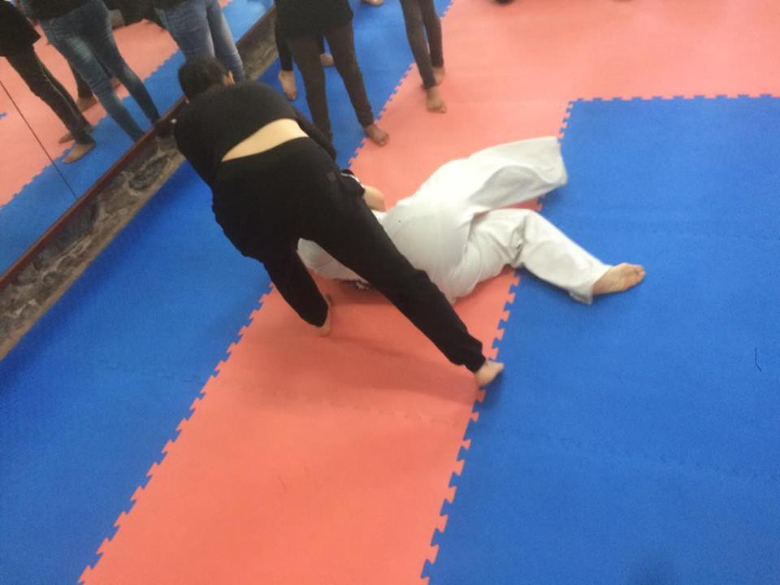
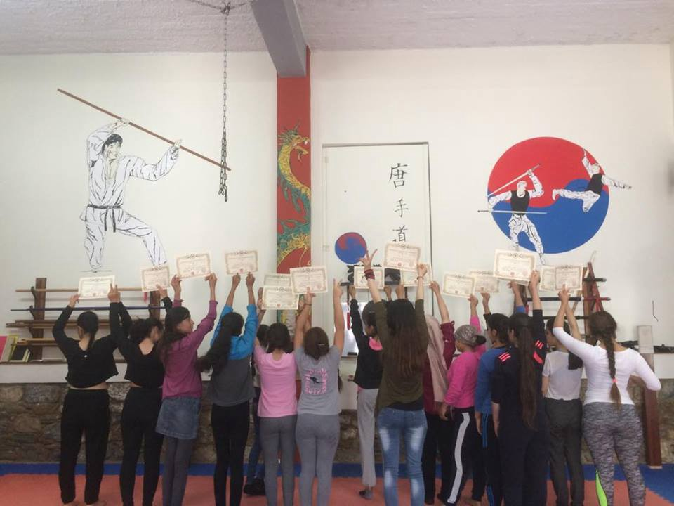
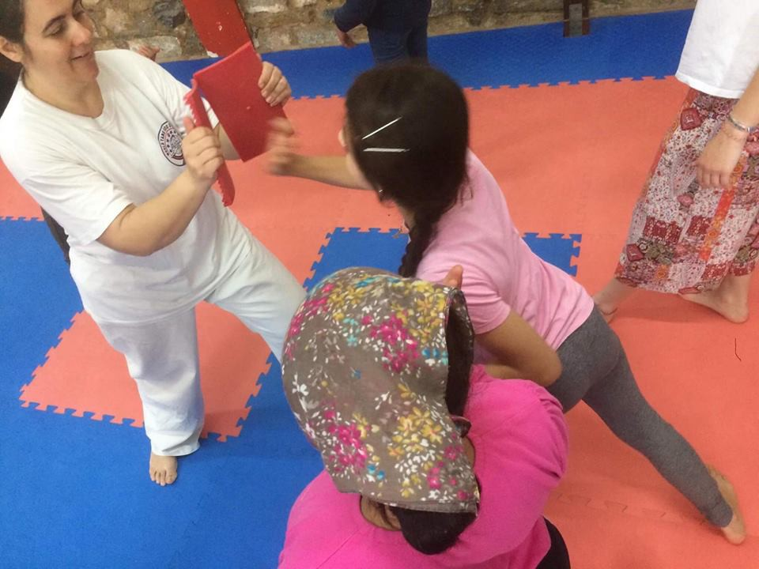
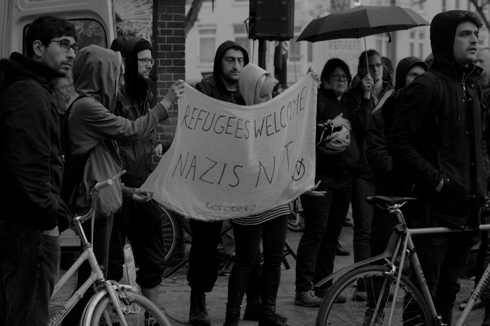

### AYS DAILY DIGEST 28/04/2018: Evacuation of the camp in via di Vannina in Rome

_A new report regarding the evacuation of the camp in via di Vannina in Rome has been published//New data from on Greek islands//Police entering Skaramangas camp and forcibly arresting all those without papers//Support for the 3 people in solidarity detained after the Briançon march//A boat with 90 people went missing in the Alborán sea//More news from the Netherlands, UK…_

Credit: A Buon Diritto — March 2018
### **Feature**

A [report](http://www.meltingpot.org/IMG/pdf/vademecum_vannina.pdf) \(in Italian\) on the recent evacuation of the camp in Via di Vannina, Rome, has been released today\. The evacuation took place on the 21st March 2018, after a series of previous evacuations, that started from June 2017\. The report is the result of a joint work among different associations \(Alterego Fabbrica dei Diritti, A Buon Diritto, Medu, Be Free, Women’s International League for Peace and Freedom — Wilpf\) and aims at identifying the reasons that brought these people on the move to be marginalised, including the inefficient reception system, the bureaucratic procedures, too long and complicated, and the difficulty in obtaining residency once received humanitarian protection\. Moreover, the abuse of power and violence on the side of the police is being denounced by this report \(a Gambian refugee has lost sight permanently on his right eye, after a policeman hit him with a baton\) \.

The associations also requested formally to access the legal documents referring to the evacuation, as they believe it could have been carried out violating the Ministerial dispositions and measures issued after the shameful and inhumane [evacuation of the building in via Curtatone](https://reliefweb.int/report/italy/violent-evictions-refugees-rome-reveal-inhumanity-modern-democracy) in August 2017\.

In via di Vannina, 2 buildings have been squatted since 2014, reaching the number of 500 residents in June 2017, respectively hosting 200 and 300 people \(even families with minors or 18 year old boys who concluded positively their asylum process but had no other housing option offered by the reception system\), who lived in tents created with blankets, tarpaulin, wood and other materials, inside the industrial buildings\.

After the evacuation of June 2017, one of the building was definitely closed down and all the residents had to move inside the other, that was cleared few days later, forcing people to sleep in the street\.

MSF, who took care of those evacuated, reports 7 cases of traumas related to the methods and violence used by the police during the clearing\.

Both of this episodes were unannounced \( \! \! \) and carried out without the presence of the Sala Operativa Sociale which monitors the correct and legal development of such events\.

Between October 2017 and March 2018, a number from 92 to 111 people was registered in the building, the majority of them male adults between 18 and 30 years old, mainly from Central African countries\. Among them, 5 women, probably victims of human trafficking\.

Hygienic conditions were obviously horrendous: no adequate toilets nor showers, garbage piled in and outside the building and the presence of pests\. Electricity and water were retrieved somehow or other\.

What comes out of the report is a worrying picture of the inefficient Italian reception system, that doesn’t guarantee adequate integration possibilities, non professional or non constant language classes, no or little access to job opportunities and relative training, contributing to the isolation of migrants from the society they live in\. Other reasons were the delays in the procedures to obtain permit renewals and the inefficiency of the bureaucratic machine; by doing so, many people who were regularly present on the territory just lost their residency and, therefore, the rights associated with it\.
### **GREECE**

_Arrivals_

Up to 26th April, 8\.114 people had reached Greece, mainly coming from Syria, Iraq, Afghanistan, according to [UNHCR](https://data2.unhcr.org/en/situations/mediterranean/location/5179) \.

Greek government sources are showing that there is almost 9000 people now at Lesvos, over 3100 at Samos, more than 1000 at Kos and over 1600 at Chios\.

_Mainland_

On Friday morning, special forces of the Greek army entered the [Skaramangas refugee camp](https://www.facebook.com/nobordersnetwork/photos/a.660787423989153.1073741828.657905327610696/1730970053637546/?type=3&theater) , checking papers of the residents and arresting those who did not have them\.

Syrian and Iraqi refugees were taken without explanation and without more information on where they were taken; up to now, no one could get in touch with them\.

Other residents are now clearly very scared and afraid to leave the camp, while police is still in the camp and at the entrance to forbid the entrance or the exit\.

It is a clear violation and abuse of power on the side of the Greek police that we denounce strongly, also given the business that is being made to the disadvantage of the refugees\.

An AYS collaborator reports that:

“ _It’s hideous what happened in Skaramangas\. But one thing that will need to be mentioned when this is written up, is that there has been no “official” presence there for a while, and that containers and rooms within containers have for quite a while now been sold and traded\. I was told some weeks ago that a Skaramangas container costs between 1000 and 1200€\. People assigned to them have moved but somehow retain the rights, and sell or rent them\. This has effectively locked out families in need of housing who do not have that astronomical amount of money to dish out, especially now that all these people are crossing over the Evros and coming to Athens_ ”\.

See yesterday’s [digest](daily-digest-27-4-2018-close-to-3000-people-crossed-evros-in-april-c5b428ebc9e4) for more info on the crossings\.

Mobile Info Team has published a [useful reminder](https://www.facebook.com/mobileinfoteam/posts/2162120634016654:0) on the criteria to make family reunification if a child turns 18 during asylum procedure in Europe\.

[Great initiative](http://Samos Volunteers Samos Volunteers, Sámos, Samos, Greece. 6K likes. https://samosvolunteers.orgwww.facebook.com) for girls in Samos\! Today they had the chance to take self\-defense classes\.

Credit: Samos Volunteers
### **FRANCE**

_Paris\._

Around 40 people created a [human chain](http://www.leparisien.fr/paris-75019/paris-le-parti-communiste-organise-une-chaine-humaine-en-soutien-aux-migrants-28-04-2018-7688427.php) in the area of Saint Denis to protest against the new French Immigration Bill and demand a more dignified asylum process\.

Some [news](https://www.infoaut.org/migranti/aggiornamenti-sui-tre-arrestati-di-briancon-per-delitto-di-solidarieta) related to the 3 “solidali” who were arrested on Sunday for taking part to the demo in Briançon\.

As reported yesterday in digest, the 3 are now secluded in Marseille, charged for aiding illegal immigration “en bande organisée”\. They risk sentences up to 10 years in prison and 750\.000 in fees to pay, just for the crime of showing solidarity to people on the move, while still some random fascist is free to patrol, undisturbed, the border\.

The hearing is scheduled for the 31st May and their lawyers, together with Italian and Swiss colleagues are trying to keep the attention high on their cause\.

On the 3rd May, there will be an appeal for reconsideration and people in solidarity are organising demos outside the court to show support, so participate and spread the word\!

**SPAIN**

Since Friday, Salvamento Marítimo has worked to [localise a boat](http://www.europapress.es/andalucia/almeria-00350/noticia-concluye-resultados-busqueda-viernes-patera-mar-alboran-20180428192229.html) that went missing, in the Alborán sea, with 90 people on board\.

The search was concluded today unfortunately \(due to high waves and wind\) without success, but Salvamento Marítimo got in touch with the Algerian Coast Guard as well in order to get their collaboration in case the boast would reach its waters\.

Moreover, always on Friday, S\. M\. rescued a total of 67 people from 2 different boats, carrying 45 people \(among them 4 women and a child\) and 22 respectively\.

**THE NETHERLANDS**

We Are Here demo\.

On Saturday afternoon a few hundred people have walked a solidarity march Amsterdam for the undocumented refugees of We Are Here\. The We Are Here collective has been campaigning against the inhumane Dutch asylum policy for years and organized the afternoon with support from over eighty social organizations\.

](assets/e0b7d2f37a40/1*6GiV8eEUf9Gg0etVnSuBFw.jpeg)

Photo by [Bond Precaire Woonvormen](https://www.facebook.com/BondPrecaireWoonvormen/?hc_ref=ARQq-m0G5B_Gq4T4DYpYDbECINf6ZCPjZ9O1O_qgso8kFzztPZT9z-9lo4aNHhXbr7w)

“ _Our main goal today is symbolic_ ,” explains Khalid Jone on behalf of We Are Here\. “ _To expose the unjust immigration system\. It is therefore nice that we are with so many, you learn a lot from each other_ \.”

The main objection was that the Dutch migration process is not conclusive, which leads to the denial of basic rights of refugees in the Netherlands\. Many of them are unable to return to their home country, leaving them in limbo and without a proper roof over their heads or the care they need\.

According to various estimates, between 400 and 600 people have partaken in the demonstration which went peacefully and lasted form 14:00 to 17:00\.

**UK**

On 1st May, there will be a demo outside the Home Office in London to protest against the deportations back to Jamaica of [those people](https://twitter.com/followMFJ/status/990313435132055552) who reached the island decades ago and, after a life spent in the UK, are threatened with the serious risk of being deported back\.

> **We strive to echo correct news from the ground through collaboration and fairness\.** 

> **Every effort has been made to credit organizations and individuals with regard to the supply of information, video, and photo material \(in cases where the source wanted to be accredited\) \. Please notify us regarding corrections\.** 

> **If there’s anything you want to share or comment, contact us through Facebook or write to: areyousyrious@gmail\.com** 

_Converted [Medium Post](https://medium.com/are-you-syrious/ays-daily-digest-28-04-2018-evacuation-of-the-camp-in-via-di-vannina-in-rome-e0b7d2f37a40) by [ZMediumToMarkdown](https://github.com/ZhgChgLi/ZMediumToMarkdown)._
