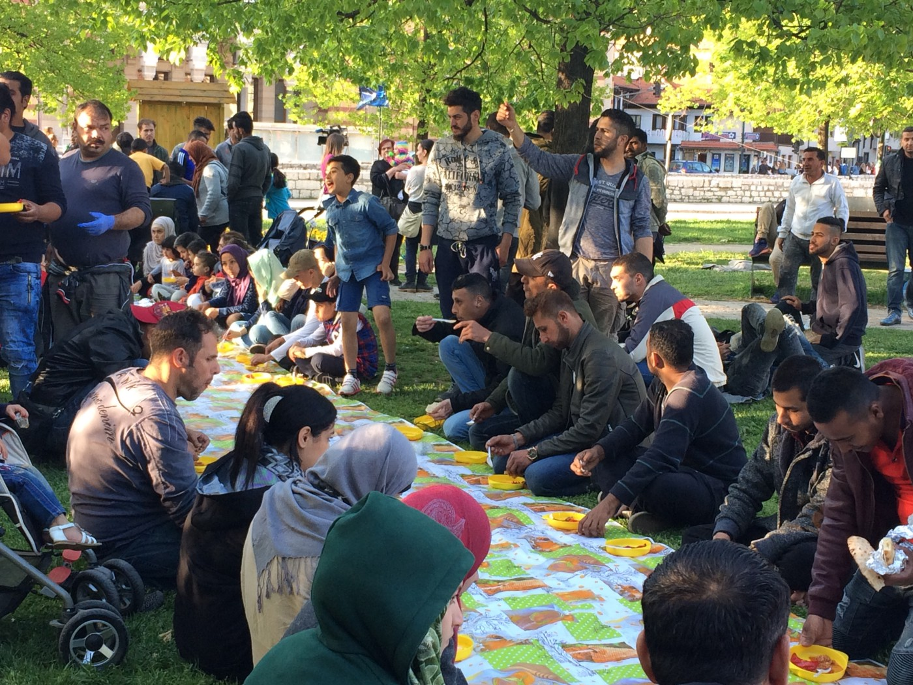
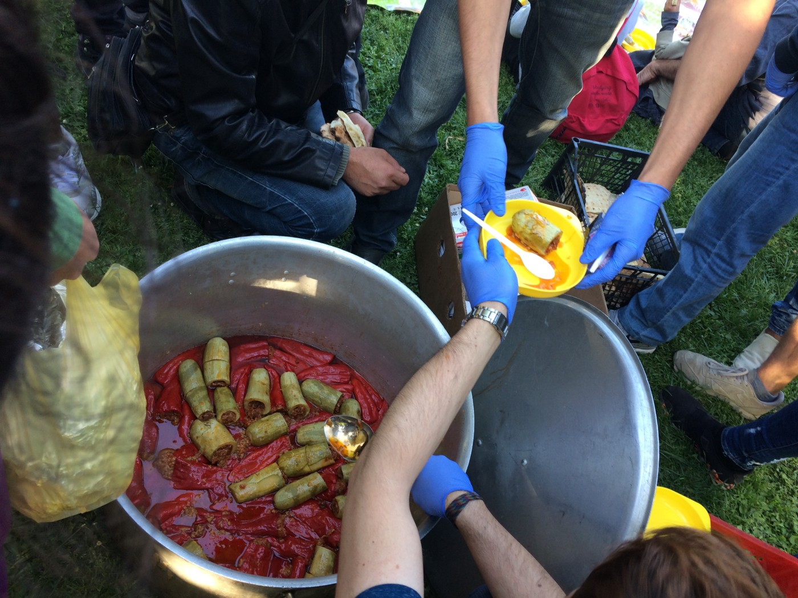
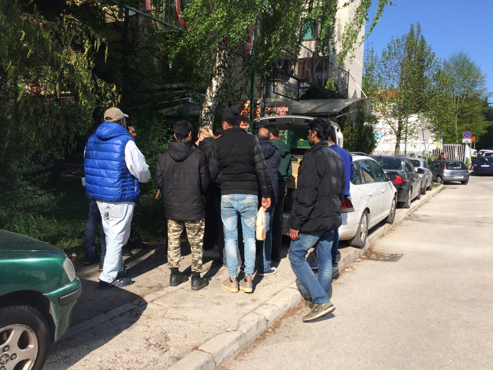

### AYS Special — What is going on in Bosnia?
#### Since December last year, Bosnia has seen an increasing influx of people fleeing war and persecution arrive\. Volunteers on the ground are warning about how the lack of response and neglect from as well the government as big international organisations can make the situation deteriorate\. This is an overview of what is going on in the country, which has become the biggest bottleneck along what could be called the “new Balkan route”\.

Friday night food distribution in the park in Sarajevo\. Photo: AYS

For a long time, Bosnia was not a part of the Balkan route\. It is a poor country, which not long ago suffered from its own war\. It is surrounded by high mountains\. It is hard to enter and is marked from the Balkan wars with mine fields, which could detonate while crossing them\.

Despite this, a new route has emerged through Bosnia\. For people on the move this is something new, a potential step forward\. When the Hungarian police’s violence escalated, people started to cross the border with Croatia\. For a short while, that was a more successful game to play\. That is not the case anymore\. The violence and pushbacks in Croatia towards people entering from Serbia, which AYS has written several reports about, can be one of the resons behind this new way, just as Hungary was prior to this\.

[According to information from UNHCR](https://reliefweb.int/report/serbia/unhcr-serbia-update-02-15-april-2018) , 13 people were recorded pushed back from BiH to Serbia the first two weeks of April\. Right now volunteers who recorded violence on the Serbian\-Hungarian border a year ago, are preparing themselves to, if necessary, do the same on the Bosnian\-Croatian border\.

For now, the 900\-kilometer long Bosnian\-Croatian border is understaffed, which make it easier to cross\. This week information about [more money from the EU to increase border](https://uk.reuters.com/article/uk-eu-migrants-borders/eu-set-to-move-closer-to-fortress-europe-with-new-budget-plan-idUKKBN1HX2T1) controls came, for now, it is not clear where the money will be spent\. But in Bosnia, the Minister of Security in BiH, [Dragan Mektić](http://www.dw.com/sr/migranti-u-bih-stanje-nije-alarmatno/a-42983598) , have expressed that they are low on people managing the borders\.

“Only in the Border Police, we have a fifth of vacant jobs\. We miss about 500 people to protect the borders, and at the moment we are exhausting people who control these borders”, [Mektić](http://www.dw.com/sr/migranti-u-bih-stanje-nije-alarmatno/a-42983598) told DW\.
#### Dangerous lack of response

The government in Bosnia has said that they cannot take care of an increasing number of refugees\. In February Borislav Bojić, chair of the state parliament’s joint commission for human rights, warned that they by the end of May should have run out of funds\. But [according to HRW](https://www.hrw.org/news/2018/04/24/bosnia-failing-protect-asylum-seekers) they now claim that they are managing the situation\.

In the only asylum center, the Asylum Centre in Delijaš near Sarajevo, there is around 160 places\. It is, of course, constantly full\. In the report by Human Rights Watch, it says that the government together with its international partners should work to ensure that refugee law and human rights are upheld\. In other words, this is not the case right now\. Despite this, IOM’s representative in BiH is positive\.

“We are providing support to the government in BiH and migrants and asylum seekers around the ongoing so\-called migration crisis\. It involves both capacity building of the institutions, Service for Foreigners and support to the border police\. It also involves providing direct assistance to the migrants in Bosnia and Herzegovina,” he said\.

UNHCR recently started to pay for a number of hostels and IOM has started to work together with volunteers on medical cases\. Up until now \(and still\), volunteers have paid medical bills with private or donated money\.

We have received complaints from migrants staying at UNHCR’s accommodations saying that they are given only one meal a day\. In some cases, people have left the accommodations to stay in some of the volunteer\-driven accommodations\. Recently a family who was placed at a hostel with only single males felt unsafe and were instead accommodated by volunteers\.

In Sarajevo, a lot of newly arrived people including families with young children are coming to get a free meal\. Both individual locals, local volunteers and international volunteers are helping in different ways\. Photo: AYS
#### Complete system crack\-down

The asylum system in BiH is preventing people from succeeding since the rules are impossible to follow\. When someone arrives in Bosnia, they have to express an intent to seek asylum to the border police or Ministry of Foreign Affairs\. After this, they have 14 days to register their official request for asylum\. For people placed in the only Asylum Centre in Delijaš this is possible\. But for others, this is not a possibility and they are hereby excluded from the asylum procedure since they cannot re\-register\. In order to submit a full asylum request, it is demanded that people must submit documents on registration of their residency\. This is impossible for people to obtain, and the landlord has to sign document\-confirmation of the arrangements they made\.

In a big house outside of Sarajevo, volunteers are housing up to 90 people\. According to the existing rules, many of them are already in the country illegally\. Volunteers have been working hard on getting information on if people they are housing will be able to renew their papers after they have expired\. When asking IOM, the representative said that he hopes they will be able to re\-register everyone, but this is up to the government\. So far, no questions have been answered\.

Local media, as well as international organizations, claim that no one wants to stay in Bosnia, at the same time as the system make this an impossible wish\. False information is spread, BiH government, mainly Ministry of Security, have said that 99 percent of those arriving in Bosnia are fake\-asylum seekers\. In the long\-term, this can potentially harm civil initiatives and locals helping since it is echoed by a significant number of politicians in the country\. International volunteers have already been questioned for the help they are providing\.

For the time being, it is hard for local activists and volunteers to support people arriving with more than basic aid since it is not even possible to register them\.

Volunteers are every day distributing food on the streets\. Often several times a day, as well day and night\. Photo: AYS
#### Locals are helping

Despite this state propaganda, lack of response and inadequate asylum system — local people are friendly and help the newly arrived people\. Many of them experienced the horrors of a war not long ago themselves\.

In a park in Sarajevo, people are providing food throughout the day\. In the biggest volunteer house, located about 30 minutes outside of central Sarajevo, locals are delivering donations on a daily basis\. Besides this, volunteers organize street distributions both daytime and night\-time, to make sure that those sleeping on the streets at least have sleeping bags, blankets and something to eat\.

Many people are also taking the bus to Bihać and Velika Kladuša, two cities close to the border with Croatia, late in the evenings, with the aim to try and cross the border\. In both cities locals give food and aid to people sleeping rough, staying with locals, or squating\. No medical help from big NGOs are available around there, but locals are providing even that\. In Velika Kladuša, AYS volunteers even found that a local restaurant is cooking free meals for people here\.

UNHCR and IOM went there recently to ask for papers and if someone wants to repatriate voluntarily, but as far as we know — that is it\. When the Red Cross came last week, locals told them that they came to late\. The locals asked them to leave, since they have been doing everything on their own since November\. Bosnia’s biggest humanitarian NGO, Pomozi\.ba, will send five tons of food collected by locals to Velika Kladuša\.

The, for now, peaceful relationship between refugees and locals, are according to experienced volunteers a fragile thing — it has happened before that locals are eager to help before the situation becomes an institutionalised “problem”\. Therefore, the lack of response can become toxic\.
#### What will happen next?

As for now, no one really knows how the situation will develop or how many people it will be in the country in one month\. The Bosnian authorities expect the arrivals to increase the upcoming months, just as volunteers on the ground\. The need for increased access to hygiene facilities, such as showers, will become even more urgent with summer approaching\. MSF are discussing different potential solutions on this right now, and Pomozi\.ba also have showers that hopefully will be in use very soon\. We have also received information about increased resources, especially in Velika Kladuša and Bihac, from IOM and MSF\. But for now, it is not clear when and how this actually will be implemented\.

With more and more families arriving, safe accommodation alternatives will continue to be important\. Among the young men coming, there are many children whom no one look after\. If people would be found to be under\-aged, the state according to statements from minors, will send them to closed facilities\. Due to this, people are lying about their age, saying that they are older than they are\. Only to avoid being locked in as the only available alternative for the time being\.

Many people who now are in Bosnia has been on the move for years, living in one camp after the other with different horror stories in fresh memory\. The psychological stress among the people here are huge\. Since Bosnia is a post\-war country, there is a lot of local competence that has not been acknowledged by UNHCR, who are the main agency responsible for refugees well\-being\. In Bosnia there are many experienced organizations who are working with traumatised people\.

Speaking of what is going on in Bosnia right now, clearly is a complicated history\. War\-refugees and other migrants in a post\-war country, where locals have stories similar to theirs\. Big organizations who have been absent for so long that locals no longer want their help\. At the same time as they hardly can continue manage the situation if it continues\. As some volunteers said — it has happened before, that the willingness to help decreases as the situation degenerates\. Hopefully, this won’t be the case here\.

AYS will continue to be present in Bosnia, and provide information about what is going on\.

**We strive to echo correct news from the ground through collaboration and fairness\.**

**Every effort has been made to credit organizations and individuals with regard to the supply of information, video, and photo material \(in cases where the source wanted to be accredited\) \. Please notify us regarding corrections\.**

**If there’s anything you want to share or comment, contact us through Facebook or write to: areyousyrious@gmail\.com**

_Converted [Medium Post](https://medium.com/are-you-syrious/ays-special-what-is-going-on-in-bosnia-1f8d2bc2dc4e) by [ZMediumToMarkdown](https://github.com/ZhgChgLi/ZMediumToMarkdown)._
