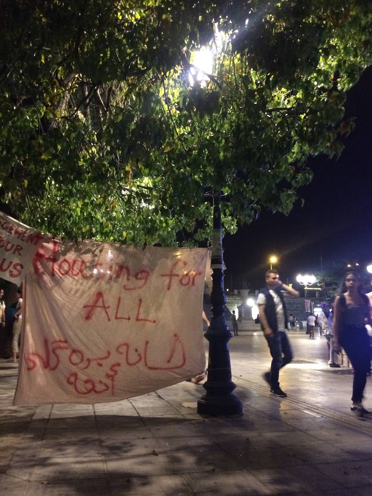

### AYS DAILY DIGEST 30/04/2018: Another deadly attack in a safe country

_At least 29 people, including nine journalist died in attack in Kabul // Refugee camp near Damascus almost destroyed // Protests in Athens // Help urgently needed for DocMobile team /// Illegal push\-backs and hate speech against people on the move in Bosnia //_

 arrive in Turkey, by foot, trying to escape repression and death\. The Turkish government has deported at least 7,000 Afghan refugees back to Kabul recently\. Photograph by Erdem Sahin via Art Against\.](assets/cc8c61207df8/1*TLt6ExBPLGoCZIQtyvGj7g.jpeg)

Erzurum, Turkey 27 April 2018\. [\#Refugees](https://www.facebook.com/hashtag/refugees?source=feed_text) arrive in Turkey, by foot, trying to escape repression and death\. The Turkish government has deported at least 7,000 Afghan refugees back to Kabul recently\. Photograph by Erdem Sahin via Art Against\.
### Feature

In a series of deadly attacks yestrday in Kabul, at least 29 people were killed and more than 49 wounded\. Among them were nine journalists\. Some are considering this incident as the worst attack on Afghan media in modern history\.

The Afghan media reported that the first incident, occurred when motorcycle carried out explosive went off near an office of Afghanistan’s premier intelligence agency, National Directorate of Security, in the city’s Shashdarak area\. About an hour after, in the second attack, the media and emergency medical workers who arrived at the place of the first explosion, were targeted\.

The attack was committed during rush hour on Monday morning\.

The explosions come about a week after a blast killed 60 people at a voter registration centre in the west of the city\.

Many European Union countries are considering Afghanistan a safe country and they are deporting people back, instead of offering them shelter and refuge from the war\.
### Syria

During the week of heavy fightings, an estimated 3,500 Palestinians have fled the embattled Yarmouk refugee camp, UN reports\.

Nearly 200,000 people, mostly Palestinian refugees, Syrians and others, lived in this camp\. The camp was under attacks by various groups, and on April 19, the Syrian government and allied armed groups, launched a renewed military offensive targeting Yarmouk and surrounding areas citing the presence of fighters\. At least 31 people had been killed over a week of intensified violence\.

Inside the camp, there are currently no hospitals or medical facilities operating, and up to 60 percent of Yarmouk has been destroyed\.
### Greece

New arrivals are registered on land and the sea\. Only to the islands, 79 people arrived\. Among them, eight people were dropped of by a speedboat at Kos, 33 people arrived on Chios and 31 on Kastellorizo\.

**](assets/cc8c61207df8/1*rYZ3AwjbarlNKGtwN8mEyg.jpeg)

**Photo by [Salvamento Marítimo Humanitario](https://www.facebook.com/smhumanitario/?hc_ref=ARRnOWQIpS_BfBxM4_-rYFVZXwOWtXKdD1XaCGztSp-RT8WIhNKtmCpQGiiluqBApxk&fref=nf)**

[Aegean Boat Report](https://www.facebook.com/AegeanBoatReport/?hc_ref=ARRJ7oZzOKBC-ze7Wqra5dD1c_BI2TPNaNg8IDwHGOu7L7--lZ9cE_NQeOLkVUZMixA&fref=nf) published a short overview of arrivals this weekend saying that only three boats have arrived since Friday\. More people tried but were prevented by the Turkish coast guard\. Only in the last 24 hours, seven boats have been stopped with a total of 303 people\.

Nevertheless, islands are overcrowded for more then a year\. Now even the situation on mainland is becoming heated due to the lack of accomodation\. During April, volunteers in Thessaloniki helped at least 600 people who were looking for accommodation or different services\. In most of the cases, volunteers are sending people to camp that have the capacity to respond to the needs of the increasing numbers \(currently Lagkadikia and Alexandria\) \. Kavala, Diavata camp is full and new arrivals sleep in community rooms\. Also UNHCR capacities are full\.

Greek government reactivated some of the old camps, including Volos, Elefsina and Oinofita, but living conditions are not satisfactory\.

Many people who are arriving to Thessaloniki and Athens are not registered, and due to that forced to sleep rough, or in some cases they are accepted in collective accommodations\.

In support of growing number of people who do not have a place to stay, group of about 200 volunteers and refugees went last night to Syntagma square in Athens to protest, hanging makeshift “housing for all\!” banners and unrolling blankets and sleeping bags with the intent to sleep there\.

Photo AYS

The protesters released a statement:

_“It is ludicrous that it has been left to grassroots organisations such as the squats to solve a housing crisis created by organisations with access to far more resources and power\. We demand safe, clean, and accessible housing for all those who seek housing in Greece\.”_

Around midnight, more police arrived on the scene and told the asylum\-seekers to come with them to be registered\. Understandably, many people were deeply skeptical, and refused the offer\. Towards 1:30 am, two ministry employees arrived and gave the crowd an ultimatum: go to Skaramagas Camp to be registered \(which could take as long as the normal registration process, but people would be housed in camps and have better access to food and medical care\), or stay in the square and be arrested\. Ultimately, many people decided to go to the camps, a clear indication of the desperate situation facing newly\-arrived asylum seekers in Athens\.

Photo by Khora Community Center

At the same time, Greek government decided to send more police patrols at the land borded area, due to increase number of people who are arriving every day\. They also called Frontex to intervene in this area\.

[DocMobile — Medical Help e\.V\.](https://www.facebook.com/docmobile.org/?hc_ref=ARS7IMF80BPAmqC6W8gqzrntTwtEmqD_BY-qfS_JElbOInA-AlUzpZiWl5NGcWoe6n4&fref=nf) published an urgent need for medics and doctors\. Their team are present in three cities and on Lesbos and provide medical assistance\. They need doctors and medical trained assistants\. Otherwise, thy can no longer provide aid on the ground\.
### Bosnia

While local population is still helping to people who keep arriving to Bosnia, local media — mostly controlled by the politicians — but also part of the academic community is using hate speech and spreading xenophobia against migrants and refugees\.

Major at one municipality in Sarajevo, where many people are sleeping rough due to the lack of accommodation or any care provided for them, said that people who are arriving to Bosnia are former ISIS fighters, even though no proof has been given for this\. Local politicians and media are also describing people who need help as criminals, while trying to prevent local people from helping\. However, so far, their words have no effect, but it can turn around easily\.

Among those who are in Sarajevo now, sleeping rough, there are many families from different countries, including babies\.

However, this harsh rhetorics is mirrored in police actions\. This week, border police issued another report about their activities since the beginning of the year, openly saying that they use pushbacks and repressive measures to prevent people from entering\.

Officially, since January 1st until April 29th, police found 1\.239 person who tried to entered the country at various border crossings\. At the same time, police prevented — read illegally pushed back — 1\.541 person\.

Most of the people who are coming, or trying to come, are from Syria, so refugees from war torn country\. Other are coming from Pakistan, Libya, Afghanistan, Iran, Iraq, Palestine, Algeria, Morocco, Turkey, Bangladesh, Tunisia, Cuba, India, Albania, Jordan, Egypt, Jemen, JAR…

To know more about what is going on in Bosnia, see [our special](ays-special-what-is-going-on-in-bosnia-1f8d2bc2dc4e) \.
### Serbia

[Refugee Aid Serbia](https://www.facebook.com/refugeeaidserbia/?hc_ref=ARQs1vzVHDtNKyAFmHP0V0LMKUyum8-YQ8w8LtYziDs95kwUJbiVj_YvuH4DS1Cnl5I&fref=nf) is looking for volunteers for their community garden project\.

Would you like to work alongside refugees and migrants? Do you have any gardening experience? Are you interested in sustainable agriculture? If yes, hit us up\! At RAS we are looking for an enthustiastic volunteer to help us with our community gardening project in Belgrade, Serbia\. We need you as soon as possible\!

If you are interested and would like to learn more about the project, please don’t hesitate to send an email to Isabel at isabel\.alonso\.ras@gmail\.com

**We strive to echo correct news from the ground through collaboration and fairness\.**

**Every effort has been made to credit organizations and individuals with regard to the supply of information, video, and photo material \(in cases where the source wanted to be accredited\) \. Please notify us regarding corrections\.**

**If there’s anything you want to share or comment, contact us through Facebook or write to: areyousyrious@gmail\.com**

_Converted [Medium Post](https://medium.com/are-you-syrious/ays-daily-digest-30-04-2018-another-deadly-attack-in-a-safe-country-cc8c61207df8) by [ZMediumToMarkdown](https://github.com/ZhgChgLi/ZMediumToMarkdown)._
