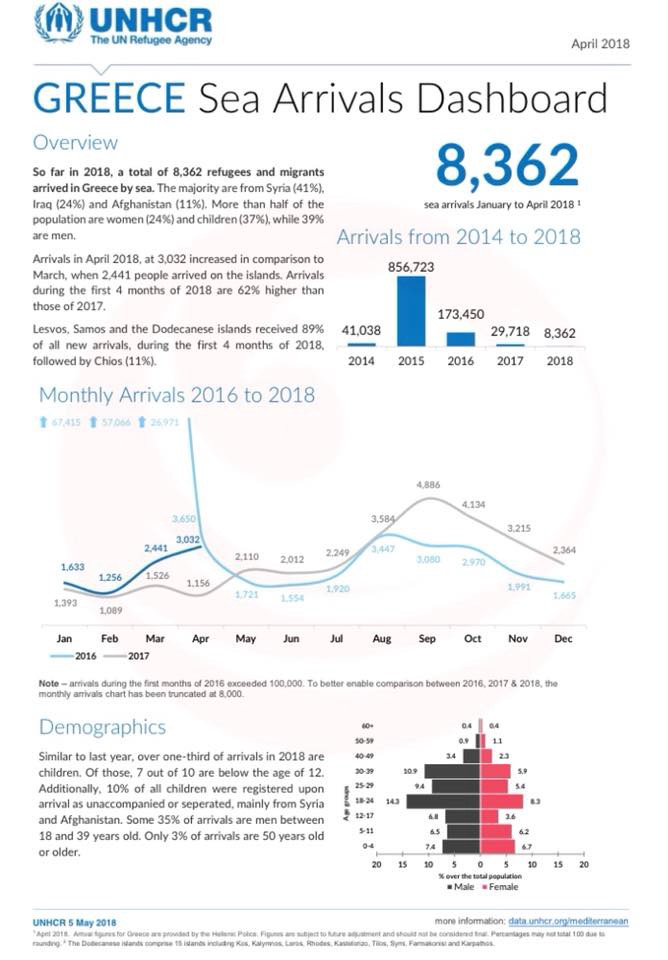
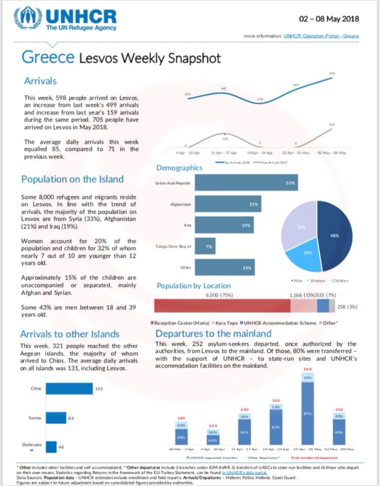
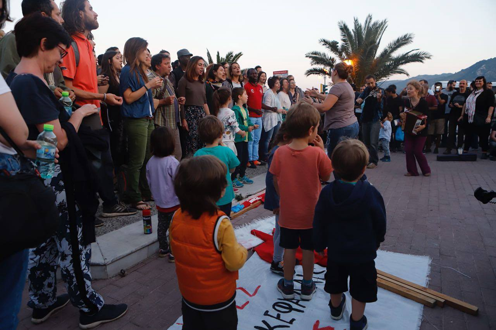
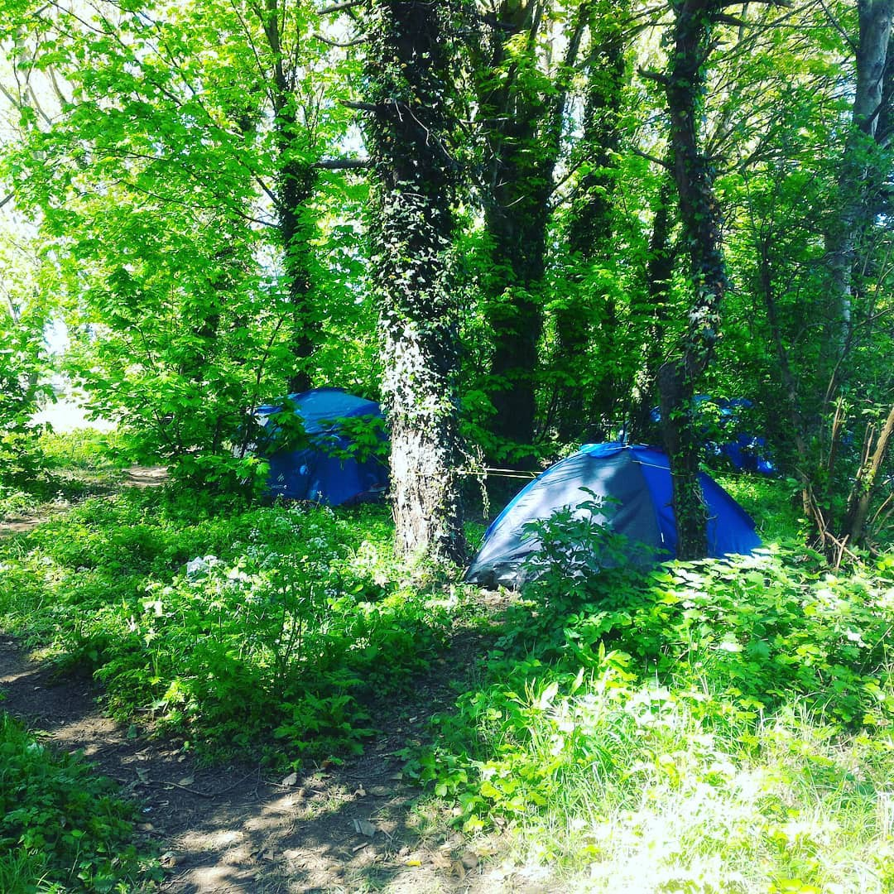
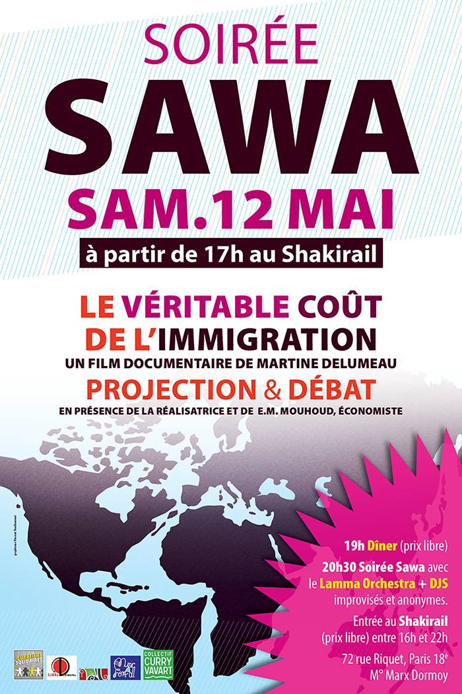

### AYS Daily Digest 09/05/18: European disunion in common values
#### _Family reunification must be considered case\-by\-case, the EU Court says; German Chancellor suggests a broader array of options for family resettlement, objections by human rights groups / Several people told to leave or face arrest in Skaramagas / New SAR actions in the Mediterranean / France and Italy continue dismantling makeshift camps and information points / Water tanks continuously taken away at Calais area camps / And more news…_

](assets/d90388b270dd/1*_260bieSE_947DFjY_rZ_Q.jpeg)

“Today is the day of Europe, a day commemorating ‘peace and unity of the continent\.’ Unfortunately, one more year we cannot celebrate because thousands of people continue to die on their shores without the countries forming this alleged Union of values has the slightest desire to prevent it\.” — [CEAR](https://www.facebook.com/CEARefugiado/?hc_ref=ARQUvIKHYCgPV5I82UelISEyp07LlcAxxSfAFhMbLO8FWvhZpDSJLPJqGss03BLowTE&fref=nf)
### FEATURE: European disunity?

Said Avramopolous in a statement on the occasion of Europe Day:

> The essence of the European Union, back in 1950 and to this day, has been peace\. It is on the basis of this peace that everything else has been built: prosperity, mobility, freedom and openness\. 

> \(…\) 

> In challenging times like these, populist and nationalistic voices are trying to convince us to close ourselves off, to turn inward in order to protect ourselves or not to lose our national identities\. But the challenges we face today can only be addressed jointly\. 

Official, yet illegal push backs; police violence; people losing lives at the borders, on the shores, and inside the countries; denial of basic rights; neglecting the foundations of laws the Union was built on; the flourishing of criminal smuggling and trafficking networks; and other growing problems people in need are facing all speak against the prosperity, mobility, freedom, and openness in the EU of 2018\.

Something went wrong and we all need to work on fixing it\.
### AFGHANISTAN
#### Another attack in Kabul

Several blasts have been reported at different locations around Kabul, Shahr\-E Naw, Dasht\-E Barchi, and other unconfirmed locations\. Gun men mounted coordinated attacks in the Afghan capital, battling security forces for hours in the city’s main commercial area after three large explosions sent plumes of smoke and dust into the sky\. Some sources speak of 15 deaths during the attack which happened shortly after some of the people who have been deported from the EU arrived in Afghanistan, the “safe country\.”

#### EU

Requests for family reunification must be examined — even if the national of a non\-EU country, who is a family member of an EU citizen who has never exercised his right of freedom of movement, is subject to an entry ban, the EU Court of Justice said\.

Whether there is a relationship of dependency between the national of a non\-EU country and the EU citizen and whether public policy grounds justify the entry ban must be assessed on a case\-by\-case basis\.

For a detailed specification and description regarding this decision, please read their [press release](https://curia.europa.eu/jcms/upload/docs/application/pdf/2018-05/cp180064en.pdf) \.
#### GREECE

### Lesvos arrivals

Two boats arrived on Lesvos this Wednesday morning, carrying 103 people\.

### Solidarity demonstration in Mytilini

Hundreds of people came together in Mytilini on Tuesday for a protest called by the Antifascist Coordination of Lesvos\.

](assets/d90388b270dd/1*q694b8yrEUspkn_bAa5Diw.jpeg)

Photo by [Lesvos Solidarity — Pikpa](https://www.facebook.com/pikpalesvos/)

 / [Refugee Accommodation and Solidarity Space City Plaza](https://www.facebook.com/sol2refugeesen/)](assets/d90388b270dd/1*iNLOr253d0OyZJuHiOt0VQ.jpeg)

Photo by [Lesvos Solidarity — Pikpa](https://www.facebook.com/pikpalesvos/) / [Refugee Accommodation and Solidarity Space City Plaza](https://www.facebook.com/sol2refugeesen/)
### Eviction?

We have received information that some people were evicted from the Skaramagas camp in Athens due to not being registered — which they reportedly couldn’t have done, even though they would have wanted to\. Without a proper alternative to be safely housed, the question is — what’s next for those who find themselves in this situation?
### Smugglers and kidnappers arrested

38 Pakistanis, 10 Bangladeshis, and two Sri Lankans were held in a complex of abandoned buildings east of the city of Thessaloniki by two Pakistani men who were extorting their families for money, media [reports](http://www.ekathimerini.com/228457/article/ekathimerini/news/greek-police-say-50-migrants-rescued-after-being-held-hostage) \. Those found were in poor physical condition, with some needing hospitalization, while the two men were apprehended by the Greek police\.
### Volunteers wanted in northern Greece

[Lifting Hands International](https://www.facebook.com/liftinghandsinternational/?fref=mentions) is looking for a facilitator for our FFS \(female\-friendly space\) ASAP, for the residents of a camp in Serres, northern Greece\.
The female\-friendly space is a time for women to escape the chaos of camp and daily responsibilities\. As FFS facilitator, you would:

> Oversee the FFS team ensuring all volunteers have adequate training and support
> Timetable, budget and plan activities for the FFS
> Work closely with our team coordinators 
> Be passionate for building strong communities and safe spaces for women
> Have the ability to communicate across language barriers
> Ideally have prior experience working with gender related issues in a refugee context

> We can offer free housing\. 90 day minimum commitment\. 21\+ age requirement\. For more info please email greecevolunteer@liftinghandsinternational\.org 

#### BOSNIA AND HERZEGOVINA

The BiH Ministry of Security has published information regarding the data about refugees and migrants in the country until the middle of April:

> _The number of illegal migrants the border police of BiH discovered was **2\.238**_ 
 

> _The number of illegal migrants who were referred to the SPS service for foreigners by the border police of the BiH was **804** \._ 
 

> _The number of illegal migrants discovered by SPS and referred to the border police was: **1\.967**_ 
 

> _The number of people who expressed the intention for asylum: **1\.357**_ 
 

> _The number of people who requested asylum: **282**_ 

#### SEA
### Sea crossings

IOM reports that 23,715 migrants and refugees entered Europe by sea through the first 125 days of 2018, with about 39 per cent arriving both in Italy and Greece, with the remainder arriving in Spain \(20%\) \.

Europe must give priority to the rescue and protection of human life
### **_105 rescued people en route to a safe port in Italy after three days of bureaucratic stand\-off on the high seas_**

ProActiva OpenArms rescue boat _Astral_ saved a group of people in the Mediterranean Sea and later needed to relocate them due to the conditions onboard the ship\. The rescue boat _Aquarius_ [reportedly](http://sosmediterranee.com/press-release-105-rescued-people-en-route-to-a-safe-port-in-italy-after-3-days-of-bureaucratic-stand-off-on-the-high-seas/) agreed to take the people, but this was then followed by long hours of diplomatic negotiations between the Italian and British authorities — all while the hygiene and health conditions of the 105 people were deteriorating onboard the _Astral_ \.

“Among the 105 people on board the _Aquarius_ are eight women and 34 minors, including six children under 13 years old\. They are originally from nine different countries, including Bangladesh, Egypt, Eritrea and Sudan\. Most have said they were escaping from Libya because of insecurity\.”

Said Frédéric Penard, Director of Operations at SOS MEDITERRANEE:

> “The current confusion in the coordination of rescues at sea that we are witnessing is the result of the implementation of the European policy endorsed by the Malta Declaration signed in February 2017\. The result is in front of our eyes: a decline in the arrivals of people alive in Italy, but an increase in the number of deaths; a decrease in the number of rescues operated by humanitarian rescue boats, but an increase in insecurity at sea due to unclear transfers of responsibility to the Libyan authorities\.” 

■■■■■■■■■■■■■■ 
> **[Mediterranean Hope](https://twitter.com/Medhope_FCEI) @ Twitter Says:** 

> > Leggi la testimonianza diretta degli operatori di @[Medhope_FCEI](https://twitter.com/Medhope_FCEI) dalla nave #Astral di @[openarms_fund](https://twitter.com/openarms_fund) impegnata nelle zone di ricerca e soccorso nel Mar Mediterraneo 👉 [goo.gl/uadgLv](https://goo.gl/uadgLv) https://t.co/ugEtgTc4Ts 

> **Tweeted at [2018-05-09 12:42:12](https://twitter.com/medhope_fcei/status/994195831518572544).** 

■■■■■■■■■■■■■■ 

#### ITALY
### Dismantling and cleaning of the area in Gradisca, Gorizia

On May 7th in ‘the jungle,’ authorities began to remove the shacks of refugees who were sleeping there and the huts of the Cara camp asylum seekers who sometimes cooked there\. The jungle cleaning will last about a week\.
#### FRANCE

[L’Auberge des Migrants](https://www.facebook.com/AubergeMigrants/?hc_ref=ARS1zv1GBDNVHML8QMgvKsWYxMYSP4Hrc3XUMxCgVdcwoztfkyCAqD05GDLUxD8119o&fref=nf) reports that for the second time their water tanks have been taken away during one of the expulsion actions by officials in the Calais area\. They say they have the water tanks because there is no water access during the night otherwise and, in general, there is not enough access to water in the area\. Those set by the authorities are far from the places where people sleep, so people risk losing their belongings and tents while fetching water if there happens to be an expulsion or similar\.

> Eritreans are currently the biggest single nationality represented amongst Calais’ refugees\. And with good reason\. The more I learn about the dictatorship that has ruled there for 25 years, the lack of freedom of expression, of surveillance and fear amongst people about who is an informer for the government or the security forces, or who might falsely inform on you out of fear or greed, the less I am surprised at the number of refugees desperate to escape the regime there and the indefinite, involuntary national service forced upon them\. 

> The surprise is how gentle, how polite, grateful and courteous the Eritreans are as a group given what they have fled from\. Each week when we go to the particular spot where they gather, I have to tell the volunteers that the distribution of essential aid that we are bringing may be slowed by the number of hands they will need to shake, often accompanied by a bowed head, a touched arm or a hand over the givers heart\. This human contact and cultural routine seems to matter just as much as the trousers, jumpers, coats or clean underwear that we are giving out… 

> Please help us to keep reaching the refugees that need us\. They are fleeing war, torture, dictatorships and extreme poverty\. 

— **Care4Calais**
### Volunteers wanted for event in Paris

Volunteers and team members are wanted for an upcoming event in Paris:

#### GERMANY
### Family resettlement

German Chancellor Angela Merkel’s Cabinet voted to resettle an additional 1,000 migrants per month, provided they are the direct relatives of refugees already living in Germany\. Subsidiary protection is an asylum status which is only valid for one year and can be renewed afterwards for another two years\. The draft law is so far not in force, as the federal parliament still needs to vote on it\.

As the [Mobile Info Team](https://www.facebook.com/mobileinfoteam/?hc_ref=ARQ-soJj1VSeiRkbUVZHCvYW71cn0u_RKnUq0QsUdxAr9VRSoZptN_Ws-Ejly4BrfYI&fref=nf) writes, visa application will only be successful if special humanitarian reasons apply\. For example, if the family was separated for a long time, if there are underage children involved, or if the family members’ life, health or freedom is in severe danger\. Also, the chance of acceptance increases if the family member in Germany already has a good level of German and is not dependent on social welfare\. In general, there are a lot of requirements for the family reunification process through an embassy\. For example valid passports and legalized certificates to prove that you are married or are the parents of underage children\. You have to pay for everything yourself and waiting times to get an appointment are — at least in Turkey and Lebanon — very long\. As the law is not in force so far, it is still unclear if it is currently possible to apply for an appointment at a German embassy if you want to apply for family reunification to a family member with subsidiary protection in Germany\.

**We strive to echo correct news from the ground through collaboration and fairness\.**

**Every effort has been made to credit organizations and individuals with regard to the supply of information, video, and photo material \(in cases where the source wanted to be accredited\) \. Please notify us regarding corrections\.**

**If there’s anything you want to share or comment, contact us through Facebook or write to: areyousyrious@gmail\.com**

_Converted [Medium Post](https://medium.com/are-you-syrious/ays-daiy-digest-9-5-18-european-disunion-in-common-values-d90388b270dd) by [ZMediumToMarkdown](https://github.com/ZhgChgLi/ZMediumToMarkdown)._
