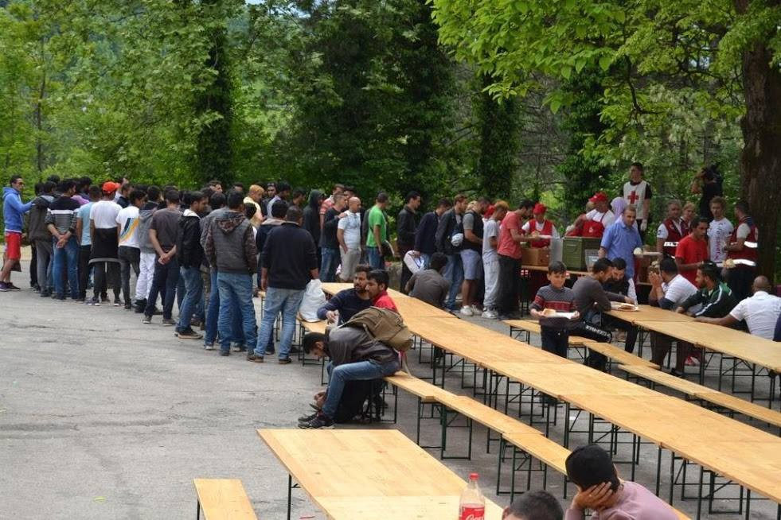
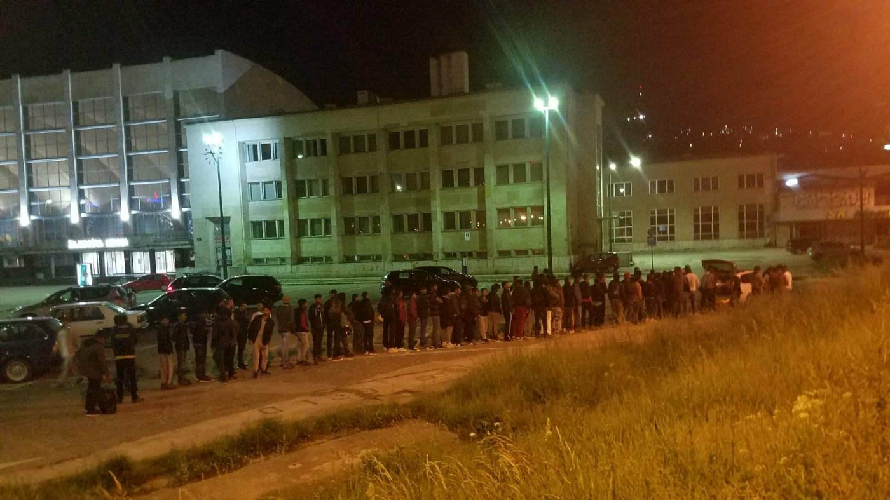
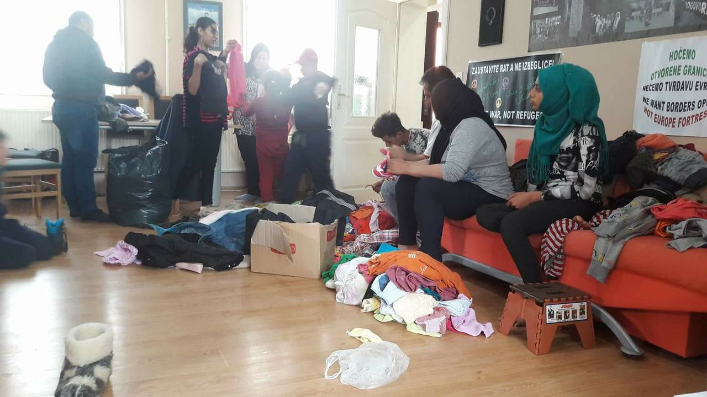
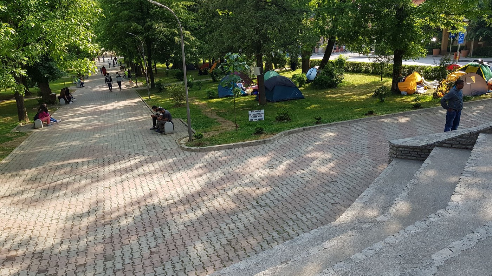
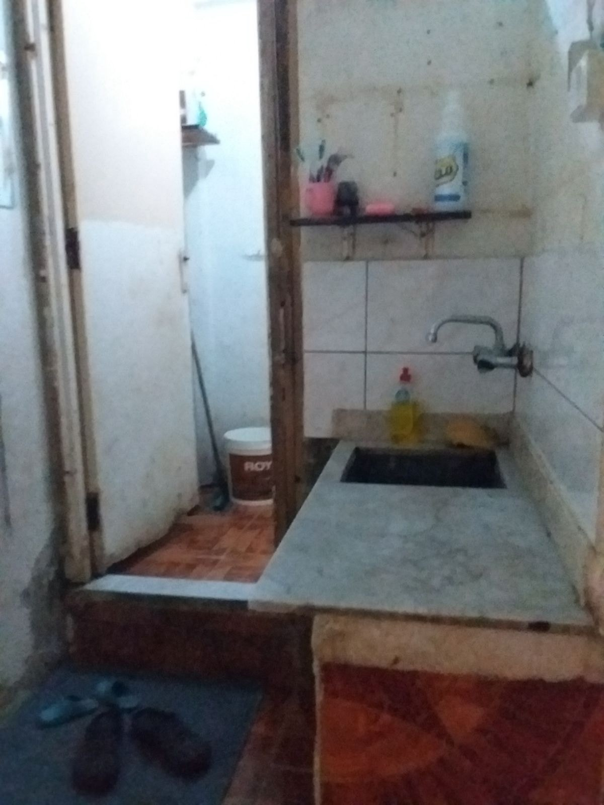
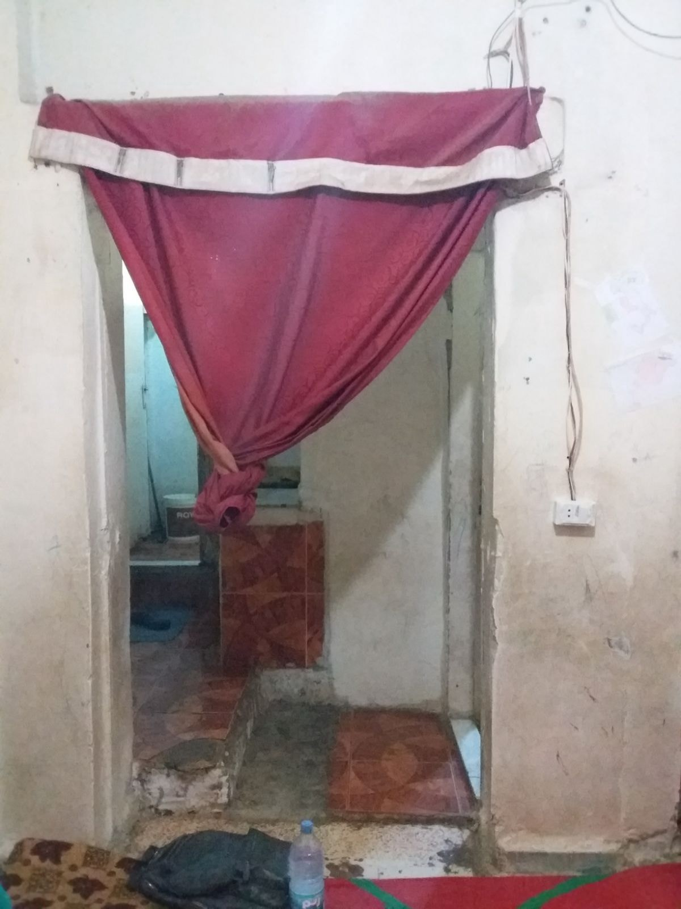
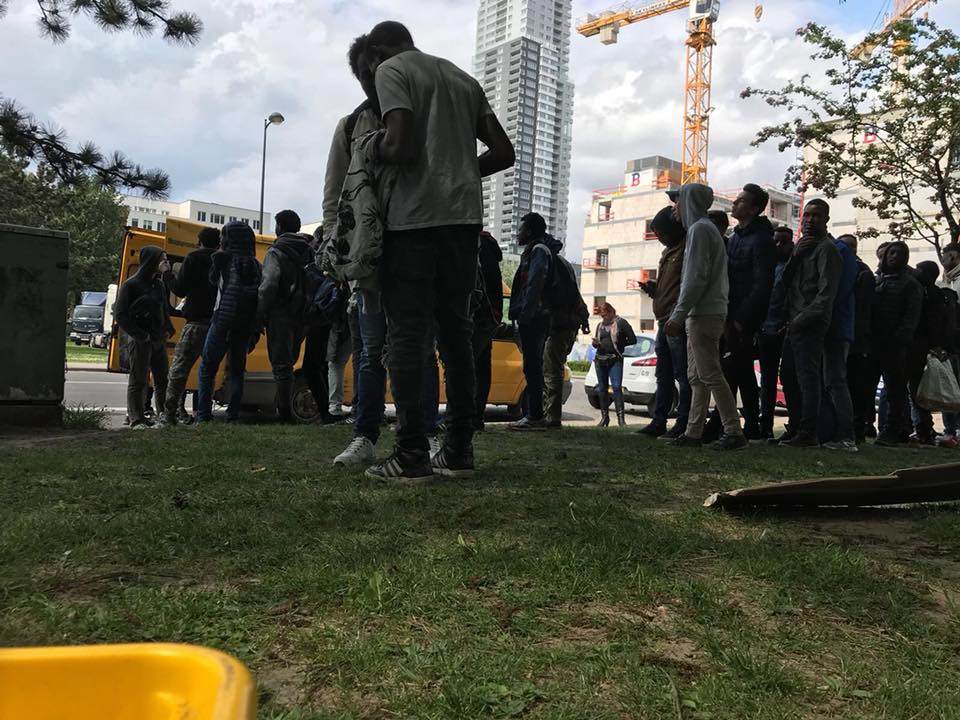
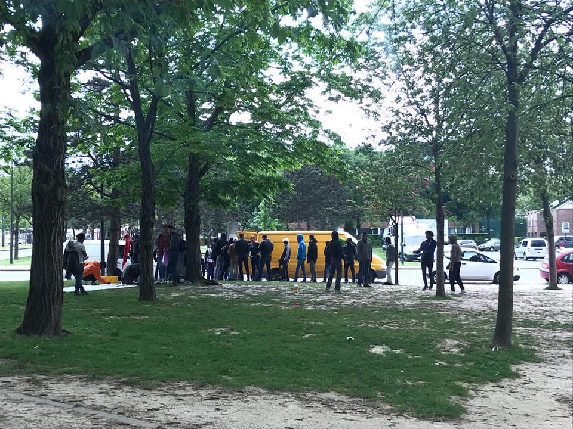
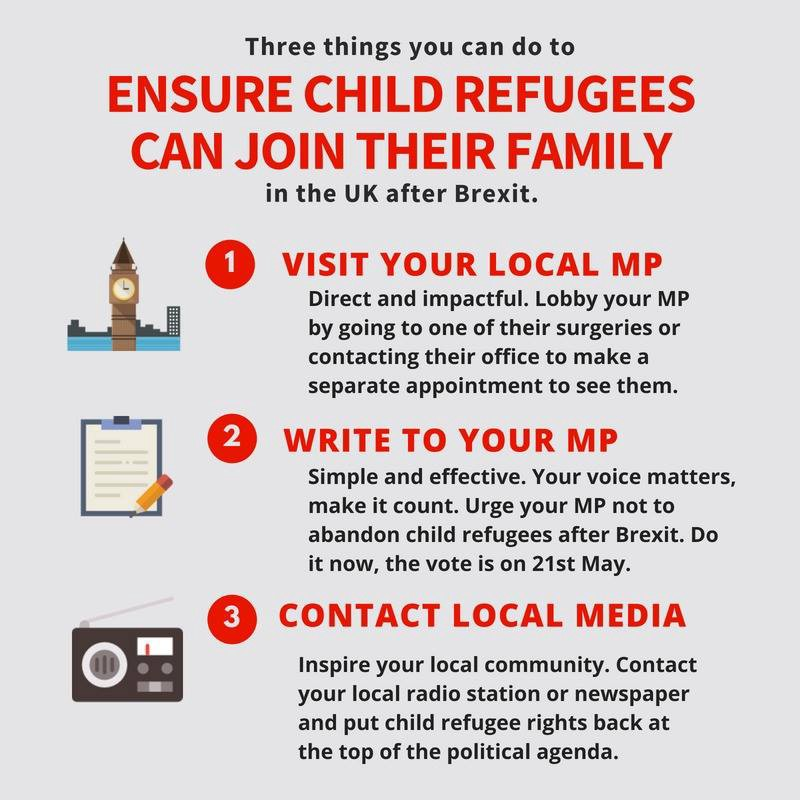

### AYS Daily Digest 11/05/18: More than 3,000 people came to Bosnia since January

_Albania, Montenegro, and Bosnia and Herzegovina new routes // Most of the people coming to Greece over the river Evros are Kurds from Afrin region // Deaths and injuries by borders at the EU borders // Help needed in Belgium and France // Call for action in the UK // And more news…_

Bihać and Sarajevo\. Over 3000 people arrived to Bosnia this year\. Photo Red Cross Bihac and AYS\.
### FEATURE

On Friday evening, over 200 people came for the food distribution at the train station in Sarajevo\. In the afternoon of the same day, over 250 were in the food line in the city centre\. Many of them are sleeping in the parks in Sarajevo, while hundreds found accommodation with locals in their houses, and also in hostels and hotels\. More people are coming every day\.

On the way to Bosnia from Greece, people pass through Albania, where they are rarely registered by authorities\. From Albania they move towards Montenegro\. Small, local feminist activist organization [Bona Fide](https://www.facebook.com/bonafide.pljevlja/?ref=br_rs) , in Pljevlja, Montenegro, provides support to those who are travelling\. This local initiative started helping people who were crossing through the city in February this year\.

“We noticed a group of young men one evening, and after we approached them we learned that they are coming from Syria, over Turkey, Greece, and Albania,” Sabina Talović from Bona Fide told AYS\.

Photo by Bona Fide

“We gave them food, clothes, shoes, medical help and place to stay, in our little centre\. Next day they left, but another group came\. So far this year we had 389 people, including many families\. And only local people are helping so far,” Tanović told us, adding that they need help\. “We do not have enough food, diapers, hygiene, but we are OK for the clothes since local people are coming and bringing\. We give everything we can, but we are tired and alone in this\. The state is doing the absolute minimal, and there is no any kind of help but from local population which is not enough\.”

Visit their Facebook page if you can help\.

According to the official figures, over 600 people entered Montenegro this year, a significant increase in comparison with 2017 when 849 people were registered during the whole year\. Hardly anybody has been granted asylum in Montenegro since 2015\.

The other route for people to enter Bosnia is from Serbia\. Some of the new arrivals are coming from camps in that country, but many are arriving after passing through Bulgaria\.

The official figure for Bosnia is over 3,500 registered asylum\-seekers since the beginning of this year\. Authorities are saying that, on average, between 80 and 120 people enter the country each day\. However, the state provides a mere 150 places in the only asylum centre, near Sarajevo\. The local population, UNHCR, and IOM are providing hostel accommodation for those they categorize as the most vulnerable\. The others are simply left to sleep in the street and in parks all over the country\.

Park in Velika Kladuša\. Photo AYS\.

In Velika Kladuša and Bihać, the border area with Croatia, there are currently about 800 people, local authorities claim\. The mayor of Bihać is calling for solidarity and decided to use reserves from the city budget to provide for the basic needs of people who are arriving\. He also called on the Red Cross and local NGOs to get involved\. The mayor acted after groups of women started helping people on the move who were in the city\.

Over the last couple of weeks, the city has turned several empty buildings into temporary accommodation for people on the move\. On Friday in Bihać, lunch was served at one of these locations for over 160 people\. In Velika Kladuša, on the same day, over 400 people were served by the local solidarity group in one restaurant\.

Police in Bosnia are still relatively friendly towards people who are coming\. After some media openly engaged in hate mongering towards newcomers, accusing them of criminal activities, the police came out with the report saying that since the beginning of this year, only five acts of violation of public order committed by migrants and refugees were registered, while in the Bihać area police issued nine warrants against migrants and refugees, but mostly for petty crimes and public disorder\.
### LEBANON

In the outskirts of Beirut, according to the [Mediterranean Hope](https://www.facebook.com/permalink.php?story_fbid=831684070354001&id=252231521632595) group, there are people who are waiting to be part of the program for relocation to Italy via the humanitarian corridor, currently accommodated in crumbling buildings, with no windows, in high humidity\.

](assets/67ea45ec12d7/1*9cGQr5YB-h4sm1zZfQdQ_w.jpeg)

Photo by [Mediterranean hope](https://www.facebook.com/permalink.php?story_fbid=831684070354001&id=252231521632595)
### GREECE

At 6:51am on Friday, a boat by [Refugee Rescue/‘Mo Chara’](https://www.facebook.com/RefugeeRescueUK/photos/a.1209475672453214.1073741828.1206400986094016/1708544962546280/?type=3&theater&notif_t=notify_me_page&notif_id=1526059326352440) rescued a dinghy with 26 people on board spotted by Lighthouse Relief spotters two nautical miles off Korakas\.

However, most of the people arriving in Greece are now coming over the river Evros, which forms the land border with Turkey\. Local police offices, which spoke with the [Kathimerini](http://www.ekathimerini.com/228417/interactive/ekathimerini/special-report/evros-dawn-at-the-gateway-to-europe) on the condition of anonymity, said that some 90 percent of the new arrivals in this region are refugees and Kurds from the Afrin region of Syria\. Some of the people on the move told journalists that they paid 15,000 Euro to smugglers to cross from Turkey\.

From this region, people continue towards Athens and Thessaloniki, many hoping to soon continue their journey, going to Albania, Montenegro, Bosnia, and hoping to continue towards the EU\.

The Minister of Migration Policy, Dimitris Vitsas, and the representative of the local government in the Patras region [met to discuss](https://left.gr/.../dim-vitsas-stohos-i-tahyteri-ekkenosi..) the situation with asylum\-seekers in the area\. The government is planning to evacuate the port of Patras, and 270 people have already been transferred to hosting facilities\.

The trial for the Moria 10 group was postponed on Friday to May 16th\. The trial is against a group of asylum\-seekers who participated in protests on Lesvos\. All of them are refugees from Syria who were forced for several months to live in inhumane conditions in the Moria camp\.

The Greek Asylum Service has announced that on Sunday, May 13th, the Regional Asylum Office of Athens will be opened to issue residence permits and travel documents that are ready for delivery to Arabic\- and Farsi\-speaking beneficiaries of international protection\. Please only go there if your case number is on the lists for ready residence permits and travel documents and if the Regional Asylum Office of Athens is responsible for your application\.

[Here](http://asylo.gov.gr/en/?page_id=1292) you can find the lists for ready residence permits and [here](http://asylo.gov.gr/en/?page_id=1289) you can find the list of travel documents that are ready for delivery\.

If your case number is on the list, please be at the Regional Asylum Office on Sunday at 7:30am at the latest\.

You can find the Asylum Service’s announcement here\.
### SERBIA

UNHCR and their partners in Serbia observed 949 new arrivals this year, of which 48 percent arrived from Macedonia, 28 percent from Bulgaria, 19 percent by air, and five percent from other directions\. Most of the new arrivals are people from Pakistan, Iran, Afghanistan, Iraq, and Syria\.

People are still trying to cross from Serbia to Croatia in the area of Šid\. Unfortunately, many are getting hurt on this route\. In March, two people were killed when walking on the Belgrade\-Šid highway, while in February, eleven men had to be hospitalized with severe symptoms of poisoning from pesticide fumes inhaled in cargo train wagons which they had entered in an attempt to enter Croatia\.
### AUSTRIA

UNHCR published its legal analysis on the draft amendments to the asylum law in Austria expressing concern about several proposed new regulations\.

One of the issues for concern is the proposal for the seizure of cash, if new arrivals are carrying more than 120 Euro with themselves, and electronic devices from asylum\-seekers\. Another issue is the prolonged waiting period for refugees before they are able to apply for Austrian citizenship\.

See the UNHCR [legal analysis](http://www.unhcr.org/dach/wp-content/uploads/sites/27/2018/05/AT_UNHCR_FrAEG_2018.pdf) \.
### BELGIUM

[The](https://www.facebook.com/care4calais/) Care4Calais team reports about the situation in Brussels in Maximilian Park\.

> “We wandered around the park in our Care4Calais vests, chatting to different groups, explaining that we had brought hoodies, fleeces and packs with t\-shirts, socks and toothpaste kits, flapjacks \(all homemade with love\) and bananas\. Everyone was delighted, especially with the bananas\! Every single banana skin was put in the bin\.” 

#### Call for volunteers

[Volunteers needed](https://www.facebook.com/…/comm…/permalink/1732513740161562/) for serving breakfast at Gare du Nord in Bruxelles\.
#### Call for donations

[Belgium Kitchen](https://www.facebook.com/BelgiumKitchen/photos/a.622873397851425.1073741827.616888531783245/1032264066912354/?type=3) calls for donations\. They distribute about 850 meals a day in Maximilian Park and the north station\. They are planning to continue with the distribution during the month of Ramadan\.

> “We are waiting for your donations in our premises avenue 2 in a forest\. You can drop them between 14 and 21 every day\. We cannot push the walls back and try to avoid all kinds of waste, which is why we ask you to bring only what is on the list\. Thank you for your involvement and understanding\.” 

### FRANCE

Another tragedy occurred in France where a woman’s body [was found](https://france3-regions.francetvinfo.fr/auvergne-rhone-alpes/isere/grenoble/autopsie-jeune-femme-noire-decouverte-durance-sera-realisee-grenoble-1473565.html) on Wednesday near Briançon\. It is believed that she drowned while trying to escape a police blockade in the Alps\.

> “That woman was one of the dozens of migrants who every day try to go to France to continue their lives\. To do that, she had to cross the snow, on foot, that imaginary line they call the border\. Because the means of transport, safe, were closed down due to the lack of documents and the racial control policy that they implement at the border\. Then she went down the road, those 17 miles that they have to walk on foot to reach the city\. It is along that stretch that must be jammed in a police block, as is often told by rejected people\. Probably the group of people she was with, that as you tried to cross the border, went missing at the police sight or gendarmerie looking for undesirables to catch and return to Italy, in the usual goose game that this time killed\. 

This nameless woman must have slipped into the river while trying to escape and hide\. she was killed by border controls\. The autopsy will be held in Grenoble on Monday, and only then will it be possible to have more details on the cause of death\.

The border separates and kills\.

Let’s not forget who’s responsible\.”
#### Call for donations

[La cuisine des migrants](https://www.facebook.com/groups/FASTCalais/permalink/2089891711290668/) needs your help\. The group distributes 300 meals from Monday to Friday\. See their needs list on Facebook\.
### SWEDEN

The UN Committee on the Elimination of Racial Discrimination \(CERD\) on Friday issued a report expressing concerns over the level of racism in Sweden\.
The report pointed to “racist hate speech against Afro\-Swedes, Jews, Muslims and Roma,” a problem that the committee said is particularly prevalent “during election campaigns, as well as in the media and on the internet\.” 
 
The report also pointed to the “stereotypical representation of Muslims in the media, and by politicians\.”
 
“The Committee is concerned at the presence of racist and extremist organizations in the State party, and their public demonstrations,” it stated\. The report further chastised Sweden for not investigating crimes by neo\-Nazi groups as terrorism\. 
 
The full report is available [here](http://tbinternet.ohchr.org/Treaties/CERD/Shared%20Documents/SWE/INT_CERD_COC_SWE_31204_E.pdf) \.
### UK

Help Refugees is pointing out another parliament debate on child refugees that will be held on May 21st\. MPs will vote on whether to allow child refugees to join their family in the UK after Brexit\.

The amendment, proposed by Lord Dubs, passed the House of Lords and now it is necessary to pass another step at the House of Commons\.

“Take action\. These three simple steps will make sure your MP gets our message\.”

**We strive to echo correct news from the ground through collaboration and fairness\.**

**Every effort has been made to credit organizations and individuals with regard to the supply of information, video, and photo material \(in cases where the source wanted to be accredited\) \. Please notify us regarding corrections\.**

**If there’s anything you want to share or comment, contact us through Facebook or write to: areyousyrious@gmail\.com**

_Converted [Medium Post](https://medium.com/are-you-syrious/ays-daily-digest-11-05-2018-more-than-3-000-people-came-to-bosnia-since-january-67ea45ec12d7) by [ZMediumToMarkdown](https://github.com/ZhgChgLi/ZMediumToMarkdown)._
