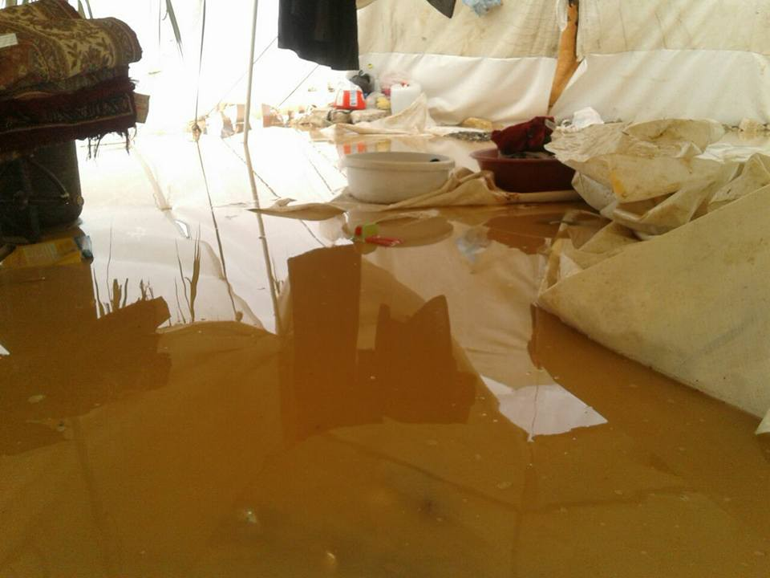
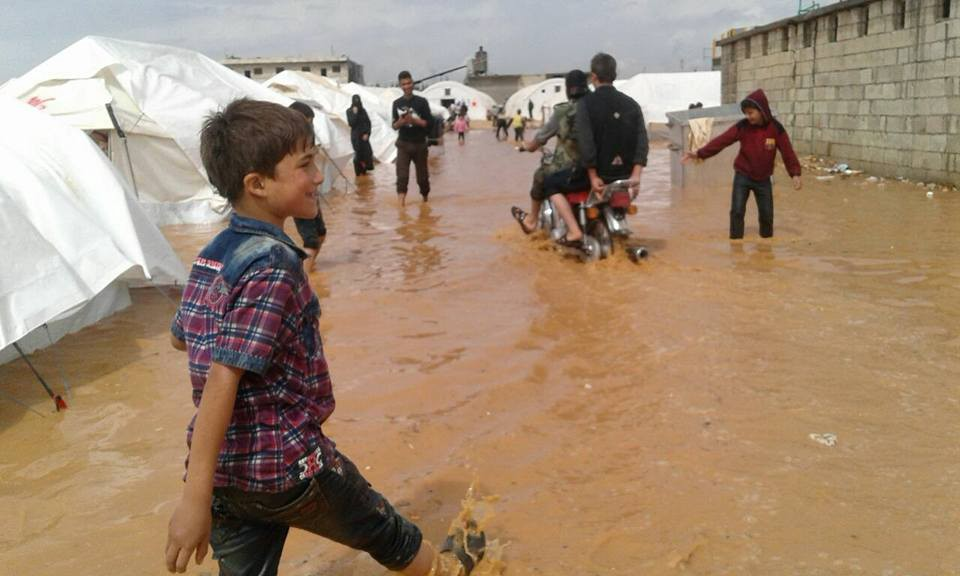
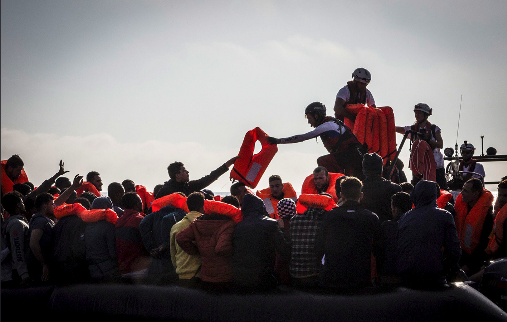
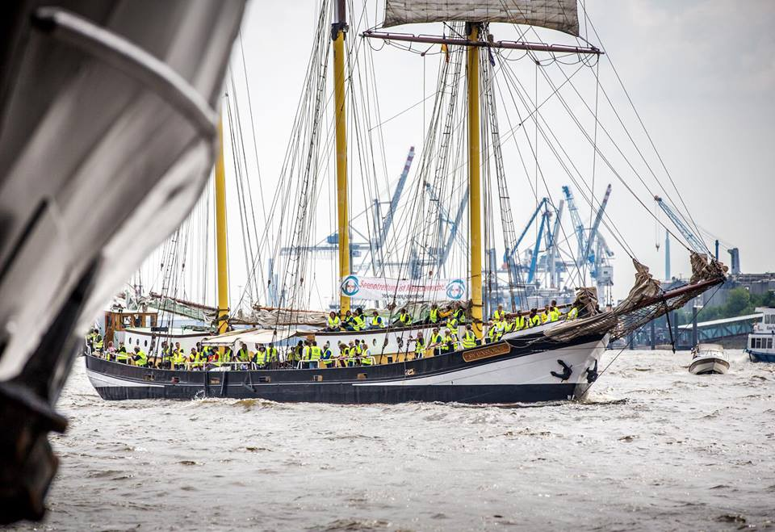

### AYS Daily Digest 12/05/2018: Ireland introduces new family reunification scheme

_530 refugee family members will be brought to Ireland under new scheme// Many rescues at Sea//News from Syria// 24 hour metro strike in Athens this Monday//News from Greece// Red cross call out for volunteers in Bosnia// Theatre Show in Hungary// News from Italy//Protest in support of Sea\-Eye in Germany// News from France//News from UK_

 makeshift camp at Lesvos island\.
Photograph by Ayhan Mehmet](assets/5c6fc70ed393/1*3wYkiCIaSN1ycLzc832UtQ.jpeg)

A Syrian refugee at [\#Moria](https://www.facebook.com/hashtag/moria) makeshift camp at Lesvos island\.
Photograph by Ayhan Mehmet
### Feature:

**_Ireland has introduced a new Family Reunification scheme to allow family members to be brought to Ireland\._**

Refugees in Ireland can [begin applications on Monday to bring immediate family members to the country\.](https://www.irishtimes.com/news/social-affairs/refugee-reunification-scheme-opens-to-bring-family-members-to-ireland-1.3492313) **This scheme will allow up to 530 refugee family members to be brought to Ireland\.**

In 2014, Irland introduced a similar scheme ‘Syrian Humanitarian Admission programme’ which enabled Syrians already living in Ireland to sponsor vulnerable family members to come live with them\.

This new scheme is available to refugees from the following countries: **Syria, Afghanistan, South Sudan, Somalia, Sudan, the Democratic Republic of Congo, Central African Republic, Eritrea and Burundi\.**

We warn that priority is intended to be given to people who are able to provide accommodation for their family members due to the high demand on limited housing supplies in Ireland\.
### Syria:
#### Suffering continues for displaced from Ghota

[Ghouta reports](https://www.facebook.com/ActForGhouta/photos/pcb.1950844458281390/1950834284949074/?type=3&ifg=1) that even beyond the siege, immense suffering continues for Ghouta civilians that have been displaced and are currently living in temporary camps\.

> The people of Southern Damascus stayed on the side of the road for almost five days before their convoy was given “permission” to enter the area, it seems like the pain of leaving your hometown and everything you held dear behind isn’t enough, you have to spend five days practically living in a bus on the side of the road, or replace your house with a tent that doesn’t shelter you nearly enough from the weather 

Source: Ghouta Facebook Page
### Sea:
#### 19 people rescued by the Sea\-Eye

After a call from MRCC Rome, At 5\.30 am, the sea fox rescued 19 people\. They were instructed to bring the refugees to Trapani in Italy\. The ship is expected to reach the destination on Monday\.
#### 73 people rescued by Aquarius in International waters off coast of Libya

Source: Anthony Jean/ SOS Mediterranee

The Aquarius Search and Rescue team saved 73 people form a deflating rubber boat in distress\. MSF staff attended to survivors on board the vessel\.

■■■■■■■■■■■■■■ 
> **[MSF Sea](https://twitter.com/MSF_Sea) @ Twitter Says:** 

> > BREAKING: This morning the #Aquarius has rescued 73 men, women and children from a rubber boat in distress in international waters off of #Libya. Everyone is safely onboard and we are back on patrol. Photo: Anthony Jean https://t.co/70JWjpZQXt 

> **Tweeted at [2018-05-12 08:19:04](https://twitter.com/msf_sea/status/995216778270855168).** 

■■■■■■■■■■■■■■ 

■■■■■■■■■■■■■■ 
> **[SOS MEDITERRANEE](https://twitter.com/SOSMedIntl) @ Twitter Says:** 

> > UPDATE our search and rescue team saved 73 people from a deflating rubber boat earlier today. We are now looking for other boats in distress. Photos: Anthony Jean / SOS Mediterranee https://t.co/QAQ0NYQkEe 

> **Tweeted at [2018-05-12 12:47:15](https://twitter.com/sosmedintl/status/995284267814006787).** 

■■■■■■■■■■■■■■ 

■■■■■■■■■■■■■■ 
> **[MSF Sea](https://twitter.com/MSF_Sea) @ Twitter Says:** 

> > UPDATE: The team onboard the #Aquarius welcomes everyone just rescued out on the deck, while the #MSF medical staff is busy seeing people in the clinic. Photos: Anthony Jean https://t.co/pkb83mvguG 

> **Tweeted at [2018-05-12 09:55:38](https://twitter.com/msf_sea/status/995241079682236416).** 

■■■■■■■■■■■■■■ 

#### 95 people rescued by Salvamento Maritimo near coast of Lampedusa

95 people were rescued off Lampedusa yesterday by the ICG and later moved to the English boat Protector with destination Pozzallo \(Ragusa\) \. Probably Tunisians\. In the centre in Lampedusa the number of people hosted is already over 100\. This is the second rescue within a few days where people have not been disembarked in Lampedusa, but instead accompanied with other boats to Sicily\.
### The EU
#### EU asylum agency in chaos after allegations of ‘psychological violence’

[According to allegations](https://www.politico.eu/article/eu-asylum-agency-in-disarray-amid-alleged-psychological-violence-jose-carreira-olaf/) in internal documents seen by POLITICO, staff harassment, the use of psychological violence and a culture of irresponsibility are all prevalent management tools within the EU asylum agency\.

The evidence found portrays a picture of an institution that is in a deep crisis, with multiple experienced staff forced to leave at the Malta\-based European Asylum Support Office\.

This is especially concerning as the agency is critical to the EU’s migration response\. It provides operational support and technical guidance to member countries managing the arrival and processing of refugees\. Especially Italy and Greece that have experienced the highest numbers of arrivals\.

POLITICO reported earlier this year that an investigation of the Portuguese executive director, José Carreira by the bloc’s anti\-fraud office is already underway\. José Carreira denies these allegations as well as the new ones that have been made\.

> “I deny all of the allegations made in the emails and emphasize that OLAF’s investigation is ongoing for over eight months, no accusations against any particular staff have been made or preliminary measures been requested or actioned to date\.” — José Carreira 

Since 2015 the acencies budget has increased from €15\.5 million in 2015 to €69 million in 2017\.

> The former HR head alleged that people who spoke up about problems at the agency had been subjected to a range of intimidatory tactics, including “spying on them, spreading false rumors, fabricating files, extorting false testimonies \[and\] paying lawyers to sue staff members\.” 

### Greece:
#### \* \* \*There will be a 24 hour metro strike in Athens this Monday the 14th of May\* \* \*
#### Lifting Hands International are in need of female volunteers:

> Lifting Hands International has an URGENT NEED for volunteers to engage with women in their WOMENS SPACE in Serres, Northern Greece, serving over 400 yazidis asylum seekers/ refugees\. 

> The space offers various activities such as Salon Sundays, Sewing Saturdays, etc\., and we need volunteers to join us ASAP in order to continue offering these services\. 

> Minimum Time Commitment: 14 days
 

> Please contact us for more information if this opportunity inspires you\! 

To find out more please [follow this link](https://www.facebook.com/groups/infopointfornortherngreecevolunteers/permalink/626304197715877/?hc_location=ufi) \.
#### Financial support needed for the solidarity campaign for 10 of the Moria 35 being trialed on Chios

[10 of the persecuted Moria 35 had a trial on Chios today\.](http://musaferat.espivblogs.net/en/2018/05/11/diakopi_tis_dikis_twn_10/) Out of the 10 persecuted, only 2 appeared on trial\. The trial was paused before it really had time to begin\. It will be continued on **Wednesday May 16 at 11\.00** \.

Having the trial on Chios as opposed to Lesvos where all the defendants and witnesses reside has meant that the need for continuous travel and accommodation has created major financial difficulties for the parties involved\. This has made it extremely difficult for the presence of solidarity and some witnesses at the trial\.

> There is a need for financial support for the solidarity campaign to ensure that the state’s attempt to carry out these trials in isolation will not succeed\. 

**\#freethemoria35**
#### Things are difficult at the Centre for Refugees at Elefsina

Currently there are 220 people \(78 children\) at the centre\. They have been there since April, within a building that is in the middle of nowhere underneath a National Highway\. In the earlier times, a solidarity network of various actors was set up that was able to provide for the basic needs\. It is however becoming difficult to meet all the needs of the people living there\.

Among the individuals there are a number of vulnerable cases as well as several pregnant women and some women ready to give birth\. None of the 78 children go to school\.

9 families have been moved by UNHCR to apartments\.

Informal news among refugees were that the rest will also be moved immediately, but other information and reports say that new arrivals are expected next week in the camp\.

> With closed borders and our country converted to a human warehouse of souls, we denounce all these approaches and decisions that have brought these people to such an inhumane position\. We demand the opening of the borders and the immediate coverage of their needs with the money given by the European Union for this purpose and ultimately do not reach their destination to cover even the basic needs of these people\. 

> We stand beside them and we become their voice in order to highlight the problem\. Solidarity is the power of people — Solidarians from Elefsina 5/12/18: 

### Bosnia:
#### Red Cross Bihać calls for volunteers to join their team in Bosnia

Everyone who is over 18 can apply at the Red Cross offices on weekdays from 10:00 till 13:00h\. For more info people can send an email to bihac@ckfbih\.ba or contact Red Cross Bihać trough a private message on their [facebook page\.](https://www.facebook.com/CrveniKrizBihac)
### Italy:
#### Many types of physical donations are needed in Rome according to Baobab

If you are able to help the group asks you to please report donations to email baobabexperience@gmail\.com to agree on days and mode for delivery of goods\.

To find out more please [follow this link](https://www.facebook.com/BaobabExperience/photos/a.855775474499206.1073741829.840615826015171/1671685256241553/?type=3&theater) \.
### Hungary:

A Theatre project by refugees about the balkan route is happening on the 25th May in Hungary\.

> We would like to invite you to spend a night with the You are Welcome project\. 

The program is free, but you need to register\. To register please [follow this link\.](https://goo.gl/forms/c2MDsid9CIQhZca22")
### France:
#### [DTC — Defend your citizenship](https://www.facebook.com/DefendsTaCitoyennete/) is in need of food donations

They are starting a food collection\. To find out more about how you can help please [follow this link](https://www.facebook.com/HerrouCedric/photos/a.1777567782487779.1073741829.1707778992799992/1915735612004328/?type=3&theater&ifg=1)
### Germany:

80 Sea\-Eye activists protested on board the Swaensborgh in Hamburg today with the demand “Rescue is a human right”

They ask for your support with the important humanitarian work on the central Mediterranean\. To view their current campaign please [_follow this link_](http://sea-eye.betterplace.org.) _\._
### UK:
#### Calls to shutdown Yarlswood Immigration Removal Centre

Movement of Justice warns that the centre is dehumanising and that everyone is treated as a liar by the staff\. ‘The better ones leave or become whisleblowers’

■■■■■■■■■■■■■■ 
> **[Here to Stay UK](https://twitter.com/HeretoStayUK) @ Twitter Says:** 

> > Visited with woman in #Yarlswood who reported mental health nurse response to her wanting to die rather than being deported was “you’re an adult, if you feel that’s the best option for you that’s ok” #ShutDownYarlsWood #EndDetention #Hungerforfreedom 

> **Tweeted at [2018-05-11 10:53:45](https://twitter.com/followmfj/status/994893317749035008).** 

■■■■■■■■■■■■■■ 

> **We strive to echo correct news from the ground through collaboration and fairness\.** 

> **If there’s anything you want to share or comment, contact us through Facebook or write to: areyousyrious@gmail\.com** 

_Converted [Medium Post](https://medium.com/are-you-syrious/ays-daily-digest-12-05-2018-ireland-introduces-new-family-reunification-scheme-5c6fc70ed393) by [ZMediumToMarkdown](https://github.com/ZhgChgLi/ZMediumToMarkdown)._
