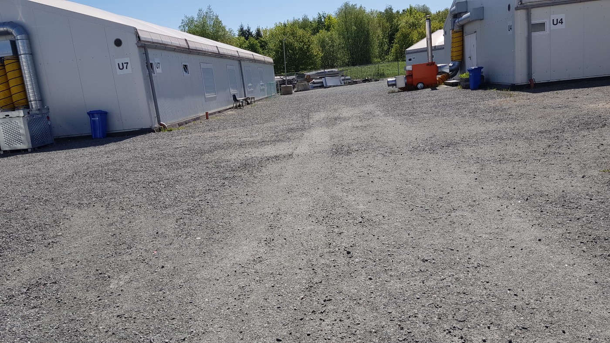
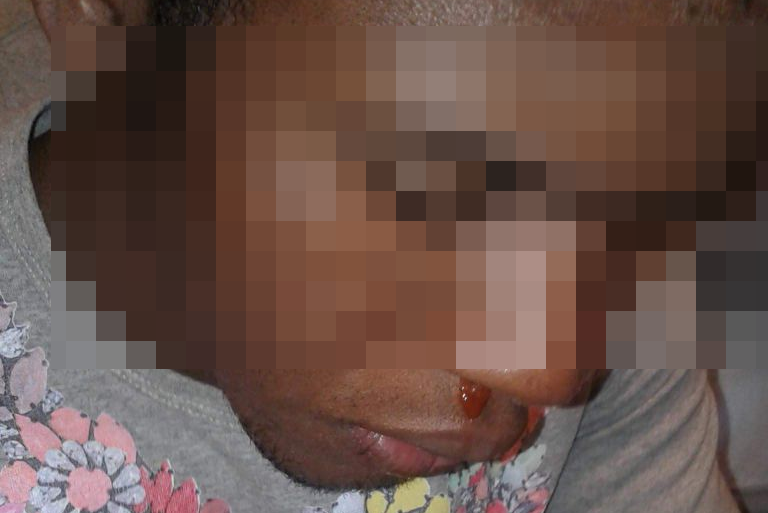
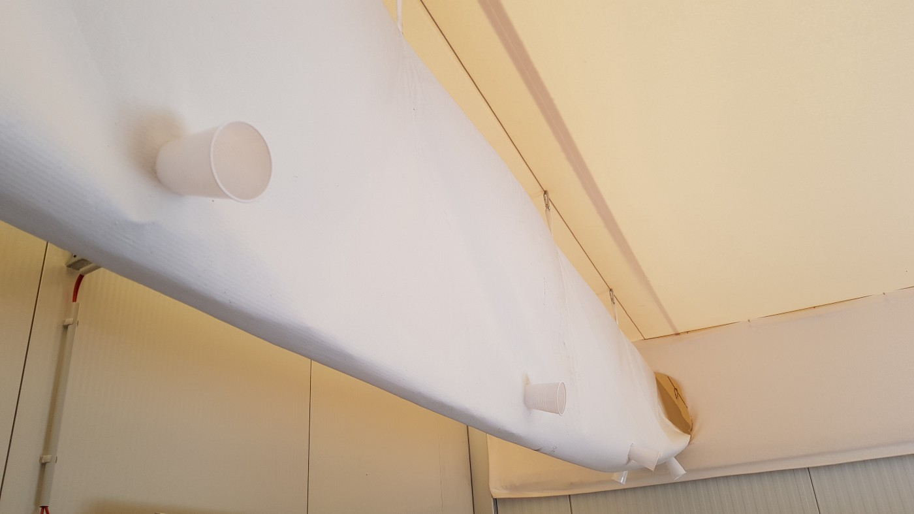
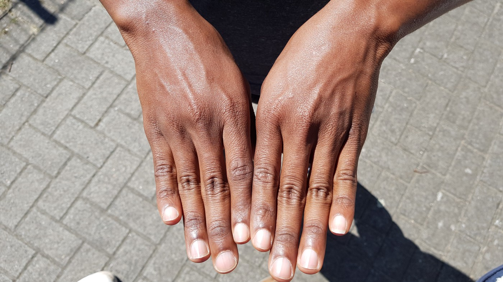

### AYS Special from Germany: Young people in Bremen pushed out of the system
#### _Mainly self\-confessed underaged people, who are objecting the decision of the youth service that they are adults, live in the last tent camp of Bremen\. Local volunteers denounce it as punishment for the appeal and want to take action together with the camp residents to close the site\._

_The camp at Gottlieb\-Daimler\-Straße — the last tent camp in Bremen\. Credits: AYS_

The air in the room is dry, but after a few minutes everyone starts sweating\. Even though the temperatures are not too warm outside, around 20 degrees, it feels much warmer inside the rooms of the camp at Gottlieb\-Daimler\-Straße in Bremen\. It is the last tent camp of Bremen and mainly accommodates people from African countries, who are objecting to the youth service’s decision that they are not minors\.

The camp is located in the north of the city, some ten kilometers from the main station\. But as it is located in an industrial district, there are few possibilities for daily activities or ways to get in touch with locals\. The camp itself was once an emergency reception center\. When all of them closed down, it was turned into a first reception center and is now run by Innere Mission\.

When Koroma woke up a few weeks ago, he was shocked because his nose was bleeding\. His real name is not Koroma but he does not want it to be known because he fears further repressions\. He and the approximately 90 other camp residents say they suffer from the bad conditions in the camp\.

“Everybody bleeds from the nose in the morning because of the heater\. It is run with gas,“ he explains\. While it has happened to him only three times over the last few months, some of his friends have had this problem more often, especially in the winter months, when the temperatures were milder but still dry\.

Bleeding noses are one of the biggest problems the camp residents have\.

At night, the noisy heater is left turned on\. To avoid the dry air coming inside the room, the residents put plastic cups into the holes\. The success of this measure is limited\. The walls of the rooms are not solid and don’t reach all the way to the ceiling\. The dry air still circulates through all the rooms\. The gap at the top of the walls cause another struggle for the residents — they hear all noise and everything that happens in their neighbours’ rooms\. Four people share each room and private space is very limited\.

“To me, this is not a camp, it is like a prison\. But we did not commit any crime,“ another resident says\.

With plastic cups the residents try to keep the warm, dry air out of their rooms\.

The residents further complain about the medical care\.

„All doctors send us to the next one,“ Koroma says\.

The legal situation leaves them in a limbo, and it is hard to find medical treatment\. Even though they get a health insurance at AOK, they only get treated for acute illnesses on the terms of the Benefits for Asylum Seekers Act\. Hence, some treatments are excluded\. During this time of their objection they are being treated as adults\. This means that they can get neither access to school nor can they make use of any services that recognized minors benefit from\.

The whole procedure of estimating the age of a young person is controversial\.

„There is no official way to estimate the real age,“ a legal consultant, supporting the residents of Gottlieb\-Daimler\-Straße, explains, adding that it is absurd\. The methods used are criticized as inaccurate\. Reasons for refusing the applicant to be minors are for example big hands, beard growth, folds on the forehead, either a too self\-confident or too nervous behaviour\. But „more and more people are forced to do the medical tests“\.

Koroma, who says he is 17 years old, was estimated to be 25 by the youth service\. „I cried,“ he remembers the decision, adding: „It does not matter what you say\. They will decide about your age\. Then they tell you to sign something and you will get schooling and accommodation\.“ This document is in effect an agreement with the decision that they are not a minor\. „If you sign it, you cannot do anything against it anymore\.“

Minor or not? One of the tests is to look at the fingertips to estimate the age\.

Another resident even has a birth certificate from his country of origin, confirming him to be born in 2001\. Yet the youth service insists that he was born in 1995\. He already was in a hostel for minors for three months, until they sent him back to Gottlieb\-Daimler\-Straße\.

Furthermore, the majority of the rejected applicants get the fictive date of birth of 31\.12\.1995\. In consequence, they are also being denied services and support, which young adults until the age of 21 benefit from\.

To appeal the decision of the youth service the people need legal support\. During the time of the trial — in some cases twelve months and more — they have to stay at the camp in Gottlieb\-Daimler\-Straße\. Supporters criticize this step as a punishment for objecting the authorities‘ decision\.

The left\-wing party „Die Linke“ requested in the city parliament recently to close the camp and transfer the residents to a more appropriate place\. During the last few months several shelters were closed and the spaces are now available\. Nevertheless in the parliamentary debate it became clear that the government does not want to take such a measure\. As the people „object the decision, so they have to live there\. If they accept the age the authorities gave them, they can leave the camp immediately,“ was the summary given by the legal consultant of this decision\.

Accepting the decision of the youth service or receiving a negative decision at the court is usually connected with the transfer to another camp\. From time to time the police come to the camp and take some people with them\.

„It is a forced transfer\. We have no idea where they will go,“ says Omar, another resident of the camp\. Previous cases showed that usually the people are deported to Spain or Italy under the Dublin agreement at a later date\. The legal consultant adds, that usually the transfers are usually not conducted by the police, although it happens sometimes, but the youth service shortens social benefits: This means, they cannot go into the camp again, because their card is blocked\. They do not have food, a place to sleep or welfare benefits anymore\.

“This is the way, to force them to accept the answer,” the legal consultant explains\.
#### A new alliance

Some of the camp residents also suffer from mental health problems like post\-traumatic stress disorders\. They say they lost their parents in their country of origin or on their way to Europe, for example in Libya\. They show footage of their journey, how they lived in tents under the trees during their journey\.

„If I have the facilities and someone to help me in Africa, I do not need to leave,“ Koroma says\. His intention was to find a better life in Europe after having no perspective and no education in his country of origin\.

„I explained everything,“ to the youth service, he recalls, „but they said a young man cannot have the idea to come to Germany,“ denying his status as a minor and subsequent support\.

Local supporters, as well as the Refugee Council Bremen and other solidarity groups, demand to close the camp and transfer the residents to a more appropriate place\. In an outstanding act they formed an alliance with the residents to take action\. They are planning actions to raise awareness of the situation of these young people — many locals do not even know about the camp\.

Together with the camp residents, they are now working on steps to increase the pressure at the politicians\.

„We want Bremen to accept our ages,“ Omar says\. Another resident adds: „It is like we are not in the system\. There are basic needs in life that we have no access to\.“ On 15th May 2018 at 5pm the first demonstration is scheduled in the city\.

The ones who receive a positive decision at court get a transfer to a shelter for unaccompanied minors and access to all services\. At a solidarity meeting one said „our demand is: let us be normal people\. Treat us like all the others,“ and was met with applause of the other residents there\.

**_\(Written by Niklas Golitschek, AYS volunteer\)_**

**We strive to echo correct news from the ground through collaboration and fairness\.**

**Every effort has been made to credit organizations and individuals with regard to the supply of information, video, and photo material \(in cases where the source wanted to be accredited\) \. Please notify us regarding corrections\.**

**If there’s anything you want to share or comment, contact us through Facebook or write to: areyousyrious@gmail\.com**

_Converted [Medium Post](https://medium.com/are-you-syrious/ays-special-from-germany-young-people-in-bremen-pushed-out-of-the-system-87c1fca35dc4) by [ZMediumToMarkdown](https://github.com/ZhgChgLi/ZMediumToMarkdown)._
