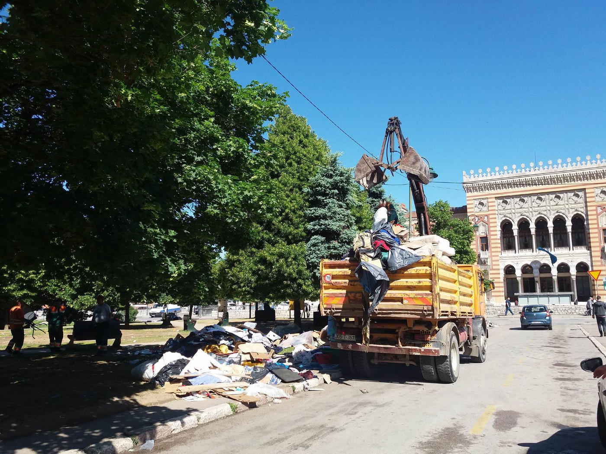
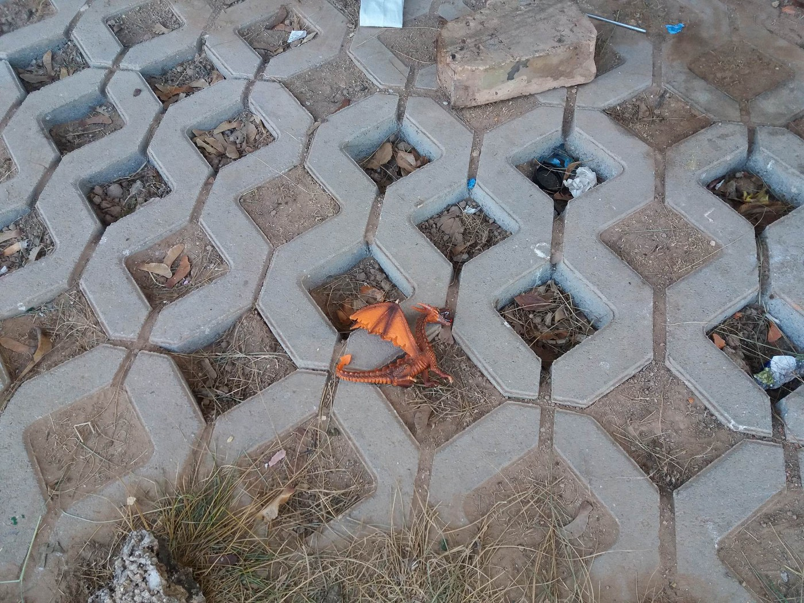
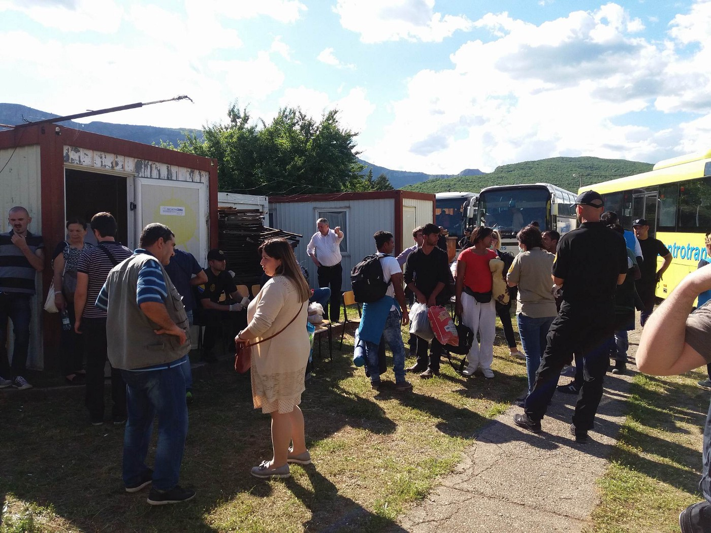

### AYS Daily Digest 18\.05\.18: Police Brutality at Patras Port

_Release of Proactiva Ship Upheld by Italian Court//Homelessness Crisis in Cyprus//New Arrivals on Aegean Islands//Help Needed In Thessaloniki//Evictions in Bosnia City Center//Deportations and Deaths along the Slovenian Border//Kidnappers charged in Spain//Germany rejects high number of family reunification cases//and mor_ e…

](assets/9441ab411811/1*YLPTPGuyxdsQFFMq3TYocg.jpeg)

“Patras, Greece 28 April 2018\. Police find refugees hidden in a lorry in the port of Patras, as they try to cross the borders and travel to Italy\. People continue to risk their lifes to cross the borders\.” Photo Credit: [Ayhan Mehmet](https://twitter.com/ayhanmehmettt)
### Feature

An NGO dedicated to the protection of refugees’ rights in Greece released a detailed report on police violence at the Patras Port\. The report was commissioned after one well document incident in which a minor was stabbed in the foot by a police officer\. As the Refugee Support Aegean \(RSA\) report reveals, this assault was not an isolated incident, but part of a long\-standing pattern of violence and abuse against refugees in Patras\.

Many refugees flock to Patras Port every day, trying to sneak themselves aboard ships heading for other destinations in Europe\. In response to this, local authorities have increased patrols of the port area and erected many barbed wire fences and barriers to prevent people from reaching the ships\. According to refugees and volunteer groups, violence against refugees is a daily occurance at the port\. 21 refugees who tried to smuggle themsleves out of the port were interviewed by RSA\. Every one of those interviewed reported facing beatings by the local police, coast guard officials, and private security workers at the port\.

Docmobile, volunteer group that provides medical assistance to refugees in Patras also gave a statemtent for the RSA report:

_“Over the past four weeks, we’ve treated over fifty patients who have been reportedly attacked by police, coast guard, truck drivers or the private security_ _service staff\. Among the injured are young adults as well as some minors\. The injuries were mostly lacerations, bruises and haematoma\. We also treated several dog bites and fractures\. Several patients could not be treated on the spot, but had to be transferred for further treatment to the hospital\.”_

The RSA report includes many testimonies from refugees in Patras, as well as disturbing images of injuries caused by police brutality\. You can see the entire report [here](http://rsaegean.org/violence-in-patras-port/) \.

■■■■■■■■■■■■■■ 
> **[RSA](https://twitter.com/rspaegean) @ Twitter Says:** 

> > @[rspaegean](https://twitter.com/rspaegean) research on  use of ill-treatment  by coastguard and private security at Patras port as a means of deterring irregular migration   [rsaegean.org/violence-in-pa…](http://rsaegean.org/violence-in-patras-port/) 

> **Tweeted at [2018-05-18 11:50:07](https://twitter.com/rspaegean/status/997444216266592256).** 

■■■■■■■■■■■■■■ 

### Sea

■■■■■■■■■■■■■■ 
> **[IOM - UN Migration 🇺🇳](https://twitter.com/UNmigration) @ Twitter Says:** 

> > 26,026 #migrants &amp; #refugees arrived by sea to Europe in 2018.

635 dead/missing. Learn more ➡️ [missingmigrants.iom.int](http://missingmigrants.iom.int) https://t.co/JkfrMmC9vV 

> **Tweeted at [2018-05-18 07:41:54](https://twitter.com/unmigration/status/997381751134736384).** 

■■■■■■■■■■■■■■ 

The Proactiva Open Arms sea rescue group announced it will begin using drones to aid their work in the Mediterranean\.
### Italy

The release of the Open Arms sea rescue ship was upheld by the court in Ragusa\. In a potentially important precedent, the court declared that the rescue group had not violated the law by refusing to hand over refugees to the Libyan Coast Guard \(LCG\), despite being called on to do so by Italian authorities\. The court’s basis for this ruling was that Libya is not a safe country\.

■■■■■■■■■■■■■■ 
> **[Judith Sunderland](https://twitter.com/sunderland_jude) @ Twitter Says:** 

> > Italian authorities should take note of this ruling, and take steps to ensure safe rescues in international waters with disembarkation in a safe place, i.e. not Libya. That means not enabling Libyan forces to intercept boats in int'l waters. [twitter.com/MSF_Sea/status…](https://twitter.com/MSF_Sea/status/997040935098712065) 

> **Tweeted at [2018-05-18 08:50:43](https://twitter.com/sunderland_jude/status/997399069269090304).** 

■■■■■■■■■■■■■■ 

### Cyprus

Most refugees in Cyprus are living in poverty and misery\. The existing asylum and reception centers are vastly unprepared to deal with the number of refugees in the country\. There is only one reception center in the country, and it is currently housing 265 people\. The reception center recently announced it will no longer take in single men\. There are an additional 130 children living in shelters in the country\. Every other refugee in Cyprus, estimated to be over 4,000 people, are forced to find their own accomodation\. The vast majority of them are currently homeless\.

The Cyprus Refugee Council released a statment on the appalling conditions for refugees in the country, demanding that the Cypriot government take immediate action: “We are deeply concerned with the decreasing ability of the reception system to accommodate the vital needs of asylum seekers in the country\. The implementation of highly restrictive policies in regards to the level of social assistance and the access to the labour market, combined with the absence of an effective monitoring and support mechanism, has led to an increased homelessness problem among vulnerable asylum seekers\.”
### Greece
#### Islands

Forwarding new arrivals updates from [Aegean Boat Report](https://www.facebook.com/AegeanBoatReport/?hc_ref=ARRsuiG1Hdm0x-kZxh5JDINiUOBU4UqnkeK_m5xlAezCkakehf1ySnb-_6d8PIpuAD4&fref=nf&hc_location=group) :

> As far as we know, three boats have arrived on the Greek islands so far this morning, carrying a total of 148 people\. 

> The first boat was picked up by British Frontex Valiant, outside Tarti, Lesvos south, 00\.30\. 45 people, no breakdown\. 

> Th second boat was also picked up by British Frontex Valiant, 01\.30, same area as the first one\. 55 people on board, no breakdown\. 

> Third boat was picked up north west of Samos, 08\.45, by the Hellenic Coast Gurad \(HCG\) \. HCG was alerted 08\.00 when the boats engine stopped working\. They were transported to the port of Samos\.
 

> 48 people on board, 12 children, 15 women, and 21 men\. 

#### Mainland

A [volunteer group in Thessaloniki](http://www.keeptalkinggreece.com/2018/05/18/thessaloniki-refugees-help-appeal/) is appealing for help as more and more refugees have been arriving to the city in recent months\. According to volunteers there, the majority of refugees arriving are families with underage children and elderly people\. The number of people coming to the city each day can be between a few dozen and two hundred\. According to a local solidarity group:

> Only very few of the hospitality centers set up by the government in the past two years are still working and they are certainly not enough to host all the arriving refugees\. The three centers around Thessaloniki are about 50 to 70 km away from the city and can only offer housing to the newly arrived\. 

> But since these facilities are already overcrowded, a lot of people have to stay in the streets\. In many places in Thessaloniki, families are forced to sleep on the sidewalks, without any support from the state\. 

You can contact local volunteers through phone or email — Tel: 0030 2310222503 — email: oikopolis\.social\.center@gmail\.com\. Or you can visit them in person at ΟΙΚΟΠΟΛΙΣ/ΕCOPOLIS, Ptolemeon 29a, 5th floor, Thessaloniki\. You can also contact them through their [facebook page](https://www.facebook.com/pg/oikopolis.social.center/posts/?ref=page_internal) \. More volunteers are needed in the city, as well as material donations and funds\. If you can hep in any way, please do\!

The Refugee Info outlet published some information on how to apply for your travel document if you are living in Greece\. The information is available in English, French, Arabic, Farsi, Kurmanji, and Amharic\. Click [here](https://www.refugee.info/greece/documents-in-greece--greece/travel-document/?language=en) to see\.

According to new statistics recently published by Eurostat, 12%, or around 1 in 8 refugees applying for asylum in Greece are unaccompanied minors\. Over 2,500 unaccompanied minors applied for asylum in Greece last year\. Across the EU, there were 31,395 asylum applications by unaccompanied minors in 2017\.
### Bosnia

Around 300 people were evicted from the makeshift camp in the Sarajevo city center today\. Among them were approximately 30 children, and many unaccompanied minors who had been living in the park for a over a month\.

Evictions in Sarajevo City Center park\. Photo Credit: AYS

The evictions started early this morning, around 5am and were carried by the local police\. These evictions are happening only two days before the Turkish authoritarian President Erdogan is visiting Sarajevo\. The eviction and Erdogan’s visit are likely related, as local authorties are seeking to clear the streets to hide the plight of refugees in Sarajevo from visiting officials and TV cameras\.

A few children’s toys remained scattered in the park after the evictions\. Photo Credit: AYS

The people who were evicted today were taken to camp Salkovac in Mostar\. Buses were stopped on the way to Salkovac because of a political dispute between two regions in Bosnia, but after some negotiation the buses were allowed to go to the camp\. The camp is run under the jurisdiction of the State Ministry for Refugees and Human Rights, and it is an open camp which has been recently renovated\.

Refugees arrive at the Salkovac camp\. Photo Credit: AYS\.

Despite the mass evictions and transportation to Salkovac, there are still over 1,000 refugees in Sarajevo\. Most of them are living homeless\.

More than 4,500 people entered Bosnia this year\.
### Croatia

Due to what was reportedly a “freak accident”, the son the family of Little Madina was hit by a heavy wooden door that fell during a court hearing\. Little Madina was a six year Afghani girl who was hit and killed by a train after her family was pushed back from the Croatian border late at night\. Following this tragedy, the family has been hearltlessly pushed back from the border by Croatian authorities two more times, and the family members are currently in detention at the Tovarnik facility, where they are being held seperated from each other\.

The son has been taken to a local hospital, where he is being treated for a concussion\. Police were asked for a official statement by Croatian journalists, but have not yet responded\. This Tuesday there will be a court hearing to decide whether the family will remain in detention\.
### Slovenia

The Centre for Immigration in Slovenia deported two people on Wednesday: a Nigerian citizen who has been living in Slovenia for three years and a Gambian citizen, who has been in the country for almost six years\. Both had been rejected for asylum, but one had a special temporary permit allowing him to remain in the country, while the other one was also seeking to regularize his status in the country\. These deportations took place unexpectedly and without any previous notice or the possibility of appeal\. Due to their status they both had obligations to report to the police on a regular basis\. They were taken in when reporitng to the police and were arrested and taken to the Vienna airport were they were deported to their countries of origin\. The Nigerian citizen has a Slovenian fiancée whom he wanted to marry several months ago but he was denied this right when one of the municipalities seized all of his documents\. He was deported right in front of his fiancée, and she has not managed to get in contact with him since\.

According to the Slovenian police six people died in the river Kolpa in 2018 while crossing the border between Croatia and Slovenia\. All of those who died were from Algeria and Morocco\. The unofficial number could be higher as at least four unidentified people have been missing since March\. The police plan to call in additional staff to be in charge of various tasks, among them border protection\. But who is protecting the lives of people crossing the border? Will more barbed wire fences and patrols save their lives?

Due to the fence and wire placed by the Slovenian government on the Slovenian\-Croatian border in 2015, refugees often seek other, more dangerous points of entry, adding additional risk to the very strong river current in the spring\. Despite the number of deaths at the border only two political parties running in the parliamentary election taking place on the 3rd of June have stated they would remove the wire and the fence, while all others plan to increase border surveillance\.
### France

As yet another forced eviction was happening in Calais, the authroties constructed a stone barrier on a road leading to an encampment\. This ws done to further isolate refugees, and prevent volunteers from distributing food and clothes to them\. Local authorities in Calais have used this same tactic of blocking roads numerous times this year in order to punish refugees living in the area\.

](assets/9441ab411811/1*0_Mn4CAqQof0bVjthZzEFQ.jpeg)

A municipal dump truck unloads boulders to prevent volunteer aid vans from reaching refugees\. Photo Credit: [L’Auberge des Migrants](https://www.facebook.com/AubergeMigrants/?hc_location=group_dialog)

A volunteer group working in the Dunkirk/Calais area wrote a statement on the situation in Northern France following the death of a three year old Kurdish child\. She was killed after armed police chased the van she and 30 other people were riding in from France to Belgium\. People on the van have claimed that Belgian police fired on the van after it crashed, and that the child was shot by the police\. However, Belgian prosecutors have denied these claims, and are implying that the girl died in the crash\. From [volunteers in France](https://www.facebook.com/MobileRefugeeSupport/?hc_ref=ARQdB-Ee5Um-vPv6Gwoss4QikCRzYMzyJr6VB95NPWtOnTfcMb9gDwziVLWxjdyhxT0&fref=nf) :

> Yesterday a two year old child was shot by Belgium police forces\. We do not wish to sensationalise or dramatise these events, a child has been killed and people must know the truth of what is happening here\. 

> This afternoon in Dunkirk the atmosphere is sombre, with both refugees and volunteers alike still reeling from the news\.
 

> The Kurdish community in Dunkirk is one that ourselves, the [Dunkirk / Dunkerque Refugee Women’s Centre](https://www.facebook.com/refugeewomenscentre/?fref=mentions) and the [Refugee Community Kitchen](https://www.facebook.com/refugeeCkitchen/?fref=mentions) work particularly closely with\. 

> This tragedy should never have occurred and no parent should ever have to experience such a thing\. How many more people will needlessly lose their lives here? 

> Follow the inquest, write to your local MP and push for change\. Speak out against bigotry and this inhumane treatment that is happening everyday at our border\. 

### Spain

A gang of kidnappers has been arrested and charged in Spain, according to authorities in the country\. At the moment, five people are facing charges, but more may be announced this week\. The gang operated by kidnapping people who had recently arrived in Spain, mostly from Morocco\. They would then hold the people and demand ransom payments from their families, often between 500 and 2,000 euros\.
### Switzerland

Volunteers in St Gallen are looking for more people to help with their work supporting refugees in the area\. Click [here](https://www.facebook.com/events/127858958060226/) to find out more\.
### Germany

According to newly released statistics, Germany rejected 67% of family reunification applications from Greece so far this year\. Greece and Germany forged an illegal agreement to slow down family reunification cases in 2017\. Since this agreement has been exposed and defeated in court, Germany has devised new strategies to deny family reunification cases\. The Refugee Law Clinics Abroad group explained some of the ways that Germany wrongfully rejects these cases:

> The rejections are often based on obviously unlawful or even absurd reasons\. Furthermore, rejections are based on formal criteria such as the expiry of the deadline to submit the take charge request\. Since the Greek state is responsible for these requests and the individuals have no influence on the speed of the \(still severely overburdened\) Greek administration, it is irresponsible to deny the right to family unity on such formal basis\. 

### Sweden

A growing number of unaccompanied minors, particularly young Afghans, who have been rejected for asylum in Sweden are coming to Paris, according to a Swedish church in Paris\. While rejected asylum seekers have been making their way to France from Sweden for at least a year now, the past weeks have seen growing numbers of minors taking this route\.
### UK

The UK Home Office has made small amendments to the 2016 Immigration Act that will allow more adults and minors access to education in the country\. Previously, minors and adults who had been rejected for asylum and exhausted their appeals options were banned from attending school\. This ban has now been lifting, although rejected adult asylum seekers in some instances may still face a study ban\. For more information, click [here](http://www.righttoremain.org.uk/legal/new-immigration-provisions-are-resulting-in-sudden-study-bans/) \.

**We strive to echo correct news from the ground through collaboration and fairness\.**

**Every effort has been made to credit organizations and individuals with regard to the supply of information, video, and photo material \(in cases where the source wanted to be accredited\) \. Please notify us regarding corrections\.**

**If there’s anything you want to share or comment, contact us through Facebook or write to: areyousyrious@gmail\.com**

_Converted [Medium Post](https://medium.com/are-you-syrious/ays-daily-digest-18-05-18-police-brutality-at-patras-port-9441ab411811) by [ZMediumToMarkdown](https://github.com/ZhgChgLi/ZMediumToMarkdown)._
