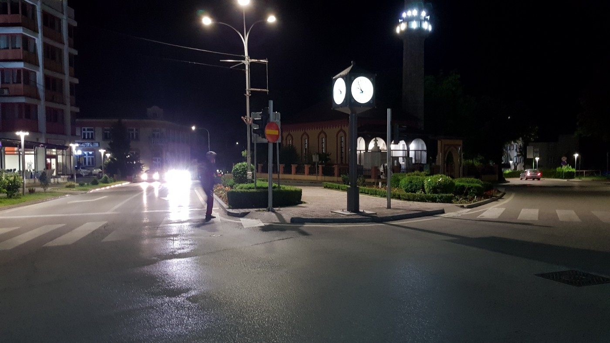
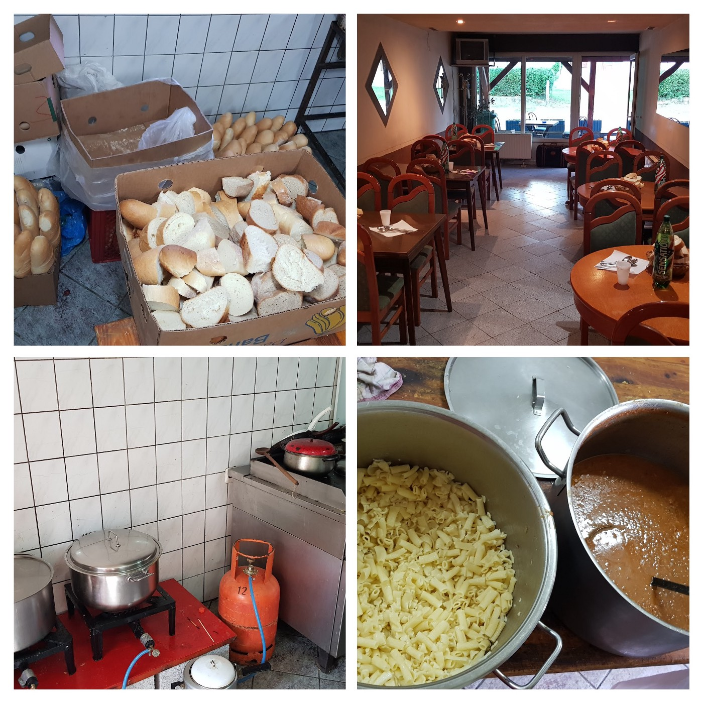
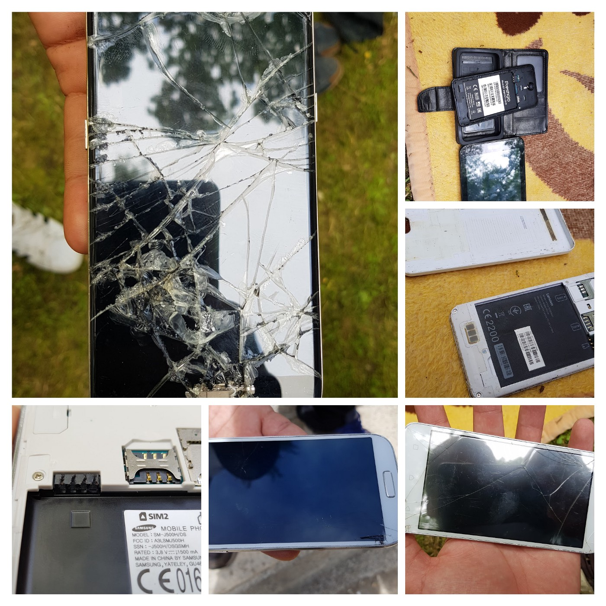
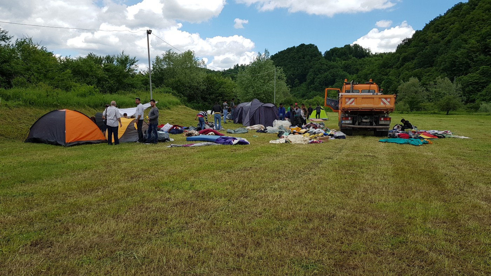
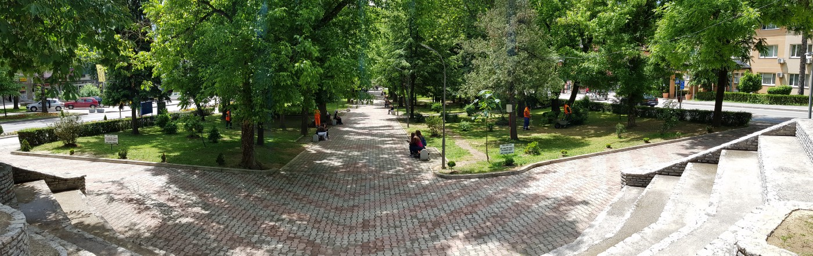

### AYS Special from Bosnia — The unique solidarity of Velika Kladuša
#### Locals together with international volunteers are warmly welcoming people at the Bosnian\-Croatian border and are trying their best to support them and show solidarity\.

Kladuša city center, a smal town in Bosnia where more than 500 people on the move are living at the moment\. Photo AYS\.

Velika Kladuša is a small town known in Bosnia as the rebel city, but also an area where, throughout history, many people have left for other countries, looking for jobs or a better life\. Some have moved to nearby Croatia, some to Slovenia or Austria, or to other western European cities\.

This year, Kladuša has become a place to which people are coming\. Today, hundreds of people on the move are there, many sleeping rough in the streets and park, or abandoned buildings\.

There is not much industry in Kladuša, but compared to other regions in Bosnia and Herzegovina—one of the poorest countries in Europe—the city seems to be quite wealthy and offers several supermarkets, restaurants, cafés, bars and hotels\.

Velika Kladuša is located right by the border and the region is surrounded by Croatian territory to the east, north, and west\. This is why it has become an important point for people on the move\. The distance from Kladuša to Slovenia is less than 70 kilometers\. However, people have to cross Croatia to get there, and with all the illegal push\-back from that side, not many manage to find their way and Kladuša is becoming a bottleneck, a place where people are stuck\.

Bosnian government has been reacting very slowly, if at all, and the same is true for the big organizations; people have been left without basic help, including accommodation, food, medical care… So locals, who went through similar experience during the war in this country from 1992 to 1995, decided to be there for all the people who need help\.

#### Unique solidarity

For Europe, the situation is nothing new after having what has been going on in Idomeni, Belgrade, Röszke, Kelebija, Ventimiglia, Paris…just to name a few locations\. What makes this situation special and extraordinary in Velika Kladuša, is the response of the locals\.

At this point, together with a small number of international volunteers, they are handling the situation quite well\. Hotel owners and private individuals have been accommodating people on the move since this winter; hairdressers are giving free hair cuts; restaurant owners are offering free drinks or meals if people cannot pay, and even if they don’t order something, they are welcome to spend a few hours in a cosy place and use the free Wi\-Fi\.

At the “Kod Latana” restaurant, close to the city center, a group of local people and volunteers of the former [Soul Food Kitchen](https://www.facebook.com/dirtybunch/) provide a free meal daily\. At first, locals were financing everything themselves\. Donations started coming in recently, mostly through the small Bosnian charity [pomozi\.ba](http://pomozi.ba) , supported by local population and companies, but also personal donations\. During Ramadan, when two meals are served each day, and with the increasing number of people, this help is more then needed\.

International volunteers recently began coming to Kladuša, too\. A warehouse for distributing donated clothes and the [NoName Kitchen](https://www.facebook.com/NoNameKitchenBelgrade/) ’s mobile showers were set\-up\.

Nevertheless, the people in Kladuša and their hospitality toward strangers are impressive\.

In the restaurant “Kod Latana” they come not only for a free meal, but to find a place to rest, feel safe, and enjoy quiet for a time\. The locals set the rules, and food is served as in restaurant; everybody has a place to sit, people serve them, and unlike in many other places, they use proper cutlery and dishes here for food\. The food is domestic, Bosnian\.

“If they are here, the situation for them must have been bad,” one local explained their solidarity\.

Impressions from the restaurant\.

The region of Velika Kladuša was ravaged by the Bosnian war in the 90s\. The memory of war, loss and the poverty that came after has created a very different situation than the situation in most of the other countries where people who have been on the move so far\.

Almost everybody in Kladuša felt the war\. Now, when they meet with these people who are going through the same things, they are determined to do their best to support them\. And the people they are helping feel it\. “People here are very good,” is the sentence ofter heard by people on the move in Kladuša\. “Also, the police here are very good,” they always add referring to the very humane way they are being treated by the local police\. Many are not aware that many of the people among local police officers grew up in war, have themselves been refugees, have migrants in their families, or most probably, are dreaming of leaving Bosnia soon as they are not able to cope with the difficult life in this country\.

On the other, Croatian, side of the border, the police treatment is much different\. This is glaringly visible almost every time when people come back after another “game” and another push\-back\. The chance that they will make it over the border into the EU is so slim that they call every attempt “a game”\.

“The Croatian police are a big problem,” everyone in the park in Kladuša will say\. Some are coming back with wounds, even broken bones, smashed phones\. The displays and sim\-card slots are broken, the memory cards and batteries removed, the photos and info deleted\. This makes it harder to verify their stay on Croatian soil or record evidence about the push\-back\.

Testimonies of phones allegedly destroyed by the Croatian police\.

Recently, the park where most of the people have been staying for months, has been cleared and now the municipality is trying to prevent people from staying there during the night or putting up tents\. They are trying to create a camp close to the city, in a field surrounded by two rivers\.

The field is about 15 minutes walk from the city center\. On the day of eviction, the people were able to carry all their belongings, while the tents were transported by a truck\. Additionally, the transfer was not conducted by the police but by a communal service, so it was done in a humane way\.

By the new rule, the people are welcome in the city during the day, but at night they should sleep at the camp, if not in hostels, hotels or private accommodation\.

However, the eviction was not well planned in advance — as happens during most evictions\. The camp was not ready for the people\. There is running water, but no electricity, toilets, showers or Wi\-Fi\. The municipality promised all these things\. Toilets arrived on the day of the eviction, but many problems persist\. One is that it is an open field with almost no shade, and the weather is becoming very hot in Kladuša\.

However, the municipality is trying to coordinate with local and international volunteers to meet the needs of the guests as best as possible\. Thanks to the extraordinary efforts of the residents, even after more than four months, the situation is still calm\.

Before the eviction, an estimated 50 to 100 people were sleeping rough\.

People unloading their belongings at the field\.

With the growing number of people coming to Velika Kladuša, it is feared, that the opening and welcoming attitude may shift\. Long\-term volunteers might remember the pictures and stories of the locals in Serbia and Croatia from 2015\. When the borders were \(more or less\) open, locals were providing clothes, food, showers in their houses, sometimes in tears as they were reminded of their own plight as refugees\. Many are afraid now that, if the situation in Velika Kladuša becomes a permanent one with even more people arriving, the mood may shift\.

The park after the eviction\.

Hence, international volunteers should be prepared to respond to calls and needs quickly\. For now, the locals are managing quite well, but are in need of financial donations to be able to continue feeding the people\. When coming from abroad and trying to install structures or to support, volunteers should coordinate with the local groups and join forces to avoid parallel structures and tensions with the locals\.

In the long\-term, Velika Kladuša might end up like Röszke, Kelebija or Šid, or, even worse, like Idomeni, as a part of an ever\-changing route to Western and Northern Europe and the last stop before reaching an EU country\. But for now, its guests will remember the big hearts of the residents and the support they get there\.

**_\(Written and all photos by: Niklas Golitschek, AYS volunteer\)_**

**We strive to echo correct news from the ground through collaboration and fairness\.**

**Every effort has been made to credit organizations and individuals with regard to the supply of information, video, and photo material \(in cases where the source wanted to be accredited\) \. Please notify us regarding corrections\.**

**If there’s anything you want to share or comment, contact us through Facebook or write to: areyousyrious@gmail\.com**

_Converted [Medium Post](https://medium.com/are-you-syrious/ays-special-from-bosnia-the-unique-solidarity-of-velika-kladu%C5%A1a-a34ed8140357) by [ZMediumToMarkdown](https://github.com/ZhgChgLi/ZMediumToMarkdown)._
